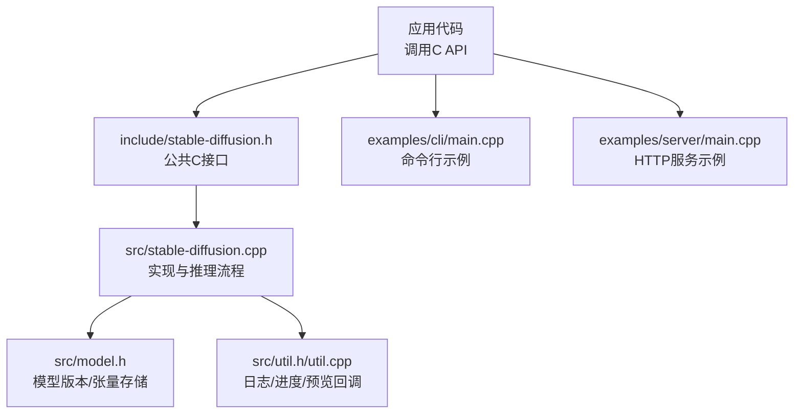
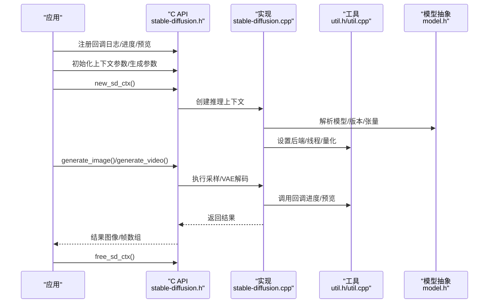
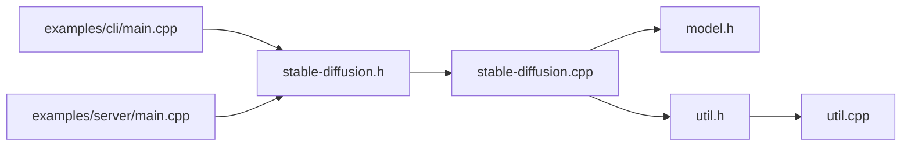

# API参考

<cite>
**本文引用的文件**
- [stable-diffusion.h](file://include/stable-diffusion.h)
- [stable-diffusion.cpp](file://src/stable-diffusion.cpp)
- [model.h](file://src/model.h)
- [util.h](file://src/util.h)
- [util.cpp](file://src/util.cpp)
- [main.cpp（CLI示例）](file://examples/cli/main.cpp)
- [main.cpp（服务器示例）](file://examples/server/main.cpp)
</cite>

## 目录
1. [简介](#简介)
2. [项目结构](#项目结构)
3. [核心组件](#核心组件)
4. [架构总览](#架构总览)
5. [详细组件分析](#详细组件分析)
6. [依赖关系分析](#依赖关系分析)
7. [性能考量](#性能考量)
8. [故障排查指南](#故障排查指南)
9. [结论](#结论)
10. [附录：API映射与绑定指导](#附录api映射与绑定指导)

## 简介
本文件为“稳定扩散.cpp”的完整C接口API参考，覆盖公共函数、数据结构、枚举、常量、回调机制、错误处理与状态管理，并提供面向多语言绑定的映射建议。内容基于仓库中的头文件与实现文件进行系统化整理，确保开发者能够准确理解并集成该库用于图像/视频生成、模型加载与卸载、推理上下文管理、缓存与采样器配置等场景。

## 项目结构
- 头文件层：对外公开的C接口定义位于 include/stable-diffusion.h，包含所有公共API、数据结构、枚举与回调类型。
- 实现层：核心逻辑在 src/stable-diffusion.cpp 中，负责模型初始化、推理流程、采样、VAE解码、回调调度等。
- 工具与模型抽象：src/util.h/util.cpp 提供日志、进度、预览回调设置与辅助工具；src/model.h 定义模型版本与张量存储等内部结构。
- 示例：examples/cli/main.cpp 与 examples/server/main.cpp 展示了典型用法，包括上下文创建、参数初始化、生成调用与回调注册。

图表来源
- [stable-diffusion.h:1-423](file://include/stable-diffusion.h#L1-L423)
- [stable-diffusion.cpp:1-200](file://src/stable-diffusion.cpp#L1-L200)
- [model.h:1-200](file://src/model.h#L1-L200)
- [util.h:1-94](file://src/util.h#L1-L94)
- [util.cpp:411-453](file://src/util.cpp#L411-L453)
- [main.cpp（CLI示例）:477-520](file://examples/cli/main.cpp#L477-L520)
- [main.cpp（服务器示例）:1-200](file://examples/server/main.cpp#L1-L200)

章节来源
- [stable-diffusion.h:1-423](file://include/stable-diffusion.h#L1-L423)
- [stable-diffusion.cpp:1-200](file://src/stable-diffusion.cpp#L1-L200)
- [model.h:1-200](file://src/model.h#L1-L200)
- [util.h:1-94](file://src/util.h#L1-L94)
- [util.cpp:411-453](file://src/util.cpp#L411-L453)
- [main.cpp（CLI示例）:477-520](file://examples/cli/main.cpp#L477-L520)
- [main.cpp（服务器示例）:1-200](file://examples/server/main.cpp#L1-L200)

## 核心组件
- 推理上下文：通过 new_sd_ctx/free_sd_ctx 创建与释放推理上下文，承载模型、后端、随机数与参数。
- 生成参数：支持图像与视频生成的参数结构体，包含采样方法、调度器、引导强度、LoRA、控制图、掩码、VAE平铺等。
- 回调机制：日志回调、进度回调、预览回调，用于实时反馈生成状态与中间结果。
- 缓存与量化：支持多种缓存模式与权重类型（ggml类型映射），可按需选择量化类型以平衡精度与显存。
- 上采样：提供独立的上采样上下文与接口，支持外部ESRGAN模型。

章节来源
- [stable-diffusion.h:338-423](file://include/stable-diffusion.h#L338-L423)
- [stable-diffusion.cpp:3255-3278](file://src/stable-diffusion.cpp#L3255-L3278)
- [util.cpp:418-453](file://src/util.cpp#L418-L453)

## 架构总览
下图展示了从应用到推理引擎的关键交互路径，以及回调与资源管理的职责边界。

图表来源
- [stable-diffusion.h:344-423](file://include/stable-diffusion.h#L344-L423)
- [stable-diffusion.cpp:3255-3278](file://src/stable-diffusion.cpp#L3255-L3278)
- [util.cpp:418-453](file://src/util.cpp#L418-L453)
- [model.h:23-174](file://src/model.h#L23-L174)

## 详细组件分析

### 公共C接口函数清单与说明
以下为所有对外公开的C接口函数，按功能分组并给出签名、参数、返回值与典型用法要点。

- 上下文管理
  - new_sd_ctx(const sd_ctx_params_t*)
    - 功能：创建推理上下文，完成模型加载与后端初始化。
    - 参数：上下文参数指针，包含模型路径、量化类型、线程数、LoRA模式、是否仅解码等。
    - 返回：推理上下文指针；失败返回空。
    - 使用要点：必须先初始化上下文参数，再创建上下文；成功后需在完成后释放。
    - 章节来源
      - [stable-diffusion.h:370-371](file://include/stable-diffusion.h#L370-L371)
      - [stable-diffusion.cpp:3259-3277](file://src/stable-diffusion.cpp#L3259-L3277)

  - free_sd_ctx(sd_ctx_t*)
    - 功能：释放推理上下文。
    - 参数：上下文指针。
    - 返回：无。
    - 使用要点：与new_sd_ctx成对使用。
    - 章节来源
      - [stable-diffusion.h:371-371](file://include/stable-diffusion.h#L371-L371)
      - [stable-diffusion.cpp:3259-3277](file://src/stable-diffusion.cpp#L3259-L3277)

- 生成函数
  - generate_image(sd_ctx_t*, const sd_img_gen_params_t*)
    - 功能：执行单张图像生成。
    - 参数：上下文指针、图像生成参数。
    - 返回：动态分配的图像数组；失败返回空。
    - 使用要点：根据batch_count返回对应数量的图像；调用方负责释放。
    - 章节来源
      - [stable-diffusion.h:381-381](file://include/stable-diffusion.h#L381-L381)
      - [stable-diffusion.cpp:4344-4373](file://src/stable-diffusion.cpp#L4344-L4373)

  - generate_video(sd_ctx_t*, const sd_vid_gen_params_t*, int* num_frames_out)
    - 功能：执行视频生成。
    - 参数：上下文指针、视频生成参数、输出帧数指针。
    - 返回：动态分配的帧数组；失败返回空。
    - 使用要点：num_frames_out返回实际帧数；调用方负责释放。
    - 章节来源
      - [stable-diffusion.h:384-384](file://include/stable-diffusion.h#L384-L384)
      - [stable-diffusion.cpp:4000-4373](file://src/stable-diffusion.cpp#L4000-L4373)

- 参数初始化与序列化
  - sd_ctx_params_init(sd_ctx_params_t*)
  - sd_ctx_params_to_str(const sd_ctx_params_t*)
    - 功能：初始化上下文参数或转为字符串描述。
    - 章节来源
      - [stable-diffusion.h:367-368](file://include/stable-diffusion.h#L367-L368)

  - sd_img_gen_params_init(sd_img_gen_params_t*)
  - sd_img_gen_params_to_str(const sd_img_gen_params_t*)
    - 功能：初始化/序列化图像生成参数。
    - 章节来源
      - [stable-diffusion.h:379-380](file://include/stable-diffusion.h#L379-L380)

  - sd_vid_gen_params_init(sd_vid_gen_params_t*)
    - 功能：初始化视频生成参数。
    - 章节来源
      - [stable-diffusion.h:383-383](file://include/stable-diffusion.h#L383-L383)
      - [stable-diffusion.cpp:3239-3253](file://src/stable-diffusion.cpp#L3239-L3253)

  - sd_sample_params_init(sd_sample_params_t*)
  - sd_sample_params_to_str(const sd_sample_params_t*)
    - 功能：初始化/序列化采样参数。
    - 章节来源
      - [stable-diffusion.h:373-374](file://include/stable-diffusion.h#L373-L374)

- 默认采样与调度器
  - sd_get_default_sample_method(const sd_ctx_t*)
  - sd_get_default_scheduler(const sd_ctx_t*, enum sample_method_t)
    - 功能：根据上下文与采样方法推断默认调度器。
    - 章节来源
      - [stable-diffusion.h:376-377](file://include/stable-diffusion.h#L376-L377)

- 类型与名称转换
  - sd_type_name(enum sd_type_t), str_to_sd_type(const char*)
  - sd_rng_type_name(enum rng_type_t), str_to_rng_type(const char*)
  - sd_sample_method_name(enum sample_method_t), str_to_sample_method(const char*)
  - sd_scheduler_name(enum scheduler_t), str_to_scheduler(const char*)
  - sd_prediction_name(enum prediction_t), str_to_prediction(const char*)
  - sd_preview_name(enum preview_t), str_to_preview(const char*)
  - sd_lora_apply_mode_name(enum lora_apply_mode_t), str_to_lora_apply_mode(const char*)
    - 功能：枚举与字符串互转。
    - 章节来源
      - [stable-diffusion.h:350-363](file://include/stable-diffusion.h#L350-L363)

- 缓存参数
  - sd_cache_params_init(sd_cache_params_t*)
    - 功能：初始化缓存参数。
    - 章节来源
      - [stable-diffusion.h:365-365](file://include/stable-diffusion.h#L365-L365)

- 辅助与工具
  - sd_set_log_callback(sd_log_cb_t, void*)
  - sd_set_progress_callback(sd_progress_cb_t, void*)
  - sd_set_preview_callback(sd_preview_cb_t, enum preview_t, int, bool, bool, void*)
    - 功能：注册日志、进度、预览回调。
    - 章节来源
      - [stable-diffusion.h:344-346](file://include/stable-diffusion.h#L344-L346)
      - [util.cpp:418-453](file://src/util.cpp#L418-L453)

  - sd_get_num_physical_cores(), sd_get_system_info()
    - 功能：查询系统信息。
    - 章节来源
      - [stable-diffusion.h:347-348](file://include/stable-diffusion.h#L347-L348)

  - sd_version(), sd_commit()
    - 功能：查询版本与提交信息。
    - 章节来源
      - [stable-diffusion.h:415-416](file://include/stable-diffusion.h#L415-L416)

- 上采样
  - new_upscaler_ctx(const char*, bool, bool, int, int)
  - free_upscaler_ctx(upscaler_ctx_t*)
  - upscale(upscaler_ctx_t*, sd_image_t, uint32_t)
  - get_upscale_factor(upscaler_ctx_t*)
    - 功能：创建/释放上采样上下文，执行上采样，查询放大倍数。
    - 章节来源
      - [stable-diffusion.h:386-399](file://include/stable-diffusion.h#L386-L399)

- 模型转换与预处理
  - convert(const char*, const char*, const char*, enum sd_type_t, const char*, bool)
    - 功能：将模型转换为GGUF格式。
    - 章节来源
      - [stable-diffusion.h:401-406](file://include/stable-diffusion.h#L401-L406)

  - preprocess_canny(sd_image_t, float, float, float, float, bool)
    - 功能：对输入图像进行Canny边缘检测预处理。
    - 章节来源
      - [stable-diffusion.h:408-413](file://include/stable-diffusion.h#L408-L413)

### 数据结构与枚举

- sd_ctx_params_t：推理上下文参数
  - 关键字段：模型路径、文本编码器路径、扩散模型路径、VAE路径、嵌入、LoRA应用模式、量化类型、随机数类型、预测类型、线程数、是否仅解码、是否立即释放参数、是否启用内存映射、是否将CLIP/VAE/ControlNet置于CPU、Flash Attention开关、循环卷积开关、特定模型的特殊选项等。
  - 章节来源
    - [stable-diffusion.h:148-204](file://include/stable-diffusion.h#L148-L204)

- sd_img_gen_params_t / sd_vid_gen_params_t：图像/视频生成参数
  - 关键字段：LoRA列表、提示词、反向提示词、CLIP跳过层数、初始/结束图像、参考图像、自动调整尺寸、增加索引、掩码图像、尺寸、采样参数、强度、种子、批量数、控制图像、控制强度、PhotoMaker参数、VAE平铺参数、缓存参数等。
  - 章节来源
    - [stable-diffusion.h:290-336](file://include/stable-diffusion.h#L290-L336)

- sd_sample_params_t：采样参数
  - 关键字段：引导参数、调度器、采样方法、采样步数、eta、时间步偏移、自定义sigma、流式位移等。
  - 章节来源
    - [stable-diffusion.h:228-238](file://include/stable-diffusion.h#L228-L238)

- sd_cache_params_t：缓存参数
  - 关键字段：缓存模式、重用阈值、起止百分比、误差衰减率、相对阈值、重置误差策略、计算块数、最大预热步数、最大缓存步数、连续缓存步数、导数阶数、跳过间隔、SCM掩码、SCM策略、谱分析窗口等。
  - 章节来源
    - [stable-diffusion.h:257-282](file://include/stable-diffusion.h#L257-L282)

- sd_tiling_params_t / sd_slg_params_t / sd_guidance_params_t：辅助参数
  - 章节来源
    - [stable-diffusion.h:148-155](file://include/stable-diffusion.h#L148-L155)
    - [stable-diffusion.h:213-226](file://include/stable-diffusion.h#L213-L226)

- 枚举与常量
  - 随机数类型：STD_DEFAULT_RNG、CUDA_RNG、CPU_RNG、RNG_TYPE_COUNT
  - 采样方法：EULER_SAMPLE_METHOD、EULER_A_SAMPLE_METHOD、HEUN_SAMPLE_METHOD、DPM2_SAMPLE_METHOD、DPMPP2S_A_SAMPLE_METHOD、DPMPP2M_SAMPLE_METHOD、DPMPP2Mv2_SAMPLE_METHOD、IPNDM_SAMPLE_METHOD、IPNDM_V_SAMPLE_METHOD、LCM_SAMPLE_METHOD、DDIM_TRAILING_SAMPLE_METHOD、TCD_SAMPLE_METHOD、RES_MULTISTEP_SAMPLE_METHOD、RES_2S_SAMPLE_METHOD、SAMPLE_METHOD_COUNT
  - 调度器：DISCRETE_SCHEDULER、KARRAS_SCHEDULER、EXPONENTIAL_SCHEDULER、AYS_SCHEDULER、GITS_SCHEDULER、SGM_UNIFORM_SCHEDULER、SIMPLE_SCHEDULER、SMOOTHSTEP_SCHEDULER、KL_OPTIMAL_SCHEDULER、LCM_SCHEDULER、BONG_TANGENT_SCHEDULER、SCHEDULER_COUNT
  - 预测类型：EPS_PRED、V_PRED、EDM_V_PRED、FLOW_PRED、FLUX_FLOW_PRED、FLUX2_FLOW_PRED、PREDICTION_COUNT
  - 权重量化类型：SD_TYPE_F32、SD_TYPE_F16、SD_TYPE_Q4_0、…、SD_TYPE_COUNT
  - 日志级别：SD_LOG_DEBUG、SD_LOG_INFO、SD_LOG_WARN、SD_LOG_ERROR
  - 预览模式：PREVIEW_NONE、PREVIEW_PROJ、PREVIEW_TAE、PREVIEW_VAE、PREVIEW_COUNT
  - LoRA应用模式：LORA_APPLY_AUTO、LORA_APPLY_IMMEDIATELY、LORA_APPLY_AT_RUNTIME、LORA_APPLY_MODE_COUNT
  - 缓存模式：SD_CACHE_DISABLED、SD_CACHE_EASYCACHE、SD_CACHE_UCACHE、SD_CACHE_DBCACHE、SD_CACHE_TAYLORSEER、SD_CACHE_CACHE_DIT、SD_CACHE_SPECTRUM
  - 章节来源
    - [stable-diffusion.h:31-139](file://include/stable-diffusion.h#L31-L139)
    - [stable-diffusion.h:247-255](file://include/stable-diffusion.h#L247-L255)

### 回调机制与状态管理
- 回调类型
  - 日志回调：sd_log_cb_t(level, text, data)
  - 进度回调：sd_progress_cb_t(step, steps, time, data)
  - 预览回调：sd_preview_cb_t(step, frame_count, frames, is_noisy, data)
- 注册与获取
  - sd_set_log_callback / sd_set_progress_callback / sd_set_preview_callback
  - sd_get_preview_callback / sd_get_preview_callback_data / sd_get_preview_mode / sd_get_preview_interval / sd_should_preview_denoised / sd_should_preview_noisy
- 状态与线程
  - sd_get_num_physical_cores / sd_get_system_info
- 章节来源
  - [stable-diffusion.h:340-346](file://include/stable-diffusion.h#L340-L346)
  - [util.cpp:418-453](file://src/util.cpp#L418-L453)

### 错误处理策略
- 返回值约定：失败返回空指针或错误状态；成功返回有效句柄或结果。
- 日志输出：通过sd_set_log_callback统一输出调试/信息/警告/错误日志。
- 资源释放：上下文与生成结果均需由调用方主动释放，避免泄漏。
- 章节来源
  - [stable-diffusion.cpp:3259-3277](file://src/stable-diffusion.cpp#L3259-L3277)
  - [stable-diffusion.cpp:4344-4373](file://src/stable-diffusion.cpp#L4344-L4373)
  - [util.cpp:418-453](file://src/util.cpp#L418-L453)

### 使用示例与最佳实践
- CLI示例展示了：
  - 注册日志与预览回调
  - 初始化上下文与生成参数
  - 选择默认采样方法与调度器
  - 调用生成函数并保存结果
  - 章节来源
    - [main.cpp（CLI示例）:505-520](file://examples/cli/main.cpp#L505-L520)
    - [main.cpp（CLI示例）:706-793](file://examples/cli/main.cpp#L706-L793)

- 服务器示例展示了：
  - 基于HTTP的请求解析与参数构建
  - 将生成结果编码为Base64并通过HTTP响应返回
  - 章节来源
    - [main.cpp（服务器示例）:1-200](file://examples/server/main.cpp#L1-L200)

## 依赖关系分析
- 外部依赖
  - ggml系列后端（CPU/CUDA/Metal/Vulkan/OpenCL/SYCL）：通过后端初始化与张量操作支撑推理。
  - 第三方库：httplib（HTTP服务）、stb_image系列（图像IO）、json.hpp（JSON处理）等。
- 内部模块
  - 模型加载与版本识别：model.h中定义的SDVersion与TensorStorage。
  - 工具与回调：util.h/util.cpp提供日志、进度、预览回调与辅助函数。
- 章节来源
  - [stable-diffusion.cpp:171-226](file://src/stable-diffusion.cpp#L171-L226)
  - [model.h:23-174](file://src/model.h#L23-L174)
  - [util.h:1-94](file://src/util.h#L1-L94)

图表来源
- [stable-diffusion.h:1-423](file://include/stable-diffusion.h#L1-L423)
- [stable-diffusion.cpp:1-200](file://src/stable-diffusion.cpp#L1-L200)
- [model.h:1-200](file://src/model.h#L1-L200)
- [util.h:1-94](file://src/util.h#L1-L94)
- [util.cpp:1-200](file://src/util.cpp#L1-L200)
- [main.cpp（CLI示例）:1-200](file://examples/cli/main.cpp#L1-L200)
- [main.cpp（服务器示例）:1-200](file://examples/server/main.cpp#L1-L200)

## 性能考量
- 后端选择：优先使用GPU后端（CUDA/Metal/Vulkan/OpenCL/SYCL）以获得更高吞吐；若不可用则回退至CPU。
- Flash Attention：在支持的模型与版本上启用可提升注意力计算效率。
- 循环卷积：在某些模型上开启可改善边界处理。
- 量化类型：根据显存与精度需求选择合适的sd_type_t，如F16/Q4_K等。
- 线程数：合理设置n_threads以平衡吞吐与延迟。
- VAE平铺：对大图像生成时启用平铺减少显存占用。
- 章节来源
  - [stable-diffusion.cpp:171-226](file://src/stable-diffusion.cpp#L171-L226)
  - [stable-diffusion.h:188-199](file://include/stable-diffusion.h#L188-L199)

## 故障排查指南
- 常见问题
  - 模型加载失败：检查模型路径与文件完整性；确认版本兼容性。
  - 显存不足：降低分辨率、启用VAE平铺、切换量化类型、关闭Flash Attention。
  - 生成卡住：检查采样方法与调度器配置；确认回调未阻塞主线程。
  - 回调无效：确认已正确注册回调并传入正确的回调数据指针。
- 章节来源
  - [stable-diffusion.cpp:257-352](file://src/stable-diffusion.cpp#L257-L352)
  - [util.cpp:418-453](file://src/util.cpp#L418-L453)

## 结论
本API参考系统梳理了稳定扩散.cpp的C接口能力，涵盖上下文管理、模型加载/卸载、图像/视频生成、采样与调度器、缓存与量化、回调与日志、上采样与预处理等核心功能。结合示例工程，开发者可以快速集成并扩展到不同应用场景。建议在生产环境中关注后端选择、量化策略与资源释放，以获得最佳性能与稳定性。

## 附录：API映射与绑定指导
- C到Python绑定建议
  - 使用ctypes或cffi绑定C函数与回调；注意回调函数的生命周期与线程安全。
  - 对于结构体，建议使用ctypes.Structure或cffi的cdef定义，并提供to/from字节序列的辅助函数。
  - 对于动态分配的图像数组，建议在Python侧持有所有权并在对象销毁时释放。
- C到Go绑定建议
  - 使用cgo绑定；为回调函数提供Go包装器并传递unsafe.Pointer作为数据指针。
  - 对于结构体，使用//export标记导出C兼容的结构体布局。
- C到Rust绑定建议
  - 使用bindgen生成绑定；为回调函数提供unsafe extern "C"包装。
  - 对于动态分配的数组，建议通过Box或Vec包装并提供释放函数。
- 通用注意事项
  - 所有new_*与generate_*函数返回的内存需由调用方释放。
  - 回调函数应尽量轻量，避免长时间阻塞。
  - 在多线程环境下，确保回调与资源访问的同步。
- 章节来源
  - [stable-diffusion.h:344-423](file://include/stable-diffusion.h#L344-L423)
  - [stable-diffusion.cpp:3259-3277](file://src/stable-diffusion.cpp#L3259-L3277)
  - [main.cpp（CLI示例）:505-520](file://examples/cli/main.cpp#L505-L520)
  - [main.cpp（服务器示例）:1-200](file://examples/server/main.cpp#L1-L200)