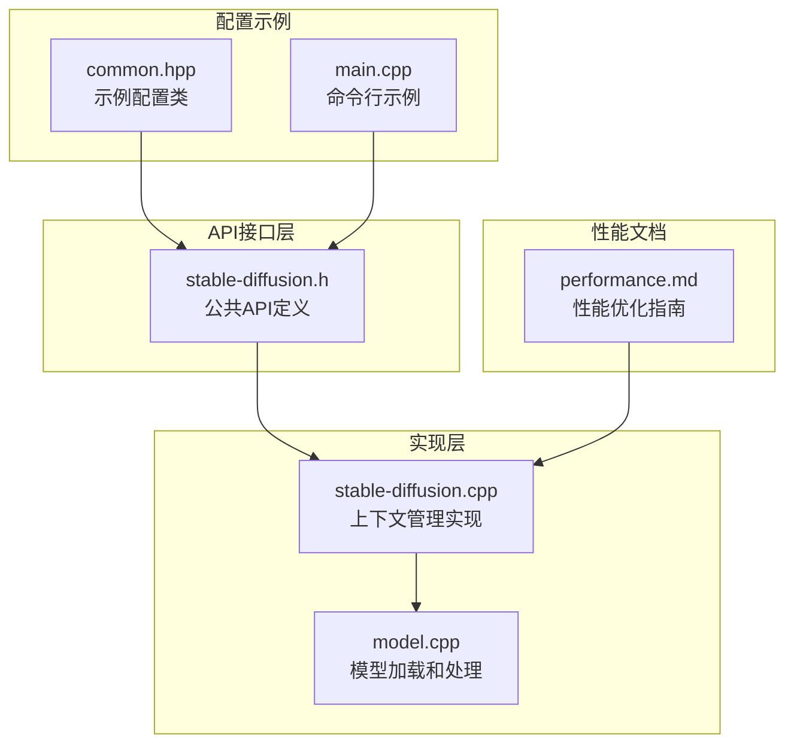
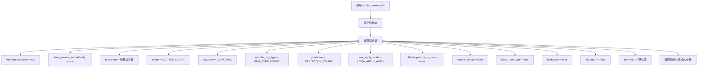
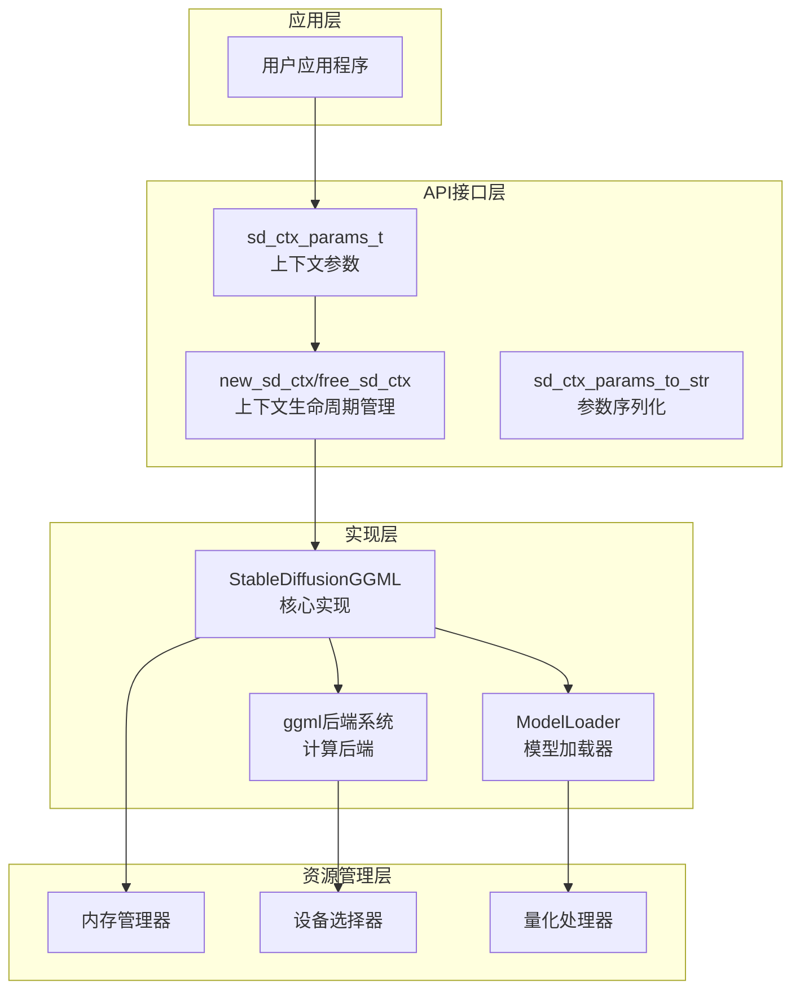
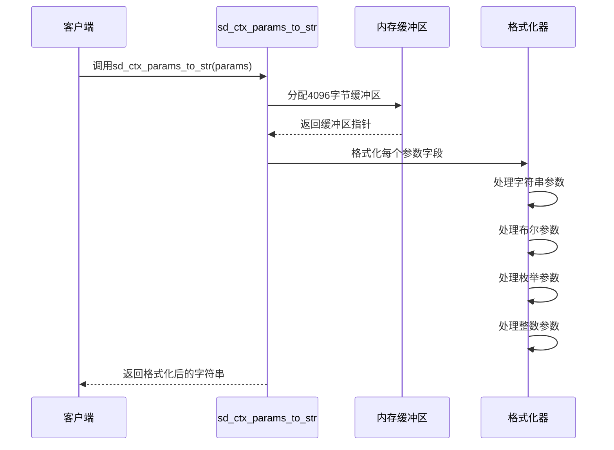
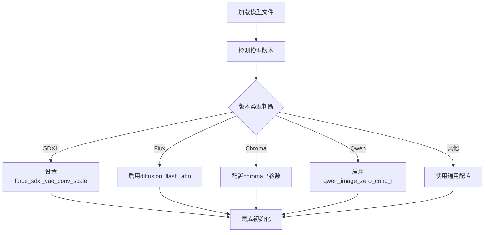
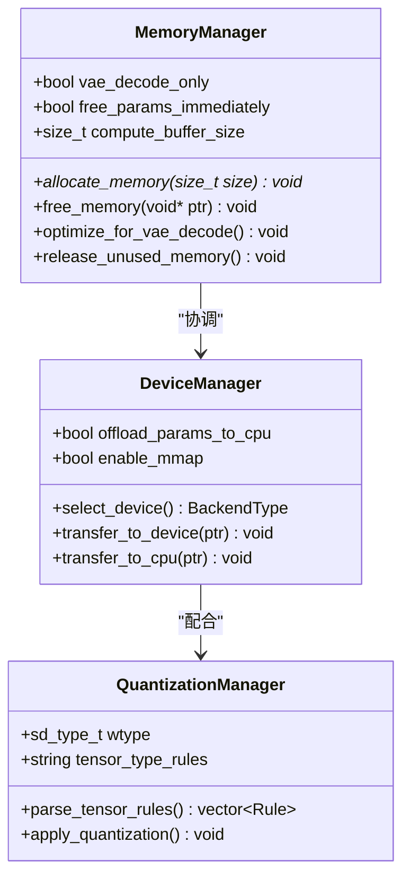
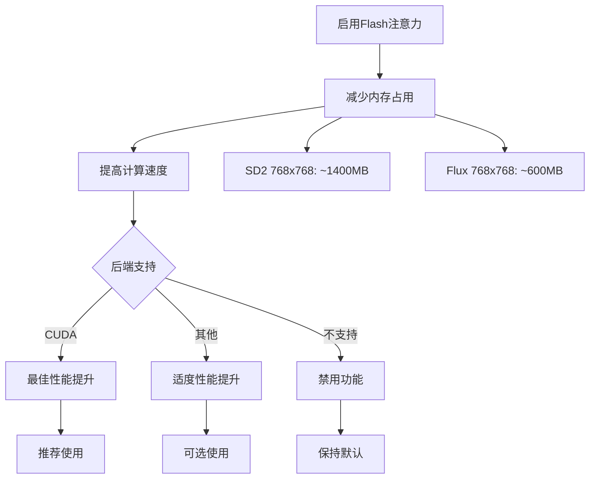

# 上下文管理API

<cite>
**本文档引用的文件**
- [stable-diffusion.h](file://include/stable-diffusion.h)
- [stable-diffusion.cpp](file://src/stable-diffusion.cpp)
- [model.cpp](file://src/model.cpp)
- [performance.md](file://docs/performance.md)
- [ggml.c](file://ggml/src/ggml.c)
- [common.hpp](file://examples/common/common.hpp)
- [main.cpp](file://examples/cli/main.cpp)
</cite>

## 目录
1. [简介](#简介)
2. [项目结构](#项目结构)
3. [核心组件](#核心组件)
4. [架构概览](#架构概览)
5. [详细组件分析](#详细组件分析)
6. [依赖关系分析](#依赖关系分析)
7. [性能考虑](#性能考虑)
8. [故障排除指南](#故障排除指南)
9. [结论](#结论)

## 简介

上下文管理API是稳定扩散系统的核心接口，负责管理模型加载、参数配置、内存分配和设备选择。本文档详细说明了sd_ctx_params_t结构体的所有配置选项，包括模型路径设置、线程数配置、量化类型选择等，并提供了完整的初始化流程、默认值设置和使用方法。

## 项目结构

稳定扩散项目的上下文管理API主要分布在以下关键文件中：

**图表来源**
- [stable-diffusion.h:157-204](file://include/stable-diffusion.h#L157-L204)
- [stable-diffusion.cpp:3255-3286](file://src/stable-diffusion.cpp#L3255-L3286)
- [model.cpp:1-50](file://src/model.cpp#L1-L50)

## 核心组件

### sd_ctx_params_t 结构体详解

sd_ctx_params_t是上下文管理的核心配置结构体，包含了所有模型配置选项：

#### 基础模型路径配置
- `model_path`: 主模型文件路径
- `clip_l_path`: CLIP L模型路径
- `clip_g_path`: CLIP G模型路径  
- `clip_vision_path`: CLIP视觉编码器路径
- `t5xxl_path`: T5XXL文本编码器路径
- `llm_path`: LLM语言模型路径
- `llm_vision_path`: LLM视觉编码器路径
- `diffusion_model_path`: 扩散模型路径
- `high_noise_diffusion_model_path`: 高噪声扩散模型路径
- `vae_path`: VAE解码器路径
- `taesd_path`: TAESD模型路径
- `control_net_path`: 控制网络路径
- `photo_maker_path`: PhotoMaker模型路径

#### 模型参数配置
- `embeddings`: 嵌入向量数组指针
- `embedding_count`: 嵌入向量数量
- `tensor_type_rules`: 张量类型规则字符串
- `vae_decode_only`: 仅进行VAE解码模式
- `free_params_immediately`: 立即释放参数内存

#### 计算资源配置
- `n_threads`: 线程数配置
- `wtype`: 权重数据类型
- `rng_type`: 随机数生成器类型
- `sampler_rng_type`: 采样器随机数生成器类型
- `prediction`: 预测类型
- `lora_apply_mode`: LoRA应用模式

#### 设备和内存管理
- `offload_params_to_cpu`: 将参数卸载到CPU
- `enable_mmap`: 启用内存映射
- `keep_clip_on_cpu`: 将CLIP保持在CPU
- `keep_control_net_on_cpu`: 将控制网络保持在CPU
- `keep_vae_on_cpu`: 将VAE保持在CPU

#### 性能优化选项
- `flash_attn`: 启用Flash注意力机制
- `diffusion_flash_attn`: 在扩散模型中启用Flash注意力
- `tae_preview_only`: 仅使用TAESD预览
- `diffusion_conv_direct`: 直接卷积优化
- `vae_conv_direct`: VAE卷积直接模式
- `circular_x/circular_y`: 循环边界条件
- `force_sdxl_vae_conv_scale`: 强制SDXL VAE卷积缩放

#### 特定模型功能
- `chroma_use_dit_mask`: Chroma DIT掩码使用
- `chroma_use_t5_mask`: Chroma T5掩码使用
- `chroma_t5_mask_pad`: Chroma T5掩码填充
- `qwen_image_zero_cond_t`: Qwen图像零条件时间

**章节来源**
- [stable-diffusion.h:157-204](file://include/stable-diffusion.h#L157-L204)

### 初始化流程

#### sd_ctx_params_init函数
sd_ctx_params_init函数负责初始化sd_ctx_params_t结构体的所有字段：

**图表来源**
- [stable-diffusion.cpp:3011-3032](file://src/stable-diffusion.cpp#L3011-L3032)

#### 默认值设置策略
- **内存管理**: 默认启用VAE解码和立即释放参数，以优化内存使用
- **计算资源**: 线程数自动设置为物理核心数量
- **量化类型**: 默认使用SD_TYPE_COUNT（由模型决定）
- **随机数生成**: 默认使用CUDA_RNG，采样器使用RNG_TYPE_COUNT
- **设备管理**: 默认不启用CPU卸载和内存映射

**章节来源**
- [stable-diffusion.cpp:3011-3032](file://src/stable-diffusion.cpp#L3011-L3032)

## 架构概览

上下文管理API采用分层架构设计，确保了良好的模块化和可扩展性：

**图表来源**
- [stable-diffusion.cpp:3255-3286](file://src/stable-diffusion.cpp#L3255-L3286)
- [stable-diffusion.h:338-371](file://include/stable-diffusion.h#L338-L371)

## 详细组件分析

### 参数序列化和反序列化

#### sd_ctx_params_to_str函数
sd_ctx_params_to_str函数提供了完整的参数序列化功能：

**图表来源**
- [stable-diffusion.cpp:3034-3107](file://src/stable-diffusion.cpp#L3034-L3107)

#### 反序列化支持
虽然未提供专门的反序列化函数，但可以通过以下方式实现：
- 使用字符串解析器逐行读取序列化输出
- 通过字符串到枚举的转换函数处理枚举类型
- 使用安全的字符串到数值转换处理数值类型

**章节来源**
- [stable-diffusion.cpp:3034-3107](file://src/stable-diffusion.cpp#L3034-L3107)

### 模型类型配置差异

#### 不同模型类型的特殊参数

| 模型类型 | 特殊参数 | 默认行为 |
|---------|---------|----------|
| SDXL | `force_sdxl_vae_conv_scale` | 可强制Vae卷积缩放 |
| Flux | `diffusion_flash_attn` | 支持扩散模型Flash注意力 |
| Chroma | `chroma_use_dit_mask/t5_mask` | 启用特定掩码功能 |
| Qwen Image | `qwen_image_zero_cond_t` | 支持零条件时间 |

#### 模型版本检测
系统通过版本检测机制自动适配不同模型类型的配置：

**图表来源**
- [stable-diffusion.cpp:259-357](file://src/stable-diffusion.cpp#L259-L357)

**章节来源**
- [stable-diffusion.cpp:259-357](file://src/stable-diffusion.cpp#L259-L357)

### 内存管理机制

#### 自动内存管理
系统实现了智能的内存管理策略：

**图表来源**
- [stable-diffusion.cpp:3011-3032](file://src/stable-diffusion.cpp#L3011-L3032)
- [model.cpp:1286-1319](file://src/model.cpp#L1286-L1319)

#### 内存优化策略
- **延迟加载**: 仅在需要时加载模型组件
- **按需分配**: 根据实际需求动态分配内存
- **智能释放**: 在生成完成后及时释放临时内存

**章节来源**
- [stable-diffusion.cpp:3011-3032](file://src/stable-diffusion.cpp#L3011-L3032)
- [model.cpp:1286-1319](file://src/model.cpp#L1286-L1319)

## 依赖关系分析

### 组件耦合度分析

**图表来源**
- [stable-diffusion.h:338-371](file://include/stable-diffusion.h#L338-L371)
- [stable-diffusion.cpp:3255-3286](file://src/stable-diffusion.cpp#L3255-L3286)

### 关键依赖关系

| 组件 | 依赖组件 | 用途 |
|------|----------|------|
| sd_ctx_params_t | 枚举类型定义 | 参数配置 |
| new_sd_ctx | StableDiffusionGGML | 上下文创建 |
| ModelLoader | ggml后端 | 模型加载 |
| QuantizationManager | ggml量化系统 | 权重量化 |
| MemoryManager | 系统内存API | 内存管理 |

**章节来源**
- [stable-diffusion.h:338-371](file://include/stable-diffusion.h#L338-L371)
- [stable-diffusion.cpp:3255-3286](file://src/stable-diffusion.cpp#L3255-L3286)

## 性能考虑

### Flash注意力优化

根据性能文档，Flash注意力机制提供了显著的性能提升：

**图表来源**
- [performance.md:1-26](file://docs/performance.md#L1-L26)

### CPU卸载策略

CPU卸载是节省显存的有效方法：

- **优势**: 显著减少VRAM占用，通常不影响生成速度
- **适用场景**: 显存不足或需要运行大型模型
- **注意事项**: 网络传输可能成为瓶颈

### 量化配置优化

系统支持多种量化类型，每种都有不同的性能特征：

| 量化类型 | 内存节省 | 速度影响 | 精度损失 |
|----------|----------|----------|----------|
| Q4_0/Q4_1 | 中等 | 轻微 | 中等 |
| Q5_0/Q5_1 | 中等 | 轻微 | 中等 |
| Q2_K/Q3_K | 大量 | 明显 | 较大 |
| IQ2_XXS | 大量 | 明显 | 较大 |

**章节来源**
- [performance.md:1-26](file://docs/performance.md#L1-L26)
- [ggml.c:7497-7556](file://ggml/src/ggml.c#L7497-L7556)

## 故障排除指南

### 常见问题诊断

#### 模型加载失败
- 检查模型文件路径是否正确
- 验证模型文件完整性
- 确认量化类型与模型兼容

#### 内存不足错误
- 启用CPU卸载功能
- 减少批量大小
- 降低分辨率设置
- 使用更高效的量化类型

#### 性能问题
- 启用Flash注意力（如支持）
- 调整线程数配置
- 优化量化设置
- 检查设备驱动更新

### 调试工具使用

#### 日志级别设置
系统提供多级别的日志输出，便于调试：

- **DEBUG**: 详细的技术信息
- **INFO**: 标准运行信息  
- **WARN**: 警告信息
- **ERROR**: 错误信息

#### 性能监控
- 使用内置计时功能
- 监控内存使用情况
- 分析各组件性能瓶颈

**章节来源**
- [stable-diffusion.h:126-131](file://include/stable-diffusion.h#L126-L131)

## 结论

上下文管理API为稳定扩散系统提供了强大而灵活的配置接口。通过合理的参数配置和优化策略，可以在保证生成质量的同时最大化系统性能。建议开发者根据具体应用场景选择合适的配置组合，并充分利用系统的自动优化功能。

关键要点总结：
- 使用sd_ctx_params_init获得合理的默认配置
- 根据硬件条件调整量化类型和内存策略
- 合理利用Flash注意力和CPU卸载功能
- 通过序列化功能实现配置的持久化和分享