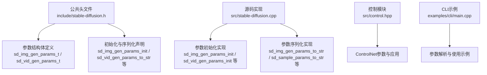
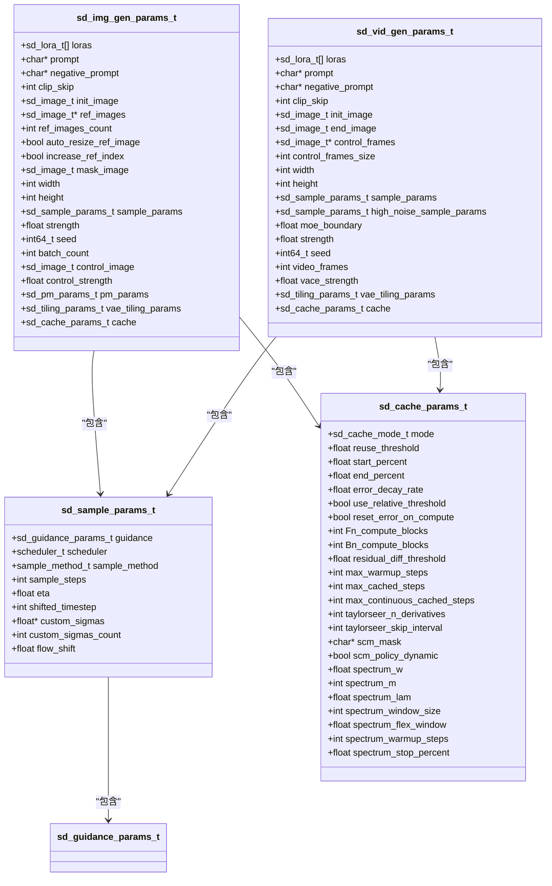
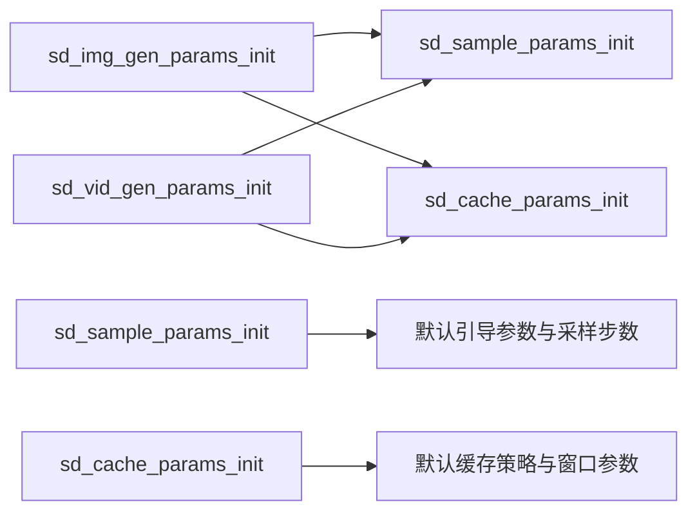
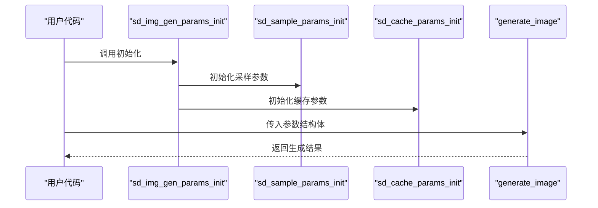

# 参数配置API

<cite>
**本文档引用的文件**
- [stable-diffusion.h](file://include/stable-diffusion.h)
- [stable-diffusion.cpp](file://src/stable-diffusion.cpp)
- [control.hpp](file://src/control.hpp)
- [lora.md](file://docs/lora.md)
- [sd.md](file://docs/sd.md)
- [main.cpp](file://examples/cli/main.cpp)
</cite>

## 目录
1. [简介](#简介)
2. [项目结构](#项目结构)
3. [核心组件](#核心组件)
4. [架构总览](#架构总览)
5. [详细组件分析](#详细组件分析)
6. [依赖关系分析](#依赖关系分析)
7. [性能考量](#性能考量)
8. [故障排查指南](#故障排查指南)
9. [结论](#结论)
10. [附录](#附录)

## 简介
本文件系统化梳理参数配置API，重点覆盖图像生成与视频生成的参数结构体、初始化流程、参数验证与默认值处理、参数转换与序列化、以及在不同模型架构下的差异与兼容性。目标是帮助开发者快速理解并正确使用 sd_img_gen_params_t 与 sd_vid_gen_params_t 的全部配置项，并给出常见参数组合与推荐实践。

## 项目结构
参数配置API位于公共头文件中，核心数据结构与初始化函数实现在源码文件中，控制模块与LoRA应用逻辑在对应模块中实现，CLI示例展示了典型用法。

**图表来源**
- [stable-diffusion.h:290-336](file://include/stable-diffusion.h#L290-L336)
- [stable-diffusion.cpp:3165-3253](file://src/stable-diffusion.cpp#L3165-L3253)
- [control.hpp:342-375](file://src/control.hpp#L342-L375)
- [main.cpp:543-671](file://examples/cli/main.cpp#L543-L671)

**章节来源**
- [stable-diffusion.h:290-336](file://include/stable-diffusion.h#L290-L336)
- [stable-diffusion.cpp:3165-3253](file://src/stable-diffusion.cpp#L3165-L3253)

## 核心组件
- 图像生成参数结构体：sd_img_gen_params_t
- 视频生成参数结构体：sd_vid_gen_params_t
- 采样参数结构体：sd_sample_params_t
- 缓存参数结构体：sd_cache_params_t
- 初始化与序列化函数：sd_img_gen_params_init、sd_vid_gen_params_init、sd_sample_params_init、sd_cache_params_init、sd_img_gen_params_to_str、sd_sample_params_to_str

这些组件共同构成参数配置API的核心，负责描述生成任务所需的提示词、尺寸、采样步数、引导强度、种子、控制输入、LoRA、缓存策略等。

**章节来源**
- [stable-diffusion.h:228-336](file://include/stable-diffusion.h#L228-L336)
- [stable-diffusion.cpp:2983-3200](file://src/stable-diffusion.cpp#L2983-L3200)

## 架构总览
参数配置API采用“结构体 + 初始化函数 + 序列化”的设计模式，既保证了参数的可读性与可维护性，又提供了统一的默认值与可选配置能力。生成流程通过上下文对象与参数结构体协作完成。

**图表来源**
- [stable-diffusion.h:228-336](file://include/stable-diffusion.h#L228-L336)

## 详细组件分析

### 结构体字段详解

#### sd_img_gen_params_t（图像生成）
- 提示词与负向提示词：用于文本条件控制生成内容与风格
- LoRA列表：支持多LoRA叠加与权重控制
- 参考图像与掩码：支持inpaint/参考驱动生成
- 控制输入：支持ControlNet单帧控制
- 尺寸与强度：width/height/strength决定生成分辨率与重绘强度
- 种子与批次数：seed/batch_count影响随机性与批量生成
- 引导参数：txt_cfg/img_cfg/distilled_guidance/slg等
- 采样参数：sample_params
- PhotoMaker参数：pm_params
- VAE分块参数：vae_tiling_params
- 缓存策略：cache

**章节来源**
- [stable-diffusion.h:290-313](file://include/stable-diffusion.h#L290-L313)

#### sd_vid_gen_params_t（视频生成）
- 提示词与负向提示词：同上
- 初始帧与结束帧：用于视频插值或跨帧生成
- 控制帧序列：支持逐帧ControlNet控制
- 尺寸与帧数：width/height/video_frames
- 采样参数：sample_params（主采样）+ high_noise_sample_params（高噪声阶段）
- MoE边界与VAE强度：moe_boundary/vace_strength
- VAE分块参数：vae_tiling_params
- 缓存策略：cache

**章节来源**
- [stable-diffusion.h:315-336](file://include/stable-diffusion.h#L315-L336)

#### sd_sample_params_t（采样参数）
- 引导参数：txt_cfg/img_cfg/distilled_guidance/slg
- 调度器与采样方法：scheduler/sample_method
- 采样步数与自定义噪声：sample_steps/custom_sigmas
- 其他：eta/shifted_timestep/flow_shift

**章节来源**
- [stable-diffusion.h:228-238](file://include/stable-diffusion.h#L228-L238)

#### sd_cache_params_t（缓存参数）
- 模式与阈值：mode/reuse_threshold/start_percent/end_percent
- 错误衰减与阈值策略：error_decay_rate/use_relative_threshold/reset_error_on_compute
- 计算块与连续缓存：Fn_compute_blocks/Bn_compute_blocks/max_*_cached_steps
- TaylorSeer与Spectrum参数：taylorseer_*、spectrum_* 等

**章节来源**
- [stable-diffusion.h:247-282](file://include/stable-diffusion.h#L247-L282)

### 初始化方法与默认值

#### sd_img_gen_params_init
- 初始化采样参数：调用 sd_sample_params_init
- 设置默认值：clip_skip=-1、width/height=512、strength=0.75、seed=-1、batch_count=1、control_strength=0.9、PhotoMaker参数、VAE分块参数、缓存参数

**章节来源**
- [stable-diffusion.cpp:3165-3179](file://src/stable-diffusion.cpp#L3165-L3179)

#### sd_vid_gen_params_init
- 初始化采样参数：调用 sd_sample_params_init 两次（主采样与高噪声采样）
- 设置默认值：width/height=512、strength=0.75、seed=-1、video_frames=6、moe_boundary=0.875、vace_strength=1.0、VAE分块参数、缓存参数

**章节来源**
- [stable-diffusion.cpp:3239-3253](file://src/stable-diffusion.cpp#L3239-L3253)

#### sd_sample_params_init
- 默认引导参数：txt_cfg=7.0、img_cfg=正无穷、distilled_guidance=3.5、SLG层段为禁用
- 默认采样：scheduler/sample_method未指定、sample_steps=20、custom_sigmas为空
- flow_shift=正无穷（表示未设置）

**章节来源**
- [stable-diffusion.cpp:3109-3124](file://src/stable-diffusion.cpp#L3109-L3124)

#### sd_cache_params_init
- 默认关闭缓存：mode=SD_CACHE_DISABLED
- 启用相对阈值与动态策略：use_relative_threshold=true、scm_policy_dynamic=true
- Spectrum默认窗口与预热：spectrum_window_size=2、spectrum_warmup_steps=4、spectrum_stop_percent=0.9

**章节来源**
- [stable-diffusion.cpp:2983-3009](file://src/stable-diffusion.cpp#L2983-L3009)

### 参数验证与默认值处理
- 未显式设置的字段采用结构体零值或专用初始化函数提供的默认值
- 采样参数中的无穷大值用于指示“使用默认行为”（如img_cfg与flow_shift）
- 高噪声视频生成时，若 high_noise_sample_params.sample_steps 为-1，则由运行时逻辑决定是否启用高噪声阶段

**章节来源**
- [stable-diffusion.cpp:3239-3253](file://src/stable-diffusion.cpp#L3239-L3253)

### 参数转换与序列化
- 提供 sd_img_gen_params_to_str 与 sd_sample_params_to_str 将参数转为字符串，便于日志输出与调试
- 字符串化时对无穷大值进行特殊处理，避免打印异常值

**章节来源**
- [stable-diffusion.cpp:3181-3200](file://src/stable-diffusion.cpp#L3181-L3200)
- [stable-diffusion.cpp:3126-3163](file://src/stable-diffusion.cpp#L3126-L3163)

### 不同模型架构下的参数差异与兼容性
- LoRA应用模式：根据模型量化状态自动选择立即应用或运行时应用，以平衡精度与性能
- ControlNet：支持单帧与视频帧序列控制，需确保输入尺寸与模型期望一致
- VAE分块：在大图生成时可开启tile以降低显存占用
- PhotoMaker：通过pm_params传入身份图像与强度参数

**章节来源**
- [lora.md:15-27](file://docs/lora.md#L15-L27)
- [control.hpp:342-375](file://src/control.hpp#L342-L375)
- [stable-diffusion.h:240-245](file://include/stable-diffusion.h#L240-L245)

### 使用示例与推荐配置

#### 文本到图像（txt2img）
- 基础配置：设置prompt、width/height、sample_steps、scheduler与sample_method
- 推荐：使用Euler或DPM类采样方法；txt_cfg约7.0；sample_steps 20~30

**章节来源**
- [sd.md:9-18](file://docs/sd.md#L9-L18)

#### 图像到图像（img2img）
- 在txt2img基础上增加init_image与strength（通常0.4~0.8）
- 推荐：strength与seed配合，多次尝试获得稳定结果

**章节来源**
- [sd.md:26-37](file://docs/sd.md#L26-L37)

#### 视频生成
- 设置video_frames（通常按4的倍数+1），并确保宽高对齐到模型下采样因子
- 可选：启用高噪声阶段（high_noise_sample_params.sample_steps>0）

**章节来源**
- [stable-diffusion.cpp:3919-3964](file://src/stable-diffusion.cpp#L3919-L3964)

#### ControlNet参数
- 单帧控制：设置control_image与control_strength
- 视频控制：设置control_frames与control_frames_size
- CLI示例展示了如何加载控制帧与预处理

**章节来源**
- [main.cpp:642-671](file://examples/cli/main.cpp#L642-L671)

#### LoRA配置
- 在提示词中使用<lora:name:weight>语法
- 自动/立即/运行时三种应用模式，CLI可通过参数切换

**章节来源**
- [lora.md:1-27](file://docs/lora.md#L1-L27)

## 依赖关系分析

**图表来源**
- [stable-diffusion.cpp:3109-3124](file://src/stable-diffusion.cpp#L3109-L3124)
- [stable-diffusion.cpp:2983-3009](file://src/stable-diffusion.cpp#L2983-L3009)
- [stable-diffusion.cpp:3165-3179](file://src/stable-diffusion.cpp#L3165-L3179)
- [stable-diffusion.cpp:3239-3253](file://src/stable-diffusion.cpp#L3239-L3253)

**章节来源**
- [stable-diffusion.cpp:2983-3253](file://src/stable-diffusion.cpp#L2983-L3253)

## 性能考量
- 采样步数与调度器：步数越多质量越高但耗时越长；DPM类通常比Euler更快收敛
- 分块与内存：大图建议开启VAE分块；必要时启用CPU卸载以缓解显存压力
- 缓存策略：合理设置缓存模式与阈值，可在重复生成场景显著提升速度
- ControlNet：控制帧数量与分辨率直接影响计算量

[本节为通用指导，无需特定文件来源]

## 故障排查指南
- 参数未生效：检查是否调用了对应的初始化函数（如 sd_img_gen_params_init）
- 采样异常：确认 sample_steps、scheduler、sample_method 是否合理；对某些模型需设置 flow_shift 或 scheduler
- 显存不足：启用VAE分块、降低分辨率或减少 batch_count
- ControlNet无效：核对控制图像尺寸与通道数，确保与模型期望一致

[本节为通用指导，无需特定文件来源]

## 结论
参数配置API通过清晰的结构体与完善的初始化/序列化机制，为图像与视频生成提供了灵活且可扩展的配置方式。结合默认值与常见参数组合，开发者可以快速搭建稳定的生成工作流，并在不同模型架构下取得良好兼容性与性能表现。

[本节为总结性内容，无需特定文件来源]

## 附录

### 关键流程时序（参数初始化到生成）

**图表来源**
- [stable-diffusion.cpp:3165-3179](file://src/stable-diffusion.cpp#L3165-L3179)
- [stable-diffusion.cpp:3109-3124](file://src/stable-diffusion.cpp#L3109-L3124)
- [stable-diffusion.cpp:2983-3009](file://src/stable-diffusion.cpp#L2983-L3009)