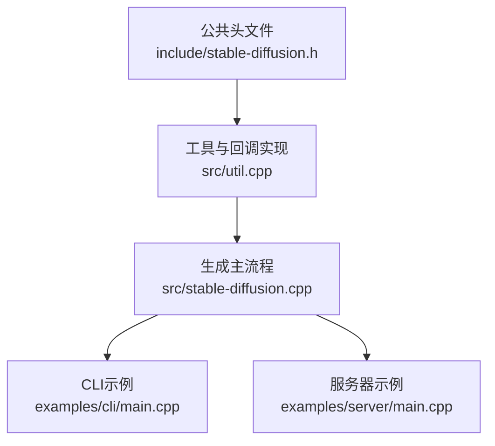
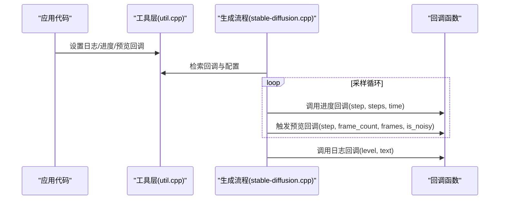
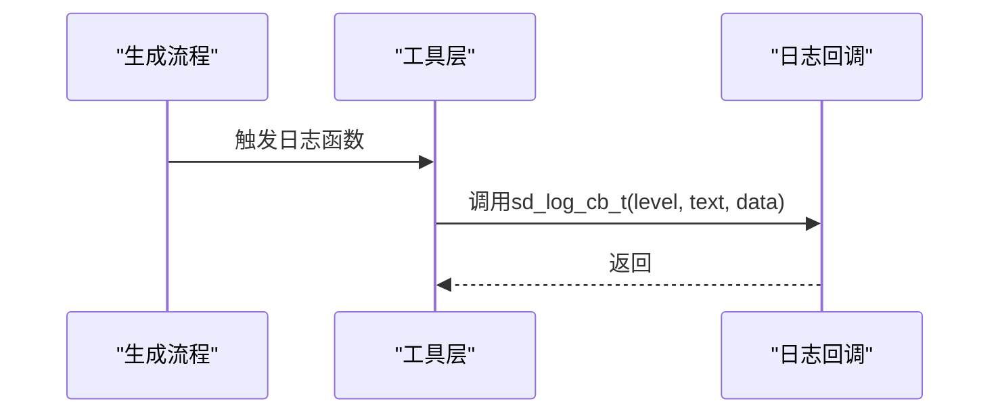
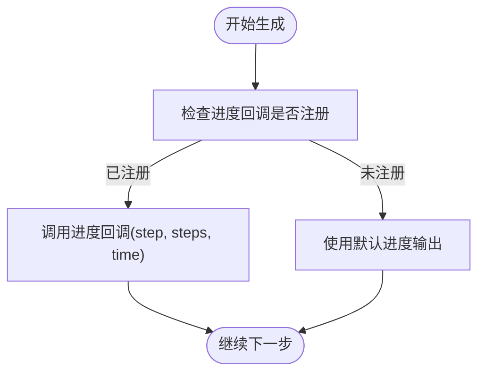
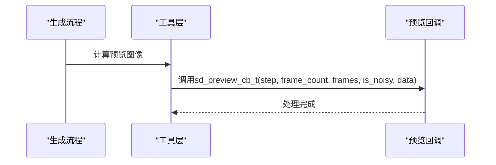
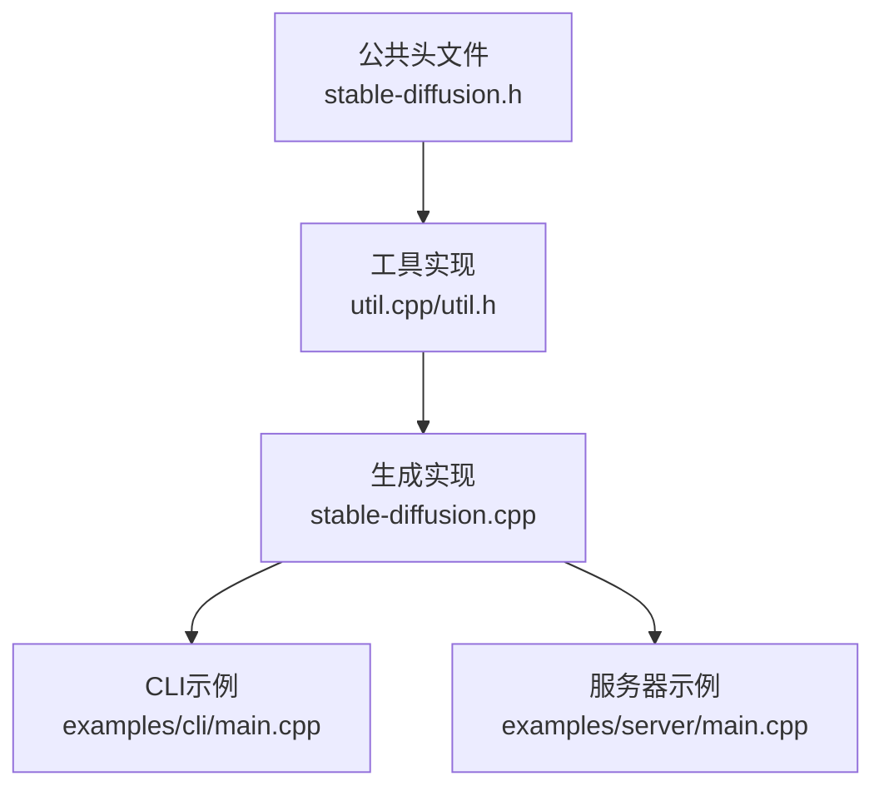

# 回调系统API

<cite>
**本文档引用的文件**
- [stable-diffusion.h](file://include/stable-diffusion.h)
- [util.cpp](file://src/util.cpp)
- [util.h](file://src/util.h)
- [stable-diffusion.cpp](file://src/stable-diffusion.cpp)
- [main.cpp（CLI示例）](file://examples/cli/main.cpp)
- [main.cpp（服务器示例）](file://examples/server/main.cpp)
</cite>

## 目录
1. [简介](#简介)
2. [项目结构](#项目结构)
3. [核心组件](#核心组件)
4. [架构概览](#架构概览)
5. [详细组件分析](#详细组件分析)
6. [依赖关系分析](#依赖关系分析)
7. [性能考虑](#性能考虑)
8. [故障排除指南](#故障排除指南)
9. [结论](#结论)

## 简介
本文件全面阐述稳定扩散库中的回调系统API，重点覆盖三类回调：
- 日志回调：sd_log_cb_t，用于接收运行时日志信息
- 进度回调：sd_progress_cb_t，用于报告采样步进进度
- 预览回调：sd_preview_cb_t，用于在生成过程中输出中间结果图像

文档将详细说明回调函数的参数语义、调用时机、线程安全要求，并提供实际使用示例与最佳实践，同时讨论性能影响与优化建议，以及异常情况下的行为。

## 项目结构
回调系统位于公共头文件中定义，在内部实现文件中进行注册与分发，典型调用路径贯穿生成流程并在关键节点触发回调。

**图表来源**
- [stable-diffusion.h:340-346](file://include/stable-diffusion.h#L340-L346)
- [util.cpp:418-433](file://src/util.cpp#L418-L433)
- [stable-diffusion.cpp:1486-1577](file://src/stable-diffusion.cpp#L1486-L1577)

**章节来源**
- [stable-diffusion.h:340-346](file://include/stable-diffusion.h#L340-L346)
- [util.cpp:418-433](file://src/util.cpp#L418-L433)

## 核心组件
- 回调类型定义
  - 日志回调：sd_log_cb_t(level, text, data)
  - 进度回调：sd_progress_cb_t(step, steps, time, data)
  - 预览回调：sd_preview_cb_t(step, frame_count, frames, is_noisy, data)
- 注册接口
  - 设置日志回调：sd_set_log_callback(cb, data)
  - 设置进度回调：sd_set_progress_callback(cb, data)
  - 设置预览回调：sd_set_preview_callback(cb, mode, interval, denoised, noisy, data)
- 获取器（内部）
  - 获取预览回调及其数据：sd_get_preview_callback(), sd_get_preview_callback_data()
  - 获取预览模式与开关：sd_get_preview_mode(), sd_get_preview_interval(), sd_should_preview_denoised(), sd_should_preview_noisy()

参数与返回值
- level：sd_log_level_t枚举，指示日志级别
- step, steps：当前步与总步数
- time：单步耗时或迭代速率
- frame_count：帧数量（通常为1，视频生成可能大于1）
- frames：指向sd_image_t数组的指针，包含每帧图像数据
- is_noisy：布尔值，指示当前预览是否来自含噪潜空间（否则为去噪后的潜空间）

**章节来源**
- [stable-diffusion.h:340-346](file://include/stable-diffusion.h#L340-L346)
- [util.cpp:435-453](file://src/util.cpp#L435-L453)

## 架构概览
回调系统采用“注册-触发”模式：
- 应用层通过设置接口注册回调函数与用户数据
- 内部模块在关键节点检查并调用已注册回调
- 预览回调在生成过程的关键阶段被调用，支持多种预览模式与帧输出

**图表来源**
- [util.cpp:418-433](file://src/util.cpp#L418-L433)
- [util.cpp:341-371](file://src/util.cpp#L341-L371)
- [stable-diffusion.cpp:1486-1577](file://src/stable-diffusion.cpp#L1486-L1577)

## 详细组件分析

### 日志回调 sd_log_cb_t
- 参数
  - level：sd_log_level_t，包括调试、信息、警告、错误
  - text：格式化后的日志字符串
  - data：用户自定义数据指针
- 调用时机
  - 在内部日志函数中，当已注册日志回调时触发
- 线程安全
  - 回调函数应自行保证线程安全；避免阻塞或长时间计算
- 使用示例
  - CLI示例中通过sd_set_log_callback注册回调，将日志打印到控制台
  - 服务器示例中同样注册回调以输出日志
- 最佳实践
  - 将日志写入文件或异步队列，避免阻塞生成线程
  - 控制日志级别，仅在必要时输出详细日志

**图表来源**
- [util.cpp:396-416](file://src/util.cpp#L396-L416)
- [util.cpp:418-421](file://src/util.cpp#L418-L421)

**章节来源**
- [util.cpp:396-416](file://src/util.cpp#L396-L416)
- [util.cpp:418-421](file://src/util.cpp#L418-L421)
- [main.cpp（CLI示例）:285-288](file://examples/cli/main.cpp#L285-L288)
- [main.cpp（服务器示例）:261-264](file://examples/server/main.cpp#L261-L264)

### 进度回调 sd_progress_cb_t
- 参数
  - step：当前采样步
  - steps：总采样步数
  - time：单步耗时或迭代速率
- 调用时机
  - 在内部进度函数中，若已注册进度回调则直接调用
  - 若未注册，则使用默认的终端进度条输出
- 线程安全
  - 回调函数需保证线程安全；避免阻塞或重 IO
- 使用示例
  - CLI示例中可注册进度回调以显示进度条
- 最佳实践
  - 合理设置更新频率，避免过于频繁的回调导致性能下降
  - 在UI线程中刷新界面，避免跨线程访问UI资源

**图表来源**
- [util.cpp:341-371](file://src/util.cpp#L341-L371)
- [util.cpp:422-425](file://src/util.cpp#L422-L425)

**章节来源**
- [util.cpp:341-371](file://src/util.cpp#L341-L371)
- [util.cpp:422-425](file://src/util.cpp#L422-L425)

### 预览回调 sd_preview_cb_t
- 参数
  - step：当前采样步
  - frame_count：帧数量（通常为1）
  - frames：指向sd_image_t数组的指针，包含每帧图像数据
  - is_noisy：是否来自含噪潜空间（否则为去噪后）
- 调用时机
  - 在生成流程的关键节点，根据预览模式与间隔触发
  - 支持投影预览（PREVIEW_PROJ）、VAE解码预览（PREVIEW_VAE）、TAESD预览（PREVIEW_TAE）
- 线程安全
  - 回调函数需保证线程安全；避免阻塞或长时间计算
- 使用示例
  - CLI示例中注册预览回调，将中间帧保存为PNG或AVI
  - 服务器示例中可结合HTTP接口输出预览
- 最佳实践
  - 合理设置预览间隔，避免过多图像输出造成内存压力
  - 对于视频生成，注意frame_count可能大于1，需正确遍历frames数组
  - 预览模式选择应与模型兼容，避免未知投影导致的无效输出

**图表来源**
- [stable-diffusion.cpp:1486-1577](file://src/stable-diffusion.cpp#L1486-L1577)
- [util.cpp:426-433](file://src/util.cpp#L426-L433)

**章节来源**
- [stable-diffusion.cpp:1486-1577](file://src/stable-diffusion.cpp#L1486-L1577)
- [util.cpp:426-433](file://src/util.cpp#L426-L433)
- [main.cpp（CLI示例）:341-352](file://examples/cli/main.cpp#L341-L352)

## 依赖关系分析
- 公共接口依赖
  - 回调类型与注册接口定义于公共头文件
  - 实现位于工具层，提供全局状态存储与获取器
- 生成流程依赖
  - 生成主流程在关键节点检查并调用回调
  - 预览回调通过内部函数封装，支持多种预览模式
- 示例程序依赖
  - CLI与服务器示例展示了回调的实际使用方式

**图表来源**
- [stable-diffusion.h:340-346](file://include/stable-diffusion.h#L340-L346)
- [util.cpp:418-433](file://src/util.cpp#L418-L433)
- [stable-diffusion.cpp:1486-1577](file://src/stable-diffusion.cpp#L1486-L1577)

**章节来源**
- [stable-diffusion.h:340-346](file://include/stable-diffusion.h#L340-L346)
- [util.cpp:418-433](file://src/util.cpp#L418-L433)
- [stable-diffusion.cpp:1486-1577](file://src/stable-diffusion.cpp#L1486-L1577)

## 性能考虑
- 回调频率与开销
  - 频繁触发回调会增加上下文切换与锁竞争，建议合理设置间隔
  - 预览回调可能产生大量图像数据，需控制frame_count与分辨率
- 线程模型
  - 回调函数应在生成线程内尽快返回，避免阻塞采样循环
  - 若需UI更新，建议将数据复制到工作线程或使用无阻塞队列
- I/O与内存
  - 预览图像写盘或网络传输可能成为瓶颈，建议批量处理或异步I/O
  - 注意释放回调中分配的图像缓冲区，避免内存泄漏

[本节为通用指导，无需特定文件引用]

## 故障排除指南
- 回调未触发
  - 确认已正确调用设置接口注册回调
  - 检查回调函数指针与用户数据是否为空
- 预览无效
  - 确认预览模式与模型兼容
  - 检查预览间隔与开关设置（去噪/含噪）
- 性能问题
  - 减少回调频率或合并更新
  - 避免在回调中执行重 I/O 或阻塞操作
- 异常情况
  - 当模型不支持特定预览模式时，内部会发出警告并跳过
  - 若预览图像数据为空，回调不应尝试访问

**章节来源**
- [stable-diffusion.cpp:1516-1518](file://src/stable-diffusion.cpp#L1516-L1518)
- [stable-diffusion.cpp:1595-1597](file://src/stable-diffusion.cpp#L1595-L1597)

## 结论
回调系统为稳定扩散库提供了灵活的扩展点，使应用能够在生成过程中获取日志、进度与中间结果。通过合理设置回调参数与频率，并遵循线程安全与性能优化原则，可以有效提升用户体验与系统稳定性。建议在生产环境中采用异步处理与批量化策略，确保生成流程的流畅性与可靠性。