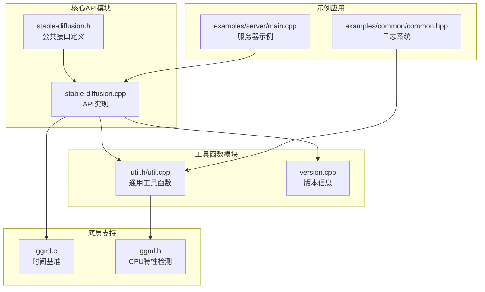
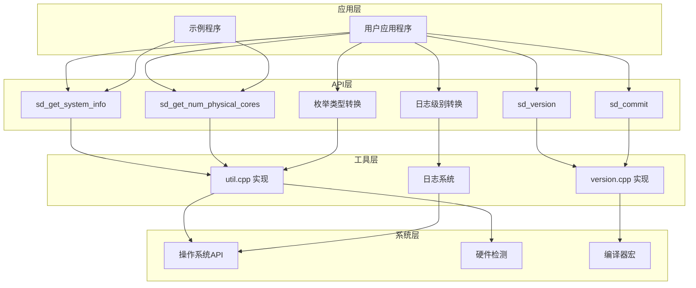
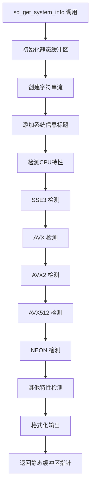
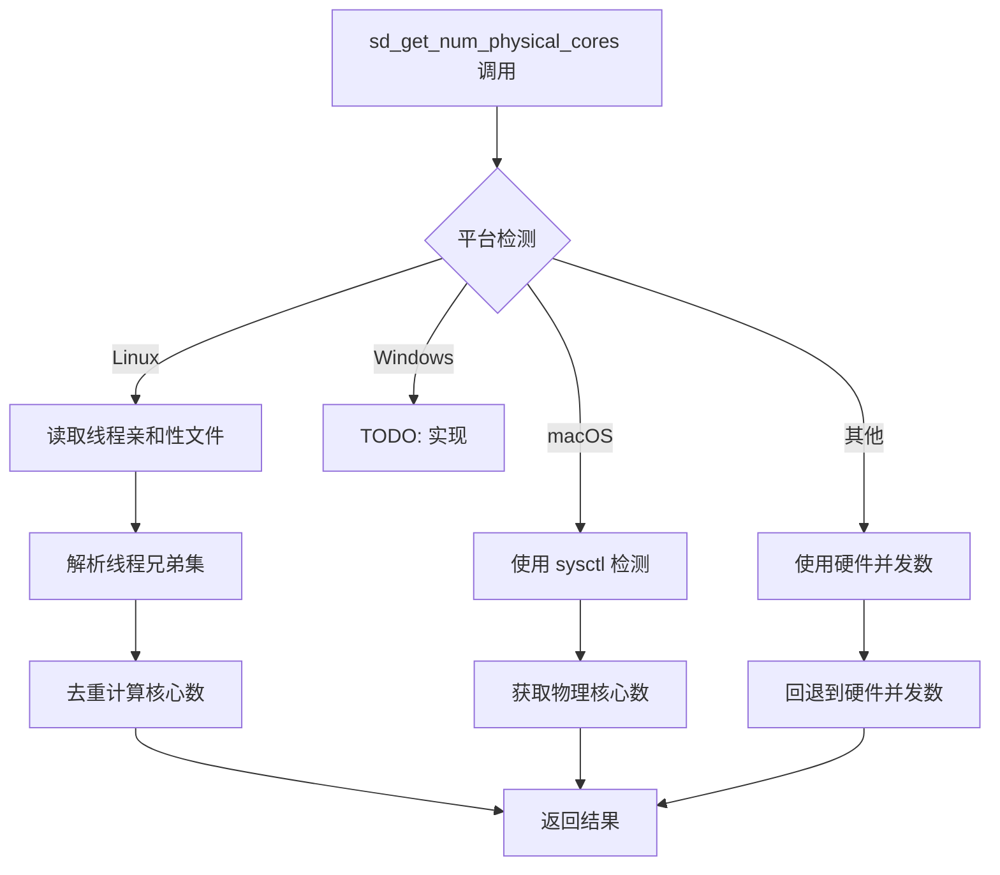
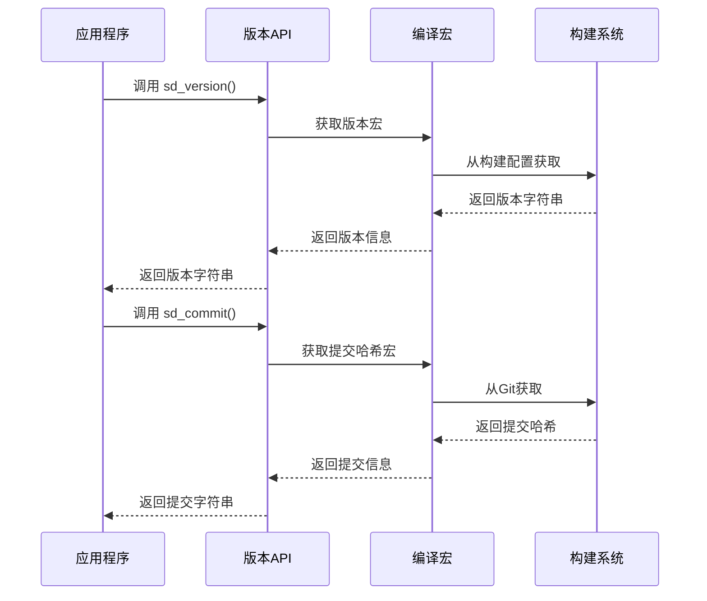
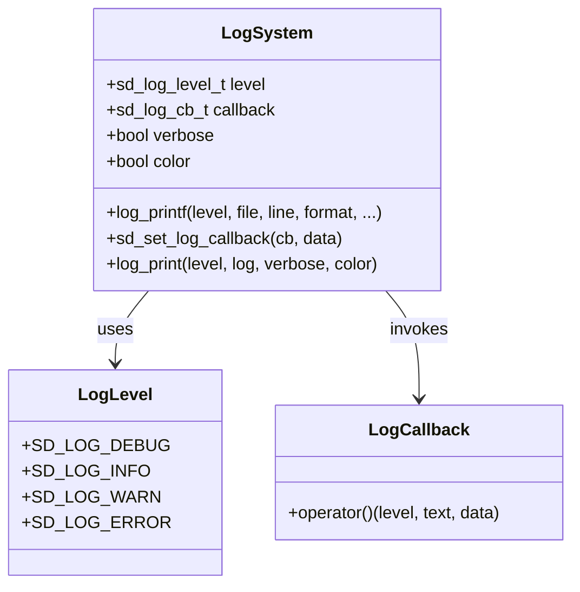
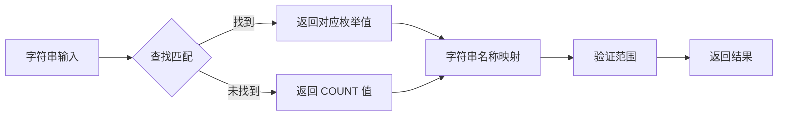
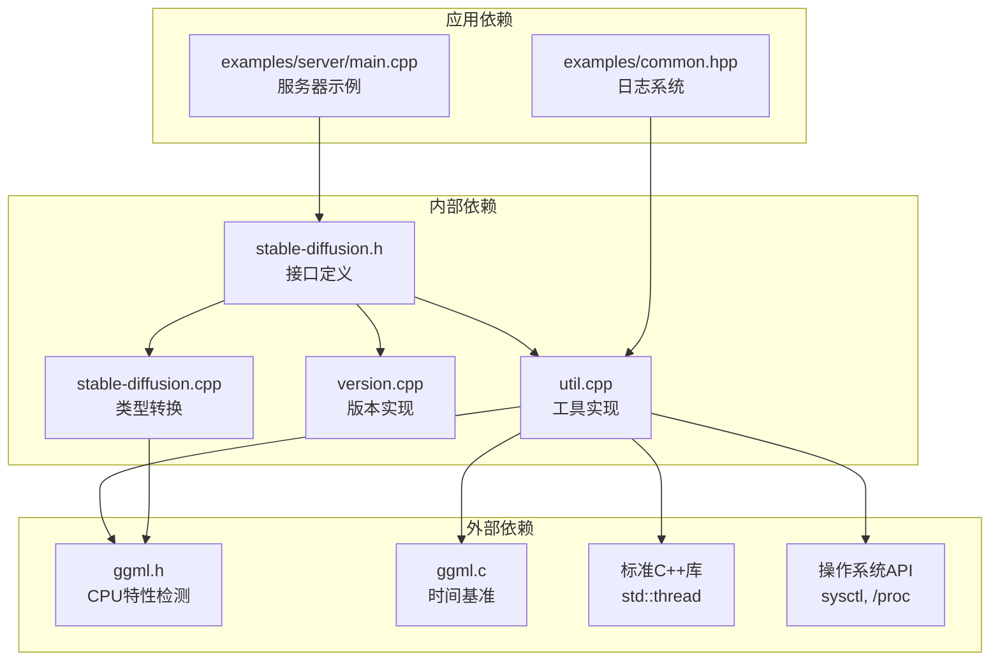

# 工具函数API

<cite>
**本文档引用的文件**
- [stable-diffusion.h](file://include/stable-diffusion.h)
- [util.h](file://src/util.h)
- [util.cpp](file://src/util.cpp)
- [version.cpp](file://src/version.cpp)
- [stable-diffusion.cpp](file://src/stable-diffusion.cpp)
- [ggml.c](file://ggml/src/ggml.c)
- [common.hpp](file://examples/common/common.hpp)
- [main.cpp](file://examples/server/main.cpp)
</cite>

## 目录
1. [简介](#简介)
2. [项目结构](#项目结构)
3. [核心组件](#核心组件)
4. [架构概览](#架构概览)
5. [详细组件分析](#详细组件分析)
6. [依赖关系分析](#依赖关系分析)
7. [性能考虑](#性能考虑)
8. [故障排除指南](#故障排除指南)
9. [结论](#结论)

## 简介

本文件为稳定扩散项目中的工具函数API提供完整的技术文档。该API提供了系统信息获取、版本查询、日志级别管理以及字符串与枚举类型转换等核心功能，支持跨平台的性能监控和调试辅助。

## 项目结构

稳定扩散项目采用模块化设计，工具函数API主要分布在以下模块中：

**图表来源**
- [stable-diffusion.h:1-423](file://include/stable-diffusion.h#L1-L423)
- [util.cpp:1-746](file://src/util.cpp#L1-L746)
- [version.cpp:1-21](file://src/version.cpp#L1-L21)

**章节来源**
- [stable-diffusion.h:1-423](file://include/stable-diffusion.h#L1-L423)
- [util.cpp:1-746](file://src/util.cpp#L1-L746)

## 核心组件

### 系统信息获取函数

系统信息获取函数提供硬件和软件环境的详细信息，包括CPU特性检测和物理核心数统计。

#### sd_get_system_info 函数
- **功能**: 返回当前系统的硬件和软件环境信息
- **返回值**: 字符串指针，包含CPU特性检测结果
- **支持的CPU特性**: SSE3、AVX、AVX2、AVX512、NEON、ARM_FMA、F16C、FP16_VA、WASM_SIMD、VSX等
- **使用场景**: 系统诊断、性能优化配置、硬件兼容性检查

#### sd_get_num_physical_cores 函数
- **功能**: 检测并返回物理核心数量
- **返回值**: int32_t 类型的物理核心数
- **平台支持**: Linux、macOS、Windows（待实现）
- **算法**: 基于线程亲和性信息的集合去重计算
- **回退机制**: 使用标准库硬件并发数检测

**章节来源**
- [stable-diffusion.h:347-348](file://include/stable-diffusion.h#L347-L348)
- [util.cpp:235-268](file://src/util.cpp#L235-L268)

### 版本查询函数

版本查询函数提供构建时的版本信息和提交标识。

#### sd_version 函数
- **功能**: 返回项目版本号
- **返回值**: const char* 指向版本字符串
- **格式**: 构建时通过宏定义设置，默认为"unknown"
- **用途**: 调试输出、问题排查、版本兼容性检查

#### sd_commit 函数
- **功能**: 返回Git提交哈希
- **返回值**: const char* 指向提交标识字符串
- **格式**: 40位十六进制哈希值或"unknown"
- **用途**: 精确版本定位、问题追踪

**章节来源**
- [stable-diffusion.h:415-416](file://include/stable-diffusion.h#L415-L416)
- [version.cpp:14-20](file://src/version.cpp#L14-L20)

### 日志级别和枚举类型转换

日志系统提供多级别的日志输出控制，支持字符串与枚举类型的双向转换。

#### 日志级别枚举
- **SD_LOG_DEBUG**: 调试信息
- **SD_LOG_INFO**: 一般信息
- **SD_LOG_WARN**: 警告信息
- **SD_LOG_ERROR**: 错误信息

#### 枚举类型转换函数族

##### 基础类型转换
- `sd_type_name()`: sd_type_t -> const char*
- `str_to_sd_type()`: const char* -> sd_type_t
- 支持类型: F32、F16、Q4_0、Q4_1、Q5_0、Q5_1、Q8_0、Q8_1、Q2_K、Q3_K、Q4_K、Q5_K、Q6_K、Q8_K、IQ2_XXS、IQ2_XS、IQ3_XXS、IQ1_S、IQ4_NL、IQ3_S、IQ2_S、IQ4_XS、I8、I16、I32、I64、F64、IQ1_M、BF16、TQ1_0、TQ2_0、MXFP4

##### 随机数类型转换
- `sd_rng_type_name()`: rng_type_t -> const char*
- `str_to_rng_type()`: const char* -> rng_type_t
- 支持类型: STD_DEFAULT_RNG、CUDA_RNG、CPU_RNG

##### 采样方法转换
- `sd_sample_method_name()`: sample_method_t -> const char*
- `str_to_sample_method()`: const char* -> sample_method_t
- 支持方法: euler、euler_a、heun、dpm2、dpm++2s_a、dpm++2m、dpm++2mv2、ipndm、ipndm_v、lcm、ddim_trailing、tcd、res_multistep、res_2s

##### 调度器转换
- `sd_scheduler_name()`: scheduler_t -> const char*
- `str_to_scheduler()`: const char* -> scheduler_t
- 支持调度器: discrete、karras、exponential、ays、gits、sgm_uniform、simple、smoothstep、kl_optimal、lcm、bong_tangent

##### 预测模式转换
- `sd_prediction_name()`: prediction_t -> const char*
- `str_to_prediction()`: const char* -> prediction_t
- 支持模式: eps、v、edm_v、sd3_flow、flux_flow、flux2_flow

##### 预览模式转换
- `sd_preview_name()`: preview_t -> const char*
- `str_to_preview()`: const char* -> preview_t
- 支持模式: none、proj、tae、vae

##### LoRA应用模式转换
- `sd_lora_apply_mode_name()`: lora_apply_mode_t -> const char*
- `str_to_lora_apply_mode()`: const char* -> lora_apply_mode_t
- 支持模式: auto、immediately、at_runtime

**章节来源**
- [stable-diffusion.h:126-146](file://include/stable-diffusion.h#L126-L146)
- [stable-diffusion.cpp:2811-2981](file://src/stable-diffusion.cpp#L2811-L2981)

## 架构概览

工具函数API采用分层架构设计，确保跨平台兼容性和可扩展性：

**图表来源**
- [stable-diffusion.h:347-416](file://include/stable-diffusion.h#L347-L416)
- [util.cpp:235-480](file://src/util.cpp#L235-L480)
- [version.cpp:14-20](file://src/version.cpp#L14-L20)

## 详细组件分析

### 系统信息获取组件

#### sd_get_system_info 实现分析

**图表来源**
- [util.cpp:461-480](file://src/util.cpp#L461-L480)

#### sd_get_num_physical_cores 实现分析

**图表来源**
- [util.cpp:235-268](file://src/util.cpp#L235-L268)

**章节来源**
- [util.cpp:235-480](file://src/util.cpp#L235-L480)

### 版本查询组件

#### 版本信息管理

版本查询函数通过编译时宏定义提供版本信息：

**图表来源**
- [version.cpp:14-20](file://src/version.cpp#L14-L20)

**章节来源**
- [version.cpp:1-21](file://src/version.cpp#L1-L21)

### 日志系统组件

#### 日志级别管理

日志系统提供灵活的日志级别控制和格式化输出：

**图表来源**
- [util.cpp:396-421](file://src/util.cpp#L396-L421)
- [common.hpp:137-176](file://examples/common/common.hpp#L137-L176)

**章节来源**
- [util.cpp:396-421](file://src/util.cpp#L396-L421)
- [common.hpp:137-176](file://examples/common/common.hpp#L137-L176)

### 枚举类型转换组件

#### 类型转换实现模式

所有枚举类型转换遵循统一的实现模式：

**图表来源**
- [stable-diffusion.cpp:2818-2848](file://src/stable-diffusion.cpp#L2818-L2848)

**章节来源**
- [stable-diffusion.cpp:2818-2981](file://src/stable-diffusion.cpp#L2818-L2981)

## 依赖关系分析

工具函数API的依赖关系呈现清晰的层次结构：

**图表来源**
- [stable-diffusion.h:1-423](file://include/stable-diffusion.h#L1-L423)
- [util.cpp:16-28](file://src/util.cpp#L16-L28)
- [version.cpp:1-21](file://src/version.cpp#L1-L21)

**章节来源**
- [stable-diffusion.h:1-423](file://include/stable-diffusion.h#L1-L423)
- [util.cpp:16-28](file://src/util.cpp#L16-L28)

## 性能考虑

### 时间基准系统

项目使用高性能的时间基准系统进行性能测量：

- **Windows平台**: 使用QueryPerformanceCounter获取高精度计数器
- **Unix/Linux平台**: 使用clock_gettime获取纳秒级精度
- **回退机制**: 使用标准库clock()作为最后的备选方案

### 内存管理

- 所有返回字符串都使用静态缓冲区，避免内存泄漏风险
- 日志缓冲区大小固定为4096字节，平衡性能和安全性
- 图像数据转换使用动态内存分配，注意及时释放

### 平台优化

- Linux平台通过解析/proc文件系统获取CPU亲和性信息
- macOS平台使用sysctl系统调用获取硬件信息
- Windows平台预留了扩展接口，便于后续实现

## 故障排除指南

### 常见问题及解决方案

#### 版本信息显示为"unknown"

**原因**: 构建时未正确设置版本宏
**解决方案**: 
1. 检查构建脚本是否正确传递版本参数
2. 验证SDCPP_BUILD_VERSION和SDCPP_BUILD_COMMIT宏定义
3. 确认编译器支持宏展开

#### CPU特性检测结果异常

**原因**: 硬件不支持或系统权限不足
**解决方案**:
1. 检查目标CPU是否支持相应指令集
2. 确认系统具有读取/proc文件的权限
3. 在macOS上确认sysctl调用权限

#### 日志输出格式异常

**原因**: 终端不支持ANSI转义序列
**解决方案**:
1. 检查终端设置是否启用颜色输出
2. 关闭颜色模式以获得纯文本输出
3. 验证日志回调函数的实现

### 错误处理最佳实践

#### 安全的字符串处理
- 所有字符串操作都进行了边界检查
- 使用snprintf替代sprintf防止缓冲区溢出
- 对NULL指针进行显式检查

#### 资源管理
- 静态资源在函数内部声明，自动管理生命周期
- 动态分配的内存需要调用方负责释放
- 文件描述符和句柄在使用后及时关闭

**章节来源**
- [util.cpp:396-421](file://src/util.cpp#L396-L421)
- [version.cpp:14-20](file://src/version.cpp#L14-L20)

## 结论

稳定扩散项目的工具函数API提供了完整的系统信息获取、版本管理和类型转换功能。该API具有以下特点：

1. **跨平台兼容性**: 支持Linux、macOS、Windows等多种操作系统
2. **类型安全**: 提供完整的枚举类型转换，避免字符串硬编码
3. **性能优化**: 使用高效的CPU特性检测和时间基准系统
4. **易于使用**: 简洁的API设计和完善的错误处理机制

这些工具函数为稳定扩散应用提供了强大的系统集成能力，支持从基础的系统信息获取到复杂的性能监控和调试功能。通过合理的使用和扩展，开发者可以充分利用这些工具函数来提升应用的性能和用户体验。