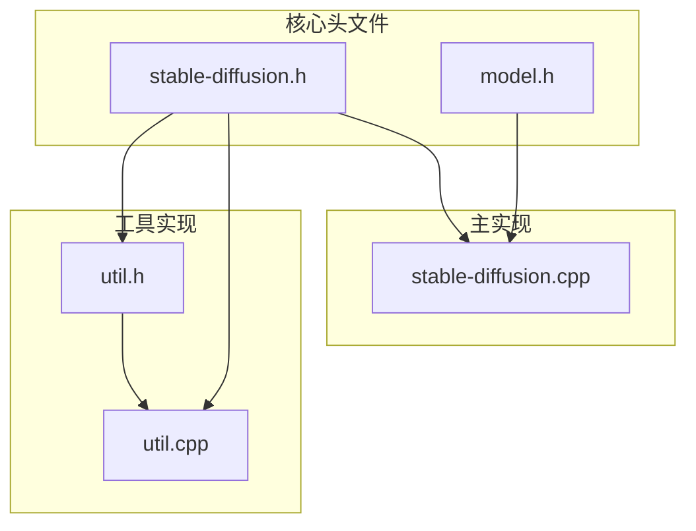
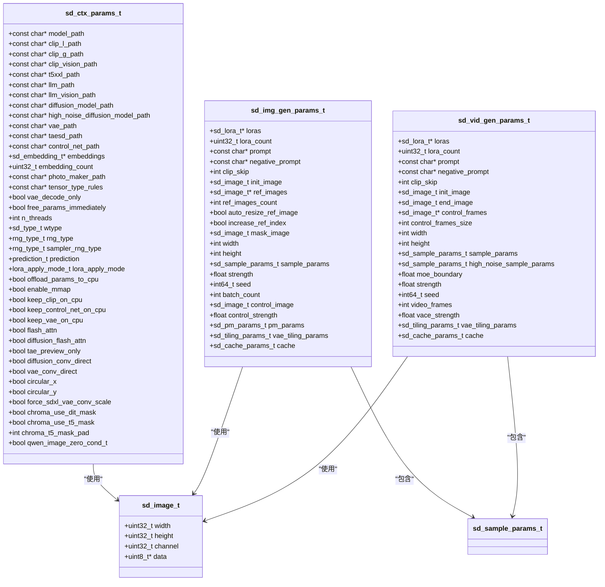
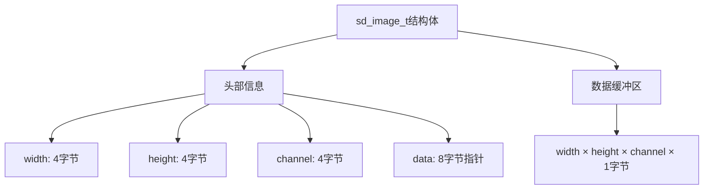
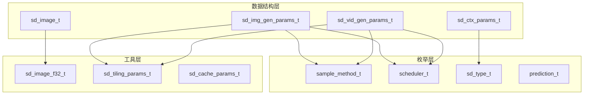

# 数据结构定义

<cite>
**本文档引用的文件**
- [stable-diffusion.h](file://include/stable-diffusion.h)
- [util.h](file://src/util.h)
- [util.cpp](file://src/util.cpp)
- [model.h](file://src/model.h)
- [stable-diffusion.cpp](file://src/stable-diffusion.cpp)
- [ggml.h](file://ggml/include/ggml.h)
</cite>

## 目录
1. [简介](#简介)
2. [项目结构](#项目结构)
3. [核心组件](#核心组件)
4. [架构概览](#架构概览)
5. [详细组件分析](#详细组件分析)
6. [依赖分析](#依赖分析)
7. [性能考虑](#性能考虑)
8. [故障排除指南](#故障排除指南)
9. [结论](#结论)

## 简介
本文件详细记录了稳定扩散系统中的核心数据结构定义，包括图像数据结构、上下文参数结构、生成参数结构以及相关枚举类型。文档提供了字段定义、数据类型说明、使用场景、内存布局、序列化注意事项以及初始化和清理方法。

## 项目结构
稳定扩散系统的数据结构主要分布在以下头文件中：
- `include/stable-diffusion.h`: 核心数据结构和API声明
- `src/util.h` 和 `src/util.cpp`: 图像处理辅助结构和函数
- `src/model.h`: 模型版本和张量存储相关结构
- `src/stable-diffusion.cpp`: 结构体初始化实现和工具函数



**图表来源**
- [stable-diffusion.h:1-423](file://include/stable-diffusion.h#L1-L423)
- [util.h:1-94](file://src/util.h#L1-L94)
- [util.cpp:1-746](file://src/util.cpp#L1-L746)
- [model.h:1-346](file://src/model.h#L1-L346)
- [stable-diffusion.cpp:1-4374](file://src/stable-diffusion.cpp#L1-L4374)

## 核心组件

### 主要数据结构概述

系统包含以下核心数据结构：

1. **sd_image_t**: 基础图像数据结构
2. **sd_ctx_params_t**: 上下文初始化参数
3. **sd_img_gen_params_t**: 图像生成参数
4. **sd_vid_gen_params_t**: 视频生成参数
5. **相关枚举类型**: 样本方法、调度器、数据类型等

**章节来源**
- [stable-diffusion.h:148-336](file://include/stable-diffusion.h#L148-L336)

## 架构概览



**图表来源**
- [stable-diffusion.h:148-336](file://include/stable-diffusion.h#L148-L336)

## 详细组件分析

### sd_image_t 结构体

#### 字段定义
- `width`: 图像宽度，类型为 `uint32_t`
- `height`: 图像高度，类型为 `uint32_t`  
- `channel`: 通道数，类型为 `uint32_t`
- `data`: 图像数据指针，类型为 `uint8_t*`

#### 数据类型说明
- 宽度、高度、通道数使用32位无符号整数
- 数据使用8位无符号整数存储（0-255范围）
- 支持RGB格式（通道数通常为3）

#### 使用场景
- 存储原始图像数据
- 作为输入传递给生成算法
- 与sd_image_f32_t进行类型转换

#### 内存布局


**图表来源**
- [stable-diffusion.h:206-211](file://include/stable-diffusion.h#L206-L211)

**章节来源**
- [stable-diffusion.h:206-211](file://include/stable-diffusion.h#L206-L211)

### sd_ctx_params_t 结构体

#### 字段定义
- **路径配置**: 模型文件路径相关字段
- **嵌入配置**: 文本嵌入相关设置
- **运行时配置**: 线程数、数据类型等
- **设备配置**: GPU/CPU选择和内存管理
- **功能开关**: 各种特性的启用状态

#### 初始化方法
```c
void sd_ctx_params_init(sd_ctx_params_t* sd_ctx_params);
```

#### 清理要求
- 该结构体不包含需要手动释放的动态内存
- 使用后可直接销毁或覆盖

**章节来源**
- [stable-diffusion.h:162-204](file://include/stable-diffusion.h#L162-L204)
- [stable-diffusion.cpp:3011-3032](file://src/stable-diffusion.cpp#L3011-L3032)

### sd_img_gen_params_t 结构体

#### 字段定义
- **模型参数**: LoRA模型、提示词、负向提示词
- **图像参数**: 初始图像、参考图像、掩码图像
- **尺寸参数**: 宽度、高度、批量大小
- **采样参数**: 采样方法、步数、种子
- **控制参数**: 控制强度、风格强度
- **缓存参数**: 高级缓存配置

#### 初始化方法
```c
void sd_img_gen_params_init(sd_img_gen_params_t* sd_img_gen_params);
```

#### 转换方法
- 支持从sd_ctx_params_t转换
- 提供字符串化功能用于调试

**章节来源**
- [stable-diffusion.h:290-313](file://include/stable-diffusion.h#L290-L313)
- [stable-diffusion.cpp:3165-3179](file://src/stable-diffusion.cpp#L3165-L3179)

### sd_vid_gen_params_t 结构体

#### 字段定义
- **视频特有参数**: 视频帧数、控制帧数组
- **高噪声参数**: 高噪声采样参数
- **MoE边界**: 多专家融合边界值
- **VAE强度**: VAE编码强度

#### 初始化方法
```c
void sd_vid_gen_params_init(sd_vid_gen_params_t* sd_vid_gen_params);
```

**章节来源**
- [stable-diffusion.h:315-336](file://include/stable-diffusion.h#L315-L336)
- [stable-diffusion.cpp:3239-3253](file://src/stable-diffusion.cpp#L3239-L3253)

### 枚举类型定义

#### sample_method_t 枚举
定义了各种采样方法：
- EULER_SAMPLE_METHOD: 欧拉方法
- EULER_A_SAMPLE_METHOD: 改进欧拉方法
- HEUN_SAMPLE_METHOD: 海恩方法
- DPM2_SAMPLE_METHOD: DPM2方法
- DPMPP2S_A_SAMPLE_METHOD: DPM++ 2s A
- DPMPP2M_SAMPLE_METHOD: DPM++ 2M
- DPMPP2Mv2_SAMPLE_METHOD: DPM++ 2M v2
- IPNDM_SAMPLE_METHOD: iPNDM
- IPNDM_V_SAMPLE_METHOD: iPNDM_v
- LCM_SAMPLE_METHOD: LCM
- DDIM_TRAILING_SAMPLE_METHOD: DDIM trailing
- TCD_SAMPLE_METHOD: TCD
- RES_MULTISTEP_SAMPLE_METHOD: Res Multistep
- RES_2S_SAMPLE_METHOD: Res 2s

#### scheduler_t 枚举
定义了调度器类型：
- DISCRETE_SCHEDULER: 离散调度器
- KARRAS_SCHEDULER: 卡拉斯调度器
- EXPONENTIAL_SCHEDULER: 指数调度器
- AYS_SCHEDULER: AYS调度器
- GITS_SCHEDULER: GITS调度器
- SGM_UNIFORM_SCHEDULER: SGM均匀调度器
- SIMPLE_SCHEDULER: 简单调度器
- SMOOTHSTEP_SCHEDULER: 平滑步进调度器
- KL_OPTIMAL_SCHEDULER: KL最优调度器
- LCM_SCHEDULER: LCM调度器
- BONG_TANGENT_SCHEDULER: Bong Tangent调度器

#### sd_type_t 枚举
与ggml类型兼容的数据类型：
- SD_TYPE_F32: 32位浮点数
- SD_TYPE_F16: 16位浮点数
- SD_TYPE_Q4_0 至 SD_TYPE_Q8_K: 各种量化格式
- SD_TYPE_I8 至 SD_TYPE_I64: 整数类型
- SD_TYPE_F64: 64位浮点数
- SD_TYPE_BF16: bfloat16
- SD_TYPE_TQ1_0 至 SD_TYPE_TQ2_0: TQ量化
- SD_TYPE_MXFP4: MXFP4

**章节来源**
- [stable-diffusion.h:38-124](file://include/stable-diffusion.h#L38-L124)
- [stable-diffusion.h:81-124](file://include/stable-diffusion.h#L81-L124)

## 依赖分析



**图表来源**
- [stable-diffusion.h:148-336](file://include/stable-diffusion.h#L148-L336)

### 关系映射

1. **继承关系**: 所有结构体都是C风格的结构体，没有继承关系
2. **组合关系**: 
   - sd_img_gen_params_t 包含 sd_sample_params_t
   - sd_vid_gen_params_t 包含两个 sd_sample_params_t
   - 所有结构体都可能包含 sd_image_t
3. **依赖关系**: 
   - sd_type_t 与 ggml 类型兼容
   - 枚举类型用于控制算法行为

**章节来源**
- [stable-diffusion.h:148-336](file://include/stable-diffusion.h#L148-L336)

## 性能考虑

### 内存布局优化
1. **紧凑布局**: 所有结构体采用连续内存布局
2. **指针使用**: 动态数据通过指针引用，减少结构体大小
3. **对齐要求**: 
   - 基本类型按平台默认对齐
   - 指针类型按平台指针大小对齐
   - 建议在跨平台使用时注意对齐差异

### 序列化注意事项
1. **二进制兼容性**: 结构体设计考虑了二进制序列化需求
2. **版本控制**: 通过枚举值控制兼容性
3. **字符串处理**: 注意字符串指针的生命周期管理

### 转换性能
1. **图像转换**: sd_image_t 与 sd_image_f32_t 转换涉及内存分配
2. **批量操作**: 支持批量图像处理以提高效率
3. **缓存机制**: 内置缓存参数支持性能优化

## 故障排除指南

### 常见问题
1. **内存泄漏**: 确保正确管理动态分配的内存
2. **空指针访问**: 在使用前检查指针有效性
3. **类型不匹配**: 注意 sd_type_t 与实际数据类型的对应关系

### 调试建议
1. 使用提供的字符串化函数输出结构体内容
2. 检查枚举值的有效性
3. 验证图像尺寸和通道数的一致性

**章节来源**
- [stable-diffusion.cpp:3034-3107](file://src/stable-diffusion.cpp#L3034-L3107)
- [stable-diffusion.cpp:3181-3237](file://src/stable-diffusion.cpp#L3181-L3237)

## 结论

本数据结构文档详细描述了稳定扩散系统的核心数据结构定义，包括：

1. **完整的字段定义**: 每个结构体的字段、数据类型和用途
2. **枚举类型说明**: 采样方法、调度器、数据类型等的完整定义
3. **关系图谱**: 结构体间的依赖和组合关系
4. **转换方法**: 不同数据类型间的转换机制
5. **内存和性能**: 内存布局、对齐要求和性能考虑
6. **初始化和清理**: 正确的使用方法和资源管理

这些数据结构为稳定扩散系统的开发和使用提供了坚实的基础，支持从基础图像处理到高级生成算法的完整工作流程。