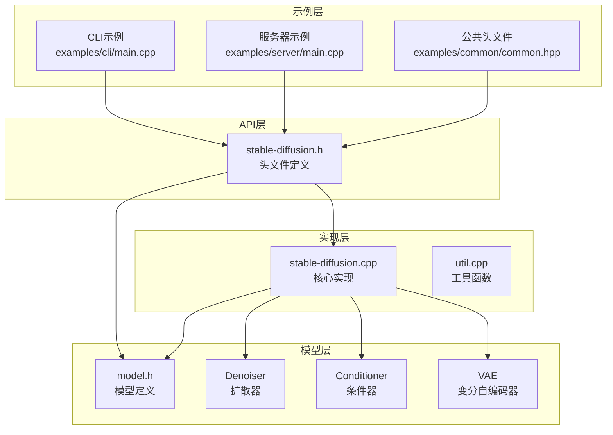
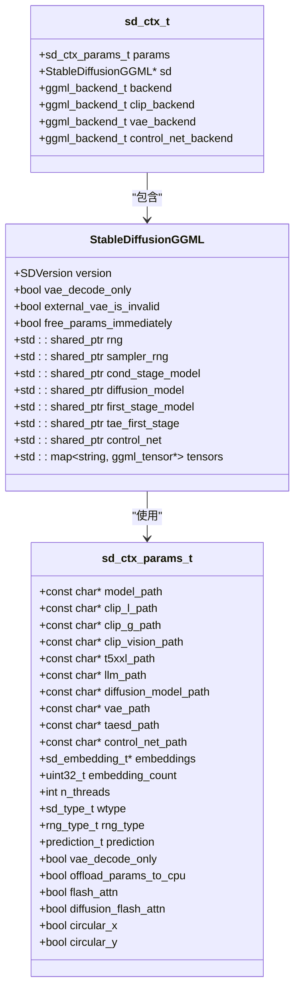
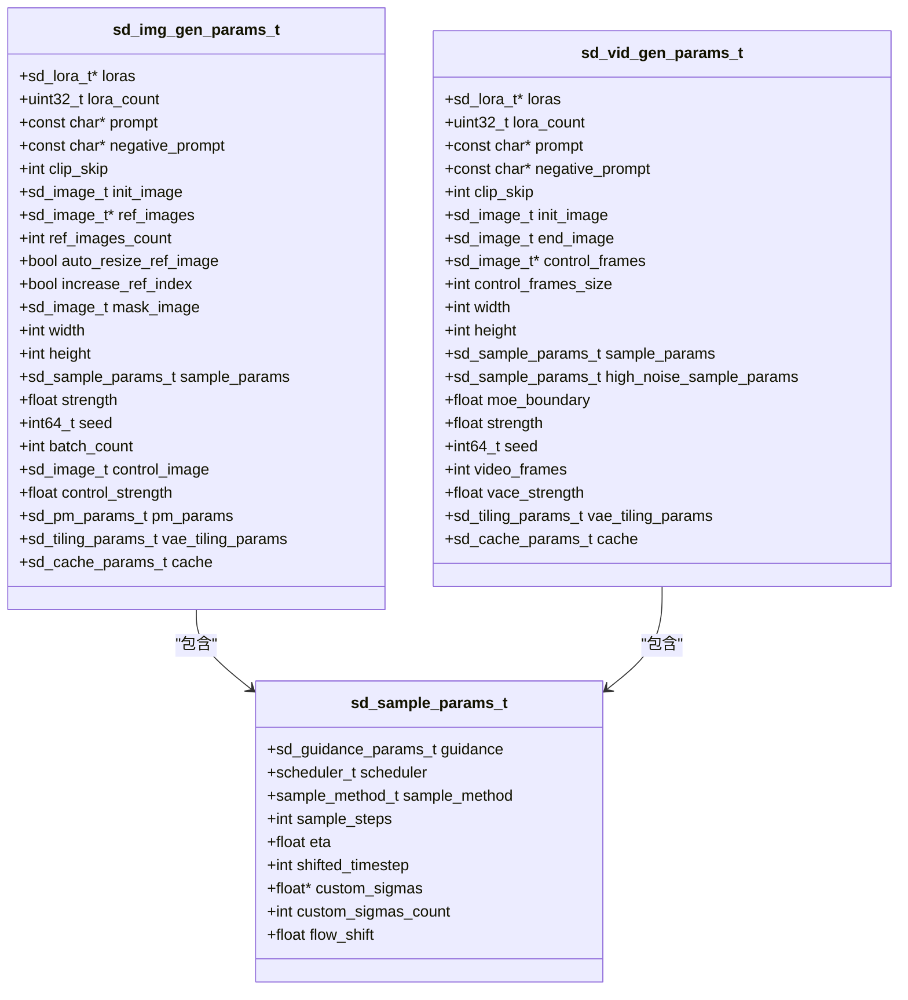
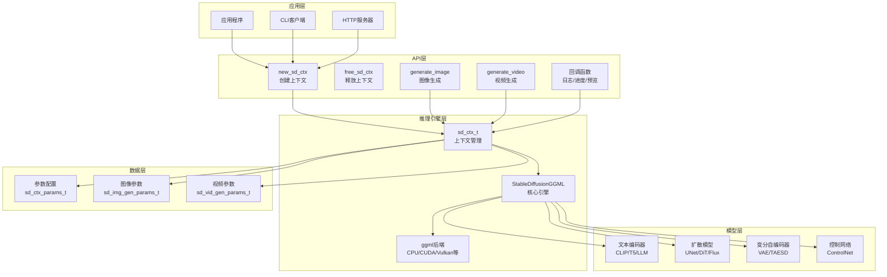
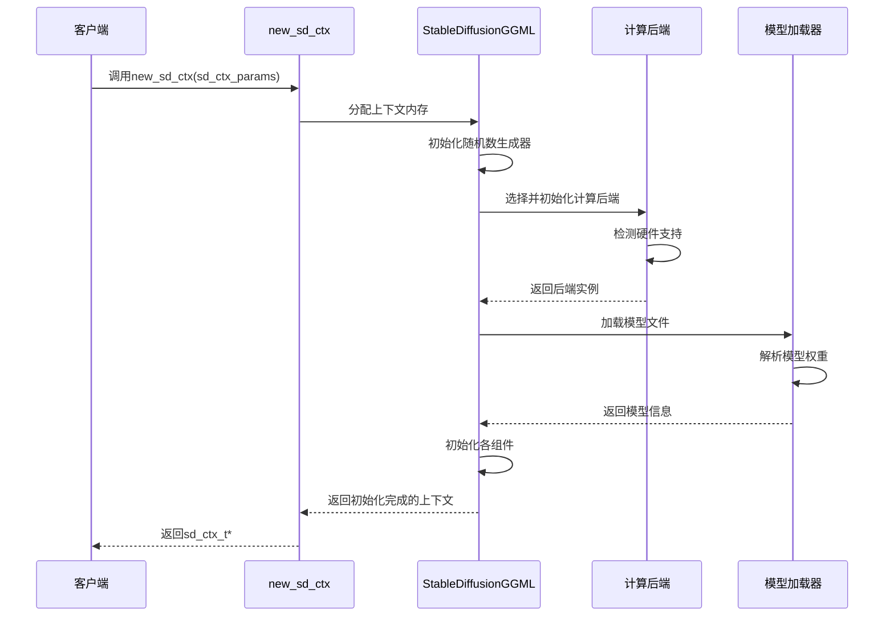
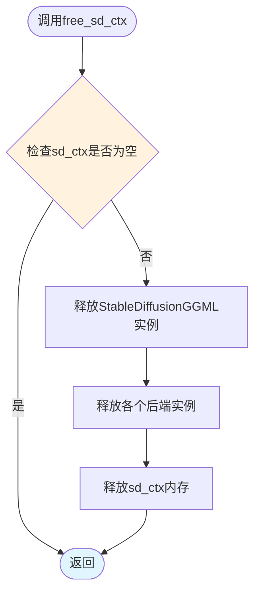
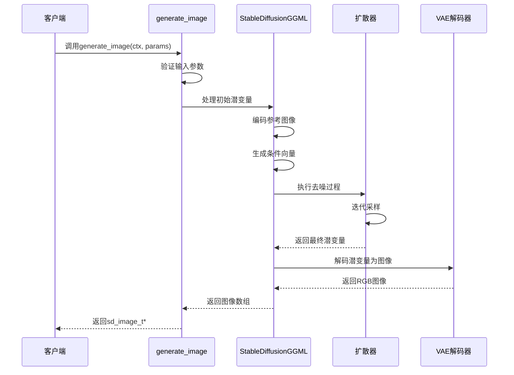
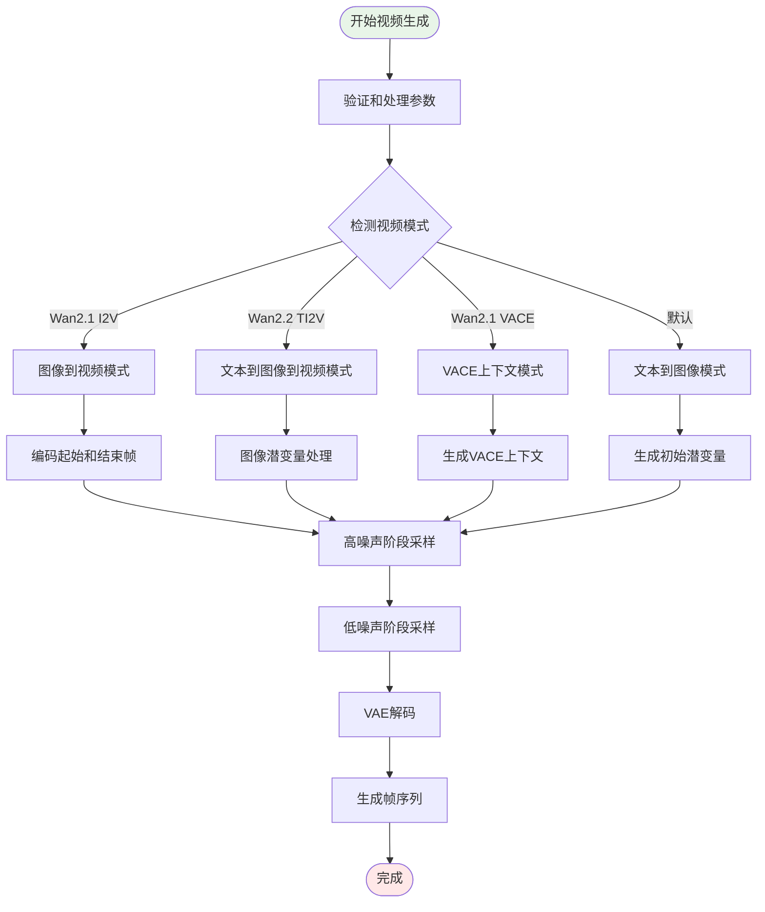
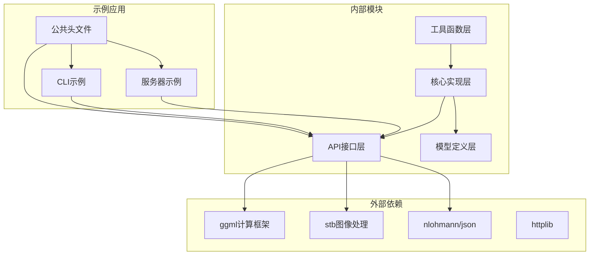

# 核心推理API

<cite>
**本文档引用的文件**
- [stable-diffusion.h](file://include/stable-diffusion.h)
- [stable-diffusion.cpp](file://src/stable-diffusion.cpp)
- [common.hpp](file://examples/common/common.hpp)
- [main.cpp (CLI)](file://examples/cli/main.cpp)
- [main.cpp (Server)](file://examples/server/main.cpp)
</cite>

## 目录
1. [简介](#简介)
2. [项目结构](#项目结构)
3. [核心组件](#核心组件)
4. [架构概览](#架构概览)
5. [详细组件分析](#详细组件分析)
6. [依赖关系分析](#依赖关系分析)
7. [性能考虑](#性能考虑)
8. [故障排除指南](#故障排除指南)
9. [结论](#结论)

## 简介

核心推理API是稳定扩散项目的核心接口层，提供了完整的图像和视频生成能力。该API基于C语言设计，通过统一的上下文管理和参数配置系统，支持多种扩散模型架构和推理模式。

本API主要包含以下核心功能：
- 推理上下文管理（new_sd_ctx、free_sd_ctx）
- 图像生成（generate_image）
- 视频生成（generate_video）
- 参数配置和序列化
- 回调函数支持（日志、进度、预览）

## 项目结构

项目采用模块化设计，核心API位于include目录，实现位于src目录，示例程序位于examples目录。

**图表来源**
- [stable-diffusion.h:1-423](file://include/stable-diffusion.h#L1-L423)
- [stable-diffusion.cpp:1-800](file://src/stable-diffusion.cpp#L1-L800)

**章节来源**
- [stable-diffusion.h:1-423](file://include/stable-diffusion.h#L1-L423)
- [stable-diffusion.cpp:1-800](file://src/stable-diffusion.cpp#L1-L800)

## 核心组件

### 上下文管理组件

上下文管理是整个API的基础，负责模型加载、参数配置和资源管理。

**图表来源**
- [stable-diffusion.h:148-204](file://include/stable-diffusion.h#L148-L204)
- [stable-diffusion.h:338-339](file://include/stable-diffusion.h#L338-L339)

### 生成参数组件

生成参数系统提供了灵活的配置选项，支持图像和视频生成的不同需求。

**图表来源**
- [stable-diffusion.h:290-336](file://include/stable-diffusion.h#L290-L336)
- [stable-diffusion.h:228-238](file://include/stable-diffusion.h#L228-L238)

**章节来源**
- [stable-diffusion.h:148-336](file://include/stable-diffusion.h#L148-L336)

## 架构概览

核心推理API采用分层架构设计，从底层的计算后端到高层的应用接口形成清晰的层次结构。

**图表来源**
- [stable-diffusion.cpp:103-170](file://src/stable-diffusion.cpp#L103-L170)
- [stable-diffusion.h:370-384](file://include/stable-diffusion.h#L370-L384)

## 详细组件分析

### 推理上下文管理

推理上下文管理是API的核心基础，负责模型的初始化、参数配置和资源管理。

#### new_sd_ctx 函数详解

new_sd_ctx函数负责创建和初始化推理上下文，这是所有推理操作的前提。

**图表来源**
- [stable-diffusion.cpp:238-255](file://src/stable-diffusion.cpp#L238-L255)
- [stable-diffusion.cpp:255-226](file://src/stable-diffusion.cpp#L255-L226)

#### free_sd_ctx 函数详解

free_sd_ctx函数负责释放推理上下文中分配的所有资源，确保内存安全。

**图表来源**
- [stable-diffusion.cpp:3280-3286](file://src/stable-diffusion.cpp#L3280-L3286)

#### 上下文参数配置

上下文参数配置提供了丰富的模型加载和运行时选项：

**关键参数说明：**
- `model_path`: 主模型文件路径
- `clip_l_path/clip_g_path`: CLIP文本编码器路径
- `t5xxl_path/llm_path`: T5或LLM文本编码器路径
- `diffusion_model_path`: 扩散模型路径
- `vae_path/taesd_path`: VAE或TAESD模型路径
- `control_net_path`: ControlNet模型路径
- `n_threads`: 线程数量
- `wtype`: 权重类型
- `rng_type/sampler_rng_type`: 随机数生成器类型
- `flash_attn/diffusion_flash_attn`: Flash Attention开关
- `offload_params_to_cpu`: 权重离线加载
- `circular_x/circular_y`: 圆形卷积边界条件

**章节来源**
- [stable-diffusion.h:148-204](file://include/stable-diffusion.h#L148-L204)
- [stable-diffusion.cpp:3011-3032](file://src/stable-diffusion.cpp#L3011-L3032)

### 图像生成函数

generate_image函数实现了完整的图像生成流程，支持文本到图像、图像到图像等多种模式。

#### generate_image 调用流程

**图表来源**
- [stable-diffusion.cpp:3700-3917](file://src/stable-diffusion.cpp#L3700-L3917)

#### 图像生成参数详解

图像生成支持丰富的参数配置：

**核心参数：**
- `prompt/negative_prompt`: 正负面向提示词
- `width/height`: 输出图像尺寸
- `sample_params`: 采样参数（步数、调度器、采样方法）
- `strength`: 重绘强度
- `seed`: 随机种子
- `batch_count`: 批次大小
- `control_image/control_strength`: 控制图像和强度
- `pm_params`: PhotoMaker参数

**高级功能：**
- 参考图像编辑（ref_images）
- 掩码支持（mask_image）
- LoRA模型应用
- 缓存机制
- VAE平铺处理

**章节来源**
- [stable-diffusion.h:290-313](file://include/stable-diffusion.h#L290-L313)
- [stable-diffusion.cpp:3700-3917](file://src/stable-diffusion.cpp#L3700-L3917)

### 视频生成函数

generate_video函数专门处理视频生成任务，支持多种视频生成模式和帧处理机制。

#### generate_video 特殊参数

视频生成具有独特的参数配置：

**视频特有参数：**
- `video_frames`: 视频帧数
- `high_noise_sample_params`: 高噪声阶段采样参数
- `moe_boundary`: MoE边界值
- `vace_strength`: VACE强度
- `control_frames`: 控制帧序列

**帧处理机制：**
- 帧对齐和尺寸调整
- 多种视频生成模式支持
- 高低噪声阶段分离
- VACE上下文生成

#### 视频生成流程

**图表来源**
- [stable-diffusion.cpp:3919-4373](file://src/stable-diffusion.cpp#L3919-L4373)

**章节来源**
- [stable-diffusion.h:315-336](file://include/stable-diffusion.h#L315-L336)
- [stable-diffusion.cpp:3919-4373](file://src/stable-diffusion.cpp#L3919-L4373)

### 回调函数系统

API提供了完整的回调函数系统，用于监控推理过程和获取中间结果。

**回调类型：**
- 日志回调（sd_log_cb_t）
- 进度回调（sd_progress_cb_t）
- 预览回调（sd_preview_cb_t）

**回调用途：**
- 实时监控推理进度
- 获取中间潜变量状态
- 支持预览功能
- 错误处理和调试

**章节来源**
- [stable-diffusion.h:340-346](file://include/stable-diffusion.h#L340-L346)

## 依赖关系分析

API的依赖关系体现了清晰的模块化设计和分层架构。

**图表来源**
- [stable-diffusion.cpp:1-26](file://src/stable-diffusion.cpp#L1-L26)
- [common.hpp:20-29](file://examples/common/common.hpp#L20-L29)

**章节来源**
- [stable-diffusion.cpp:1-26](file://src/stable-diffusion.cpp#L1-L26)
- [common.hpp:20-29](file://examples/common/common.hpp#L20-L29)

## 性能考虑

### 内存管理优化

API采用了多种内存管理策略来优化性能：

**延迟加载机制：**
- 权重离线加载（offload_params_to_cpu）
- 按需分配计算图
- 自动释放临时缓冲区

**内存池管理：**
- 统一的ggml上下文管理
- 批量内存分配
- 智能内存回收

### 并行计算优化

**多线程支持：**
- 可配置的线程数量
- 并行文本编码
- 并行图像处理

**硬件加速：**
- CUDA后端支持
- Vulkan后端支持
- Metal后端支持
- 自动硬件检测

### 缓存机制

API内置了多种缓存机制：

**LoRA缓存：**
- 动态LoRA应用
- 缓存LoRA权重
- 智能LoRA切换

**推理缓存：**
- 可配置的缓存参数
- 自适应缓存策略
- 缓存一致性保证

## 故障排除指南

### 常见问题诊断

**上下文创建失败：**
- 检查模型文件路径
- 验证权重格式兼容性
- 确认硬件支持情况

**内存不足错误：**
- 启用权重离线加载
- 减少批处理大小
- 关闭不必要的功能

**推理速度慢：**
- 检查硬件加速是否启用
- 调整线程数量
- 优化模型配置

### 错误处理策略

API提供了完善的错误处理机制：

**参数验证：**
- 输入参数范围检查
- 文件存在性验证
- 模型兼容性检查

**运行时错误处理：**
- 异常捕获和恢复
- 资源自动清理
- 详细的错误日志

**章节来源**
- [stable-diffusion.cpp:3280-3286](file://src/stable-diffusion.cpp#L3280-L3286)
- [main.cpp (CLI):552-572](file://examples/cli/main.cpp#L552-L572)

## 结论

核心推理API提供了完整而强大的稳定扩散推理能力，具有以下特点：

**设计优势：**
- 清晰的分层架构
- 灵活的参数配置
- 完善的资源管理
- 丰富的回调机制

**功能特性：**
- 支持多种扩散模型架构
- 完整的图像和视频生成能力
- 高度可配置的推理参数
- 优秀的性能优化

**应用场景：**
- 离线图像生成
- 在线推理服务
- 批量图像处理
- 实时视频生成

该API为开发者提供了可靠的基础，可以在此基础上构建各种稳定扩散应用，满足不同场景下的推理需求。