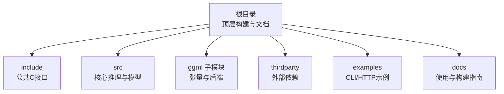
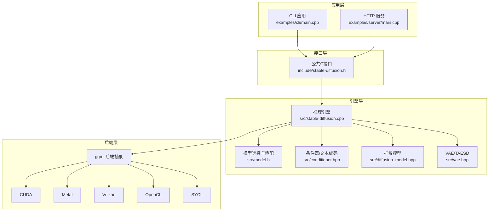
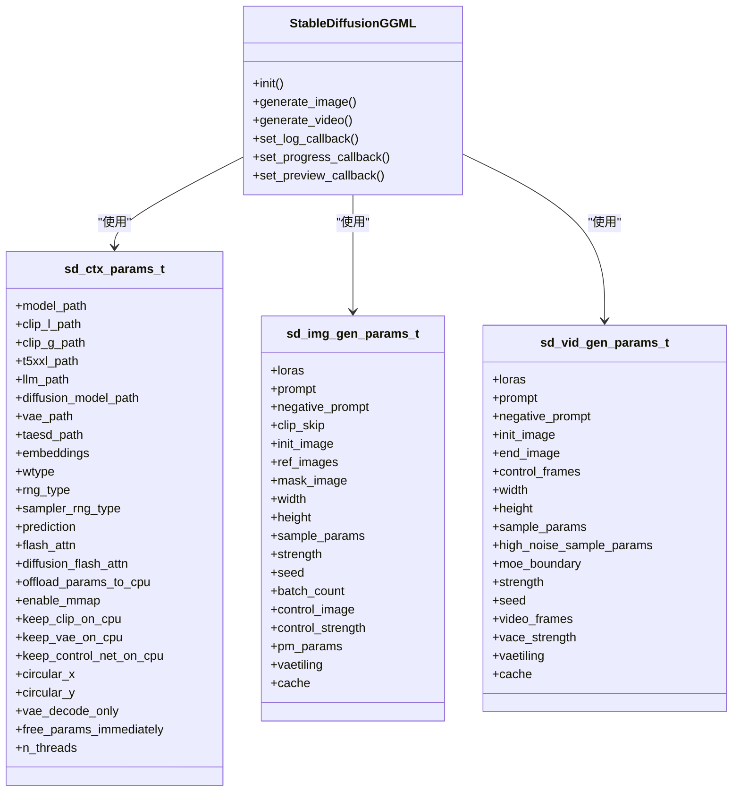
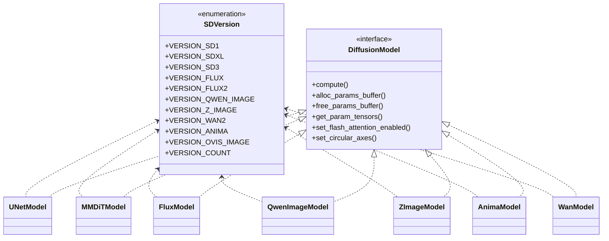
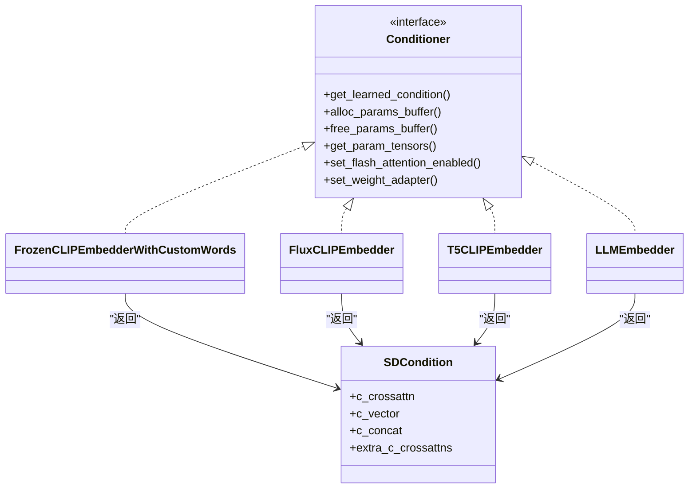
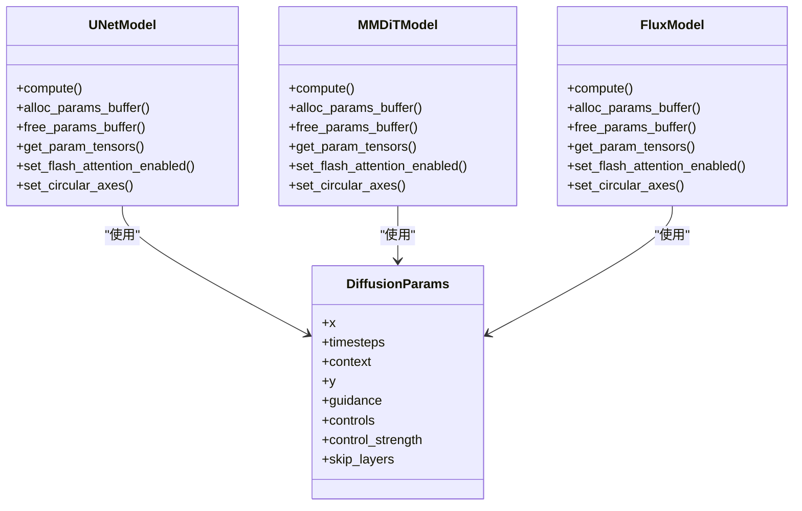
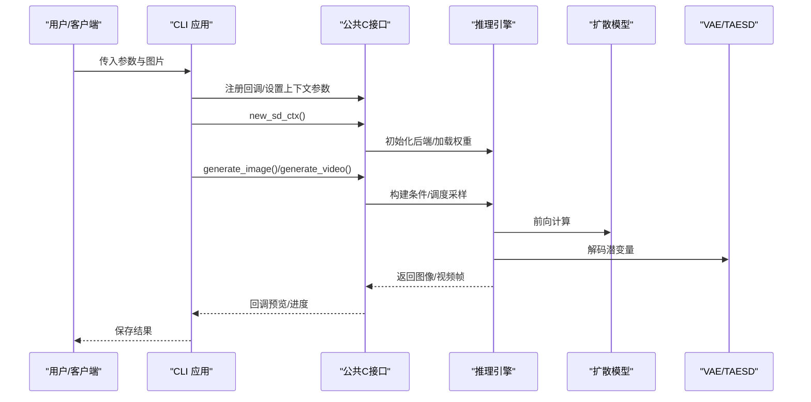
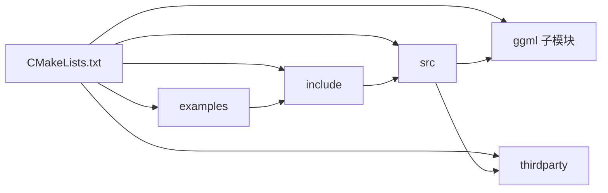

# 开发指南

<cite>
**本文引用的文件**
- [README.md](file://README.md)
- [CMakeLists.txt](file://CMakeLists.txt)
- [docs/build.md](file://docs/build.md)
- [include/stable-diffusion.h](file://include/stable-diffusion.h)
- [src/stable-diffusion.cpp](file://src/stable-diffusion.cpp)
- [src/model.h](file://src/model.h)
- [src/util.h](file://src/util.h)
- [src/unet.hpp](file://src/unet.hpp)
- [src/conditioner.hpp](file://src/conditioner.hpp)
- [src/diffusion_model.hpp](file://src/diffusion_model.hpp)
- [src/vae.hpp](file://src/vae.hpp)
- [examples/cli/main.cpp](file://examples/cli/main.cpp)
- [examples/server/main.cpp](file://examples/server/main.cpp)
- [thirdparty/CMakeLists.txt](file://thirdparty/CMakeLists.txt)
</cite>

## 目录
1. [简介](#简介)
2. [项目结构](#项目结构)
3. [核心组件](#核心组件)
4. [架构总览](#架构总览)
5. [详细组件分析](#详细组件分析)
6. [依赖关系分析](#依赖关系分析)
7. [性能考虑](#性能考虑)
8. [故障排查指南](#故障排查指南)
9. [结论](#结论)
10. [附录](#附录)

## 简介
本指南面向希望在稳定扩散.cpp项目上进行二次开发与扩展的工程师，覆盖从环境搭建、编译配置、调试技巧到代码结构、设计模式与扩展机制的完整开发工作流。项目基于纯C/C++实现，采用ggml作为张量与计算后端，支持多种硬件后端（CUDA、Metal、Vulkan、OpenCL、SYCL等），并提供CLI与HTTP服务示例，便于集成到不同平台与产品中。

## 项目结构
仓库采用“分层+模块化”的组织方式：
- 根目录：顶层构建脚本、文档与示例入口
- include：对外公开的C接口头文件
- src：核心推理引擎与模型实现
- ggml：子模块，提供跨平台张量与后端能力
- thirdparty：外部依赖（如压缩、HTTP等）
- examples：CLI与HTTP服务示例
- docs：各模型与功能的使用与构建说明



图示来源
- [CMakeLists.txt](file://CMakeLists.txt)
- [include/stable-diffusion.h](file://include/stable-diffusion.h)
- [src/stable-diffusion.cpp](file://src/stable-diffusion.cpp)

章节来源
- [README.md](file://README.md)
- [CMakeLists.txt](file://CMakeLists.txt)

## 核心组件
- 公共接口层：通过C接口暴露推理能力，便于多语言绑定与系统集成
- 推理引擎层：负责上下文初始化、后端选择、权重加载、调度器与采样器配置
- 模型适配层：按版本与架构选择对应的文本编码器、UNet/Flux/MMDiT等扩散模型与VAE
- 后端抽象层：以ggml后端为统一抽象，屏蔽CUDA/Metal/Vulkan/OpenCL/SYCL差异
- 示例应用层：CLI与HTTP服务，演示参数解析、回调与结果输出

章节来源
- [include/stable-diffusion.h](file://include/stable-diffusion.h)
- [src/stable-diffusion.cpp](file://src/stable-diffusion.cpp)
- [src/model.h](file://src/model.h)

## 架构总览
整体架构围绕“上下文-模型-后端”三层展开，推理流程由CLI/HTTP示例驱动，调用公共接口完成生成任务。



图示来源
- [examples/cli/main.cpp](file://examples/cli/main.cpp)
- [examples/server/main.cpp](file://examples/server/main.cpp)
- [include/stable-diffusion.h](file://include/stable-diffusion.h)
- [src/stable-diffusion.cpp](file://src/stable-diffusion.cpp)
- [src/model.h](file://src/model.h)
- [src/conditioner.hpp](file://src/conditioner.hpp)
- [src/diffusion_model.hpp](file://src/diffusion_model.hpp)
- [src/vae.hpp](file://src/vae.hpp)

## 详细组件分析

### 组件A：公共C接口与上下文管理
- 职责：定义推理参数、采样方法、调度器、缓存策略、LoRA与提示词处理；提供上下文创建/销毁、图像/视频生成、进度/预览回调注册等
- 关键点：
  - 参数结构体涵盖模型路径、权重类型、随机数类型、采样步数、调度器、引导强度、VAE平铺、Flash Attention开关等
  - 上下文初始化时根据传入参数选择后端、加载权重、分配参数缓冲区
  - 提供默认采样方法与调度器推断逻辑



图示来源
- [include/stable-diffusion.h](file://include/stable-diffusion.h)
- [src/stable-diffusion.cpp](file://src/stable-diffusion.cpp)

章节来源
- [include/stable-diffusion.h](file://include/stable-diffusion.h)
- [src/stable-diffusion.cpp](file://src/stable-diffusion.cpp)

### 组件B：模型版本与适配
- 职责：识别模型版本（SD1.x/SD2.x/SDXL/SD3/Flux/Flux.2/Qwen/Z-Image/Wan/Anima/Ovis等），按版本选择对应文本编码器、扩散模型与VAE实现
- 关键点：
  - 版本判断函数覆盖UNet/DiT/控制/入画等场景
  - 不同版本共享同一DiffusionModel接口，内部通过具体实现类（UNetModel、MMDiTModel、FluxModel等）解耦



图示来源
- [src/model.h](file://src/model.h)
- [src/diffusion_model.hpp](file://src/diffusion_model.hpp)

章节来源
- [src/model.h](file://src/model.h)
- [src/diffusion_model.hpp](file://src/diffusion_model.hpp)

### 组件C：条件器与文本编码
- 职责：将提示词转换为模型可理解的上下文向量，支持自定义嵌入、CLIP多分支、T5/LLM编码器以及触发词/移除触发词等高级特性
- 关键点：
  - 支持SD1/SD2/SDXL的不同CLIP变体与多分支
  - 可选启用Flash Attention，提升注意力计算效率
  - 支持PhotoMaker ID嵌入与参考图像引导



图示来源
- [src/conditioner.hpp](file://src/conditioner.hpp)

章节来源
- [src/conditioner.hpp](file://src/conditioner.hpp)

### 组件D：扩散模型与UNet/Flux/MMDiT
- 职责：实现不同架构的扩散模型前向计算，统一DiffusionModel接口
- 关键点：
  - UNetModel封装传统UNetRunner，支持视频时空Transformer
  - MMDiTModel用于SD3/Chroma等DiT架构
  - FluxModel用于Flux/Flux.2/Z-Image等架构，支持掩码与LLM条件
  - 支持Flash Attention与循环卷积轴设置



图示来源
- [src/diffusion_model.hpp](file://src/diffusion_model.hpp)
- [src/unet.hpp](file://src/unet.hpp)

章节来源
- [src/diffusion_model.hpp](file://src/diffusion_model.hpp)
- [src/unet.hpp](file://src/unet.hpp)

### 组件E：VAE与TAESD
- 职责：实现VAE编码/解码与快速解码（TAESD），支持视频VAE（WAN）与Tiny VAE
- 关键点：
  - AutoEncoderKL实现标准VAE
  - TinyAutoEncoder/TAESD加速解码
  - 支持Conv2d直连与平铺策略降低显存占用

```mermaid
classDiagram
class AutoEncoderKL
class TinyImageAutoEncoder
class TinyVideoAutoEncoder
class WAN : : WanVAERunner
class FakeVAE
AutoEncoderKL <.. VAE : "用于SD/SDXL"
TinyImageAutoEncoder <.. VAE : "用于SDXS/TAESD"
TinyVideoAutoEncoder <.. VAE : "用于WAN视频"
WAN : : WanVAERunner <.. VAE : "用于WAN"
FakeVAE <.. VAE : "用于Chroma Radiance"
```

图示来源
- [src/vae.hpp](file://src/vae.hpp)

章节来源
- [src/vae.hpp](file://src/vae.hpp)

### 组件F：示例应用（CLI/HTTP）
- CLI：解析命令行参数、加载输入图像/掩码/控制帧、注册日志与预览回调、调用生成接口并保存结果
- HTTP：基于httplib提供REST风格接口，支持多图生成、编辑与Base64返回



图示来源
- [examples/cli/main.cpp](file://examples/cli/main.cpp)
- [examples/server/main.cpp](file://examples/server/main.cpp)
- [include/stable-diffusion.h](file://include/stable-diffusion.h)
- [src/stable-diffusion.cpp](file://src/stable-diffusion.cpp)

章节来源
- [examples/cli/main.cpp](file://examples/cli/main.cpp)
- [examples/server/main.cpp](file://examples/server/main.cpp)

## 依赖关系分析
- 构建系统：CMake主工程控制选项（后端开关、共享库、系统ggml等），子目录引入ggml与thirdparty
- 运行时依赖：ggml后端（CPU/CUDA/Metal/Vulkan/OpenCL/SYCL）、zip压缩、JSON解析、HTTP（示例）



图示来源
- [CMakeLists.txt](file://CMakeLists.txt)
- [thirdparty/CMakeLists.txt](file://thirdparty/CMakeLists.txt)

章节来源
- [CMakeLists.txt](file://CMakeLists.txt)
- [thirdparty/CMakeLists.txt](file://thirdparty/CMakeLists.txt)

## 性能考虑
- 后端选择：优先使用CUDA/Metal/Vulkan等GPU后端；在资源受限环境下可回退CPU
- Flash Attention：在支持的模型与后端上启用，显著降低注意力计算开销
- 平铺与量化：VAE平铺与权重量化（GGUF/四量化等）可降低显存/内存占用
- 缓存策略：提供多种缓存模式（Easycache/UCache/DiT/Spectrum等），按场景选择
- 线程与内存：合理设置线程数与参数卸载策略，避免频繁拷贝

## 故障排查指南
- 构建失败
  - 确认已递归克隆子模块
  - 按需开启后端选项（如SD_CUDA/SD_METAL/SD_VULKAN等）
  - 使用系统ggml时确保已安装并正确发现
- 运行异常
  - 检查模型路径与权重格式（ckpt/safetensors/GGUF）
  - 核对提示词长度与Token化规则
  - 调整采样步数、调度器与引导强度
- 显存不足
  - 启用VAE平铺、关闭不必要的后端特性、降低分辨率或批大小
  - 使用更小的量化类型或TAESD加速解码
- 预览/进度无输出
  - 确认回调注册与预览间隔设置
  - 检查日志级别与颜色输出开关

章节来源
- [docs/build.md](file://docs/build.md)
- [src/stable-diffusion.cpp](file://src/stable-diffusion.cpp)
- [src/util.h](file://src/util.h)

## 结论
稳定扩散.cpp通过清晰的分层架构与统一的C接口，实现了对多模型、多后端与多应用场景的支持。开发者可基于现有框架快速扩展新模型、新硬件后端与新功能模块，并通过示例应用验证效果。建议在开发过程中遵循本文档的构建与调试流程，结合性能优化策略获得最佳体验。

## 附录

### A. 编译配置与环境搭建
- 获取源码与子模块
  - 递归克隆仓库并更新子模块
- CPU构建
  - 创建构建目录并执行CMake配置与编译
- GPU后端构建
  - CUDA：开启SD_CUDA
  - Metal：开启SD_METAL
  - Vulkan：开启SD_VULKAN
  - OpenCL：开启SD_OPENCL
  - SYCL：开启SD_SYCL并设置编译器
  - HIP/ROCm：开启SD_HIPBLAS（含设备目标设置）
  - MUSA：开启SD_MUSA并指定编译器
- 系统ggml
  - 通过SD_USE_SYSTEM_GGML启用系统安装的ggml库

章节来源
- [docs/build.md](file://docs/build.md)
- [CMakeLists.txt](file://CMakeLists.txt)

### B. 添加新模型支持（步骤指引）
- 新增版本枚举与判断函数
  - 在模型版本枚举中添加新版本常量
  - 实现版本判断辅助函数
- 扩展扩散模型实现
  - 在diffusion_model.hpp中新增模型类并实现DiffusionModel接口
  - 在推理引擎中根据版本选择对应实现
- 文本编码器适配
  - 如需新编码器，在conditioner.hpp中新增实现并接入
- 权重加载与名称映射
  - 在模型加载流程中处理新权重命名前缀
- 示例与参数
  - 在CLI/HTTP示例中完善参数解析与默认值

章节来源
- [src/model.h](file://src/model.h)
- [src/diffusion_model.hpp](file://src/diffusion_model.hpp)
- [src/conditioner.hpp](file://src/conditioner.hpp)
- [src/stable-diffusion.cpp](file://src/stable-diffusion.cpp)

### C. 添加新硬件后端（步骤指引）
- 在CMake中添加后端选项与编译宏
- 在推理引擎中增加后端初始化逻辑
- 在公共接口中补充后端相关参数与回调
- 在示例应用中完善参数解析与错误处理

章节来源
- [CMakeLists.txt](file://CMakeLists.txt)
- [src/stable-diffusion.cpp](file://src/stable-diffusion.cpp)
- [include/stable-diffusion.h](file://include/stable-diffusion.h)

### D. 添加新功能模块（LoRA/ControlNet/TAESD等）
- LoRA：在推理引擎中维护LoRA状态并在权重加载时合并
- ControlNet：在扩散模型前向中接入控制信号
- TAESD：在VAE解码阶段替换为快速解码路径
- 预览与缓存：通过回调与缓存参数结构体扩展

章节来源
- [src/stable-diffusion.cpp](file://src/stable-diffusion.cpp)
- [src/vae.hpp](file://src/vae.hpp)
- [include/stable-diffusion.h](file://include/stable-diffusion.h)

### E. 调试技巧与工具
- 日志与回调
  - 使用日志回调输出详细信息
  - 使用进度与预览回调观察中间结果
- 参数检查
  - 将参数序列化为字符串以便比对
  - 核对采样方法、调度器与引导强度
- 性能剖析
  - 启用不同后端与特性对比吞吐
  - 利用缓存与平铺策略评估显存占用

章节来源
- [include/stable-diffusion.h](file://include/stable-diffusion.h)
- [src/util.h](file://src/util.h)
- [src/stable-diffusion.cpp](file://src/stable-diffusion.cpp)