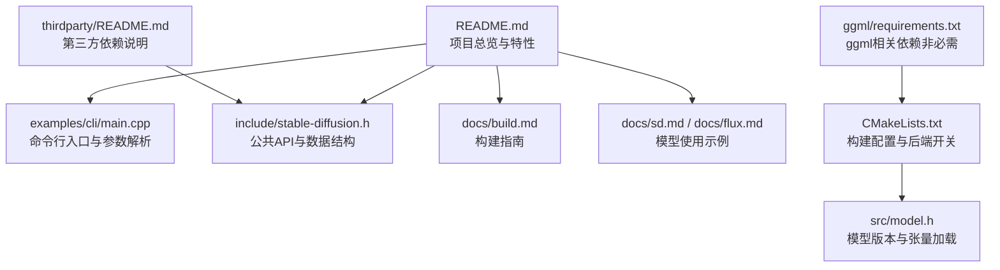
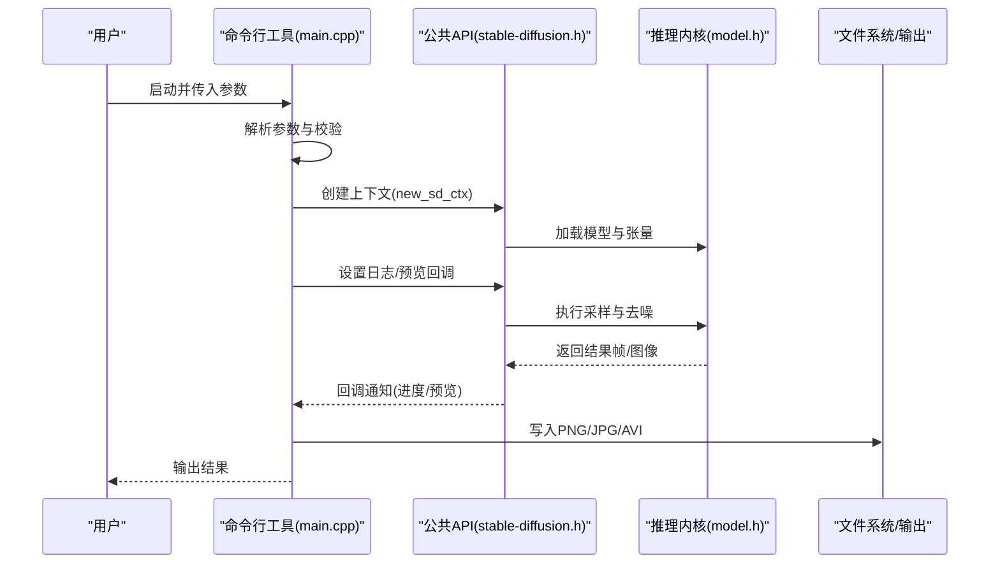

# 快速开始

<cite>
**本文引用的文件**
- [README.md](file://README.md)
- [docs/build.md](file://docs/build.md)
- [examples/cli/README.md](file://examples/cli/README.md)
- [examples/cli/main.cpp](file://examples/cli/main.cpp)
- [include/stable-diffusion.h](file://include/stable-diffusion.h)
- [CMakeLists.txt](file://CMakeLists.txt)
- [src/model.h](file://src/model.h)
- [docs/sd.md](file://docs/sd.md)
- [docs/flux.md](file://docs/flux.md)
- [docs/performance.md](file://docs/performance.md)
- [thirdparty/README.md](file://thirdparty/README.md)
- [ggml/requirements.txt](file://ggml/requirements.txt)
</cite>

## 目录
1. [简介](#简介)
2. [项目结构](#项目结构)
3. [核心组件](#核心组件)
4. [架构总览](#架构总览)
5. [详细组件分析](#详细组件分析)
6. [依赖与系统要求](#依赖与系统要求)
7. [安装与构建指南](#安装与构建指南)
8. [模型权重下载与配置](#模型权重下载与配置)
9. [基础图像生成功能示例](#基础图像生成功能示例)
10. [性能优化建议](#性能优化建议)
11. [常见问题排查](#常见问题排查)
12. [结论](#结论)

## 简介
本指南面向希望在本地快速运行稳定扩散.cpp（纯C/C++推理）的用户，覆盖从零开始的安装、构建、模型准备与首次生成任务的完整流程。无论你是初学者还是有经验的开发者，都可以根据本指南在最短时间内完成第一次图像生成。

## 项目结构
- 核心库与头文件：位于 include/ 与 src/，对外提供稳定的C接口（stable-diffusion.h），封装了文本编码器、扩散模型、VAE解码等推理能力。
- 示例程序：examples/cli/ 提供命令行工具，演示如何加载模型、设置参数并生成图片或视频。
- 文档：docs/ 下涵盖构建、性能、模型支持、量化与GGUF转换等专题文档。
- 构建系统：CMakeLists.txt 定义了多后端选项（CUDA、Metal、Vulkan、OpenCL、SYCL、MUSA等）与可选特性。
- 第三方依赖：thirdparty/ 包含轻量级依赖（如JSON、ZIP、httplib、stb等），减少外部系统依赖。

**图表来源**
- [README.md:1-202](file://README.md#L1-L202)
- [examples/cli/main.cpp:1-839](file://examples/cli/main.cpp#L1-L839)
- [include/stable-diffusion.h:1-423](file://include/stable-diffusion.h#L1-L423)
- [docs/build.md:1-174](file://docs/build.md#L1-L174)
- [docs/sd.md:1-37](file://docs/sd.md#L1-L37)
- [docs/flux.md:1-67](file://docs/flux.md#L1-L67)
- [CMakeLists.txt:1-200](file://CMakeLists.txt#L1-L200)
- [src/model.h:1-346](file://src/model.h#L1-L346)
- [thirdparty/README.md:1-10](file://thirdparty/README.md#L1-L10)
- [ggml/requirements.txt:1-12](file://ggml/requirements.txt#L1-L12)

**章节来源**
- [README.md:1-202](file://README.md#L1-L202)
- [CMakeLists.txt:1-200](file://CMakeLists.txt#L1-L200)

## 核心组件
- 公共API与数据结构：稳定扩散.cpp对外暴露一组C风格API（例如上下文创建、采样方法查询、图像生成等），并在头文件中定义了采样方法、调度器、预测类型、缓存策略、LoRA参数等枚举与结构体，便于统一管理不同模型与后端的差异。
- 模型加载与版本识别：内部通过模型版本枚举区分SD1.x、SDXL、SD3、FLUX、FLUX.2、Wan、Qwen Image、Z-Image、Anima、Chroma等，自动适配对应的编码器与扩散模块。
- 命令行工具：examples/cli/main.cpp 实现了参数解析、日志回调、预览回调、图像保存等功能，是验证安装与首次运行的最佳入口。

**章节来源**
- [include/stable-diffusion.h:1-423](file://include/stable-diffusion.h#L1-L423)
- [src/model.h:1-346](file://src/model.h#L1-L346)
- [examples/cli/main.cpp:1-839](file://examples/cli/main.cpp#L1-L839)

## 架构总览
下图展示了从命令行到推理执行的关键路径：参数解析 → 上下文初始化 → 模型加载 → 采样与去噪 → 预览/进度回调 → 结果保存。

**图表来源**
- [examples/cli/main.cpp:477-839](file://examples/cli/main.cpp#L477-L839)
- [include/stable-diffusion.h:338-423](file://include/stable-diffusion.h#L338-L423)
- [src/model.h:292-346](file://src/model.h#L292-L346)

## 详细组件分析

### 命令行工具与参数体系
- 参数分类：CLI选项（输出路径、预览、模式）、上下文选项（模型路径、文本编码器、VAE、LoRA目录、线程数、后端开关等）、生成选项（提示词、尺寸、步数、CFG、种子、采样方法、调度器等）。
- 关键行为：根据模式选择图像/视频/放大/转换；支持LoRA目录批量应用；支持控制网络、参考图像、掩码等扩展功能；支持预览回调输出中间帧或最终帧。
- 日志与颜色：支持详细日志与彩色标签输出，便于调试。

**章节来源**
- [examples/cli/README.md:1-151](file://examples/cli/README.md#L1-L151)
- [examples/cli/main.cpp:1-839](file://examples/cli/main.cpp#L1-L839)

### 公共API与数据结构
- 上下文与生成：new_sd_ctx/free_sd_ctx、generate_image/generate_video、预览回调、进度回调、日志回调。
- 采样与调度：采样方法（如Euler、DPM++等）、调度器（离散、Karras、SGM等）、自定义sigmas。
- 缓存策略：多种缓存模式（easycache、ucache、dbcache、taylorseer、cache-dit、spectrum等）及参数。
- LoRA与嵌入：LoRA列表、嵌入目录、应用时机（立即/运行时）。
- 预处理：Canny边缘检测等。

**章节来源**
- [include/stable-diffusion.h:1-423](file://include/stable-diffusion.h#L1-L423)

### 模型版本与支持范围
- 版本枚举覆盖SD1.x/SD2.x/SDXL/SD3/FLUX/FLUX.2/Wan/Qwen/Z-Image/Anima/Chroma/Ovis等，按版本自动启用对应编码器与扩散模块。
- 支持权重格式：PyTorch检查点（ckpt/pth）、Safetensors、GGUF。

**章节来源**
- [src/model.h:1-346](file://src/model.h#L1-L346)
- [README.md:40-100](file://README.md#L40-L100)

## 依赖与系统要求
- 平台支持：Linux、macOS、Windows、Android（Termux）。
- 后端支持：CPU（x86 AVX/AVX2/AVX512）、CUDA、Metal、Vulkan、OpenCL、SYCL、MUSA。
- 权重格式：ckpt/pth、safetensors、gguf。
- 第三方依赖：项目自带轻量级依赖（JSON、ZIP、httplib、stb等），不强制要求系统安装额外库。

**章节来源**
- [README.md:79-100](file://README.md#L79-L100)
- [thirdparty/README.md:1-10](file://thirdparty/README.md#L1-L10)

## 安装与构建指南

### 方案一：使用预编译二进制
- 步骤
  1) 访问发布页下载适用于你平台的预编译包。
  2) 解压后进入目录，确认存在可执行文件（如 bin/sd-cli）。
  3) 准备模型权重目录（见下一节）。
  4) 使用命令行工具进行首次生成测试（见“基础图像生成功能示例”）。

**章节来源**
- [README.md:102-125](file://README.md#L102-L125)

### 方案二：从源码构建
- 获取代码
  - 使用递归克隆以包含子模块。
  - 如已存在仓库，先拉取最新代码并更新子模块。
- 构建选项（按需开启）
  - CPU仅构建：直接CMake生成并编译。
  - OpenBLAS：启用OpenBLAS加速。
  - CUDA：启用GPU加速（需安装CUDA工具链）。
  - HIP/MUSA：AMD/摩尔线程GPU加速。
  - Metal/Vulkan/OpenCL/SYCL：对应平台加速后端。
  - Android/Windows ARM：提供专门的NDK/工具链与依赖准备步骤。
- 常见注意事项
  - Windows用户可参考HIP后端专用文档。
  - SYCL需要Intel oneAPI基础工具包。
  - Android需准备OpenCL头与ICD库并配置NDK。

**章节来源**
- [docs/build.md:1-174](file://docs/build.md#L1-L174)
- [CMakeLists.txt:1-200](file://CMakeLists.txt#L1-L200)

## 模型权重下载与配置
- 支持的模型与权重格式
  - 图像模型：SD1.x/SD2.x/SDXL/SDXL-Turbo/SD3/SD3.5/FLUX.1-dev/FLUX.1-schnell/FLUX.2-dev/FLUX.2-klein/Qwen Image/Z-Image/Ovis-Image/Anima等。
  - 权重格式：ckpt/pth、safetensors、gguf。
- 下载与示例
  - SD1.x/SD2.x/SDXL：可从Hugging Face下载原始权重。
  - FLUX：可直接下载预转换的GGUF，或自行转换。
  - 示例命令与参数详见各模型文档。
- 配置要点
  - 单文件模型：使用 --model 指定。
  - 多组件模型：分别指定扩散模型、VAE、CLIP等组件路径。
  - LoRA：通过 --lora-model-dir 指定目录，提示词中使用标准LoRA标记。
  - 参考图像/掩码/控制图：用于Inpaint/ControlNet/参考驱动等场景。

**章节来源**
- [README.md:40-100](file://README.md#L40-L100)
- [docs/sd.md:1-37](file://docs/sd.md#L1-L37)
- [docs/flux.md:1-67](file://docs/flux.md#L1-L67)

## 基础图像生成功能示例
以下示例基于命令行工具，展示从文本到图像的基本流程。请先准备好模型权重与输出目录。

- 最简示例（单次生成）
  - 命令：使用sd-cli加载模型并生成图片，输出到默认PNG文件。
  - 参数要点：-m 指定模型；-p 指定正向提示词；-o 指定输出路径；--steps 控制采样步数；--cfg-scale 控制CFG强度；--seed 指定随机种子。
- 进阶示例（高清/多步/LoRA）
  - 可通过-H/-W调整分辨率；-b设置批量数量；--vae指定VAE权重；--clip-on-cpu/ --vae-on-cpu降低显存占用；--offload-to-cpu将权重卸载至内存。
  - LoRA：将LoRA权重放入目录并通过 --lora-model-dir 指定，提示词中加入LoRA标记。
- 视频/放大/转换模式
  - -M 切换到 vid_gen/upscale/convert 模式，配合相应参数生成视频、放大图片或转换权重格式。

**章节来源**
- [README.md:102-125](file://README.md#L102-L125)
- [examples/cli/README.md:1-151](file://examples/cli/README.md#L1-L151)
- [examples/cli/main.cpp:477-839](file://examples/cli/main.cpp#L477-L839)

## 性能优化建议
- 启用Flash Attention：对扩散模型启用可节省显存并提升速度（部分后端/模型组合有效）。
- 权重卸载：使用 --offload-to-cpu 在显存紧张时将权重卸载至内存，避免降速。
- 量化与GGUF：使用更低精度的GGUF权重可显著降低显存占用（质量与精度可能略有差异）。
- 线程与调度：合理设置 --threads；采样方法与调度器可根据模型与硬件选择（默认通常已较优）。

**章节来源**
- [docs/performance.md:1-26](file://docs/performance.md#L1-L26)
- [include/stable-diffusion.h:247-282](file://include/stable-diffusion.h#L247-L282)

## 常见问题排查
- 无法找到可执行文件
  - 若使用源码构建，请确认已成功生成bin目录下的sd-cli。
- 显存不足
  - 尝试 --offload-to-cpu、--vae-on-cpu、--clip-on-cpu；或改用更小分辨率与更少步数。
- 生成质量不佳
  - 调整CFG scale、采样方法、步数；必要时使用更高精度权重或关闭量化。
- LoRA未生效
  - 确认LoRA命名与ComfyUI兼容；将LoRA权重置于 --lora-model-dir 指定目录；在提示词中正确添加LoRA标记。
- 后端未启用
  - 检查CMake构建时是否启用了对应后端（如SD_CUDA/SD_METAL/SD_VULKAN等）；Windows用户注意ROCm/HIP相关文档。

**章节来源**
- [docs/build.md:37-90](file://docs/build.md#L37-L90)
- [examples/cli/README.md:70-151](file://examples/cli/README.md#L70-L151)

## 结论
通过本指南，你可以：
- 选择预编译二进制或从源码构建稳定扩散.cpp；
- 准备并配置所需模型权重；
- 使用命令行工具完成首次图像生成；
- 根据硬件条件进行性能优化；
- 快速定位常见问题并解决。

建议在完成首次运行后，逐步探索不同模型、LoRA与后端配置，以获得更佳的生成体验与性能表现。