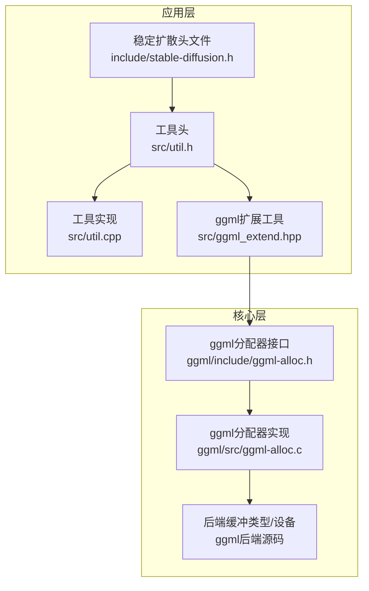
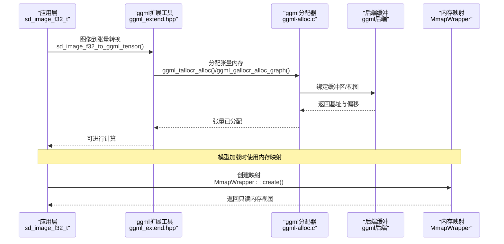
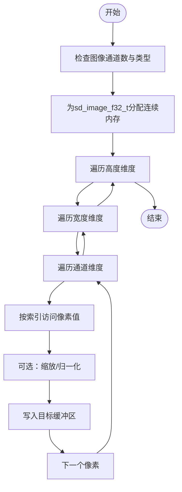
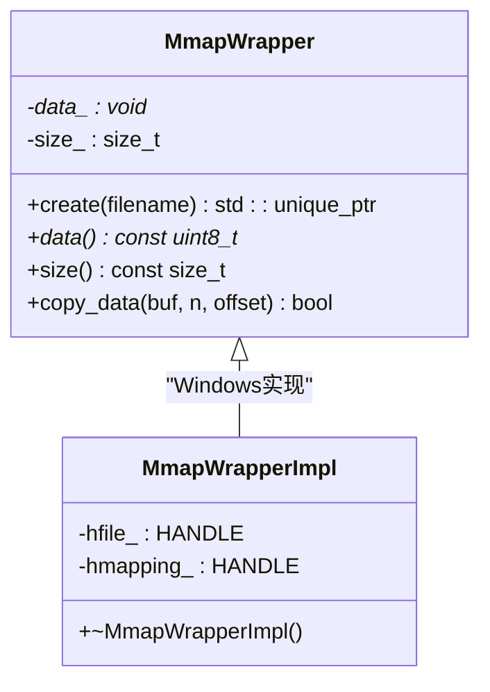
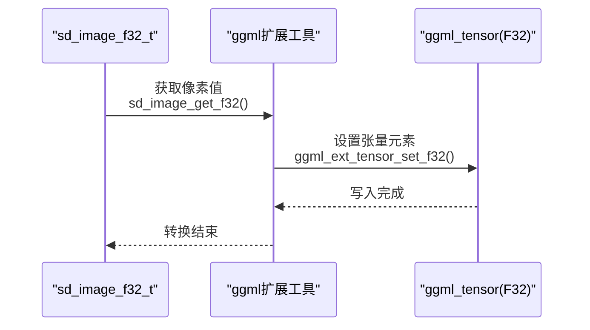
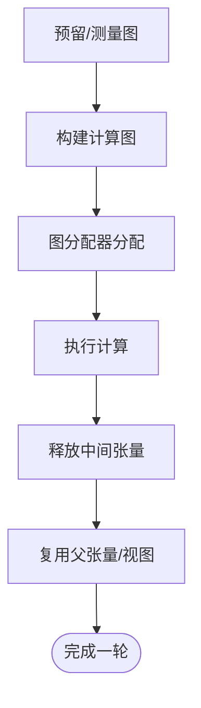
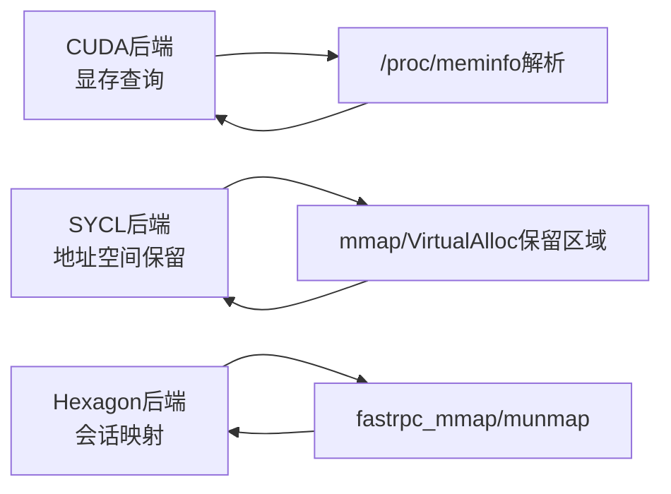
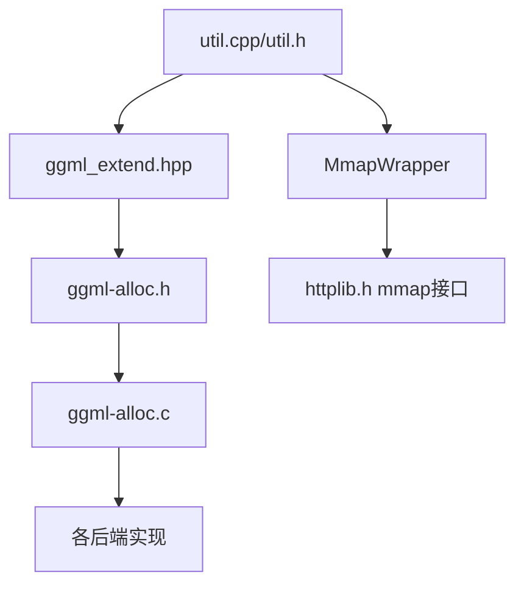

# 内存管理

<cite>
**本文引用的文件**
- [include/stable-diffusion.h](file://include/stable-diffusion.h)
- [src/util.h](file://src/util.h)
- [src/util.cpp](file://src/util.cpp)
- [src/ggml_extend.hpp](file://src/ggml_extend.hpp)
- [ggml/include/ggml-alloc.h](file://ggml/include/ggml-alloc.h)
- [ggml/src/ggml-alloc.c](file://ggml/src/ggml-alloc.c)
- [ggml/src/ggml-cuda/ggml-cuda.cu](file://ggml/src/ggml-cuda/ggml-cuda.cu)
- [ggml/src/ggml-sycl/dpct/helper.hpp](file://ggml/src/ggml-sycl/dpct/helper.hpp)
- [ggml/src/ggml-hexagon/ggml-hexagon.cpp](file://ggml/src/ggml-hexagon/ggml-hexagon.cpp)
- [thirdparty/httplib.h](file://thirdparty/httplib.h)
- [src/stable-diffusion.cpp](file://src/stable-diffusion.cpp)
</cite>

## 目录
1. [简介](#简介)
2. [项目结构](#项目结构)
3. [核心组件](#核心组件)
4. [架构总览](#架构总览)
5. [详细组件分析](#详细组件分析)
6. [依赖关系分析](#依赖关系分析)
7. [性能考量](#性能考量)
8. [故障排查指南](#故障排查指南)
9. [结论](#结论)
10. [附录](#附录)

## 简介
本文件系统性梳理稳定扩散.cpp在内存管理方面的设计与实现，重点覆盖以下主题：
- 内存分配策略：基于ggml的张量分配器与图级分配器，支持多后端缓冲区类型与动态分块。
- 内存映射技术（MMAP）：跨平台的文件内存映射封装，用于模型加载与只读数据共享。
- 内存池与虚拟缓冲：通过“虚拟缓冲”将连续逻辑地址空间切分为多个后端缓冲块，提升大模型内存复用能力。
- 垃圾回收与生命周期：基于图执行顺序的自动释放策略，避免中间张量重复占用内存。
- 数据结构sd_image_f32_t的内存布局与访问模式：图像到张量的转换、归一化与预处理流程。
- MmapWrapper类的实现原理与使用场景：统一的跨平台内存映射接口。
- 内存对齐与缓存友好布局：对齐计算、视图与连续化策略。
- 内存泄漏检测、使用监控与优化技巧：日志回调、可用内存探测、内存池参数调优。
- 针对不同硬件平台的最佳实践与调优建议。

## 项目结构
稳定扩散.cpp的内存管理由三层组成：
- 应用层：图像数据结构sd_image_f32_t、图像与张量互转工具函数、内存映射封装MmapWrapper。
- 中间层：ggml扩展工具集（张量迭代、设置/获取、拼接、切片等），以及张量到图像的转换。
- 核心层：ggml分配器（张量分配器与图分配器）、后端缓冲类型、虚拟缓冲与动态分块。

**图表来源**
- [include/stable-diffusion.h:148-211](file://include/stable-diffusion.h#L148-L211)
- [src/util.h:32-46](file://src/util.h#L32-L46)
- [src/util.cpp:481-634](file://src/util.cpp#L481-L634)
- [src/ggml_extend.hpp:432-484](file://src/ggml_extend.hpp#L432-L484)
- [ggml/include/ggml-alloc.h:13-82](file://ggml/include/ggml-alloc.h#L13-L82)
- [ggml/src/ggml-alloc.c:460-800](file://ggml/src/ggml-alloc.c#L460-L800)

**章节来源**
- [include/stable-diffusion.h:148-211](file://include/stable-diffusion.h#L148-L211)
- [src/util.h:32-46](file://src/util.h#L32-L46)
- [src/util.cpp:481-634](file://src/util.cpp#L481-L634)
- [src/ggml_extend.hpp:432-484](file://src/ggml_extend.hpp#L432-L484)
- [ggml/include/ggml-alloc.h:13-82](file://ggml/include/ggml-alloc.h#L13-L82)
- [ggml/src/ggml-alloc.c:460-800](file://ggml/src/ggml-alloc.c#L460-L800)

## 核心组件
- sd_image_f32_t：以HWC布局存储浮点像素值，data为指向连续内存的指针；提供归一化、裁剪与预处理函数。
- MmapWrapper：跨平台内存映射封装，Windows使用CreateFileMapping/MapViewOfFile，Unix使用mmap；提供安全的数据拷贝接口。
- ggml扩展工具：提供张量迭代、按索引读写、张量与图像互转、拼接与切片等操作。
- ggml分配器：张量分配器（tallocr）与图分配器（gallocr），支持多缓冲区、动态分块、对齐与视图复用。

**章节来源**
- [src/util.h:32-46](file://src/util.h#L32-L46)
- [src/util.cpp:98-230](file://src/util.cpp#L98-L230)
- [src/ggml_extend.hpp:170-198](file://src/ggml_extend.hpp#L170-L198)
- [src/ggml_extend.hpp:432-484](file://src/ggml_extend.hpp#L432-L484)
- [ggml/include/ggml-alloc.h:13-82](file://ggml/include/ggml-alloc.h#L13-L82)

## 架构总览
下图展示从应用层到核心层的内存管理交互路径，包括图像数据流转、张量分配与释放、以及后端缓冲的使用。

**图表来源**
- [src/ggml_extend.hpp:472-484](file://src/ggml_extend.hpp#L472-L484)
- [ggml/src/ggml-alloc.c:64-95](file://ggml/src/ggml-alloc.c#L64-L95)
- [ggml/src/ggml-alloc.c:721-800](file://ggml/src/ggml-alloc.c#L721-L800)
- [src/util.cpp:114-230](file://src/util.cpp#L114-L230)

## 详细组件分析

### 组件A：sd_image_f32_t数据结构与访问模式
- 内存布局：width × height × channel的连续浮点数组，通道优先级为CHW或HWC取决于上游数据；提供按像素索引访问函数。
- 访问模式：逐像素读取/写入，支持缩放（0-255到0-1或反向）、归一化（均值/方差）、双线性插值缩放。
- 使用场景：图像预处理、CLIP视觉编码前的输入准备、VAE解码后的输出回传。

**图表来源**
- [src/util.h:32-46](file://src/util.h#L32-L46)
- [src/util.cpp:482-634](file://src/util.cpp#L482-L634)

**章节来源**
- [src/util.h:32-46](file://src/util.h#L32-L46)
- [src/util.cpp:482-634](file://src/util.cpp#L482-L634)

### 组件B：MmapWrapper类的实现与使用
- 跨平台实现：Windows使用CreateFileMapping/MapViewOfFile/UnmapViewOfFile/CloseHandle；Unix使用open/fstat/mmap/munmap。
- 安全接口：提供copy_data(offset, n)进行安全拷贝，避免越界；析构时自动释放资源。
- 使用场景：模型权重文件、GGUF文件的只读映射，减少内存占用与IO开销。

**图表来源**
- [src/util.h:47-67](file://src/util.h#L47-L67)
- [src/util.cpp:98-230](file://src/util.cpp#L98-L230)

**章节来源**
- [src/util.h:47-67](file://src/util.h#L47-L67)
- [src/util.cpp:98-230](file://src/util.cpp#L98-L230)

### 组件C：ggml扩展工具与张量-图像互转
- 张量迭代与读写：提供按坐标读取/设置float/f16/i32的内联函数，支持后端张量直接读取。
- 图像到张量：sd_image_f32_to_ggml_tensor，按HWC布局写入F32张量。
- 视图与连续化：提供ggml_ext_cont确保张量连续，便于高效内核访问。

**图表来源**
- [src/ggml_extend.hpp:208-214](file://src/ggml_extend.hpp#L208-L214)
- [src/ggml_extend.hpp:472-484](file://src/ggml_extend.hpp#L472-L484)
- [src/ggml_extend.hpp:170-198](file://src/ggml_extend.hpp#L170-L198)

**章节来源**
- [src/ggml_extend.hpp:208-214](file://src/ggml_extend.hpp#L208-L214)
- [src/ggml_extend.hpp:472-484](file://src/ggml_extend.hpp#L472-L484)
- [src/ggml_extend.hpp:170-198](file://src/ggml_extend.hpp#L170-L198)

### 组件D：ggml分配器（张量与图）
- 张量分配器（tallocr）：按对齐要求在单一缓冲中线性分配，适合小规模张量。
- 图分配器（gallocr）：基于拓扑的动态分配，支持多缓冲、视图复用、父张量复用、自动释放。
- 虚拟缓冲（vbuffer）：将连续逻辑地址空间拆分为多个后端缓冲块，提升大模型内存复用。

**图表来源**
- [ggml/include/ggml-alloc.h:46-82](file://ggml/include/ggml-alloc.h#L46-L82)
- [ggml/src/ggml-alloc.c:721-800](file://ggml/src/ggml-alloc.c#L721-L800)
- [ggml/src/ggml-alloc.c:427-449](file://ggml/src/ggml-alloc.c#L427-L449)

**章节来源**
- [ggml/include/ggml-alloc.h:46-82](file://ggml/include/ggml-alloc.h#L46-L82)
- [ggml/src/ggml-alloc.c:427-449](file://ggml/src/ggml-alloc.c#L427-L449)
- [ggml/src/ggml-alloc.c:721-800](file://ggml/src/ggml-alloc.c#L721-L800)

### 组件E：内存映射在不同后端中的应用
- CUDA后端：通过/dev/nvidia-uvm或驱动接口进行显存管理，运行时查询可用显存信息辅助决策。
- SYCL后端：保留一段地址空间作为虚拟地址区域，管理设备指针到分配块的映射，支持调试填充。
- Hexagon后端：fastrpc_mmap将缓冲映射到会话域，支持fd映射与取消映射。

**图表来源**
- [ggml/src/ggml-cuda/ggml-cuda.cu:4353-4387](file://ggml/src/ggml-cuda/ggml-cuda.cu#L4353-L4387)
- [ggml/src/ggml-sycl/dpct/helper.hpp:1179-1311](file://ggml/src/ggml-sycl/dpct/helper.hpp#L1179-L1311)
- [ggml/src/ggml-hexagon/ggml-hexagon.cpp:225-266](file://ggml/src/ggml-hexagon/ggml-hexagon.cpp#L225-L266)

**章节来源**
- [ggml/src/ggml-cuda/ggml-cuda.cu:4353-4387](file://ggml/src/ggml-cuda/ggml-cuda.cu#L4353-L4387)
- [ggml/src/ggml-sycl/dpct/helper.hpp:1179-1311](file://ggml/src/ggml-sycl/dpct/helper.hpp#L1179-L1311)
- [ggml/src/ggml-hexagon/ggml-hexagon.cpp:225-266](file://ggml/src/ggml-hexagon/ggml-hexagon.cpp#L225-L266)

## 依赖关系分析
- 应用层依赖ggml扩展工具进行图像与张量互转，并通过MmapWrapper进行模型文件只读映射。
- ggml扩展工具依赖ggml分配器接口，后者在运行时根据后端缓冲类型进行内存分配与释放。
- 不同后端（CUDA/SYCL/Hexagon）各自实现内存映射与地址空间管理，但遵循统一的接口约定。

**图表来源**
- [src/util.cpp:481-634](file://src/util.cpp#L481-L634)
- [src/ggml_extend.hpp:432-484](file://src/ggml_extend.hpp#L432-L484)
- [ggml/include/ggml-alloc.h:13-82](file://ggml/include/ggml-alloc.h#L13-L82)
- [ggml/src/ggml-alloc.c:460-800](file://ggml/src/ggml-alloc.c#L460-L800)
- [thirdparty/httplib.h:3488-3531](file://thirdparty/httplib.h#L3488-L3531)

**章节来源**
- [src/util.cpp:481-634](file://src/util.cpp#L481-L634)
- [src/ggml_extend.hpp:432-484](file://src/ggml_extend.hpp#L432-L484)
- [ggml/include/ggml-alloc.h:13-82](file://ggml/include/ggml-alloc.h#L13-L82)
- [ggml/src/ggml-alloc.c:460-800](file://ggml/src/ggml-alloc.c#L460-L800)
- [thirdparty/httplib.h:3488-3531](file://thirdparty/httplib.h#L3488-L3531)

## 性能考量
- 对齐与连续化：使用aligned_offset与ggml_cont确保张量按后端对齐要求存放，减少跨页访问与TLB抖动。
- 视图复用与原地计算：gallocr在满足布局一致的前提下复用父张量内存，降低峰值内存占用。
- 动态分块与虚拟缓冲：将大模型切分为多块缓冲，避免单次超大分配失败，提高内存碎片利用效率。
- 缓存友好布局：HWC或CHW布局的选择需结合具体算子的内存访问模式；必要时进行连续化与重排。
- 平台差异：CUDA显存查询与SYCL地址空间保留有助于在运行时做出更合理的内存分配决策。

[本节为通用指导，无需特定文件引用]

## 故障排查指南
- 内存不足错误：当缓冲区无法满足张量分配时，分配器会记录错误并中止；检查模型尺寸、批大小与后端可用内存。
- 映射失败：Windows/Unix映射失败时返回空指针；确认文件存在、权限与路径正确。
- 越界访问：MmapWrapper::copy_data提供边界检查；若返回false，检查offset与n是否超出映射范围。
- 日志与进度回调：通过sd_set_log_callback与sd_set_progress_callback输出调试信息，定位瓶颈步骤。

**章节来源**
- [ggml/src/ggml-alloc.c:83-95](file://ggml/src/ggml-alloc.c#L83-L95)
- [src/util.cpp:224-230](file://src/util.cpp#L224-L230)
- [include/stable-diffusion.h:344-347](file://include/stable-diffusion.h#L344-L347)

## 结论
稳定扩散.cpp的内存管理以ggml为核心，结合跨平台内存映射与图级分配策略，在保证性能的同时兼顾了灵活性与可移植性。通过sd_image_f32_t与ggml扩展工具，实现了高效的图像-张量互转；借助gallocr与虚拟缓冲，有效降低了大模型的峰值内存压力。针对不同后端的内存映射与地址空间管理进一步增强了系统的鲁棒性。建议在实际部署中结合硬件特性与工作负载，合理配置对齐、分块与缓存策略，并利用日志与可用内存探测进行持续优化。

[本节为总结性内容，无需特定文件引用]

## 附录
- 关键API与数据结构路径参考：
  - [sd_image_f32_t定义:32-46](file://src/util.h#L32-L46)
  - [sd_image_f32_to_ggml_tensor:472-484](file://src/ggml_extend.hpp#L472-L484)
  - [MmapWrapper接口:47-67](file://src/util.h#L47-L67)
  - [MmapWrapper::create:114-230](file://src/util.cpp#L114-L230)
  - [ggml_tallocr/ggml_gallocr接口:13-82](file://ggml/include/ggml-alloc.h#L13-L82)
  - [ggml_gallocr实现要点:721-800](file://ggml/src/ggml-alloc.c#L721-L800)
  - [CUDA显存查询:4353-4387](file://ggml/src/ggml-cuda/ggml-cuda.cu#L4353-L4387)
  - [SYCL地址空间保留:1179-1311](file://ggml/src/ggml-sycl/dpct/helper.hpp#L1179-L1311)
  - [Hexagon mmap示例:225-266](file://ggml/src/ggml-hexagon/ggml-hexagon.cpp#L225-L266)
  - [httplib mmap接口:3488-3531](file://thirdparty/httplib.h#L3488-L3531)