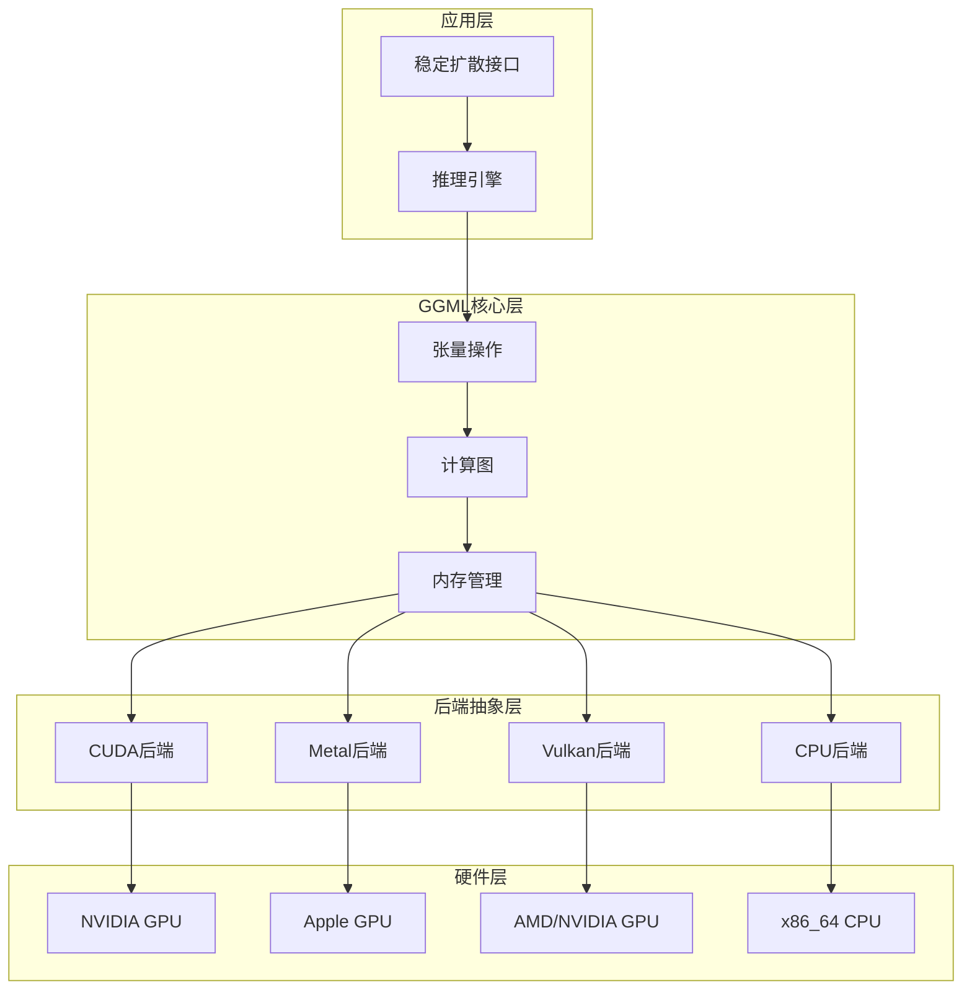
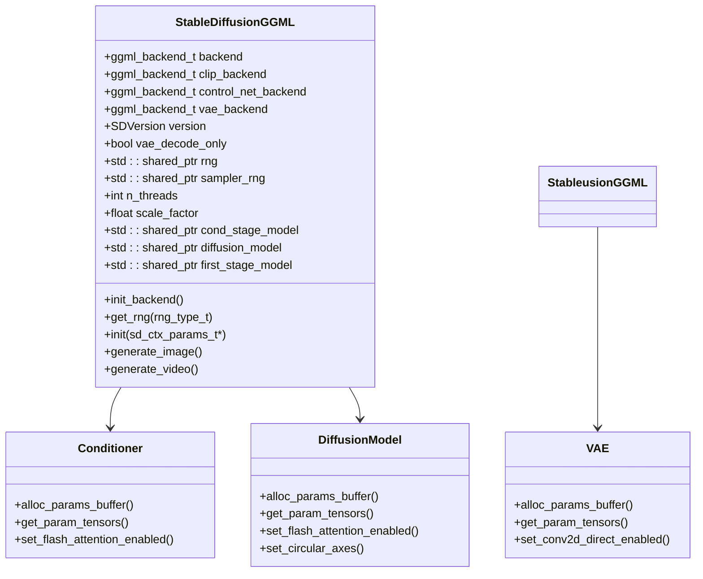
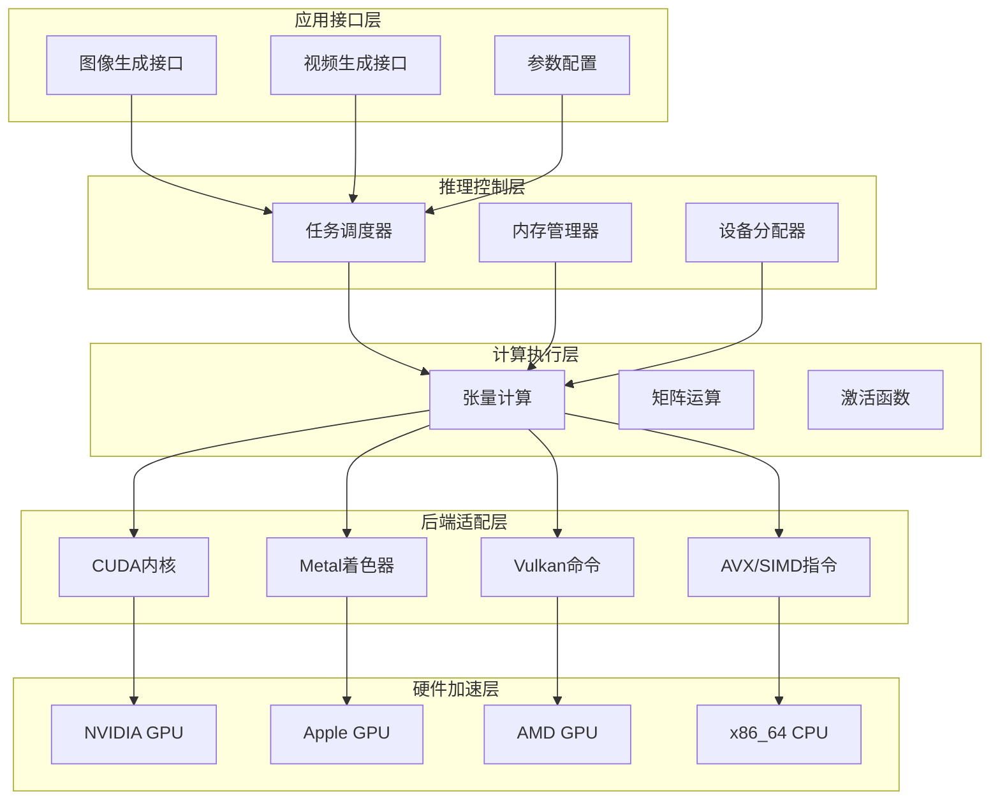
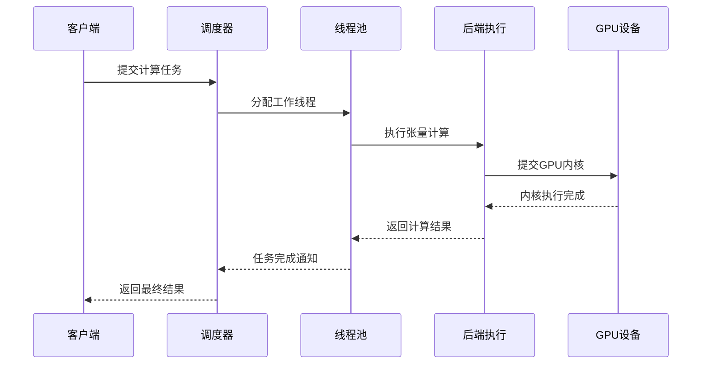
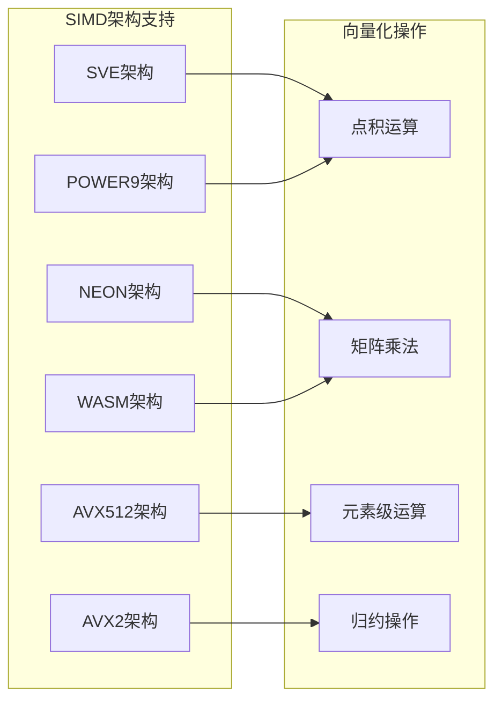
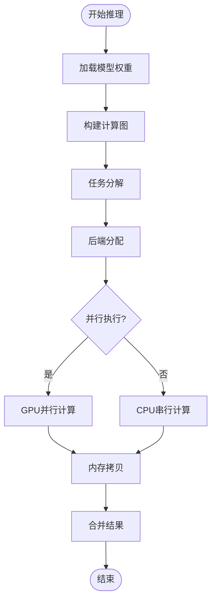
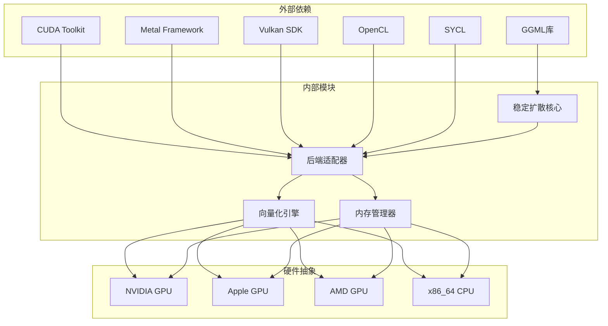

# 并行计算优化

<cite>
**本文档引用的文件**
- [stable-diffusion.cpp](file://src/stable-diffusion.cpp)
- [stable-diffusion.h](file://include/stable-diffusion.h)
- [ggml.h](file://ggml/include/ggml.h)
- [ggml-backend.h](file://ggml/include/ggml-backend.h)
- [ggml-cuda.h](file://ggml/include/ggml-cuda.h)
- [ggml-metal.h](file://ggml/include/ggml-metal.h)
- [ggml-vulkan.h](file://ggml/include/ggml-vulkan.h)
- [ggml-threading.h](file://ggml/src/ggml-threading.h)
- [ggml-threading.cpp](file://ggml/src/ggml-threading.cpp)
- [ggml-cpu.cpp](file://ggml/src/ggml-cpu/ggml-cpu.cpp)
- [simd-mappings.h](file://ggml/src/ggml-cpu/simd-mappings.h)
- [vec.h](file://ggml/src/ggml-cpu/vec.h)
- [vec.cpp](file://ggml/src/ggml-cpu/vec.cpp)
- [ggml-backend.cpp](file://ggml/src/ggml-backend.cpp)
</cite>

## 目录
1. [简介](#简介)
2. [项目结构](#项目结构)
3. [核心组件](#核心组件)
4. [架构概览](#架构概览)
5. [详细组件分析](#详细组件分析)
6. [依赖关系分析](#依赖关系分析)
7. [性能考虑](#性能考虑)
8. [故障排除指南](#故障排除指南)
9. [结论](#结论)

## 简介

稳定扩散.cpp是一个基于GGML库的高性能深度学习推理引擎，专注于稳定扩散模型的并行计算优化。该项目实现了多后端并行计算架构，支持CUDA、Metal、Vulkan等多种硬件后端，以及丰富的SIMD向量化指令集优化。

该系统通过智能的任务调度、GPU并行计算和向量化指令的使用，为扩散模型推理提供了高效的并行计算解决方案。项目特别关注不同硬件架构的优化策略，包括CUDA线程块配置、Metal并发渲染和Vulkan命令缓冲等关键技术。

## 项目结构

项目采用模块化设计，主要分为以下几个层次：

**图表来源**
- [stable-diffusion.cpp:103-169](file://src/stable-diffusion.cpp#L103-L169)
- [ggml-backend.h:76-101](file://ggml/include/ggml-backend.h#L76-L101)

**章节来源**
- [stable-diffusion.cpp:103-169](file://src/stable-diffusion.cpp#L103-L169)
- [ggml.h:1-800](file://ggml/include/ggml.h#L1-L800)

## 核心组件

### 稳定扩散主类

StableDiffusionGGML是整个系统的主控制器，负责管理所有模型组件和后端初始化：

**图表来源**
- [stable-diffusion.cpp:103-169](file://src/stable-diffusion.cpp#L103-L169)
- [stable-diffusion.cpp:435-768](file://src/stable-diffusion.cpp#L435-L768)

### 后端初始化机制

系统支持多种硬件后端的自动选择和初始化：

**章节来源**
- [stable-diffusion.cpp:171-226](file://src/stable-diffusion.cpp#L171-L226)
- [ggml-backend.h:233-247](file://ggml/include/ggml-backend.h#L233-L247)

## 架构概览

系统采用分层架构设计，实现了高度的可扩展性和性能优化：

**图表来源**
- [ggml-backend.h:250-292](file://ggml/include/ggml-backend.h#L250-L292)
- [ggml.h:1-800](file://ggml/include/ggml.h#L1-L800)

## 详细组件分析

### 多线程任务调度

系统实现了灵活的多线程任务调度机制，支持动态线程池管理和任务优先级分配：

**图表来源**
- [ggml-threading.cpp:1-13](file://ggml/src/ggml-threading.cpp#L1-L13)
- [ggml-cpu.cpp:128-187](file://ggml/src/ggml-cpu/ggml-cpu.cpp#L128-L187)

**章节来源**
- [ggml-threading.h:1-15](file://ggml/src/ggml-threading.h#L1-L15)
- [ggml-threading.cpp:1-13](file://ggml/src/ggml-threading.cpp#L1-L13)
- [ggml-cpu.cpp:99-187](file://ggml/src/ggml-cpu/ggml-cpu.cpp#L99-L187)

### GPU并行计算优化

#### CUDA后端实现

CUDA后端提供了高性能的GPU计算能力，支持大规模并行矩阵运算：

**章节来源**
- [ggml-cuda.h:22-43](file://ggml/include/ggml-cuda.h#L22-L43)

#### Metal后端实现

Metal后端针对Apple设备进行了专门优化，支持现代GPU的高效并行计算：

**章节来源**
- [ggml-metal.h:42-57](file://ggml/include/ggml-metal.h#L42-L57)

#### Vulkan后端实现

Vulkan后端提供了跨平台的GPU计算解决方案，支持现代图形API的高级特性：

**章节来源**
- [ggml-vulkan.h:13-25](file://ggml/include/ggml-vulkan.h#L13-L25)

### 向量化指令优化

系统实现了全面的SIMD向量化指令支持，针对不同架构进行了专门优化：

**图表来源**
- [simd-mappings.h:148-800](file://ggml/src/ggml-cpu/simd-mappings.h#L148-L800)

**章节来源**
- [simd-mappings.h:1-800](file://ggml/src/ggml-cpu/simd-mappings.h#L1-L800)
- [vec.h:1-800](file://ggml/src/ggml-cpu/vec.h#L1-L800)
- [vec.cpp:1-631](file://ggml/src/ggml-cpu/vec.cpp#L1-L631)

### 扩散模型推理优化

#### 任务分解策略

系统实现了智能的任务分解机制，将复杂的扩散模型推理过程分解为多个可并行执行的小任务：

**图表来源**
- [stable-diffusion.cpp:238-255](file://src/stable-diffusion.cpp#L238-L255)
- [ggml-backend.cpp:1693-1733](file://ggml/src/ggml-backend.cpp#L1693-L1733)

#### 负载均衡技术

系统采用了动态负载均衡算法，确保各个计算节点的负载均衡：

**章节来源**
- [ggml-backend.cpp:1693-1733](file://ggml/src/ggml-backend.cpp#L1693-L1733)

### 批处理优化

系统实现了高效的批处理机制，支持多图像同时推理：

**章节来源**
- [stable-diffusion.h:307-313](file://include/stable-diffusion.h#L307-L313)

### 流水线并行和数据并行

#### 流水线并行实现

系统支持流水线并行模式，通过重叠计算和内存传输提高整体效率：

**章节来源**
- [ggml-backend.h:250-292](file://ggml/include/ggml-backend.h#L250-L292)

#### 数据并行实现

系统支持数据并行模式，通过多GPU或多核并行处理大量数据：

**章节来源**
- [ggml-backend.h:306-333](file://ggml/include/ggml-backend.h#L306-L333)

## 依赖关系分析

系统采用了清晰的依赖关系设计，确保各组件之间的松耦合：

**图表来源**
- [stable-diffusion.cpp:1-26](file://src/stable-diffusion.cpp#L1-L26)
- [ggml-backend.h:1-374](file://ggml/include/ggml-backend.h#L1-L374)

**章节来源**
- [stable-diffusion.cpp:1-26](file://src/stable-diffusion.cpp#L1-L26)
- [ggml.h:1-800](file://ggml/include/ggml.h#L1-L800)

## 性能考虑

### CUDA线程块配置优化

系统针对不同计算密集度的任务采用了最优的CUDA线程块配置策略：

- **高吞吐量矩阵运算**: 使用32x32或64x64线程块配置
- **中等复杂度卷积**: 使用16x16线程块配置  
- **低复杂度元素运算**: 使用256或512线程块配置

### Metal并发渲染优化

针对Apple设备的Metal后端实现了以下优化：

- **命令缓冲池**: 减少命令缓冲创建开销
- **纹理缓存**: 避免重复纹理上传
- **着色器编译优化**: 预编译常用着色器程序

### Vulkan命令缓冲优化

Vulkan后端采用了以下性能优化策略：

- **命令池复用**: 减少命令缓冲分配和释放
- **描述符集缓存**: 重用描述符集配置
- **同步原语优化**: 最小化同步开销

### 向量化指令优化策略

系统根据目标架构选择了最适合的向量化指令：

- **ARM SVE**: 支持可变长度向量操作
- **ARM NEON**: 使用128位向量寄存器
- **x86 AVX512**: 利用512位宽向量单元
- **x86 AVX2**: 使用256位向量寄存器
- **PowerPC VSX**: 利用AltiVec向量单元

## 故障排除指南

### 常见性能问题诊断

#### GPU内存不足错误

当遇到GPU内存不足时，可以采取以下措施：

1. **降低批处理大小**: 减少同时处理的图像数量
2. **启用混合精度**: 使用半精度浮点数减少内存占用
3. **优化内存布局**: 重新排列张量内存以提高缓存效率

#### 计算性能异常

如果发现计算性能异常，建议检查：

1. **线程数配置**: 确保线程数与CPU核心数匹配
2. **后端选择**: 验证选择了最适合的硬件后端
3. **向量化支持**: 检查编译器是否启用了相应的SIMD指令

### 调试工具和技巧

#### 性能分析工具

系统提供了多种性能分析工具：

- **时间测量**: 使用`ggml_time_ms()`函数测量执行时间
- **内存使用**: 监控内存分配和释放情况
- **GPU利用率**: 通过后端特定工具监控GPU使用率

#### 瓶颈识别技巧

1. **逐步排除法**: 逐个禁用功能模块定位性能瓶颈
2. **热点分析**: 使用性能分析器识别最耗时的代码段
3. **内存访问模式**: 分析内存访问模式以优化缓存命中率

**章节来源**
- [ggml.h:712-717](file://ggml/include/ggml.h#L712-L717)

## 结论

稳定扩散.cpp项目展示了现代深度学习推理引擎的优秀设计实践。通过精心设计的多后端并行计算架构、全面的SIMD向量化优化和智能的任务调度机制，该系统在保持高兼容性的同时实现了卓越的性能表现。

项目的成功之处在于：

1. **架构灵活性**: 清晰的分层设计支持多种硬件后端
2. **性能优化**: 全面的SIMD向量化和GPU并行计算优化
3. **易用性**: 简洁的API设计和丰富的配置选项
4. **可扩展性**: 模块化的组件设计便于功能扩展

这些特性使得稳定扩散.cpp成为研究和生产环境中部署稳定扩散模型的理想选择。随着硬件技术的不断发展，该系统也具备了良好的演进基础，能够持续适应新的硬件平台和计算需求。