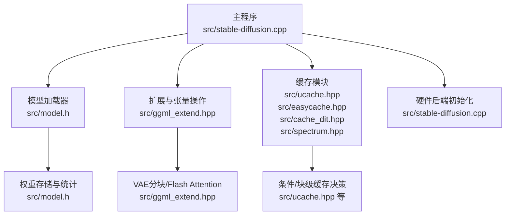
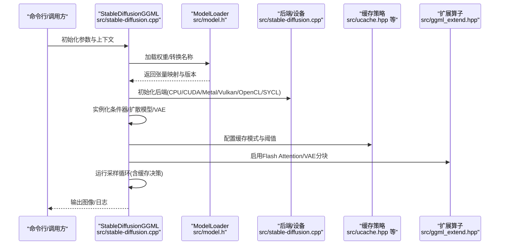
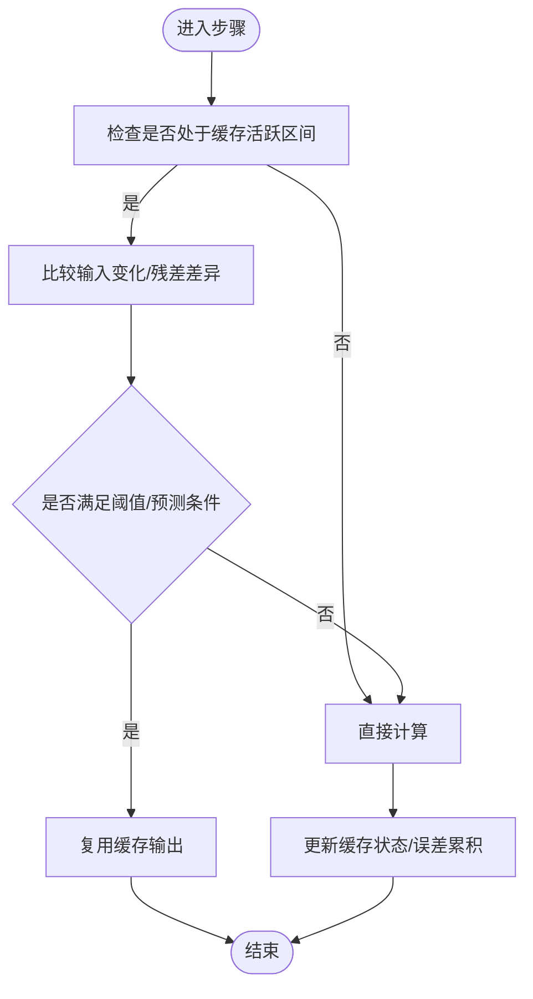
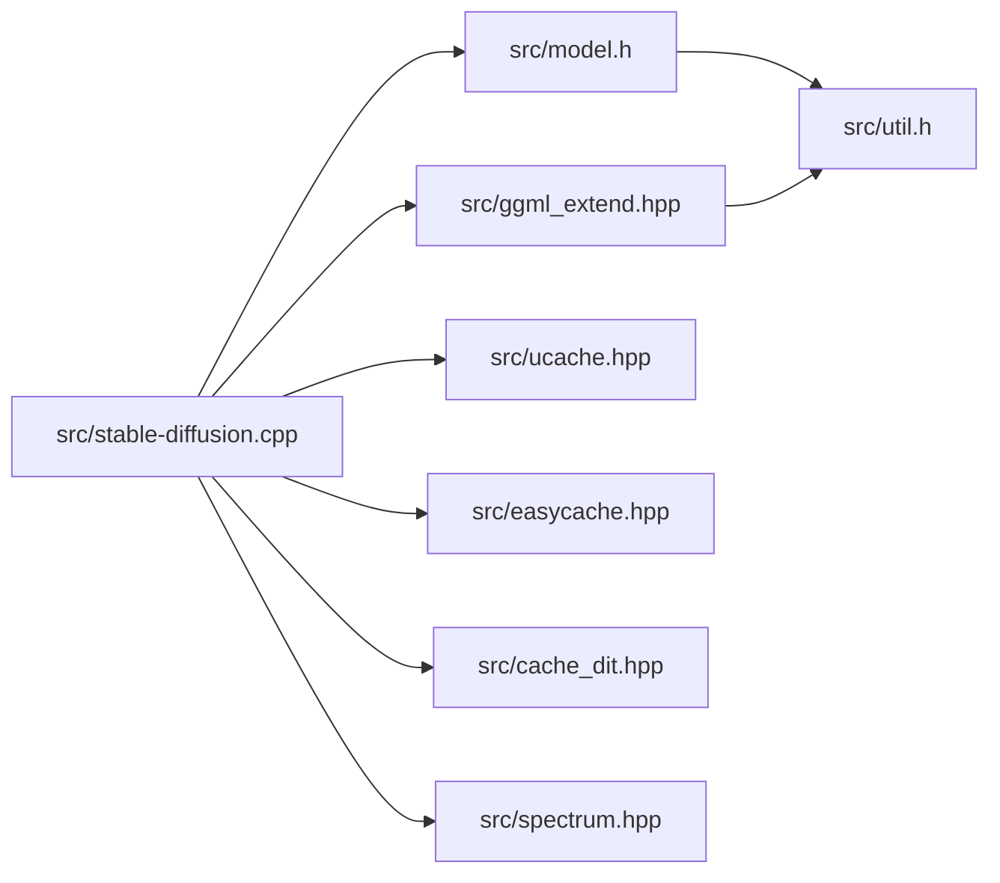

# 性能优化

<cite>
**本文引用的文件**
- [README.md](file://README.md)
- [性能文档](file://docs/performance.md)
- [缓存文档](file://docs/caching.md)
- [量化与GGUF文档](file://docs/quantization_and_gguf.md)
- [主程序源码](file://src/stable-diffusion.cpp)
- [扩展头文件](file://src/ggml_extend.hpp)
- [模型加载器头文件](file://src/model.h)
- [工具函数头文件](file://src/util.h)
- [UCache缓存实现](file://src/ucache.hpp)
- [EasyCache缓存实现](file://src/easycache.hpp)
- [CacheDIT缓存实现](file://src/cache_dit.hpp)
- [Spectrum缓存实现](file://src/spectrum.hpp)
</cite>

## 目录
1. [简介](#简介)
2. [项目结构](#项目结构)
3. [核心组件](#核心组件)
4. [架构总览](#架构总览)
5. [详细组件分析](#详细组件分析)
6. [依赖关系分析](#依赖关系分析)
7. [性能考量](#性能考量)
8. [故障排查指南](#故障排查指南)
9. [结论](#结论)
10. [附录](#附录)

## 简介
本指南面向在稳定扩散.cpp中进行性能优化的工程师与研究者，系统阐述内存管理策略、量化技术应用、并行计算优化、缓存机制设计与不同硬件后端的性能特性。文档结合项目实际实现，给出可操作的优化建议、基准测试方法、瓶颈分析技巧，并针对不同硬件配置与使用场景提供定制化方案。

## 项目结构
项目采用模块化设计，围绕推理引擎（ggml）构建，按功能划分为：
- 推理与调度：主程序入口与推理流程控制
- 模型加载与权重管理：支持多种权重格式与类型转换
- 缓存加速：条件级与块级缓存策略
- 硬件后端：CPU/CUDA/Metal/Vulkan/OpenCL/SYCL等
- 工具与扩展：张量操作、VAE分块、Flash Attention等

**图表来源**
- [主程序源码:103-268](file://src/stable-diffusion.cpp#L103-L268)
- [扩展头文件:828-978](file://src/ggml_extend.hpp#L828-L978)
- [模型加载器头文件:292-343](file://src/model.h#L292-L343)

**章节来源**
- [README.md:1-202](file://README.md#L1-L202)
- [主程序源码:103-268](file://src/stable-diffusion.cpp#L103-L268)

## 核心组件
- 稳定扩散推理引擎：负责模型版本识别、后端初始化、模型实例化与推理调度
- 模型加载器：统一加载与转换权重，支持多格式与类型覆盖
- 缓存系统：UCache、EasyCache、CacheDIT、Spectrum等多模式缓存
- 扩展算子：VAE分块、Flash Attention、张量拼接与卷积等
- 硬件后端：根据编译宏自动选择最优后端

**章节来源**
- [主程序源码:103-268](file://src/stable-diffusion.cpp#L103-L268)
- [模型加载器头文件:292-343](file://src/model.h#L292-L343)
- [扩展头文件:828-978](file://src/ggml_extend.hpp#L828-L978)

## 架构总览
推理流程从模型加载开始，根据版本选择对应模型与嵌入器，随后启用缓存策略与硬件后端执行前向传播，最后通过VAE解码生成图像。缓存策略贯穿条件编码与扩散过程，显著减少重复计算；VAE分块与Flash Attention降低显存占用与提升吞吐。

**图表来源**
- [主程序源码:238-768](file://src/stable-diffusion.cpp#L238-L768)
- [缓存文档:1-150](file://docs/caching.md#L1-L150)
- [性能文档:1-26](file://docs/performance.md#L1-L26)

## 详细组件分析

### 内存管理与权重格式
- 多格式支持：PyTorch检查点、Safetensors、GGUF
- 类型覆盖：通过命令行参数指定权重精度（f32/f16/q8_0/q5_0/q5_1/q4_0/q4_1）
- 权重统计：加载时输出各模块权重类型统计，便于容量评估
- 参数内存估算：提供按后端与精度估算参数内存的方法

最佳实践
- 在资源受限环境优先使用更高压缩比的量化类型
- 使用GGUF预量化以避免运行时转换开销
- 对大模型启用分块加载与按需映射

**章节来源**
- [量化与GGUF文档:1-27](file://docs/quantization_and_gguf.md#L1-L27)
- [模型加载器头文件:312-343](file://src/model.h#L312-L343)
- [主程序源码:346-377](file://src/stable-diffusion.cpp#L346-L377)

### 量化技术应用
- 支持的量化类型：f16/f32/q8_0/q5_0/q5_1/q4_0/q4_1
- 显存节省：量化可显著降低显存占用，配合Flash Attention进一步优化
- 转换与保存：支持将ckpt/safetensors/diffusers转为GGUF并预量化

性能影响
- 低精度量化通常带来更小显存占用，但需平衡质量损失
- Flash Attention在CUDA上通常提速，在其他后端可能不适用或降速

**章节来源**
- [量化与GGUF文档:1-27](file://docs/quantization_and_gguf.md#L1-L27)
- [性能文档:1-26](file://docs/performance.md#L1-L26)

### 并行计算优化
- 线程数设置：通过上下文参数控制线程数量
- 后端选择：自动检测并初始化最优后端（CUDA/Metal/Vulkan/OpenCL/SYCL/CPU）
- 张量操作：提供高效的张量复制、拼接、切片、卷积与注意力扩展

优化要点
- 合理设置线程数以匹配硬件并发能力
- 利用后端原生内核（如CUDA内核）获得更好吞吐
- 避免不必要的张量拷贝，尽量复用中间结果

**章节来源**
- [主程序源码:171-226](file://src/stable-diffusion.cpp#L171-L226)
- [扩展头文件:1034-1061](file://src/ggml_extend.hpp#L1034-L1061)

### 缓存机制设计
缓存策略通过复用条件或块级输出，减少重复计算。支持多种模式与参数调节。

- UCache（UNet模型）：基于残差差异与相对阈值的条件级缓存
- EasyCache（DiT模型）：基于输入变化阈值的条件级缓存
- CacheDIT（DiT模型）：块级缓存+Taylor预测，支持SCM掩码与预设
- Spectrum（UNet模型）：Chebyshev+Taylor预测，跳过整轮前向

缓存参数与行为
- 阈值：控制复用的容忍度，越低质量越高但速度下降
- 开始/结束百分比：限定缓存生效区间
- 重置策略：累积误差是否重置，影响稳定性
- 预测间隔：Taylor预测的跳步策略

**图表来源**
- [UCache缓存实现:320-355](file://src/ucache.hpp#L320-L355)
- [EasyCache缓存实现:198-212](file://src/easycache.hpp#L198-L212)
- [CacheDIT缓存实现:366-389](file://src/cache_dit.hpp#L366-L389)
- [Spectrum缓存实现:48-77](file://src/spectrum.hpp#L48-L77)

**章节来源**
- [缓存文档:1-150](file://docs/caching.md#L1-L150)
- [UCache缓存实现:12-24](file://src/ucache.hpp#L12-L24)
- [EasyCache缓存实现:9-14](file://src/easycache.hpp#L9-L14)
- [CacheDIT缓存实现:13-40](file://src/cache_dit.hpp#L13-L40)
- [Spectrum缓存实现:10-18](file://src/spectrum.hpp#L10-L18)

### Flash Attention与VAE分块
- Flash Attention：在扩散模型中启用以降低显存占用，部分后端（如CUDA）同时提升速度
- VAE分块：通过瓦片化处理大幅降低显存峰值，支持非方形尺寸与环形边界

实现要点
- Flash Attention仅在特定模型与后端可用，需注意兼容性
- VAE分块需要合理设置瓦片大小与重叠因子，权衡显存与带宽

**章节来源**
- [性能文档:1-26](file://docs/performance.md#L1-L26)
- [扩展头文件:828-978](file://src/ggml_extend.hpp#L828-L978)

### 不同硬件后端的性能特点
- CUDA：通常在Flash Attention下获得速度优势，适合高显存GPU
- Metal：苹果生态设备上表现良好，注意内存对齐与内核调度
- Vulkan/OpenCL：跨平台通用，需关注驱动与内核编译时间
- SYCL：异构设备抽象，适合多厂商统一开发
- CPU：适合低资源环境或调试，可通过线程数与量化提升性能

**章节来源**
- [主程序源码:171-226](file://src/stable-diffusion.cpp#L171-L226)
- [性能文档:1-26](file://docs/performance.md#L1-L26)

### 模型权重格式选择、批处理策略与内存分块
- 格式选择：优先GGUF，预量化以减少运行时开销
- 批处理：当前实现主要面向单图推理，批处理需结合具体模型支持情况
- 内存分块：VAE分块与扩散模型中的Flash Attention共同作用，降低峰值显存

**章节来源**
- [量化与GGUF文档:19-27](file://docs/quantization_and_gguf.md#L19-L27)
- [扩展头文件:828-978](file://src/ggml_extend.hpp#L828-L978)

## 依赖关系分析
- 主程序依赖模型加载器与扩展头文件，通过后端接口与缓存模块协同工作
- 缓存模块依赖ggml张量与采样器参数，提供条件/块级复用
- 扩展头文件提供VAE分块、Flash Attention与张量操作，支撑内存优化与加速

**图表来源**
- [主程序源码:1-25](file://src/stable-diffusion.cpp#L1-L25)
- [模型加载器头文件:1-30](file://src/model.h#L1-L30)
- [扩展头文件:1-53](file://src/ggml_extend.hpp#L1-L53)

**章节来源**
- [主程序源码:1-25](file://src/stable-diffusion.cpp#L1-L25)
- [模型加载器头文件:1-30](file://src/model.h#L1-L30)
- [扩展头文件:1-53](file://src/ggml_extend.hpp#L1-L53)

## 性能考量
- 显存与带宽权衡：Flash Attention降低显存但可能增加带宽压力；VAE分块降低峰值显存，需调整瓦片大小
- 量化与精度：在可接受的质量范围内尽可能使用更低精度量化
- 缓存策略：根据采样器与任务类型选择合适缓存模式，动态调节阈值与窗口
- 后端选择：优先选择与硬件匹配的后端，确保内核可用与优化充分

[本节为通用指导，无需特定文件引用]

## 故障排查指南
常见问题与定位思路
- Flash Attention不可用：检查模型与后端兼容性，查看日志提示
- 显存不足：启用VAE分块、降低分辨率、使用更高量化级别
- 缓存效果不佳：调整阈值、起止百分比、重置策略；确认采样器与任务类型匹配
- 线程数不当：过高导致上下文切换开销，过低无法充分利用硬件

**章节来源**
- [性能文档:1-26](file://docs/performance.md#L1-L26)
- [缓存文档:144-150](file://docs/caching.md#L144-L150)

## 结论
通过合理的量化策略、缓存机制与硬件后端选择，稳定扩散.cpp可在不同硬件与场景下实现高效推理。建议以量化与VAE分块为基础，结合Flash Attention与缓存策略，按任务类型与硬件特性进行参数微调，持续监控显存与吞吐指标，逐步逼近最优配置。

[本节为总结，无需特定文件引用]

## 附录

### 基准测试方法
- 指标：首帧延迟、每秒迭代数（IPS）、显存峰值、总显存占用
- 方法：固定分辨率与采样步数，对比不同量化、缓存与后端组合
- 工具：利用日志中的显存统计与计时信息，记录关键节点耗时

**章节来源**
- [性能文档:1-26](file://docs/performance.md#L1-L26)

### 瓶颈分析技巧
- 分层测量：分别测量条件编码、扩散前向、VAE解码阶段
- 热点定位：观察Flash Attention与VAE分块的显存曲线变化
- 缓存命中率：通过缓存模块的日志统计评估复用效果

**章节来源**
- [缓存文档:1-150](file://docs/caching.md#L1-L150)
- [扩展头文件:828-978](file://src/ggml_extend.hpp#L828-L978)