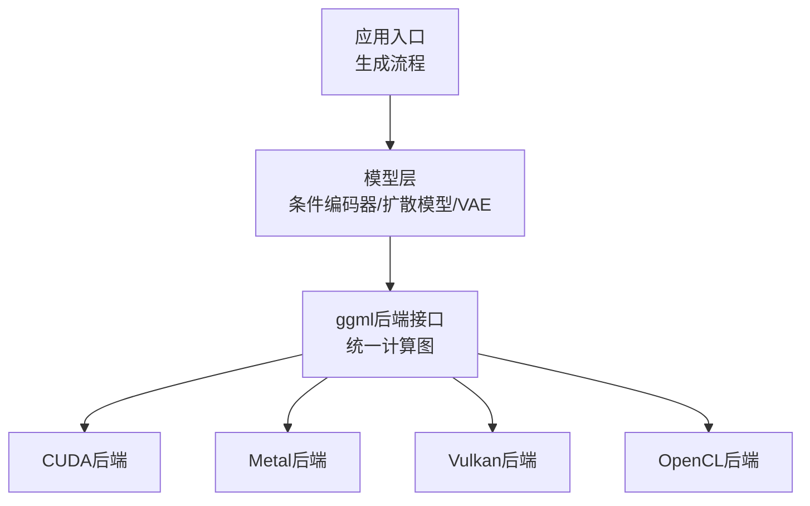
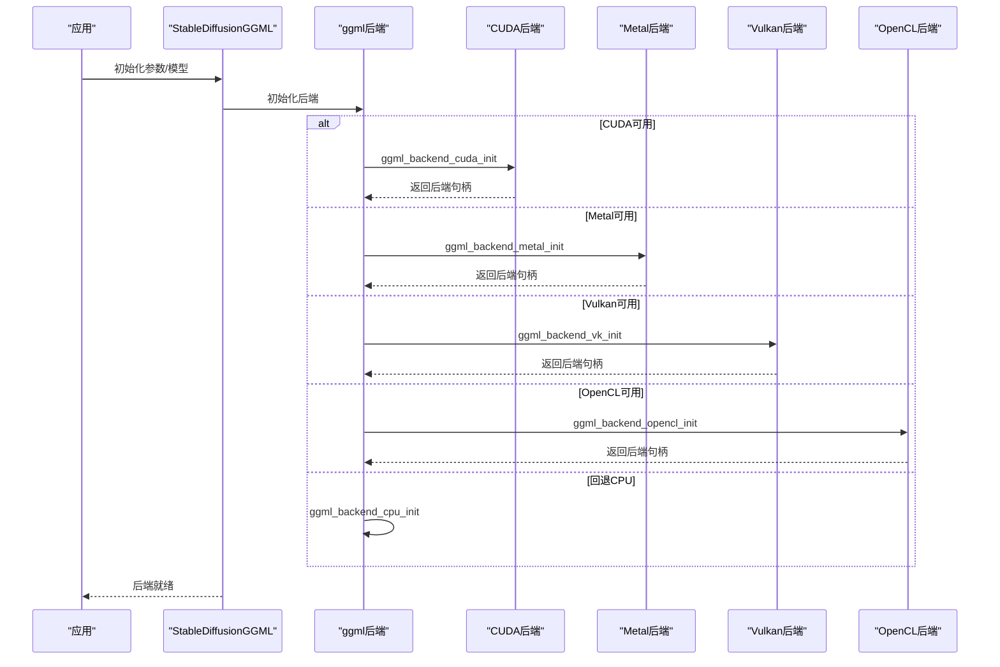
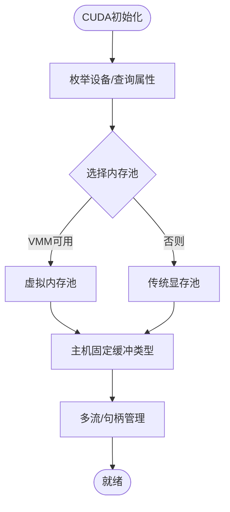
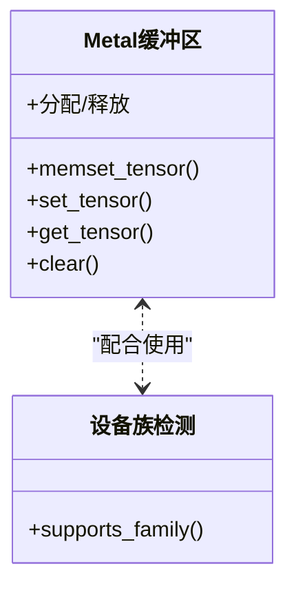
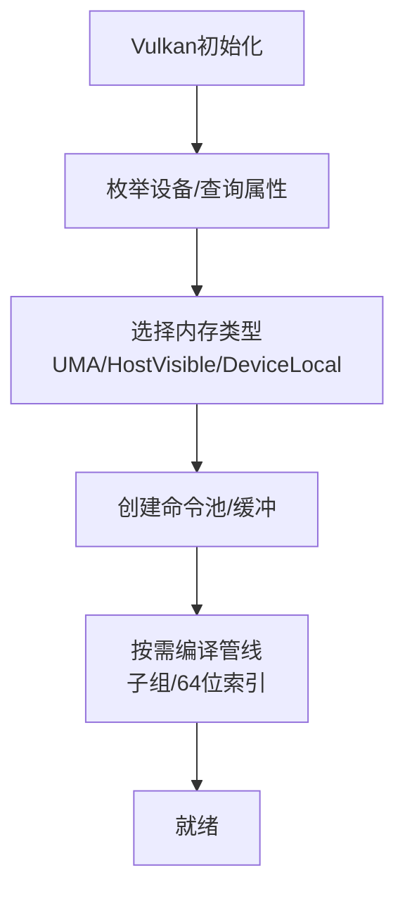
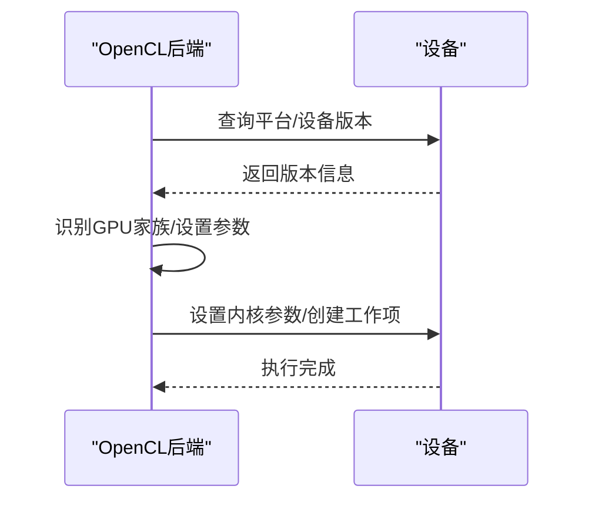
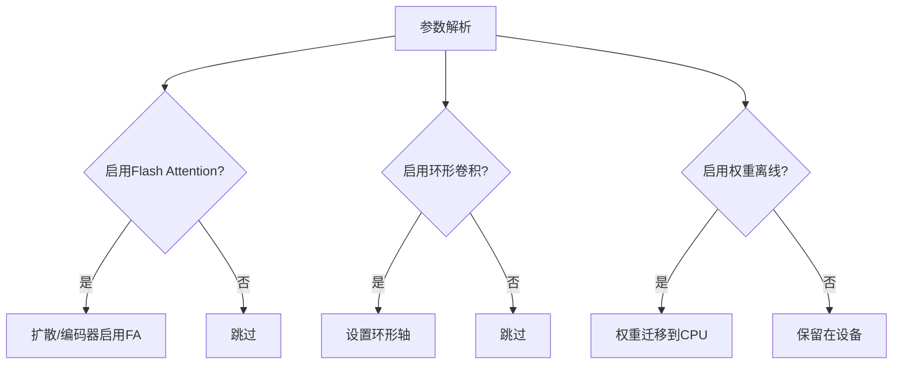
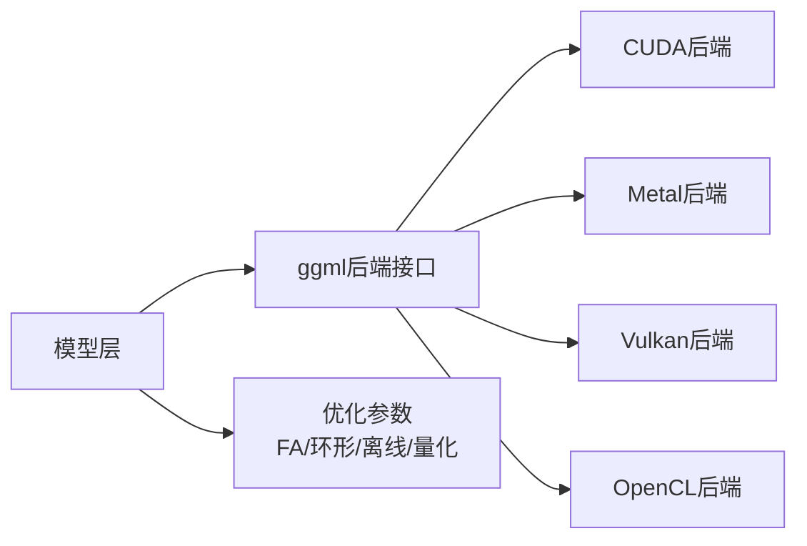

# 硬件优化

<cite>
**本文引用的文件**
- [README.md](file://README.md)
- [性能.md](file://docs/performance.md)
- [构建.md](file://docs/build.md)
- [stable-diffusion.cpp](file://src/stable-diffusion.cpp)
- [ggml-cuda.h](file://ggml/include/ggml-cuda.h)
- [ggml-metal.h](file://ggml/include/ggml-metal.h)
- [ggml-vulkan.h](file://ggml/include/ggml-vulkan.h)
- [ggml-opencl.h](file://ggml/include/ggml-opencl.h)
- [ggml-cuda.cu](file://ggml/src/ggml-cuda/ggml-cuda.cu)
- [ggml-metal.cpp](file://ggml/src/ggml-metal/ggml-metal.cpp)
- [ggml-vulkan.cpp](file://ggml/src/ggml-vulkan/ggml-vulkan.cpp)
- [ggml-opencl.cpp](file://ggml/src/ggml-opencl/ggml-opencl.cpp)
</cite>

## 目录
1. [简介](#简介)
2. [项目结构](#项目结构)
3. [核心组件](#核心组件)
4. [架构总览](#架构总览)
5. [详细组件分析](#详细组件分析)
6. [依赖关系分析](#依赖关系分析)
7. [性能考量](#性能考量)
8. [故障排查指南](#故障排查指南)
9. [结论](#结论)
10. [附录](#附录)

## 简介
本指南聚焦于稳定扩散.cpp在多硬件后端（CUDA、Metal、Vulkan、OpenCL）上的优化实践与最佳策略。文档从系统架构、数据流、处理逻辑、集成点与错误处理等方面进行深入剖析，并结合仓库中的实现细节，给出面向不同硬件配置的资源管理、内存带宽优化与计算单元利用率提升方案，以及兼容性检查、基准测试与硬件选择建议。

## 项目结构
项目采用“模型层 + 后端抽象（ggml）+ 具体硬件后端”的分层设计：
- 模型层：负责加载权重、构建扩散模型、条件编码器、VAE等模块，并通过参数控制启用Flash Attention、环形卷积等优化。
- 后端抽象：以ggml为统一张量与计算图后端，屏蔽底层硬件差异。
- 硬件后端：分别提供CUDA、Metal、Vulkan、OpenCL等后端初始化与缓冲区管理能力。

**图表来源**
- [stable-diffusion.cpp:171-226](file://src/stable-diffusion.cpp#L171-L226)
- [ggml-cuda.h:22-43](file://ggml/include/ggml-cuda.h#L22-L43)
- [ggml-metal.h:41-57](file://ggml/include/ggml-metal.h#L41-L57)
- [ggml-vulkan.h:13-25](file://ggml/include/ggml-vulkan.h#L13-L25)
- [ggml-opencl.h:13-20](file://ggml/include/ggml-opencl.h#L13-L20)

**章节来源**
- [README.md:68-84](file://README.md#L68-L84)
- [stable-diffusion.cpp:171-226](file://src/stable-diffusion.cpp#L171-L226)

## 核心组件
- 后端初始化与选择：根据编译宏与环境变量选择CUDA/Metal/Vulkan/OpenCL或回退CPU。
- Flash Attention与环形卷积：通过参数开关启用，降低显存占用并提升部分后端速度。
- 权重离线与设备迁移：支持将权重迁移到CPU以节省显存，同时保持推理速度。
- 量化与张量类型：通过参数覆盖与规则化张量类型，减少内存占用并提升吞吐。
- 设备信息与资源查询：CUDA/Vulkan提供设备数量、描述、显存统计；Metal提供设备族检测；OpenCL提供平台/设备版本解析。

**章节来源**
- [stable-diffusion.cpp:171-226](file://src/stable-diffusion.cpp#L171-L226)
- [性能.md:1-26](file://docs/performance.md#L1-L26)
- [ggml-cuda.h:36-38](file://ggml/include/ggml-cuda.h#L36-L38)
- [ggml-vulkan.h:16-19](file://ggml/include/ggml-vulkan.h#L16-L19)

## 架构总览
下图展示从应用到具体硬件后端的调用链路与关键接口：

**图表来源**
- [stable-diffusion.cpp:171-226](file://src/stable-diffusion.cpp#L171-L226)
- [ggml-cuda.h:22-28](file://ggml/include/ggml-cuda.h#L22-L28)
- [ggml-metal.h:41-43](file://ggml/include/ggml-metal.h#L41-L43)
- [ggml-vulkan.h:13-14](file://ggml/include/ggml-vulkan.h#L13-L14)
- [ggml-opencl.h:13-14](file://ggml/include/ggml-opencl.h#L13-L14)

## 详细组件分析

### CUDA后端
- 设备枚举与特性：查询设备数量、名称、SM数、共享内存、warp大小、是否支持协作启动等；记录设备架构与Tensor Core支持情况。
- 内存池与分配：提供传统显存池与虚拟内存映射两种池实现，支持对齐与粒度管理，减少碎片与提升复用率。
- 主机固定缓冲：提供主机固定内存缓冲类型，加速CPU↔GPU拷贝。
- 流与cuBLAS：维护多设备多流与cuBLAS句柄，避免图捕获期间销毁句柄导致的CUDA错误。
- 错误处理：封装统一错误回调，输出当前设备、函数名与源位置，便于定位问题。

**图表来源**
- [ggml-cuda.cu:195-313](file://ggml/src/ggml-cuda/ggml-cuda.cu#L195-L313)
- [ggml-cuda.cu:419-538](file://ggml/src/ggml-cuda/ggml-cuda.cu#L419-L538)
- [ggml-cuda.cu:530-564](file://ggml/src/ggml-cuda/ggml-cuda.cu#L530-L564)
- [ggml-cuda.cu:113-144](file://ggml/src/ggml-cuda/ggml-cuda.cu#L113-L144)

**章节来源**
- [ggml-cuda.cu:195-313](file://ggml/src/ggml-cuda/ggml-cuda.cu#L195-L313)
- [ggml-cuda.cu:530-564](file://ggml/src/ggml-cuda/ggml-cuda.cu#L530-L564)
- [ggml-cuda.h:36-41](file://ggml/include/ggml-cuda.h#L36-L41)

### Metal后端
- 缓冲区类型：提供共享/私有两类缓冲区接口，支持memset/set/get/clear等操作。
- 设备族检测：提供设备族检测接口，用于判断Apple设备系列特性。
- 队列与命令：通过上下文管理命令缓冲与队列，支持捕获下一计算命令缓冲以调试。
- 限制与现状：注释指出在大矩阵运算上效率较低，未来将改进。

**图表来源**
- [ggml-metal.cpp:20-92](file://ggml/src/ggml-metal/ggml-metal.cpp#L20-L92)
- [ggml-metal.cpp:172-182](file://ggml/src/ggml-metal/ggml-metal.cpp#L172-L182)
- [ggml-metal.h:49-55](file://ggml/include/ggml-metal.h#L49-L55)

**章节来源**
- [ggml-metal.cpp:20-92](file://ggml/src/ggml-metal/ggml-metal.cpp#L20-L92)
- [ggml-metal.cpp:172-182](file://ggml/src/ggml-metal/ggml-metal.cpp#L172-L182)
- [ggml-metal.h:49-55](file://ggml/include/ggml-metal.h#L49-L55)

### Vulkan后端
- 设备与内存：查询设备数量、描述与显存预算；根据UMA/ReBAR/HostVisible等特性选择最优内存类型。
- 管线与编译：按需异步编译SPIR-V管线，自动选择子组大小与64位索引变体；记录寄存器使用统计。
- 命令池与缓冲：命令池按需扩展，支持子缓冲与描述符绑定；提供设备/主机缓冲类型。
- 调试与统计：可打印管线注册表与寄存器计数，辅助性能分析。

**图表来源**
- [ggml-vulkan.cpp:2616-2644](file://ggml/src/ggml-vulkan/ggml-vulkan.cpp#L2616-L2644)
- [ggml-vulkan.cpp:3092-3144](file://ggml/src/ggml-vulkan/ggml-vulkan.cpp#L3092-L3144)
- [ggml-vulkan.h:16-19](file://ggml/include/ggml-vulkan.h#L16-L19)

**章节来源**
- [ggml-vulkan.cpp:2616-2644](file://ggml/src/ggml-vulkan/ggml-vulkan.cpp#L2616-L2644)
- [ggml-vulkan.cpp:3092-3144](file://ggml/src/ggml-vulkan/ggml-vulkan.cpp#L3092-L3144)
- [ggml-vulkan.h:16-19](file://ggml/include/ggml-vulkan.h#L16-L19)

### OpenCL后端
- 平台/设备版本解析：解析OpenCL平台版本与设备OpenCL C版本，适配不同编译目标。
- GPU家族识别：区分Adreno、Intel等GPU家族，设置不同工作项尺寸与内核参数。
- 快速除法预计算：为整除优化准备乘法与移位常量，减少分支开销。
- 内核参数设置与执行：按设备族设置内核参数、全局/局部工作组大小并入队执行。

**图表来源**
- [ggml-opencl.cpp:162-176](file://ggml/src/ggml-opencl/ggml-opencl.cpp#L162-L176)
- [ggml-opencl.cpp:87-98](file://ggml/src/ggml-opencl/ggml-opencl.cpp#L87-L98)
- [ggml-opencl.cpp:7917-7938](file://ggml/src/ggml-opencl/ggml-opencl.cpp#L7917-L7938)

**章节来源**
- [ggml-opencl.cpp:162-176](file://ggml/src/ggml-opencl/ggml-opencl.cpp#L162-L176)
- [ggml-opencl.cpp:87-98](file://ggml/src/ggml-opencl/ggml-opencl.cpp#L87-L98)
- [ggml-opencl.cpp:7917-7938](file://ggml/src/ggml-opencl/ggml-opencl.cpp#L7917-L7938)

### 模型侧优化与参数
- Flash Attention：在扩散模型与条件编码器中按需启用，降低显存占用并提升部分后端速度。
- 环形卷积：通过参数开启循环边界卷积，改善边缘效应。
- 权重离线：将权重迁移到CPU，节省显存但不降低生成速度。
- 张量类型覆盖：通过参数与规则化张量类型，选择更合适的量化类型以减少内存占用。

**图表来源**
- [stable-diffusion.cpp:737-767](file://src/stable-diffusion.cpp#L737-L767)
- [性能.md:1-26](file://docs/performance.md#L1-L26)

**章节来源**
- [stable-diffusion.cpp:737-767](file://src/stable-diffusion.cpp#L737-L767)
- [性能.md:1-26](file://docs/performance.md#L1-L26)

## 依赖关系分析
- 后端初始化依赖编译宏与运行时环境变量（如Vulkan设备选择），最终统一由ggml后端接口管理。
- 模型层在初始化阶段根据版本与参数决定是否启用特定优化（如Flash Attention、环形卷积、直接卷积）。
- 各后端提供缓冲区类型与设备信息查询接口，供上层进行资源规划与性能调优。

**图表来源**
- [stable-diffusion.cpp:171-226](file://src/stable-diffusion.cpp#L171-L226)
- [ggml-cuda.h:22-43](file://ggml/include/ggml-cuda.h#L22-L43)
- [ggml-metal.h:41-57](file://ggml/include/ggml-metal.h#L41-L57)
- [ggml-vulkan.h:13-25](file://ggml/include/ggml-vulkan.h#L13-L25)
- [ggml-opencl.h:13-20](file://ggml/include/ggml-opencl.h#L13-L20)

**章节来源**
- [stable-diffusion.cpp:171-226](file://src/stable-diffusion.cpp#L171-L226)

## 性能考量
- CUDA
  - 利用虚拟内存映射池（VMM）与对齐分配减少碎片，提升大模型显存复用。
  - 使用主机固定缓冲加速CPU↔GPU传输。
  - 在支持的设备上启用协作启动，减少同步开销。
- Metal
  - 当前对大矩阵效率较低，建议优先考虑其他后端或等待后续优化。
- Vulkan
  - 按需编译管线并记录寄存器使用，有助于评估指令密度与寄存器压力。
  - 自动选择UMA/HostVisible/DeviceLocal内存类型，平衡延迟与带宽。
- OpenCL
  - 基于GPU家族设置工作项尺寸与内核参数，提高吞吐稳定性。
  - 使用快速除法常量减少分支与提升整除性能。

[本节为通用指导，无需引用具体文件]

## 故障排查指南
- CUDA
  - 统一错误回调会输出当前设备、函数名与源位置，便于定位驱动/内核错误。
  - 若出现图捕获期间销毁cuBLAS句柄导致的错误，确保在捕获完成前不销毁句柄。
- Metal
  - 大矩阵运算效率低，若出现异常卡顿或结果异常，尝试切换到其他后端。
- Vulkan
  - 显存不足时检查UMA/HostVisible/DeviceLocal策略与预算属性；确认管线编译成功。
- OpenCL
  - 若内核执行失败，检查平台/设备版本解析与编译目标是否匹配；确认GPU家族识别正确。

**章节来源**
- [ggml-cuda.cu:88-98](file://ggml/src/ggml-cuda/ggml-cuda.cu#L88-L98)
- [ggml-cuda.cu:540-564](file://ggml/src/ggml-cuda/ggml-cuda.cu#L540-L564)
- [ggml-metal.h:49-55](file://ggml/include/ggml-metal.h#L49-L55)
- [ggml-vulkan.cpp:2616-2644](file://ggml/src/ggml-vulkan/ggml-vulkan.cpp#L2616-L2644)
- [ggml-opencl.cpp:162-176](file://ggml/src/ggml-opencl/ggml-opencl.cpp#L162-L176)

## 结论
通过ggml后端抽象，稳定扩散.cpp在多硬件平台上实现了统一的优化策略：在CUDA上利用VMM与主机固定缓冲提升显存复用与传输效率；在Vulkan上按需编译管线并智能选择内存类型；在Metal上提供设备族检测与命令缓冲捕获能力；在OpenCL上基于GPU家族差异化参数提升稳定性。结合Flash Attention、环形卷积、权重离线与量化等手段，可在不同硬件配置下获得更优的性能与资源利用率。

[本节为总结，无需引用具体文件]

## 附录

### 硬件兼容性检查与选择建议
- CUDA：优先选择具备Tensor Core与较高SM数的设备；若设备缺少Tensor Cores，可能影响某些算子性能。
- Metal：当前对大矩阵效率较低，建议在小模型或测试场景使用；正式部署建议优先其他后端。
- Vulkan：优先选择UMA或ReBAR支持的设备以减少跨段访问延迟；关注子组大小与64位索引支持。
- OpenCL：确保平台/设备版本满足编译目标；针对Adreno设备可获得较好优化。

**章节来源**
- [构建.md:72-94](file://docs/build.md#L72-L94)
- [ggml-cuda.cu:270-303](file://ggml/src/ggml-cuda/ggml-cuda.cu#L270-L303)
- [ggml-vulkan.cpp:2616-2644](file://ggml/src/ggml-vulkan/ggml-vulkan.cpp#L2616-L2644)
- [ggml-opencl.cpp:162-176](file://ggml/src/ggml-opencl/ggml-opencl.cpp#L162-L176)

### 性能基准测试与调优建议
- Flash Attention：在扩散模型中启用可显著降低显存占用，部分后端同时提升速度；注意仅对特定模型与后端有效。
- 权重离线：在显存紧张时将权重迁移到CPU，保持生成速度不变。
- 量化：通过参数覆盖与规则化张量类型选择合适量化格式，减少内存占用。
- 环形卷积：在需要边缘处理一致性时启用，可能带来轻微开销。

**章节来源**
- [性能.md:1-26](file://docs/performance.md#L1-L26)
- [stable-diffusion.cpp:737-767](file://src/stable-diffusion.cpp#L737-L767)