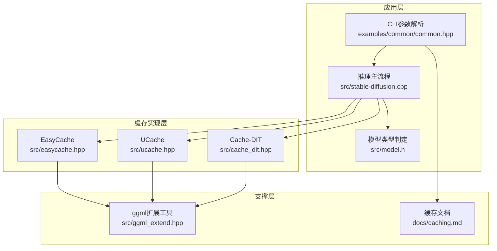
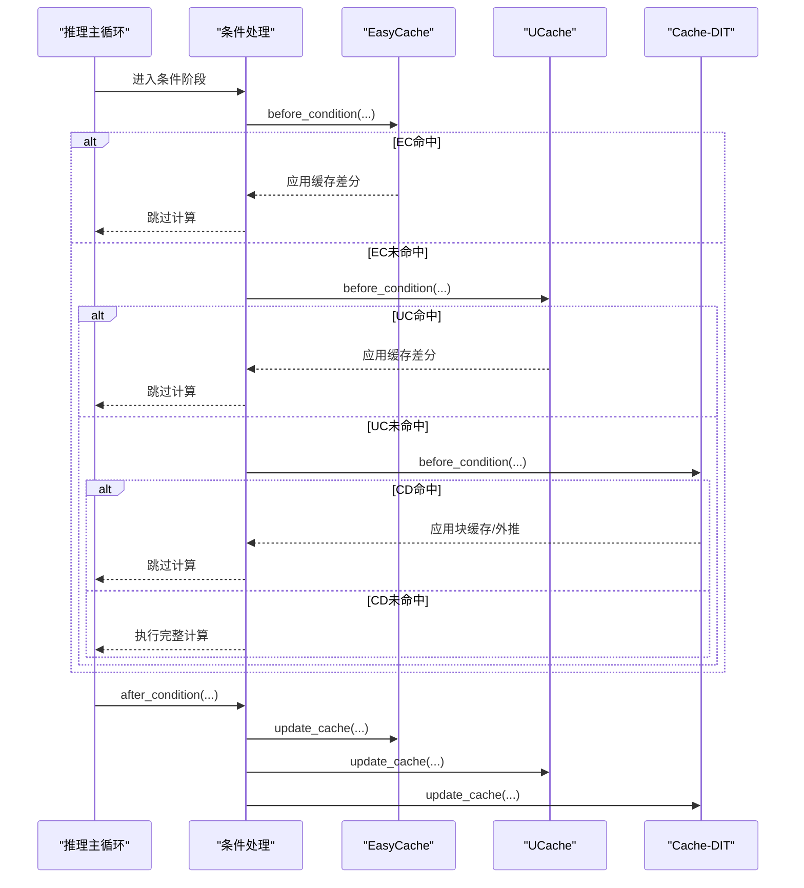
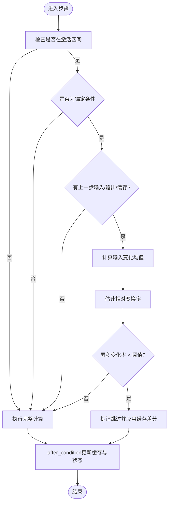
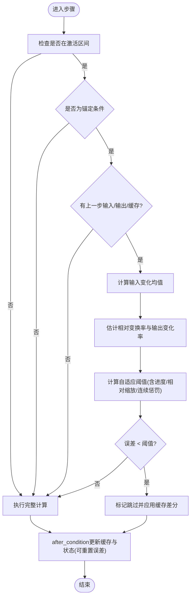
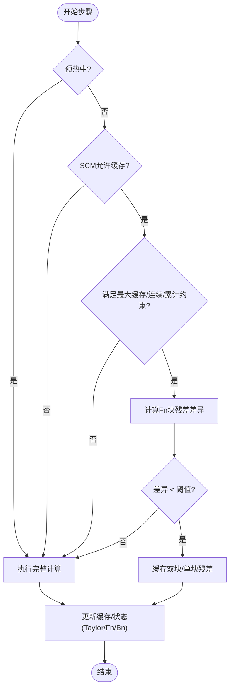
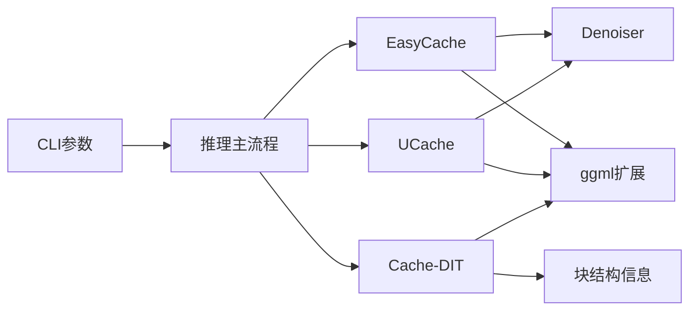

# 缓存机制

<cite>
**本文引用的文件**
- [easycache.hpp](file://src/easycache.hpp)
- [ucache.hpp](file://src/ucache.hpp)
- [cache_dit.hpp](file://src/cache_dit.hpp)
- [caching.md](file://docs/caching.md)
- [stable-diffusion.cpp](file://src/stable-diffusion.cpp)
- [common.hpp](file://examples/common/common.hpp)
- [model.h](file://src/model.h)
- [ggml_extend.hpp](file://src/ggml_extend.hpp)
</cite>

## 目录
1. [简介](#简介)
2. [项目结构](#项目结构)
3. [核心组件](#核心组件)
4. [架构总览](#架构总览)
5. [详细组件分析](#详细组件分析)
6. [依赖关系分析](#依赖关系分析)
7. [性能考量](#性能考量)
8. [故障排除指南](#故障排除指南)
9. [结论](#结论)
10. [附录](#附录)

## 简介
本文件系统性阐述稳定扩散.cpp中的缓存机制，重点覆盖EasyCache与Ucache两大缓存模块的设计原理、实现细节与使用策略，并扩展到DiT模型的块级缓存（DBCache/TaylorSeer/Cache-DIT）与谱预测（Spectrum）等模式。文档从数据结构、处理逻辑、控制流、错误处理与性能特征等维度进行深入解析，同时提供缓存命中率优化、缓存大小调优、不同场景配置建议与故障排除方法，帮助开发者在不同硬件与模型上获得最佳推理速度与质量平衡。

## 项目结构
缓存相关代码主要分布在以下位置：
- 易用缓存（DiT模型）：src/easycache.hpp
- UNet缓存（UCache）：src/ucache.hpp
- DiT块级缓存与泰勒预测：src/cache_dit.hpp
- 文档说明：docs/caching.md
- CLI参数解析与运行时初始化：examples/common/common.hpp、src/stable-diffusion.cpp
- 模型类型判定：src/model.h
- 计算图与张量工具：src/ggml_extend.hpp

图表来源
- [easycache.hpp:1-265](file://src/easycache.hpp#L1-L265)
- [ucache.hpp:1-435](file://src/ucache.hpp#L1-L435)
- [cache_dit.hpp:1-976](file://src/cache_dit.hpp#L1-L976)
- [common.hpp:1749-1884](file://examples/common/common.hpp#L1749-L1884)
- [stable-diffusion.cpp:1697-1807](file://src/stable-diffusion.cpp#L1697-L1807)
- [model.h:23-174](file://src/model.h#L23-L174)
- [ggml_extend.hpp:1724-1765](file://src/ggml_extend.hpp#L1724-L1765)
- [caching.md:1-150](file://docs/caching.md#L1-L150)

章节来源
- [easycache.hpp:1-265](file://src/easycache.hpp#L1-L265)
- [ucache.hpp:1-435](file://src/ucache.hpp#L1-L435)
- [cache_dit.hpp:1-976](file://src/cache_dit.hpp#L1-L976)
- [caching.md:1-150](file://docs/caching.md#L1-L150)

## 核心组件
- EasyCache（DiT模型条件级缓存）
  - 基于输入变化阈值决定是否复用上一步输出差分，避免重复计算。
  - 关键字段：阈值、起止百分比、相对变换率、累积误差、跳过步数统计等。
- UCache（UNet模型条件级缓存）
  - 引入误差累积与衰减、自适应阈值、EMA输出变化等机制，提升稳定性与可扩展性。
  - 关键字段：阈值、衰减系数、相对阈值开关、重算后清零开关、连续跳过惩罚等。
- Cache-DIT（DiT模型块级缓存）
  - 支持双块（前/后/中间）残差差异阈值缓存与Taylor预测结合，配合SCM掩码与预设。
  - 关键字段：前后块数量、残差阈值、预热步数、最大缓存步数、累计残差阈值、Taylor导数阶数等。

章节来源
- [easycache.hpp:9-44](file://src/easycache.hpp#L9-L44)
- [ucache.hpp:12-58](file://src/ucache.hpp#L12-L58)
- [cache_dit.hpp:13-40](file://src/cache_dit.hpp#L13-L40)

## 架构总览
缓存模块在推理主流程中以“条件钩子”的形式介入，分别在条件处理前（before_condition）与处理后（after_condition）执行决策与更新。UCache/EasyCache通过比较当前输入与上一步输入的差异，结合相对变换率与阈值，决定是否跳过当前步；Cache-DIT则按块粒度比较残差差异或使用Taylor外推预测。

图表来源
- [easycache.hpp:152-212](file://src/easycache.hpp#L152-L212)
- [ucache.hpp:267-355](file://src/ucache.hpp#L267-L355)
- [cache_dit.hpp:883-935](file://src/cache_dit.hpp#L883-L935)

## 详细组件分析

### EasyCache（DiT模型条件级缓存）
- 设计目标
  - 在DiT模型中，对同一条件（如相同提示词）在相邻步骤间，若输入变化较小，则直接复用上次输出差分，避免重复计算。
- 关键数据结构
  - 配置项：启用开关、重用阈值、起止百分比（sigma区间）。
  - 状态项：锚定条件、上一步输入/输出、输出范数、相对变换率、累积变化率、跳过步数统计等。
- 决策流程
  - 步骤激活：仅在指定sigma区间内激活。
  - 输入变化评估：计算当前输入与上一步输入的平均绝对变化。
  - 变换率估计：基于上一步输出变化与输入变化的比值估计相对变换率。
  - 判定：若累积变化率低于阈值则跳过当前步并应用缓存差分。
- 更新流程
  - after_condition阶段：更新缓存差分、保存当前输入/输出、更新输出范数与变换率，并重置累积变化率。

图表来源
- [easycache.hpp:95-212](file://src/easycache.hpp#L95-L212)

章节来源
- [easycache.hpp:9-44](file://src/easycache.hpp#L9-L44)
- [easycache.hpp:128-151](file://src/easycache.hpp#L128-L151)
- [easycache.hpp:152-212](file://src/easycache.hpp#L152-L212)
- [easycache.hpp:214-265](file://src/easycache.hpp#L214-L265)

### UCache（UNet模型条件级缓存）
- 设计目标
  - 面向UNet模型的条件级缓存，引入误差累积与衰减、EMA输出变化、自适应阈值与连续跳过惩罚，提高鲁棒性与可扩展性。
- 关键数据结构
  - 配置项：启用开关、重用阈值、起止百分比、误差衰减率、是否使用相对阈值、是否在计算后重置误差、早/晚步乘数、相对范数增益、计算后误差重置开关。
  - 状态项：锚定条件、上一步输入/输出、输出范数、相对变换率、输入变化均值、误差累积、连续跳过步数、块指标统计等。
- 决策流程
  - 自适应阈值：根据已计算步数与总步数估算进度，动态调整阈值。
  - 误差估计：基于相对变换率与输入变化估计输出变化率，并按比例缩放（可选相对阈值）。
  - 连续跳过惩罚：对连续跳过的步数施加额外惩罚，避免长期外推导致误差积累。
  - 判定：若误差小于有效阈值则跳过并应用缓存差分。
- 更新流程
  - after_condition阶段：更新缓存差分、EMA输出变化、输出范数、变换率，并在计算后按配置重置误差。

图表来源
- [ucache.hpp:178-355](file://src/ucache.hpp#L178-L355)

章节来源
- [ucache.hpp:12-58](file://src/ucache.hpp#L12-L58)
- [ucache.hpp:241-265](file://src/ucache.hpp#L241-L265)
- [ucache.hpp:267-355](file://src/ucache.hpp#L267-L355)
- [ucache.hpp:357-421](file://src/ucache.hpp#L357-L421)

### Cache-DIT（DiT模型块级缓存与Taylor预测）
- 设计目标
  - 针对DiT模型的块级缓存（DBCache）与Taylor外推（TaylorSeer）组合，支持前后块与中间块的差异化策略，配合SCM掩码与预设，实现更细粒度的缓存控制。
- 关键数据结构
  - DBCache配置：前后块数量、残差差异阈值、最大预热步数、最大缓存步数、最大连续缓存步数、累计残差阈值、SCM掩码与策略。
  - TaylorSeer配置：导数阶数、最大预热步数、跳过间隔。
  - CacheDIT状态：双块/单块缓存区、Fn/Bn缓冲、Taylor状态、累计残差、连续缓存步数、缓存步列表等。
- 决策流程
  - 预热阶段：先不参与缓存，等待预热步数。
  - SCM策略：根据掩码与策略决定该步是否允许缓存。
  - 残差阈值：比较Fn块残差差异，低于阈值则缓存。
  - Taylor外推：在满足条件时使用Taylor预测替代部分计算。
- 更新流程
  - after_condition阶段：更新双块/单块缓存、Fn残差、Bn缓冲、Taylor状态，并记录缓存步数与连续缓存步数。

图表来源
- [cache_dit.hpp:243-289](file://src/cache_dit.hpp#L243-L289)
- [cache_dit.hpp:366-389](file://src/cache_dit.hpp#L366-L389)
- [cache_dit.hpp:501-528](file://src/cache_dit.hpp#L501-L528)

章节来源
- [cache_dit.hpp:13-40](file://src/cache_dit.hpp#L13-L40)
- [cache_dit.hpp:138-195](file://src/cache_dit.hpp#L138-L195)
- [cache_dit.hpp:243-289](file://src/cache_dit.hpp#L243-L289)
- [cache_dit.hpp:366-389](file://src/cache_dit.hpp#L366-L389)
- [cache_dit.hpp:501-528](file://src/cache_dit.hpp#L501-L528)

### 缓存初始化与运行时集成
- CLI参数解析
  - 支持通过命名参数设置阈值、起止百分比、衰减率、相对阈值、重置开关、块数量、预热步数、窗口/弹性等。
  - 对不同缓存模式进行参数校验与默认值设置。
- 运行时初始化
  - 根据模型版本判断缓存模式可用性（DiT/UNet），并按配置初始化对应状态。
  - 记录启用日志与关键参数。

章节来源
- [common.hpp:1749-1884](file://examples/common/common.hpp#L1749-L1884)
- [stable-diffusion.cpp:1697-1807](file://src/stable-diffusion.cpp#L1697-L1807)
- [model.h:77-162](file://src/model.h#L77-L162)

## 依赖关系分析
- 组件耦合
  - EasyCache/UCache均依赖Denoiser的sigma与时间步映射，用于确定激活区间。
  - Cache-DIT依赖模型块结构信息（双块/单块数量）与隐藏态尺寸。
- 外部依赖
  - ggml扩展工具提供张量复制与上下文管理，保证缓存操作的安全性与一致性。
- 接口契约
  - before_condition/after_condition钩子约定：前者返回true表示已应用缓存并跳过计算；后者负责更新缓存与状态。

图表来源
- [easycache.hpp:66-93](file://src/easycache.hpp#L66-L93)
- [ucache.hpp:126-176](file://src/ucache.hpp#L126-L176)
- [cache_dit.hpp:175-194](file://src/cache_dit.hpp#L175-L194)
- [ggml_extend.hpp:1724-1765](file://src/ggml_extend.hpp#L1724-L1765)

章节来源
- [easycache.hpp:66-93](file://src/easycache.hpp#L66-L93)
- [ucache.hpp:126-176](file://src/ucache.hpp#L126-L176)
- [cache_dit.hpp:175-194](file://src/cache_dit.hpp#L175-L194)
- [ggml_extend.hpp:1724-1765](file://src/ggml_extend.hpp#L1724-L1765)

## 性能考量
- 缓存命中率与速度提升
  - EasyCache/UCache通过减少重复计算显著降低CPU/GPU负载，尤其在长序列与相似输入条件下收益明显。
  - Cache-DIT在块级层面进一步细化缓存，结合Taylor外推可大幅减少UNet前向计算次数。
- 内存占用
  - EasyCache/UCache：每个条件维护一个缓存差分向量，内存开销与张量元素数线性相关。
  - Cache-DIT：双块/单块缓存区与Taylor状态数组随块数与导数阶数增长，需权衡精度与内存。
- 参数调优建议
  - 阈值：从默认值开始，逐步降低以提升命中率，但可能牺牲质量；提高以减少缓存机会，但更快。
  - 起止百分比：在高噪声早期与低噪声后期通常更易缓存，合理设置可最大化收益。
  - 相对阈值与衰减：相对阈值可自适应输出幅度，衰减有助于抑制误差累积。
  - 连续跳过惩罚：对长时间外推场景尤为关键，防止误差发散。
- 不同场景配置建议
  - 高质量优先：提高阈值、开启相对阈值、关闭重置或使用保守策略。
  - 高速优先：降低阈值、开启自适应阈值、启用连续惩罚、合理设置预热步数。
  - DiT模型：优先考虑Cache-DIT，结合SCM掩码与预设，平衡前后块与中间块的缓存策略。

章节来源
- [caching.md:144-150](file://docs/caching.md#L144-L150)
- [ucache.hpp:208-234](file://src/ucache.hpp#L208-L234)
- [cache_dit.hpp:606-686](file://src/cache_dit.hpp#L606-L686)

## 故障排除指南
- 常见问题与定位
  - 缓存未生效：确认模型类型与缓存模式匹配（DiT/UNet），检查起止百分比范围与激活区间。
  - 质量下降：适当提高阈值或关闭相对阈值，检查是否启用了连续跳过惩罚。
  - 内存不足：减少块数量、降低导数阶数、缩短预热步数或限制最大缓存步数。
  - 参数非法：确保阈值非负、起止百分比满足0≤start<end≤1。
- 日志与监控
  - EasyCache/UCache会输出跳过步数与估计速度倍数。
  - Cache-DIT会输出步骤与块缓存比例、累计残差等指标。
- 调试建议
  - 先禁用缓存对比基线性能，再逐步启用并微调参数。
  - 使用不同采样器验证缓存稳定性（例如euler_a需要保守策略）。

章节来源
- [stable-diffusion.cpp:2271-2289](file://src/stable-diffusion.cpp#L2271-L2289)
- [cache_dit.hpp:530-543](file://src/cache_dit.hpp#L530-L543)
- [common.hpp:1863-1874](file://examples/common/common.hpp#L1863-L1874)

## 结论
EasyCache与Ucache为DiT与UNet模型提供了高效稳定的条件级缓存方案，通过输入变化评估与阈值控制，在保证质量的前提下显著加速推理。Cache-DIT进一步将缓存粒度细化到块级，并结合Taylor外推与SCM策略，实现更灵活的缓存控制。合理配置参数、理解各模式适用场景与性能权衡，是获得最佳体验的关键。

## 附录
- 缓存模式与参数速查
  - EasyCache：阈值、起止百分比
  - UCache：阈值、起止百分比、衰减率、相对阈值、重置开关
  - Cache-DIT：前后块数量、残差阈值、预热步数、SCM掩码与策略、Taylor导数阶数
- 参考文档
  - [缓存模式与参数说明:1-150](file://docs/caching.md#L1-L150)