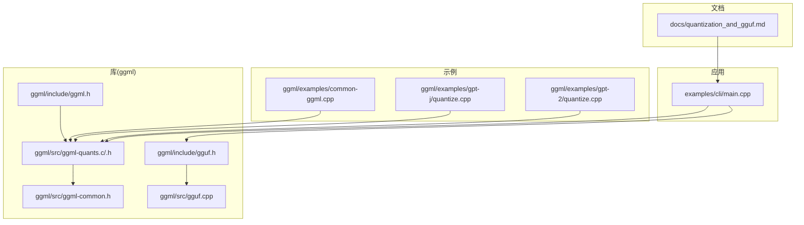
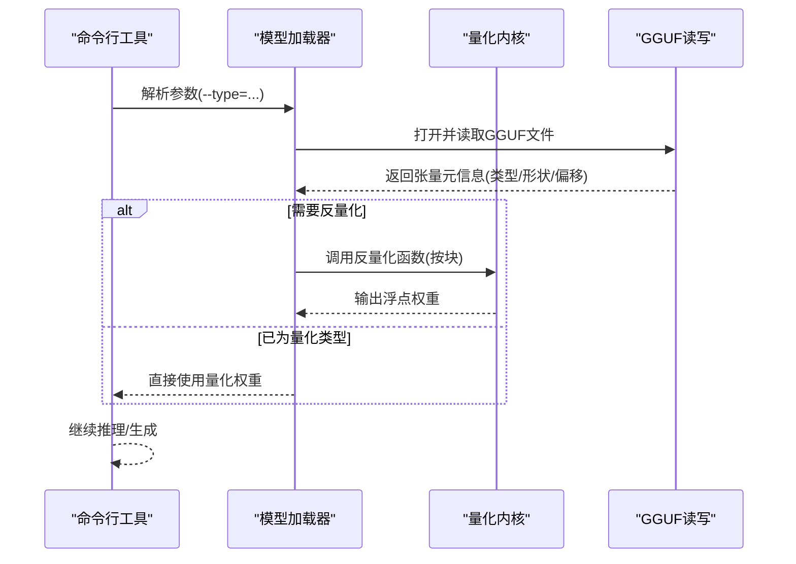
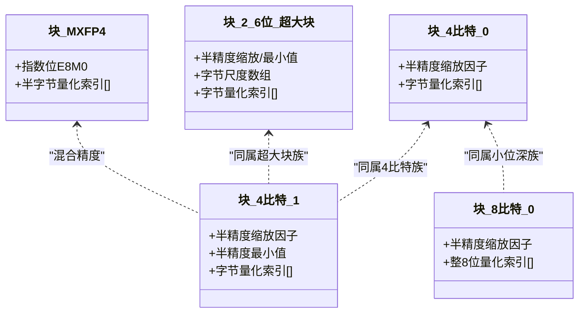
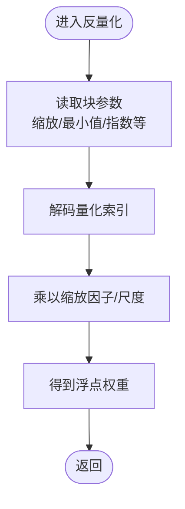
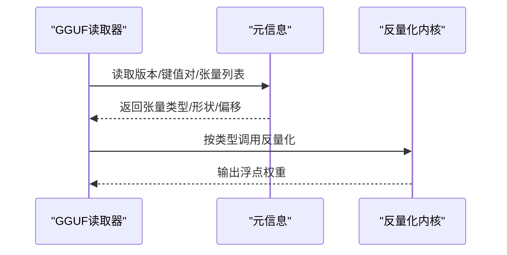
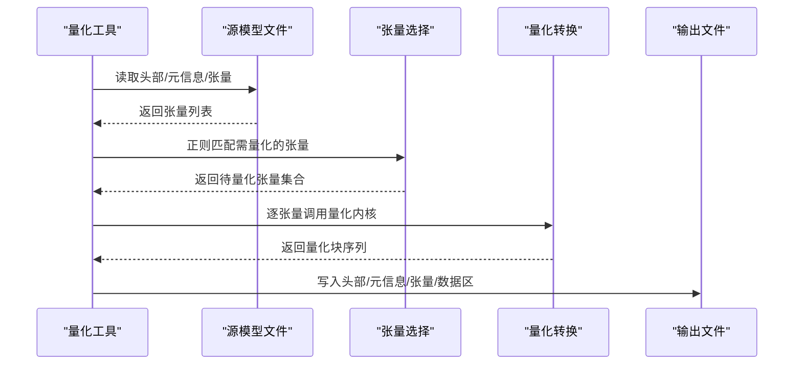
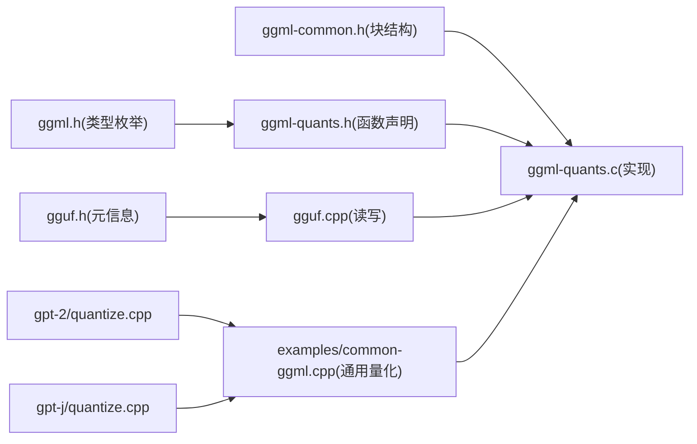

# 量化技术

<cite>
**本文引用的文件**
- [docs/quantization_and_gguf.md](file://docs/quantization_and_gguf.md)
- [ggml/src/ggml-quants.h](file://ggml/src/ggml-quants.h)
- [ggml/src/ggml-quants.c](file://ggml/src/ggml-quants.c)
- [ggml/src/ggml-common.h](file://ggml/src/ggml-common.h)
- [ggml/include/gguf.h](file://ggml/include/gguf.h)
- [ggml/src/gguf.cpp](file://ggml/src/gguf.cpp)
- [ggml/examples/gpt-2/quantize.cpp](file://ggml/examples/gpt-2/quantize.cpp)
- [ggml/examples/gpt-j/quantize.cpp](file://ggml/examples/gpt-j/quantize.cpp)
- [ggml/examples/common-ggml.cpp](file://ggml/examples/common-ggml.cpp)
- [ggml/include/ggml.h](file://ggml/include/ggml.h)
- [examples/cli/main.cpp](file://examples/cli/main.cpp)
</cite>

## 目录
1. [引言](#引言)
2. [项目结构](#项目结构)
3. [核心组件](#核心组件)
4. [架构总览](#架构总览)
5. [详细组件分析](#详细组件分析)
6. [依赖关系分析](#依赖关系分析)
7. [性能考量](#性能考量)
8. [故障排查指南](#故障排查指南)
9. [结论](#结论)
10. [附录](#附录)

## 引言
本指南围绕稳定扩散.cpp中的量化与GGUF格式展开，系统讲解从INT8、INT4到更细粒度的2–6位超大块量化（如Q2_K/Q3_K/Q4_K/Q5_K/Q6_K）以及MXFP4等混合精度量化方案；阐述量化过程中的数值精度控制、反量化恢复机制；说明GGUF格式中量化参数的存储与加载流程；给出量化模型在推理时的内存节省与性能影响；并提供可扩展的自定义量化策略与质量评估建议，帮助读者在不同应用场景下选择合适的量化方案。

## 项目结构
本项目在以下层次组织量化与GGUF相关能力：
- 文档层：量化与GGUF使用说明与示例
- 库层：ggml量化内核、GGUF读写接口
- 示例层：模型转换与量化示例程序
- 应用层：CLI工具支持量化类型选择与模型转换

图表来源
- [docs/quantization_and_gguf.md:1-27](file://docs/quantization_and_gguf.md#L1-L27)
- [ggml/src/ggml-quants.h:1-107](file://ggml/src/ggml-quants.h#L1-L107)
- [ggml/src/ggml-quants.c:1-800](file://ggml/src/ggml-quants.c#L1-L800)
- [ggml/src/ggml-common.h:160-359](file://ggml/src/ggml-common.h#L160-L359)
- [ggml/include/gguf.h:1-203](file://ggml/include/gguf.h#L1-L203)
- [ggml/src/gguf.cpp:1-800](file://ggml/src/gguf.cpp#L1-L800)
- [ggml/examples/gpt-2/quantize.cpp:1-185](file://ggml/examples/gpt-2/quantize.cpp#L1-L185)
- [ggml/examples/gpt-j/quantize.cpp:1-183](file://ggml/examples/gpt-j/quantize.cpp#L1-L183)
- [ggml/examples/common-ggml.cpp:1-200](file://ggml/examples/common-ggml.cpp#L1-L200)
- [ggml/include/ggml.h:388-420](file://ggml/include/ggml.h#L388-L420)
- [examples/cli/main.cpp:1-200](file://examples/cli/main.cpp#L1-L200)

章节来源
- [docs/quantization_and_gguf.md:1-27](file://docs/quantization_and_gguf.md#L1-L27)
- [ggml/src/ggml-quants.h:1-107](file://ggml/src/ggml-quants.h#L1-L107)
- [ggml/src/ggml-quants.c:1-800](file://ggml/src/ggml-quants.c#L1-L800)
- [ggml/src/ggml-common.h:160-359](file://ggml/src/ggml-common.h#L160-L359)
- [ggml/include/gguf.h:1-203](file://ggml/include/gguf.h#L1-L203)
- [ggml/src/gguf.cpp:1-800](file://ggml/src/gguf.cpp#L1-L800)
- [ggml/examples/gpt-2/quantize.cpp:1-185](file://ggml/examples/gpt-2/quantize.cpp#L1-L185)
- [ggml/examples/gpt-j/quantize.cpp:1-183](file://ggml/examples/gpt-j/quantize.cpp#L1-L183)
- [ggml/examples/common-ggml.cpp:1-200](file://ggml/examples/common-ggml.cpp#L1-L200)
- [ggml/include/ggml.h:388-420](file://ggml/include/ggml.h#L388-L420)
- [examples/cli/main.cpp:1-200](file://examples/cli/main.cpp#L1-L200)

## 核心组件
- 量化内核与数据结构
  - 提供多种整数量化与混合精度量化函数声明与实现，覆盖Q4_0/Q4_1/Q5_0/Q5_1/Q8_0、Q2_K/Q3_K/Q4_K/Q5_K/Q6_K、MXFP4等，以及对应的反量化函数。
  - 定义了各量化块的数据结构（如block_q4_0、block_q4_1、block_q8_0、block_q2_K、block_mxfp4等），明确每个块的字节布局与对齐要求。
- GGUF格式
  - 定义GGUF文件头、键值对、张量元信息与二进制数据区的结构与读写接口；支持版本兼容、对齐与偏移计算。
- 模型转换与量化示例
  - 提供将F32/F16权重转换为指定量化类型（如Q4_0/Q4_1/Q5_0/Q5_1/Q8_0/Q2_K/Q3_K/Q4_K/Q5_K/Q6_K）的示例程序与通用量化流程。
- CLI与运行时
  - CLI支持通过--type参数选择量化类型，便于在加载模型时自动转换权重类型。

章节来源
- [ggml/src/ggml-quants.h:16-107](file://ggml/src/ggml-quants.h#L16-L107)
- [ggml/src/ggml-quants.c:36-435](file://ggml/src/ggml-quants.c#L36-L435)
- [ggml/src/ggml-common.h:170-359](file://ggml/src/ggml-common.h#L170-L359)
- [ggml/include/gguf.h:1-203](file://ggml/include/gguf.h#L1-L203)
- [ggml/src/gguf.cpp:319-731](file://ggml/src/gguf.cpp#L319-L731)
- [ggml/examples/gpt-2/quantize.cpp:27-134](file://ggml/examples/gpt-2/quantize.cpp#L27-L134)
- [ggml/examples/gpt-j/quantize.cpp:28-132](file://ggml/examples/gpt-j/quantize.cpp#L28-L132)
- [ggml/examples/common-ggml.cpp:41-200](file://ggml/examples/common-ggml.cpp#L41-L200)
- [examples/cli/main.cpp:103-162](file://examples/cli/main.cpp#L103-L162)

## 架构总览
量化与GGUF在系统中的交互路径如下：
- CLI解析参数（如--type），决定加载时的权重类型
- 加载模型时根据类型调用对应量化/反量化内核
- GGUF文件保存量化后的张量类型与元信息，加载时按元信息重建张量并进行反量化

图表来源
- [examples/cli/main.cpp:103-162](file://examples/cli/main.cpp#L103-L162)
- [ggml/src/gguf.cpp:319-731](file://ggml/src/gguf.cpp#L319-L731)
- [ggml/src/ggml-quants.c:307-435](file://ggml/src/ggml-quants.c#L307-L435)

## 详细组件分析

### 量化算法与数据结构
- 块级量化与反量化
  - Q4_0/Q4_1/Q5_0/Q5_1/Q8_0等采用固定块大小（如32元素/块），每块存储缩放因子与量化索引；反量化时按缩放因子恢复。
  - Q2_K/Q3_K/Q4_K/Q5_K/Q6_K采用“超大块”（QK_K=1024）分组量化，块内含多组尺度/最小值与量化索引，适合更高压缩比。
  - MXFP4为混合指数/尾数的4比特量化，块内存储指数位与查表索引，兼顾动态范围与密度。
- 关键数据结构
  - 例如block_q4_0、block_q4_1、block_q8_0、block_q2_K、block_mxfp4等，均在头文件中明确定义字段与对齐约束，确保跨平台一致性。

图表来源
- [ggml/src/ggml-common.h:170-359](file://ggml/src/ggml-common.h#L170-L359)
- [ggml/src/ggml-quants.h:16-67](file://ggml/src/ggml-quants.h#L16-L67)

章节来源
- [ggml/src/ggml-common.h:170-359](file://ggml/src/ggml-common.h#L170-L359)
- [ggml/src/ggml-quants.h:16-67](file://ggml/src/ggml-quants.h#L16-L67)

### 反量化恢复机制
- 反量化函数按块读取量化参数（如缩放因子、最小值、指数等），将量化索引映射回浮点值并乘以缩放，从而恢复近似权重。
- 对于MXFP4，先从指数位构造尺度，再查表得到量化值，最后乘以尺度恢复。

图表来源
- [ggml/src/ggml-quants.c:307-435](file://ggml/src/ggml-quants.c#L307-L435)

章节来源
- [ggml/src/ggml-quants.c:307-435](file://ggml/src/ggml-quants.c#L307-L435)

### GGUF格式的量化参数存储与加载
- 存储
  - GGUF文件包含版本、键值对、张量元信息（名称、维度、类型、数据偏移）与二进制数据区；张量类型字段直接记录量化类型（如Q4_0/Q4_1/Q5_0/Q5_1/Q8_0/Q2_K/Q3_K/Q4_K/Q5_K/Q6_K/MXFP4）。
- 加载
  - 读取张量元信息后，按类型选择对应反量化内核；若类型仍为量化类型，则按块反量化到工作缓冲区供后续计算使用。

图表来源
- [ggml/include/gguf.h:1-203](file://ggml/include/gguf.h#L1-L203)
- [ggml/src/gguf.cpp:319-731](file://ggml/src/gguf.cpp#L319-L731)
- [ggml/src/ggml-quants.c:307-435](file://ggml/src/ggml-quants.c#L307-L435)

章节来源
- [ggml/include/gguf.h:1-203](file://ggml/include/gguf.h#L1-L203)
- [ggml/src/gguf.cpp:319-731](file://ggml/src/gguf.cpp#L319-L731)
- [ggml/src/ggml-quants.c:307-435](file://ggml/src/ggml-quants.c#L307-L435)

### 模型转换与量化示例
- GPT-2/GPT-J示例展示了如何打开源模型文件、复制头部与词汇表、按正则匹配选择需要量化的张量、调用通用量化流程并将结果写入目标文件。
- 通用量化流程会根据目标量化类型选择对应内核，将F32/F16权重转换为量化块序列。

图表来源
- [ggml/examples/gpt-2/quantize.cpp:27-134](file://ggml/examples/gpt-2/quantize.cpp#L27-L134)
- [ggml/examples/gpt-j/quantize.cpp:28-132](file://ggml/examples/gpt-j/quantize.cpp#L28-L132)
- [ggml/examples/common-ggml.cpp:41-200](file://ggml/examples/common-ggml.cpp#L41-L200)

章节来源
- [ggml/examples/gpt-2/quantize.cpp:27-134](file://ggml/examples/gpt-2/quantize.cpp#L27-L134)
- [ggml/examples/gpt-j/quantize.cpp:28-132](file://ggml/examples/gpt-j/quantize.cpp#L28-L132)
- [ggml/examples/common-ggml.cpp:41-200](file://ggml/examples/common-ggml.cpp#L41-L200)

### CLI与运行时参数
- CLI支持通过--type参数指定量化类型（如q8_0、q5_0、q5_1、q4_0、q4_1、q2_k、q3_k、q4_k、q5_k、q6_k），并在加载模型时自动转换权重类型，避免每次运行都进行量化。

章节来源
- [examples/cli/main.cpp:103-162](file://examples/cli/main.cpp#L103-L162)
- [docs/quantization_and_gguf.md:3-9](file://docs/quantization_and_gguf.md#L3-L9)

## 依赖关系分析
- 类型与内核
  - ggml.h中定义了量化类型枚举（如Q4_0/Q4_1/Q5_0/Q5_1/Q8_0/Q2_K/Q3_K/Q4_K/Q5_K/Q6_K/MXFP4），ggml-quants.h声明了对应量化/反量化函数，ggml-quants.c提供实现。
- 数据结构与内核
  - ggml-common.h定义了各量化块的结构体，保证块大小与对齐一致，使内核实现稳定可靠。
- GGUF与内核
  - gguf.h/gguf.cpp负责张量类型与元信息的读写；加载时依据张量类型调用相应反量化内核。
- 示例与内核
  - gpt-2/gpt-j示例通过common-ggml.cpp封装的通用量化流程，将F32/F16张量批量转换为指定量化类型。

图表来源
- [ggml/include/ggml.h:388-420](file://ggml/include/ggml.h#L388-L420)
- [ggml/src/ggml-quants.h:16-107](file://ggml/src/ggml-quants.h#L16-L107)
- [ggml/src/ggml-quants.c:1-800](file://ggml/src/ggml-quants.c#L1-L800)
- [ggml/src/ggml-common.h:170-359](file://ggml/src/ggml-common.h#L170-L359)
- [ggml/include/gguf.h:1-203](file://ggml/include/gguf.h#L1-L203)
- [ggml/src/gguf.cpp:1-800](file://ggml/src/gguf.cpp#L1-L800)
- [ggml/examples/common-ggml.cpp:41-200](file://ggml/examples/common-ggml.cpp#L41-L200)
- [ggml/examples/gpt-2/quantize.cpp:27-134](file://ggml/examples/gpt-2/quantize.cpp#L27-L134)
- [ggml/examples/gpt-j/quantize.cpp:28-132](file://ggml/examples/gpt-j/quantize.cpp#L28-L132)

章节来源
- [ggml/include/ggml.h:388-420](file://ggml/include/ggml.h#L388-L420)
- [ggml/src/ggml-quants.h:16-107](file://ggml/src/ggml-quants.h#L16-L107)
- [ggml/src/ggml-quants.c:1-800](file://ggml/src/ggml-quants.c#L1-L800)
- [ggml/src/ggml-common.h:170-359](file://ggml/src/ggml-common.h#L170-L359)
- [ggml/include/gguf.h:1-203](file://ggml/include/gguf.h#L1-L203)
- [ggml/src/gguf.cpp:1-800](file://ggml/src/gguf.cpp#L1-L800)
- [ggml/examples/common-ggml.cpp:41-200](file://ggml/examples/common-ggml.cpp#L41-L200)
- [ggml/examples/gpt-2/quantize.cpp:27-134](file://ggml/examples/gpt-2/quantize.cpp#L27-L134)
- [ggml/examples/gpt-j/quantize.cpp:28-132](file://ggml/examples/gpt-j/quantize.cpp#L28-L132)

## 性能考量
- 内存占用
  - 文档提供了不同精度（f32/f16/q8_0/q5_0/q5_1/q4_0/q4_1）在文本到图像任务中的内存需求参考，可用于评估量化带来的内存节省。
- 计算效率
  - 不同量化类型在推理时的计算效率差异主要体现在反量化开销与内核实现复杂度上；超大块量化（Q2_K/Q3_K/Q4_K/Q5_K/Q6_K）通常具有更高的压缩比但可能带来额外的尺度/最小值处理成本。
- 精度保持
  - 低比特量化（如Q4_0/Q4_1/Q5_0/Q5_1）在大模型上通常能保持较好质量；MXFP4在动态范围与密度之间取得平衡；超大块量化通过分组尺度/最小值提升表达力。

章节来源
- [docs/quantization_and_gguf.md:12-18](file://docs/quantization_and_gguf.md#L12-L18)

## 故障排查指南
- 文件版本与魔数
  - GGUF读取器会校验魔数与版本，不兼容或损坏的文件会导致加载失败。
- 对齐与偏移
  - GGUF要求数据区按对齐边界填充，若偏移或尺寸计算错误，可能导致读取异常。
- 量化类型不匹配
  - 若源文件类型与目标类型不一致，需确保通用量化流程正确识别并转换；否则可能出现反量化失败或结果异常。
- 示例程序
  - GPT-2/GPT-J量化示例会在读取/写入阶段打印详细信息与错误提示，便于定位问题。

章节来源
- [ggml/src/gguf.cpp:319-731](file://ggml/src/gguf.cpp#L319-L731)
- [ggml/examples/gpt-2/quantize.cpp:27-134](file://ggml/examples/gpt-2/quantize.cpp#L27-L134)
- [ggml/examples/gpt-j/quantize.cpp:28-132](file://ggml/examples/gpt-j/quantize.cpp#L28-L132)

## 结论
本指南梳理了稳定扩散.cpp中的量化与GGUF实现：从块级量化/反量化内核、数据结构定义，到GGUF格式的元信息与数据区组织；并通过CLI与示例程序展示了如何在加载时自动转换量化类型与进行离线量化。结合内存占用与精度参考，可在不同场景下选择合适的量化方案；同时，通用量化流程与反量化内核为自定义量化策略与质量评估提供了基础。

## 附录
- 自定义量化策略建议
  - 选择量化类型：优先考虑Q5_0/Q5_1/Q4_0/Q4_1在质量与体积间的平衡；追求更高压缩比可选Q2_K/Q3_K/Q4_K/Q5_K/Q6_K；对动态范围敏感场景可尝试MXFP4。
  - 控制精度损失：在关键层（如注意力投影、前馈层）保留更高精度，其余层采用较低精度；或使用“重要性矩阵”（imatrix）指导量化。
  - 反量化优化：尽量复用反量化结果或缓存中间张量，减少重复反量化开销。
- 量化质量评估
  - 使用下游任务指标（如准确率、FID、峰值信噪比）与视觉检查相结合；对关键通道/层进行误差分析（如最大/平均相对误差）。
- 应用场景推荐
  - 服务器部署：优先Q5_0/Q5_1/Q4_0/Q4_1，兼顾速度与质量。
  - 边缘设备：优先Q2_K/Q3_K/Q4_K，显著降低内存与带宽压力。
  - 实时推理：优先Q4_0/Q4_1或MXFP4，减少反量化与乘加成本。