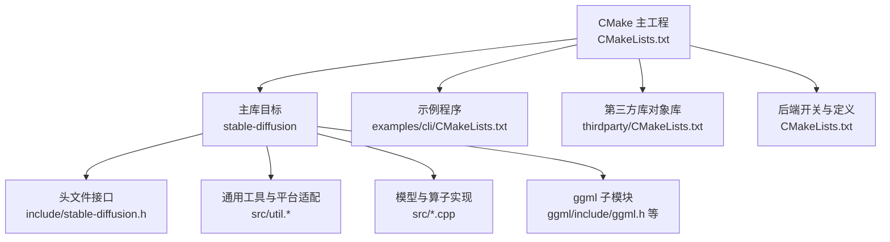
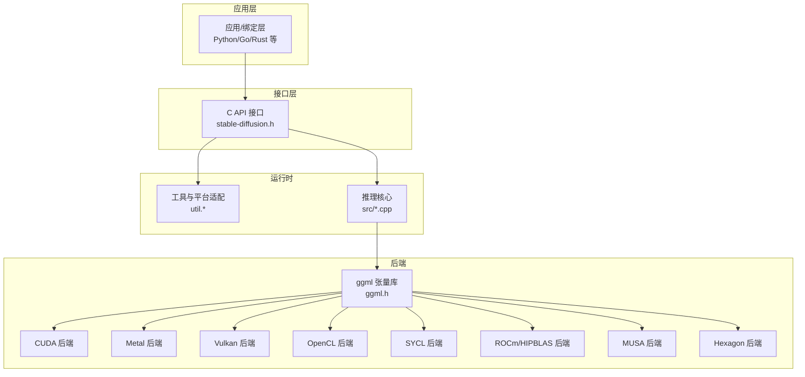
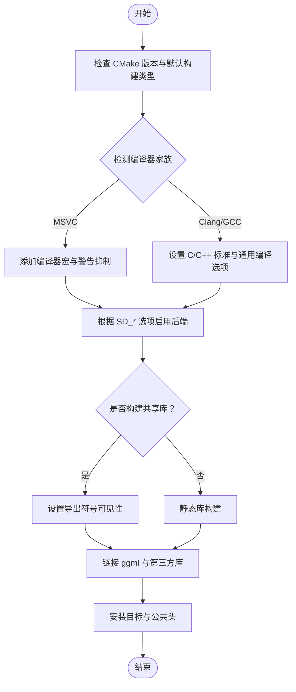
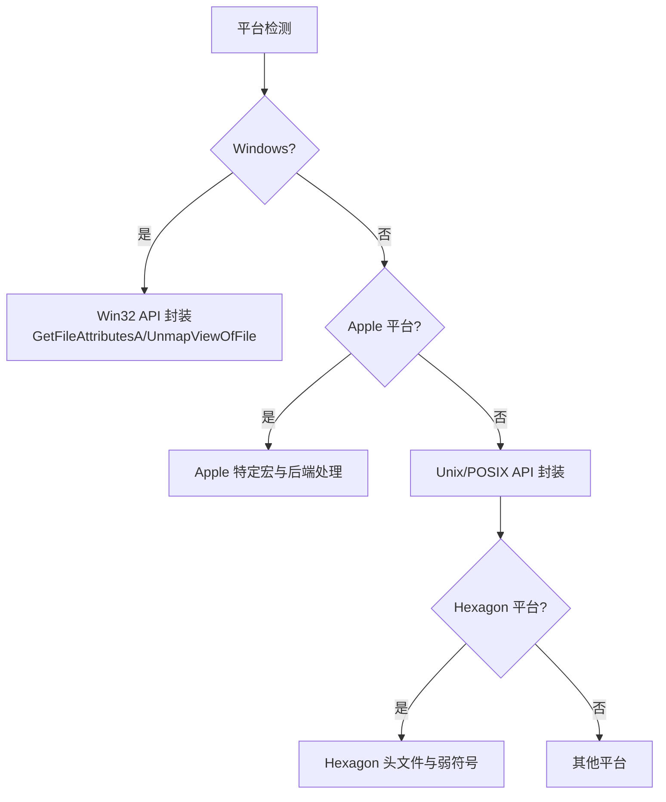
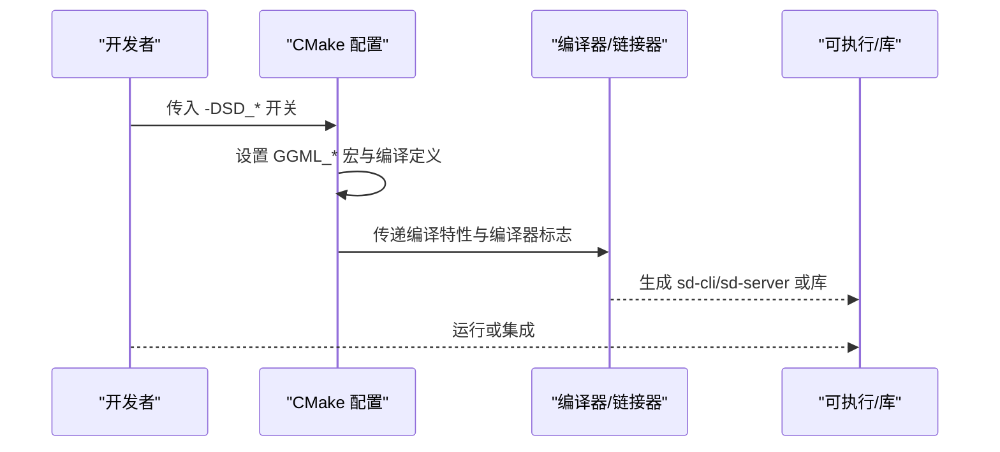
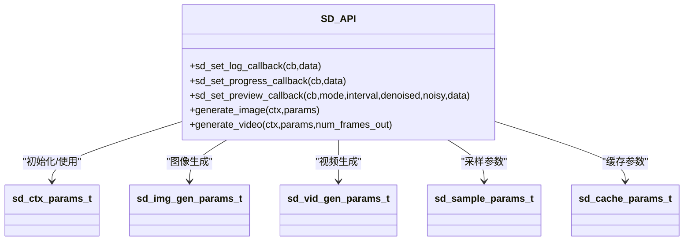
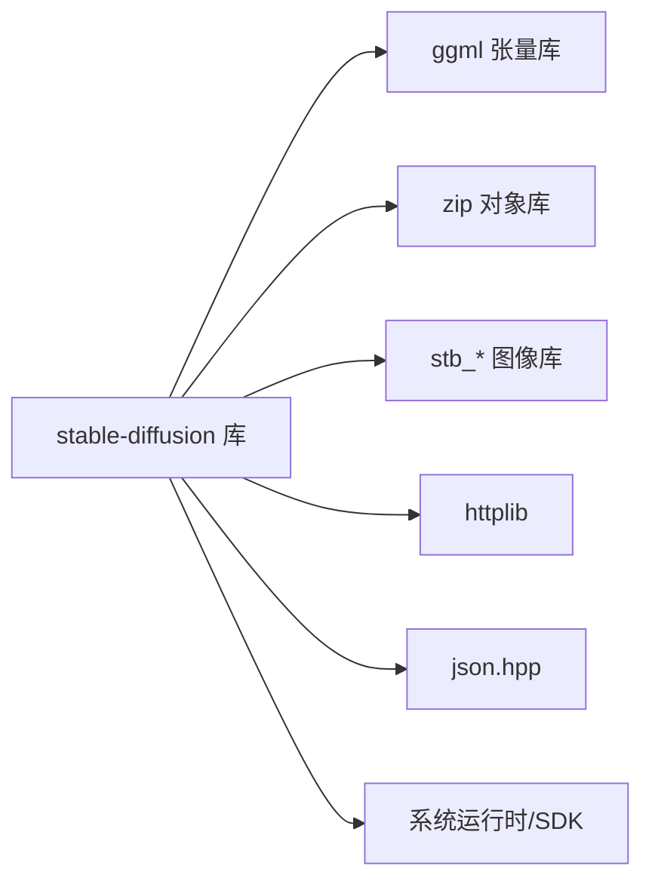

# 兼容性问题

<cite>
**本文引用的文件**
- [CMakeLists.txt](file://CMakeLists.txt)
- [README.md](file://README.md)
- [docs/build.md](file://docs/build.md)
- [Dockerfile](file://Dockerfile)
- [Dockerfile.vulkan](file://Dockerfile.vulkan)
- [Dockerfile.sycl](file://Dockerfile.sycl)
- [thirdparty/CMakeLists.txt](file://thirdparty/CMakeLists.txt)
- [include/stable-diffusion.h](file://include/stable-diffusion.h)
- [src/util.h](file://src/util.h)
- [src/util.cpp](file://src/util.cpp)
- [ggml/include/ggml.h](file://ggml/include/ggml.h)
- [ggml/src/ggml-cpu/arch/x86/cpu-feats.cpp](file://ggml/src/ggml-cpu/arch/x86/cpu-feats.cpp)
- [ggml/src/ggml-hexagon/htp-drv.h](file://ggml/src/ggml-hexagon/htp-drv.h)
- [ggml/src/ggml-cpu/ggml-cpu.c](file://ggml/src/ggml-cpu/ggml-cpu.c)
- [ggml/src/ggml-virtgpu/backend/shared/api_remoting.h](file://ggml/src/ggml-virtgpu/backend/shared/api_remoting.h)
- [examples/cli/CMakeLists.txt](file://examples/cli/CMakeLists.txt)
</cite>

## 目录
1. [简介](#简介)
2. [项目结构](#项目结构)
3. [核心组件](#核心组件)
4. [架构总览](#架构总览)
5. [详细组件分析](#详细组件分析)
6. [依赖关系分析](#依赖关系分析)
7. [性能与兼容性权衡](#性能与兼容性权衡)
8. [故障排除指南](#故障排除指南)
9. [结论](#结论)
10. [附录：版本兼容性矩阵与升级指南](#附录版本兼容性矩阵与升级指南)

## 简介
本指南聚焦于稳定扩散 C++ 实现（stable-diffusion.cpp）在多操作系统、多编译器、多后端（CUDA/Metal/Vulkan/OpenCL/SYCL/HIP/MUSA/Hexagon 等）与多第三方库版本下的兼容性问题与排障实践。内容覆盖：
- C++ 标准与编译器版本差异
- 平台特定 API 变化（Windows/macOS/Linux/Android）
- 后端与驱动版本冲突
- 依赖库版本冲突与回退策略
- 向后兼容与迁移注意事项
- 跨平台移植要点
- 版本兼容性矩阵与升级建议

## 项目结构
该项目采用 CMake 构建，主库为 stable-diffusion，通过可选后端（ggml 各后端子模块）实现跨平台推理加速；示例程序（CLI/Server）独立构建；第三方库以对象库形式内嵌。

图表来源
- [CMakeLists.txt:1-200](file://CMakeLists.txt#L1-L200)
- [examples/cli/CMakeLists.txt:1-6](file://examples/cli/CMakeLists.txt#L1-L6)
- [thirdparty/CMakeLists.txt:1-3](file://thirdparty/CMakeLists.txt#L1-L3)
- [include/stable-diffusion.h:1-423](file://include/stable-diffusion.h#L1-L423)
- [src/util.h:1-94](file://src/util.h#L1-L94)
- [ggml/include/ggml.h:1-200](file://ggml/include/ggml.h#L1-L200)

章节来源
- [CMakeLists.txt:1-200](file://CMakeLists.txt#L1-L200)
- [README.md:1-202](file://README.md#L1-L202)
- [docs/build.md:1-174](file://docs/build.md#L1-L174)

## 核心组件
- 接口层（C API 头文件）：统一对外接口、参数结构体、回调与枚举，便于跨语言绑定与跨平台调用。
- 工具与平台适配：路径拼接、字符串处理、内存映射、日志与进度回调等。
- 构建与后端选择：CMake 选项控制后端启用、共享库构建、编译特性（C11/C++17）、编译器宏（MSVC/Clang/GCC）。
- 第三方库：zip 对象库、json.hpp（用于系统信息采集）、stb_* 图像处理等。
- ggml 张量库：作为计算后端基础，提供跨平台张量运算与后端扩展能力。

章节来源
- [include/stable-diffusion.h:1-423](file://include/stable-diffusion.h#L1-L423)
- [src/util.h:1-94](file://src/util.h#L1-L94)
- [src/util.cpp:1-120](file://src/util.cpp#L1-L120)
- [CMakeLists.txt:1-200](file://CMakeLists.txt#L1-L200)
- [thirdparty/CMakeLists.txt:1-3](file://thirdparty/CMakeLists.txt#L1-L3)
- [ggml/include/ggml.h:1-200](file://ggml/include/ggml.h#L1-L200)

## 架构总览
下图展示从应用到后端的关键交互路径与兼容性关注点。

图表来源
- [include/stable-diffusion.h:1-423](file://include/stable-diffusion.h#L1-L423)
- [src/util.cpp:1-120](file://src/util.cpp#L1-L120)
- [ggml/include/ggml.h:1-200](file://ggml/include/ggml.h#L1-L200)
- [CMakeLists.txt:40-85](file://CMakeLists.txt#L40-L85)

## 详细组件分析

### 组件一：CMake 构建与编译器/标准兼容
- 最低 CMake 版本与构建类型默认值
- 编译器特定宏与警告抑制（MSVC）
- C/C++ 标准要求（C11/C++17）
- 后端开关与定义（SD_CUDA/SD_METAL/SD_VULKAN/SD_OPENCL/SD_SYCL/SD_HIPBLAS/SD_MUSA）
- 共享库构建与导出符号可见性
- 使用系统 ggml 或子目录 ggml 的选择逻辑

图表来源
- [CMakeLists.txt:1-200](file://CMakeLists.txt#L1-L200)

章节来源
- [CMakeLists.txt:1-200](file://CMakeLists.txt#L1-L200)

### 组件二：平台特定 API 与条件编译
- Windows 文件属性与内存映射封装
- POSIX 文件系统与线程 API 条件分支
- Apple 平台宏与特定后端行为
- Hexagon 平台头文件与弱符号声明

图表来源
- [src/util.cpp:84-120](file://src/util.cpp#L84-L120)
- [src/util.cpp:191-235](file://src/util.cpp#L191-L235)
- [ggml/src/ggml-hexagon/htp-drv.h:55-121](file://ggml/src/ggml-hexagon/htp-drv.h#L55-L121)

章节来源
- [src/util.cpp:84-120](file://src/util.cpp#L84-L120)
- [src/util.cpp:191-235](file://src/util.cpp#L191-L235)
- [ggml/src/ggml-hexagon/htp-drv.h:55-121](file://ggml/src/ggml-hexagon/htp-drv.h#L55-L121)

### 组件三：后端选择与依赖
- 后端开关与 ggml 宏映射（CUDA/METAL/VULKAN/OPENCL/SYCL/HIP/MUSA）
- SYCL 后端关闭主机快速数学优化的处理
- Dockerfile 针对不同后端的环境准备与构建命令
- 示例程序构建与线程库链接

图表来源
- [CMakeLists.txt:40-85](file://CMakeLists.txt#L40-L85)
- [CMakeLists.txt:147-161](file://CMakeLists.txt#L147-L161)
- [examples/cli/CMakeLists.txt:1-6](file://examples/cli/CMakeLists.txt#L1-L6)

章节来源
- [CMakeLists.txt:40-85](file://CMakeLists.txt#L40-L85)
- [CMakeLists.txt:147-161](file://CMakeLists.txt#L147-L161)
- [examples/cli/CMakeLists.txt:1-6](file://examples/cli/CMakeLists.txt#L1-L6)

### 组件四：接口与数据结构的跨平台一致性
- C API 导出宏（Windows DLL 导入/导出、GCC 可见性）
- 参数结构体与枚举（采样方法、调度器、量化类型、日志级别等）
- 回调函数签名与进度/预览模式

图表来源
- [include/stable-diffusion.h:31-423](file://include/stable-diffusion.h#L31-L423)

章节来源
- [include/stable-diffusion.h:31-423](file://include/stable-diffusion.h#L31-L423)

### 组件五：第三方库与系统信息
- zip 对象库（归档读写）
- json.hpp 中包含编译器与 C++ 标准探测逻辑
- Dockerfile 与构建文档中对系统依赖的说明

章节来源
- [thirdparty/CMakeLists.txt:1-3](file://thirdparty/CMakeLists.txt#L1-L3)
- [Dockerfile:1-23](file://Dockerfile#L1-L23)
- [Dockerfile.vulkan:1-24](file://Dockerfile.vulkan#L1-L24)
- [Dockerfile.sycl:1-21](file://Dockerfile.sycl#L1-L21)
- [docs/build.md:1-174](file://docs/build.md#L1-L174)

## 依赖关系分析
- 构建期依赖：CMake、编译器（MSVC/Clang/GCC）、可选后端 SDK（CUDA/ROCm/MUSA/Vulkan/Intel oneAPI）
- 运行期依赖：ggml 库、系统运行时（如 libgomp、libvulkan1）
- 第三方库：zip 对象库、stb_*、json.hpp、httplib 等

图表来源
- [CMakeLists.txt:170-189](file://CMakeLists.txt#L170-L189)
- [thirdparty/CMakeLists.txt:1-3](file://thirdparty/CMakeLists.txt#L1-L3)

章节来源
- [CMakeLists.txt:170-189](file://CMakeLists.txt#L170-L189)
- [thirdparty/CMakeLists.txt:1-3](file://thirdparty/CMakeLists.txt#L1-L3)

## 性能与兼容性权衡
- SYCL 后端在主机上禁用快速数学优化以保证数值稳定性
- 后端选择影响可用的量化类型与算子支持
- 共享库构建需要正确处理符号可见性与 ABI 稳定性
- 平台差异导致的内存映射与线程 API 不一致需通过条件编译屏蔽

章节来源
- [CMakeLists.txt:147-161](file://CMakeLists.txt#L147-L161)
- [src/util.cpp:84-120](file://src/util.cpp#L84-L120)
- [src/util.cpp:191-235](file://src/util.cpp#L191-L235)

## 故障排除指南

### 1) 编译器与 C++ 标准不匹配
- 症状：编译报错或链接失败，提示 C++ 标准不满足
- 排查要点：
  - 检查 CMake 输出的编译特性（C11/C++17）
  - 确认编译器版本满足最低要求
  - 在 MSVC 下确认已添加必要的编译器宏与警告抑制
- 解决方案：
  - 升级编译器至满足 C++17 的版本
  - 显式指定编译器与标准（如 icx/icpx、-std=c++17）

章节来源
- [CMakeLists.txt:189](file://CMakeLists.txt#L189)
- [CMakeLists.txt:11-14](file://CMakeLists.txt#L11-L14)

### 2) 后端未启用或启用冲突
- 症状：运行时报后端不可用、无法加载后端库或功能缺失
- 排查要点：
  - 确认仅启用一个后端（SD_CUDA/SD_METAL/SD_VULKAN/SD_OPENCL/SD_SYCL/SD_HIPBLAS/SD_MUSA）
  - 检查对应 SDK 是否安装且版本兼容
- 解决方案：
  - 清理构建目录重新配置，确保只开启所需后端
  - 按构建文档安装对应 SDK，并按示例命令行构建

章节来源
- [docs/build.md:37-90](file://docs/build.md#L37-L90)
- [CMakeLists.txt:40-85](file://CMakeLists.txt#L40-L85)

### 3) 平台特定 API 错误（Windows/macOS/Linux/Android）
- 症状：文件操作、内存映射、线程创建失败
- 排查要点：
  - 检查平台分支是否正确（Windows/POSIX/Apple/Hexagon）
  - 确认运行时库与系统 API 可用
- 解决方案：
  - 使用项目提供的工具封装（如 MmapWrapper、文件存在性判断）
  - 在 Android 上按构建文档准备 OpenCL 头与 ICD 库

章节来源
- [src/util.cpp:84-120](file://src/util.cpp#L84-L120)
- [src/util.cpp:191-235](file://src/util.cpp#L191-L235)
- [docs/build.md:92-155](file://docs/build.md#L92-L155)

### 4) 数值精度与后端稳定性
- 症状：不同后端结果不一致或不稳定
- 排查要点：
  - SYCL 后端在主机上禁用了快速数学优化
  - CUDA 快速 Softmax 可能带来非确定性
- 解决方案：
  - 在需要确定性的场景关闭快速 Softmax
  - 在 SYCL 场景保持默认精度设置

章节来源
- [CMakeLists.txt:147-161](file://CMakeLists.txt#L147-L161)
- [CMakeLists.txt:39](file://CMakeLists.txt#L39)

### 5) 共享库与符号可见性问题
- 症状：动态库导入失败或符号未导出
- 排查要点：
  - 确认构建共享库时导出宏与可见性设置
  - 检查链接顺序与导出表
- 解决方案：
  - 使用项目提供的公共头与导出宏
  - 在集成时确保加载正确的运行时库

章节来源
- [include/stable-diffusion.h:4-20](file://include/stable-diffusion.h#L4-L20)
- [CMakeLists.txt:129-145](file://CMakeLists.txt#L129-L145)

### 6) Docker 环境后端不可用
- 症状：容器内缺少后端运行时库或驱动
- 排查要点：
  - 检查 Dockerfile 中安装的运行时库
  - 确认宿主机驱动与容器镜像匹配
- 解决方案：
  - 使用官方 Dockerfile 构建对应后端镜像
  - 在宿主机安装匹配的 SDK/驱动

章节来源
- [Dockerfile:1-23](file://Dockerfile#L1-L23)
- [Dockerfile.vulkan:1-24](file://Dockerfile.vulkan#L1-L24)
- [Dockerfile.sycl:1-21](file://Dockerfile.sycl#L1-L21)

### 7) ggml 版本与接口变更
- 症状：链接错误或符号缺失
- 排查要点：
  - 确认使用子目录 ggml 或系统 ggml 的一致性
  - 检查 ggml.h 中导出宏与可见性
- 解决方案：
  - 使用项目管理的 ggml 子模块
  - 若使用系统 ggml，确保版本与接口兼容

章节来源
- [CMakeLists.txt:165-182](file://CMakeLists.txt#L165-L182)
- [ggml/include/ggml.h:176-197](file://ggml/include/ggml.h#L176-L197)

### 8) SIMD 与 CPU 指令集差异
- 症状：在某些 CPU 上性能异常或崩溃
- 排查要点：
  - 检查 CPU 指令集检测与特性位
  - 确认编译器与运行时的 SIMD 支持
- 解决方案：
  - 使用项目内置的指令集检测与降级路径
  - 在 CI/本地交叉编译时明确目标架构

章节来源
- [ggml/src/ggml-cpu/arch/x86/cpu-feats.cpp:112-231](file://ggml/src/ggml-cpu/arch/x86/cpu-feats.cpp#L112-L231)

### 9) 跨平台移植常见陷阱
- 症状：路径分隔符、大小写敏感、换行符、权限差异导致的问题
- 排查要点：
  - 使用项目提供的路径拼接与字符串处理工具
  - 避免硬编码平台特定路径与行为
- 解决方案：
  - 统一使用工具层封装的路径与字符串处理函数
  - 在 Android/Windows/macOS 上分别验证构建与运行

章节来源
- [src/util.h:69-87](file://src/util.h#L69-L87)

## 结论
本项目通过清晰的 C API、条件编译与后端抽象，在多平台与多后端环境下提供了较好的兼容性。排障的关键在于：
- 正确选择与配置后端
- 严格遵循 C/C++ 标准与编译器要求
- 使用平台适配封装规避平台差异
- 在容器与系统环境中同步依赖版本

## 附录：版本兼容性矩阵与升级指南

### 版本兼容性矩阵（示例）
- 操作系统
  - Linux（Ubuntu 22.04/24.04）
  - macOS（Xcode 工具链）
  - Windows（MSVC）
  - Android（NDK，OpenCL）
- 编译器
  - GCC/Clang（C++17 支持）
  - MSVC（Windows）
  - Intel oneAPI（SYCL）
- 后端与驱动
  - CUDA（>= 11.x），显卡驱动匹配
  - ROCm/HIP（>= 5.x），MIG/架构匹配
  - MUSA（Moore Threads 工具链）
  - Metal（macOS/iOS）
  - Vulkan（Vulkan SDK，驱动）
  - OpenCL（Adreno/Android NDK）
  - SYCL（Intel oneAPI Base Kit）

章节来源
- [docs/build.md:37-174](file://docs/build.md#L37-L174)
- [Dockerfile:1-23](file://Dockerfile#L1-L23)
- [Dockerfile.vulkan:1-24](file://Dockerfile.vulkan#L1-L24)
- [Dockerfile.sycl:1-21](file://Dockerfile.sycl#L1-L21)

### 升级指南
- 升级 ggml 子模块：更新子模块并确保接口兼容
- 升级后端 SDK：先在本地验证，再在 CI 中测试
- 升级编译器：先在小范围验证，再扩大到全平台
- 共享库 ABI：保持导出宏与可见性一致，避免破坏性变更
- Docker 镜像：同步更新基础镜像与运行时库版本

章节来源
- [CMakeLists.txt:165-182](file://CMakeLists.txt#L165-L182)
- [include/stable-diffusion.h:4-20](file://include/stable-diffusion.h#L4-L20)