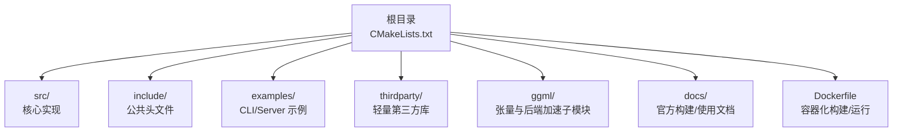
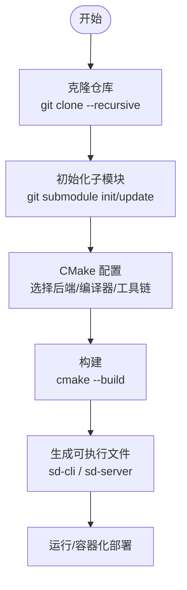
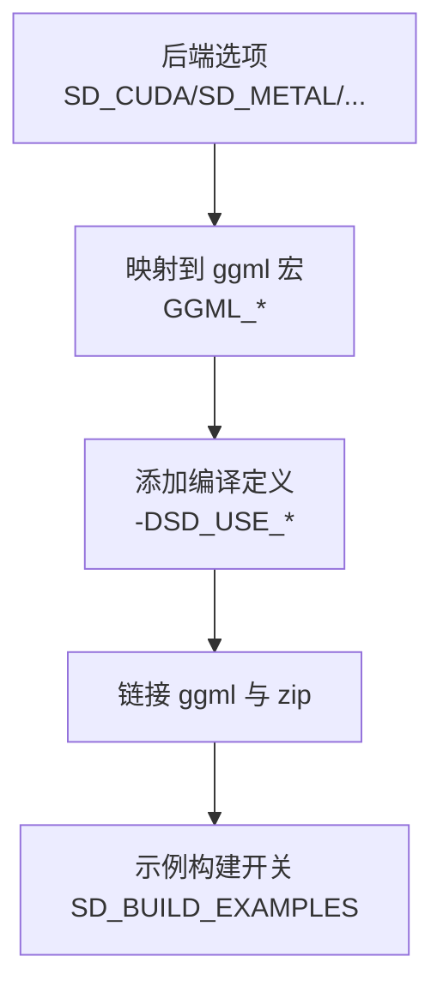
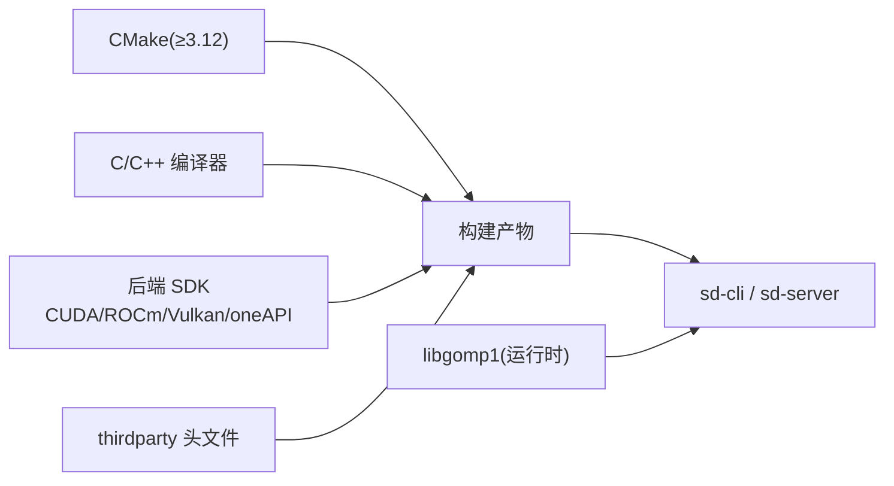

# 安装问题

<cite>
**本文引用的文件**
- [README.md](file://README.md)
- [docs/build.md](file://docs/build.md)
- [docs/docker.md](file://docs/docker.md)
- [docs/hipBLAS_on_Windows.md](file://docs/hipBLAS_on_Windows.md)
- [CMakeLists.txt](file://CMakeLists.txt)
- [Dockerfile](file://Dockerfile)
- [examples/cli/README.md](file://examples/cli/README.md)
- [examples/server/README.md](file://examples/server/README.md)
- [thirdparty/README.md](file://thirdparty/README.md)
- [ggml/src/ggml-vulkan/vulkan-shaders/vulkan-shaders-gen.cpp](file://ggml/src/ggml-vulkan/vulkan-shaders/vulkan-shaders-gen.cpp)
- [ggml/src/ggml-sycl/CMakeLists.txt](file://ggml/src/ggml-sycl/CMakeLists.txt)
</cite>

## 目录
1. [简介](#简介)
2. [项目结构](#项目结构)
3. [核心组件](#核心组件)
4. [架构总览](#架构总览)
5. [详细组件分析](#详细组件分析)
6. [依赖关系分析](#依赖关系分析)
7. [性能考量](#性能考量)
8. [故障排除指南](#故障排除指南)
9. [结论](#结论)
10. [附录](#附录)

## 简介
本指南聚焦于“稳定扩散.cpp”的安装与部署问题，覆盖从源码编译到跨平台运行、Docker 部署、以及常见错误的诊断与修复。内容基于仓库内的官方文档与构建脚本，帮助用户在 Linux、Windows、macOS 上完成安装，并在遇到编译失败、依赖缺失、平台兼容性问题时快速定位与解决。

## 项目结构
该项目采用 CMake 构建系统，主工程通过 CMakeLists.txt 统一管理；示例程序位于 examples/ 下，包含命令行与服务器两种可执行体；第三方依赖通过 thirdparty/ 提供；后端加速（CUDA、Metal、Vulkan、OpenCL、SYCL、HipBLAS、MUSA）由 ggml 子模块与 CMake 选项控制；Dockerfile 用于容器化构建与运行。

图表来源
- [CMakeLists.txt:1-200](file://CMakeLists.txt#L1-L200)
- [Dockerfile:1-23](file://Dockerfile#L1-L23)

章节来源
- [CMakeLists.txt:1-200](file://CMakeLists.txt#L1-L200)
- [Dockerfile:1-23](file://Dockerfile#L1-L23)

## 核心组件
- 构建系统与后端开关：通过 CMake 选项启用/禁用后端（CUDA、Metal、Vulkan、OpenCL、SYCL、HipBLAS、MUSA），并在目标中统一链接 ggml 与 zip。
- 示例程序：CLI 与 Server，分别提供命令行与 HTTP 接口的推理入口。
- 第三方依赖：json、ZIP、darts、cpp-httplib、stb 图像处理等，以头文件形式集成。
- Docker 支持：多阶段构建，提供 CLI/Server 可执行文件与最小运行时依赖。

章节来源
- [CMakeLists.txt:29-85](file://CMakeLists.txt#L29-L85)
- [CMakeLists.txt:165-182](file://CMakeLists.txt#L165-L182)
- [examples/cli/README.md:1-151](file://examples/cli/README.md#L1-L151)
- [examples/server/README.md:1-140](file://examples/server/README.md#L1-L140)
- [thirdparty/README.md:1-10](file://thirdparty/README.md#L1-L10)
- [Dockerfile:14-23](file://Dockerfile#L14-L23)

## 架构总览
下图展示从源码到可执行文件的关键流程，以及后端选择对构建的影响。

图表来源
- [docs/build.md:3-17](file://docs/build.md#L3-L17)
- [docs/build.md:19-27](file://docs/build.md#L19-L27)
- [CMakeLists.txt:29-85](file://CMakeLists.txt#L29-L85)

## 详细组件分析

### CMake 构建与后端配置
- 后端选项：通过 SD_CUDA、SD_METAL、SD_VULKAN、SD_OPENCL、SD_SYCL、SD_HIPBLAS、SD_MUSA 控制是否启用对应后端，同时设置 ggml 对应宏与编译定义。
- 系统 ggml：默认使用子目录 ggml；可通过 SD_USE_SYSTEM_GGML 使用系统安装的 ggml。
- 编译特性：要求 C11、C++17；根据平台设置输出目录与构建类型。
- 示例构建：可选构建 examples。

图表来源
- [CMakeLists.txt:29-85](file://CMakeLists.txt#L29-L85)
- [CMakeLists.txt:165-182](file://CMakeLists.txt#L165-L182)
- [CMakeLists.txt:192-194](file://CMakeLists.txt#L192-L194)

章节来源
- [CMakeLists.txt:29-85](file://CMakeLists.txt#L29-L85)
- [CMakeLists.txt:165-182](file://CMakeLists.txt#L165-L182)
- [CMakeLists.txt:192-194](file://CMakeLists.txt#L192-L194)

### 平台与后端安装步骤

#### Linux（通用）
- 获取代码与子模块
  - 克隆并递归初始化子模块。
- CPU 构建
  - 创建 build 目录，执行 CMake 与构建。
- GPU 加速（按需启用）
  - CUDA：确保已安装 CUDA 工具链，使用相应选项开启。
  - Vulkan：安装 Vulkan SDK，使用相应选项开启。
  - Metal：当前存在大矩阵效率问题，建议关注后续优化。
  - OpenCL：支持 Adreno GPU，Android/NDK 需要额外准备 OpenCL 头与 ICD 库。
  - SYCL：需安装 Intel oneAPI 基础工具包，按文档设置环境变量与编译器。
  - HipBLAS（AMD GPU）：安装 ROCm，自动或手动设置 GFX_NAME，使用 Ninja 生成器。
  - MUSA（摩尔线程 GPU）：安装 MUSA 工具链，指定 clang 编译器。

章节来源
- [docs/build.md:3-17](file://docs/build.md#L3-L17)
- [docs/build.md:19-27](file://docs/build.md#L19-L27)
- [docs/build.md:37-45](file://docs/build.md#L37-L45)
- [docs/build.md:82-90](file://docs/build.md#L82-L90)
- [docs/build.md:92-156](file://docs/build.md#L92-L156)
- [docs/build.md:158-173](file://docs/build.md#L158-L173)
- [docs/build.md:47-60](file://docs/build.md#L47-L60)
- [docs/build.md:62-70](file://docs/build.md#L62-L70)

#### Windows
- CPU 构建：安装 Visual Studio 2022、CMake、Ninja，按常规 CPU 步骤构建。
- HipBLAS（AMD GPU）：安装 ROCm（注意忽略特定插件安装错误）、设置 clang 路径、使用 Ninja 生成器与对应 GPU 架构参数进行构建。

章节来源
- [docs/hipBLAS_on_Windows.md:1-86](file://docs/hipBLAS_on_Windows.md#L1-L86)

#### macOS
- CPU 构建：与 Linux 类似，创建 build 目录并执行 CMake 与构建。
- Metal：可启用 Metal 后端，但注意大矩阵效率问题。

章节来源
- [docs/build.md:72-80](file://docs/build.md#L72-L80)

### Docker 部署
- 运行 CLI：挂载模型与输出目录，传入参数。
- 运行 Server：暴露端口并通过 entrypoint 指定 sd-server。
- 本地构建镜像：使用默认 Dockerfile 或指定变体 Dockerfile（如 Vulkan）。
- 运行本地镜像：与官方镜像相同方式挂载路径并传参。

章节来源
- [docs/docker.md:1-40](file://docs/docker.md#L1-L40)
- [Dockerfile:1-23](file://Dockerfile#L1-L23)

### 安装验证与问题诊断
- 验证可执行文件：确认 sd-cli 与 sd-server 存在且可执行。
- 基本运行：使用最小参数生成图片，检查输出文件。
- 日志与调试：使用 --verbose 打印详细日志，结合 --color 着色便于区分级别。
- 模型路径：确保 -m/--model 指向正确的权重文件（.ckpt/.safetensors/.gguf）。
- 权限与路径：容器运行时注意挂载路径权限与输出目录写入权限。

章节来源
- [examples/cli/README.md:1-151](file://examples/cli/README.md#L1-L151)
- [examples/server/README.md:1-140](file://examples/server/README.md#L1-L140)
- [docs/docker.md:3-17](file://docs/docker.md#L3-L17)

## 依赖关系分析
- 构建期依赖：CMake（≥3.12）、编译器（C11/C++17）、平台工具链（如 CUDA/ROCm/Vulkan SDK、Intel oneAPI 等）。
- 运行期依赖：Linux 运行时需要 libgomp1；容器镜像已内置所需共享库。
- 第三方库：以头文件形式提供 JSON、ZIP、darts、cpp-httplib、STB 图像处理等。

图表来源
- [CMakeLists.txt:1-19](file://CMakeLists.txt#L1-L19)
- [Dockerfile:16-18](file://Dockerfile#L16-L18)
- [thirdparty/README.md:1-10](file://thirdparty/README.md#L1-L10)

章节来源
- [CMakeLists.txt:1-19](file://CMakeLists.txt#L1-L19)
- [Dockerfile:16-18](file://Dockerfile#L16-L18)
- [thirdparty/README.md:1-10](file://thirdparty/README.md#L1-L10)

## 性能考量
- 后端选择：GPU 后端通常显著提升性能，但需正确安装对应 SDK。
- 内存与显存：使用 VAE 分块（--vae-tiling）与分块重叠（--vae-tile-overlap）降低显存占用。
- 线程数：合理设置 --threads，避免过度并发导致上下文切换开销。
- 缓存策略：根据模型与采样器选择合适的缓存模式与参数，平衡速度与精度。

章节来源
- [examples/cli/README.md:47-79](file://examples/cli/README.md#L47-L79)
- [examples/server/README.md:38-69](file://examples/server/README.md#L38-L69)

## 故障排除指南

### 1. 编译失败（CMake 配置/后端）
- 症状：CMake 报错找不到后端 SDK 或无法检测到 GPU。
- 排查要点：
  - 确认已安装对应 SDK（CUDA/ROCm/Vulkan/oneAPI），并正确设置环境变量。
  - 对于 HipBLAS（Windows）：忽略特定 ROCm 插件安装错误，确保 clang 可用且目标架构匹配。
  - 对于 SYCL：确保已加载 oneAPI 环境变量，必要时指定 icx/icpx 与编译选项。
  - 对于 Vulkan：检查 glslc 是否可用，查看着色器编译日志。
- 参考路径：
  - [docs/build.md:37-45](file://docs/build.md#L37-L45)
  - [docs/build.md:47-60](file://docs/build.md#L47-L60)
  - [docs/build.md:82-90](file://docs/build.md#L82-L90)
  - [docs/build.md:158-173](file://docs/build.md#L158-L173)
  - [docs/hipBLAS_on_Windows.md:17-35](file://docs/hipBLAS_on_Windows.md#L17-L35)
  - [ggml/src/ggml-vulkan/vulkan-shaders-gen.cpp:324-398](file://ggml/src/ggml-vulkan/vulkan-shaders-gen.cpp#L324-L398)

章节来源
- [docs/build.md:37-45](file://docs/build.md#L37-L45)
- [docs/build.md:47-60](file://docs/build.md#L47-L60)
- [docs/build.md:82-90](file://docs/build.md#L82-L90)
- [docs/build.md:158-173](file://docs/build.md#L158-L173)
- [docs/hipBLAS_on_Windows.md:17-35](file://docs/hipBLAS_on_Windows.md#L17-L35)
- [ggml/src/ggml-vulkan/vulkan-shaders-gen.cpp:324-398](file://ggml/src/ggml-vulkan/vulkan-shaders-gen.cpp#L324-L398)

### 2. 依赖缺失（系统库/运行时）
- 症状：运行时报缺少共享库或运行时错误。
- 解决方案：
  - Linux：安装 libgomp1（Dockerfile 已内置）。
  - 容器：使用官方镜像或确保本地镜像包含运行时依赖。
- 参考路径：
  - [Dockerfile:16-18](file://Dockerfile#L16-L18)

章节来源
- [Dockerfile:16-18](file://Dockerfile#L16-L18)

### 3. 平台兼容性问题
- Windows（HipBLAS）：忽略 ROCm 安装插件错误，确保 clang 路径与目标架构正确。
- macOS（Metal）：注意大矩阵效率问题，必要时回退 CPU 或其他后端。
- Android（OpenCL）：需手动准备 OpenCL 头与 ICD 动态库，并正确配置 NDK 工具链。
- 参考路径：
  - [docs/hipBLAS_on_Windows.md:23-35](file://docs/hipBLAS_on_Windows.md#L23-L35)
  - [docs/build.md:72-80](file://docs/build.md#L72-L80)
  - [docs/build.md:92-156](file://docs/build.md#L92-L156)

章节来源
- [docs/hipBLAS_on_Windows.md:23-35](file://docs/hipBLAS_on_Windows.md#L23-L35)
- [docs/build.md:72-80](file://docs/build.md#L72-L80)
- [docs/build.md:92-156](file://docs/build.md#L92-L156)

### 4. CMake 配置问题
- 症状：未启用期望的后端、编译器版本不满足、未找到系统 ggml。
- 解决方案：
  - 明确启用后端选项（如 -DSD_CUDA=ON）。
  - 确保编译器满足 C11/C++17 要求。
  - 若使用系统 ggml，确保 find_package 成功。
- 参考路径：
  - [CMakeLists.txt:29-85](file://CMakeLists.txt#L29-L85)
  - [CMakeLists.txt:165-182](file://CMakeLists.txt#L165-L182)

章节来源
- [CMakeLists.txt:29-85](file://CMakeLists.txt#L29-L85)
- [CMakeLists.txt:165-182](file://CMakeLists.txt#L165-L182)

### 5. 编译器版本要求
- 要求：C11（C 语言）、C++17（C++）。
- 排查：确认编译器版本满足要求，必要时升级或切换编译器。
- 参考路径：
  - [CMakeLists.txt:189](file://CMakeLists.txt#L189)

章节来源
- [CMakeLists.txt:189](file://CMakeLists.txt#L189)

### 6. 第三方库依赖问题
- 症状：编译时报头文件缺失或链接错误。
- 解决方案：
  - thirdparty 为头文件依赖，无需额外安装；若自定义路径，请确保包含路径正确。
- 参考路径：
  - [thirdparty/README.md:1-10](file://thirdparty/README.md#L1-L10)
  - [CMakeLists.txt:186-188](file://CMakeLists.txt#L186-L188)

章节来源
- [thirdparty/README.md:1-10](file://thirdparty/README.md#L1-L10)
- [CMakeLists.txt:186-188](file://CMakeLists.txt#L186-L188)

### 7. Docker 镜像拉取/容器启动/权限问题
- 镜像拉取：使用官方 ghcr.io 镜像或自行构建。
- 容器启动：正确挂载模型与输出目录，设置端口映射（服务场景）。
- 权限问题：确保宿主机挂载目录有读写权限，容器内用户对输出目录具备写权限。
- 参考路径：
  - [docs/docker.md:3-17](file://docs/docker.md#L3-L17)
  - [Dockerfile:14-23](file://Dockerfile#L14-L23)

章节来源
- [docs/docker.md:3-17](file://docs/docker.md#L3-L17)
- [Dockerfile:14-23](file://Dockerfile#L14-L23)

### 8. Vulkan 后端编译与运行
- 症状：着色器编译失败或运行时错误。
- 排查要点：
  - 检查 glslc 是否可用与版本兼容。
  - 查看着色器生成脚本输出的错误信息，确认命令行参数与目标环境。
- 参考路径：
  - [docs/build.md:82-90](file://docs/build.md#L82-L90)
  - [ggml/src/ggml-vulkan/vulkan-shaders-gen.cpp:324-398](file://ggml/src/ggml-vulkan/vulkan-shaders-gen.cpp#L324-L398)

章节来源
- [docs/build.md:82-90](file://docs/build.md#L82-L90)
- [ggml/src/ggml-vulkan/vulkan-shaders-gen.cpp:324-398](file://ggml/src/ggml-vulkan/vulkan-shaders-gen.cpp#L324-L398)

### 9. SYCL 后端检测与编译
- 症状：SYCL 包检测失败或编译报错。
- 排查要点：
  - 确认已加载 oneAPI 环境变量。
  - 使用内置检测逻辑验证包可用性，必要时手动指定编译器与选项。
- 参考路径：
  - [docs/build.md:158-173](file://docs/build.md#L158-L173)
  - [ggml/src/ggml-sycl/CMakeLists.txt:39-77](file://ggml/src/ggml-sycl/CMakeLists.txt#L39-L77)

章节来源
- [docs/build.md:158-173](file://docs/build.md#L158-L173)
- [ggml/src/ggml-sycl/CMakeLists.txt:39-77](file://ggml/src/ggml-sycl/CMakeLists.txt#L39-L77)

## 结论
通过明确的后端选择、正确的 SDK 安装与 CMake 配置，以及容器化的标准化部署，大多数安装与运行问题均可被有效规避与修复。建议在首次安装时优先使用 CPU 构建验证环境，再逐步启用 GPU 后端；在容器环境中严格管理挂载与权限；遇到后端特定问题时，参考对应平台文档与错误输出进行定位。

## 附录
- 快速开始与更多指南入口见项目根 README 的“更多指南”部分。
- 示例程序参数与选项详见 examples/cli/README.md 与 examples/server/README.md。

章节来源
- [README.md:130-151](file://README.md#L130-L151)
- [examples/cli/README.md:1-151](file://examples/cli/README.md#L1-L151)
- [examples/server/README.md:1-140](file://examples/server/README.md#L1-L140)