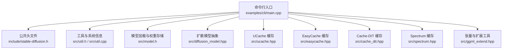
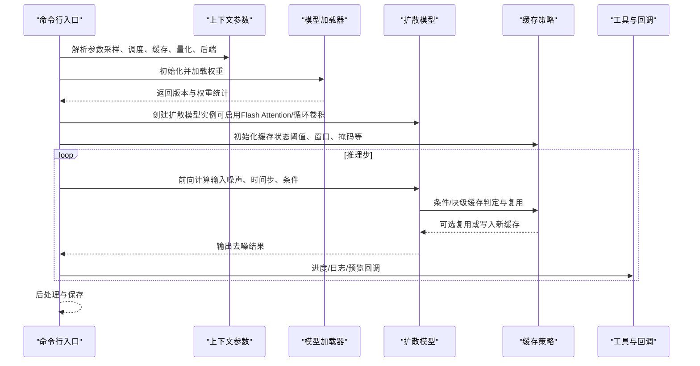
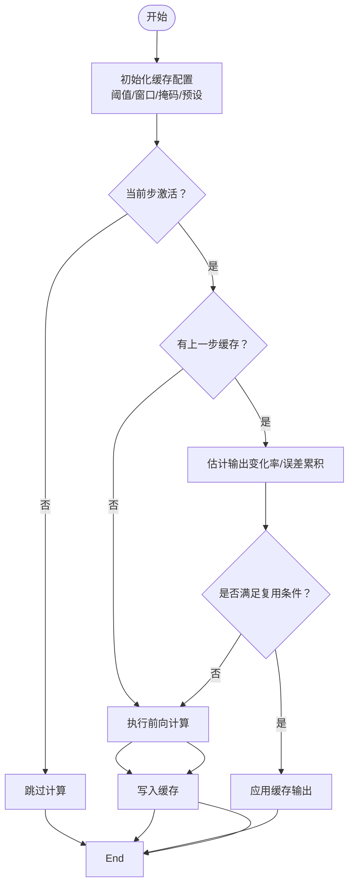
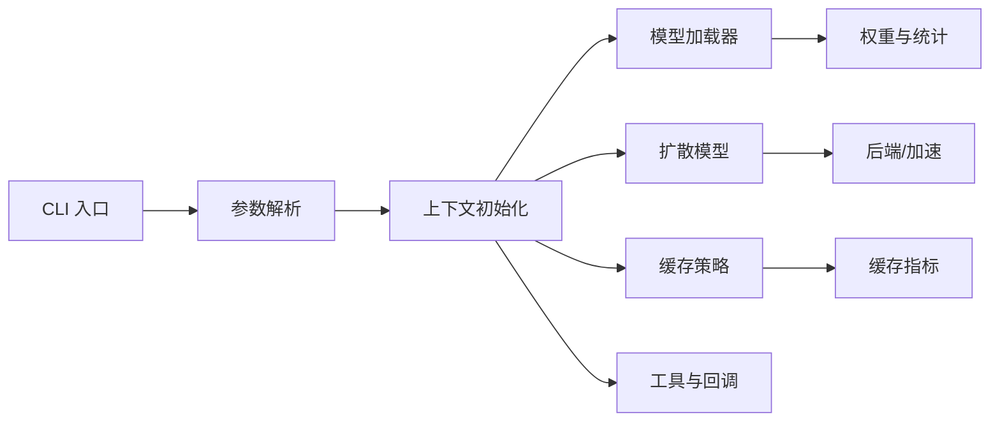

# 性能问题

<cite>
**本文引用的文件**
- [性能与缓存指南](file://docs/performance.md)
- [缓存机制与模式](file://docs/caching.md)
- [量化与GGUF转换](file://docs/quantization_and_gguf.md)
- [主程序入口（CLI）](file://examples/cli/main.cpp)
- [核心头文件：类型与参数定义](file://include/stable-diffusion.h)
- [扩展工具与张量操作](file://src/ggml_extend.hpp)
- [通用工具与系统信息](file://src/util.h)
- [模型加载与权重存储](file://src/model.h)
- [扩散模型抽象接口](file://src/diffusion_model.hpp)
- [缓存实现：UCache（UNet）](file://src/ucache.hpp)
- [缓存实现：EasyCache（DiT）](file://src/easycache.hpp)
- [缓存实现：Cache-DIT（DiT）](file://src/cache_dit.hpp)
- [缓存实现：Spectrum（UNet）](file://src/spectrum.hpp)
- [通用工具实现（日志、进度、系统信息）](file://src/util.cpp)
</cite>

## 目录
1. [简介](#简介)
2. [项目结构](#项目结构)
3. [核心组件](#核心组件)
4. [架构总览](#架构总览)
5. [详细组件分析](#详细组件分析)
6. [依赖关系分析](#依赖关系分析)
7. [性能考量与优化建议](#性能考量与优化建议)
8. [故障排查指南](#故障排查指南)
9. [结论](#结论)
10. [附录](#附录)

## 简介
本指南聚焦于在该稳定扩散项目中定位与优化性能问题的方法论与实操建议，覆盖内存不足、显存溢出、CPU占用过高、推理速度慢等常见瓶颈，并结合仓库中的缓存策略、量化技术、后端选择、批处理与并行配置等能力，给出可落地的优化路径与最佳实践。

## 项目结构
该项目采用模块化设计，围绕“上下文初始化—模型加载—扩散推理—后处理”的主流程组织代码；同时通过缓存、量化、后端适配等机制提供性能优化能力。下图展示与性能相关的关键模块与交互：

**图表来源**
- [主程序入口（CLI）](file://examples/cli/main.cpp)
- [核心头文件：类型与参数定义](file://include/stable-diffusion.h)
- [通用工具与系统信息](file://src/util.h)
- [模型加载与权重存储](file://src/model.h)
- [扩散模型抽象接口](file://src/diffusion_model.hpp)
- [缓存实现：UCache（UNet）](file://src/ucache.hpp)
- [缓存实现：EasyCache（DiT）](file://src/easycache.hpp)
- [缓存实现：Cache-DIT（DiT）](file://src/cache_dit.hpp)
- [缓存实现：Spectrum（UNet）](file://src/spectrum.hpp)
- [扩展工具与张量操作](file://src/ggml_extend.hpp)

**章节来源**
- [主程序入口（CLI）](file://examples/cli/main.cpp)
- [核心头文件：类型与参数定义](file://include/stable-diffusion.h)
- [通用工具与系统信息](file://src/util.h)
- [模型加载与权重存储](file://src/model.h)
- [扩散模型抽象接口](file://src/diffusion_model.hpp)
- [缓存实现：UCache（UNet）](file://src/ucache.hpp)
- [缓存实现：EasyCache（DiT）](file://src/easycache.hpp)
- [缓存实现：Cache-DIT（DiT）](file://src/cache_dit.hpp)
- [缓存实现：Spectrum（UNet）](file://src/spectrum.hpp)
- [扩展工具与张量操作](file://src/ggml_extend.hpp)

## 核心组件
- 上下文与参数：通过公共头文件定义生成参数、采样器、调度器、缓存参数等，便于统一控制性能相关选项。
- 模型加载：支持从多种格式加载权重，按需进行类型转换与内存统计，为量化与内存规划提供依据。
- 扩散模型：以抽象接口封装不同架构（UNet、DiT、Flux、WAN、Qwen、Z-Image、Anima），便于切换后端与启用特性（如Flash Attention、循环卷积等）。
- 缓存策略：提供多套缓存方案（UCache、EasyCache、Cache-DIT、Spectrum），在保证质量的前提下显著减少重复计算。
- 工具与系统信息：提供日志回调、进度回调、预览回调、系统信息打印、物理核数估算等，便于性能观测与调试。

**章节来源**
- [核心头文件：类型与参数定义](file://include/stable-diffusion.h)
- [模型加载与权重存储](file://src/model.h)
- [扩散模型抽象接口](file://src/diffusion_model.hpp)
- [通用工具与系统信息](file://src/util.h)
- [通用工具实现（日志、进度、系统信息）](file://src/util.cpp)

## 架构总览
下图展示一次图像生成的典型流程，以及性能优化点的落位位置（缓存、量化、后端、Flash Attention、内存映射等）：

**图表来源**
- [主程序入口（CLI）](file://examples/cli/main.cpp)
- [核心头文件：类型与参数定义](file://include/stable-diffusion.h)
- [缓存实现：UCache（UNet）](file://src/ucache.hpp)
- [缓存实现：EasyCache（DiT）](file://src/easycache.hpp)
- [缓存实现：Cache-DIT（DiT）](file://src/cache_dit.hpp)
- [缓存实现：Spectrum（UNet）](file://src/spectrum.hpp)
- [扩散模型抽象接口](file://src/diffusion_model.hpp)
- [通用工具与系统信息](file://src/util.h)

## 详细组件分析

### 缓存策略与性能权衡
- UCache（UNet）：基于残差变化率与自适应阈值，支持重置策略与EMA输出变化估计，适合大多数采样器与UNet类模型。
- EasyCache（DiT）：基于条件锚点与输入变化率估计，按条件级别缓存，适合DiT类模型。
- Cache-DIT（DiT）：组合块级DBCache与TaylorSeer预测，支持SCM掩码与预设，兼顾速度与稳定性。
- Spectrum（UNet）：基于Chebyshev与Taylor的谱预测，跳过整步前向，适合长步数场景。

**图表来源**
- [缓存实现：UCache（UNet）](file://src/ucache.hpp)
- [缓存实现：EasyCache（DiT）](file://src/easycache.hpp)
- [缓存实现：Cache-DIT（DiT）](file://src/cache_dit.hpp)
- [缓存实现：Spectrum（UNet）](file://src/spectrum.hpp)

**章节来源**
- [缓存机制与模式](file://docs/caching.md)
- [缓存实现：UCache（UNet）](file://src/ucache.hpp)
- [缓存实现：EasyCache（DiT）](file://src/easycache.hpp)
- [缓存实现：Cache-DIT（DiT）](file://src/cache_dit.hpp)
- [缓存实现：Spectrum（UNet）](file://src/spectrum.hpp)

### 量化与内存管理
- 支持在加载时自动将权重转换为指定精度（f16/f32/q4_0/q4_1/q5_0/q5_1/q8_0等），降低显存占用。
- 文档提供了不同精度下的内存占用参考，有助于在质量与显存之间做取舍。
- 提供GGUF转换工具，可在离线阶段完成量化与名称转换，避免每次运行时的转换开销。

**章节来源**
- [量化与GGUF转换](file://docs/quantization_and_gguf.md)
- [核心头文件：类型与参数定义](file://include/stable-diffusion.h)

### Flash Attention 与后端加速
- 在扩散模型中启用Flash Attention可显著节省显存，部分后端（如CUDA）还能提升速度；但需注意兼容性与模型/后端支持情况。
- 支持将权重卸载到CPU以进一步节省VRAM，不牺牲生成速度（适用于某些后端）。

**章节来源**
- [性能与缓存指南](file://docs/performance.md)
- [主程序入口（CLI）](file://examples/cli/main.cpp)

### 批处理与并行配置
- 通过上下文参数设置线程数与批次数，影响CPU/GPU利用率与吞吐。
- CLI入口展示了如何设置批次数与采样步数等关键参数，便于在质量与速度间平衡。

**章节来源**
- [核心头文件：类型与参数定义](file://include/stable-diffusion.h)
- [主程序入口（CLI）](file://examples/cli/main.cpp)

## 依赖关系分析
- CLI层负责解析用户参数并驱动上下文初始化与生成流程。
- 工具层提供日志、进度、预览回调与系统信息，支撑性能观测与调试。
- 模型加载层负责权重读取、类型转换与统计，为量化与内存规划提供基础。
- 扩散模型层以抽象接口屏蔽不同架构差异，便于切换后端与启用特性。
- 缓存层在扩散模型内部或外部（取决于具体实现）介入，减少重复计算。

**图表来源**
- [主程序入口（CLI）](file://examples/cli/main.cpp)
- [核心头文件：类型与参数定义](file://include/stable-diffusion.h)
- [通用工具与系统信息](file://src/util.h)
- [模型加载与权重存储](file://src/model.h)
- [扩散模型抽象接口](file://src/diffusion_model.hpp)
- [缓存实现：UCache（UNet）](file://src/ucache.hpp)
- [缓存实现：EasyCache（DiT）](file://src/easycache.hpp)
- [缓存实现：Cache-DIT（DiT）](file://src/cache_dit.hpp)
- [缓存实现：Spectrum（UNet）](file://src/spectrum.hpp)

**章节来源**
- [主程序入口（CLI）](file://examples/cli/main.cpp)
- [核心头文件：类型与参数定义](file://include/stable-diffusion.h)
- [通用工具与系统信息](file://src/util.h)
- [模型加载与权重存储](file://src/model.h)
- [扩散模型抽象接口](file://src/diffusion_model.hpp)
- [缓存实现：UCache（UNet）](file://src/ucache.hpp)
- [缓存实现：EasyCache（DiT）](file://src/easycache.hpp)
- [缓存实现：Cache-DIT（DiT）](file://src/cache_dit.hpp)
- [缓存实现：Spectrum（UNet）](file://src/spectrum.hpp)

## 性能考量与优化建议

### 内存不足与显存溢出
- 使用量化（f16/f32/q4/q5/q8）降低显存占用，优先选择更小的权重类型。
- 启用Flash Attention以减少中间缓冲区占用，注意后端与模型兼容性。
- 将权重卸载到CPU（如支持）以换取更少的显存占用，不影响生成速度。
- 合理设置批次数与分辨率，避免一次性加载过多数据。
- 利用缓存策略减少重复计算，间接降低峰值内存需求。

**章节来源**
- [性能与缓存指南](file://docs/performance.md)
- [量化与GGUF转换](file://docs/quantization_and_gguf.md)
- [核心头文件：类型与参数定义](file://include/stable-diffusion.h)

### CPU占用过高
- 调整线程数（n_threads）以匹配物理核心数，避免过度并行导致上下文切换开销。
- 使用缓存策略（尤其是UCache/EasyCache/Cache-DIT）减少重复计算，从而降低CPU压力。
- 选择合适的采样器与调度器，避免过于复杂的积分或长步数带来的额外计算。

**章节来源**
- [通用工具与系统信息](file://src/util.h)
- [通用工具实现（日志、进度、系统信息）](file://src/util.cpp)
- [缓存实现：UCache（UNet）](file://src/ucache.hpp)
- [缓存实现：EasyCache（DiT）](file://src/easycache.hpp)
- [缓存实现：Cache-DIT（DiT）](file://src/cache_dit.hpp)

### 推理速度慢
- 启用Flash Attention（在支持的后端与模型上）以提升速度。
- 使用缓存策略（Spectrum/Cache-DIT）跳过整步或块级预测，显著缩短推理时间。
- 选择更快的采样器与调度器，或减少采样步数。
- 合理设置批次数与tile overlap，平衡速度与质量。

**章节来源**
- [性能与缓存指南](file://docs/performance.md)
- [缓存实现：Spectrum（UNet）](file://src/spectrum.hpp)
- [缓存实现：Cache-DIT（DiT）](file://src/cache_dit.hpp)
- [主程序入口（CLI）](file://examples/cli/main.cpp)

### 不同采样方法的性能对比
- 文档未直接给出数值对比，但可通过以下方式评估：固定分辨率与步数，分别测试不同采样器与调度器组合，记录耗时与显存峰值。
- 结合缓存策略与量化配置，观察在不同采样器下的缓存命中率与速度变化。

**章节来源**
- [主程序入口（CLI）](file://examples/cli/main.cpp)
- [核心头文件：类型与参数定义](file://include/stable-diffusion.h)

### 批处理优化
- 批次数越大，吞吐越高，但单次耗时可能增加；需根据目标延迟与资源限制折中。
- 对于视频生成，合理设置帧数与控制帧，避免一次性处理过多帧导致内存与带宽压力。

**章节来源**
- [主程序入口（CLI）](file://examples/cli/main.cpp)
- [核心头文件：类型与参数定义](file://include/stable-diffusion.h)

### 并行计算配置
- 线程数应与CPU核心数匹配，避免过度并行造成竞争与上下文切换。
- GPU后端（CUDA/Metal/Vulkan/OpenCL/SYCL）的选择与设备参数（如SD_VK_DEVICE）会影响并行效率与稳定性。

**章节来源**
- [通用工具与系统信息](file://src/util.h)
- [主程序入口（CLI）](file://examples/cli/main.cpp)

### 性能监控与瓶颈分析
- 使用日志回调与进度回调输出每步耗时，结合预览回调观察中间结果，定位卡顿环节。
- 通过系统信息打印（SSE3/AVX/FMA/NEON等）确认硬件加速能力是否被充分利用。
- 利用缓存指标（如Cache-DIT的日志）评估缓存命中率与收益，指导阈值与窗口参数调整。

**章节来源**
- [通用工具与系统信息](file://src/util.h)
- [通用工具实现（日志、进度、系统信息）](file://src/util.cpp)
- [缓存实现：Cache-DIT（DiT）](file://src/cache_dit.hpp)

### 针对不同硬件的调优建议
- Intel/AMD CPU：关注AVX/AVX2/FMA等指令集可用性，适当提高线程数；优先使用CPU后端或OpenCL/SYCL。
- NVIDIA GPU：优先CUDA后端，启用Flash Attention；合理设置批次数与分辨率。
- Apple Silicon：Metal后端通常表现良好；注意内存映射与缓存策略的配合。
- Vulkan/OpenCL/SYCL：在跨平台场景下作为备选后端，关注设备选择与参数配置。

**章节来源**
- [通用工具与系统信息](file://src/util.h)
- [主程序入口（CLI）](file://examples/cli/main.cpp)

## 故障排查指南
- 显存不足：尝试降低分辨率、减少批次数、启用Flash Attention、使用更高精度的量化类型或开启权重CPU卸载。
- 生成缓慢：检查是否启用了合适的缓存策略与Flash Attention；评估采样器与步数设置；确认后端与设备参数正确。
- CPU占用高：减少线程数、启用缓存、更换更高效的采样器；避免不必要的预览与日志输出。
- 质量下降：适当提高缓存阈值或减少缓存窗口；在需要时关闭缓存或降低量化精度。

**章节来源**
- [性能与缓存指南](file://docs/performance.md)
- [缓存实现：UCache（UNet）](file://src/ucache.hpp)
- [缓存实现：EasyCache（DiT）](file://src/easycache.hpp)
- [缓存实现：Cache-DIT（DiT）](file://src/cache_dit.hpp)
- [缓存实现：Spectrum（UNet）](file://src/spectrum.hpp)
- [核心头文件：类型与参数定义](file://include/stable-diffusion.h)

## 结论
通过量化、缓存、Flash Attention、后端选择与合理的批处理/并行配置，可以在该稳定扩散项目中有效缓解内存不足、显存溢出、CPU占用过高与推理速度慢等问题。建议以“先缓存、再量化、后加速”的顺序逐步优化，并结合日志与缓存指标持续迭代参数，最终达到质量与性能的最佳平衡。

## 附录
- 关键参数与开关（示例）
  - 采样器与调度器：在生成参数中指定采样方法与调度器类型。
  - 缓存模式与阈值：在缓存参数中设置模式、阈值、窗口与掩码。
  - 量化类型：在上下文参数中设置权重类型（f16/f32/q4/q5/q8等）。
  - Flash Attention与权重卸载：在上下文参数中启用相应开关。
  - 线程数与批次数：在上下文参数中设置n_threads与batch_count。

**章节来源**
- [核心头文件：类型与参数定义](file://include/stable-diffusion.h)
- [主程序入口（CLI）](file://examples/cli/main.cpp)
- [缓存机制与模式](file://docs/caching.md)
- [量化与GGUF转换](file://docs/quantization_and_gguf.md)
- [性能与缓存指南](file://docs/performance.md)