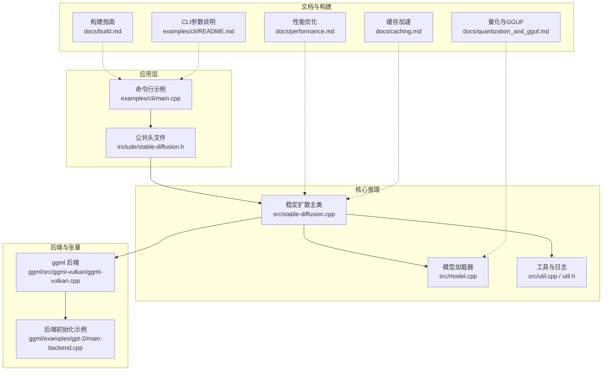
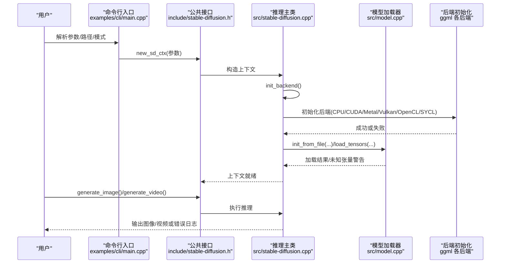
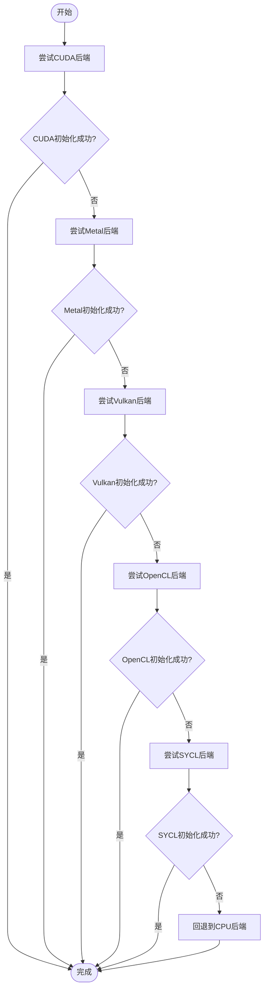
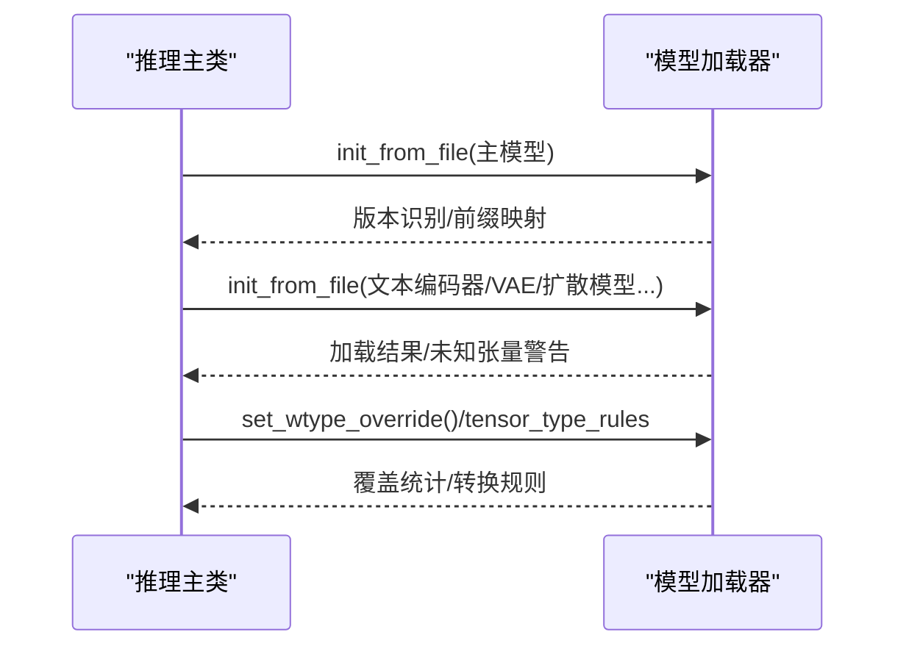
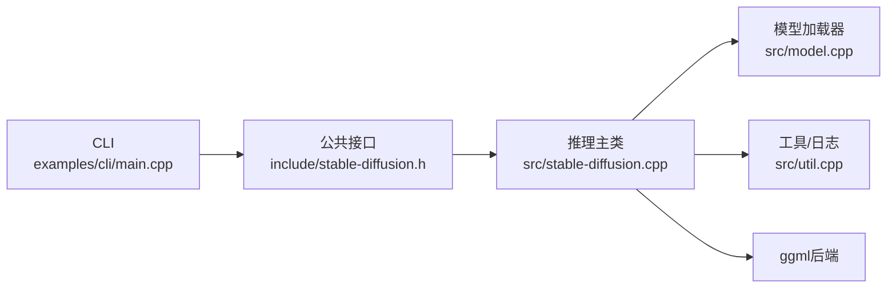

# 故障排除

<cite>
**本文引用的文件**
- [README.md](file://README.md)
- [docs/build.md](file://docs/build.md)
- [docs/performance.md](file://docs/performance.md)
- [docs/quantization_and_gguf.md](file://docs/quantization_and_gguf.md)
- [docs/caching.md](file://docs/caching.md)
- [examples/cli/README.md](file://examples/cli/README.md)
- [examples/cli/main.cpp](file://examples/cli/main.cpp)
- [include/stable-diffusion.h](file://include/stable-diffusion.h)
- [src/util.h](file://src/util.h)
- [src/util.cpp](file://src/util.cpp)
- [src/stable-diffusion.cpp](file://src/stable-diffusion.cpp)
- [src/model.cpp](file://src/model.cpp)
- [src/lora.hpp](file://src/lora.hpp)
- [ggml/src/ggml-vulkan/ggml-vulkan.cpp](file://ggml/src/ggml-vulkan/ggml-vulkan.cpp)
- [ggml/examples/gpt-2/main-backend.cpp](file://ggml/examples/gpt-2/main-backend.cpp)
</cite>

## 目录
1. [简介](#简介)
2. [项目结构](#项目结构)
3. [核心组件](#核心组件)
4. [架构总览](#架构总览)
5. [详细组件分析](#详细组件分析)
6. [依赖关系分析](#依赖关系分析)
7. [性能考量](#性能考量)
8. [故障排除指南](#故障排除指南)
9. [结论](#结论)
10. [附录](#附录)

## 简介
本指南面向使用 stable-diffusion.cpp 的用户与开发者，系统化地梳理安装失败、模型加载错误、性能问题与兼容性问题的排查流程与解决方案，并提供日志分析技巧、错误信息解读与定位方法。文档同时覆盖不同平台与硬件配置下的常见问题，帮助快速自助定位与修复。

## 项目结构
该项目采用模块化设计：核心推理逻辑位于 src，接口定义在 include，示例与命令行工具在 examples，构建与平台支持由 docs 提供参考，底层张量与后端由 ggml 子模块提供。

**图表来源**
- [examples/cli/main.cpp:1-200](file://examples/cli/main.cpp#L1-L200)
- [include/stable-diffusion.h:340-423](file://include/stable-diffusion.h#L340-L423)
- [src/stable-diffusion.cpp:103-268](file://src/stable-diffusion.cpp#L103-L268)
- [src/model.cpp:644-666](file://src/model.cpp#L644-L666)
- [src/util.cpp:396-461](file://src/util.cpp#L396-L461)
- [docs/build.md:1-174](file://docs/build.md#L1-L174)
- [docs/performance.md:1-26](file://docs/performance.md#L1-L26)
- [docs/caching.md:1-150](file://docs/caching.md#L1-L150)
- [docs/quantization_and_gguf.md:1-27](file://docs/quantization_and_gguf.md#L1-L27)
- [ggml/src/ggml-vulkan/ggml-vulkan.cpp:2634-2648](file://ggml/src/ggml-vulkan/ggml-vulkan.cpp#L2634-L2648)
- [ggml/examples/gpt-2/main-backend.cpp:202-232](file://ggml/examples/gpt-2/main-backend.cpp#L202-L232)

**章节来源**
- [README.md:1-202](file://README.md#L1-L202)
- [docs/build.md:1-174](file://docs/build.md#L1-L174)

## 核心组件
- 公共接口与参数：通过头文件定义上下文、采样、调度、缓存等参数结构体与回调，便于统一的日志、进度与预览输出。
- 推理主类：负责后端初始化、模型版本识别、组件装配（文本编码器、扩散模型、VAE、ControlNet、LoRA等）与运行时参数生效。
- 模型加载器：支持 ckpt/safetensors/diffusers/GGUF 等格式，按前缀映射与忽略规则加载权重。
- 工具与日志：统一的日志宏、系统信息采集、进度与预览回调注册。
- 后端与张量：基于 ggml 的多后端（CUDA/Metal/Vulkan/OpenCL/SYCL/CPU），并在失败时回退到 CPU。

**章节来源**
- [include/stable-diffusion.h:148-204](file://include/stable-diffusion.h#L148-L204)
- [src/stable-diffusion.cpp:103-268](file://src/stable-diffusion.cpp#L103-L268)
- [src/model.cpp:644-666](file://src/model.cpp#L644-L666)
- [src/util.cpp:396-461](file://src/util.cpp#L396-L461)

## 架构总览
下图展示从命令行到推理执行的关键调用链与错误易发点：

**图表来源**
- [examples/cli/main.cpp:103-162](file://examples/cli/main.cpp#L103-L162)
- [include/stable-diffusion.h:370-384](file://include/stable-diffusion.h#L370-L384)
- [src/stable-diffusion.cpp:171-226](file://src/stable-diffusion.cpp#L171-L226)
- [src/model.cpp:1602-1627](file://src/model.cpp#L1602-L1627)
- [ggml/examples/gpt-2/main-backend.cpp:202-232](file://ggml/examples/gpt-2/main-backend.cpp#L202-L232)

## 详细组件分析

### 组件A：后端初始化与回退机制
- 关键点：根据编译宏选择后端；若初始化失败则回退至 CPU。
- 常见问题：驱动未安装、设备不可用、环境变量不正确。
- 定位方法：查看日志中后端初始化信息与失败提示；检查环境变量（如 Vulkan 设备索引）。

**图表来源**
- [src/stable-diffusion.cpp:171-226](file://src/stable-diffusion.cpp#L171-L226)
- [ggml/examples/gpt-2/main-backend.cpp:202-232](file://ggml/examples/gpt-2/main-backend.cpp#L202-L232)

**章节来源**
- [src/stable-diffusion.cpp:171-226](file://src/stable-diffusion.cpp#L171-L226)
- [ggml/src/ggml-vulkan/ggml-vulkan.cpp:2634-2648](file://ggml/src/ggml-vulkan/ggml-vulkan.cpp#L2634-L2648)

### 组件B：模型加载与权重转换
- 关键点：支持多种格式；按前缀映射；可设置权重类型覆盖与规则；对未知张量发出警告。
- 常见问题：路径错误、权重缺失、名称映射不匹配、量化类型不兼容。
- 定位方法：关注“unknown tensor”警告；确认模型路径与前缀；必要时使用转换工具。

**图表来源**
- [src/stable-diffusion.cpp:257-352](file://src/stable-diffusion.cpp#L257-L352)
- [src/model.cpp:644-666](file://src/model.cpp#L644-L666)
- [src/model.cpp:1602-1627](file://src/model.cpp#L1602-L1627)

**章节来源**
- [src/stable-diffusion.cpp:257-352](file://src/stable-diffusion.cpp#L257-L352)
- [src/model.cpp:644-666](file://src/model.cpp#L644-L666)
- [src/model.cpp:1602-1627](file://src/model.cpp#L1602-L1627)

### 组件C：LoRA加载与应用时机
- 关键点：LoRA加载支持过滤器；自动/即时/运行时三种应用模式；量化权重下默认运行时应用以避免精度问题。
- 常见问题：LoRA文件路径错误、过滤条件导致张量为空、量化参数与应用时机冲突。
- 定位方法：检查 LoRA 加载日志；确认应用模式与量化状态；必要时手动指定应用模式。

**章节来源**
- [src/lora.hpp:39-76](file://src/lora.hpp#L39-L76)
- [src/stable-diffusion.cpp:380-401](file://src/stable-diffusion.cpp#L380-L401)

## 依赖关系分析
- 外部依赖：ggml 后端（CUDA/Metal/Vulkan/OpenCL/SYCL/CPU）。
- 内部耦合：推理主类依赖模型加载器与工具模块；CLI 通过公共接口与推理主类交互。
- 可能的环路：未发现直接循环依赖；各模块职责清晰。

**图表来源**
- [examples/cli/main.cpp:1-200](file://examples/cli/main.cpp#L1-L200)
- [include/stable-diffusion.h:340-423](file://include/stable-diffusion.h#L340-L423)
- [src/stable-diffusion.cpp:103-268](file://src/stable-diffusion.cpp#L103-L268)
- [src/model.cpp:644-666](file://src/model.cpp#L644-L666)
- [src/util.cpp:396-461](file://src/util.cpp#L396-L461)

**章节来源**
- [include/stable-diffusion.h:340-423](file://include/stable-diffusion.h#L340-L423)
- [src/stable-diffusion.cpp:103-268](file://src/stable-diffusion.cpp#L103-L268)

## 性能考量
- Flash Attention：可降低显存占用，部分后端（如 CUDA）同时提升速度；需注意与某些模型/掩码组合的兼容性。
- 权重卸载：将权重卸载到 CPU 可节省显存且不降速。
- 量化：提前量化与 GGUF 转换可减少加载时开销。
- 缓存：针对 DiT/UNet 的缓存策略可显著减少重复计算，需根据采样器与阈值调整。

**章节来源**
- [docs/performance.md:1-26](file://docs/performance.md#L1-L26)
- [docs/caching.md:1-150](file://docs/caching.md#L1-L150)
- [docs/quantization_and_gguf.md:1-27](file://docs/quantization_and_gguf.md#L1-L27)

## 故障排除指南

### 一、安装与构建失败
- 症状
  - 编译报错、找不到后端库、链接失败。
- 诊断步骤
  - 确认已递归克隆仓库并更新子模块。
  - 检查平台与后端依赖是否满足构建要求（CUDA/ROCm/Metal/Vulkan/OpenCL/SYCL）。
  - 使用官方构建指南逐项核对编译选项与环境变量。
- 解决方案
  - 按平台指南安装对应 SDK/驱动/工具链。
  - 使用 CMake 配置时开启所需后端宏，确保路径与工具链一致。
  - 若仅需 CPU 运行，使用 CPU-only 构建选项。

**章节来源**
- [docs/build.md:1-174](file://docs/build.md#L1-L174)

### 二、模型加载错误
- 症状
  - “init model loader from file failed”、“loading X from Y failed”、“unknown tensor”警告。
- 诊断步骤
  - 核对模型路径与前缀（如 text_encoders、vae、model.diffusion_model）。
  - 检查权重格式（ckpt/safetensors/GGUF/diffusers）与版本兼容性。
  - 关注“unknown tensor”日志，确认张量名映射与忽略列表。
- 解决方案
  - 使用转换工具将权重转为 GGUF 并进行量化，减少加载时转换开销。
  - 对于 diffusers 格式，确认子目录结构与文件命名。
  - 如存在非关键模块缺失（如 VAE/CLIP），程序会发出警告但可继续运行。

**章节来源**
- [src/stable-diffusion.cpp:259-280](file://src/stable-diffusion.cpp#L259-L280)
- [src/model.cpp:644-666](file://src/model.cpp#L644-L666)
- [src/model.cpp:1602-1627](file://src/model.cpp#L1602-L1627)
- [docs/quantization_and_gguf.md:19-27](file://docs/quantization_and_gguf.md#L19-L27)

### 三、性能问题
- 症状
  - 显存不足、生成缓慢、卡顿。
- 诊断步骤
  - 开启 Flash Attention 观察显存变化与日志提示。
  - 使用“--offload-to-cpu”减少显存占用。
  - 尝试量化与 GGUF 转换。
  - 针对 DiT/UNet 启用缓存策略并调整阈值与窗口。
- 解决方案
  - 在支持的后端上启用 Flash Attention。
  - 启用权重卸载与量化。
  - 选择合适的缓存模式与参数，平衡速度与质量。

**章节来源**
- [docs/performance.md:1-26](file://docs/performance.md#L1-L26)
- [docs/caching.md:1-150](file://docs/caching.md#L1-L150)
- [docs/quantization_and_gguf.md:1-27](file://docs/quantization_and_gguf.md#L1-L27)

### 四、兼容性问题
- 症状
  - 后端初始化失败、Vulkan 设备选择异常、Metal 在大矩阵上效率低。
- 诊断步骤
  - 查看后端初始化日志与失败提示。
  - Vulkan：检查设备索引环境变量与范围。
  - Metal：关注大矩阵效率问题。
- 解决方案
  - 按后端指南安装驱动与 SDK。
  - Vulkan：修正设备索引或不设置强制使用设备。
  - Metal：在支持场景下使用，否则回退 CPU 或其他后端。

**章节来源**
- [src/stable-diffusion.cpp:171-226](file://src/stable-diffusion.cpp#L171-L226)
- [ggml/src/ggml-vulkan/ggml-vulkan.cpp:2634-2648](file://ggml/src/ggml-vulkan/ggml-vulkan.cpp#L2634-L2648)

### 五、LoRA 应用问题
- 症状
  - LoRA 文件加载失败、应用时机导致精度或兼容性问题。
- 诊断步骤
  - 检查 LoRA 文件路径与过滤条件。
  - 关注自动/即时/运行时应用模式的切换。
- 解决方案
  - 在量化权重下优先使用运行时应用模式。
  - 手动指定 LoRA 应用模式以适配当前权重类型。

**章节来源**
- [src/lora.hpp:39-76](file://src/lora.hpp#L39-L76)
- [src/stable-diffusion.cpp:380-401](file://src/stable-diffusion.cpp#L380-L401)

### 六、日志分析与错误解读
- 日志级别与回调
  - 支持设置日志回调，统一输出 DEBUG/INFO/WARN/ERROR。
  - 可注册进度与预览回调，便于观察中间结果。
- 常见日志要点
  - 后端初始化：确认所选后端与回退路径。
  - 模型加载：关注“unknown tensor”与版本识别。
  - Flash Attention：确认启用与显存变化。
- 实用建议
  - 使用“--verbose”与颜色开关增强可读性。
  - 记录系统信息与参数字符串，便于复现与对比。

**章节来源**
- [src/util.cpp:396-461](file://src/util.cpp#L396-L461)
- [src/util.h:73-93](file://src/util.h#L73-L93)
- [examples/cli/README.md:1-151](file://examples/cli/README.md#L1-L151)

### 七、不同平台与硬件配置下的特定问题
- Linux
  - Vulkan：确保 SDK 安装与设备可用；检查设备索引。
  - CUDA：确认驱动与工具链版本匹配。
- macOS
  - Metal：注意大矩阵效率问题；必要时回退 CPU。
- Windows
  - Vulkan：遵循官方 SDK 安装与环境变量设置。
  - HIP/ROCm：按指南设置架构与工具链。
- Android/移动端
  - OpenCL：按文档准备 NDK、头文件与 ICD Loader。
  - 注意运行时库路径与权限。

**章节来源**
- [docs/build.md:72-157](file://docs/build.md#L72-L157)

### 八、CLI 参数与常见误用
- 必填参数缺失：输出路径、模式等。
- 参数冲突：预览模式与 TAESD 预览、Flash Attention 与特定模型掩码组合。
- 解决方法：对照 CLI 文档逐项校验，必要时分步添加参数验证。

**章节来源**
- [examples/cli/main.cpp:103-162](file://examples/cli/main.cpp#L103-L162)
- [examples/cli/README.md:1-151](file://examples/cli/README.md#L1-L151)

## 结论
通过系统化的日志分析、参数校验与后端回退机制，大多数安装、加载与性能问题均可快速定位与解决。建议在首次运行时开启详细日志与系统信息输出，结合构建与性能文档逐步优化配置，以获得最佳体验。

## 附录
- 快速检查清单
  - 构建：后端 SDK/驱动齐全，编译宏与工具链匹配。
  - 模型：路径正确、格式兼容、前缀映射无误。
  - 运行：后端初始化成功、Flash Attention与缓存按需启用、量化与GGUF转换完成。
  - 日志：开启详细日志，记录系统信息与参数字符串。