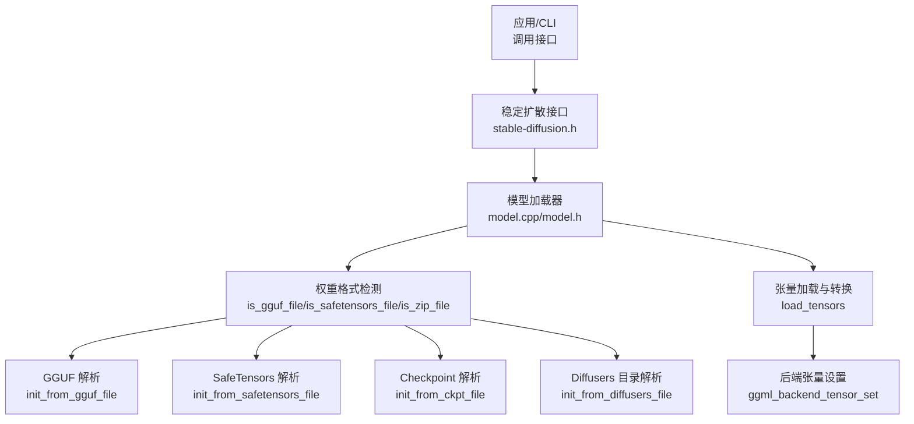
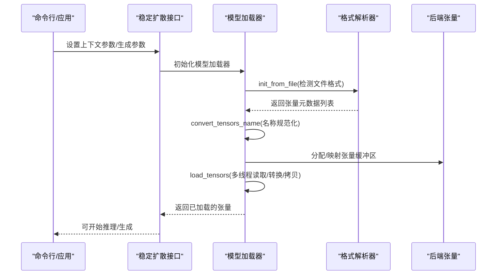
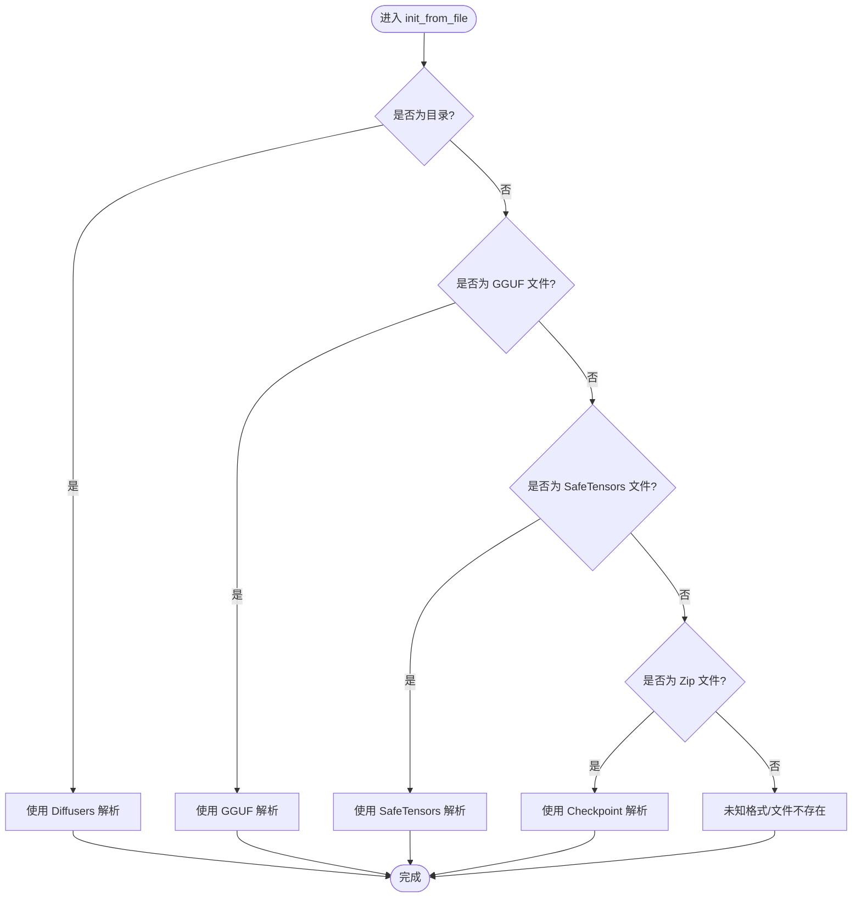
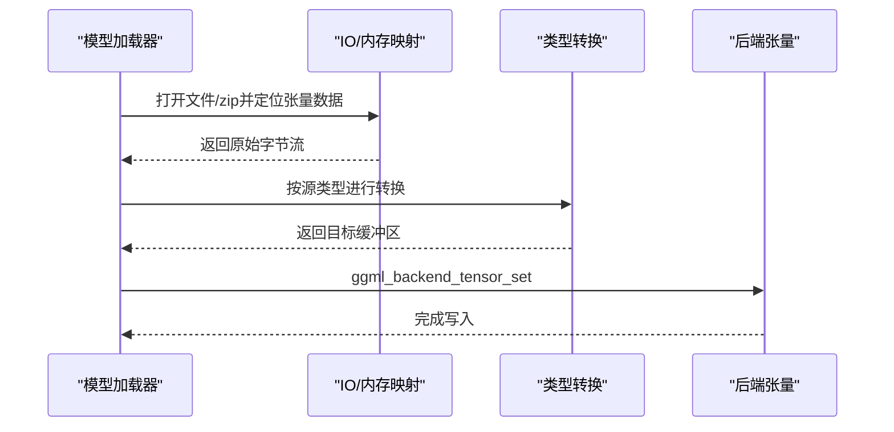
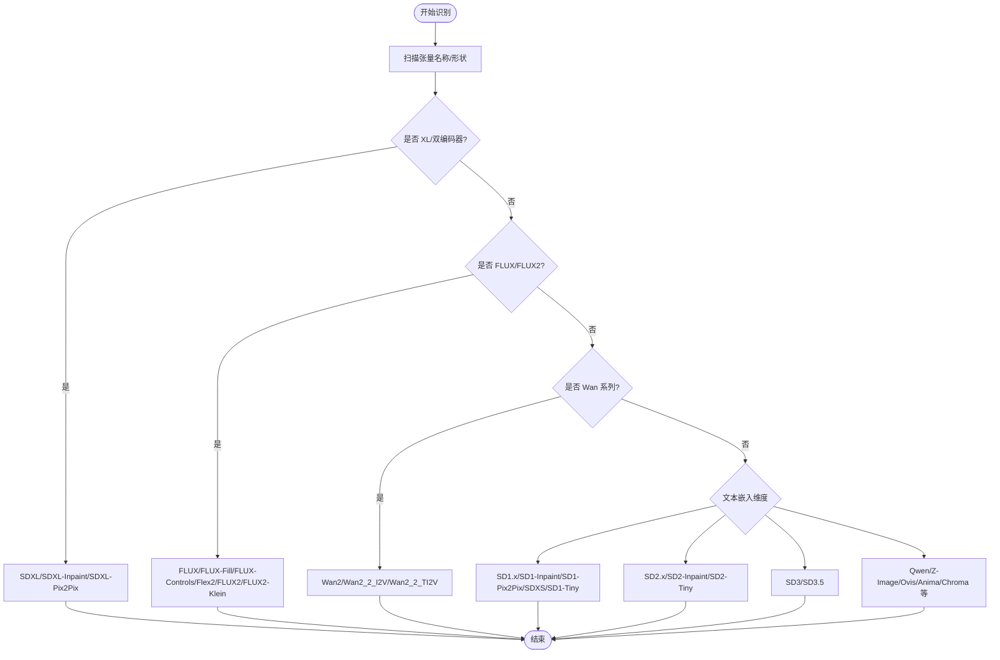
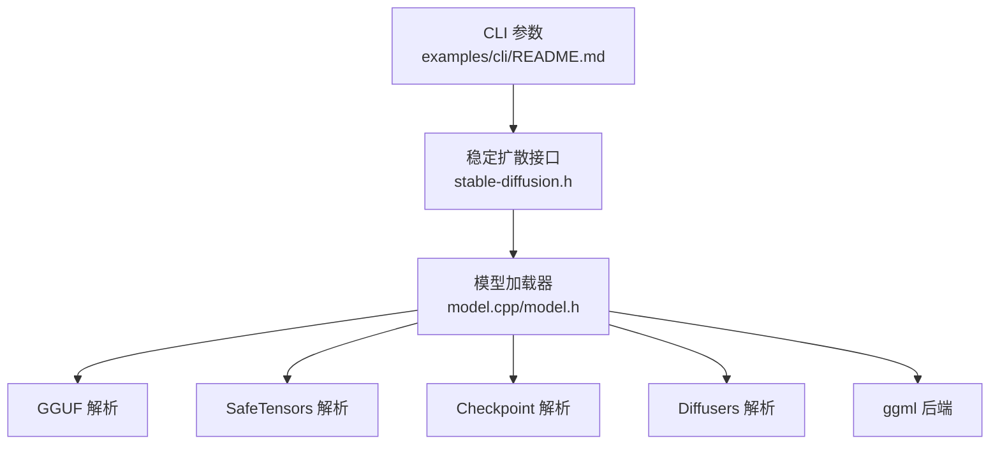

# 模型加载错误

<cite>
**本文引用的文件**
- [README.md](file://README.md)
- [model.h](file://src/model.h)
- [model.cpp](file://src/model.cpp)
- [stable-diffusion.h](file://include/stable-diffusion.h)
- [util.h](file://src/util.h)
- [util.cpp](file://src/util.cpp)
- [quantization_and_gguf.md](file://docs/quantization_and_gguf.md)
- [lora.md](file://docs/lora.md)
- [sd.md](file://docs/sd.md)
- [flux.md](file://docs/flux.md)
- [wan.md](file://docs/wan.md)
- [cli/README.md](file://examples/cli/README.md)
</cite>

## 目录
1. [简介](#简介)
2. [项目结构](#项目结构)
3. [核心组件](#核心组件)
4. [架构总览](#架构总览)
5. [详细组件分析](#详细组件分析)
6. [依赖关系分析](#依赖关系分析)
7. [性能考量](#性能考量)
8. [故障排除指南](#故障排除指南)
9. [结论](#结论)
10. [附录](#附录)

## 简介
本指南聚焦于“模型加载错误”的系统化排查与修复，覆盖以下方面：
- 常见加载问题：文件格式不支持、权重文件损坏、模型架构不匹配、LoRA 加载失败、路径错误等
- 不同模型类型（SD1.x、SDXL、FLUX、Wan 等）的特定加载错误与解决方案
- GGUF 转换与量化问题的诊断与修复
- 模型验证工具与调试技巧，帮助快速定位与解决问题

## 项目结构
该项目采用分层设计：
- 接口层：对外暴露稳定的 C 接口，定义采样参数、缓存策略、LoRA 应用模式等
- 模型加载层：统一抽象不同权重格式（ckpt/safetensors/GGUF/diffusers），解析张量元数据并按需转换
- 后端与推理层：基于 ggml 的多后端（CPU/CUDA/Vulkan/Metal/OpenCL/SYCL）执行推理

图表来源
- [stable-diffusion.h:148-204](file://include/stable-diffusion.h#L148-L204)
- [model.cpp:361-382](file://src/model.cpp#L361-L382)
- [model.cpp:411-477](file://src/model.cpp#L411-L477)
- [model.cpp:502-640](file://src/model.cpp#L502-L640)
- [model.cpp:993-1027](file://src/model.cpp#L993-L1027)
- [model.cpp:644-666](file://src/model.cpp#L644-L666)
- [model.cpp:1342-1599](file://src/model.cpp#L1342-L1599)

章节来源
- [README.md:39-101](file://README.md#L39-L101)
- [stable-diffusion.h:148-204](file://include/stable-diffusion.h#L148-L204)
- [model.h:292-343](file://src/model.h#L292-L343)
- [model.cpp:361-382](file://src/model.cpp#L361-L382)

## 核心组件
- 模型版本识别：通过扫描张量名称与形状特征自动识别 SD1.x/SDXL/SD3/FLUX/FLUX2/Wan/Qwen/Z-Image/Ovis 等版本
- 权重格式适配：统一入口 init_from_file 根据文件头/扩展名判断格式并调用对应解析器
- 张量加载与转换：按需进行类型转换（如 f8->f16、f64->f32、i64->i32）、内存映射、多线程并行读取与后端拷贝
- LoRA 应用模式：支持立即应用与运行时应用两种模式，自动根据量化情况选择更合适的模式

章节来源
- [model.h:23-174](file://src/model.h#L23-L174)
- [model.cpp:1029-1200](file://src/model.cpp#L1029-L1200)
- [model.cpp:361-382](file://src/model.cpp#L361-L382)
- [model.cpp:1342-1599](file://src/model.cpp#L1342-L1599)
- [lora.md:15-27](file://docs/lora.md#L15-L27)

## 架构总览
下图展示从命令行到模型加载与推理的关键流程：

图表来源
- [stable-diffusion.h:370-381](file://include/stable-diffusion.h#L370-L381)
- [model.cpp:361-382](file://src/model.cpp#L361-L382)
- [model.cpp:384-407](file://src/model.cpp#L384-L407)
- [model.cpp:1342-1599](file://src/model.cpp#L1342-L1599)

## 详细组件分析

### 组件A：模型加载器与格式检测
- init_from_file：根据目录/魔数/扩展名判断 GGUF、SafeTensors、Checkpoint 或 Diffusers 目录
- init_from_gguf_file：优先使用 gguf 上下文解析；若失败回退到 GGUFReader 并逐张量构建 TensorStorage
- init_from_safetensors_file：解析头部长度、JSON 头、偏移范围，校验维度与类型，处理 f8/f64/i64 特殊转换
- init_from_ckpt_file：解压 zip 中 data.pkl，解析 pickle 流，提取张量名称、形状与存储位置
- init_from_diffusers_file：按约定路径加载 unet/vae/clip 等子模块

图表来源
- [model.cpp:361-382](file://src/model.cpp#L361-L382)
- [model.cpp:411-477](file://src/model.cpp#L411-L477)
- [model.cpp:502-640](file://src/model.cpp#L502-L640)
- [model.cpp:993-1027](file://src/model.cpp#L993-L1027)
- [model.cpp:644-666](file://src/model.cpp#L644-L666)

章节来源
- [model.cpp:361-382](file://src/model.cpp#L361-L382)
- [model.cpp:411-477](file://src/model.cpp#L411-L477)
- [model.cpp:502-640](file://src/model.cpp#L502-L640)
- [model.cpp:993-1027](file://src/model.cpp#L993-L1027)
- [model.cpp:644-666](file://src/model.cpp#L644-L666)

### 组件B：张量加载与转换
- 多线程并行：按文件分组张量，根据是否 zip/内存映射决定线程数
- 类型转换：f8_e4m3/f8_e5m2->f16，f64->f32，i64->i32；必要时进行 ggml 量化/反量化
- 后端拷贝：非主机缓冲区直接写入后端张量
- 进度与日志：记录各阶段耗时，输出加载进度

图表来源
- [model.cpp:1342-1599](file://src/model.cpp#L1342-L1599)
- [model.cpp:232-281](file://src/model.cpp#L232-L281)
- [model.cpp:1526-1558](file://src/model.cpp#L1526-L1558)

章节来源
- [model.cpp:1342-1599](file://src/model.cpp#L1342-L1599)
- [model.cpp:232-281](file://src/model.cpp#L232-L281)

### 组件C：模型版本识别
- 依据关键张量名称与形状特征识别版本，如 SD1.x/SD2.x/SDXL、SD3、FLUX、FLUX2、Wan、Qwen、Z-Image、Ovis、Anima 等
- 输入/修复/像素到像素等分支通过输入块/中间块/输出块特征区分

图表来源
- [model.cpp:1029-1200](file://src/model.cpp#L1029-L1200)

章节来源
- [model.cpp:1029-1200](file://src/model.cpp#L1029-L1200)

### 组件D：LoRA 加载与应用
- 支持在 ckpt/safetensors/GGUF 中加载 LoRA，并通过提示词语法指定
- 自动/立即/运行时三种应用模式，自动根据量化参数选择更兼容的模式

章节来源
- [lora.md:1-27](file://docs/lora.md#L1-L27)
- [model.cpp:1342-1599](file://src/model.cpp#L1342-L1599)

## 依赖关系分析
- 模型加载器依赖 gguf/safetensors/zip 等解析能力，以及 ggml 后端进行张量分配与拷贝
- CLI 提供统一入口，支持多种模式（图像/视频/放大/转换），并通过参数控制加载行为

图表来源
- [cli/README.md:1-151](file://examples/cli/README.md#L1-L151)
- [stable-diffusion.h:370-381](file://include/stable-diffusion.h#L370-L381)
- [model.h:292-343](file://src/model.h#L292-L343)
- [model.cpp:361-382](file://src/model.cpp#L361-L382)

章节来源
- [cli/README.md:1-151](file://examples/cli/README.md#L1-L151)
- [stable-diffusion.h:370-381](file://include/stable-diffusion.h#L370-L381)
- [model.h:292-343](file://src/model.h#L292-L343)
- [model.cpp:361-382](file://src/model.cpp#L361-L382)

## 性能考量
- 内存映射：对非 zip 文件启用 mmap 可显著降低 I/O 开销
- 多线程：按文件内张量数量动态分配线程，提升加载吞吐
- 类型转换：尽量在加载时完成转换，避免推理时重复转换
- 量化：通过 --type 指定权重类型，减少推理时的转换成本

章节来源
- [model.cpp:1392-1405](file://src/model.cpp#L1392-L1405)
- [model.cpp:1526-1558](file://src/model.cpp#L1526-L1558)
- [quantization_and_gguf.md:1-27](file://docs/quantization_and_gguf.md#L1-L27)

## 故障排除指南

### 一、文件格式不支持
- 症状：日志显示“未知格式/文件未找到”
- 排查要点：
  - 确认文件扩展名或魔数是否被正确识别（GGUF、SafeTensors、Checkpoint、Diffusers）
  - 若为目录，确认包含约定子模块（unet/vae/text_encoder 等）
- 修复建议：
  - 使用官方转换工具将 ckpt/safetensors/diffusers 转为 GGUF
  - 对于 Diffusers 目录，确保子模块文件存在且命名符合约定

章节来源
- [model.cpp:361-382](file://src/model.cpp#L361-L382)
- [model.cpp:644-666](file://src/model.cpp#L644-L666)
- [quantization_and_gguf.md:19-27](file://docs/quantization_and_gguf.md#L19-L27)

### 二、权重文件损坏
- 症状：读取张量数据失败、类型转换异常、后端拷贝失败
- 排查要点：
  - SafeTensors：检查头部长度、JSON 解析、数据偏移范围
  - GGUF：检查魔数、张量偏移与数据区大小
  - Checkpoint：检查 zip 内 data.pkl 是否完整
- 修复建议：
  - 重新下载权重文件，确保完整性
  - 使用转换工具预转 GGUF，避免运行时转换

章节来源
- [model.cpp:502-640](file://src/model.cpp#L502-L640)
- [model.cpp:411-477](file://src/model.cpp#L411-L477)
- [model.cpp:993-1027](file://src/model.cpp#L993-L1027)

### 三、模型架构不匹配
- 症状：出现“未知张量”日志、推理崩溃或结果异常
- 排查要点：
  - 使用 get_sd_version 自动识别版本，核对输入/修复/像素到像素等分支
  - 对比当前模型与预期版本的张量名称前缀与形状
- 修复建议：
  - 确保使用的权重与推理代码版本一致
  - 针对不同模型类型（SD1.x/SDXL/FLUX/Wan 等）使用对应的参数与后端配置

章节来源
- [model.cpp:1029-1200](file://src/model.cpp#L1029-L1200)
- [sd.md:1-37](file://docs/sd.md#L1-L37)
- [flux.md:1-67](file://docs/flux.md#L1-L67)
- [wan.md:1-208](file://docs/wan.md#L1-L208)

### 四、GGUF 转换问题
- 症状：转换后无法加载、精度下降、显存占用异常
- 排查要点：
  - 检查转换命令与输出类型（--type）
  - 确认张量名称转换开关（--convert-name）
- 修复建议：
  - 使用官方示例命令进行转换
  - 优先使用预转换 GGUF，减少运行时开销

章节来源
- [quantization_and_gguf.md:1-27](file://docs/quantization_and_gguf.md#L1-L27)
- [cli/README.md:14-15](file://examples/cli/README.md#L14-L15)

### 五、LoRA 模型加载失败
- 症状：提示词中指定的 LoRA 未生效、报错找不到 LoRA 文件
- 排查要点：
  - 确认 LoRA 文件存在于指定目录（--lora-model-dir）
  - 确认提示词语法与权重命名一致（推荐使用 ComfyUI 兼容命名）
  - 检查 LoRA 应用模式（--lora-apply-mode），量化模型建议使用运行时应用
- 修复建议：
  - 将 LoRA 文件置于工作目录或明确指定目录
  - 使用兼容命名格式的 LoRA

章节来源
- [lora.md:1-27](file://docs/lora.md#L1-L27)
- [cli/README.md:40-76](file://examples/cli/README.md#L40-L76)

### 六、模型文件路径错误
- 症状：文件不存在、权限不足、路径拼接错误
- 排查要点：
  - 使用 util.h/util.cpp 中的路径辅助函数进行拼接与检查
  - 确认相对/绝对路径与当前工作目录一致
- 修复建议：
  - 明确指定绝对路径
  - 在脚本中先检查文件存在性再发起加载

章节来源
- [util.h:69-71](file://src/util.h#L69-L71)
- [util.cpp:84-96](file://src/util.cpp#L84-L96)
- [util.cpp:307-321](file://src/util.cpp#L307-L321)

### 七、内存与性能相关问题
- 症状：加载缓慢、内存占用过高、显存不足
- 排查要点：
  - 启用内存映射（--mmap）与多线程（--threads）
  - 选择合适权重类型（--type），必要时预转换 GGUF
  - 对大模型（如 Wan）考虑降采样或关闭部分模块
- 修复建议：
  - 使用 --mmap 与 --threads 提升加载效率
  - 选择更低精度或量化类型以降低显存占用

章节来源
- [model.cpp:1392-1405](file://src/model.cpp#L1392-L1405)
- [model.cpp:1526-1558](file://src/model.cpp#L1526-L1558)
- [quantization_and_gguf.md:1-27](file://docs/quantization_and_gguf.md#L1-L27)
- [wan.md:43-44](file://docs/wan.md#L43-L44)

### 八、不同模型类型的特定问题
- SD1.x/SDXL
  - 症状：输入块/中间块/输出块形状不匹配导致版本误判
  - 修复：确保使用正确的权重与参数组合
- FLUX/FLUX2
  - 症状：需要额外文本编码器与 VAE；LoRA 命名需兼容
  - 修复：按文档下载所需组件并使用兼容 LoRA
- Wan
  - 症状：VAE 需要大量显存；不同子模型（T2V/I2V/FLF2V/VACE）参数差异较大
  - 修复：优先使用预转换 GGUF，必要时启用 CPU offload

章节来源
- [sd.md:1-37](file://docs/sd.md#L1-L37)
- [flux.md:1-67](file://docs/flux.md#L1-L67)
- [wan.md:1-208](file://docs/wan.md#L1-L208)

## 结论
通过统一的模型加载器与格式检测机制，本项目能够兼容多种权重格式与模型类型。遇到加载错误时，应优先检查文件格式与完整性、路径与权限、版本识别与参数匹配，并结合量化与内存映射优化加载性能。针对不同模型类型，遵循官方文档与示例命令可有效规避常见问题。

## 附录
- 常用命令参考（来自 CLI 文档）
  - 图像生成：指定模型与提示词
  - 视频生成：指定扩散模型、高噪声扩散模型、VAE、文本编码器等
  - 转换：将 ckpt/safetensors/diffusers 转为 GGUF 并指定类型
- 日志与进度回调可用于定位加载阶段耗时与失败点

章节来源
- [cli/README.md:1-151](file://examples/cli/README.md#L1-L151)
- [quantization_and_gguf.md:19-27](file://docs/quantization_and_gguf.md#L19-L27)