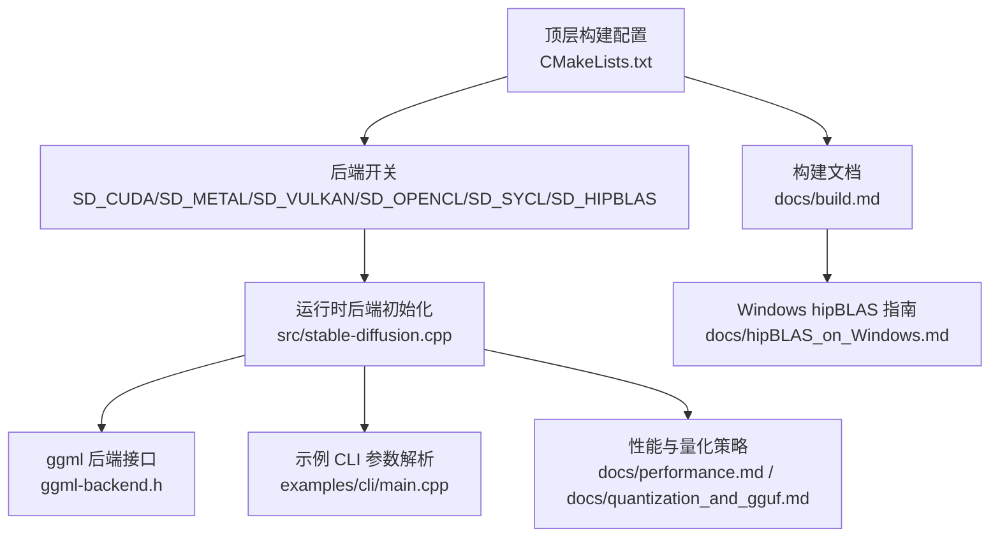
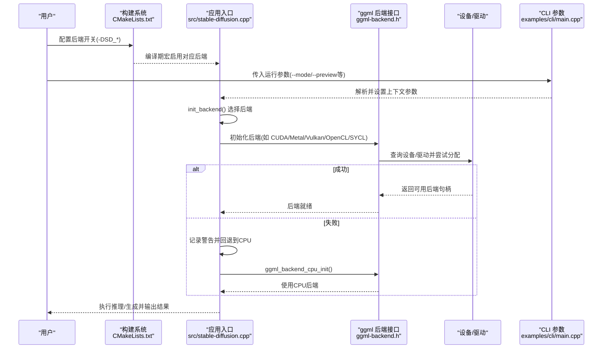
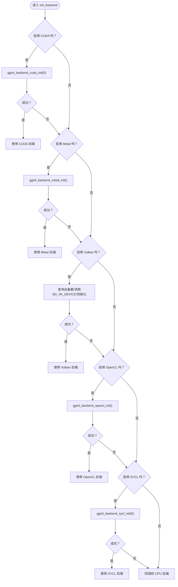
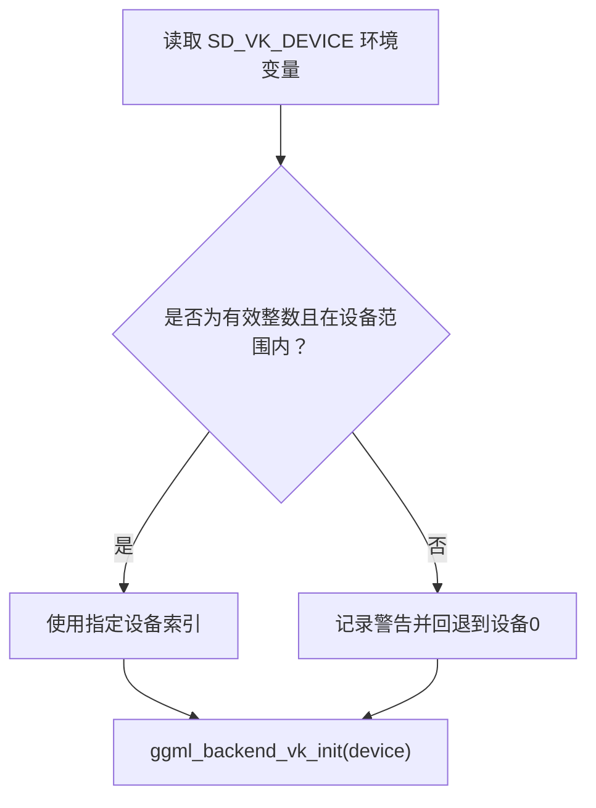
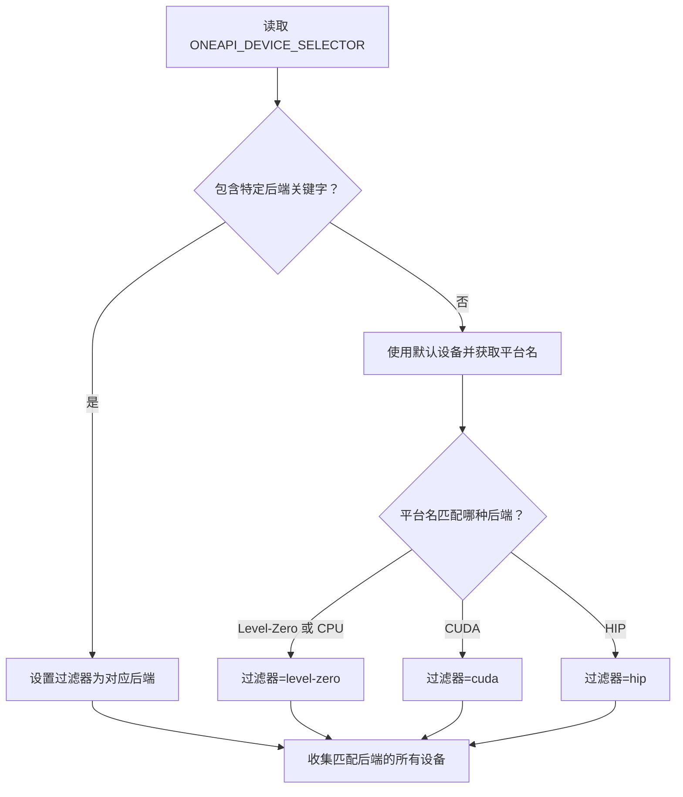
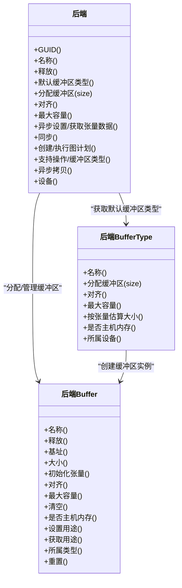
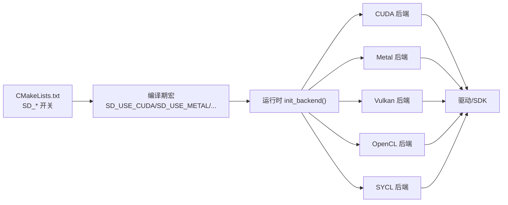

# 硬件后端问题

<cite>
**本文引用的文件**
- [src/stable-diffusion.cpp](file://src/stable-diffusion.cpp)
- [docs/build.md](file://docs/build.md)
- [docs/hipBLAS_on_Windows.md](file://docs/hipBLAS_on_Windows.md)
- [docs/performance.md](file://docs/performance.md)
- [docs/quantization_and_gguf.md](file://docs/quantization_and_gguf.md)
- [examples/cli/main.cpp](file://examples/cli/main.cpp)
- [ggml/include/ggml-backend.h](file://ggml/include/ggml-backend.h)
- [ggml/src/ggml-alloc.c](file://ggml/src/ggml-alloc.c)
- [ggml/src/ggml-vulkan/ggml-vulkan.cpp](file://ggml/src/ggml-vulkan/ggml-vulkan.cpp)
- [ggml/src/ggml-sycl/dpct/helper.hpp](file://ggml/src/ggml-sycl/dpct/helper.hpp)
- [CMakeLists.txt](file://CMakeLists.txt)
</cite>

## 目录
1. [简介](#简介)
2. [项目结构](#项目结构)
3. [核心组件](#核心组件)
4. [架构总览](#架构总览)
5. [详细组件分析](#详细组件分析)
6. [依赖关系分析](#依赖关系分析)
7. [性能考量](#性能考量)
8. [故障排除指南](#故障排除指南)
9. [结论](#结论)
10. [附录](#附录)

## 简介
本指南聚焦于硬件后端配置与运行时问题的系统化排查，覆盖 CUDA、Metal、Vulkan、OpenCL、SYCL 等后端在构建与运行阶段的常见问题与解决方案。内容基于仓库中的构建文档、源码实现与示例 CLI 参数，帮助用户快速定位驱动版本不兼容、内存分配失败、内核编译错误等问题，并提供针对不同 GPU 厂商（NVIDIA、AMD、Intel）的配置技巧与性能测试方法。

## 项目结构
- 构建选项集中在顶层 CMake 配置中，通过开关启用不同后端（CUDA、Metal、Vulkan、OpenCL、SYCL、HipBLAS/MUSA 等）。
- 运行时后端初始化逻辑位于主应用入口，按优先级选择后端并在失败时回退到 CPU。
- 文档提供了各后端的构建步骤与平台特定注意事项（如 Windows 上的 hipBLAS 指南）。
- 性能与量化文档提供了内存优化与模型转换建议。

**图表来源**
- [CMakeLists.txt](file://CMakeLists.txt)
- [src/stable-diffusion.cpp](file://src/stable-diffusion.cpp)
- [ggml/include/ggml-backend.h](file://ggml/include/ggml-backend.h)
- [examples/cli/main.cpp](file://examples/cli/main.cpp)
- [docs/build.md](file://docs/build.md)
- [docs/hipBLAS_on_Windows.md](file://docs/hipBLAS_on_Windows.md)
- [docs/performance.md](file://docs/performance.md)
- [docs/quantization_and_gguf.md](file://docs/quantization_and_gguf.md)

**章节来源**
- [CMakeLists.txt](file://CMakeLists.txt)
- [docs/build.md](file://docs/build.md)
- [docs/hipBLAS_on_Windows.md](file://docs/hipBLAS_on_Windows.md)
- [docs/performance.md](file://docs/performance.md)
- [docs/quantization_and_gguf.md](file://docs/quantization_and_gguf.md)
- [src/stable-diffusion.cpp](file://src/stable-diffusion.cpp)
- [examples/cli/main.cpp](file://examples/cli/main.cpp)

## 核心组件
- 后端初始化与回退：根据编译期宏与运行时环境变量选择后端；若所选后端不可用则回退至 CPU。
- 后端接口与缓冲区管理：通过 ggml 的后端抽象层进行设备查询、缓冲区分配与图计算执行。
- CLI 参数与日志：CLI 提供模式、预览、输出路径等参数，日志包含后端选择与警告信息，便于诊断。

关键实现位置
- 后端初始化与回退逻辑：[src/stable-diffusion.cpp](file://src/stable-diffusion.cpp)
- ggml 后端接口定义：[ggml/include/ggml-backend.h](file://ggml/include/ggml-backend.h)
- 缓冲区分配失败日志：[ggml/src/ggml-alloc.c](file://ggml/src/ggml-alloc.c)
- Vulkan 设备选择与驱动优先级：[ggml/src/ggml-vulkan/ggml-vulkan.cpp](file://ggml/src/ggml-vulkan/ggml-vulkan.cpp)
- SYCL 平台过滤与设备选择：[ggml/src/ggml-sycl/dpct/helper.hpp](file://ggml/src/ggml-sycl/dpct/helper.hpp)
- 构建与后端开关：[CMakeLists.txt](file://CMakeLists.txt)
- CLI 参数与帮助：[examples/cli/main.cpp](file://examples/cli/main.cpp)

**章节来源**
- [src/stable-diffusion.cpp](file://src/stable-diffusion.cpp)
- [ggml/include/ggml-backend.h](file://ggml/include/ggml-backend.h)
- [ggml/src/ggml-alloc.c](file://ggml/src/ggml-alloc.c)
- [ggml/src/ggml-vulkan/ggml-vulkan.cpp](file://ggml/src/ggml-vulkan/ggml-vulkan.cpp)
- [ggml/src/ggml-sycl/dpct/helper.hpp](file://ggml/src/ggml-sycl/dpct/helper.hpp)
- [CMakeLists.txt](file://CMakeLists.txt)
- [examples/cli/main.cpp](file://examples/cli/main.cpp)

## 架构总览
下图展示了从构建到运行时后端选择的整体流程，以及关键的错误点与回退机制。

**图表来源**
- [CMakeLists.txt](file://CMakeLists.txt)
- [src/stable-diffusion.cpp](file://src/stable-diffusion.cpp)
- [ggml/include/ggml-backend.h](file://ggml/include/ggml-backend.h)
- [examples/cli/main.cpp](file://examples/cli/main.cpp)

## 详细组件分析

### 后端初始化与回退机制
- CUDA/Metal/Vulkan/OpenCL/SYCL 在初始化时分别调用对应的 ggml 后端初始化函数；若初始化失败或未启用，则记录警告并回退到 CPU。
- Vulkan 支持通过环境变量选择具体设备索引，并对非法值进行容错处理。
- SYCL 通过环境变量选择平台后端（Level-Zero/OpenCL/CUDA/HIP），否则使用默认设备并自动推断首选平台。

**图表来源**
- [src/stable-diffusion.cpp](file://src/stable-diffusion.cpp)

**章节来源**
- [src/stable-diffusion.cpp](file://src/stable-diffusion.cpp)

### Vulkan 设备选择与驱动优先级
- 应用会读取环境变量以选择 Vulkan 设备索引，并对越界与非法输入进行容错。
- ggml Vulkan 实现内部对不同厂商驱动 ID 设置优先级，影响设备选择顺序。

**图表来源**
- [src/stable-diffusion.cpp](file://src/stable-diffusion.cpp)
- [ggml/src/ggml-vulkan/ggml-vulkan.cpp](file://ggml/src/ggml-vulkan/ggml-vulkan.cpp)

**章节来源**
- [src/stable-diffusion.cpp](file://src/stable-diffusion.cpp)
- [ggml/src/ggml-vulkan/ggml-vulkan.cpp](file://ggml/src/ggml-vulkan/ggml-vulkan.cpp)

### SYCL 平台过滤与设备选择
- SYCL 后端可通过环境变量限制平台类型（Level-Zero、OpenCL、CUDA、HIP），否则使用默认设备并自动识别平台名称。
- 该机制有助于在多后端环境中明确目标设备。

**图表来源**
- [ggml/src/ggml-sycl/dpct/helper.hpp](file://ggml/src/ggml-sycl/dpct/helper.hpp)

**章节来源**
- [ggml/src/ggml-sycl/dpct/helper.hpp](file://ggml/src/ggml-sycl/dpct/helper.hpp)

### ggml 后端接口与缓冲区分配
- 后端缓冲区类型与缓冲区对象提供统一的分配、对齐、最大容量与异步拷贝能力。
- 当缓冲区分配失败时，底层会输出错误日志，便于定位内存不足或设备不支持问题。

**图表来源**
- [ggml/include/ggml-backend.h](file://ggml/include/ggml-backend.h)

**章节来源**
- [ggml/include/ggml-backend.h](file://ggml/include/ggml-backend.h)
- [ggml/src/ggml-alloc.c](file://ggml/src/ggml-alloc.c)

## 依赖关系分析
- 构建期：通过 CMake 选项控制后端启用与否；不同后端需要相应工具链与 SDK（如 CUDA、ROCm、Vulkan SDK、oneAPI）。
- 运行期：应用根据编译期宏与运行时环境变量选择后端；后端依赖系统驱动与运行时库。

**图表来源**
- [CMakeLists.txt](file://CMakeLists.txt)
- [src/stable-diffusion.cpp](file://src/stable-diffusion.cpp)

**章节来源**
- [CMakeLists.txt](file://CMakeLists.txt)
- [src/stable-diffusion.cpp](file://src/stable-diffusion.cpp)

## 性能考量
- Flash Attention 可降低扩散模型的显存占用，部分后端（如 CUDA）同时提升速度；需在运行参数中开启并观察日志确认生效。
- 将权重卸载到 CPU 可节省显存而不影响生成速度。
- 量化可减少内存占用，建议在转换阶段完成量化以避免每次加载时的额外开销。

**章节来源**
- [docs/performance.md](file://docs/performance.md)
- [docs/quantization_and_gguf.md](file://docs/quantization_and_gguf.md)

## 故障排除指南

### 通用排查步骤
- 检查构建开关与工具链是否正确配置（见“构建与后端开关”）。
- 查看运行日志，确认后端初始化是否成功，失败时是否回退到 CPU。
- 若出现内存分配失败，结合量化与权重卸载策略优化内存使用。
- 对于 Vulkan，检查设备索引环境变量与驱动优先级设置。

**章节来源**
- [src/stable-diffusion.cpp](file://src/stable-diffusion.cpp)
- [ggml/src/ggml-alloc.c](file://ggml/src/ggml-alloc.c)
- [docs/performance.md](file://docs/performance.md)

### CUDA
- 症状：无法初始化后端、内核编译失败、显存不足。
- 排查要点：
  - 确认已安装匹配的 CUDA 工具链与驱动版本。
  - 检查显存是否满足模型需求（Flash Attention 可降低显存占用）。
  - 观察日志中是否提示 CUDA 后端初始化失败并回退到 CPU。
- 相关实现参考：
  - 后端初始化与回退：[src/stable-diffusion.cpp](file://src/stable-diffusion.cpp)
  - 构建开关与示例命令：[docs/build.md](file://docs/build.md)

**章节来源**
- [src/stable-diffusion.cpp](file://src/stable-diffusion.cpp)
- [docs/build.md](file://docs/build.md)

### Metal
- 症状：大矩阵运算效率低、初始化失败。
- 排查要点：
  - 确认 macOS/iOS 平台与系统版本满足 Metal 要求。
  - 注意当前实现对大矩阵运算效率较低，未来版本可能改进。
- 相关实现参考：
  - 后端初始化与回退：[src/stable-diffusion.cpp](file://src/stable-diffusion.cpp)

**章节来源**
- [src/stable-diffusion.cpp](file://src/stable-diffusion.cpp)
- [docs/build.md](file://docs/build.md)

### Vulkan
- 症状：设备选择错误、驱动优先级导致性能不佳、初始化失败。
- 排查要点：
  - 通过环境变量指定目标设备索引，避免越界与非法输入。
  - 检查驱动 ID 优先级设置，确保优先使用期望的驱动。
  - 若初始化失败，记录警告并回退到 CPU。
- 相关实现参考：
  - 设备选择与容错：[src/stable-diffusion.cpp](file://src/stable-diffusion.cpp)
  - 驱动优先级设置：[ggml/src/ggml-vulkan/ggml-vulkan.cpp](file://ggml/src/ggml-vulkan/ggml-vulkan.cpp)

**章节来源**
- [src/stable-diffusion.cpp](file://src/stable-diffusion.cpp)
- [ggml/src/ggml-vulkan/ggml-vulkan.cpp](file://ggml/src/ggml-vulkan/ggml-vulkan.cpp)

### OpenCL
- 症状：Adreno GPU 适配有限、初始化失败。
- 排查要点：
  - 确认目标平台（Android/Windows ARM）的 OpenCL 头文件与 ICD 加载库已正确配置。
  - 注意当前主要针对 Q4_0 类型优化。
- 相关实现参考：
  - 构建与平台特定步骤：[docs/build.md](file://docs/build.md)

**章节来源**
- [docs/build.md](file://docs/build.md)

### SYCL（Intel）
- 症状：平台选择错误、设备不可用、性能不如预期。
- 排查要点：
  - 通过环境变量限制平台后端（Level-Zero/OpenCL/CUDA/HIP），否则使用默认设备并自动识别平台。
  - 确保已安装并正确配置 Intel oneAPI 基础套件。
- 相关实现参考：
  - 平台过滤与设备选择：[ggml/src/ggml-sycl/dpct/helper.hpp](file://ggml/src/ggml-sycl/dpct/helper.hpp)
  - 构建与示例命令：[docs/build.md](file://docs/build.md)

**章节来源**
- [ggml/src/ggml-sycl/dpct/helper.hpp](file://ggml/src/ggml-sycl/dpct/helper.hpp)
- [docs/build.md](file://docs/build.md)

### HIP/ROCm（AMD）
- 症状：Windows 安装插件失败但 ROCm 已安装、编译器版本不匹配、设备架构不匹配。
- 排查要点：
  - Windows 平台安装 ROCm 后，VS 插件安装失败属常见现象，不影响构建与运行。
  - 确保 clang/clang++ 版本与 ROCm 匹配，并设置正确的 AMDGPU 目标架构。
  - Linux 平台可通过工具检测 GPU 架构并传递给构建系统。
- 相关实现参考：
  - Windows hipBLAS 指南与环境变量设置：[docs/hipBLAS_on_Windows.md](file://docs/hipBLAS_on_Windows.md)
  - 构建与 GPU 架构设置：[docs/build.md](file://docs/build.md)

**章节来源**
- [docs/hipBLAS_on_Windows.md](file://docs/hipBLAS_on_Windows.md)
- [docs/build.md](file://docs/build.md)

### 内存分配失败
- 症状：缓冲区分配失败、显存不足、OOM。
- 排查要点：
  - 使用量化与权重卸载策略减少显存占用。
  - 启用 Flash Attention 降低显存峰值。
  - 检查底层分配失败日志，确认是否因设备不支持或容量不足。
- 相关实现参考：
  - 分配失败日志输出：[ggml/src/ggml-alloc.c](file://ggml/src/ggml-alloc.c)
  - 性能与内存优化建议：[docs/performance.md](file://docs/performance.md)
  - 量化与 GGUF 转换：[docs/quantization_and_gguf.md](file://docs/quantization_and_gguf.md)

**章节来源**
- [ggml/src/ggml-alloc.c](file://ggml/src/ggml-alloc.c)
- [docs/performance.md](file://docs/performance.md)
- [docs/quantization_and_gguf.md](file://docs/quantization_and_gguf.md)

### 驱动版本不兼容
- 症状：后端初始化失败、设备不可用、运行异常。
- 排查要点：
  - 核对 CUDA/ROCm/Vulkan/oneAPI 驱动版本与工具链版本的兼容性。
  - 在 Vulkan 场景下检查驱动 ID 优先级，确保优先使用期望驱动。
- 相关实现参考：
  - Vulkan 驱动优先级设置：[ggml/src/ggml-vulkan/ggml-vulkan.cpp](file://ggml/src/ggml-vulkan/ggml-vulkan.cpp)
  - 构建与工具链要求：[docs/build.md](file://docs/build.md)

**章节来源**
- [ggml/src/ggml-vulkan/ggml-vulkan.cpp](file://ggml/src/ggml-vulkan/ggml-vulkan.cpp)
- [docs/build.md](file://docs/build.md)

### Windows 平台特殊问题（hipBLAS）
- 症状：VS 插件安装失败、编译器路径不正确、设备架构未设置。
- 排查要点：
  - 忽略 ROCm VS 插件安装错误（不影响构建与运行）。
  - 正确设置 ROCm 的 clang/clang++ 路径与环境变量。
  - 指定正确的 AMDGPU 目标架构（如 gfx1100）。
- 相关实现参考：
  - Windows hipBLAS 指南：[docs/hipBLAS_on_Windows.md](file://docs/hipBLAS_on_Windows.md)

**章节来源**
- [docs/hipBLAS_on_Windows.md](file://docs/hipBLAS_on_Windows.md)

### 后端性能测试与硬件兼容性检查清单
- 性能测试
  - 启用 Flash Attention 并观察日志确认生效，对比显存占用与速度变化。
  - 使用量化模型减少内存占用，避免每次加载时的量化开销。
- 兼容性检查
  - 确认驱动与工具链版本匹配（CUDA/ROCm/Vulkan/oneAPI）。
  - 在 Vulkan 下设置合适的设备索引与驱动优先级。
  - 在 SYCL 下通过环境变量限定平台后端。
  - Windows 平台确保 clang/clang++ 与 ROCm 版本一致，并设置 AMDGPU 目标架构。
- CLI 参数参考
  - 示例参数解析与帮助信息可用于验证运行参数是否正确传入。
- 相关实现参考：
  - 性能与量化策略：[docs/performance.md](file://docs/performance.md)
  - 量化与 GGUF 转换：[docs/quantization_and_gguf.md](file://docs/quantization_and_gguf.md)
  - CLI 参数解析：[examples/cli/main.cpp](file://examples/cli/main.cpp)

**章节来源**
- [docs/performance.md](file://docs/performance.md)
- [docs/quantization_and_gguf.md](file://docs/quantization_and_gguf.md)
- [examples/cli/main.cpp](file://examples/cli/main.cpp)

## 结论
通过理解构建期后端开关、运行时后端初始化与回退机制、以及各后端特有的平台与驱动要求，可以系统化地定位与解决硬件后端问题。结合性能优化策略（量化、Flash Attention、权重卸载）与兼容性检查清单，可在不同 GPU 厂商与平台上获得稳定可靠的运行体验。

## 附录

### 构建与后端开关
- CUDA/Metal/Vulkan/OpenCL/SYCL/HipBLAS/MUSA 的构建开关与示例命令参见构建文档与 CMake 配置。

**章节来源**
- [docs/build.md](file://docs/build.md)
- [CMakeLists.txt](file://CMakeLists.txt)