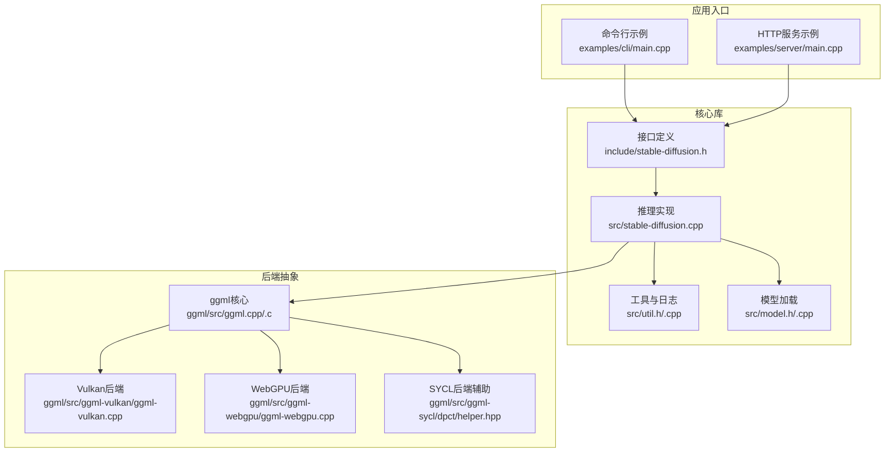
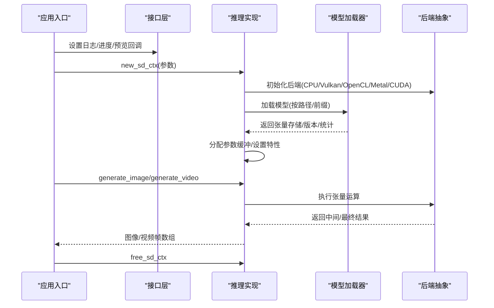
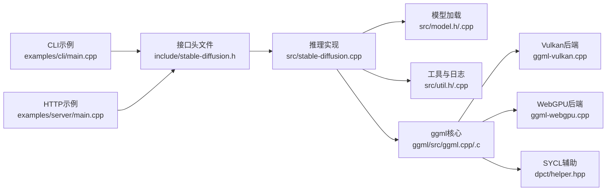

# 运行时错误

<cite>
**本文引用的文件**
- [stable-diffusion.cpp](file://src/stable-diffusion.cpp)
- [stable-diffusion.h](file://include/stable-diffusion.h)
- [util.h](file://src/util.h)
- [util.cpp](file://src/util.cpp)
- [model.h](file://src/model.h)
- [model.cpp](file://src/model.cpp)
- [main.cpp（命令行示例）](file://examples/cli/main.cpp)
- [main.cpp（服务器示例）](file://examples/server/main.cpp)
- [ggml.cpp](file://ggml/src/ggml.cpp)
- [ggml.c](file://ggml/src/ggml.c)
- [ggml-vulkan.cpp](file://ggml/src/ggml-vulkan/ggml-vulkan.cpp)
- [ggml-webgpu.cpp](file://ggml/src/ggml-webgpu/ggml-webgpu.cpp)
- [ggml-sycl/helper.hpp](file://ggml/src/ggml-sycl/dpct/helper.hpp)
</cite>

## 目录
1. [简介](#简介)
2. [项目结构](#项目结构)
3. [核心组件](#核心组件)
4. [架构总览](#架构总览)
5. [详细组件分析](#详细组件分析)
6. [依赖关系分析](#依赖关系分析)
7. [性能考量](#性能考量)
8. [故障排除指南](#故障排除指南)
9. [结论](#结论)
10. [附录](#附录)

## 简介
本指南聚焦于稳定扩散推理过程中的运行时错误与异常处理，覆盖崩溃、死锁、数据不一致等典型问题，并提供参数配置错误、输入数据格式问题、回调函数异常等常见运行时错误的排查路径。文档同时给出错误日志分析方法、调试工具使用技巧、内存泄漏检测建议，以及通过参数调整规避运行时异常的最佳实践。

## 项目结构
该项目采用模块化设计：核心推理逻辑封装在 C++ 类中，对外暴露 C 接口；模型加载与张量管理由独立模块负责；示例程序展示了 CLI 与 HTTP 服务两种运行形态；底层计算后端通过 ggml 抽象层统一调度。

图表来源
- [stable-diffusion.cpp:103-768](file://src/stable-diffusion.cpp#L103-L768)
- [stable-diffusion.h:338-423](file://include/stable-diffusion.h#L338-L423)
- [util.cpp:396-460](file://src/util.cpp#L396-L460)
- [model.cpp:361-477](file://src/model.cpp#L361-L477)
- [ggml.cpp:1-26](file://ggml/src/ggml.cpp#L1-L26)
- [ggml-vulkan.cpp:1598-1959](file://ggml/src/ggml-vulkan/ggml-vulkan.cpp#L1598-L1959)
- [ggml-webgpu.cpp:202-239](file://ggml/src/ggml-webgpu/ggml-webgpu.cpp#L202-L239)
- [ggml-sycl/helper.hpp:1293-1311](file://ggml/src/ggml-sycl/dpct/helper.hpp#L1293-L1311)

章节来源
- [stable-diffusion.cpp:103-768](file://src/stable-diffusion.cpp#L103-L768)
- [stable-diffusion.h:338-423](file://include/stable-diffusion.h#L338-L423)
- [util.cpp:396-460](file://src/util.cpp#L396-L460)
- [model.cpp:361-477](file://src/model.cpp#L361-L477)

## 核心组件
- 推理上下文与生命周期管理：初始化后端、加载模型、分配参数缓冲区、设置注意力与循环卷积等特性。
- 模型加载器：支持 GGUF、SafeTensors、Checkpoint、Diffusers 等格式，自动识别与转换张量名称，统计权重类型分布。
- 工具与日志：统一的日志回调、进度回调、预览回调，系统信息查询，文件与内存映射工具。
- 示例程序：CLI 与 HTTP 服务，演示参数解析、资源释放、错误处理与结果输出。

章节来源
- [stable-diffusion.cpp:171-226](file://src/stable-diffusion.cpp#L171-L226)
- [model.h:292-343](file://src/model.h#L292-L343)
- [model.cpp:361-477](file://src/model.cpp#L361-L477)
- [util.h:73-93](file://src/util.h#L73-L93)
- [util.cpp:396-460](file://src/util.cpp#L396-L460)
- [main.cpp（命令行示例）:505-520](file://examples/cli/main.cpp#L505-L520)
- [main.cpp（服务器示例）:294-310](file://examples/server/main.cpp#L294-L310)

## 架构总览
推理流程从应用入口开始，经由参数校验与回调注册，进入推理核心，最终返回图像或视频结果。异常通常出现在模型加载失败、后端初始化失败、张量尺寸不匹配、回调执行异常、资源释放不当等环节。

图表来源
- [stable-diffusion.cpp:238-768](file://src/stable-diffusion.cpp#L238-L768)
- [model.cpp:361-477](file://src/model.cpp#L361-L477)
- [ggml.cpp:1-26](file://ggml/src/ggml.cpp#L1-L26)

## 详细组件分析

### 组件A：推理上下文与后端初始化
- 关键点
  - 后端选择顺序：CUDA → Metal → Vulkan → OpenCL → SYCL → CPU，默认回退到 CPU。
  - 环境变量影响：如 Vulkan 设备索引解析失败会回退到设备 0 并记录警告。
  - 参数生效：线程数、随机数生成器类型、是否仅解码 VAE、是否离线参数等。
- 常见运行时问题
  - 后端初始化失败：检查环境变量与驱动状态，确认可用后端。
  - 参数冲突：如启用某些特性但后端不支持时需回退或禁用。
- 调试要点
  - 使用系统信息接口打印后端能力。
  - 开启详细日志定位初始化阶段的错误。

章节来源
- [stable-diffusion.cpp:171-226](file://src/stable-diffusion.cpp#L171-L226)
- [stable-diffusion.cpp:238-352](file://src/stable-diffusion.cpp#L238-L352)
- [util.cpp:461-480](file://src/util.cpp#L461-L480)

### 组件B：模型加载与张量管理
- 关键点
  - 支持多种格式：GGUF、SafeTensors、Checkpoint、Diffusers。
  - 自动转换张量名，忽略无用张量，统计权重类型分布。
  - 多线程加载与可选内存映射，提升加载效率。
- 常见运行时问题
  - 文件不存在或格式未知：记录警告并返回失败。
  - 张量尺寸/维度不匹配：加载阶段即报错，避免后续崩溃。
  - 不支持的数据类型：转换为兼容类型或报错。
- 调试要点
  - 查看权重类型统计，核对模型版本与网络结构。
  - 使用转换名功能验证张量命名一致性。

章节来源
- [model.cpp:361-477](file://src/model.cpp#L361-L477)
- [model.cpp:481-640](file://src/model.cpp#L481-L640)
- [model.cpp:1602-1627](file://src/model.cpp#L1602-L1627)
- [model.h:292-343](file://src/model.h#L292-L343)

### 组件C：回调与资源管理
- 关键点
  - 日志回调：统一格式化输出，包含文件与行号。
  - 进度与预览回调：用于可视化生成过程，需保证线程安全。
  - 资源释放：显式释放图像/掩码/控制帧等缓冲区。
- 常见运行时问题
  - 回调未注册导致空指针：确保在生成前设置回调。
  - 预览模式与步长不匹配：检查预览间隔与生成步数。
  - 内存泄漏：确保所有动态分配的缓冲区均被释放。
- 调试要点
  - 在回调中记录时间戳，评估性能瓶颈。
  - 使用内存分析工具检测未释放对象。

章节来源
- [util.cpp:396-460](file://src/util.cpp#L396-L460)
- [main.cpp（命令行示例）:505-520](file://examples/cli/main.cpp#L505-L520)
- [main.cpp（命令行示例）:552-572](file://examples/cli/main.cpp#L552-L572)
- [main.cpp（服务器示例）:294-310](file://examples/server/main.cpp#L294-L310)
- [main.cpp（服务器示例）:312-355](file://examples/server/main.cpp#L312-L355)

### 组件D：错误传播与异常处理
- 关键点
  - 全局未捕获异常：安装终止处理器，打印回溯并中止进程。
  - 平台回溯：在 Linux/Android 等平台打印符号化回溯。
  - 后端错误码：如 VirtGPU 的远程调用错误码映射。
- 常见运行时问题
  - 未捕获异常导致崩溃：启用回溯环境变量或使用调试器。
  - 后端调用超时/分发函数缺失：检查设备状态与驱动版本。
- 调试要点
  - 设置环境变量禁用回溯以对比行为。
  - 结合后端日志定位具体调用失败点。

章节来源
- [ggml.cpp:1-26](file://ggml/src/ggml.cpp#L1-L26)
- [ggml.c:66-117](file://ggml/src/ggml.c#L66-L117)
- [ggml-virtgpu/api_remoting.h:39-90](file://ggml/src/ggml-virtgpu/backend/shared/api_remoting.h#L39-L90)

## 依赖关系分析
- 推理实现依赖模型加载器与工具模块，向上通过接口头文件暴露给应用入口。
- 后端抽象层为多平台通用接口，不同后端实现细节隔离在各自源文件中。
- 示例程序作为外部消费者，负责参数解析、回调注册与资源释放。

图表来源
- [stable-diffusion.h:338-423](file://include/stable-diffusion.h#L338-L423)
- [stable-diffusion.cpp:103-768](file://src/stable-diffusion.cpp#L103-L768)
- [model.h:292-343](file://src/model.h#L292-L343)
- [util.h:73-93](file://src/util.h#L73-L93)
- [ggml.cpp:1-26](file://ggml/src/ggml.cpp#L1-L26)
- [ggml-vulkan.cpp:1598-1959](file://ggml/src/ggml-vulkan/ggml-vulkan.cpp#L1598-L1959)
- [ggml-webgpu.cpp:202-239](file://ggml/src/ggml-webgpu/ggml-webgpu.cpp#L202-L239)
- [ggml-sycl/helper.hpp:1293-1311](file://ggml/src/ggml-sycl/dpct/helper.hpp#L1293-L1311)
- [main.cpp（命令行示例）:505-520](file://examples/cli/main.cpp#L505-L520)
- [main.cpp（服务器示例）:294-310](file://examples/server/main.cpp#L294-L310)

## 性能考量
- 后端选择：优先使用 GPU 后端（CUDA/Metal/Vulkan/OpenCL/SYCL），CPU 仅作为兜底。
- 特性开关：Flash Attention、Conv2d 直通、循环卷积等可显著影响吞吐与显存占用。
- 线程与内存：合理设置线程数与内存映射策略，避免过度并发导致上下文切换开销。
- 预览与回调：预览频率过高会增加 I/O 压力，应根据需求调整间隔。

## 故障排除指南

### 一、崩溃与异常
- 症状
  - 进程异常退出，无明确错误信息。
- 可能原因
  - 未捕获异常导致终止。
  - 后端调用失败或超时。
- 排查步骤
  - 启用回溯：确保未设置禁用回溯的环境变量。
  - 观察日志：定位异常发生位置与调用栈。
  - 平台回溯：在支持平台上查看符号化回溯。
- 解决方案
  - 安装对应平台的回溯工具链。
  - 升级/降级后端驱动版本，确保兼容性。
  - 在回调中加入边界检查与异常捕获。

章节来源
- [ggml.cpp:1-26](file://ggml/src/ggml.cpp#L1-L26)
- [ggml.c:66-117](file://ggml/src/ggml.c#L66-L117)

### 二、死锁
- 症状
  - 程序卡住，无响应。
- 可能原因
  - 回调阻塞或等待自身持有的锁。
  - 多线程访问共享资源未加锁或锁顺序不当。
- 排查步骤
  - 使用调试器附加进程，查看线程堆栈。
  - 检查回调函数是否进行耗时操作或再次触发生成。
  - 核对互斥量与条件变量的使用。
- 解决方案
  - 将耗时操作移出回调，改为异步处理。
  - 统一锁顺序，避免嵌套锁。
  - 使用超时机制与健康检查。

### 三、数据不一致
- 症状
  - 生成结果不稳定，数值异常或图像质量差。
- 可能原因
  - 张量尺寸/维度不匹配。
  - 权重类型转换错误或不支持的类型。
  - 输入图像通道数与期望不符。
- 排查步骤
  - 对比模型版本与网络结构，核对权重类型统计。
  - 检查输入图像尺寸与通道数，必要时进行预处理。
  - 验证张量名转换前后的一致性。
- 解决方案
  - 使用正确的模型权重类型与转换规则。
  - 在生成前对输入进行裁剪、归一化与尺寸适配。

章节来源
- [model.cpp:481-640](file://src/model.cpp#L481-L640)
- [util.cpp:482-634](file://src/util.cpp#L482-L634)

### 四、参数配置错误
- 症状
  - 初始化失败、生成报错或结果异常。
- 常见问题
  - 后端设备索引无效：Vulkan 设备索引解析失败会回退到设备 0。
  - 线程数与硬件不匹配：过高的线程数可能引发竞争。
  - 随机数生成器类型不匹配：不同 RNG 行为差异较大。
- 排查步骤
  - 检查环境变量与后端能力。
  - 使用系统信息接口确认可用特性。
  - 逐步降低复杂度（禁用 Flash Attention、关闭循环卷积等）验证问题根因。
- 解决方案
  - 显式指定后端设备索引，确保有效范围。
  - 调整线程数至硬件核心数附近。
  - 选择与模型兼容的 RNG 类型。

章节来源
- [stable-diffusion.cpp:185-200](file://src/stable-diffusion.cpp#L185-L200)
- [stable-diffusion.cpp:238-352](file://src/stable-diffusion.cpp#L238-L352)
- [util.cpp:461-480](file://src/util.cpp#L461-L480)

### 五、输入数据格式问题
- 症状
  - 加载图像失败、尺寸不匹配、通道数错误。
- 可能原因
  - 图像路径不存在或非图像文件。
  - 控制图/掩码尺寸与目标尺寸不一致。
  - 颜色通道数不符合要求。
- 排查步骤
  - 使用文件存在性与目录判断函数确认路径。
  - 在加载后检查宽高与通道数，必要时进行缩放与通道转换。
  - 对掩码进行全白填充或按需裁剪。
- 解决方案
  - 提供标准尺寸与通道数的输入。
  - 在加载后统一尺寸与通道，避免运行时尺寸不匹配。

章节来源
- [util.cpp:84-172](file://src/util.cpp#L84-L172)
- [main.cpp（命令行示例）:574-640](file://examples/cli/main.cpp#L574-L640)
- [main.cpp（服务器示例）:693-737](file://examples/server/main.cpp#L693-L737)

### 六、回调函数异常
- 症状
  - 进度/预览回调崩溃或输出异常。
- 可能原因
  - 回调中访问了已释放的资源。
  - 回调内部进行阻塞操作。
- 排查步骤
  - 在回调中记录当前步数与帧数，定位异常点。
  - 检查回调数据指针有效性与生命周期。
- 解决方案
  - 将回调内的耗时操作移至后台线程。
  - 确保回调只读取不修改外部状态。

章节来源
- [util.cpp:396-460](file://src/util.cpp#L396-L460)
- [main.cpp（命令行示例）:341-352](file://examples/cli/main.cpp#L341-L352)
- [main.cpp（服务器示例）:525-556](file://examples/server/main.cpp#L525-L556)

### 七、错误日志分析方法
- 方法
  - 使用统一日志回调，包含文件名与行号。
  - 结合系统信息接口输出后端能力与编译选项。
  - 在关键路径插入日志，记录参数与中间状态。
- 工具
  - 使用调试器查看调用栈与变量值。
  - 在 CI 环境中收集日志并进行聚合分析。

章节来源
- [util.cpp:396-460](file://src/util.cpp#L396-L460)
- [util.cpp:461-480](file://src/util.cpp#L461-L480)

### 八、调试工具使用技巧
- 平台回溯
  - 在支持平台上启用回溯，获取符号化调用栈。
- 后端日志
  - Vulkan/WebGPU 后端提供内存分配/释放日志，便于定位泄漏。
- 辅助工具
  - SYCL 后端提供虚拟指针校验，异常时抛出运行时错误。
- 实践
  - 在开发阶段开启详细日志，发布阶段保留关键日志级别。

章节来源
- [ggml.c:66-117](file://ggml/src/ggml.c#L66-L117)
- [ggml-vulkan.cpp:1598-1959](file://ggml/src/ggml-vulkan/ggml-vulkan.cpp#L1598-L1959)
- [ggml-webgpu.cpp:202-239](file://ggml/src/ggml-webgpu/ggml-webgpu.cpp#L202-L239)
- [ggml-sycl/helper.hpp:1293-1311](file://ggml/src/ggml-sycl/dpct/helper.hpp#L1293-L1311)

### 九、内存泄漏检测
- 方法
  - 使用后端提供的内存日志记录分配与释放。
  - 在资源释放路径添加断言，确保释放次数与分配次数一致。
  - 对图像/掩码/控制帧等缓冲区进行成对释放。
- 建议
  - 在示例程序中参考资源释放模板，避免遗漏。
  - 对大对象使用智能指针或 RAII 包装。

章节来源
- [ggml-vulkan.cpp:1598-1959](file://ggml/src/ggml-vulkan/ggml-vulkan.cpp#L1598-L1959)
- [main.cpp（命令行示例）:552-572](file://examples/cli/main.cpp#L552-L572)
- [main.cpp（服务器示例）:272-282](file://examples/server/main.cpp#L272-L282)

### 十、常见错误代码与含义
- 后端远程调用错误码
  - 加载库错误码：如符号缺失、环境变量缺失、初始化失败等。
  - 转发错误码：如无分发函数、超时、基础索引错误等。
- 处理建议
  - 根据错误码映射定位具体失败原因。
  - 检查后端库版本与依赖完整性。

章节来源
- [ggml-virtgpu/api_remoting.h:39-90](file://ggml/src/ggml-virtgpu/backend/shared/api_remoting.h#L39-L90)

### 十一、通过参数调整避免运行时异常
- 后端选择
  - 明确指定设备索引，避免无效索引回退。
- 特性开关
  - Flash Attention 与特定模型组合可能存在兼容性问题，必要时禁用。
  - 循环卷积与注意力配合需谨慎，避免显存不足。
- 线程与内存
  - 合理设置线程数，避免与硬件核心数不匹配。
  - 使用内存映射与分块加载，缓解内存压力。

章节来源
- [stable-diffusion.cpp:185-200](file://src/stable-diffusion.cpp#L185-L200)
- [stable-diffusion.cpp:737-767](file://src/stable-diffusion.cpp#L737-L767)
- [model.cpp:361-477](file://src/model.cpp#L361-L477)

## 结论
通过规范的参数配置、严格的输入校验、完善的回调与资源管理，以及详尽的日志与回溯机制，可以有效降低稳定扩散推理过程中的运行时错误风险。遇到问题时，建议按“后端初始化 → 模型加载 → 参数校验 → 回调与资源 → 错误码与回溯”的顺序逐层排查，并结合后端日志与调试工具快速定位根因。

## 附录
- 关键接口与回调
  - 日志回调、进度回调、预览回调设置与使用。
  - 上下文创建与销毁、生成接口调用。
- 示例程序最佳实践
  - 参数解析与校验、资源释放模板、错误处理分支。

章节来源
- [stable-diffusion.h:340-368](file://include/stable-diffusion.h#L340-L368)
- [util.cpp:418-460](file://src/util.cpp#L418-L460)
- [main.cpp（命令行示例）:505-520](file://examples/cli/main.cpp#L505-L520)
- [main.cpp（服务器示例）:294-310](file://examples/server/main.cpp#L294-L310)