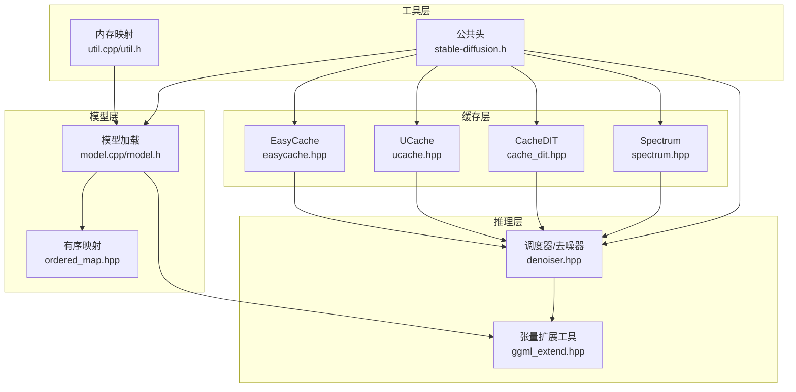
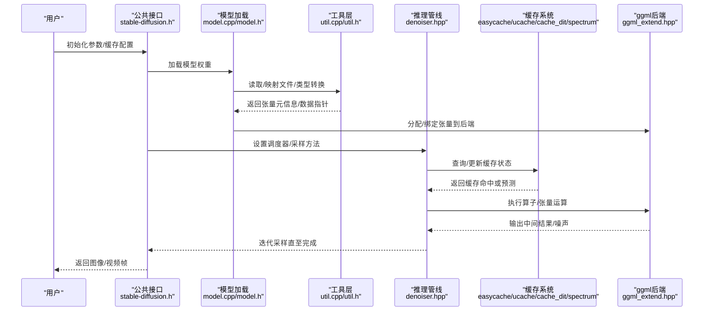
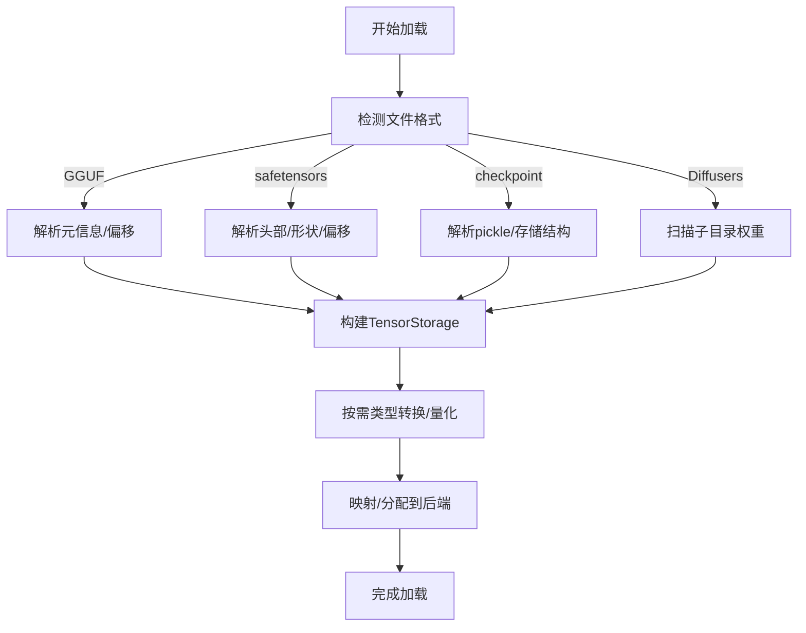
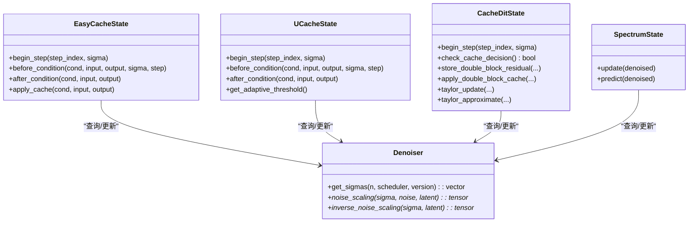
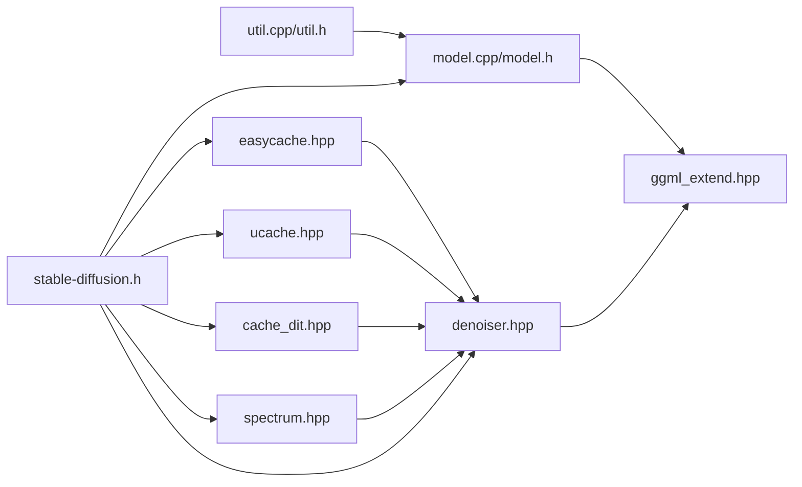

# 内存管理与缓存

<cite>
**本文引用的文件**
- [stable-diffusion.h](file://include/stable-diffusion.h)
- [model.h](file://src/model.h)
- [model.cpp](file://src/model.cpp)
- [util.h](file://src/util.h)
- [util.cpp](file://src/util.cpp)
- [ggml_extend.hpp](file://src/ggml_extend.hpp)
- [easycache.hpp](file://src/easycache.hpp)
- [ucache.hpp](file://src/ucache.hpp)
- [cache_dit.hpp](file://src/cache_dit.hpp)
- [spectrum.hpp](file://src/spectrum.hpp)
- [denoiser.hpp](file://src/denoiser.hpp)
- [ordered_map.hpp](file://src/ordered_map.hpp)
</cite>

## 目录
1. [简介](#简介)
2. [项目结构](#项目结构)
3. [核心组件](#核心组件)
4. [架构总览](#架构总览)
5. [详细组件分析](#详细组件分析)
6. [依赖关系分析](#依赖关系分析)
7. [性能考量](#性能考量)
8. [故障排查指南](#故障排查指南)
9. [结论](#结论)
10. [附录](#附录)

## 简介
本文件面向稳定扩散.cpp的内存管理与缓存系统，系统性阐述以下主题：
- 内存分配策略：基于ggml的张量生命周期与后端内存管理
- 缓冲区管理：张量数据读取、类型转换与跨后端传输
- 垃圾回收机制：自动释放与显式资源回收
- 多级缓存架构：参数缓存、中间结果缓存与模型权重缓存
- 内存池与碎片整理：通过后端与上下文管理减少碎片
- 缓存失效策略：阈值驱动、自适应与预测型缓存
- 智能预取：基于历史趋势的预测缓存
- 内存使用监控与性能统计：日志与指标输出
- 调优指南：配置项、大模型策略与低内存运行方案

## 项目结构
稳定扩散.cpp采用模块化设计，核心围绕“模型加载与权重管理”、“推理管线（采样）”、“缓存系统”三大块展开。内存与缓存相关的关键位置如下：
- 模型层：模型加载、权重元信息、类型转换与后端绑定
- 推理层：调度器、去噪器、采样方法与张量操作
- 缓存层：多种缓存策略（EasyCache、UCache、CacheDIT、Spectrum）
- 工具层：内存映射、日志、张量工具函数

**图表来源**
- [model.cpp](file://src/model.cpp)
- [model.h](file://src/model.h)
- [denoiser.hpp](file://src/denoiser.hpp)
- [ggml_extend.hpp](file://src/ggml_extend.hpp)
- [easycache.hpp](file://src/easycache.hpp)
- [ucache.hpp](file://src/ucache.hpp)
- [cache_dit.hpp](file://src/cache_dit.hpp)
- [spectrum.hpp](file://src/spectrum.hpp)
- [util.cpp](file://src/util.cpp)
- [util.h](file://src/util.h)
- [stable-diffusion.h](file://include/stable-diffusion.h)

**章节来源**
- [stable-diffusion.h](file://include/stable-diffusion.h)
- [model.h](file://src/model.h)
- [model.cpp](file://src/model.cpp)
- [util.h](file://src/util.h)
- [util.cpp](file://src/util.cpp)
- [ggml_extend.hpp](file://src/ggml_extend.hpp)
- [easycache.hpp](file://src/easycache.hpp)
- [ucache.hpp](file://src/ucache.hpp)
- [cache_dit.hpp](file://src/cache_dit.hpp)
- [spectrum.hpp](file://src/spectrum.hpp)
- [denoiser.hpp](file://src/denoiser.hpp)
- [ordered_map.hpp](file://src/ordered_map.hpp)

## 核心组件
- 模型加载与权重管理
  - 维护张量元信息（形状、类型、偏移等），支持从不同格式（GGUF、safetensors、checkpoint、Diffusers）加载
  - 提供权重类型转换与按需量化，降低内存占用
- 张量与后端
  - 通过ggml扩展工具进行张量复制、视图、切片、拼接等操作
  - 支持CPU/GPU后端（CUDA/Metal/Vulkan/OpenCL/SYCL）的张量传输与计算
- 缓存系统
  - EasyCache：基于输入变化率的简单阈值缓存
  - UCache：自适应阈值、误差累积与EMA的高级缓存
  - CacheDIT：分块缓存（双端/单端）、残差差异阈值、Taylor近似
  - Spectrum：基于Chebyshev/Taylor的历史趋势预测缓存
- 调度与采样
  - 多种sigma调度器与采样方法，配合去噪器完成迭代采样

**章节来源**
- [model.h](file://src/model.h)
- [model.cpp](file://src/model.cpp)
- [ggml_extend.hpp](file://src/ggml_extend.hpp)
- [easycache.hpp](file://src/easycache.hpp)
- [ucache.hpp](file://src/ucache.hpp)
- [cache_dit.hpp](file://src/cache_dit.hpp)
- [spectrum.hpp](file://src/spectrum.hpp)
- [denoiser.hpp](file://src/denoiser.hpp)

## 架构总览
下图展示从模型加载到推理采样的内存与缓存交互路径。

**图表来源**
- [stable-diffusion.h](file://include/stable-diffusion.h)
- [model.cpp](file://src/model.cpp)
- [model.h](file://src/model.h)
- [util.cpp](file://src/util.cpp)
- [util.h](file://src/util.h)
- [denoiser.hpp](file://src/denoiser.hpp)
- [easycache.hpp](file://src/easycache.hpp)
- [ucache.hpp](file://src/ucache.hpp)
- [cache_dit.hpp](file://src/cache_dit.hpp)
- [spectrum.hpp](file://src/spectrum.hpp)
- [ggml_extend.hpp](file://src/ggml_extend.hpp)

## 详细组件分析

### 模型加载与内存布局
- 张量元信息存储
  - TensorStorage记录张量名称、类型、维度、文件索引与偏移，支持从压缩包中分块读取
  - 提供反向维度调整、张量切分与大小计算
- 权重加载与类型转换
  - 支持GGUF、safetensors、checkpoint与Diffusers目录格式
  - 自动识别并转换浮点/整数/半精度/8位浮点等类型，必要时进行量化/反量化
- 内存映射与零拷贝
  - MmapWrapper在不同平台提供内存映射封装，避免重复拷贝
- 参数统计与内存估算
  - 提供按后端类型统计参数内存占用，辅助容量规划

**图表来源**
- [model.cpp](file://src/model.cpp)
- [model.h](file://src/model.h)
- [util.cpp](file://src/util.cpp)
- [util.h](file://src/util.h)

**章节来源**
- [model.h](file://src/model.h)
- [model.cpp](file://src/model.cpp)
- [util.h](file://src/util.h)
- [util.cpp](file://src/util.cpp)

### 张量扩展与后端内存管理
- 张量工具
  - 复制、视图、切片、拼接、permute、chunk等常用操作
  - 针对不同后端的张量访问与写入封装
- 后端选择与初始化
  - 支持CUDA/Metal/Vulkan/OpenCL/SYCL后端，按编译宏启用
  - 不同后端可独立初始化，便于参数卸载到CPU以节省显存
- 内存对齐与对齐工具
  - 提供对齐计算工具，减少跨后端传输开销

**章节来源**
- [ggml_extend.hpp](file://src/ggml_extend.hpp)
- [stable-diffusion.h](file://include/stable-diffusion.h)

### 缓存系统概览
- EasyCache
  - 基于输入变化率与输出变化率的阈值缓存，适合快速跳过相似步骤
- UCache
  - 引入误差累积与EMA估计，支持动态阈值与自适应策略
- CacheDIT
  - 面向DIT类模型的分块缓存，支持双端/单端块与Taylor近似
  - 基于残差差异阈值决定是否缓存，支持计算掩码与连续缓存限制
- Spectrum
  - 基于历史趋势的预测缓存，结合Chebyshev与Taylor预测融合

**图表来源**
- [easycache.hpp](file://src/easycache.hpp)
- [ucache.hpp](file://src/ucache.hpp)
- [cache_dit.hpp](file://src/cache_dit.hpp)
- [spectrum.hpp](file://src/spectrum.hpp)
- [denoiser.hpp](file://src/denoiser.hpp)

**章节来源**
- [easycache.hpp](file://src/easycache.hpp)
- [ucache.hpp](file://src/ucache.hpp)
- [cache_dit.hpp](file://src/cache_dit.hpp)
- [spectrum.hpp](file://src/spectrum.hpp)
- [denoiser.hpp](file://src/denoiser.hpp)

### EasyCache：阈值驱动缓存
- 关键机制
  - 计算当前输入与上一步输入的平均变化，估计输出变化率
  - 若变化率低于阈值，则跳过计算并应用缓存差分
- 适用场景
  - 步骤间输入变化较小的区域，显著减少重复计算

**章节来源**
- [easycache.hpp](file://src/easycache.hpp)

### UCache：自适应阈值与误差累积
- 关键机制
  - 使用EMA估计输出变化，动态调整阈值
  - 累积误差用于避免长期外推导致的偏差
  - 支持早期/晚期步数的阈值缩放
- 适用场景
  - 对稳定性要求更高的推理过程，平衡速度与质量

**章节来源**
- [ucache.hpp](file://src/ucache.hpp)

### CacheDIT：分块与Taylor近似
- 关键机制
  - 将模型按块划分，分别缓存残差与前一输出
  - 双端块（Fn/Bn）与中间块（Mn）分别缓存策略不同
  - 基于残差差异阈值判断是否缓存
  - Taylor近似在特定步长间隔进行预测，减少计算
- 适用场景
  - 大模型（如DiT类）的高效推理，显著降低显存与计算压力

**章节来源**
- [cache_dit.hpp](file://src/cache_dit.hpp)

### Spectrum：历史趋势预测缓存
- 关键机制
  - 维护历史张量序列与时间标记，使用Cholesky分解求解回归
  - 结合Chebyshev与Taylor预测，融合加权输出
  - 动态窗口大小与停止条件，避免过度预测
- 适用场景
  - 需要长期趋势预测的推理阶段，提升缓存命中率

**章节来源**
- [spectrum.hpp](file://src/spectrum.hpp)

### 调度器与采样流程
- 多种sigma调度器（离散、Karras、指数、Align-Your-Steps、LCM等）
- 去噪器定义噪声缩放与逆变换，配合采样方法执行迭代
- 通过公共接口参数控制采样步数、调度器类型与预测类型

**章节来源**
- [denoiser.hpp](file://src/denoiser.hpp)
- [stable-diffusion.h](file://include/stable-diffusion.h)

## 依赖关系分析
- 模块耦合
  - 模型层与工具层耦合较低，通过公共接口与张量抽象连接
  - 缓存系统依赖去噪器提供的sigma与步骤信息
  - 推理层与缓存系统通过回调/钩子交互
- 外部依赖
  - ggml及其后端库（CUDA/Metal/Vulkan/OpenCL/SYCL）
  - 第三方JSON解析库（safetensors）
  - 平台内存映射API（Windows/Unix）

**图表来源**
- [model.cpp](file://src/model.cpp)
- [model.h](file://src/model.h)
- [util.cpp](file://src/util.cpp)
- [util.h](file://src/util.h)
- [ggml_extend.hpp](file://src/ggml_extend.hpp)
- [denoiser.hpp](file://src/denoiser.hpp)
- [easycache.hpp](file://src/easycache.hpp)
- [ucache.hpp](file://src/ucache.hpp)
- [cache_dit.hpp](file://src/cache_dit.hpp)
- [spectrum.hpp](file://src/spectrum.hpp)
- [stable-diffusion.h](file://include/stable-diffusion.h)

**章节来源**
- [model.cpp](file://src/model.cpp)
- [model.h](file://src/model.h)
- [util.cpp](file://src/util.cpp)
- [util.h](file://src/util.h)
- [ggml_extend.hpp](file://src/ggml_extend.hpp)
- [denoiser.hpp](file://src/denoiser.hpp)
- [easycache.hpp](file://src/easycache.hpp)
- [ucache.hpp](file://src/ucache.hpp)
- [cache_dit.hpp](file://src/cache_dit.hpp)
- [spectrum.hpp](file://src/spectrum.hpp)
- [stable-diffusion.h](file://include/stable-diffusion.h)

## 性能考量
- 内存占用优化
  - 优先使用量化类型（如F16/F32到量化）与按需类型转换
  - 利用后端卸载参数至CPU，减少显存峰值
  - 启用内存映射，避免重复拷贝
- 计算效率优化
  - 在易变小区域使用EasyCache，在稳定区域使用UCache/CacheDIT
  - Spectrum适合长序列趋势预测，减少重复计算
- 调度与采样
  - 选择合适的调度器与采样方法，平衡速度与质量
  - 控制采样步数与预测类型，避免过度迭代

[本节为通用指导，无需引用具体文件]

## 故障排查指南
- 常见问题与定位
  - 权重加载失败：检查文件格式识别与头部解析
  - 类型转换异常：确认源/目标类型支持与量化表可用
  - 缓存不生效：检查阈值设置、步骤范围与锚定条件
  - 显存不足：启用参数卸载、减小批大小或切换更轻量的缓存策略
- 日志与诊断
  - 使用公共接口设置日志回调，输出调试/错误级别信息
  - 通过缓存状态输出查看命中率与累计误差

**章节来源**
- [stable-diffusion.h](file://include/stable-diffusion.h)
- [util.cpp](file://src/util.cpp)
- [easycache.hpp](file://src/easycache.hpp)
- [ucache.hpp](file://src/ucache.hpp)
- [cache_dit.hpp](file://src/cache_dit.hpp)
- [spectrum.hpp](file://src/spectrum.hpp)

## 结论
稳定扩散.cpp的内存管理与缓存体系以ggml为核心，结合多后端与丰富的缓存策略，实现了在不同硬件与任务规模下的高效运行。通过参数缓存、中间结果缓存与预测型缓存的协同，系统在保证质量的同时显著降低了计算与内存压力。针对大模型与低内存环境，建议优先采用量化、参数卸载与分块缓存策略，并根据任务特性选择合适的缓存与调度器组合。

[本节为总结，无需引用具体文件]

## 附录

### 内存配置调优要点
- 参数与后端
  - 启用参数卸载到CPU，减少显存峰值
  - 选择合适后端（CUDA/Metal/Vulkan等），确保驱动版本匹配
- 缓存策略
  - EasyCache：适用于快速跳过相似步骤，阈值适中
  - UCache：自适应阈值与误差累积，适合稳定性要求高的场景
  - CacheDIT：分块缓存与Taylor近似，适合大模型
  - Spectrum：历史趋势预测，适合长序列
- 采样与调度
  - 控制采样步数与调度器类型，避免过度迭代
  - 根据任务特性选择预测类型（eps/v/pred等）

**章节来源**
- [stable-diffusion.h](file://include/stable-diffusion.h)
- [easycache.hpp](file://src/easycache.hpp)
- [ucache.hpp](file://src/ucache.hpp)
- [cache_dit.hpp](file://src/cache_dit.hpp)
- [spectrum.hpp](file://src/spectrum.hpp)
- [denoiser.hpp](file://src/denoiser.hpp)