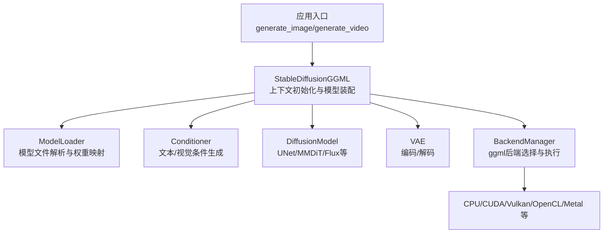
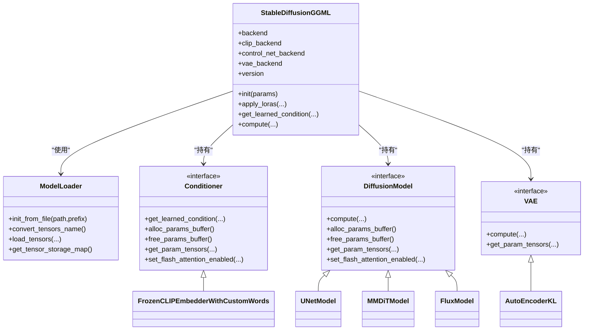
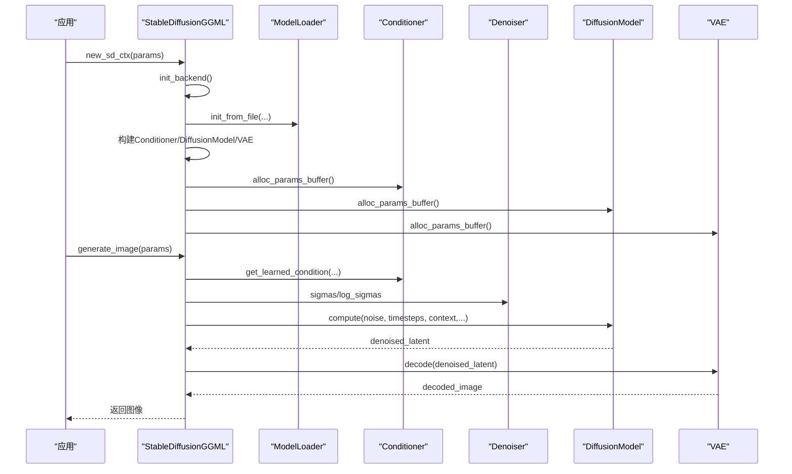
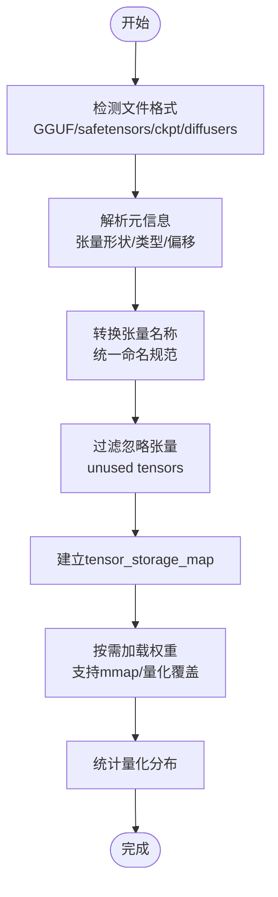
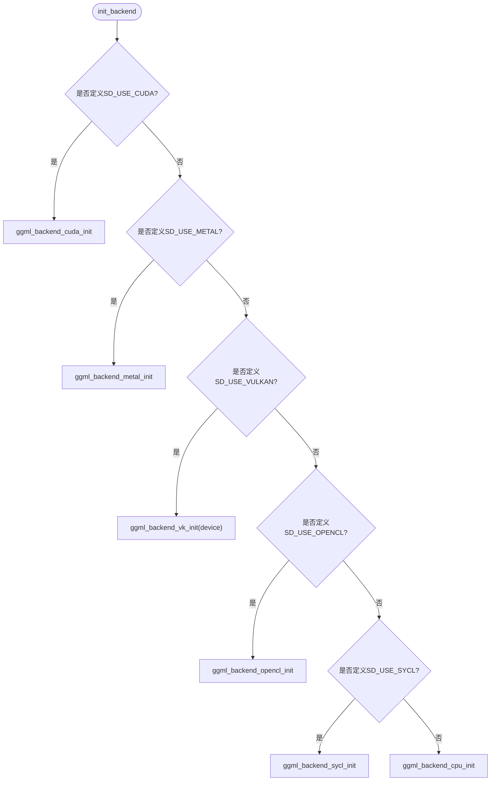
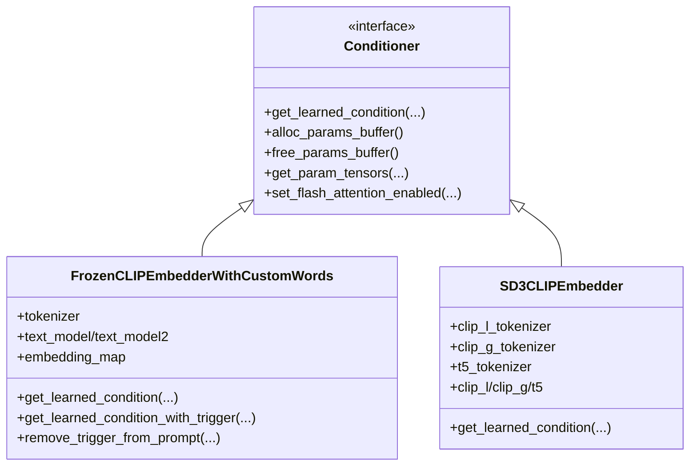
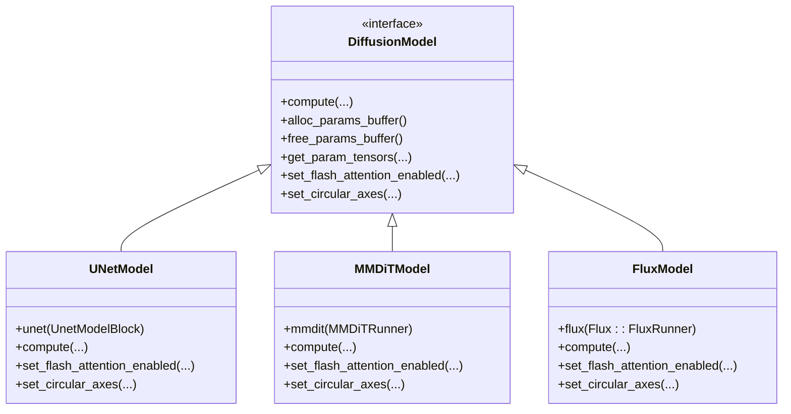
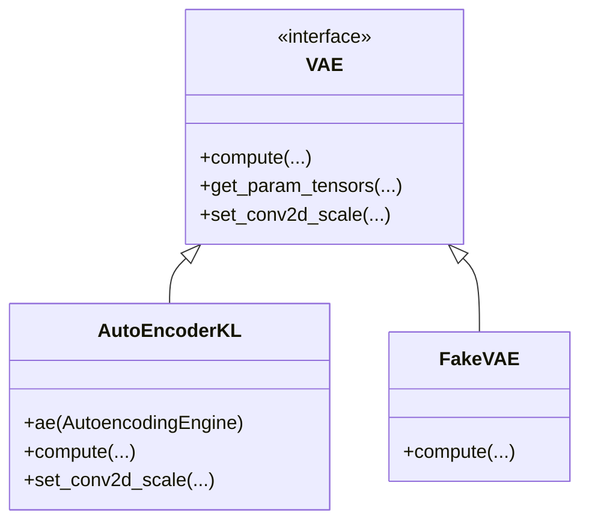
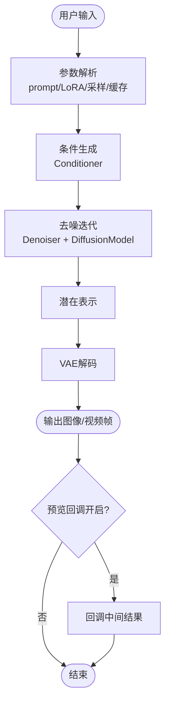
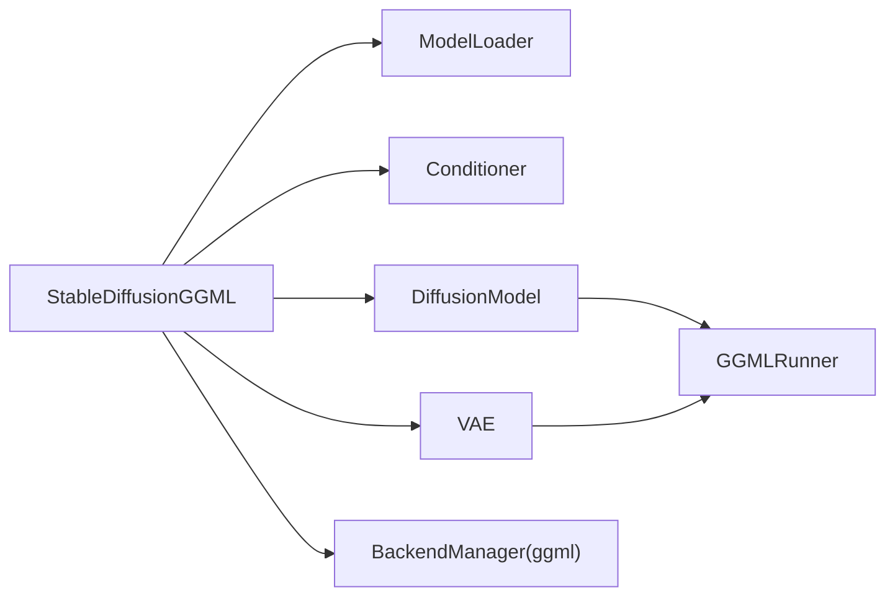

# 架构设计

<cite>
**本文档引用的文件**
- [stable-diffusion.cpp](file://src/stable-diffusion.cpp)
- [stable-diffusion.h](file://include/stable-diffusion.h)
- [model.h](file://src/model.h)
- [model.cpp](file://src/model.cpp)
- [util.h](file://src/util.h)
- [util.cpp](file://src/util.cpp)
- [diffusion_model.hpp](file://src/diffusion_model.hpp)
- [unet.hpp](file://src/unet.hpp)
- [vae.hpp](file://src/vae.hpp)
- [conditioner.hpp](file://src/conditioner.hpp)
</cite>

## 目录
1. [引言](#引言)
2. [项目结构](#项目结构)
3. [核心组件](#核心组件)
4. [架构总览](#架构总览)
5. [详细组件分析](#详细组件分析)
6. [依赖关系分析](#依赖关系分析)
7. [性能考虑](#性能考虑)
8. [故障排查指南](#故障排查指南)
9. [结论](#结论)
10. [附录](#附录)

## 引言
本文件面向系统设计者与扩展开发者，全面解析稳定扩散.cpp（Stable Diffusion GGML）的整体架构设计与实现细节。重点涵盖：
- 核心推理引擎的设计理念与组件划分
- StableDiffusionGGML 类的设计模式与生命周期管理
- ModelManager 的模型加载与权重管理机制
- BackendManager 的硬件后端抽象层与多后端选择策略
- 数据流架构：从用户输入到最终输出的完整处理链路
- 内存管理策略、缓存机制与性能优化设计
- 插件化架构如何支持不同模型类型与硬件后端

## 项目结构
项目采用模块化分层设计，围绕“模型加载与管理”“条件编码器”“扩散模型推理”“变分自编码器（VAE）”“后端抽象与执行图构建”等核心模块组织代码。

**图表来源**
- [stable-diffusion.cpp:238-988](file://src/stable-diffusion.cpp#L238-L988)
- [model.cpp:361-407](file://src/model.cpp#L361-L407)
- [diffusion_model.hpp:29-44](file://src/diffusion_model.hpp#L29-L44)
- [vae.hpp:615-625](file://src/vae.hpp#L615-L625)

**章节来源**
- [stable-diffusion.cpp:103-988](file://src/stable-diffusion.cpp#L103-L988)
- [model.h:23-54](file://src/model.h#L23-L54)
- [model.cpp:361-407](file://src/model.cpp#L361-L407)

## 核心组件
- StableDiffusionGGML：系统核心类，负责上下文初始化、模型装配、LoRA/Lora适配器、条件生成、扩散推理与VAE解码、预览回调等。
- ModelLoader：统一的模型文件解析器，支持GGUF、safetensors、checkpoint与diffusers目录格式，负责张量元信息收集与权重加载。
- Conditioner：文本/视觉条件生成器，支持CLIP、T5、LLM等不同编码器组合。
- DiffusionModel：扩散模型抽象接口，具体实现包括UNet、MMDiT、Flux、Anima、WAN、QwenImage、ZImage等。
- VAE：图像编码/解码模块，支持AutoEncoderKL、FakeVAE与视频解码器。
- BackendManager：基于ggml的后端抽象，自动选择CPU/CUDA/Vulkan/OpenCL/Metal等后端并进行参数与计算图调度。

**章节来源**
- [stable-diffusion.cpp:103-226](file://src/stable-diffusion.cpp#L103-L226)
- [model.h:292-343](file://src/model.h#L292-L343)
- [conditioner.hpp:34-53](file://src/conditioner.hpp#L34-L53)
- [diffusion_model.hpp:29-44](file://src/diffusion_model.hpp#L29-L44)
- [vae.hpp:615-625](file://src/vae.hpp#L615-L625)

## 架构总览
系统采用“配置驱动 + 模型工厂 + 后端执行”的架构：
- 配置驱动：通过 sd_ctx_params_t 控制后端选择、量化类型、LoRA应用时机、Flash Attention开关、循环卷积等。
- 模型工厂：根据版本枚举 SDVersion 自动选择对应 Conditioner/DiffusionModel/VAE 实现。
- 后端执行：所有张量与计算图在选定后端上执行，支持参数离线（offload）与内存映射（mmap）以降低显存占用。

**图表来源**
- [stable-diffusion.cpp:103-226](file://src/stable-diffusion.cpp#L103-L226)
- [model.h:292-343](file://src/model.h#L292-L343)
- [conditioner.hpp:34-136](file://src/conditioner.hpp#L34-L136)
- [diffusion_model.hpp:29-515](file://src/diffusion_model.hpp#L29-L515)
- [vae.hpp:615-772](file://src/vae.hpp#L615-L772)

## 详细组件分析

### StableDiffusionGGML 设计模式与生命周期
- 设计模式：组合 + 工厂 + 资源管理（RAII）。通过智能指针管理各子模块生命周期；构造时初始化后端与随机数生成器；析构时释放所有后端资源。
- 生命周期：
  - init：解析参数、初始化后端、加载模型文件、构建模型对象、分配参数缓冲区、设置预测模式与LoRA策略。
  - 推理：get_learned_condition 生成条件，compute 执行扩散去噪，VAE 解码，预览回调。
  - 销毁：按需释放参数缓冲区与后端实例。

**图表来源**
- [stable-diffusion.cpp:238-988](file://src/stable-diffusion.cpp#L238-L988)
- [conditioner.hpp:34-53](file://src/conditioner.hpp#L34-L53)
- [diffusion_model.hpp:29-44](file://src/diffusion_model.hpp#L29-L44)
- [vae.hpp:615-625](file://src/vae.hpp#L615-L625)

**章节来源**
- [stable-diffusion.cpp:103-226](file://src/stable-diffusion.cpp#L103-L226)
- [stable-diffusion.cpp:238-988](file://src/stable-diffusion.cpp#L238-L988)

### ModelManager：模型加载与权重管理
- 文件格式支持：GGUF、safetensors、checkpoint（zip）、diffusers目录。
- 名称转换：将外部模型权重名称转换为内部统一命名规范，确保跨模型兼容。
- 权重加载：支持按需加载、mmap加速、类型覆盖（wtype/tensor_type_rules），统计各量化类型的权重分布。
- 忽略列表：内置大量无用或冗余张量名，减少内存占用与错误风险。

**图表来源**
- [model.cpp:361-407](file://src/model.cpp#L361-L407)
- [model.cpp:384-396](file://src/model.cpp#L384-L396)
- [model.cpp:76-120](file://src/model.cpp#L76-L120)
- [model.h:312-343](file://src/model.h#L312-L343)

**章节来源**
- [model.cpp:361-407](file://src/model.cpp#L361-L407)
- [model.cpp:384-396](file://src/model.cpp#L384-L396)
- [model.cpp:76-120](file://src/model.cpp#L76-L120)
- [model.h:312-343](file://src/model.h#L312-L343)

### BackendManager：硬件后端抽象层
- 后端选择：优先级为 CUDA > Metal > Vulkan > OpenCL > SYCL > CPU。支持环境变量控制Vulkan设备索引。
- 参数与计算图：所有张量与计算图在选定后端上构建与执行；支持参数离线（offload_params_to_cpu）与计算缓冲区复用。
- Flash Attention：可全局启用，影响条件编码器、扩散模型与VAE中的注意力内核。

**图表来源**
- [stable-diffusion.cpp:171-226](file://src/stable-diffusion.cpp#L171-L226)

**章节来源**
- [stable-diffusion.cpp:171-226](file://src/stable-diffusion.cpp#L171-L226)

### 条件编码器（Conditioner）
- 支持多编码器组合：FrozenCLIPEmbedderWithCustomWords（CLIP L/G）、SD3CLIPEmbedder（CLIP L/G + T5）、Flux/LLM/T5 Embedder等。
- Prompt 处理：支持注意力权重解析、BREAK分段、自定义嵌入注入、触发词（PhotoMaker）处理。
- 输出结构：返回 c_crossattn/context、c_vector/y、c_concat 等多模态条件张量。

**图表来源**
- [conditioner.hpp:34-136](file://src/conditioner.hpp#L34-L136)
- [conditioner.hpp:710-800](file://src/conditioner.hpp#L710-L800)

**章节来源**
- [conditioner.hpp:34-136](file://src/conditioner.hpp#L34-L136)
- [conditioner.hpp:710-800](file://src/conditioner.hpp#L710-L800)

### 扩散模型（DiffusionModel）与 UNet 实现
- 抽象接口：DiffusionModel 定义 compute、参数缓冲区管理、权重适配器、Flash Attention 开关、循环卷积轴设置。
- 具体实现：
  - UNetModel：基于 UnetModelBlock 的传统UNet，支持视频时空Transformer（SVD）与ControlNet条件融合。
  - MMDiTModel：用于SD3/Flux/WAN/Qwen/Z-Image等DiT类模型。
  - FluxModel：专用于Flux系列，支持ref_latents、skip_layers等特性。
- 计算图：通过 GGMLRunner 统一构建与执行，支持多后端与参数离线。

**图表来源**
- [diffusion_model.hpp:29-515](file://src/diffusion_model.hpp#L29-L515)
- [unet.hpp:592-716](file://src/unet.hpp#L592-L716)

**章节来源**
- [diffusion_model.hpp:29-515](file://src/diffusion_model.hpp#L29-L515)
- [unet.hpp:592-716](file://src/unet.hpp#L592-L716)

### VAE（变分自编码器）
- AutoEncoderKL：标准VAE编码/解码，支持线性投影切换、视频解码器（AE3DConv/VideoResnetBlock）。
- FakeVAE：占位实现，直接传递张量，适用于某些特殊场景。
- 参数离线与卷积缩放：支持将参数离线至CPU与对特定卷积设置缩放系数。

**图表来源**
- [vae.hpp:615-772](file://src/vae.hpp#L615-L772)

**章节来源**
- [vae.hpp:615-772](file://src/vae.hpp#L615-L772)

### 数据流架构：从输入到输出
- 输入阶段：prompt、negative_prompt、图像（初始/参考/控制）、LoRA、采样参数、缓存参数等。
- 条件生成：Conditioner 将文本/图像转换为多模态条件张量。
- 扩散推理：Denoiser 基于采样方法与调度器生成时间步序列，DiffusionModel 进行去噪迭代。
- VAE 解码：将去噪后的潜在表示解码为像素空间图像。
- 预览回调：按配置周期性输出中间结果（噪声/去噪图像）。

**图表来源**
- [stable-diffusion.h:284-336](file://include/stable-diffusion.h#L284-L336)
- [stable-diffusion.cpp:1486-1599](file://src/stable-diffusion.cpp#L1486-L1599)

**章节来源**
- [stable-diffusion.h:284-336](file://include/stable-diffusion.h#L284-L336)
- [stable-diffusion.cpp:1486-1599](file://src/stable-diffusion.cpp#L1486-L1599)

## 依赖关系分析
- 组件耦合：
  - StableDiffusionGGML 对 ModelLoader、Conditioner、DiffusionModel、VAE、BackendManager 存在强依赖，但通过接口隔离，便于替换与扩展。
  - DiffusionModel 与 VAE 均继承自 GGMLRunner，共享统一的后端执行框架。
- 外部依赖：
  - ggml 及其后端库（CUDA/Vulkan/OpenCL/Metal/SYCL/CPU）。
  - JSON、ZIP、STB图像库等第三方工具。
- 循环依赖：未发现直接循环依赖；各模块通过接口与工厂模式解耦。

**图表来源**
- [stable-diffusion.cpp:103-226](file://src/stable-diffusion.cpp#L103-L226)
- [diffusion_model.hpp:29-44](file://src/diffusion_model.hpp#L29-L44)
- [vae.hpp:615-625](file://src/vae.hpp#L615-L625)

**章节来源**
- [stable-diffusion.cpp:103-226](file://src/stable-diffusion.cpp#L103-L226)
- [diffusion_model.hpp:29-44](file://src/diffusion_model.hpp#L29-L44)
- [vae.hpp:615-625](file://src/vae.hpp#L615-L625)

## 性能考虑
- 后端选择：优先使用GPU后端（CUDA/Metal/Vulkan），在资源紧张时回退CPU。
- 参数离线：通过 offload_params_to_cpu 将大模型参数卸载至CPU内存，降低显存峰值。
- Flash Attention：全局启用可显著提升注意力计算效率，但需注意与某些模型特性（如Chroma）的兼容性提示。
- 缓存策略：支持多种缓存模式（EASYCACHE/UCACHE/DBCACHE/TAYLORSEER/CACHE_DIT/SPECTRUM），通过 sd_cache_params_t 控制阈值、窗口大小、导数阶数等。
- 内存映射：启用 enable_mmap 可减少内存拷贝，提高大模型加载速度。
- 图形构建：UNet/VAE等模块使用固定上限的计算图大小（如 UNET_GRAPH_SIZE、VAE_GRAPH_SIZE），避免动态增长导致的碎片化。

**章节来源**
- [stable-diffusion.cpp:171-226](file://src/stable-diffusion.cpp#L171-L226)
- [stable-diffusion.cpp:737-757](file://src/stable-diffusion.cpp#L737-L757)
- [stable-diffusion.h:247-282](file://include/stable-diffusion.h#L247-L282)
- [unet.hpp](file://src/unet.hpp#L9)
- [vae.hpp](file://src/vae.hpp#L8)

## 故障排查指南
- 后端初始化失败：检查编译宏与运行环境，确认对应后端库可用；查看日志中后端初始化警告。
- LoRA 应用异常：确认 LoRA 文件路径正确、量化类型与主模型匹配；若量化权重存在，系统会自动调整 LoRA 应用时机。
- 条件生成错误：检查 prompt 中是否存在触发词（PhotoMaker）或自定义嵌入未正确加载；确认 tokenizer 与嵌入表大小一致。
- VAE 解码异常：确认 decode_only 与模型版本匹配；对于SDXL可尝试强制卷积缩放参数。
- 预览不显示：检查预览回调注册与间隔设置；确认预览模式（PROJ/VAE/TAESD）与当前模型兼容。

**章节来源**
- [stable-diffusion.cpp:171-226](file://src/stable-diffusion.cpp#L171-L226)
- [stable-diffusion.cpp:1031-1262](file://src/stable-diffusion.cpp#L1031-L1262)
- [conditioner.hpp:138-213](file://src/conditioner.hpp#L138-L213)
- [vae.hpp:652-772](file://src/vae.hpp#L652-L772)

## 结论
稳定扩散.cpp 通过清晰的模块划分与后端抽象，实现了对多模型类型与多硬件平台的统一支持。StableDiffusionGGML 作为核心协调者，结合 ModelManager 的灵活加载与 BackendManager 的高效执行，形成了高可扩展、高性能的推理框架。建议在生产环境中优先启用GPU后端、参数离线与Flash Attention，并根据模型特性合理配置缓存与预览策略，以获得最佳性能与体验。

## 附录
- 关键API与数据结构参见头文件说明，包括 sd_ctx_params_t、sd_img_gen_params_t、sd_vid_gen_params_t、sd_cache_params_t 等。
- 日志与进度回调可通过 sd_set_log_callback/sd_set_progress_callback/sd_set_preview_callback 注册，便于集成到上层应用。

**章节来源**
- [stable-diffusion.h:148-336](file://include/stable-diffusion.h#L148-L336)
- [util.cpp:418-460](file://src/util.cpp#L418-L460)