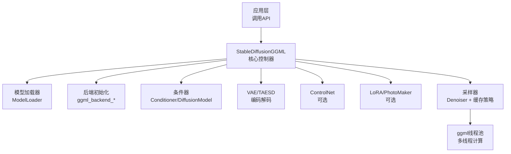
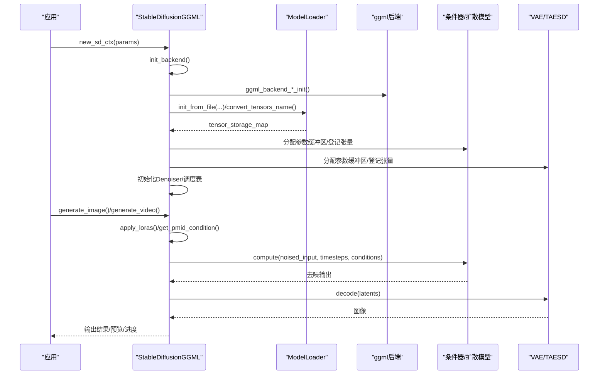
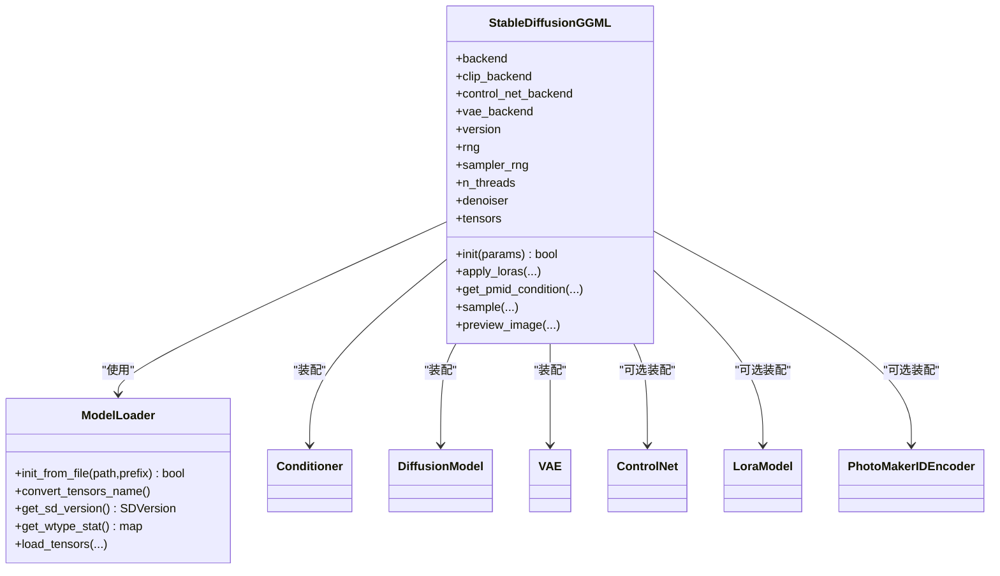
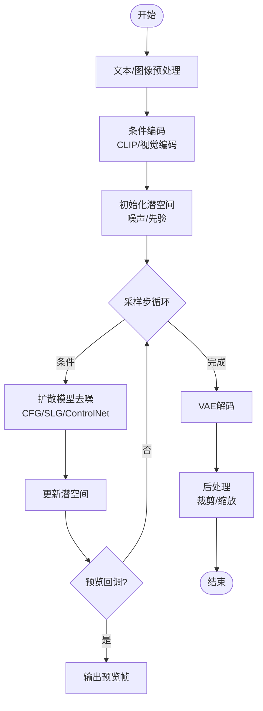
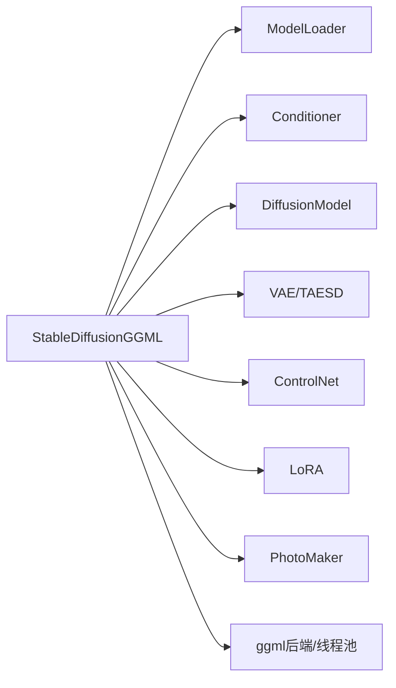

# 核心推理引擎

<cite>
**本文引用的文件**
- [stable-diffusion.cpp](file://src/stable-diffusion.cpp)
- [stable-diffusion.h](file://include/stable-diffusion.h)
- [model.h](file://src/model.h)
- [model.cpp](file://src/model.cpp)
- [rng_philox.hpp](file://src/rng_philox.hpp)
- [ggml-alloc.h](file://ggml/include/ggml-alloc.h)
- [ggml.c](file://ggml/src/ggml.c)
- [ggml-alloc.c](file://ggml/src/ggml-alloc.c)
- [ggml-cpu.c](file://ggml/src/ggml-cpu/ggml-cpu.c)
</cite>

## 目录
1. [简介](#简介)
2. [项目结构](#项目结构)
3. [核心组件](#核心组件)
4. [架构总览](#架构总览)
5. [详细组件分析](#详细组件分析)
6. [依赖关系分析](#依赖关系分析)
7. [性能考量](#性能考量)
8. [故障排查指南](#故障排查指南)
9. [结论](#结论)
10. [附录](#附录)

## 简介
本技术文档围绕稳定扩散.cpp的核心推理引擎——StableDiffusionGGML类展开，系统阐述其作为整个系统核心控制器的设计与实现。内容涵盖引擎初始化流程、参数配置机制、内存管理策略、推理过程中的数据流转、随机数生成器选择与配置、线程管理机制、生命周期管理、错误处理策略以及性能监控机制，并提供使用方式与最佳实践指引。

## 项目结构
- 引擎入口与核心控制：src/stable-diffusion.cpp 中的 StableDiffusionGGML 类承担模型加载、后端初始化、条件器与扩散模型装配、LoRA与PhotoMaker集成、采样与缓存策略执行等职责。
- 接口定义：include/stable-diffusion.h 提供对外API、参数结构体、回调函数类型与版本信息查询接口。
- 模型加载与存储：src/model.h/.cpp 定义了模型版本枚举、张量存储描述、模型加载器与权重类型统计等。
- 随机数生成：src/rng_philox.hpp 实现了与PyTorch CUDA randn兼容的PhiloxRNG。
- 内存与后端：ggml子模块提供张量上下文、图分配器、CPU后端线程池与任务调度等能力。

图表来源
- [stable-diffusion.cpp:103-169](file://src/stable-diffusion.cpp#L103-L169)
- [stable-diffusion.h:370-384](file://include/stable-diffusion.h#L370-L384)
- [model.cpp:361-382](file://src/model.cpp#L361-L382)

章节来源
- [stable-diffusion.cpp:103-169](file://src/stable-diffusion.cpp#L103-L169)
- [stable-diffusion.h:370-384](file://include/stable-diffusion.h#L370-L384)
- [model.cpp:361-382](file://src/model.cpp#L361-L382)

## 核心组件
- StableDiffusionGGML：核心控制器，负责后端初始化、模型装配、LoRA/PhotoMaker集成、采样与缓存策略、预览输出与进度回调。
- ModelLoader：统一加载不同格式（GGUF、safetensors、checkpoint、diffusers）的权重，解析张量元信息，支持类型覆盖与统计。
- 条件器与扩散模型：根据模型版本动态选择具体实现（如UNet、DiT、Flux、Wan、QwenImage、Anima、Z-Image等），并分配参数缓冲区。
- VAE/TAESD：第一阶段自动编码器或Tiny VAE，支持显存分块与直接卷积优化。
- ControlNet：可选的控制网络，用于图像到图像或视频条件生成。
- LoRA/PhotoMaker：可插拔的权重适配器与身份嵌入堆叠。
- Denoiser与采样器：根据预测类型（eps/v/flow/flux-flow等）选择对应去噪器，执行k-扩散采样。
- 缓存策略：EasyCache、UCache、CacheDIT（DBCache/TaylorSeer）、Spectrum等，按步跳过以加速推理。
- 随机数生成器：支持STD默认、CPU MT19937与Philox（CUDA风格）三种，分别用于通用与采样器随机性。
- 线程管理：基于ggml线程池的任务调度与工作线程同步。

章节来源
- [stable-diffusion.cpp:103-169](file://src/stable-diffusion.cpp#L103-L169)
- [model.h:23-54](file://src/model.h#L23-L54)
- [model.cpp:292-343](file://src/model.cpp#L292-L343)
- [rng_philox.hpp:11-125](file://src/rng_philox.hpp#L11-L125)

## 架构总览
StableDiffusionGGML在初始化阶段完成以下关键步骤：
- 解析sd_ctx_params，设置线程数、LoRA应用模式、权重类型覆盖、是否仅解码等。
- 初始化后端（优先CUDA/Metal/Vulkan/OpenCL/SYCL，否则回退CPU）。
- 使用ModelLoader加载主干模型、CLIP、VAE、ControlNet、PhotoMaker等权重，转换张量名称并统计权重类型分布。
- 根据模型版本选择条件器与扩散模型实现，分配参数缓冲区并登记到全局张量表。
- 初始化Denoiser（依据预测类型），准备噪声调度与timesteps。
- 可选启用Flash Attention、循环卷积、Tiny VAE、Offload至CPU等优化。
- 进入推理阶段，执行采样与缓存策略，按需输出预览帧与进度回调。

图表来源
- [stable-diffusion.cpp:238-988](file://src/stable-diffusion.cpp#L238-L988)
- [model.cpp:361-382](file://src/model.cpp#L361-L382)
- [stable-diffusion.h:370-384](file://include/stable-diffusion.h#L370-L384)

章节来源
- [stable-diffusion.cpp:238-988](file://src/stable-diffusion.cpp#L238-L988)
- [model.cpp:361-382](file://src/model.cpp#L361-L382)
- [stable-diffusion.h:370-384](file://include/stable-diffusion.h#L370-L384)

## 详细组件分析

### StableDiffusionGGML类设计与实现
- 职责边界清晰：作为核心控制器，负责初始化、装配、推理与资源释放；各子模块（条件器、扩散模型、VAE、ControlNet、LoRA、PhotoMaker）通过共享指针与统一张量表协作。
- 后端抽象：通过宏开关选择CUDA/Metal/Vulkan/OpenCL/SYCL/CPU后端，确保跨平台与硬件自适应。
- 参数配置：sd_ctx_params涵盖权重类型、LoRA应用模式、Flash Attention、循环卷积、Offload、CPU/GPU放置策略等，满足多样部署需求。
- 生命周期管理：构造时初始化成员，析构时释放所有后端与缓冲；模型参数缓冲区在需要时分配并在使用后可选择立即释放以节省显存。
- 错误处理：对关键路径（后端初始化、模型加载、计算图构建、采样）进行失败检测与日志记录，必要时提前返回并清理已分配资源。

图表来源
- [stable-diffusion.cpp:103-169](file://src/stable-diffusion.cpp#L103-L169)
- [model.h:292-343](file://src/model.h#L292-L343)

章节来源
- [stable-diffusion.cpp:103-169](file://src/stable-diffusion.cpp#L103-L169)
- [model.h:292-343](file://src/model.h#L292-L343)

### 初始化流程与参数配置机制
- 后端初始化：根据编译宏与环境变量选择最优后端，若失败则回退CPU。
- 模型加载：支持从单文件或多目录（diffusers格式）加载，自动识别GGUF、safetensors、checkpoint等格式；可按前缀限定加载范围。
- 权重类型覆盖：允许强制指定权重精度或通过规则映射，便于量化与混合精度推理。
- 版本与预测类型推断：根据模型特征自动判断预测类型（eps/v/flow/flux-flow等），并据此选择Denoiser。
- 可选功能：Flash Attention、循环卷积、Tiny VAE、Offload至CPU、仅解码模式等。

章节来源
- [stable-diffusion.cpp:171-226](file://src/stable-diffusion.cpp#L171-L226)
- [stable-diffusion.cpp:238-380](file://src/stable-diffusion.cpp#L238-L380)
- [model.cpp:361-382](file://src/model.cpp#L361-L382)
- [model.cpp:411-477](file://src/model.cpp#L411-L477)
- [model.cpp:502-640](file://src/model.cpp#L502-L640)

### 内存管理策略
- 张量上下文与分配：使用ggml上下文与图分配器管理中间张量生命周期，避免重复分配与碎片化。
- 参数缓冲区：条件器、扩散模型、VAE、ControlNet等各自分配参数缓冲区，按后端类型与是否Offload决定存放位置。
- 动态释放：支持在加载LoRA或使用PhotoMaker后立即释放临时参数缓冲区以降低峰值显存占用。
- 显存分块：VAE/TAESD支持按tile大小与重叠率进行分块计算，缓解显存压力。

章节来源
- [stable-diffusion.cpp:818-890](file://src/stable-diffusion.cpp#L818-L890)
- [stable-diffusion.cpp:1478-1484](file://src/stable-diffusion.cpp#L1478-L1484)
- [ggml-alloc.h:14-46](file://ggml/include/ggml-alloc.h#L14-L46)
- [ggml-alloc.c:64-77](file://ggml/src/ggml-alloc.c#L64-L77)
- [ggml-alloc.c:537-539](file://ggml/src/ggml-alloc.c#L537-L539)

### 推理过程数据流
- 输入预处理：文本提示词经条件器编码，图像输入经CLIP视觉编码或VAE编码；支持PhotoMaker身份嵌入堆叠。
- 去噪迭代：按sigma序列执行k-扩散采样，结合CFG、可选图像CFG、Skip Layer Guidance与ControlNet条件；支持掩膜引导与参考潜移。
- 输出后处理：将潜空间解码为RGB图像，支持预览回调输出中间帧与最终图像。

图表来源
- [stable-diffusion.cpp:1639-2351](file://src/stable-diffusion.cpp#L1639-L2351)
- [stable-diffusion.cpp:1486-1637](file://src/stable-diffusion.cpp#L1486-L1637)

章节来源
- [stable-diffusion.cpp:1639-2351](file://src/stable-diffusion.cpp#L1639-L2351)
- [stable-diffusion.cpp:1486-1637](file://src/stable-diffusion.cpp#L1486-L1637)

### 随机数生成器选择与配置
- 支持三种RNG：STD_DEFAULT_RNG（标准库）、CPU_RNG（MT19937）、CUDA_RNG（Philox，与PyTorch CUDA randn兼容）。
- 采样器RNG可独立于通用RNG，便于区分推理与采样阶段的随机性来源。
- PhiloxRNG实现包含Philox4x32轮转、Box-Muller变换生成正态分布随机数，适合大规模并行采样。

章节来源
- [stable-diffusion.h:31-36](file://include/stable-diffusion.h#L31-L36)
- [stable-diffusion.cpp:228-236](file://src/stable-diffusion.cpp#L228-L236)
- [rng_philox.hpp:11-125](file://src/rng_philox.hpp#L11-L125)

### 线程管理机制
- 线程池：基于ggml线程池实现多线程任务调度，支持工作线程等待、唤醒与屏障同步。
- 任务粒度：根据算子类型与n_threads动态确定每节点任务数，兼顾吞吐与开销。
- 亲和性与优先级：可设置线程亲和掩码与优先级，提升NUMA友好性与实时性。
- 采样阶段：采样器内部使用独立的sampler_rng，避免与通用RNG相互干扰。

章节来源
- [ggml-cpu.c:2424-3254](file://ggml/src/ggml-cpu/ggml-cpu.c#L2424-L3254)
- [stable-diffusion.cpp:228-236](file://src/stable-diffusion.cpp#L228-L236)

### 引擎生命周期管理
- 构造：初始化成员变量与默认后端。
- 初始化：加载权重、装配模型、分配参数缓冲区、初始化Denoiser与调度表。
- 推理：执行采样、缓存策略、预览与进度回调。
- 释放：释放后端、缓冲区与临时资源，确保无泄漏。

章节来源
- [stable-diffusion.cpp:158-169](file://src/stable-diffusion.cpp#L158-L169)
- [stable-diffusion.cpp:238-988](file://src/stable-diffusion.cpp#L238-L988)

### 错误处理策略
- 关键路径失败：后端初始化失败、模型加载失败、扩散模型计算失败、ControlNet计算失败等均记录错误日志并返回失败。
- 资源清理：在失败路径中释放已分配的上下文与缓冲区，避免悬挂资源。
- 兼容性警告：对不支持的功能（如2条件CFG、SLG在非DiT模型上）发出警告并降级处理。

章节来源
- [stable-diffusion.cpp:261-263](file://src/stable-diffusion.cpp#L261-L263)
- [stable-diffusion.cpp:2121-2127](file://src/stable-diffusion.cpp#L2121-L2127)
- [stable-diffusion.cpp:2261-2269](file://src/stable-diffusion.cpp#L2261-L2269)

### 性能监控机制
- 进度回调：每步采样完成后触发进度回调，显示当前步数、总步数与耗时。
- 预览回调：可选输出噪声/去噪中间帧，便于调试与可视化。
- 缓存策略统计：记录被跳过的步数与估计加速比，辅助评估缓存收益。
- 记忆体统计：打印各模块参数内存占用（VRAM/RAM），帮助定位显存瓶颈。

章节来源
- [stable-diffusion.h:340-347](file://include/stable-diffusion.h#L340-L347)
- [stable-diffusion.cpp:1894-2258](file://src/stable-diffusion.cpp#L1894-L2258)
- [stable-diffusion.cpp:2271-2339](file://src/stable-diffusion.cpp#L2271-L2339)
- [stable-diffusion.cpp:874-889](file://src/stable-diffusion.cpp#L874-L889)

## 依赖关系分析
- 组件耦合：StableDiffusionGGML与ModelLoader强耦合（装配阶段），与各子模块弱耦合（通过接口与共享指针）。
- 外部依赖：ggml后端、CPU线程池、可选CUDA/Metal/Vulkan/OpenCL/SYCL后端；JSON解析用于safetensors头解析。
- 循环依赖：未发现直接循环依赖；各子模块通过StableDiffusionGGML集中协调。

图表来源
- [stable-diffusion.cpp:103-169](file://src/stable-diffusion.cpp#L103-L169)
- [model.h:292-343](file://src/model.h#L292-L343)

章节来源
- [stable-diffusion.cpp:103-169](file://src/stable-diffusion.cpp#L103-L169)
- [model.h:292-343](file://src/model.h#L292-L343)

## 性能考量
- 后端选择：优先GPU后端（CUDA/Metal/Vulkan/OpenCL/SYCL），在资源紧张时回退CPU。
- Flash Attention：在条件器、扩散模型、VAE/TAESD上可开启，显著降低注意力计算时间。
- 循环卷积：在支持的模型上启用循环卷积，减少边界效应。
- Offload至CPU：将部分模块参数移动到CPU，降低显存占用但可能增加带宽压力。
- LoRA应用时机：量化权重下自动延迟应用LoRA，避免额外反量化成本；否则可立即应用以减少运行时开销。
- 缓存策略：根据模型类型选择合适缓存（EasyCache/UCache/CacheDIT/Spectrum），在保证质量前提下最大化跳步比例。
- 显存分块：VAE/TAESD分块计算可显著降低峰值显存。

章节来源
- [stable-diffusion.cpp:737-767](file://src/stable-diffusion.cpp#L737-L767)
- [stable-diffusion.cpp:380-401](file://src/stable-diffusion.cpp#L380-L401)
- [stable-diffusion.cpp:1688-1821](file://src/stable-diffusion.cpp#L1688-L1821)
- [stable-diffusion.cpp:1478-1484](file://src/stable-diffusion.cpp#L1478-L1484)

## 故障排查指南
- 后端初始化失败：检查编译宏与环境变量，确认目标后端驱动可用；查看日志中的回退提示。
- 模型加载失败：确认模型路径正确、格式受支持；检查tensor名称转换与前缀匹配。
- 扩散模型计算失败：检查输入维度、timesteps与条件张量形状；确认LoRA/PhotoMaker已正确应用。
- 显存不足：启用Offload至CPU、关闭不必要的模块、降低分辨率或启用显存分块；检查缓存策略是否有效。
- 预览无输出：确认预览回调已注册且模式设置正确；检查预览间隔与预览函数实现。

章节来源
- [stable-diffusion.cpp:171-226](file://src/stable-diffusion.cpp#L171-L226)
- [stable-diffusion.cpp:261-263](file://src/stable-diffusion.cpp#L261-L263)
- [stable-diffusion.cpp:2121-2127](file://src/stable-diffusion.cpp#L2121-L2127)
- [stable-diffusion.cpp:1486-1637](file://src/stable-diffusion.cpp#L1486-L1637)

## 结论
StableDiffusionGGML通过模块化设计与灵活的后端/内存/线程抽象，实现了对多架构、多模型族的统一推理控制。其初始化流程严谨、参数配置丰富、内存管理高效、采样与缓存策略完备，并提供了完善的错误处理与性能监控能力。结合本文的最佳实践建议，可在不同硬件与部署场景下获得稳定且高性能的推理体验。

## 附录
- 使用方式与最佳实践
  - 初始化：设置sd_ctx_params，选择合适的权重类型与LoRA应用模式，按需启用Flash Attention与Offload。
  - 推理：合理设置采样方法与调度器，利用CFG/SLG/ControlNet增强可控性；开启缓存策略以提速。
  - 调试：启用预览回调观察中间帧，使用进度回调监控耗时；关注日志中的警告与统计信息。
  - 性能：优先GPU后端，按需启用循环卷积与显存分块；在量化模型上谨慎使用LoRA即时应用。

章节来源
- [stable-diffusion.h:370-384](file://include/stable-diffusion.h#L370-L384)
- [stable-diffusion.cpp:1639-2351](file://src/stable-diffusion.cpp#L1639-L2351)
- [stable-diffusion.cpp:1688-1821](file://src/stable-diffusion.cpp#L1688-L1821)