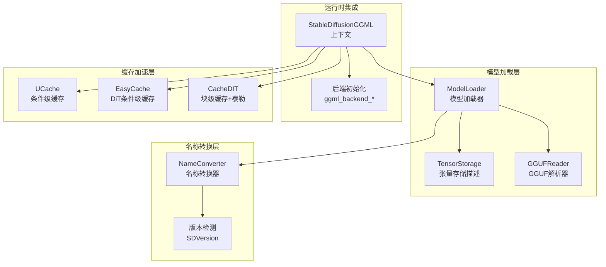
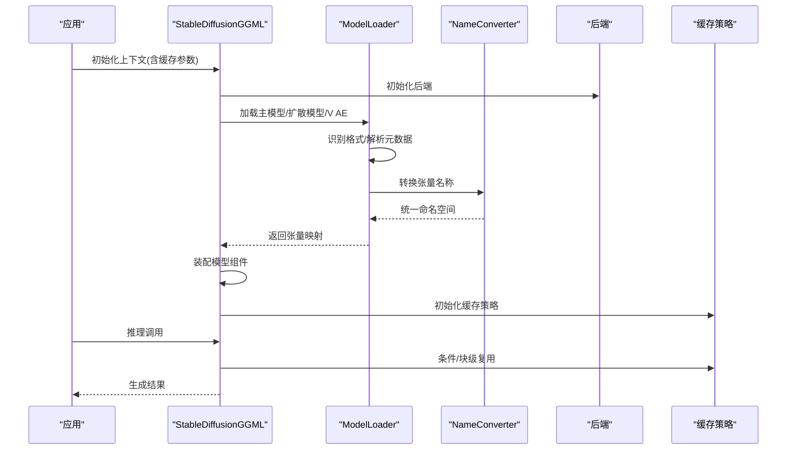
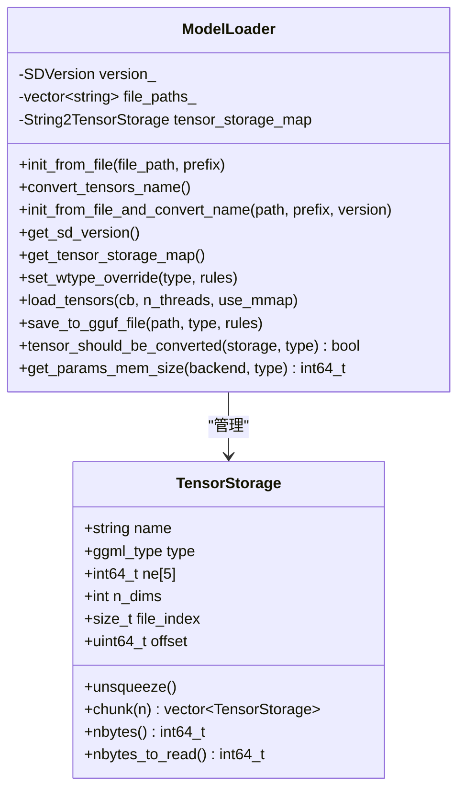
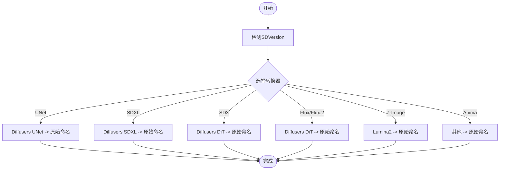
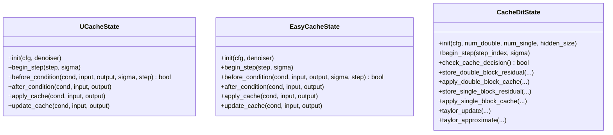
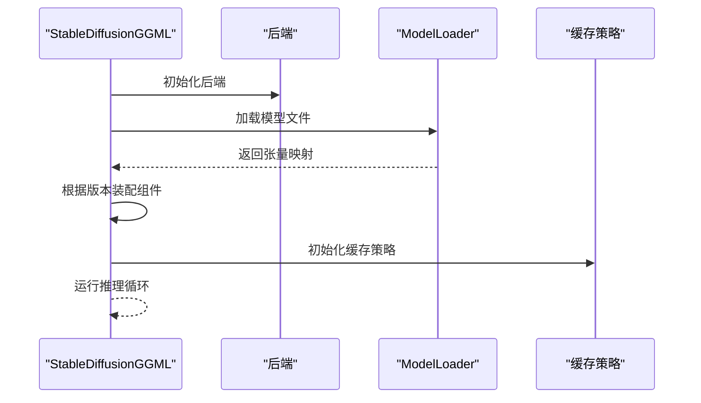
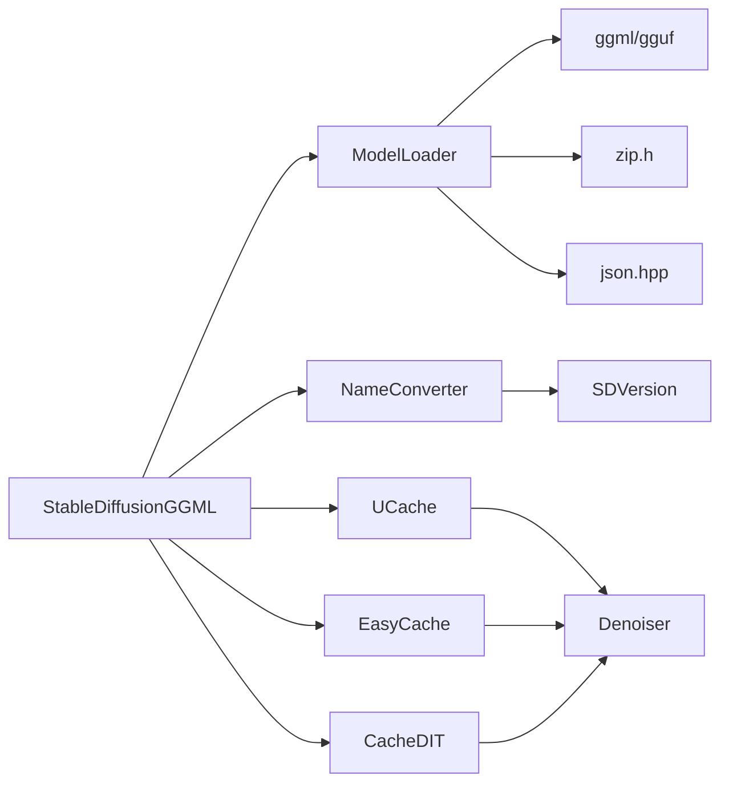

# 模型管理系统

<cite>
**本文档引用的文件**
- [model.h](file://src/model.h)
- [model.cpp](file://src/model.cpp)
- [name_conversion.h](file://src/name_conversion.h)
- [name_conversion.cpp](file://src/name_conversion.cpp)
- [stable-diffusion.h](file://include/stable-diffusion.h)
- [stable-diffusion.cpp](file://src/stable-diffusion.cpp)
- [gguf_reader.hpp](file://src/gguf_reader.hpp)
- [easycache.hpp](file://src/easycache.hpp)
- [ucache.hpp](file://src/ucache.hpp)
- [cache_dit.hpp](file://src/cache_dit.hpp)
- [caching.md](file://docs/caching.md)
</cite>

## 目录
1. [简介](#简介)
2. [项目结构](#项目结构)
3. [核心组件](#核心组件)
4. [架构总览](#架构总览)
5. [详细组件分析](#详细组件分析)
6. [依赖关系分析](#依赖关系分析)
7. [性能考量](#性能考量)
8. [故障排除指南](#故障排除指南)
9. [结论](#结论)
10. [附录](#附录)

## 简介
本文件面向稳定扩散.cpp的模型管理系统，系统化阐述ModelManager的设计理念与实现机制，覆盖模型加载、验证、缓存与卸载的完整流程；解析不同模型类型（UNet、VAE、CLIP等）的管理策略与加载顺序；说明模型权重的存储格式、名称转换机制与类型推断算法；详解缓存系统的工作原理（内存优化、阈值策略、智能释放）；并提供版本兼容性检查、增量更新与热重载建议，以及最佳实践与故障排除指南。

## 项目结构
模型管理相关代码主要集中在以下模块：
- 模型加载与存储：model.h/.cpp、gguf_reader.hpp
- 名称转换与类型推断：name_conversion.h/.cpp
- 上下文与运行时集成：stable-diffusion.h/.cpp
- 缓存加速：easycache.hpp、ucache.hpp、cache_dit.hpp
- 文档与参数说明：caching.md

**图表来源**
- [model.h:181-343](file://src/model.h#L181-L343)
- [model.cpp:283-477](file://src/model.cpp#L283-L477)
- [name_conversion.cpp:664-679](file://src/name_conversion.cpp#L664-L679)
- [stable-diffusion.cpp:253-357](file://src/stable-diffusion.cpp#L253-L357)
- [easycache.hpp:20-79](file://src/easycache.hpp#L20-L79)
- [ucache.hpp:30-162](file://src/ucache.hpp#L30-L162)
- [cache_dit.hpp:13-41](file://src/cache_dit.hpp#L13-L41)

**章节来源**
- [model.h:1-346](file://src/model.h#L1-L346)
- [model.cpp:1-1825](file://src/model.cpp#L1-L1825)
- [name_conversion.cpp:1-800](file://src/name_conversion.cpp#L1-L800)
- [stable-diffusion.cpp:1-4374](file://src/stable-diffusion.cpp#L1-L4374)
- [gguf_reader.hpp:1-232](file://src/gguf_reader.hpp#L1-L232)
- [easycache.hpp:1-265](file://src/easycache.hpp#L1-L265)
- [ucache.hpp:1-435](file://src/ucache.hpp#L1-L435)
- [cache_dit.hpp:1-976](file://src/cache_dit.hpp#L1-L976)
- [caching.md:1-150](file://docs/caching.md#L1-L150)

## 核心组件
- ModelLoader：统一的模型加载器，支持GGUF、safetensors、checkpoint、Diffusers目录等多种格式；负责张量元信息收集、名称转换、类型推断与权重加载。
- TensorStorage：描述单个张量的元信息（名称、类型、维度、偏移、来源文件索引），用于跨格式统一管理。
- NameConverter：根据SDVersion将外部模型名称映射到内部统一命名空间，确保不同来源权重的一致性。
- StableDiffusionGGML：运行时上下文，负责后端初始化、模型装配、缓存策略选择与执行。
- 缓存系统：UCache（UNet）、EasyCache（DiT）、CacheDIT（DiT块级+泰勒）三类策略，按模型类型自动启用或提示不支持。

**章节来源**
- [model.h:181-343](file://src/model.h#L181-L343)
- [model.cpp:283-477](file://src/model.cpp#L283-L477)
- [name_conversion.cpp:664-679](file://src/name_conversion.cpp#L664-L679)
- [stable-diffusion.cpp:253-357](file://src/stable-diffusion.cpp#L253-L357)
- [easycache.hpp:20-79](file://src/easycache.hpp#L20-L79)
- [ucache.hpp:30-162](file://src/ucache.hpp#L30-L162)
- [cache_dit.hpp:13-41](file://src/cache_dit.hpp#L13-L41)

## 架构总览
模型管理采用“加载-转换-装配-缓存”的流水线式架构：
- 加载阶段：识别文件格式，解析张量元数据，构建TensorStorage映射。
- 转换阶段：根据SDVersion进行名称转换，统一到内部命名空间。
- 装配阶段：将张量映射到运行时结构体，按模型类型（UNet/VAE/CLIP/DiT等）组织。
- 缓存阶段：在推理过程中按策略复用中间结果，减少重复计算。

**图表来源**
- [stable-diffusion.cpp:253-357](file://src/stable-diffusion.cpp#L253-L357)
- [model.cpp:361-407](file://src/model.cpp#L361-L407)
- [name_conversion.cpp:664-679](file://src/name_conversion.cpp#L664-L679)
- [easycache.hpp:66-113](file://src/easycache.hpp#L66-L113)
- [ucache.hpp:126-198](file://src/ucache.hpp#L126-L198)
- [cache_dit.hpp:175-280](file://src/cache_dit.hpp#L175-L280)

## 详细组件分析

### ModelLoader：多格式统一加载与名称转换
- 多格式支持：自动识别GGUF、safetensors、checkpoint压缩包与Diffusers目录，并提取张量元信息。
- 张量存储：通过TensorStorage记录每个张量的类型、形状、偏移与来源文件索引，便于后续按需读取与分块处理。
- 名称转换：根据SDVersion调用对应转换函数，将外部名称映射到内部命名空间，保证不同来源权重的一致性。
- 类型推断与转换：支持强制类型覆盖与按规则转换，同时考虑量化块大小、偏置/尺度等特殊张量不做转换。
- 内存估算：提供参数占用估算，辅助决定分配策略与后端选择。

**图表来源**
- [model.h:181-343](file://src/model.h#L181-L343)

**章节来源**
- [model.h:292-343](file://src/model.h#L292-L343)
- [model.cpp:361-407](file://src/model.cpp#L361-L407)
- [model.cpp:1602-1675](file://src/model.cpp#L1602-L1675)
- [model.cpp:1677-1708](file://src/model.cpp#L1677-L1708)
- [model.cpp:1710-1778](file://src/model.cpp#L1710-L1778)
- [model.cpp:1780-1798](file://src/model.cpp#L1780-L1798)

### 名称转换与类型推断
- 版本判定：通过SDVersion枚举与一系列辅助函数判断模型类型（SD1/SD2/SDXL/SD3/Flux/Flux.2/Wan/Qwen/Z-Image/Ovis等）。
- 名称转换：针对UNet、VAE、CLIP、DiT等不同组件提供专用转换函数，确保来自Diffusers/HF等源的权重能映射到内部命名。
- 类型推断：从文件头/元数据中解析张量类型，结合规则与量化约束进行类型选择与转换。

**图表来源**
- [name_conversion.cpp:180-279](file://src/name_conversion.cpp#L180-L279)
- [name_conversion.cpp:283-397](file://src/name_conversion.cpp#L283-L397)
- [name_conversion.cpp:399-503](file://src/name_conversion.cpp#L399-L503)
- [name_conversion.cpp:505-616](file://src/name_conversion.cpp#L505-L616)
- [name_conversion.cpp:618-654](file://src/name_conversion.cpp#L618-L654)
- [name_conversion.cpp:656-662](file://src/name_conversion.cpp#L656-L662)

**章节来源**
- [model.h:23-174](file://src/model.h#L23-L174)
- [name_conversion.h:8-13](file://src/name_conversion.h#L8-L13)
- [name_conversion.cpp:664-679](file://src/name_conversion.cpp#L664-L679)

### 缓存系统：UCache/EasyCache/CacheDIT
- UCache（UNet）：基于条件级残差缓存，使用输入变化率与输出范数动态阈值，支持误差累积衰减与自适应窗口。
- EasyCache（DiT）：条件级缓存，适用于DiT模型，基于输入变化阈值进行复用。
- CacheDIT（DiT）：块级缓存+泰勒近似，基于L1残差阈值与连续步数限制，支持预设与步骤掩码（SCM）控制。

**图表来源**
- [ucache.hpp:30-162](file://src/ucache.hpp#L30-L162)
- [easycache.hpp:20-79](file://src/easycache.hpp#L20-L79)
- [cache_dit.hpp:138-289](file://src/cache_dit.hpp#L138-L289)

**章节来源**
- [ucache.hpp:1-435](file://src/ucache.hpp#L1-L435)
- [easycache.hpp:1-265](file://src/easycache.hpp#L1-L265)
- [cache_dit.hpp:1-976](file://src/cache_dit.hpp#L1-L976)
- [caching.md:1-150](file://docs/caching.md#L1-L150)

### 运行时装配与后端管理
- 后端初始化：根据编译选项选择CUDA/Metal/Vulkan等后端，分别用于UNet、CLIP、VAE等组件。
- 模型装配：根据SDVersion与加载的张量映射，实例化对应组件（Conditioner、DiffusionModel、VAE等）。
- 缓存策略：依据参数自动启用UCache/EasyCache/CacheDIT，并打印配置与统计。

**图表来源**
- [stable-diffusion.cpp:171-200](file://src/stable-diffusion.cpp#L171-L200)
- [stable-diffusion.cpp:253-357](file://src/stable-diffusion.cpp#L253-L357)
- [stable-diffusion.cpp:1727-1807](file://src/stable-diffusion.cpp#L1727-L1807)

**章节来源**
- [stable-diffusion.cpp:103-200](file://src/stable-diffusion.cpp#L103-L200)
- [stable-diffusion.cpp:253-357](file://src/stable-diffusion.cpp#L253-L357)
- [stable-diffusion.cpp:1727-1807](file://src/stable-diffusion.cpp#L1727-L1807)

## 依赖关系分析
- ModelLoader依赖ggml/gguf库进行张量读取与元数据解析；依赖Zip库处理checkpoint压缩包；依赖JSON解析safetensors头部。
- NameConverter依赖SDVersion与字符串匹配/替换工具，实现跨来源名称映射。
- 缓存系统依赖Denoiser接口与ggml张量操作，实现条件/块级复用与泰勒预测。
- StableDiffusionGGML作为门面，协调加载、转换、装配与缓存。

**图表来源**
- [model.cpp:15-27](file://src/model.cpp#L15-L27)
- [gguf_reader.hpp:1-232](file://src/gguf_reader.hpp#L1-L232)
- [name_conversion.cpp:1-800](file://src/name_conversion.cpp#L1-L800)
- [ucache.hpp:9-11](file://src/ucache.hpp#L9-L11)
- [easycache.hpp:6-8](file://src/easycache.hpp#L6-L8)
- [cache_dit.hpp:11-12](file://src/cache_dit.hpp#L11-L12)
- [stable-diffusion.cpp:1-26](file://src/stable-diffusion.cpp#L1-L26)

**章节来源**
- [model.cpp:1-100](file://src/model.cpp#L1-L100)
- [gguf_reader.hpp:1-232](file://src/gguf_reader.hpp#L1-L232)
- [name_conversion.cpp:1-800](file://src/name_conversion.cpp#L1-L800)
- [ucache.hpp:1-435](file://src/ucache.hpp#L1-L435)
- [easycache.hpp:1-265](file://src/easycache.hpp#L1-L265)
- [cache_dit.hpp:1-976](file://src/cache_dit.hpp#L1-L976)
- [stable-diffusion.cpp:1-26](file://src/stable-diffusion.cpp#L1-L26)

## 性能考量
- 内存优化：通过TensorStorage的nbytes_to_read与分块(chunk)机制，避免一次性加载大张量；按后端对齐要求预留额外内存。
- 并发与I/O：加载过程支持多线程与mmap，提升大规模模型加载效率。
- 缓存策略：
  - UCache：适合UNet，基于输入变化率与输出范数的动态阈值，支持误差衰减与自适应窗口。
  - EasyCache：适合DiT，条件级缓存，简单高效。
  - CacheDIT：DiT块级+泰勒，结合L1残差阈值与预设策略，适合长步数采样。
- 后端选择：根据硬件能力选择CUDA/Metal/Vulkan，合理分配UNet/CLIP/VAE到不同后端以获得最佳吞吐。

**章节来源**
- [model.h:213-251](file://src/model.h#L213-L251)
- [model.cpp:1602-1675](file://src/model.cpp#L1602-L1675)
- [ucache.hpp:178-234](file://src/ucache.hpp#L178-L234)
- [easycache.hpp:95-113](file://src/easycache.hpp#L95-L113)
- [cache_dit.hpp:243-289](file://src/cache_dit.hpp#L243-L289)
- [stable-diffusion.cpp:171-200](file://src/stable-diffusion.cpp#L171-L200)

## 故障排除指南
- 文件格式识别失败：确认文件扩展名与内容是否匹配；检查GGUF魔数、safetensors头部长度与JSON解析；对于checkpoint需确保为有效ZIP。
- 张量形状不匹配：检查转换后的名称是否正确；核对目标ggml张量维度与文件中记录的ne数组。
- 未知张量：忽略列表中未包含的前缀；确认是否为无用张量（如训练相关变量）。
- 缓存不生效：
  - UCache：检查阈值设置、起止百分比、误差衰减与重置策略；确认模型类型支持。
  - EasyCache：确认DiT模型类型；调整阈值与起止范围。
  - CacheDIT：确认DiT模型类型；检查块级阈值、预热步数与SCM掩码。
- 后端初始化失败：检查环境变量与设备可用性；确认编译选项与驱动版本。

**章节来源**
- [model.cpp:298-317](file://src/model.cpp#L298-L317)
- [model.cpp:1602-1675](file://src/model.cpp#L1602-L1675)
- [ucache.hpp:267-355](file://src/ucache.hpp#L267-L355)
- [easycache.hpp:152-212](file://src/easycache.hpp#L152-L212)
- [cache_dit.hpp:366-389](file://src/cache_dit.hpp#L366-L389)
- [stable-diffusion.cpp:171-200](file://src/stable-diffusion.cpp#L171-L200)

## 结论
该模型管理系统以ModelLoader为核心，结合名称转换与多格式解析，实现了对UNet、VAE、CLIP、DiT等组件的统一管理；通过UCache/EasyCache/CacheDIT三类缓存策略，显著降低推理成本；配合后端抽象与内存优化，兼顾了性能与可移植性。建议在实际部署中根据模型类型与硬件条件选择合适的缓存策略，并持续监控质量与速度的平衡。

## 附录

### 模型类型与加载顺序建议
- UNet/SDXL/SD1/SD2：优先加载UNet，再加载CLIP/V AE；必要时加载ControlNet/LoRA。
- DiT（SD3/Flux/Flux.2/Wan/Qwen/Z-Image/Ovis）：优先加载DiT主干，再加载相应文本编码器与VAE。
- Diffusers目录：按约定路径加载diffusion_pytorch_model.safetensors与相关子目录。

**章节来源**
- [model.cpp:644-666](file://src/model.cpp#L644-L666)
- [stable-diffusion.cpp:266-278](file://src/stable-diffusion.cpp#L266-L278)

### 版本兼容性与增量更新
- 版本检测：通过SDVersion枚举与辅助函数判断模型族系，确保名称转换与组件装配正确。
- 增量更新：建议以组件粒度更新（如仅更新UNet或VAE），保持其他组件不变；更新后重新转换名称并校验张量形状。
- 热重载：当前实现未内置热重载逻辑，可在应用层实现文件监控与上下文重建，注意缓存状态清理与后端资源释放。

**章节来源**
- [model.h:23-174](file://src/model.h#L23-L174)
- [stable-diffusion.cpp:337-357](file://src/stable-diffusion.cpp#L337-L357)