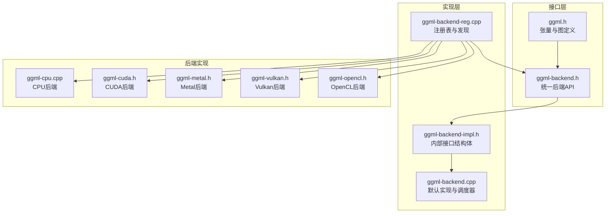
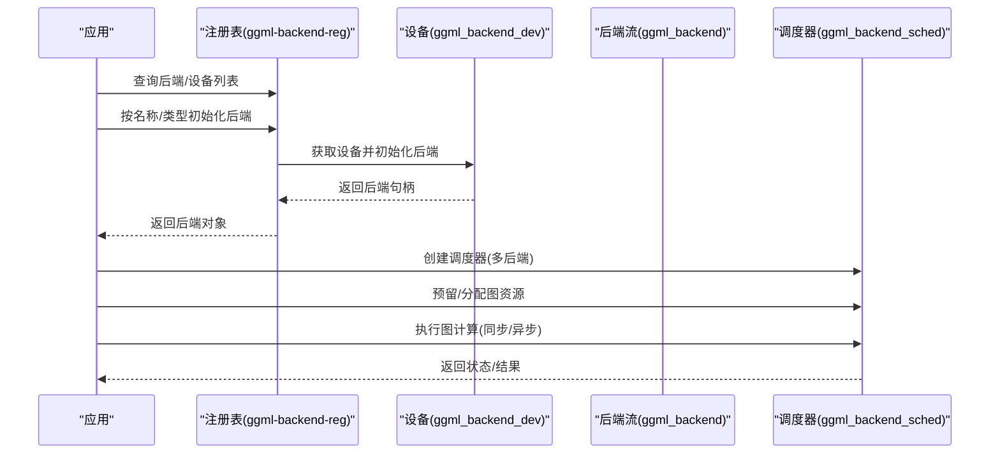
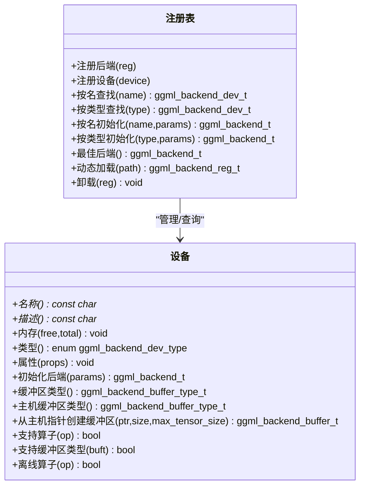
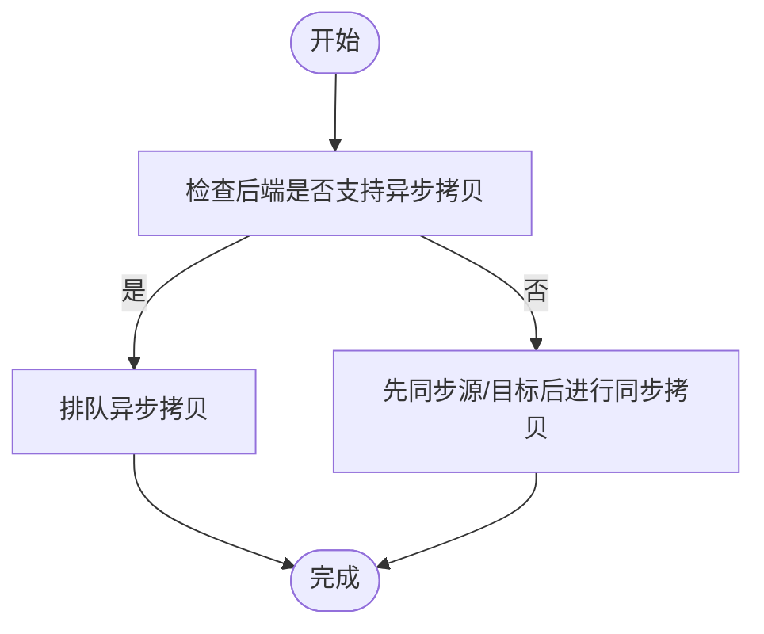
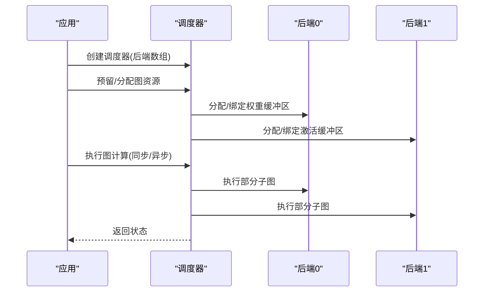
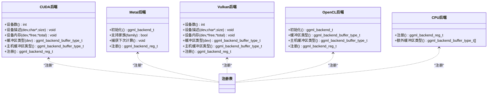
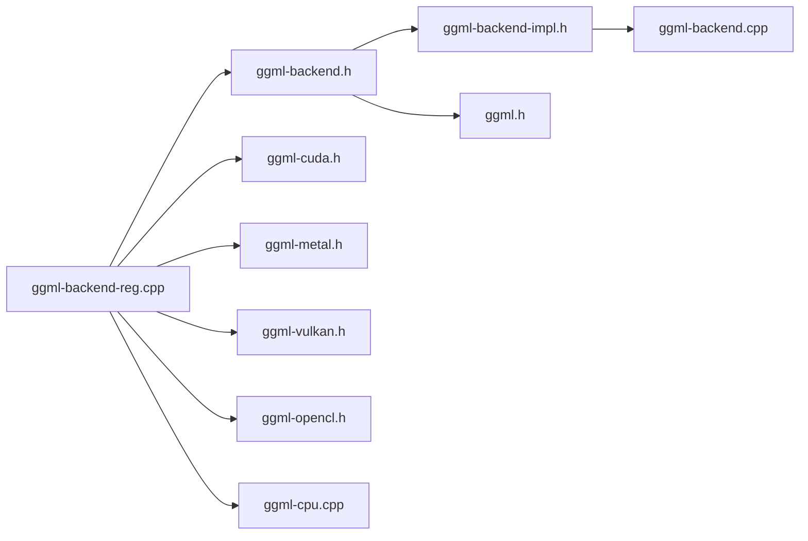

# 硬件后端抽象层

<cite>
**本文档引用的文件**
- [ggml-backend.h](file://ggml/include/ggml-backend.h)
- [ggml-backend.cpp](file://ggml/src/ggml-backend.cpp)
- [ggml-backend-impl.h](file://ggml/src/ggml-backend-impl.h)
- [ggml-backend-reg.cpp](file://ggml/src/ggml-backend-reg.cpp)
- [ggml.h](file://ggml/include/ggml.h)
- [ggml-cpu.cpp](file://ggml/src/ggml-cpu/ggml-cpu.cpp)
- [ggml-cuda.h](file://ggml/include/ggml-cuda.h)
- [ggml-metal.h](file://ggml/include/ggml-metal.h)
- [ggml-vulkan.h](file://ggml/include/ggml-vulkan.h)
- [ggml-opencl.h](file://ggml/include/ggml-opencl.h)
</cite>

## 目录
1. [简介](#简介)
2. [项目结构](#项目结构)
3. [核心组件](#核心组件)
4. [架构总览](#架构总览)
5. [详细组件分析](#详细组件分析)
6. [依赖关系分析](#依赖关系分析)
7. [性能考量](#性能考量)
8. [故障排除指南](#故障排除指南)
9. [结论](#结论)
10. [附录](#附录)

## 简介
本文件系统性阐述稳定扩散.cpp中的硬件后端抽象层设计与实现，重点覆盖以下方面：
- BackendManager 的统一抽象模型：如何通过设备、缓冲区类型、后端流（backend stream）与调度器实现多后端统一管理。
- 多后端支持机制：CUDA、Metal、Vulkan、OpenCL、SYCL 等后端的注册、发现与初始化流程。
- 设备检测与选择策略：最佳后端选择、按类型/名称初始化、动态加载与卸载。
- 性能特征与内存管理：主机/设备缓冲区、异步拷贝、事件同步、内存对齐与最大容量。
- 算子支持与数据传输：跨后端张量复制、图计算与计划、异步执行与同步。
- 动态配置与运行时切换：环境变量控制、动态库加载、后端评分与优先级。
- 调试与监控：日志、回调、事件记录与评估回调。

## 项目结构
后端抽象层位于 ggml 子模块中，采用“接口 + 实现 + 注册 + 动态加载”的分层设计：
- 接口层：ggml-backend.h 定义统一的后端 API，涵盖设备、缓冲区、后端流、事件与调度器。
- 实现层：ggml-backend.cpp 提供接口默认实现与调度器逻辑；ggml-backend-impl.h 定义内部接口结构体。
- 后端实现：各后端以独立模块存在，如 ggml-cpu、ggml-cuda、ggml-metal、ggml-vulkan、ggml-opencl 等，均通过注册函数暴露给注册表。
- 注册与发现：ggml-backend-reg.cpp 维护后端注册表，负责枚举设备、动态加载后端库、按名称/类型初始化后端。

**图表来源**
- [ggml-backend.h:1-374](file://ggml/include/ggml-backend.h#L1-L374)
- [ggml-backend.cpp:1-800](file://ggml/src/ggml-backend.cpp#L1-L800)
- [ggml-backend-impl.h:1-256](file://ggml/src/ggml-backend-impl.h#L1-L256)
- [ggml-backend-reg.cpp:1-566](file://ggml/src/ggml-backend-reg.cpp#L1-L566)
- [ggml.h:1-800](file://ggml/include/ggml.h#L1-L800)
- [ggml-cpu.cpp:1-200](file://ggml/src/ggml-cpu/ggml-cpu.cpp#L1-L200)
- [ggml-cuda.h:1-48](file://ggml/include/ggml-cuda.h#L1-L48)
- [ggml-metal.h:1-62](file://ggml/include/ggml-metal.h#L1-L62)
- [ggml-vulkan.h:1-30](file://ggml/include/ggml-vulkan.h#L1-L30)
- [ggml-opencl.h:1-27](file://ggml/include/ggml-opencl.h#L1-L27)

**章节来源**
- [ggml-backend.h:1-374](file://ggml/include/ggml-backend.h#L1-L374)
- [ggml-backend.cpp:1-800](file://ggml/src/ggml-backend.cpp#L1-L800)
- [ggml-backend-impl.h:1-256](file://ggml/src/ggml-backend-impl.h#L1-L256)
- [ggml-backend-reg.cpp:1-566](file://ggml/src/ggml-backend-reg.cpp#L1-L566)
- [ggml.h:1-800](file://ggml/include/ggml.h#L1-L800)

## 核心组件
- 设备（Device）：描述物理或逻辑设备属性（名称、类型、内存、能力），并可初始化后端流。
- 缓冲区类型（Buffer Type）：定义在特定设备上分配的内存类型，含对齐、最大大小、是否主机内存等。
- 缓冲区（Buffer）：具体内存块，支持清空、设置/获取张量数据、异步拷贝等。
- 后端流（Backend Stream）：封装计算图执行、异步操作、事件同步等。
- 事件（Event）：用于跨流/跨设备同步。
- 调度器（Scheduler）：多后端协同执行，负责节点到后端的分配、张量分割与拷贝、流水线并行与复制。

**章节来源**
- [ggml-backend.h:130-183](file://ggml/include/ggml-backend.h#L130-L183)
- [ggml-backend.h:24-68](file://ggml/include/ggml-backend.h#L24-L68)
- [ggml-backend.h:77-125](file://ggml/include/ggml-backend.h#L77-L125)
- [ggml-backend.h:294-342](file://ggml/include/ggml-backend.h#L294-L342)
- [ggml-backend.cpp:478-551](file://ggml/src/ggml-backend.cpp#L478-L551)

## 架构总览
后端抽象层通过“注册表 + 设备 + 后端流 + 调度器”形成统一入口，支持动态加载与按需初始化。下图展示从应用到后端的调用链路：

**图表来源**
- [ggml-backend-reg.cpp:339-364](file://ggml/src/ggml-backend-reg.cpp#L339-L364)
- [ggml-backend.h:218-247](file://ggml/include/ggml-backend.h#L218-L247)
- [ggml-backend.h:294-342](file://ggml/include/ggml-backend.h#L294-L342)

## 详细组件分析

### 设备与后端注册表
- 注册表维护已加载后端与设备列表，支持按名称/类型查找设备，按类型初始化后端，以及动态加载后端库。
- 支持通过环境变量禁用特定后端（如 Vulkan）。
- 提供“最佳后端”选择：优先 GPU/IGPU，否则回退到 CPU。

**图表来源**
- [ggml-backend-reg.cpp:102-192](file://ggml/src/ggml-backend-reg.cpp#L102-L192)
- [ggml-backend-reg.cpp:339-364](file://ggml/src/ggml-backend-reg.cpp#L339-L364)
- [ggml-backend.h:173-183](file://ggml/include/ggml-backend.h#L173-L183)

**章节来源**
- [ggml-backend-reg.cpp:102-192](file://ggml/src/ggml-backend-reg.cpp#L102-L192)
- [ggml-backend-reg.cpp:339-364](file://ggml/src/ggml-backend-reg.cpp#L339-L364)
- [ggml-backend.h:173-183](file://ggml/include/ggml-backend.h#L173-L183)

### 后端流与缓冲区
- 后端流提供张量设置/获取、异步拷贝、图计算与同步等能力。
- 缓冲区类型定义对齐、最大容量、是否主机内存等；缓冲区支持清空、张量初始化、内存填充与拷贝。
- 张量拷贝支持同后端与跨后端，若后端不支持异步拷贝则回退为同步拷贝。

**图表来源**
- [ggml-backend.cpp:412-431](file://ggml/src/ggml-backend.cpp#L412-L431)

**章节来源**
- [ggml-backend.cpp:214-385](file://ggml/src/ggml-backend.cpp#L214-L385)
- [ggml-backend.cpp:412-431](file://ggml/src/ggml-backend.cpp#L412-L431)
- [ggml-backend.h:24-68](file://ggml/include/ggml-backend.h#L24-L68)

### 调度器与图执行
- 调度器支持多后端、张量分割、输入复制、流水线并行与事件同步。
- 支持为每个节点设置评估回调，便于观测与调试。
- 提供“保留/分配/计算图”的完整生命周期管理。

**图表来源**
- [ggml-backend.h:294-342](file://ggml/include/ggml-backend.h#L294-L342)
- [ggml-backend.cpp:659-737](file://ggml/src/ggml-backend.cpp#L659-L737)

**章节来源**
- [ggml-backend.h:294-342](file://ggml/include/ggml-backend.h#L294-L342)
- [ggml-backend.cpp:659-737](file://ggml/src/ggml-backend.cpp#L659-L737)

### 多后端支持与初始化流程
- CUDA：通过 ggml-cuda.h 暴露设备数量、描述、内存、缓冲区类型与注册函数。
- Metal：通过 ggml-metal.h 暴露初始化、家族支持、捕获命令缓冲等。
- Vulkan：通过 ggml-vulkan.h 暴露设备数量、描述、内存、缓冲区类型与注册函数。
- OpenCL：通过 ggml-opencl.h 暴露初始化、缓冲区类型与注册函数。
- CPU：作为通用回退后端，提供额外缓冲区类型与线程池支持。

**图表来源**
- [ggml-cuda.h:1-48](file://ggml/include/ggml-cuda.h#L1-L48)
- [ggml-metal.h:1-62](file://ggml/include/ggml-metal.h#L1-L62)
- [ggml-vulkan.h:1-30](file://ggml/include/ggml-vulkan.h#L1-L30)
- [ggml-opencl.h:1-27](file://ggml/include/ggml-opencl.h#L1-L27)
- [ggml-cpu.cpp:1-200](file://ggml/src/ggml-cpu/ggml-cpu.cpp#L1-L200)

**章节来源**
- [ggml-cuda.h:1-48](file://ggml/include/ggml-cuda.h#L1-L48)
- [ggml-metal.h:1-62](file://ggml/include/ggml-metal.h#L1-L62)
- [ggml-vulkan.h:1-30](file://ggml/include/ggml-vulkan.h#L1-L30)
- [ggml-opencl.h:1-27](file://ggml/include/ggml-opencl.h#L1-L27)
- [ggml-cpu.cpp:1-200](file://ggml/src/ggml-cpu/ggml-cpu.cpp#L1-L200)

### 设备检测与选择策略
- 按类型选择：优先 GPU/IGPU，否则使用 CPU。
- 按名称选择：根据设备名称精确匹配。
- 动态加载：扫描目录，按“ggml-后端名-*.so/.dll”匹配，调用 ggml_backend_score 评分，选择最高分后端。
- 环境变量：如 GGML_DISABLE_VULKAN 可禁用 Vulkan 后端；GGML_BACKEND_PATH 可指定外部后端路径。

**章节来源**
- [ggml-backend-reg.cpp:355-364](file://ggml/src/ggml-backend-reg.cpp#L355-L364)
- [ggml-backend-reg.cpp:454-533](file://ggml/src/ggml-backend-reg.cpp#L454-L533)
- [ggml-backend-reg.cpp:539-565](file://ggml/src/ggml-backend-reg.cpp#L539-L565)

### 性能特征与内存管理
- 设备能力：异步操作、主机固定缓冲、从主机指针创建缓冲、事件同步等。
- 缓冲区对齐与容量：不同后端可能有不同的对齐要求与最大容量限制。
- 主机/设备缓冲：主机固定缓冲可提升 CPU-GPU 传输效率；设备缓冲用于高吞吐计算。
- 异步与同步：后端流支持异步图计算与事件等待；必要时可强制同步。

**章节来源**
- [ggml-backend.h:142-151](file://ggml/include/ggml-backend.h#L142-L151)
- [ggml-backend.h:38-43](file://ggml/include/ggml-backend.h#L38-L43)
- [ggml-backend.h:86-94](file://ggml/include/ggml-backend.h#L86-L94)

### 算子支持与数据传输
- 算子支持：设备/后端可声明是否支持某算子或某类缓冲区。
- 跨后端拷贝：若后端不支持异步拷贝，则先同步再进行同步拷贝。
- 图计算：支持创建/释放计算图计划、批量执行与同步。

**章节来源**
- [ggml-backend.h:104-106](file://ggml/include/ggml-backend.h#L104-L106)
- [ggml-backend.cpp:412-431](file://ggml/src/ggml-backend.cpp#L412-L431)
- [ggml-backend.cpp:335-365](file://ggml/src/ggml-backend.cpp#L335-L365)

### 动态配置与运行时切换
- 动态加载：支持从指定目录扫描并加载后端动态库，自动调用 ggml_backend_init 与 ggml_backend_score。
- 运行时切换：通过重新初始化后端或更换调度器后端列表实现切换。
- 回调与日志：支持中止回调、事件记录、评估回调与调试日志。

**章节来源**
- [ggml-backend-reg.cpp:194-238](file://ggml/src/ggml-backend-reg.cpp#L194-L238)
- [ggml-backend.h:340-342](file://ggml/include/ggml-backend.h#L340-L342)

## 依赖关系分析
- 接口依赖：所有后端实现均依赖 ggml-backend.h 与 ggml.h。
- 内部实现：ggml-backend.cpp 依赖 ggml-backend-impl.h 与 ggml-impl.h。
- 注册表：动态加载后端库，调用其导出的 ggml_backend_init 与 ggml_backend_score。
- 后端实现：各自包含独立的注册函数与设备/缓冲区接口。

**图表来源**
- [ggml-backend.h:1-374](file://ggml/include/ggml-backend.h#L1-L374)
- [ggml-backend-impl.h:1-256](file://ggml/src/ggml-backend-impl.h#L1-L256)
- [ggml-backend.cpp:1-800](file://ggml/src/ggml-backend.cpp#L1-L800)
- [ggml-backend-reg.cpp:1-566](file://ggml/src/ggml-backend-reg.cpp#L1-L566)
- [ggml.h:1-800](file://ggml/include/ggml.h#L1-L800)
- [ggml-cuda.h:1-48](file://ggml/include/ggml-cuda.h#L1-L48)
- [ggml-metal.h:1-62](file://ggml/include/ggml-metal.h#L1-L62)
- [ggml-vulkan.h:1-30](file://ggml/include/ggml-vulkan.h#L1-L30)
- [ggml-opencl.h:1-27](file://ggml/include/ggml-opencl.h#L1-L27)
- [ggml-cpu.cpp:1-200](file://ggml/src/ggml-cpu/ggml-cpu.cpp#L1-L200)

**章节来源**
- [ggml-backend.h:1-374](file://ggml/include/ggml-backend.h#L1-L374)
- [ggml-backend.cpp:1-800](file://ggml/src/ggml-backend.cpp#L1-L800)
- [ggml-backend-impl.h:1-256](file://ggml/src/ggml-backend-impl.h#L1-L256)
- [ggml-backend-reg.cpp:1-566](file://ggml/src/ggml-backend-reg.cpp#L1-L566)
- [ggml.h:1-800](file://ggml/include/ggml.h#L1-L800)

## 性能考量
- 优先使用 GPU/IGPU 后端，回退到 CPU。
- 使用主机固定缓冲区提升 CPU-GPU 传输带宽。
- 合理设置线程数与工作区内存，避免频繁分配。
- 利用调度器的图预留与复用，减少重复分配开销。
- 在需要时启用异步拷贝与事件同步，降低同步阻塞。

[本节为通用指导，无需列出具体文件来源]

## 故障排除指南
- 后端未加载：检查动态库路径与文件命名规范，确认 ggml_backend_init 与 ggml_backend_score 符号存在且版本兼容。
- Vulkan 被禁用：检查 GGML_DISABLE_VULKAN 环境变量是否设置。
- 设备不可用：确认设备名称/类型正确，查看设备描述与内存信息。
- 性能异常：检查是否使用了主机固定缓冲区、是否启用了异步拷贝与事件同步。
- 调试：启用调试日志，使用评估回调观察节点执行，必要时捕获 Metal 命令缓冲。

**章节来源**
- [ggml-backend-reg.cpp:194-238](file://ggml/src/ggml-backend-reg.cpp#L194-L238)
- [ggml-backend-reg.cpp:539-565](file://ggml/src/ggml-backend-reg.cpp#L539-L565)
- [ggml-metal.h:54-55](file://ggml/include/ggml-metal.h#L54-L55)

## 结论
稳定扩散.cpp 的硬件后端抽象层通过统一的设备/缓冲区/后端流/调度器接口，实现了对 CUDA、Metal、Vulkan、OpenCL、SYCL 等后端的无缝集成。借助注册表与动态加载机制，系统可在运行时灵活选择与切换后端，结合调度器实现高效的多后端协同计算。通过合理的内存管理与异步策略，可在不同平台上获得稳定的性能表现。

[本节为总结性内容，无需列出具体文件来源]

## 附录
- 配置指南
  - 环境变量：GGML_DISABLE_VULKAN（禁用 Vulkan）、GGML_BACKEND_PATH（外部后端路径）
  - 初始化方式：按名称、按类型、最佳后端自动选择
- 性能优化建议
  - 优先使用 GPU/IGPU 后端
  - 启用主机固定缓冲区
  - 合理设置线程数与工作区内存
  - 使用调度器预留与复用
- 故障排除
  - 检查后端动态库加载与符号导出
  - 核对设备名称/类型与描述
  - 使用调试日志与评估回调定位问题

**章节来源**
- [ggml-backend-reg.cpp:539-565](file://ggml/src/ggml-backend-reg.cpp#L539-L565)
- [ggml-backend.h:233-247](file://ggml/include/ggml-backend.h#L233-L247)