# 组件架构设计

<cite>
**本文档引用的文件**
- [diffusion_model.hpp](file://src/diffusion_model.hpp)
- [vae.hpp](file://src/vae.hpp)
- [clip.hpp](file://src/clip.hpp)
- [unet.hpp](file://src/unet.hpp)
- [conditioner.hpp](file://src/conditioner.hpp)
- [common_block.hpp](file://src/common_block.hpp)
- [ggml_extend.hpp](file://src/ggml_extend.hpp)
- [stable-diffusion.h](file://include/stable-diffusion.h)
- [model.h](file://src/model.h)
</cite>

## 目录
1. [引言](#引言)
2. [项目结构](#项目结构)
3. [核心组件](#核心组件)
4. [架构概览](#架构概览)
5. [详细组件分析](#详细组件分析)
6. [依赖分析](#依赖分析)
7. [性能考虑](#性能考虑)
8. [故障排除指南](#故障排除指南)
9. [结论](#结论)
10. [附录](#附录)

## 引言

稳定扩散.cpp是一个基于C++实现的稳定扩散模型推理引擎，采用模块化架构设计，支持多种扩散模型变体（SD1.x、SD2.x、SDXL、SD3.0、FLUX等）。该系统通过统一的组件接口实现了高度的可插拔性和扩展性，为不同硬件平台提供了优化的执行路径。

本技术文档深入分析了系统的组件架构设计，包括DiffusionModel、VAE、CLIP、UNet、Conditioner等核心组件的设计模式和职责分工，阐述了组件间的依赖关系、接口设计和通信机制。

## 项目结构

项目采用分层模块化架构，主要目录结构如下：

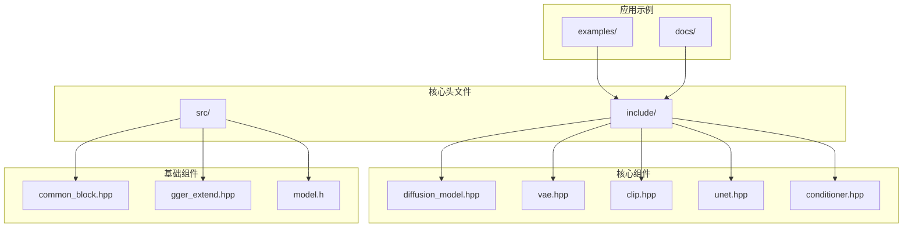

**图表来源**
- [diffusion_model.hpp:1-518](file://src/diffusion_model.hpp#L1-L518)
- [vae.hpp:1-775](file://src/vae.hpp#L1-L775)
- [clip.hpp:1-800](file://src/clip.hpp#L1-L800)

**章节来源**
- [diffusion_model.hpp:1-50](file://src/diffusion_model.hpp#L1-L50)
- [vae.hpp:1-50](file://src/vae.hpp#L1-L50)
- [clip.hpp:1-50](file://src/clip.hpp#L1-L50)

## 核心组件

### DiffusionModel抽象层

DiffusionModel作为所有扩散模型的抽象基类，定义了统一的接口规范：

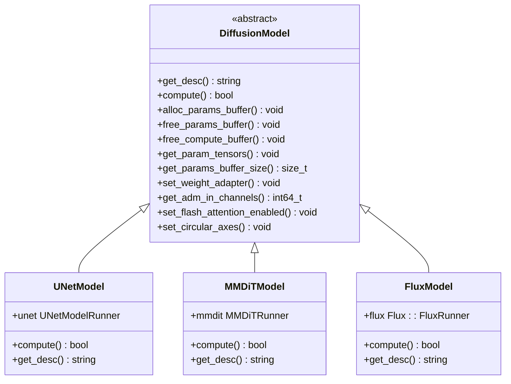

**图表来源**
- [diffusion_model.hpp:29-44](file://src/diffusion_model.hpp#L29-L44)

### VAE变分自编码器

VAE组件实现了图像的编码和解码功能，支持多种变体：

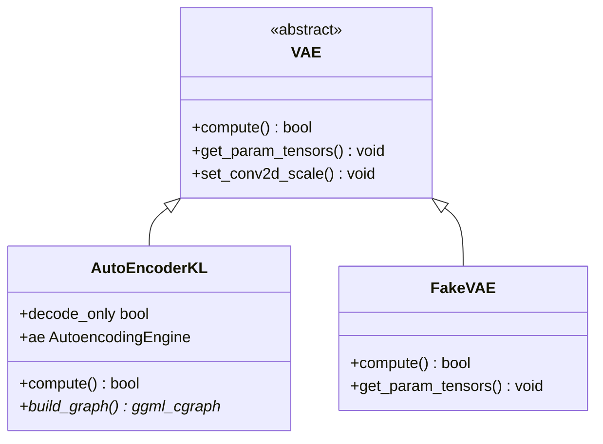

**图表来源**
- [vae.hpp:615-625](file://src/vae.hpp#L615-L625)

### CLIP文本编码器

CLIP组件提供了多模态文本-图像嵌入功能：

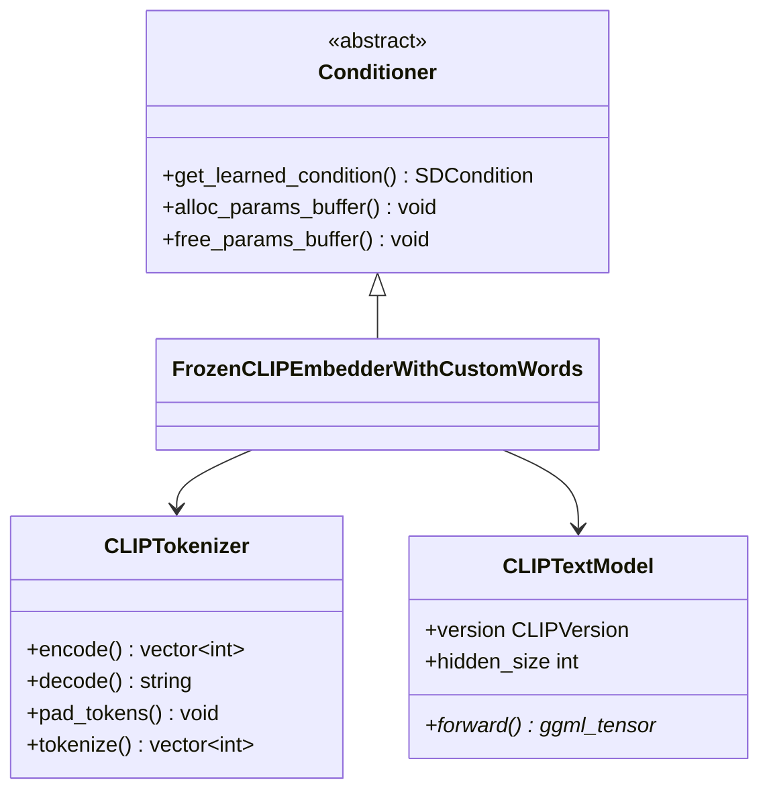

**图表来源**
- [clip.hpp:41-800](file://src/clip.hpp#L41-L800)
- [conditioner.hpp:34-53](file://src/conditioner.hpp#L34-L53)

**章节来源**
- [diffusion_model.hpp:12-44](file://src/diffusion_model.hpp#L12-L44)
- [vae.hpp:615-775](file://src/vae.hpp#L615-L775)
- [clip.hpp:456-800](file://src/clip.hpp#L456-L800)
- [conditioner.hpp:34-137](file://src/conditioner.hpp#L34-L137)

## 架构概览

系统采用分层架构设计，实现了清晰的职责分离和模块化：

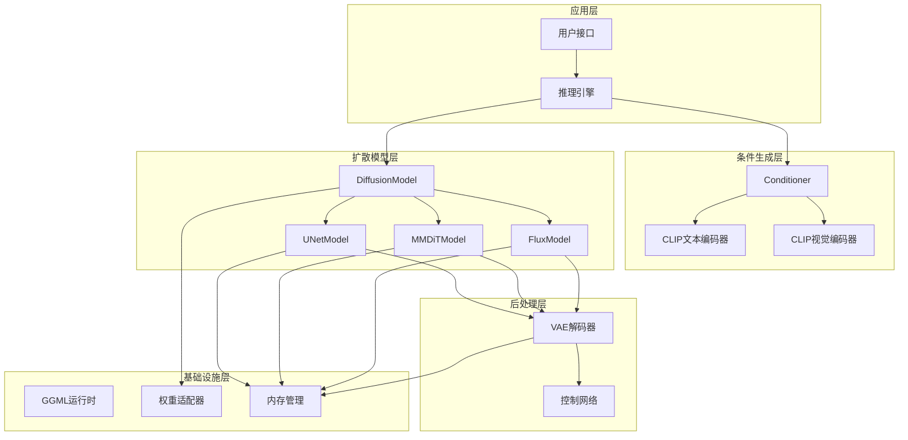

**图表来源**
- [diffusion_model.hpp:29-518](file://src/diffusion_model.hpp#L29-L518)
- [conditioner.hpp:34-2155](file://src/conditioner.hpp#L34-L2155)
- [vae.hpp:615-775](file://src/vae.hpp#L615-L775)

## 详细组件分析

### UNet扩散模型

UNet是稳定扩散的核心扩散模型组件，实现了条件去噪过程：

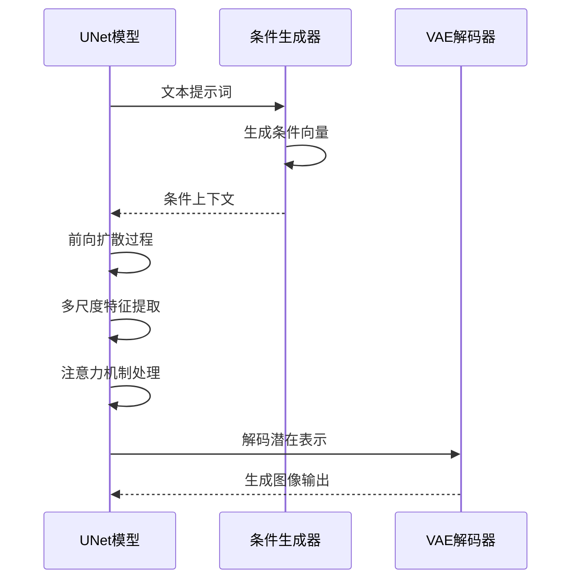

**图表来源**
- [unet.hpp:592-719](file://src/unet.hpp#L592-L719)

UNet的关键特性包括：

1. **多尺度特征处理**：支持从低分辨率到高分辨率的特征金字塔
2. **注意力机制**：在多个尺度上应用自注意力和交叉注意力
3. **时间步嵌入**：处理扩散过程中的时间步信息
4. **条件融合**：整合文本和图像条件信息

**章节来源**
- [unet.hpp:167-590](file://src/unet.hpp#L167-L590)

### VAE变分自编码器

VAE组件实现了图像的潜在空间编码和解码：

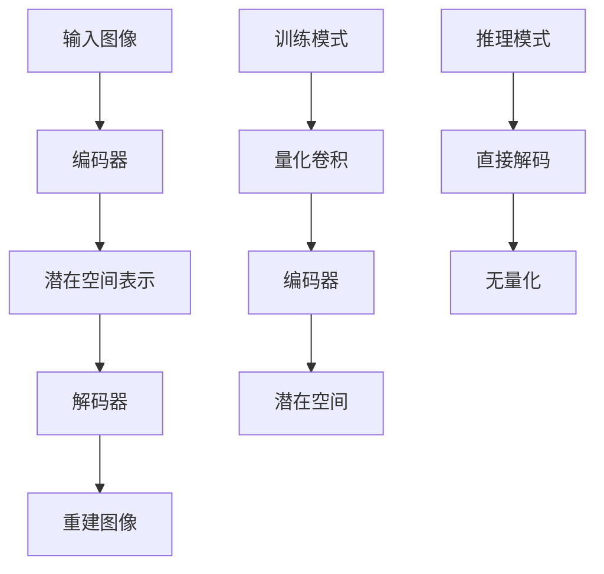

**图表来源**
- [vae.hpp:486-613](file://src/vae.hpp#L486-L613)

VAE的主要功能：

1. **图像编码**：将RGB图像转换为潜在空间表示
2. **图像解码**：从潜在空间重建RGB图像
3. **视频处理**：支持视频序列的时空编码
4. **量化优化**：在某些模型中使用量化以减少内存占用

**章节来源**
- [vae.hpp:265-613](file://src/vae.hpp#L265-L613)

### CLIP多模态编码器

CLIP组件提供了强大的多模态理解能力：

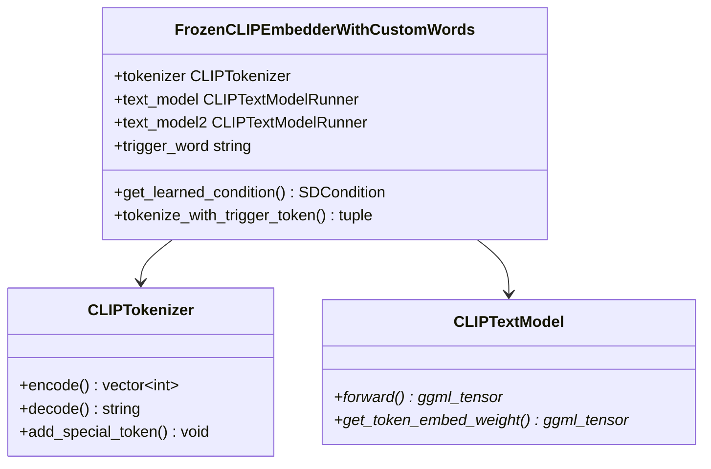

**图表来源**
- [conditioner.hpp:57-651](file://src/conditioner.hpp#L57-L651)
- [clip.hpp:458-773](file://src/clip.hpp#L458-L773)

**章节来源**
- [conditioner.hpp:57-651](file://src/conditioner.hpp#L57-L651)
- [clip.hpp:458-773](file://src/clip.hpp#L458-L773)

### 条件生成器

条件生成器负责将用户输入转换为模型可理解的条件向量：

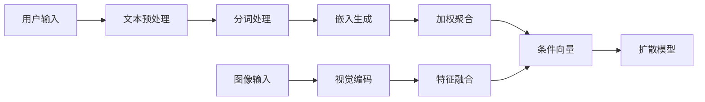

**图表来源**
- [conditioner.hpp:429-585](file://src/conditioner.hpp#L429-L585)

**章节来源**
- [conditioner.hpp:34-585](file://src/conditioner.hpp#L34-L585)

## 依赖分析

系统采用松耦合设计，通过接口抽象实现组件间的解耦：

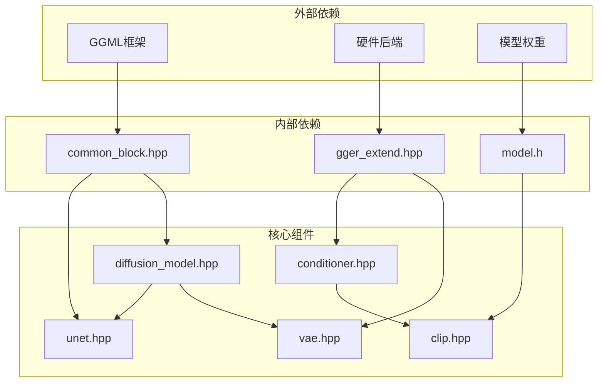

**图表来源**
- [diffusion_model.hpp:4-10](file://src/diffusion_model.hpp#L4-L10)
- [common_block.hpp:1-5](file://src/common_block.hpp#L1-L5)
- [ggml_extend.hpp:24-52](file://src/ggml_extend.hpp#L24-L52)

**章节来源**
- [diffusion_model.hpp:4-10](file://src/diffusion_model.hpp#L4-L10)
- [common_block.hpp:1-5](file://src/common_block.hpp#L1-L5)
- [ggml_extend.hpp:24-52](file://src/ggml_extend.hpp#L24-L52)

## 性能考虑

系统在设计时充分考虑了性能优化：

### 内存管理
- **参数缓冲区**：支持参数张量的集中管理
- **计算图优化**：最小化中间结果的内存占用
- **内存对齐**：优化数据布局以提高缓存命中率

### 并行计算
- **多线程支持**：利用多核CPU进行并行计算
- **硬件加速**：支持CUDA、Metal、Vulkan等多种后端
- **批处理优化**：支持批量推理以提高吞吐量

### 模型优化
- **量化支持**：在保持精度的同时减少内存占用
- **混合精度**：根据硬件能力选择合适的精度
- **动态图构建**：按需构建计算图以减少开销

## 故障排除指南

### 常见问题诊断

1. **内存不足**
   - 检查模型大小和硬件内存容量
   - 启用参数离线加载功能
   - 调整批处理大小

2. **推理速度慢**
   - 确认硬件后端正确配置
   - 检查是否启用了适当的优化选项
   - 验证模型权重格式

3. **结果质量差**
   - 确认输入图像预处理正确
   - 检查提示词格式和长度
   - 验证模型版本兼容性

### 调试工具

系统提供了丰富的调试和测试功能：

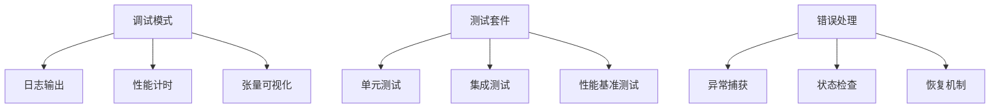

**章节来源**
- [vae.hpp:727-772](file://src/vae.hpp#L727-L772)
- [unet.hpp:676-716](file://src/unet.hpp#L676-L716)

## 结论

稳定扩散.cpp的组件架构设计体现了现代深度学习推理引擎的最佳实践。通过抽象接口、模块化设计和可插拔架构，系统实现了高度的灵活性和可扩展性。

关键设计优势：
1. **清晰的职责分离**：每个组件都有明确的功能边界
2. **统一的接口规范**：简化了组件间的集成
3. **灵活的扩展机制**：支持新模型类型的快速接入
4. **高性能优化**：针对不同硬件平台进行了专门优化

该架构为后续的功能扩展和性能优化奠定了坚实的基础。

## 附录

### 开发指南

1. **组件开发流程**
   - 定义抽象接口
   - 实现具体组件
   - 编写单元测试
   - 集成到主系统

2. **接口规范**
   - 遵循现有的抽象层次
   - 保持接口的一致性
   - 提供完整的错误处理

3. **最佳实践**
   - 使用RAII管理资源
   - 实现智能指针管理
   - 提供详细的日志记录

### 测试策略

系统采用多层次的测试策略：

1. **单元测试**：验证单个组件的功能正确性
2. **集成测试**：测试组件间的协作
3. **性能测试**：评估推理速度和资源使用
4. **回归测试**：确保更新不影响现有功能