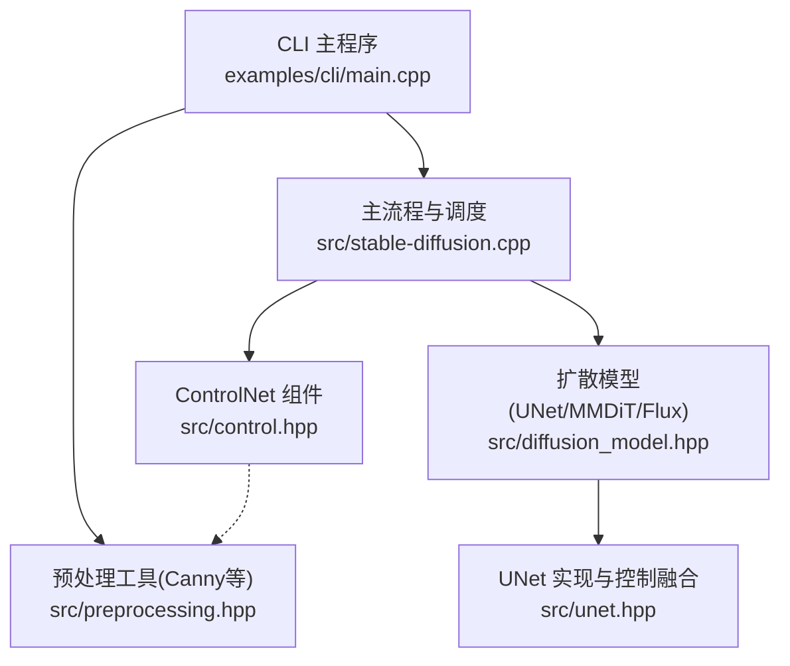
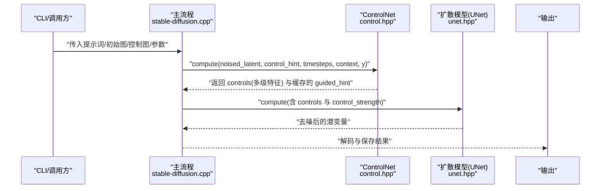
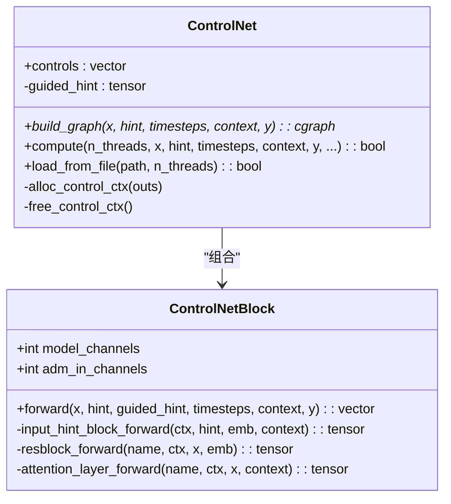
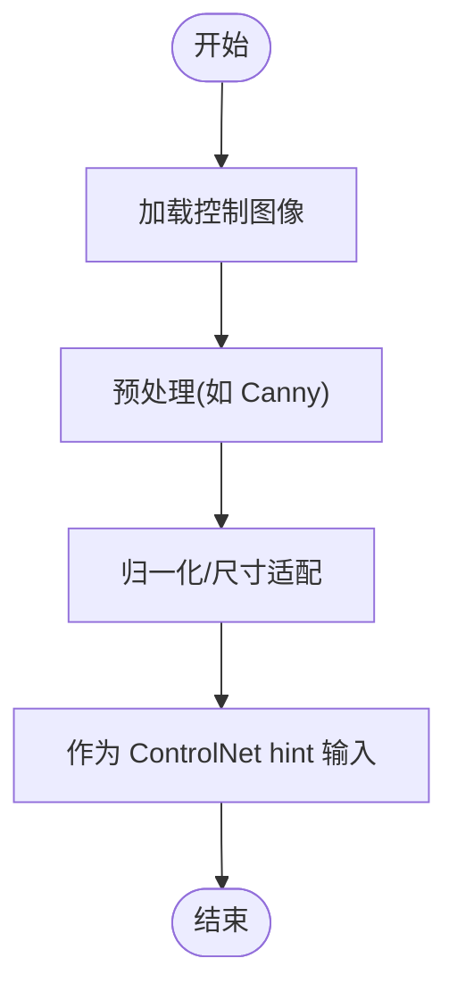
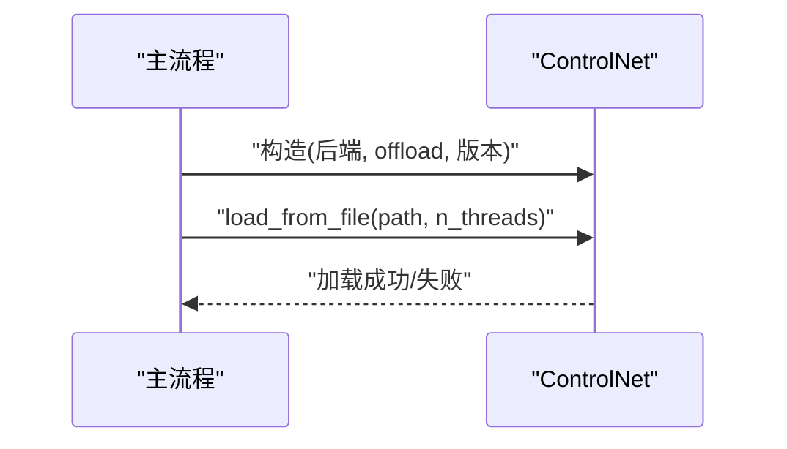
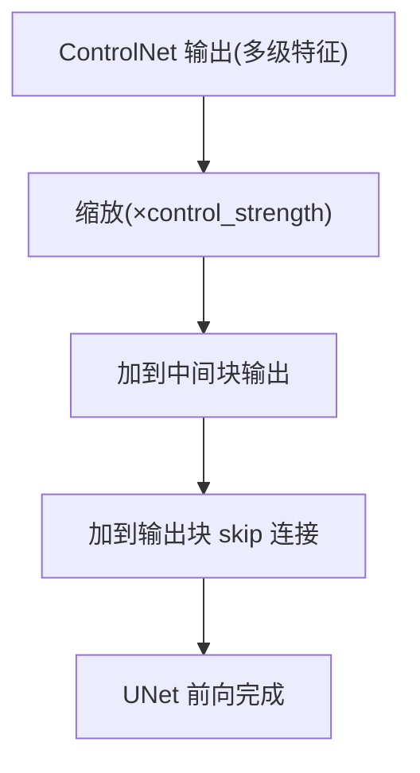
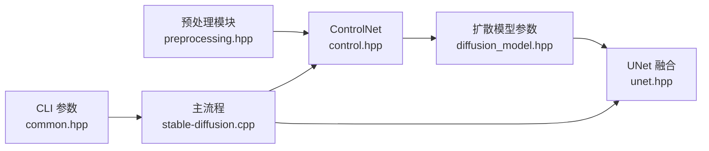

# ControlNet控制

<cite>
**本文引用的文件**
- [src/control.hpp](file://src/control.hpp)
- [src/preprocessing.hpp](file://src/preprocessing.hpp)
- [examples/cli/main.cpp](file://examples/cli/main.cpp)
- [src/stable-diffusion.cpp](file://src/stable-diffusion.cpp)
- [src/diffusion_model.hpp](file://src/diffusion_model.hpp)
- [src/unet.hpp](file://src/unet.hpp)
- [examples/common/common.hpp](file://examples/common/common.hpp)
</cite>

## 目录
1. [简介](#简介)
2. [项目结构与定位](#项目结构与定位)
3. [核心组件](#核心组件)
4. [架构总览](#架构总览)
5. [详细组件分析](#详细组件分析)
6. [依赖关系分析](#依赖关系分析)
7. [性能考量](#性能考量)
8. [故障排查指南](#故障排查指南)
9. [结论](#结论)
10. [附录：参数与用法速查](#附录参数与用法速查)

## 简介
本文件系统性阐述 stable-diffusion.cpp 中的 ControlNet 控制功能，涵盖 ControlNet 技术原理、支持的控制类型与预处理方法、模型加载与配置流程、控制参数设置指南、完整使用示例路径、对生成质量与速度的影响，以及优化与调试技巧。目标是帮助开发者与使用者快速理解并正确应用 ControlNet。

## 项目结构与定位
- ControlNet 的核心实现位于 src/control.hpp，定义了 ControlNetBlock 与 ControlNet 类，负责构建控制网络图、缓存中间特征、执行推理。
- 预处理模块 src/preprocessing.hpp 提供边缘检测（Canny）等常用控制输入预处理函数，便于将输入图像转换为合适的控制信号。
- 在主流程 src/stable-diffusion.cpp 中，ControlNet 作为可选组件被加载与调用，与扩散模型（UNet/MMDiT/Flux）协同工作，将 ControlNet 输出按步注入到去噪过程中。
- 参数与接口定义分布在 src/diffusion_model.hpp（扩散参数结构）、src/unet.hpp（UNet 中对 ControlNet 控制的融合逻辑）、examples/common/common.hpp（CLI 参数入口）与 examples/cli/main.cpp（示例调用链）。

**图表来源**
- [examples/cli/main.cpp:642-671](file://examples/cli/main.cpp#L642-L671)
- [src/stable-diffusion.cpp:2082-2100](file://src/stable-diffusion.cpp#L2082-L2100)
- [src/control.hpp:309-463](file://src/control.hpp#L309-L463)
- [src/unet.hpp:530-547](file://src/unet.hpp#L530-L547)

**章节来源**
- [src/control.hpp:14-307](file://src/control.hpp#L14-L307)
- [src/preprocessing.hpp:165-224](file://src/preprocessing.hpp#L165-L224)
- [src/stable-diffusion.cpp:2082-2100](file://src/stable-diffusion.cpp#L2082-L2100)
- [src/diffusion_model.hpp:15-27](file://src/diffusion_model.hpp#L15-L27)
- [src/unet.hpp:530-547](file://src/unet.hpp#L530-L547)
- [examples/cli/main.cpp:642-671](file://examples/cli/main.cpp#L642-L671)

## 核心组件
- ControlNetBlock：实现 ControlNet 的前向计算，包含时间嵌入、条件嵌入、输入块、注意力层、零初始化卷积与中间块输出；支持从 hint 图像提取引导特征 guided_hint 并将其与主输入 latents 融合。
- ControlNet：封装 ControlNetBlock，负责构建计算图、缓存中间张量、加载权重、执行推理；支持缓存 guided_hint 以加速重复步的计算。
- 预处理模块：提供 Canny 边缘检测等预处理函数，将彩色图像转换为单通道控制图。
- 扩散模型与控制融合：在 UNet 前向中，将 ControlNet 输出按步缩放并加回到中间特征与输出块，实现逐层控制。

**章节来源**
- [src/control.hpp:14-307](file://src/control.hpp#L14-L307)
- [src/control.hpp:309-463](file://src/control.hpp#L309-L463)
- [src/preprocessing.hpp:165-224](file://src/preprocessing.hpp#L165-L224)
- [src/unet.hpp:530-547](file://src/unet.hpp#L530-L547)

## 架构总览
ControlNet 在生成流程中的作用是：在每一步去噪前，先用 ControlNet 对控制图像进行编码，得到一系列中间特征；随后将这些特征按比例（控制强度）加回到 UNet 的对应层级，从而在空间与通道维度上约束生成过程。

**图表来源**
- [src/stable-diffusion.cpp:2082-2100](file://src/stable-diffusion.cpp#L2082-L2100)
- [src/control.hpp:377-414](file://src/control.hpp#L377-L414)
- [src/unet.hpp:612-674](file://src/unet.hpp#L612-L674)

## 详细组件分析

### ControlNetBlock 与 ControlNet 类
- 结构要点
  - 时间嵌入与条件嵌入：根据版本调整上下文维度与注意力头数。
  - 输入提示分支：通过若干卷积与激活构成 hint 编码器，输出 guided_hint。
  - 主干网络：包含若干 ResBlock、可选注意力层与零初始化卷积，输出多级特征。
  - 前向：将 guided_hint 与输入 latents 相加，再逐级输出用于后续融合的控制特征。
- 关键行为
  - 缓存 guided_hint：首次计算后复用，减少重复计算。
  - 张量对齐：自动重复 context/y 到与输入 batch 一致。
  - 计算图构建：将输出复制到控制上下文，以便 UNet 读取。

**图表来源**
- [src/control.hpp:14-307](file://src/control.hpp#L14-L307)
- [src/control.hpp:309-463](file://src/control.hpp#L309-L463)

**章节来源**
- [src/control.hpp:14-307](file://src/control.hpp#L14-L307)
- [src/control.hpp:309-463](file://src/control.hpp#L309-L463)

### 预处理与控制类型
- 支持的控制类型与处理
  - 边缘检测（Canny）：将输入图像转换为二值边缘图，适合轮廓与线条控制。
  - 深度图：可通过外部深度估计模型生成，作为控制信号输入（需自行准备）。
  - 语义分割：可通过外部分割模型生成类别掩码，作为控制信号输入（需自行准备）。
  - 其他：姿态、正常图、线稿等，均可通过相应预处理转换为单通道或三通道控制图。
- 预处理函数
  - Canny 预处理：高斯平滑、Sobel 梯度、非极大值抑制、双阈值与滞后连接、可选反色输出。
  - 参考路径：[src/preprocessing.hpp:165-224](file://src/preprocessing.hpp#L165-L224)

**图表来源**
- [src/preprocessing.hpp:165-224](file://src/preprocessing.hpp#L165-L224)
- [examples/cli/main.cpp:642-671](file://examples/cli/main.cpp#L642-L671)

**章节来源**
- [src/preprocessing.hpp:165-224](file://src/preprocessing.hpp#L165-L224)
- [examples/cli/main.cpp:642-671](file://examples/cli/main.cpp#L642-L671)

### 模型加载与配置
- 加载流程
  - 初始化 ControlNet（可指定后端与是否将参数卸载到 CPU）。
  - 从文件加载权重，内部通过名称映射与张量装载完成。
- 关键点
  - 支持将 ControlNet 参数放在 CPU 后端以节省显存（当主模型在 GPU 时）。
  - 支持启用直连卷积（Conv2d direct）以提升性能。
  - 支持设置循环轴（circular_x/circular_y）以适配特定需求。

**图表来源**
- [src/stable-diffusion.cpp:676-690](file://src/stable-diffusion.cpp#L676-L690)
- [src/stable-diffusion.cpp:835-841](file://src/stable-diffusion.cpp#L835-L841)
- [src/control.hpp:440-462](file://src/control.hpp#L440-L462)

**章节来源**
- [src/stable-diffusion.cpp:676-690](file://src/stable-diffusion.cpp#L676-L690)
- [src/stable-diffusion.cpp:835-841](file://src/stable-diffusion.cpp#L835-L841)
- [src/control.hpp:440-462](file://src/control.hpp#L440-L462)

### 控制参数设置与使用
- 关键参数
  - 控制强度（control_strength）：控制 ControlNet 特征对 UNet 的影响程度，默认值见 CLI 参数定义。
  - 控制图像/视频路径：分别通过命令行参数传入。
  - 预处理开关：例如 Canny 预处理开关。
- 参数入口与默认值
  - 控制图像路径与强度：参见 CLI 参数定义与默认值。
  - 参考路径：
    - [examples/common/common.hpp:1033](file://examples/common/common.hpp#L1033)
    - [examples/common/common.hpp:1060](file://examples/common/common.hpp#L1060)
    - [examples/common/common.hpp:1106-1114](file://examples/common/common.hpp#L1106-L1114)
    - [examples/common/common.hpp:1590](file://examples/common/common.hpp#L1590)
    - [examples/common/common.hpp:1971-1996](file://examples/common/common.hpp#L1971-L1996)
- 使用示例（路径）
  - CLI 示例中加载控制图像并可选进行 Canny 预处理，随后调用生成流程。
  - 参考路径：[examples/cli/main.cpp:642-671](file://examples/cli/main.cpp#L642-L671)

**章节来源**
- [examples/common/common.hpp:1033](file://examples/common/common.hpp#L1033)
- [examples/common/common.hpp:1060](file://examples/common/common.hpp#L1060)
- [examples/common/common.hpp:1106-1114](file://examples/common/common.hpp#L1106-L1114)
- [examples/common/common.hpp:1590](file://examples/common/common.hpp#L1590)
- [examples/common/common.hpp:1971-1996](file://examples/common/common.hpp#L1971-L1996)
- [examples/cli/main.cpp:642-671](file://examples/cli/main.cpp#L642-L671)

### 控制融合与扩散模型
- 控制融合位置
  - 中间块输出：将最后一级控制特征按强度缩放后加到中间块输出。
  - 输出块拼接：在每个输出块拼接阶段，将对应层级的控制特征按强度加到 skip 连接处。
- 参数传递
  - 扩散参数结构包含 controls 与 control_strength，UNet 接收并进行融合。
- 参考路径
  - [src/diffusion_model.hpp:15-27](file://src/diffusion_model.hpp#L15-L27)
  - [src/unet.hpp:530-547](file://src/unet.hpp#L530-L547)

**图表来源**
- [src/unet.hpp:530-547](file://src/unet.hpp#L530-L547)
- [src/diffusion_model.hpp:15-27](file://src/diffusion_model.hpp#L15-L27)

**章节来源**
- [src/diffusion_model.hpp:15-27](file://src/diffusion_model.hpp#L15-L27)
- [src/unet.hpp:530-547](file://src/unet.hpp#L530-L547)

## 依赖关系分析
- 组件耦合
  - ControlNet 与 UNet 通过 DiffusionParams 的 controls 与 control_strength 解耦，前者仅负责提供特征，后者负责融合策略。
  - 预处理模块独立于 ControlNet，仅负责将输入图像转换为控制图。
- 外部依赖
  - ggml 后端（CPU/CUDA/Vulkan 等）用于张量计算与内存管理。
  - CLI 参数解析与运行时配置由 examples/common/common.hpp 提供。

**图表来源**
- [src/preprocessing.hpp:165-224](file://src/preprocessing.hpp#L165-L224)
- [src/control.hpp:309-463](file://src/control.hpp#L309-L463)
- [src/diffusion_model.hpp:15-27](file://src/diffusion_model.hpp#L15-L27)
- [src/unet.hpp:530-547](file://src/unet.hpp#L530-L547)
- [examples/common/common.hpp:1033](file://examples/common/common.hpp#L1033)

**章节来源**
- [src/control.hpp:309-463](file://src/control.hpp#L309-L463)
- [src/diffusion_model.hpp:15-27](file://src/diffusion_model.hpp#L15-L27)
- [src/unet.hpp:530-547](file://src/unet.hpp#L530-L547)
- [examples/common/common.hpp:1033](file://examples/common/common.hpp#L1033)

## 性能考量
- 显存与速度权衡
  - 将 ControlNet 参数卸载到 CPU（keep_control_net_on_cpu）可降低显存占用，但会引入主机到设备的数据传输开销。
  - 启用 Conv2d 直连（set_conv2d_direct_enabled）可减少内核切换成本，提高吞吐。
- 缓存优化
  - ControlNet 会缓存 guided_hint，避免重复计算，显著降低重复步的耗时。
- 预处理成本
  - Canny 等预处理在 CPU 上执行，建议批量预处理或在 I/O 线程中完成，避免阻塞主推理管线。
- 控制强度与步数
  - 控制强度过高可能导致细节过强而失真；步数越多，ControlNet 的累计影响越大，需平衡质量与速度。

[本节为通用指导，不直接分析具体文件，故无“章节来源”]

## 故障排查指南
- 控制图加载失败
  - 检查控制图像路径与尺寸是否匹配；确认预处理步骤正确执行。
  - 参考路径：[examples/cli/main.cpp:642-671](file://examples/cli/main.cpp#L642-L671)
- ControlNet 权重加载失败
  - 确认模型文件路径有效；检查名称映射与张量数量是否匹配。
  - 参考路径：[src/control.hpp:440-462](file://src/control.hpp#L440-L462)
- 控制无效或过弱
  - 调整 control_strength；确保预处理输出符合预期（如 Canny 的阈值）。
  - 参考路径：[examples/common/common.hpp:1060](file://examples/common/common.hpp#L1060)
- 显存不足
  - 开启 keep_control_net_on_cpu；关闭不必要的后端特性；减小 batch 或分辨率。
  - 参考路径：[src/stable-diffusion.cpp:676-690](file://src/stable-diffusion.cpp#L676-L690)
- 速度慢
  - 启用 Conv2d 直连；缓存 guided_hint；减少控制强度或步数；优化预处理管线。

**章节来源**
- [examples/cli/main.cpp:642-671](file://examples/cli/main.cpp#L642-L671)
- [src/control.hpp:440-462](file://src/control.hpp#L440-L462)
- [examples/common/common.hpp:1060](file://examples/common/common.hpp#L1060)
- [src/stable-diffusion.cpp:676-690](file://src/stable-diffusion.cpp#L676-L690)

## 结论
stable-diffusion.cpp 的 ControlNet 实现遵循标准的 ControlNet 设计：以 hint 图像编码为 guided_hint，并在 UNet 的中间与输出阶段按比例融合，从而实现对生成过程的空间与语义约束。通过合理的预处理、参数配置与性能优化，可在保证质量的同时获得稳定的生成速度。建议优先使用 Canny 等成熟预处理，结合合适的 control_strength 与后端配置，逐步调试达到最佳效果。

[本节为总结性内容，不直接分析具体文件，故无“章节来源”]

## 附录：参数与用法速查
- 控制图像路径
  - CLI 参数：--control-image
  - 默认值：空字符串（不启用）
  - 参考路径：[examples/common/common.hpp:1106-1108](file://examples/common/common.hpp#L1106-L1108)
- 控制强度
  - CLI 参数：--control-strength
  - 默认值：0.9
  - 参考路径：[examples/common/common.hpp:1060](file://examples/common/common.hpp#L1060)
- Canny 预处理
  - CLI 参数：--canny-preprocess
  - 参考路径：[examples/cli/main.cpp:651-658](file://examples/cli/main.cpp#L651-L658)
- 控制视频路径
  - CLI 参数：--control-video
  - 参考路径：[examples/common/common.hpp:1110-1114](file://examples/common/common.hpp#L1110-L1114)
- 控制图加载与预处理示例
  - 参考路径：[examples/cli/main.cpp:642-671](file://examples/cli/main.cpp#L642-L671)

**章节来源**
- [examples/common/common.hpp:1106-1108](file://examples/common/common.hpp#L1106-L1108)
- [examples/common/common.hpp:1060](file://examples/common/common.hpp#L1060)
- [examples/cli/main.cpp:651-658](file://examples/cli/main.cpp#L651-L658)
- [examples/common/common.hpp:1110-1114](file://examples/common/common.hpp#L1110-L1114)
- [examples/cli/main.cpp:642-671](file://examples/cli/main.cpp#L642-L671)