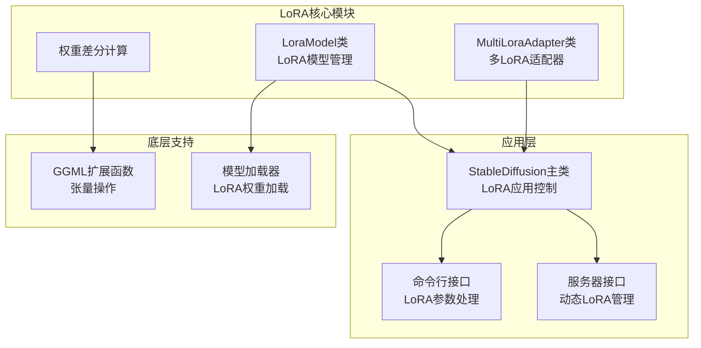
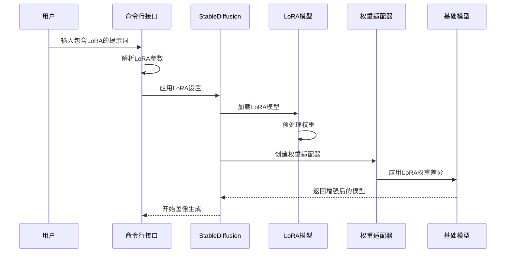
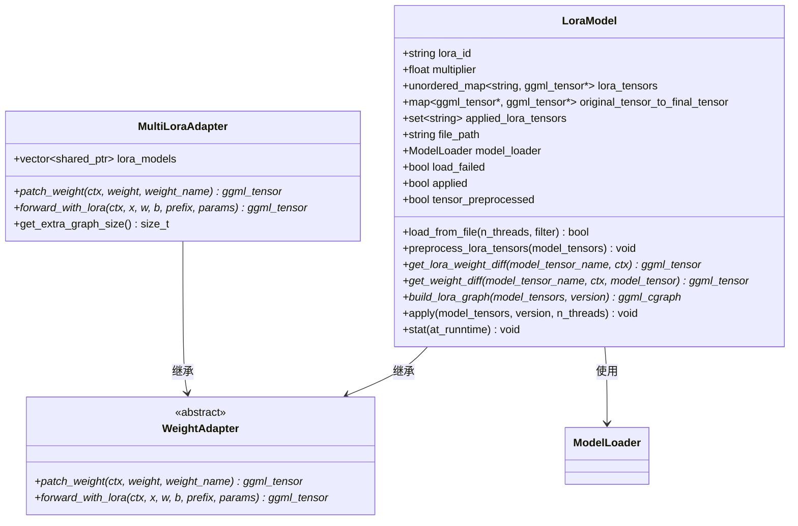
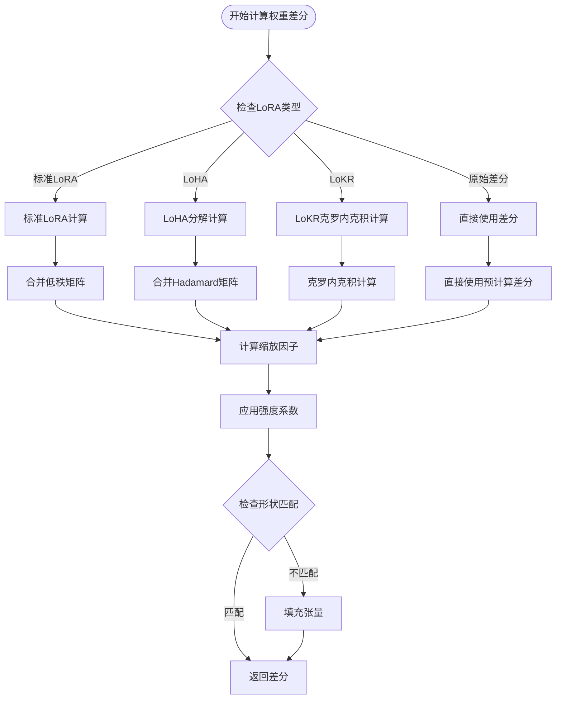
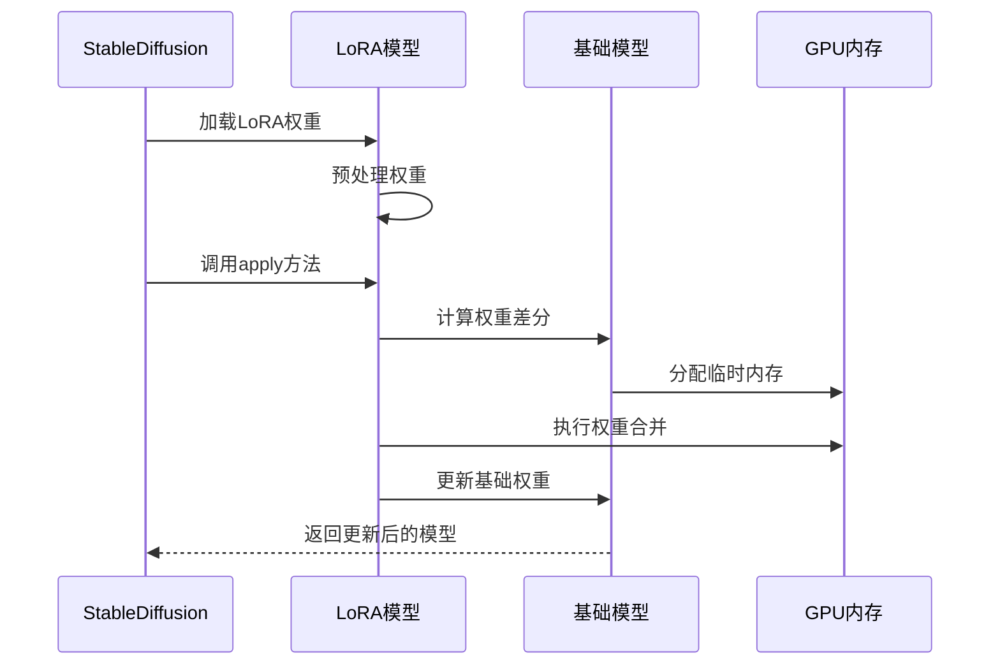
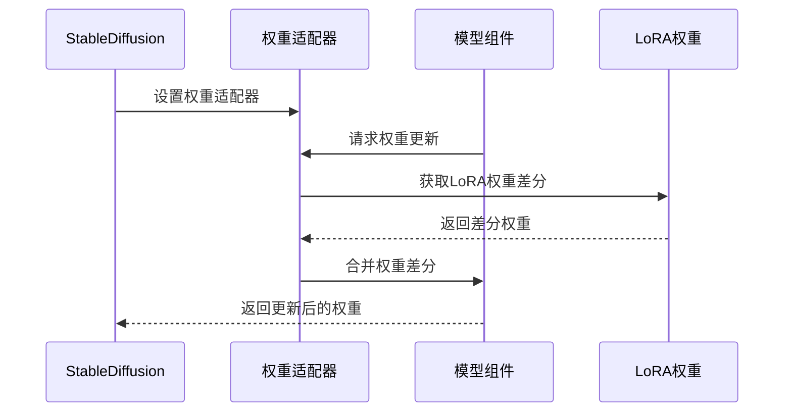
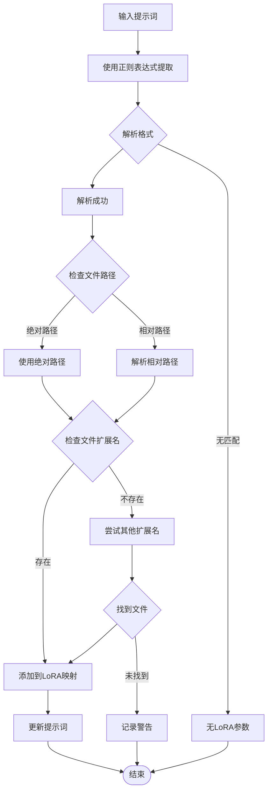
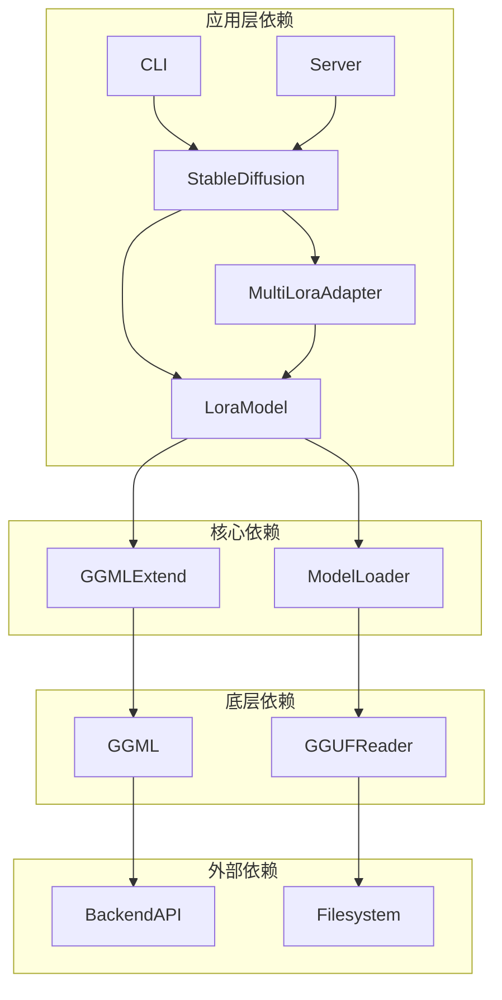

# LoRA微调支持

<cite>
**本文档引用的文件**
- [src/lora.hpp](file://src/lora.hpp)
- [src/stable-diffusion.cpp](file://src/stable-diffusion.cpp)
- [docs/lora.md](file://docs/lora.md)
- [examples/common/common.hpp](file://examples/common/common.hpp)
- [examples/cli/main.cpp](file://examples/cli/main.cpp)
- [src/ggml_extend.hpp](file://src/ggml_extend.hpp)
</cite>

## 目录
1. [简介](#简介)
2. [项目结构](#项目结构)
3. [核心组件](#核心组件)
4. [架构概览](#架构概览)
5. [详细组件分析](#详细组件分析)
6. [依赖关系分析](#依赖关系分析)
7. [性能考虑](#性能考虑)
8. [故障排除指南](#故障排除指南)
9. [结论](#结论)
10. [附录](#附录)

## 简介

LoRA（Low-Rank Adaptation）是一种高效的微调技术，通过低秩矩阵分解来调整预训练模型的权重，而不需要重新训练整个模型。在稳定扩散.cpp中，LoRA支持为图像生成提供了强大的定制能力。

LoRA技术的核心思想是将权重更新参数化为两个或多个低秩矩阵的乘积，这样可以显著减少需要学习的参数数量，同时保持模型的表达能力。这种方法特别适用于图像生成任务，因为它允许用户以较小的计算开销来适应特定的风格或主题。

## 项目结构

稳定扩散.cpp项目中的LoRA支持主要分布在以下几个关键文件中：



**图表来源**
- [src/lora.hpp:1-912](file://src/lora.hpp#L1-L912)
- [src/stable-diffusion.cpp:1030-1229](file://src/stable-diffusion.cpp#L1030-L1229)

**章节来源**
- [src/lora.hpp:1-912](file://src/lora.hpp#L1-L912)
- [src/stable-diffusion.cpp:1030-1229](file://src/stable-diffusion.cpp#L1030-L1229)

## 核心组件

### LoRA模型管理器

LoraModel类是LoRA系统的核心组件，负责管理单个LoRA模型的生命周期：

- **模型加载**：从文件系统加载LoRA权重
- **权重预处理**：根据目标模型类型调整权重格式
- **权重应用**：将LoRA权重合并到基础模型中
- **状态跟踪**：监控已应用和未使用的LoRA权重

### 多LoRA适配器

MultiLoraAdapter类实现了多个LoRA模型的组合应用：

- **级联应用**：支持同时应用多个LoRA模型
- **权重合并**：将多个LoRA的权重差分进行累加
- **动态管理**：运行时动态添加或移除LoRA模型

### 权重差分计算

系统支持多种LoRA变体的权重差分计算：

- **标准LoRA**：使用低秩矩阵分解
- **LoHA**：使用Hadamard分解
- **LoKR**：使用Kronecker积分解
- **原始差分**：直接使用预计算的权重差分

**章节来源**
- [src/lora.hpp:9-833](file://src/lora.hpp#L9-L833)
- [src/lora.hpp:835-912](file://src/lora.hpp#L835-L912)

## 架构概览

稳定扩散.cpp中的LoRA架构采用分层设计，确保了灵活性和效率：



**图表来源**
- [src/stable-diffusion.cpp:1053-1217](file://src/stable-diffusion.cpp#L1053-L1217)
- [examples/common/common.hpp:1630-1712](file://examples/common/common.hpp#L1630-L1712)

LoRA应用流程的关键步骤包括：

1. **参数解析**：从提示词中提取LoRA标识符和强度参数
2. **模型加载**：按需加载指定的LoRA权重文件
3. **权重预处理**：根据目标模型类型调整权重格式
4. **权重合并**：将LoRA权重差分与基础权重相加
5. **模型更新**：替换基础模型的权重参数

## 详细组件分析

### LoRA模型类分析

LoraModel类是LoRA系统的基础构建块，具有以下关键特性：



**图表来源**
- [src/lora.hpp:9-833](file://src/lora.hpp#L9-L833)
- [src/lora.hpp:835-912](file://src/lora.hpp#L835-L912)

#### 权重差分计算算法

LoRA权重差分的计算过程如下：



**图表来源**
- [src/lora.hpp:132-249](file://src/lora.hpp#L132-L249)
- [src/lora.hpp:251-469](file://src/lora.hpp#L251-L469)

**章节来源**
- [src/lora.hpp:132-469](file://src/lora.hpp#L132-L469)

### LoRA应用模式

系统支持两种LoRA应用模式，每种都有其特定的适用场景：

#### 即时应用模式（Immediately）

即时应用模式在模型加载时就将LoRA权重合并到基础权重中：



**图表来源**
- [src/stable-diffusion.cpp:1053-1095](file://src/stable-diffusion.cpp#L1053-L1095)

#### 运行时应用模式（At Runtime）

运行时应用模式在推理过程中动态应用LoRA权重：



**图表来源**
- [src/stable-diffusion.cpp:1097-1217](file://src/stable-diffusion.cpp#L1097-L1217)

**章节来源**
- [src/stable-diffusion.cpp:1053-1217](file://src/stable-diffusion.cpp#L1053-L1217)

### LoRA参数解析

LoRA参数通过正则表达式从提示词中解析：



**图表来源**
- [examples/common/common.hpp:1630-1712](file://examples/common/common.hpp#L1630-L1712)

**章节来源**
- [examples/common/common.hpp:1630-1712](file://examples/common/common.hpp#L1630-L1712)

## 依赖关系分析

LoRA系统的依赖关系体现了清晰的分层架构：



**图表来源**
- [src/lora.hpp:1-912](file://src/lora.hpp#L1-L912)
- [src/stable-diffusion.cpp:1030-1229](file://src/stable-diffusion.cpp#L1030-L1229)

LoRA系统的关键依赖包括：

- **GGML扩展**：提供张量操作和低秩矩阵计算
- **模型加载器**：处理不同格式的LoRA权重文件
- **后端API**：支持多种硬件加速平台
- **文件系统**：管理LoRA权重文件的存储和访问

**章节来源**
- [src/lora.hpp:1-912](file://src/lora.hpp#L1-L912)
- [src/stable-diffusion.cpp:1030-1229](file://src/stable-diffusion.cpp#L1030-L1229)

## 性能考虑

LoRA微调在稳定扩散.cpp中有以下性能特征：

### 内存使用优化

- **延迟加载**：LoRA权重按需加载，避免不必要的内存占用
- **权重共享**：多个LoRA模型可以共享基础权重，减少内存重复
- **动态分配**：根据LoRA数量动态调整计算图大小

### 计算效率优化

- **批量处理**：支持同时应用多个LoRA模型，提高计算效率
- **精度选择**：根据硬件能力自动选择最优的数据类型
- **缓存机制**：重用已计算的LoRA权重差分结果

### 硬件兼容性

- **多后端支持**：支持CPU、CUDA、Metal等多种计算后端
- **量化兼容**：自动处理量化模型的LoRA应用
- **内存管理**：优化GPU内存使用，避免内存溢出

## 故障排除指南

### 常见问题及解决方案

#### LoRA模型加载失败

**症状**：LoRA权重无法正确加载或应用

**可能原因**：
- LoRA文件路径错误
- 文件格式不支持
- 权重维度不匹配

**解决方法**：
1. 验证LoRA文件路径的正确性
2. 确认文件格式为支持的类型（.safetensors, .ckpt等）
3. 检查LoRA权重与基础模型的兼容性

#### 权重应用异常

**症状**：LoRA应用后图像质量下降或出现异常

**可能原因**：
- LoRA强度系数过大
- LoRA模型与基础模型不兼容
- 内存不足导致权重损坏

**解决方法**：
1. 降低LoRA强度系数（通常在0.5-1.5之间）
2. 尝试其他兼容的LoRA模型
3. 检查系统内存使用情况

#### 性能问题

**症状**：LoRA应用导致推理速度明显下降

**可能原因**：
- 使用了高rank的LoRA模型
- 运行时应用模式下的额外计算开销
- 硬件不支持某些LoRA变体

**解决方法**：
1. 切换到即时应用模式（如果适用）
2. 选择rank较低的LoRA模型
3. 检查硬件兼容性并更新驱动程序

**章节来源**
- [src/lora.hpp:807-832](file://src/lora.hpp#L807-L832)
- [docs/lora.md:15-27](file://docs/lora.md#L15-L27)

## 结论

稳定扩散.cpp中的LoRA微调支持提供了一个完整、高效且灵活的解决方案。通过即时应用和运行时应用两种模式，用户可以根据具体需求在性能和灵活性之间找到最佳平衡点。

该系统的主要优势包括：

- **模块化设计**：清晰的组件分离使得系统易于维护和扩展
- **多格式支持**：支持多种LoRA权重文件格式
- **性能优化**：针对不同硬件平台进行了专门优化
- **易用性**：通过简单的提示词语法即可使用复杂的LoRA功能

未来的发展方向可能包括支持更多的LoRA变体、进一步优化性能以及提供更丰富的可视化工具来帮助用户理解和调试LoRA效果。

## 附录

### LoRA使用示例

以下是一个完整的LoRA使用示例：

```bash
# 基本LoRA应用
./bin/sd-cli -m ../models/v1-5-pruned-emaonly.safetensors \
    -p "a lovely cat<lora:marblesh:1>" \
    --lora-model-dir ../models

# 多LoRA叠加应用
./bin/sd-cli -m ../models/v1-5-pruned-emaonly.safetensors \
    -p "portrait of a woman<lora:skin_texture:0.8><lora:eyes_detail:1.2>" \
    --lora-model-dir ../models
```

### 支持的LoRA变体

系统当前支持以下LoRA变体：

- **标准LoRA**：最常用的低秩矩阵分解方法
- **LoHA**：基于Hadamard分解的LoRA变体
- **LoKR**：使用Kronecker积的LoRA实现
- **原始差分**：直接使用预计算的权重差分

### 最佳实践建议

1. **选择合适的rank值**：通常在4-64之间，根据模型复杂度调整
2. **合理设置强度系数**：从0.5开始尝试，逐步调整到满意效果
3. **注意内存使用**：同时应用多个LoRA会增加内存占用
4. **测试兼容性**：不同LoRA模型与不同基础模型的兼容性可能不同