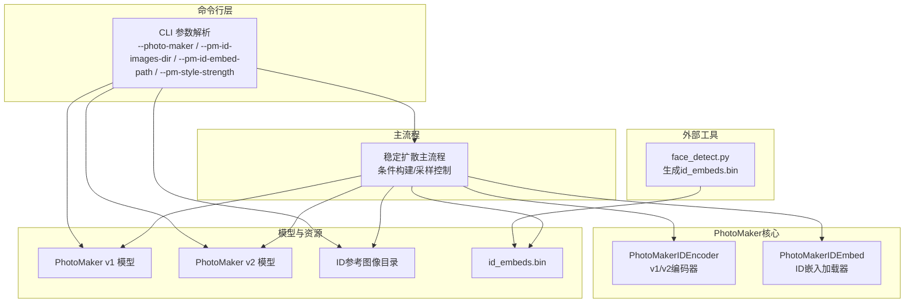
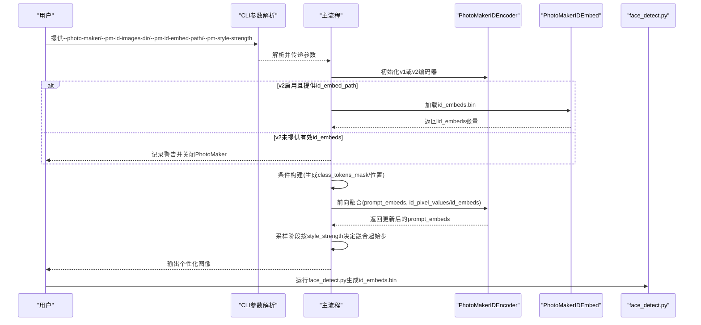
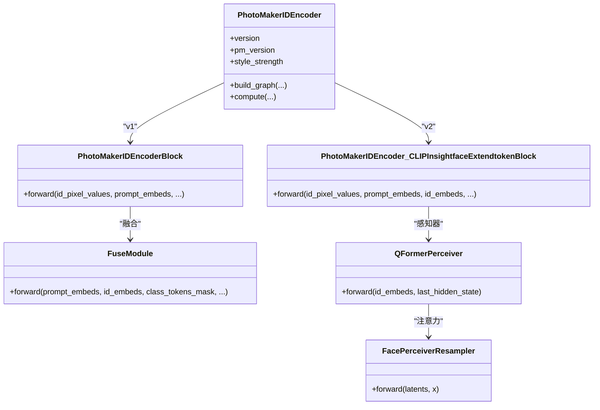
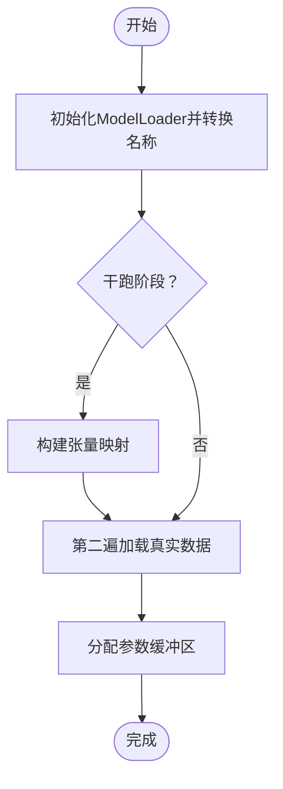
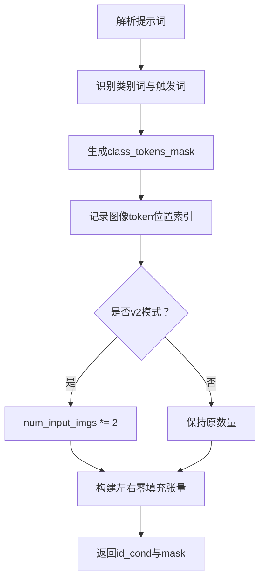
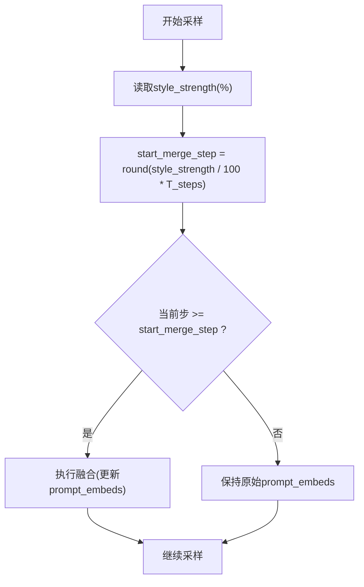
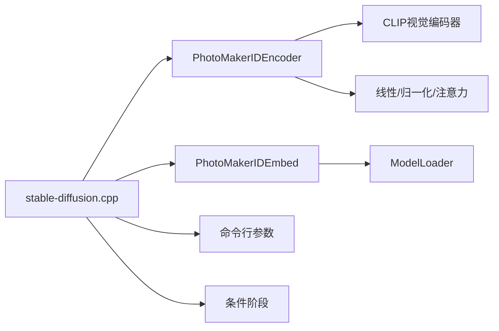

# PhotoMaker个性化

<cite>
**本文引用的文件**
- [photo_maker.md](file://docs/photo_maker.md)
- [pmid.hpp](file://src/pmid.hpp)
- [stable-diffusion.cpp](file://src/stable-diffusion.cpp)
- [face_detect.py](file://script/face_detect.py)
- [common.hpp](file://examples/common/common.hpp)
- [main.cpp](file://examples/cli/main.cpp)
</cite>

## 目录
1. [简介](#简介)
2. [项目结构](#项目结构)
3. [核心组件](#核心组件)
4. [架构总览](#架构总览)
5. [详细组件分析](#详细组件分析)
6. [依赖关系分析](#依赖关系分析)
7. [性能考量](#性能考量)
8. [故障排查指南](#故障排查指南)
9. [结论](#结论)
10. [附录](#附录)

## 简介
本文件系统性阐述稳定扩散.cpp中PhotoMaker个性化功能的原理与实现，覆盖以下要点：
- PhotoMaker v1与v2的技术差异与改进
- ID嵌入的生成、存储与应用机制
- 个性化模型的加载、融合与推理流程
- 完整的个性化设置与使用指南（参考图选择、ID嵌入生成、风格强度调节）
- 实际代码级调用序列与数据流图示
- 效果质量评估与最佳实践建议

## 项目结构
围绕PhotoMaker功能的相关文件组织如下：
- 文档与使用说明：docs/photo_maker.md
- 核心实现头文件：src/pmid.hpp（ID编码器、ID嵌入加载器等）
- 主流程集成：src/stable-diffusion.cpp（参数解析、模型加载、条件构建、推理控制）
- 参考图处理脚本：script/face_detect.py（v2专用，生成id_embeds.bin）
- 命令行参数定义：examples/common/common.hpp（--photo-maker、--pm-id-images-dir、--pm-id-embed-path、--pm-style-strength等）
- CLI入口示例：examples/cli/main.cpp（参数解析与帮助）

图表来源
- [stable-diffusion.cpp:695-710](file://src/stable-diffusion.cpp#L695-L710)
- [pmid.hpp:395-566](file://src/pmid.hpp#L395-L566)
- [face_detect.py:37-88](file://script/face_detect.py#L37-L88)
- [common.hpp:558-1123](file://examples/common/common.hpp#L558-L1123)

章节来源
- [photo_maker.md:1-54](file://docs/photo_maker.md#L1-L54)
- [pmid.hpp:395-566](file://src/pmid.hpp#L395-L566)
- [stable-diffusion.cpp:695-710](file://src/stable-diffusion.cpp#L695-L710)
- [face_detect.py:37-88](file://script/face_detect.py#L37-L88)
- [common.hpp:558-1123](file://examples/common/common.hpp#L558-L1123)

## 核心组件
- PhotoMakerIDEncoder（v1/v2双版本）
  - 负责将ID参考图像通过视觉编码器提取特征，并与文本提示嵌入进行融合，输出增强后的prompt_embeds。
  - v1：基于CLIP视觉编码+投影+拼接+融合模块。
  - v2：引入QFormer感知器（Perceiver Resampler）对预计算的id_embeds进行跨注意力融合。
- PhotoMakerIDEmbed
  - 从二进制文件加载预先计算好的id_embeds张量，供v2使用。
- 条件阶段与触发词
  - 在条件构建时，根据提示词中的类别词与硬编码触发词“img”，生成class_tokens_mask与位置掩码，用于定位图像token并进行精确融合。
- 主流程集成点
  - 解析命令行参数，按v1/v2分支初始化编码器与LoRA权重；在采样阶段根据style_strength确定融合起始步。

章节来源
- [pmid.hpp:395-566](file://src/pmid.hpp#L395-L566)
- [pmid.hpp:568-639](file://src/pmid.hpp#L568-L639)
- [stable-diffusion.cpp:695-710](file://src/stable-diffusion.cpp#L695-L710)
- [stable-diffusion.cpp:1307-1341](file://src/stable-diffusion.cpp#L1307-L1341)

## 架构总览
PhotoMaker个性化在稳定扩散.cpp中的整体工作流如下：

图表来源
- [stable-diffusion.cpp:695-710](file://src/stable-diffusion.cpp#L695-L710)
- [stable-diffusion.cpp:1307-1341](file://src/stable-diffusion.cpp#L1307-L1341)
- [pmid.hpp:395-566](file://src/pmid.hpp#L395-L566)
- [face_detect.py:37-88](file://script/face_detect.py#L37-L88)

## 详细组件分析

### 组件A：PhotoMakerIDEncoder（v1与v2）
- v1路径
  - 输入：id_pixel_values（ID参考图像）、prompt_embeds（文本嵌入）
  - 步骤：CLIP视觉编码→投影到768维→额外投影到1280维→通道拼接→Permute/Reshape→融合模块→输出更新后的prompt_embeds
- v2路径
  - 输入：id_pixel_values、prompt_embeds、id_embeds（来自id_embeds.bin）
  - 步骤：CLIP视觉编码→QFormer感知器（Perceiver Resampler）→融合模块→输出更新后的prompt_embeds
- 关键细节
  - class_tokens_mask与class_tokens_mask_pos用于定位提示词中的图像token位置，确保仅对图像token进行融合。
  - style_strength影响融合起始步，从而控制个性化强度。

图表来源
- [pmid.hpp:395-566](file://src/pmid.hpp#L395-L566)
- [pmid.hpp:247-311](file://src/pmid.hpp#L247-L311)
- [pmid.hpp:204-245](file://src/pmid.hpp#L204-L245)
- [pmid.hpp:154-202](file://src/pmid.hpp#L154-L202)

章节来源
- [pmid.hpp:395-566](file://src/pmid.hpp#L395-L566)
- [pmid.hpp:247-311](file://src/pmid.hpp#L247-L311)
- [pmid.hpp:204-245](file://src/pmid.hpp#L204-L245)
- [pmid.hpp:154-202](file://src/pmid.hpp#L154-L202)

### 组件B：PhotoMakerIDEmbed（v2专用ID嵌入加载）
- 功能：从二进制文件加载id_embeds张量，供v2编码器使用。
- 行为：通过ModelLoader读取指定文件，过滤并注册目标张量，分配参数缓冲区后完成加载。

图表来源
- [pmid.hpp:568-639](file://src/pmid.hpp#L568-L639)

章节来源
- [pmid.hpp:568-639](file://src/pmid.hpp#L568-L639)

### 组件C：条件构建与触发词机制
- 在条件阶段，根据提示词构造class_tokens_mask与class_tokens_mask_pos，定位图像token位置。
- v2模式下，num_input_imgs翻倍（每个输入图像对应两个token），以适配QFormer感知器的输入格式。

图表来源
- [stable-diffusion.cpp:1307-1314](file://src/stable-diffusion.cpp#L1307-L1314)
- [pmid.hpp:395-444](file://src/pmid.hpp#L395-L444)

章节来源
- [stable-diffusion.cpp:1307-1314](file://src/stable-diffusion.cpp#L1307-L1314)
- [pmid.hpp:395-444](file://src/pmid.hpp#L395-L444)

### 组件D：采样阶段的融合起始步
- style_strength用于计算融合起始步start_merge_step，控制个性化强度与保真度平衡。

图表来源
- [stable-diffusion.cpp:3500-3506](file://src/stable-diffusion.cpp#L3500-L3506)

章节来源
- [stable-diffusion.cpp:3500-3506](file://src/stable-diffusion.cpp#L3500-L3506)

## 依赖关系分析
- PhotoMakerIDEncoder依赖于：
  - CLIP视觉编码器（OpenAI ViT-L/14）
  - 线性层与LayerNorm等基础算子
  - GGML图构建与执行框架（GGMLRunner）
- PhotoMakerIDEmbed依赖于：
  - ModelLoader（张量加载与命名转换）
  - 二进制文件格式（包含张量元信息与数据）
- 主流程依赖：
  - 命令行参数解析（--photo-maker、--pm-id-images-dir、--pm-id-embed-path、--pm-style-strength）
  - 条件阶段（生成id_cond与class_tokens_mask）
  - LoRA权重（pmid前缀）

图表来源
- [stable-diffusion.cpp:695-710](file://src/stable-diffusion.cpp#L695-L710)
- [pmid.hpp:395-566](file://src/pmid.hpp#L395-L566)
- [pmid.hpp:568-639](file://src/pmid.hpp#L568-L639)

章节来源
- [stable-diffusion.cpp:695-710](file://src/stable-diffusion.cpp#L695-L710)
- [pmid.hpp:395-566](file://src/pmid.hpp#L395-L566)
- [pmid.hpp:568-639](file://src/pmid.hpp#L568-L639)

## 性能考量
- vae-on-cpu：在低显存设备上可开启以避免伪影，但会增加CPU-GPU传输开销。
- 推荐尺寸：H=W=1024，配合CFG=5.0通常能获得更稳定的个性化结果。
- style_strength：较低值（如10–20）通常在保真与风格之间取得较好平衡。
- v2的face_detect.py仅需运行一次，得到的id_embeds.bin可重复使用，减少重复计算。

章节来源
- [photo_maker.md:19-25](file://docs/photo_maker.md#L19-L25)
- [photo_maker.md:33-52](file://docs/photo_maker.md#L33-L52)

## 故障排查指南
- v2缺少id_embeds.bin
  - 现象：日志警告“提供了PhotoMaker图片，但v2没有有效的ID嵌入文件”并关闭PhotoMaker。
  - 处理：先运行face_detect.py生成id_embeds.bin，再传入--pm-id-embed-path。
- 图片数量与id_embeds不匹配
  - 现象：日志警告“输入图片数与ID嵌入数不一致”，建议重新运行face_detect.py。
- 未提供ID图片却提供了PhotoMaker模型
  - 现象：日志警告“提供了PhotoMaker模型，但没有输入ID图片”，关闭PhotoMaker。
- v1与v2模型误用
  - 现象：v2模型名中包含“v2”，主流程会自动切换到v2编码器；若混用模型文件，可能导致形状不匹配或错误。

章节来源
- [stable-diffusion.cpp:1315-1324](file://src/stable-diffusion.cpp#L1315-L1324)
- [stable-diffusion.cpp:1340-1341](file://src/stable-diffusion.cpp#L1340-L1341)
- [photo_maker.md:33-52](file://docs/photo_maker.md#L33-L52)

## 结论
稳定扩散.cpp对PhotoMaker的实现采用清晰的模块化设计：v1通过直接视觉编码与简单融合，v2引入QFormer感知器与预计算ID嵌入，显著提升了跨图像一致性与个性化可控性。结合命令行参数与条件构建机制，用户可在SDXL框架下便捷地进行人脸个性化生成，并通过style_strength与推荐参数组合获得高质量结果。

## 附录

### 使用指南（参考图片选择、ID嵌入生成、个性化强度调节）
- 参考图片选择
  - 建议使用清晰、正面、无遮挡的人脸图像；多张不同角度/表情的图片可提升稳定性。
- v1流程
  - 准备PhotoMaker v1模型文件与ID参考图像目录，使用--photo-maker与--pm-id-images-dir启动。
- v2流程
  - 先运行face_detect.py生成id_embeds.bin，再使用--photo-maker与--pm-id-embed-path启动。
- 个性化强度调节
  - 使用--pm-style-strength设置百分比（默认20），较低值更贴近输入ID，较高值更偏向风格化。
- 推荐参数
  - CFG≈5.0，H=W=1024，必要时开启--vae-on-cpu以降低伪影。

章节来源
- [photo_maker.md:1-54](file://docs/photo_maker.md#L1-L54)
- [common.hpp:1120-1123](file://examples/common/common.hpp#L1120-L1123)
- [common.hpp:1174-1255](file://examples/common/common.hpp#L1174-L1255)

### 代码级调用示例（路径引用）
- 初始化PhotoMaker v1/v2编码器
  - [初始化分支与LoRA加载:695-710](file://src/stable-diffusion.cpp#L695-L710)
- 条件构建与ID嵌入融合
  - [条件构建与class_tokens_mask生成:1307-1314](file://src/stable-diffusion.cpp#L1307-L1314)
  - [v2缺失id_embeds的处理:1315-1324](file://src/stable-diffusion.cpp#L1315-L1324)
  - [未提供ID图片的处理:1340-1341](file://src/stable-diffusion.cpp#L1340-L1341)
- v2 ID嵌入加载
  - [PhotoMakerIDEmbed加载逻辑:568-639](file://src/pmid.hpp#L568-L639)
- 采样阶段融合起始步
  - [style_strength转融合起始步:3500-3506](file://src/stable-diffusion.cpp#L3500-L3506)
- 命令行参数定义
  - [--photo-maker / --pm-id-images-dir / --pm-id-embed-path / --pm-style-strength:558-1123](file://examples/common/common.hpp#L558-L1123)
- v2参考图处理脚本
  - [face_detect.py生成id_embeds.bin:37-88](file://script/face_detect.py#L37-L88)