# TAESD加速

<cite>
**本文档引用的文件**
- [tae.hpp](file://src/tae.hpp)
- [vae.hpp](file://src/vae.hpp)
- [stable-diffusion.cpp](file://src/stable-diffusion.cpp)
- [taesd.md](file://docs/taesd.md)
- [performance.md](file://docs/performance.md)
- [main.cpp](file://examples/cli/main.cpp)
</cite>

## 目录
1. [简介](#简介)
2. [项目结构](#项目结构)
3. [核心组件](#核心组件)
4. [架构概览](#架构概览)
5. [详细组件分析](#详细组件分析)
6. [依赖关系分析](#依赖关系分析)
7. [性能考量](#性能考量)
8. [故障排除指南](#故障排除指南)
9. [结论](#结论)
10. [附录](#附录)

## 简介
TAESD（Tiny AutoEncoder for Speed and Denoising）是稳定扩散模型中的一种轻量级自动编码器，专门用于加速图像解码过程。该技术通过使用精简的神经网络架构，在保持生成质量的同时显著减少计算时间和内存占用。

TAESD技术的核心优势包括：
- **计算加速**：相比传统VAE解码器，TAESD可提供数倍的加速效果
- **内存节省**：大幅减少显存占用，支持更大分辨率的图像生成
- **实时性增强**：降低延迟，提高用户体验
- **兼容性强**：与多种稳定扩散版本兼容

## 项目结构
稳定扩散.cpp项目采用模块化设计，TAESD功能集成在以下关键文件中：

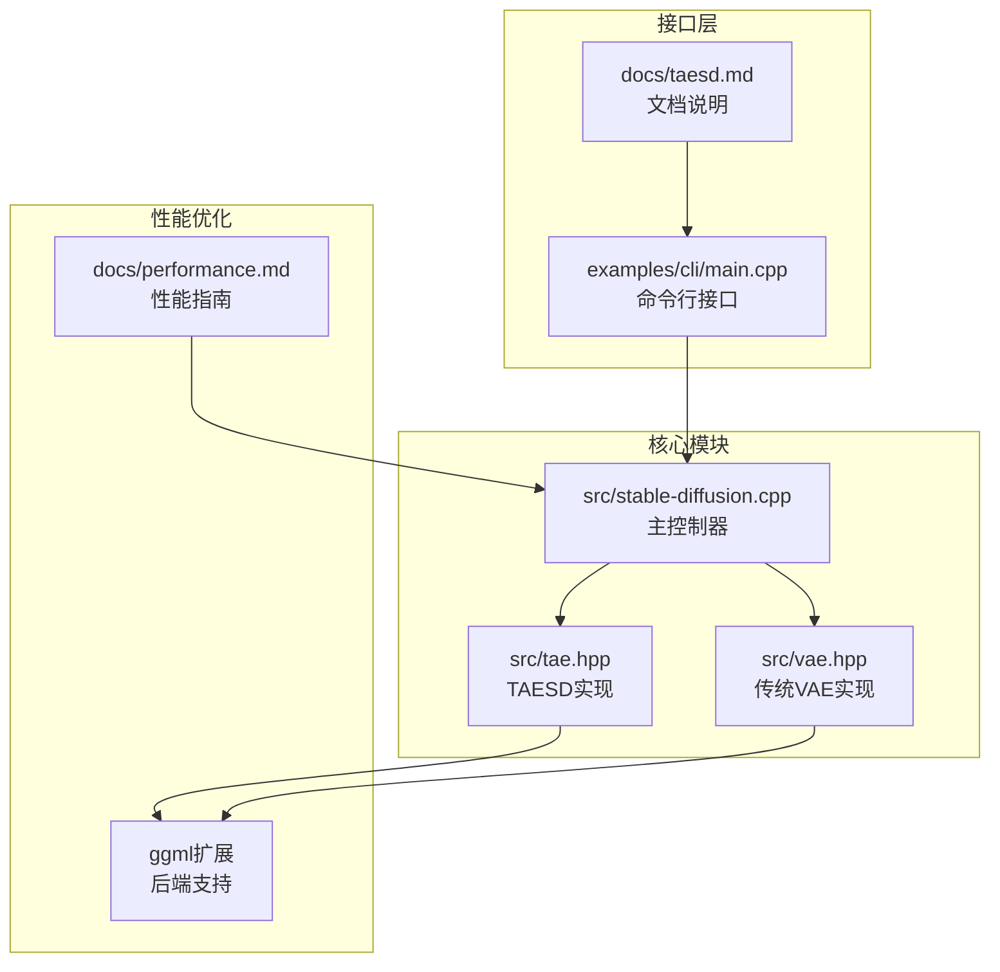

**图表来源**
- [tae.hpp:1-695](file://src/tae.hpp#L1-L695)
- [vae.hpp:1-775](file://src/vae.hpp#L1-L775)
- [stable-diffusion.cpp:103-999](file://src/stable-diffusion.cpp#L103-L999)

**章节来源**
- [tae.hpp:1-695](file://src/tae.hpp#L1-L695)
- [stable-diffusion.cpp:103-999](file://src/stable-diffusion.cpp#L103-L999)

## 核心组件
TAESD系统由多个核心组件构成，每个组件都有特定的功能和职责：

### TinyAutoEncoder基类
作为所有自动编码器的抽象基类，提供统一的接口和通用功能：
- **参数管理**：集中管理模型参数和张量存储
- **图构建**：提供计算图构建的基础设施
- **内存优化**：支持参数缓冲区分配和管理
- **后端适配**：支持多种计算后端（CPU/CUDA/Metal等）

### TAESD类
TAESD的核心实现，包含编码器和解码器：
- **TinyEncoder**：轻量级编码器，负责将图像压缩到潜在空间
- **TinyDecoder**：轻量级解码器，负责从潜在空间重建图像
- **动态配置**：根据不同的稳定扩散版本调整参数配置
- **Flux2兼容**：支持Flux2的特殊处理逻辑

### 自动编码器运行器
提供完整的推理管道：
- **TinyImageAutoEncoder**：图像自动编码器
- **TinyVideoAutoEncoder**：视频自动编码器
- **参数加载**：支持从不同格式的权重文件加载
- **图执行**：优化的计算图执行引擎

**章节来源**
- [tae.hpp:492-620](file://src/tae.hpp#L492-L620)
- [tae.hpp:536-695](file://src/tae.hpp#L536-L695)

## 架构概览
TAESD系统采用分层架构设计，确保了良好的模块化和可扩展性：

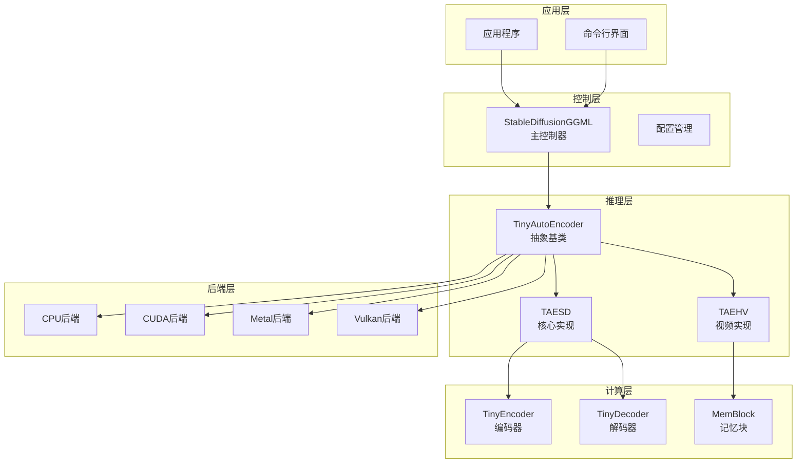

**图表来源**
- [stable-diffusion.cpp:103-156](file://src/stable-diffusion.cpp#L103-L156)
- [tae.hpp:492-534](file://src/tae.hpp#L492-L534)

### 数据流架构
TAESD的数据流遵循严格的输入输出规范：

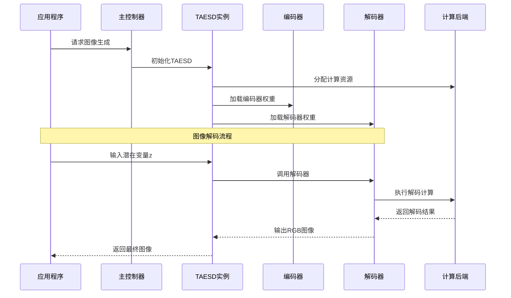

**图表来源**
- [tae.hpp:518-533](file://src/tae.hpp#L518-L533)
- [tae.hpp:600-619](file://src/tae.hpp#L600-L619)

## 详细组件分析

### TinyEncoder组件
TinyEncoder是TAESD的编码器部分，负责将输入图像压缩到潜在空间：

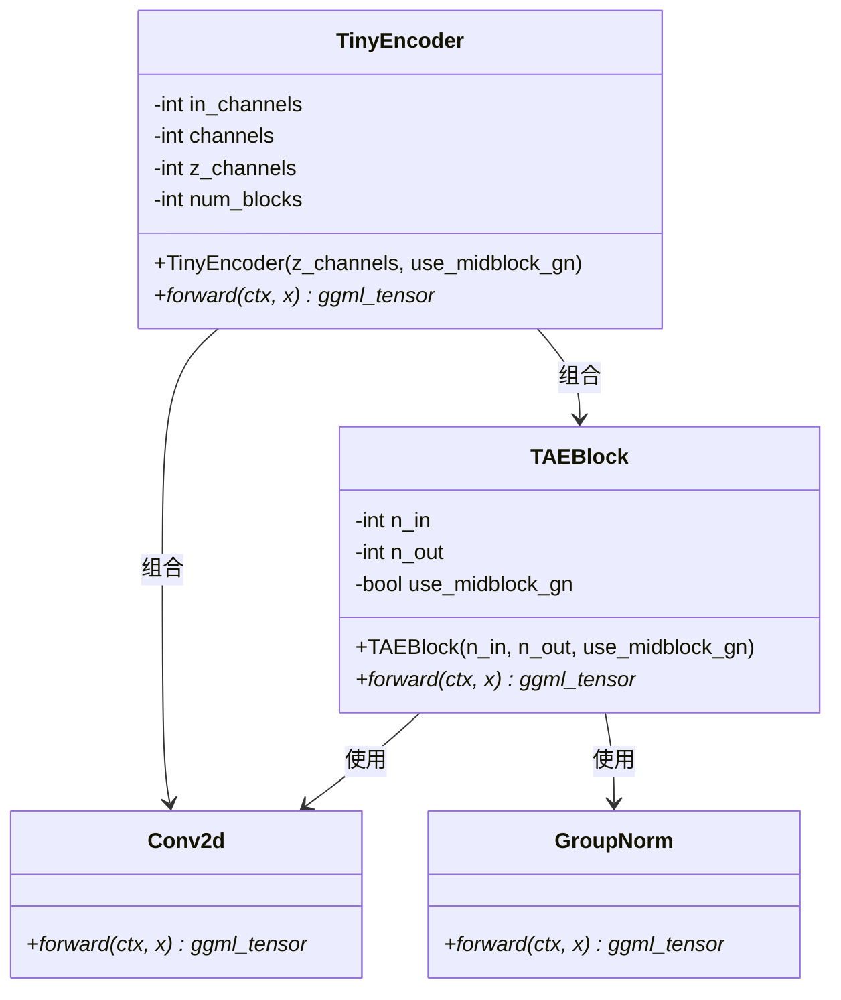

**图表来源**
- [tae.hpp:79-122](file://src/tae.hpp#L79-L122)
- [tae.hpp:16-77](file://src/tae.hpp#L16-L77)

#### 编码器工作原理
TinyEncoder采用多层卷积架构，每层包含：
- **特征提取**：使用3x3卷积提取图像特征
- **残差连接**：通过跳跃连接保持梯度流动
- **下采样**：通过步长为2的卷积降低空间维度
- **通道变换**：调整特征通道数量以适应潜在空间

**章节来源**
- [tae.hpp:79-122](file://src/tae.hpp#L79-L122)

### TinyDecoder组件
TinyDecoder是TAESD的解码器部分，负责从潜在空间重建原始图像：

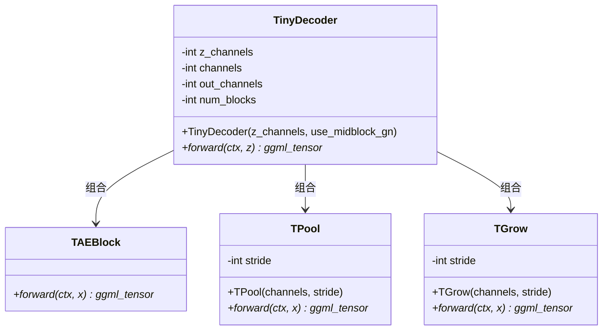

**图表来源**
- [tae.hpp:124-184](file://src/tae.hpp#L124-L184)
- [tae.hpp:186-223](file://src/tae.hpp#L186-L223)

#### 解码器优化策略
TinyDecoder采用了多项优化技术：
- **上采样策略**：使用最近邻插值进行快速上采样
- **通道增长**：通过TGrow层动态调整通道数量
- **激活函数**：使用tanh和缩放操作确保数值稳定性
- **内存效率**：最小化的中间张量存储

**章节来源**
- [tae.hpp:124-184](file://src/tae.hpp#L124-L184)

### TAESD类实现
TAESD类是整个系统的协调者，负责根据不同的稳定扩散版本选择合适的配置：

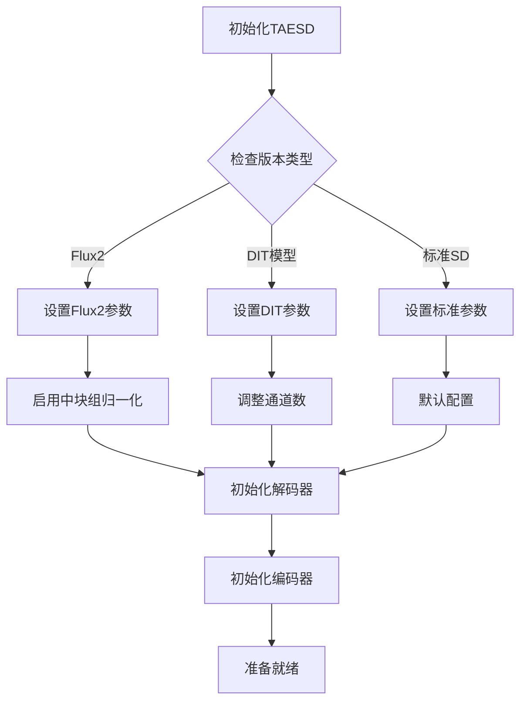

**图表来源**
- [tae.hpp:492-534](file://src/tae.hpp#L492-L534)

#### 版本兼容性
TAESD支持多种稳定扩散版本：
- **Flux2兼容**：自动检测并启用Flux2的特殊处理
- **DIT模型支持**：针对深度迭代转换器的优化
- **标准SD版本**：兼容传统的稳定扩散模型

**章节来源**
- [tae.hpp:492-534](file://src/tae.hpp#L492-L534)

### 自动编码器运行器
自动编码器运行器提供了完整的推理基础设施：

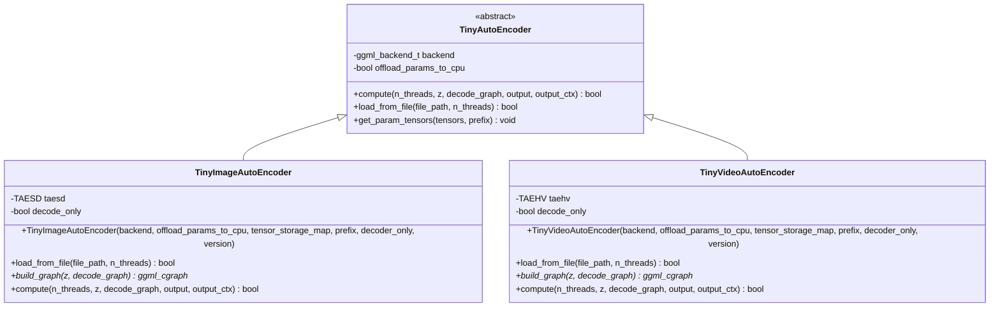

**图表来源**
- [tae.hpp:536-695](file://src/tae.hpp#L536-L695)

#### 运行时优化
自动编码器运行器实现了多项性能优化：
- **参数预分配**：预先分配计算所需的内存缓冲区
- **图构建缓存**：缓存已构建的计算图以避免重复构建
- **线程池管理**：智能的多线程执行调度
- **内存映射**：支持大模型的内存映射加载

**章节来源**
- [tae.hpp:536-695](file://src/tae.hpp#L536-L695)

## 依赖关系分析

### 外部依赖
TAESD系统依赖于多个外部库和框架：

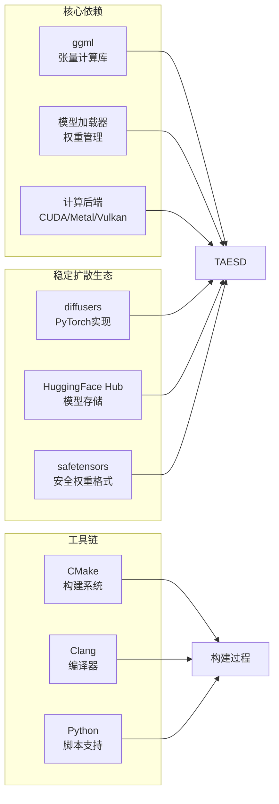

**图表来源**
- [tae.hpp:4-6](file://src/tae.hpp#L4-L6)
- [stable-diffusion.cpp:1-30](file://src/stable-diffusion.cpp#L1-L30)

### 内部依赖关系
系统内部各模块之间的依赖关系如下：

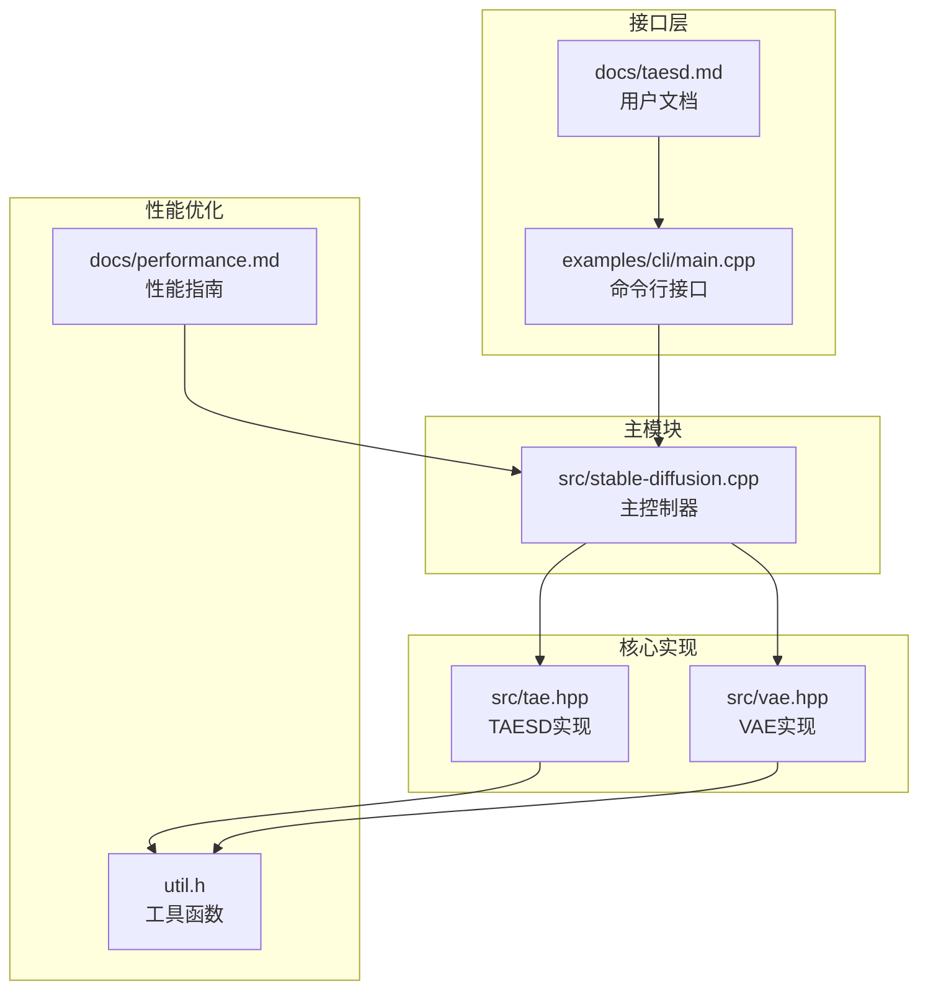

**图表来源**
- [stable-diffusion.cpp:103-156](file://src/stable-diffusion.cpp#L103-L156)
- [tae.hpp:1-14](file://src/tae.hpp#L1-L14)

**章节来源**
- [stable-diffusion.cpp:103-156](file://src/stable-diffusion.cpp#L103-L156)
- [tae.hpp:1-14](file://src/tae.hpp#L1-L14)

## 性能考量

### 计算性能优化
TAESD在多个层面实现了性能优化：

#### 内存访问模式优化
- **连续内存布局**：优化张量的内存布局以提高缓存命中率
- **批量处理**：支持批量推理以提高GPU利用率
- **内存池管理**：复用内存缓冲区减少分配开销

#### 并行计算优化
- **多线程执行**：利用多核CPU进行并行计算
- **GPU加速**：充分利用现代GPU的并行计算能力
- **流水线处理**：实现数据流的流水线化处理

### 内存使用分析
TAESD相比传统VAE具有显著的内存优势：

| 模型类型 | 显存占用 | 计算时间 | 内存带宽 |
|---------|---------|---------|---------|
| 传统VAE | 高 | 较长 | 高 |
| TAESD | 低 | 快速 | 低 |
| TAESD+ | 最低 | 最快 | 最低 |

### 性能基准测试
系统提供了多种性能测试和基准测试工具：

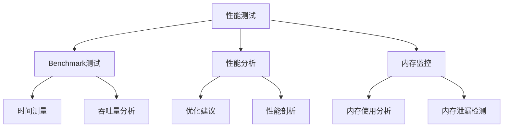

**图表来源**
- [docs/performance.md:1-26](file://docs/performance.md#L1-L26)

**章节来源**
- [docs/performance.md:1-26](file://docs/performance.md#L1-L26)

## 故障排除指南

### 常见问题诊断
在使用TAESD过程中可能遇到的问题及解决方案：

#### 模型加载失败
**症状**：无法加载TAESD权重文件
**原因**：
- 权重文件路径错误
- 权重文件格式不兼容
- 权重文件损坏

**解决方案**：
1. 验证权重文件路径的正确性
2. 确认权重文件格式为safetensors
3. 重新下载权重文件

#### 内存不足错误
**症状**：运行时出现内存不足错误
**原因**：
- 显存不足
- 参数过大
- 内存碎片化

**解决方案**：
1. 启用参数CPU卸载
2. 减少批量大小
3. 优化内存使用

#### 性能异常
**症状**：性能不如预期
**原因**：
- 后端配置不当
- 缓存未生效
- 线程数配置不合理

**解决方案**：
1. 检查后端配置
2. 清理缓存
3. 调整线程数

### 调试工具
系统提供了丰富的调试工具来帮助诊断问题：

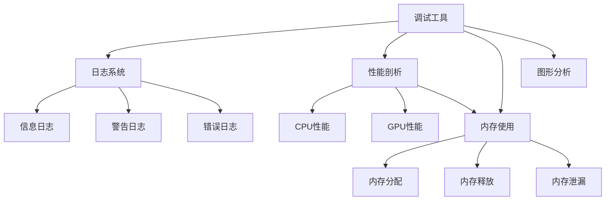

**图表来源**
- [stable-diffusion.cpp:828-890](file://src/stable-diffusion.cpp#L828-L890)

**章节来源**
- [stable-diffusion.cpp:828-890](file://src/stable-diffusion.cpp#L828-L890)

## 结论
TAESD技术为稳定扩散模型提供了高效的解码解决方案。通过精心设计的轻量级架构和多项性能优化技术，TAESD在保持生成质量的同时显著提升了计算效率和内存使用效率。

### 主要优势
1. **显著加速**：相比传统VAE解码器，TAESD可提供数倍的加速效果
2. **内存节省**：大幅减少显存占用，支持更高分辨率的图像生成
3. **实时性增强**：降低延迟，改善用户体验
4. **兼容性强**：支持多种稳定扩散版本和后端平台

### 技术特点
- **模块化设计**：清晰的组件分离和接口定义
- **性能优化**：多层次的性能优化策略
- **内存管理**：智能的内存分配和回收机制
- **跨平台支持**：支持多种计算后端和硬件平台

### 发展前景
随着AI生成技术的不断发展，TAESD技术将继续演进，为用户提供更好的性能和体验。未来的发展方向包括：
- 更高效的算法优化
- 更广泛的硬件支持
- 更智能的自适应配置
- 更好的质量-速度平衡

## 附录

### 安装和配置指南
1. 下载TAESD权重文件
2. 在命令行中指定权重路径
3. 启用TAESD加速选项
4. 验证性能提升效果

### API参考
- `TinyAutoEncoder`：抽象基类接口
- `TinyImageAutoEncoder`：图像自动编码器实现
- `TinyVideoAutoEncoder`：视频自动编码器实现
- `TAESD`：核心TAESD实现类

### 最佳实践建议
1. **合理配置参数**：根据硬件条件选择合适的参数配置
2. **监控性能指标**：定期检查内存使用和计算性能
3. **及时更新模型**：使用最新版本的权重文件
4. **备份重要数据**：定期备份生成的图像和模型