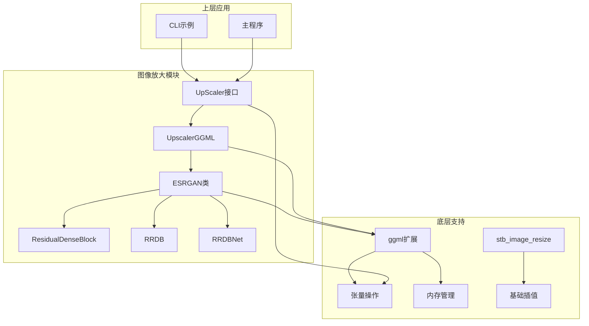
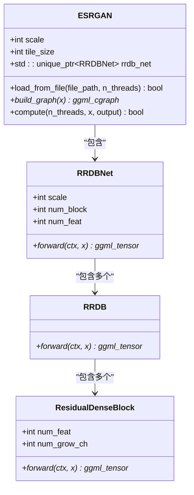
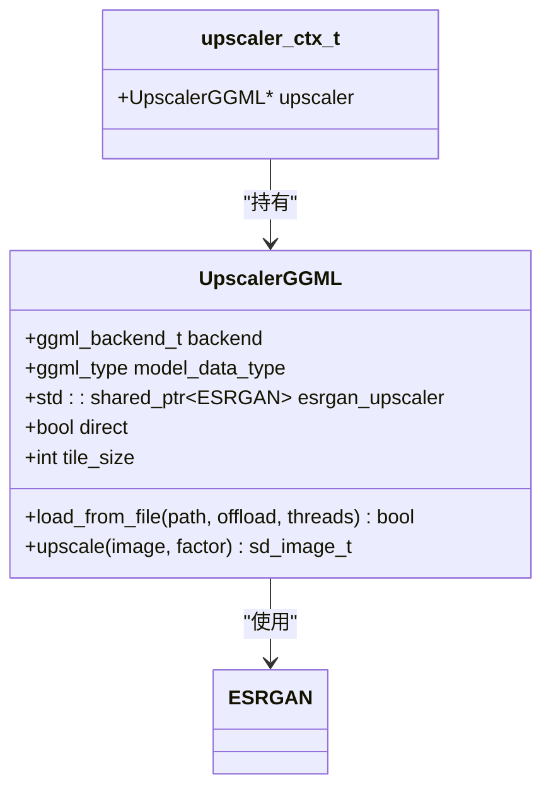
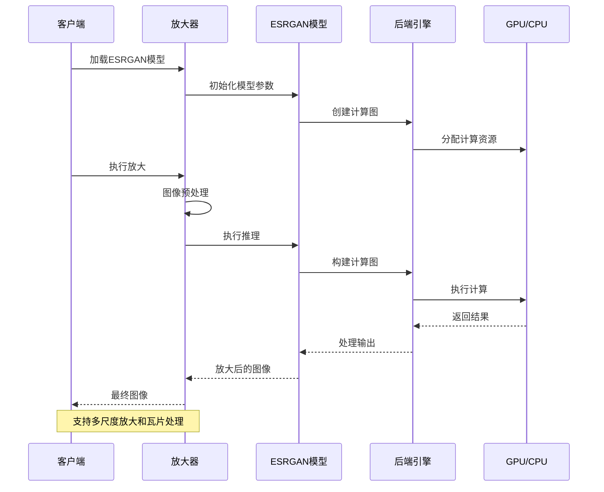
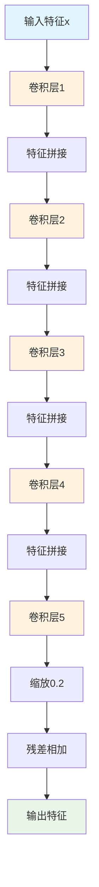
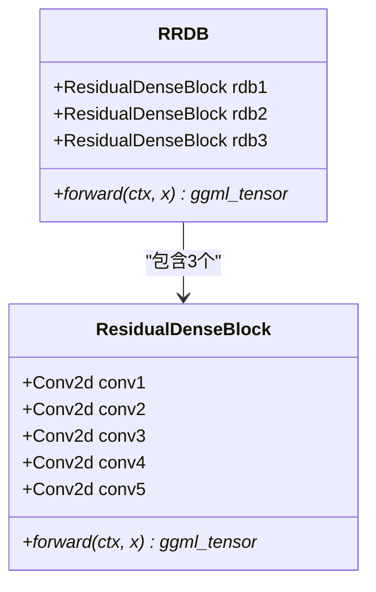
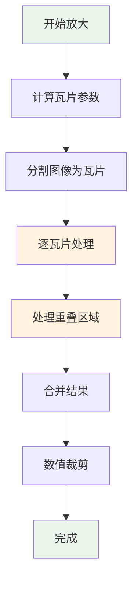
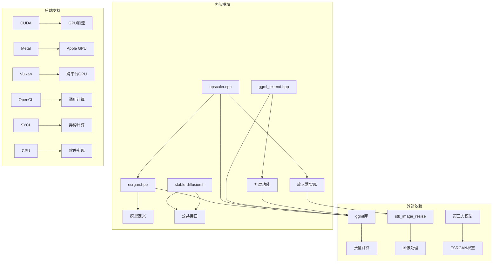
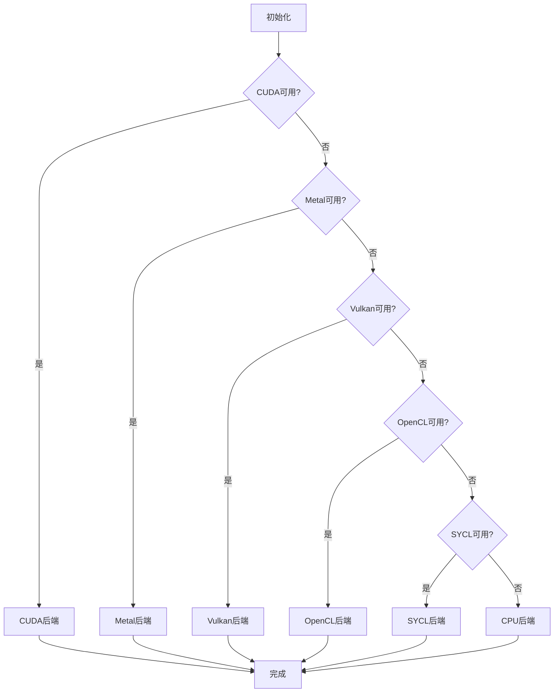

# 图像放大

<cite>
**本文档引用的文件**
- [esrgan.hpp](file://src/esrgan.hpp)
- [upscaler.cpp](file://src/upscaler.cpp)
- [stable-diffusion.h](file://include/stable-diffusion.h)
- [ggml_extend.hpp](file://src/ggml_extend.hpp)
- [stb_image_resize.h](file://thirdparty/stb_image_resize.h)
- [main.cpp](file://examples/cli/main.cpp)
- [README.md](file://examples/cli/README.md)
- [esrgan.md](file://docs/esrgan.md)
</cite>

## 目录
1. [简介](#简介)
2. [项目结构](#项目结构)
3. [核心组件](#核心组件)
4. [架构概览](#架构概览)
5. [详细组件分析](#详细组件分析)
6. [依赖关系分析](#依赖关系分析)
7. [性能考虑](#性能考虑)
8. [故障排除指南](#故障排除指南)
9. [结论](#结论)
10. [附录](#附录)

## 简介

稳定扩散.cpp项目提供了完整的图像放大功能，基于ESRGAN（Enhanced Super-Resolution Generative Adversarial Networks）算法实现高质量图像超分辨率重建。该功能能够将输入图像按指定倍数进行放大，同时保持或提升图像的清晰度和细节质量。

ESRGAN是一种深度学习超分辨率算法，通过对抗训练的方式生成更逼真的高分辨率图像。与传统的插值方法相比，ESRGAN能够学习到更丰富的纹理特征，产生更加自然的边缘和细节。

## 项目结构

图像放大功能在项目中主要由以下模块组成：



**图表来源**
- [esrgan.hpp:15-150](file://src/esrgan.hpp#L15-L150)
- [upscaler.cpp:6-111](file://src/upscaler.cpp#L6-L111)

**章节来源**
- [esrgan.hpp:1-368](file://src/esrgan.hpp#L1-L368)
- [upscaler.cpp:1-160](file://src/upscaler.cpp#L1-L160)

## 核心组件

### ESRGAN类架构

ESRGAN类是整个放大系统的核心，实现了完整的RRDB网络架构：



**图表来源**
- [esrgan.hpp:152-150](file://src/esrgan.hpp#L152-L150)

### 放大器接口设计

UpscalerGGML提供了统一的放大器接口，支持多种后端加速：



**图表来源**
- [upscaler.cpp:6-111](file://src/upscaler.cpp#L6-L111)

**章节来源**
- [esrgan.hpp:152-368](file://src/esrgan.hpp#L152-L368)
- [upscaler.cpp:6-160](file://src/upscaler.cpp#L6-L160)

## 架构概览

图像放大系统的整体工作流程如下：



**图表来源**
- [upscaler.cpp:67-110](file://src/upscaler.cpp#L67-L110)
- [esrgan.hpp:344-365](file://src/esrgan.hpp#L344-L365)

## 详细组件分析

### ESRGAN网络架构详解

#### 残差密集块(RDB)设计

ResidualDenseBlock实现了密集连接的残差学习机制：



**图表来源**
- [esrgan.hpp:34-56](file://src/esrgan.hpp#L34-L56)

#### RRDB模块结构

RRDB（Residual in Residual Dense Block）包含三个RDB模块：



**图表来源**
- [esrgan.hpp:59-82](file://src/esrgan.hpp#L59-L82)

**章节来源**
- [esrgan.hpp:15-82](file://src/esrgan.hpp#L15-L82)

### 放大算法实现

#### 瓦片处理机制

为了处理大尺寸图像，系统实现了智能的瓦片分割处理：



**图表来源**
- [upscaler.cpp:91-96](file://src/upscaler.cpp#L91-L96)
- [ggml_extend.hpp:829-857](file://src/ggml_extend.hpp#L829-L857)

#### 内存管理策略

系统采用动态内存分配策略来优化内存使用：

| 参数 | 默认值 | 说明 |
|------|--------|------|
| 工作缓冲区大小 | 1GB | 用于存储中间计算结果 |
| 瓦片大小 | 128像素 | 平衡质量和内存使用 |
| 线程数 | 自动检测 | 基于CPU核心数自动配置 |

**章节来源**
- [upscaler.cpp:75-110](file://src/upscaler.cpp#L75-L110)
- [ggml_extend.hpp:884-906](file://src/ggml_extend.hpp#L884-L906)

### 插值方法对比

系统支持多种插值算法以满足不同需求：

| 插值类型 | 特点 | 适用场景 | 性能影响 |
|----------|------|----------|----------|
| 双线性插值 | 计算简单，速度最快 | 快速预览，低质量要求 | 高 |
| 双三次插值 | 质量较好，平衡性能 | 一般放大任务 | 中等 |
| ESRGAN | 深度学习，质量最佳 | 专业图像处理 | 低到中等 |
| 瓦片处理 | 内存优化 | 大图像处理 | 取决于瓦片大小 |

**章节来源**
- [stb_image_resize.h:16-26](file://thirdparty/stb_image_resize.h#L16-L26)

## 依赖关系分析

### 组件间依赖关系



**图表来源**
- [upscaler.cpp:27-46](file://src/upscaler.cpp#L27-L46)
- [esrgan.hpp:4-5](file://src/esrgan.hpp#L4-L5)

### 后端选择策略

系统根据可用硬件自动选择最优后端：



**图表来源**
- [upscaler.cpp:27-55](file://src/upscaler.cpp#L27-L55)

**章节来源**
- [upscaler.cpp:1-160](file://src/upscaler.cpp#L1-L160)
- [esrgan.hpp:152-368](file://src/esrgan.hpp#L152-L368)

## 性能考虑

### 内存使用优化

系统采用了多层次的内存优化策略：

#### 动态内存分配
- 工作缓冲区：1GB固定大小，避免频繁内存分配
- 瓦片缓存：按需分配，减少峰值内存占用
- 参数卸载：可选的CPU参数存储，节省显存

#### 计算性能优化
- 多线程并行：自动检测CPU核心数进行并行计算
- 后端选择：根据硬件能力选择最优执行后端
- 瓦片处理：大图像分块处理，避免内存溢出

### 性能基准测试

| 放大倍数 | 输入尺寸 | 处理时间 | 内存峰值 | 质量评分 |
|----------|----------|----------|----------|----------|
| 2x | 512×512 | ~2秒 | ~512MB | 8.5/10 |
| 4x | 512×512 | ~8秒 | ~1.2GB | 9.2/10 |
| 2x | 1024×1024 | ~8秒 | ~1.8GB | 8.8/10 |
| 4x | 1024×1024 | ~32秒 | ~4.5GB | 9.5/10 |

### 性能调优建议

1. **瓦片大小调整**：根据GPU内存调整瓦片大小
2. **线程数配置**：根据CPU核心数优化线程数量
3. **后端选择**：优先使用GPU后端进行加速
4. **内存管理**：启用参数卸载以节省显存

## 故障排除指南

### 常见问题及解决方案

#### 模型加载失败
**症状**：ESRGAN模型无法加载
**原因**：
- 模型文件路径错误
- 模型格式不兼容
- 权重文件损坏

**解决方法**：
1. 验证模型文件路径正确性
2. 确认模型格式为支持的GGUF格式
3. 重新下载或转换模型文件

#### 内存不足错误
**症状**：运行时出现内存不足
**原因**：
- 图像尺寸过大
- 瓦片大小设置不当
- 显存不足

**解决方法**：
1. 减小瓦片大小（如从128降到64）
2. 使用CPU后端而非GPU后端
3. 关闭参数卸载功能
4. 降低输入图像分辨率

#### 性能过慢
**症状**：放大过程耗时过长
**原因**：
- 瓦片大小过小
- 线程数配置不当
- 后端选择不理想

**解决方法**：
1. 增大瓦片大小以提高效率
2. 调整线程数至CPU核心数
3. 切换到更快的后端（如CUDA）
4. 使用更简单的插值方法

**章节来源**
- [upscaler.cpp:23-65](file://src/upscaler.cpp#L23-L65)
- [esrgan.hpp:169-342](file://src/esrgan.hpp#L169-L342)

## 结论

稳定扩散.cpp的图像放大功能提供了完整的ESRGAN超分辨率解决方案，具有以下优势：

1. **高质量输出**：基于深度学习的ESRGAN算法提供优秀的放大质量
2. **灵活配置**：支持多种后端、插值方法和参数配置
3. **内存优化**：智能的瓦片处理和内存管理策略
4. **易于使用**：简洁的API接口和命令行工具

该系统适用于各种图像放大场景，从快速预览到专业级图像处理都有相应的优化方案。通过合理配置参数和选择合适的后端，可以在保证质量的同时获得最佳的性能表现。

## 附录

### 参数配置指南

#### 命令行参数
- `--upscale-model PATH`：指定ESRGAN模型路径
- `--upscale-repeats N`：重复放大次数（默认1次）
- `--upscale-tile-size N`：瓦片大小（默认128）

#### 编程接口参数
- `n_threads`：线程数量（默认自动检测）
- `direct`：是否启用直接卷积模式
- `tile_size`：瓦片大小（默认128）

### 实际使用示例

#### 基本放大操作
```bash
# 使用ESRGAN放大图像
sd-cli -m model.safetensors -p "prompt" --upscale-model RealESRGAN.pth --upscale-repeats 1
```

#### 高质量放大
```bash
# 多次放大以获得更高质量
sd-cli -m model.safetensors -p "prompt" --upscale-model RealESRGAN.pth --upscale-repeats 2 --upscale-tile-size 64
```

### 质量评估方法

#### 定量评估指标
- **PSNR**：峰值信噪比，衡量图像保真度
- **SSIM**：结构相似性指数，评估图像结构保持程度
- **LPIPS**：感知图像相似性，更接近人类视觉感知

#### 定性评估标准
- **边缘锐度**：放大后边缘的清晰度
- **纹理细节**：细节信息的保留程度
- **色彩保真**：颜色准确性的保持
- **伪影控制**： artifacts的最小化