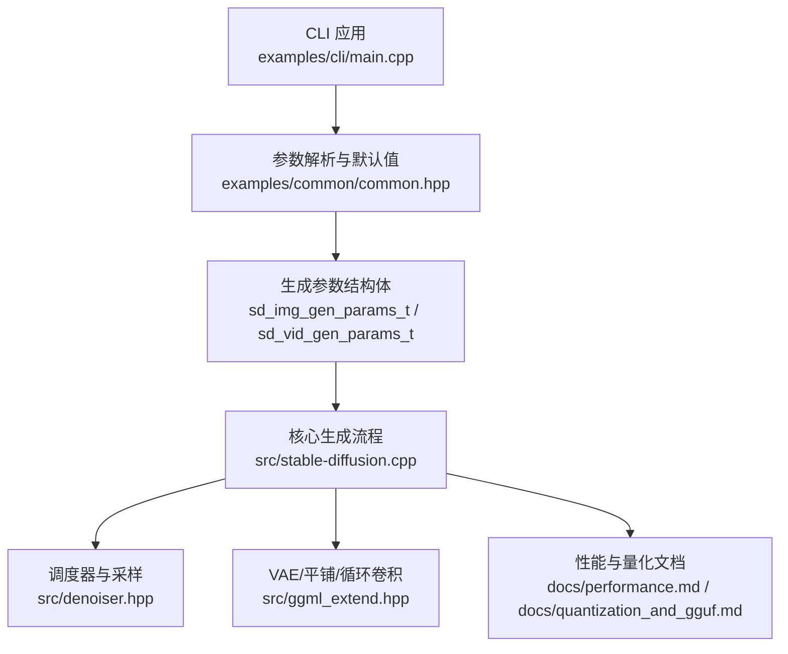
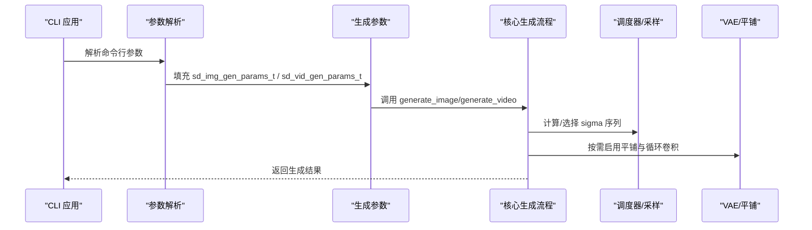
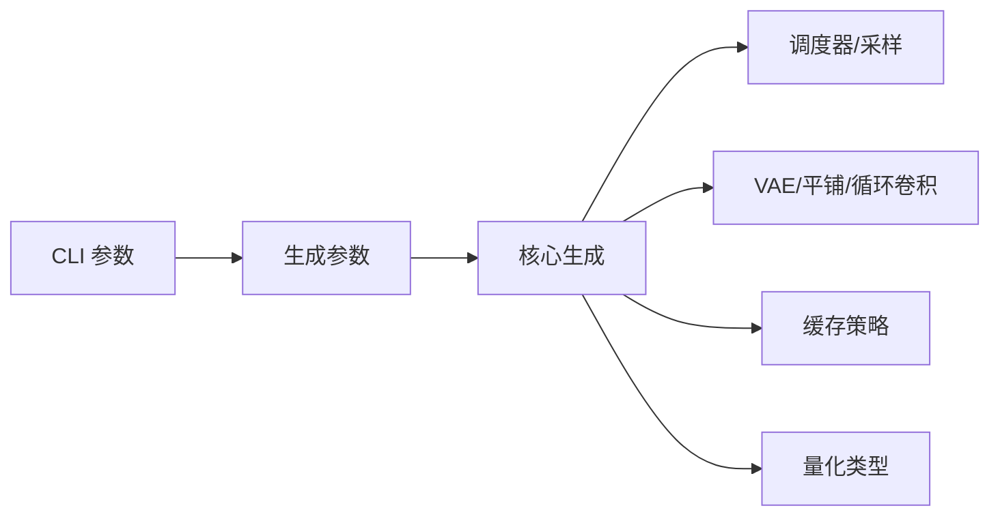

# 参数配置与优化

<cite>
**本文引用的文件**
- [stable-diffusion.h](file://include/stable-diffusion.h)
- [stable-diffusion.cpp](file://src/stable-diffusion.cpp)
- [common.hpp](file://examples/common/common.hpp)
- [main.cpp](file://examples/cli/main.cpp)
- [denoiser.hpp](file://src/denoiser.hpp)
- [ggml_extend.hpp](file://src/ggml_extend.hpp)
- [performance.md](file://docs/performance.md)
- [quantization_and_gguf.md](file://docs/quantization_and_gguf.md)
</cite>

## 目录
1. [简介](#简介)
2. [项目结构](#项目结构)
3. [核心组件](#核心组件)
4. [架构总览](#架构总览)
5. [详细组件分析](#详细组件分析)
6. [依赖关系分析](#依赖关系分析)
7. [性能考量](#性能考量)
8. [故障排除指南](#故障排除指南)
9. [结论](#结论)
10. [附录：参数配置示例与命令行用法](#附录参数配置示例与命令行用法)

## 简介
本文件面向使用 stable-diffusion.cpp 进行图像生成的用户与工程师，系统化梳理并解释图像生成过程中的关键参数及其影响，覆盖采样步数、引导比例（CFG/图像CFG/蒸馏CFG/SLG）、种子、分辨率、调度器与采样方法、VAE平铺（tiling）模式、循环卷积（circular padding）、量化类型、缓存策略等。文档同时提供不同使用场景下的参数推荐、调优指南与常见问题排查建议，并给出命令行参数映射与示例。

## 项目结构
本项目采用“头文件接口 + 多后端实现 + CLI工具”的分层设计：
- 接口层：稳定的公共头文件定义了生成参数结构体与API。
- 核心实现层：包含扩散模型、编解码器、调度器、随机数、缓存等模块。
- 工具层：CLI提供参数解析、默认值设定与运行时行为控制。

图表来源
- [main.cpp:477-793](file://examples/cli/main.cpp#L477-L793)
- [common.hpp:1023-1080](file://examples/common/common.hpp#L1023-L1080)
- [stable-diffusion.cpp:3605-3701](file://src/stable-diffusion.cpp#L3605-L3701)
- [denoiser.hpp:46-544](file://src/denoiser.hpp#L46-L544)
- [ggml_extend.hpp:853-967](file://src/ggml_extend.hpp#L853-L967)
- [performance.md:1-26](file://docs/performance.md#L1-L26)
- [quantization_and_gguf.md:1-27](file://docs/quantization_and_gguf.md#L1-L27)

章节来源
- [stable-diffusion.h:148-336](file://include/stable-diffusion.h#L148-L336)
- [stable-diffusion.cpp:3605-3701](file://src/stable-diffusion.cpp#L3605-L3701)
- [common.hpp:1023-1080](file://examples/common/common.hpp#L1023-L1080)
- [main.cpp:477-793](file://examples/cli/main.cpp#L477-L793)

## 核心组件
- 生成参数结构体
  - 图像生成参数：sd_img_gen_params_t，包含提示词、负向提示词、分辨率、采样参数、强度、种子、批次数、控制图、掩码、参考图、LoRA、PhotoMaker、VAE平铺参数、缓存参数等。
  - 视频生成参数：sd_vid_gen_params_t，扩展了起止帧、高噪声采样参数、MoE边界、视频帧数等。
- 采样与调度参数：sd_sample_params_t，包含采样步数、采样方法、调度器、ETA、自定义sigma序列、位移时间步等。
- 引导参数：sd_guidance_params_t，包含文本CFG、图像CFG、蒸馏CFG、SLG（跳层引导）的缩放、起止百分比与层数列表。
- 平铺参数：sd_tiling_params_t，启用开关、固定/相对瓦片尺寸、目标重叠率等。
- 缓存参数：sd_cache_params_t，多种缓存模式与阈值、窗口、派生阶数等。

章节来源
- [stable-diffusion.h:148-336](file://include/stable-diffusion.h#L148-L336)

## 架构总览
下图展示从CLI到核心生成流程的关键交互路径，以及参数如何在各层传递与生效。

图表来源
- [main.cpp:685-793](file://examples/cli/main.cpp#L685-L793)
- [stable-diffusion.cpp:3677-3701](file://src/stable-diffusion.cpp#L3677-L3701)
- [denoiser.hpp:514-544](file://src/denoiser.hpp#L514-L544)
- [ggml_extend.hpp:853-967](file://src/ggml_extend.hpp#L853-L967)

## 详细组件分析

### 1) 采样步数（Steps）
- 定义位置：sd_sample_params_t.sample_steps
- 默认值：CLI中为20；具体数值可在命令行通过--steps指定
- 影响：
  - 步数越多，通常质量越高但耗时越长
  - 对于某些采样器（如LCM），步数过少可能导致不稳定
- 最佳实践：
  - 快速预览：8~12步
  - 高质量输出：20~50步
  - 批量处理：根据硬件选择10~30步以平衡速度与质量

章节来源
- [common.hpp:1135-1141](file://examples/common/common.hpp#L1135-L1141)
- [stable-diffusion.cpp:3677-3695](file://src/stable-diffusion.cpp#L3677-L3695)

### 2) 引导比例（CFG Scale）
- 定义位置：sd_guidance_params_t.txt_cfg
- 默认值：7.0
- 影响：
  - CFG越大，图像越贴合提示词；过大可能产生伪影或过度锐化
  - 对不同模型（如Flux/SD3/Wan）默认采样方法不同，建议结合采样器调整
- 最佳实践：
  - 文本生成：6~12
  - Inpaint/Img2Img：可适当提高至10~14
  - 批量处理：5~10

章节来源
- [common.hpp:1176-1178](file://examples/common/common.hpp#L1176-L1178)
- [stable-diffusion.cpp:3677-3695](file://src/stable-diffusion.cpp#L3677-L3695)

### 3) 图像引导比例（Img CFG Scale）
- 定义位置：sd_guidance_params_t.img_cfg
- 默认值：与文本CFG相同
- 影响：仅对Inpaint或Instruct-Pix2Pix类模型有效
- 最佳实践：与文本CFG保持一致或略低

章节来源
- [common.hpp:1180-1182](file://examples/common/common.hpp#L1180-L1182)

### 4) 蒸馏引导（Distilled Guidance）
- 定义位置：sd_guidance_params_t.distilled_guidance
- 默认值：3.5
- 影响：用于带引导输入的模型（如部分DiT/Flux变体）
- 最佳实践：中等范围（2.0~5.0）按需微调

章节来源
- [common.hpp:1184-1186](file://examples/common/common.hpp#L1184-L1186)

### 5) 跳层引导（SLG）
- 定义位置：sd_guidance_params_t.slg（scale、layer_start、layer_end、layers）
- 默认值：scale=0（禁用）
- 影响：在特定层数范围内增强/减弱引导，改善细节与稳定性
- 最佳实践：
  - DiT类模型：可尝试scale=2.0~3.5，layer_start≈0.01，layer_end≈0.2
  - 批量处理：建议关闭（scale=0）

章节来源
- [common.hpp:1188-1198](file://examples/common/common.hpp#L1188-L1198)
- [main.cpp:235-243](file://examples/cli/main.cpp#L235-L243)

### 6) 采样方法（Sample Method）
- 可选枚举：EULER、EULER_A、HEUN、DPM2、DPM++2S_A、DPM++2M、DPM++2MV2、IPNDM、IPNDM_V、LCM、DDIM_TRAILING、TCD、RES_MULTISTEP、RES_2S
- 默认值：Flux/SD3/Wan默认Euler；其他默认Euler_A
- 影响：不同采样器在速度、稳定性与质量上差异较大
- 最佳实践：
  - 快速预览：LCM 或 Euler_A
  - 高质量：DPM++2M 或 DPM++2S_A
  - 批量处理：Euler 或 LCM

章节来源
- [stable-diffusion.h:38-54](file://include/stable-diffusion.h#L38-L54)
- [common.hpp:1485-1493](file://examples/common/common.hpp#L1485-L1493)

### 7) 调度器（Scheduler）
- 可选枚举：DISCRETE、KARRAS、EXPONENTIAL、AYS、GITS、SGM_UNIFORM、SIMPLE、SMOOTHSTEP、KL_OPTIMAL、LCM、BONG_TANGENT
- 默认值：DISCRETE
- 影响：决定sigma序列分布，影响去噪过程的稳定性与质量
- 最佳实践：
  - 通用：Karras 或 Discrete
  - LCM：LCM调度器
  - 高质量：Karras 或 GITS

章节来源
- [stable-diffusion.h:56-69](file://include/stable-diffusion.h#L56-L69)
- [denoiser.hpp:46-544](file://src/denoiser.hpp#L46-L544)
- [stable-diffusion.cpp:3687-3695](file://src/stable-diffusion.cpp#L3687-L3695)

### 8) ETA（DDIM/TCD专用）
- 定义位置：sd_sample_params_t.eta
- 默认值：0（DDIM确定性）
- 影响：控制DDIM/TCD的随机性程度
- 最佳实践：追求一致性设为0；需要多样性可适度增大

章节来源
- [common.hpp:1200-1202](file://examples/common/common.hpp#L1200-L1202)

### 9) 自定义Sigma序列（Custom Sigmas）
- 定义位置：sd_sample_params_t.custom_sigmas / custom_sigmas_count
- 影响：完全自定义sigma序列，适合高级调参
- 注意：若提供custom_sigmas，步数会被自动调整为count-1
- 最佳实践：仅在有明确需求时使用

章节来源
- [stable-diffusion.cpp:3679-3685](file://src/stable-diffusion.cpp#L3679-L3685)
- [common.hpp:1499-1500](file://examples/common/common.hpp#L1499-L1500)

### 10) 种子（Seed）
- 定义位置：sd_img_gen_params_t.seed / sd_vid_gen_params_t.seed
- 默认值：42；支持随机种子（负值）
- 影响：控制随机性，相同参数+种子可复现结果
- 最佳实践：
  - 需要可复现：固定种子
  - 批量探索：递增种子

章节来源
- [common.hpp:1480-1483](file://examples/common/common.hpp#L1480-L1483)
- [main.cpp:274-282](file://examples/cli/main.cpp#L274-L282)

### 11) 分辨率与尺寸参数
- 定义位置：sd_img_gen_params_t.width / height；CLI中--width/--height
- 影响：直接影响潜在空间大小与显存占用
- 最佳实践：
  - 512x512：入门与快速测试
  - 768x768：中等质量
  - 1024x1024及以上：高质量但显存压力大
- 注意：CLI会自动记录最终分辨率到输出元数据

章节来源
- [common.hpp:1126-1133](file://examples/common/common.hpp#L1126-L1133)
- [main.cpp](file://examples/cli/main.cpp#L248)

### 12) VAE平铺（Tiling）与循环卷积
- 平铺参数：sd_tiling_params_t（enabled、tile_size_x/y、rel_size_x/y、target_overlap）
- 循环卷积：上下文级circular_x/circular_y
- 影响：
  - 平铺降低显存占用，避免OOM；但可能引入边缘伪影
  - 当启用平铺且潜在空间小于瓦片时，循环卷积会被强制关闭
- 最佳实践：
  - 显存紧张：开启平铺，合理设置重叠率
  - 高质量：优先避免循环卷积导致的伪影

章节来源
- [stable-diffusion.h:148-155](file://include/stable-diffusion.h#L148-L155)
- [stable-diffusion.cpp:2558-2581](file://src/stable-diffusion.cpp#L2558-L2581)
- [stable-diffusion.cpp:3605-3625](file://src/stable-diffusion.cpp#L3605-L3625)
- [ggml_extend.hpp:853-967](file://src/ggml_extend.hpp#L853-L967)

### 13) 量化类型与内存占用
- 量化类型：sd_type_t（f32/f16/q4_0/q4_1/q5_0/q5_1/q8_0/q8_1/...）
- 影响：显著影响显存占用与推理速度
- 最佳实践：
  - 低显存设备：q4系列或q5系列
  - 高质量：f16或f32
  - 提前转换为GGUF并量化可减少加载时开销

章节来源
- [stable-diffusion.h:82-124](file://include/stable-diffusion.h#L82-L124)
- [quantization_and_gguf.md:1-27](file://docs/quantization_and_gguf.md#L1-L27)

### 14) 缓存策略
- 缓存参数：sd_cache_params_t（模式、阈值、窗口、派生阶数等）
- 影响：加速重复生成、减少计算冗余
- 最佳实践：
  - 批量生成：启用缓存（如EasyCache/Ucache）
  - 高质量：谨慎设置阈值，避免过度缓存导致质量退化

章节来源
- [stable-diffusion.h:247-282](file://include/stable-diffusion.h#L247-L282)
- [common.hpp:1419-1477](file://examples/common/common.hpp#L1419-L1477)

## 依赖关系分析
- 参数依赖链：
  - CLI参数解析 → 生成参数结构体 → 核心生成流程 → 调度器/采样 → VAE/平铺/循环卷积
- 关键耦合点：
  - 采样方法与调度器共同决定sigma序列
  - 平铺与循环卷积在VAE阶段相互影响
  - 量化类型影响权重加载与显存占用

图表来源
- [main.cpp:685-793](file://examples/cli/main.cpp#L685-L793)
- [stable-diffusion.cpp:3677-3701](file://src/stable-diffusion.cpp#L3677-L3701)
- [denoiser.hpp:514-544](file://src/denoiser.hpp#L514-L544)
- [ggml_extend.hpp:853-967](file://src/ggml_extend.hpp#L853-L967)

## 性能考量
- Flash Attention
  - 在扩散模型启用可显著降低显存占用，CUDA后端通常提升速度
  - 部分后端可能略有降速，需权衡
- 权重卸载（Offload to CPU）
  - 将权重卸载至CPU可节省显存，不降低生成速度
- 量化
  - 使用更低精度可显著降低显存占用，建议提前转换为GGUF并量化

章节来源
- [performance.md:1-26](file://docs/performance.md#L1-L26)
- [quantization_and_gguf.md:1-27](file://docs/quantization_and_gguf.md#L1-L27)

## 故障排除指南
- 生成结果模糊或伪影
  - 降低CFG或调整采样方法；检查步数是否过低
- 显存不足（OOM）
  - 启用VAE平铺；减小分辨率；使用量化；关闭Flash Attention
- 结果不可复现
  - 固定种子；确保采样方法与调度器一致
- 边缘伪影
  - 关闭循环卷积；增大重叠率；或提高分辨率避免小瓦片

章节来源
- [stable-diffusion.cpp:3605-3625](file://src/stable-diffusion.cpp#L3605-L3625)
- [ggml_extend.hpp:853-967](file://src/ggml_extend.hpp#L853-L967)
- [performance.md:1-26](file://docs/performance.md#L1-L26)

## 结论
合理的参数配置是获得高质量、高性能生成结果的关键。本文提供了从采样步数、引导比例、种子、分辨率到调度器、平铺与量化等全链路参数说明与最佳实践。建议先以CLI默认配置快速验证，再按场景逐步微调，并结合缓存与量化策略提升整体效率。

## 附录：参数配置示例与命令行用法
以下示例基于CLI参数解析与默认值，便于快速上手与批量处理。

- 快速预览（低步数+低CFG）
  - 示例命令：--steps 10 --cfg-scale 6.0 --width 512 --height 512
- 高质量输出（中高步数+中高CFG）
  - 示例命令：--steps 30 --cfg-scale 8.0 --width 768 --height 768
- 批量处理（中低CFG+较低步数）
  - 示例命令：--steps 15 --cfg-scale 6.0 --batch-count 10
- 启用平铺（显存紧张）
  - 示例命令：--tile-size 128 或 --relative-tile-size 0.5
- 启用循环卷积（注意边缘伪影风险）
  - 示例命令：--circular-x --circular-y
- 启用Flash Attention（CUDA后端）
  - 示例命令：--diffusion-fa
- 指定采样方法与调度器
  - 示例命令：--sampling-method euler_a --scheduler karras
- 自定义sigma序列（专家）
  - 示例命令：--sigmas "14.61,7.8,3.5,0.0"

章节来源
- [common.hpp:1135-1172](file://examples/common/common.hpp#L1135-L1172)
- [common.hpp:1485-1500](file://examples/common/common.hpp#L1485-L1500)
- [main.cpp:228-282](file://examples/cli/main.cpp#L228-L282)