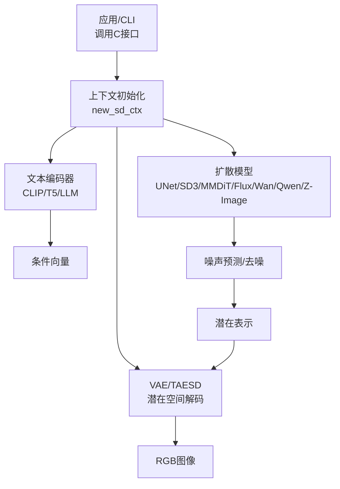
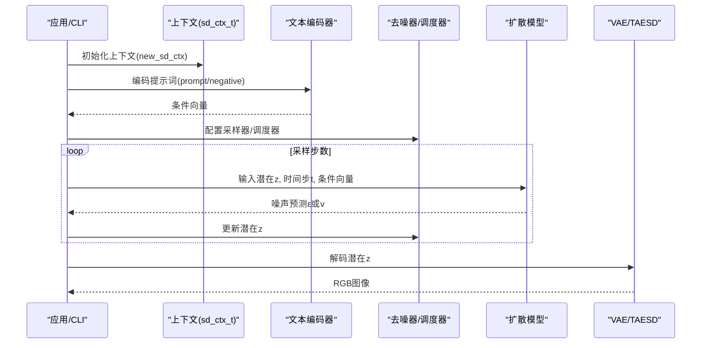
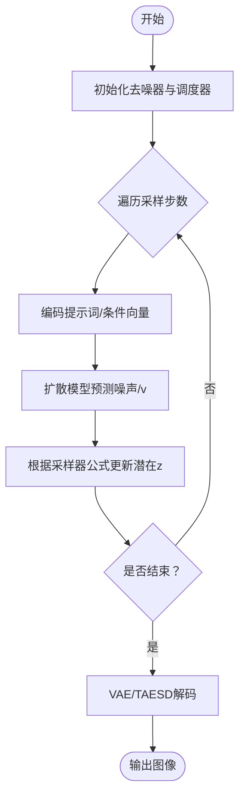
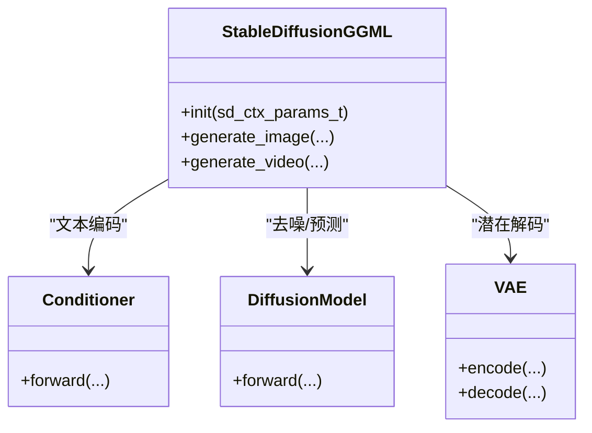
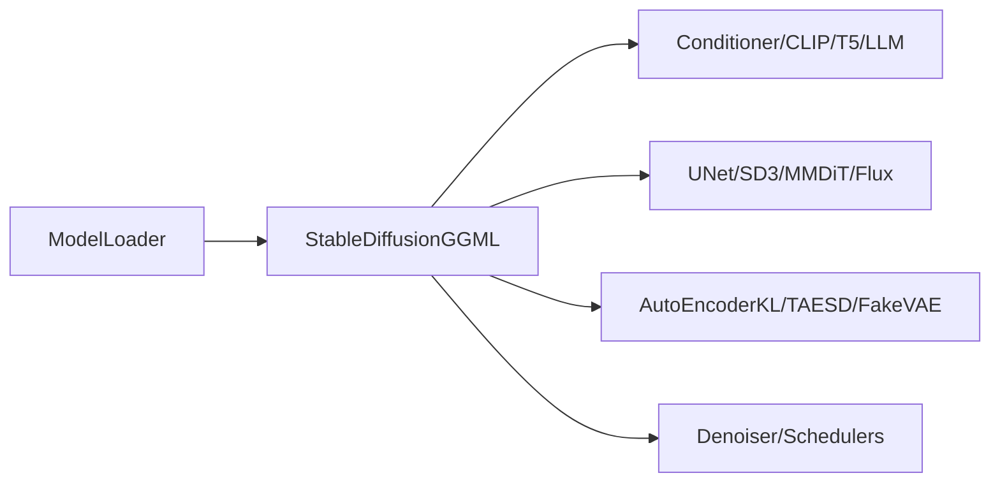

# 图像生成

<cite>
**本文引用的文件**
- [stable-diffusion.h](file://include/stable-diffusion.h)
- [stable-diffusion.cpp](file://src/stable-diffusion.cpp)
- [denoiser.hpp](file://src/denoiser.hpp)
- [unet.hpp](file://src/unet.hpp)
- [vae.hpp](file://src/vae.hpp)
- [clip.hpp](file://src/clip.hpp)
- [model.h](file://src/model.h)
- [main.cpp](file://examples/cli/main.cpp)
- [sd.md](file://docs/sd.md)
- [sd3.md](file://docs/sd3.md)
</cite>

## 目录
1. [简介](#简介)
2. [项目结构](#项目结构)
3. [核心组件](#核心组件)
4. [架构总览](#架构总览)
5. [详细组件分析](#详细组件分析)
6. [依赖关系分析](#依赖关系分析)
7. [性能考量](#性能考量)
8. [故障排查指南](#故障排查指南)
9. [结论](#结论)
10. [附录](#附录)

## 简介
本文件系统性阐述稳定扩散.cpp在图像生成方面的实现与使用，覆盖扩散过程、去噪步骤、采样器与调度器、文本到图像的端到端流程、参数配置要点以及C接口调用示例。同时对比SD1.x、SDXL、SD3等不同模型版本在架构与参数上的差异及优化策略。

## 项目结构
该项目采用模块化设计，围绕“上下文初始化—文本编码—扩散模型推理—潜在空间去噪—图像解码”主线组织代码：
- 接口层：对外暴露C风格API，定义上下文、采样、生成参数等数据结构
- 模型层：按版本选择对应的编码器（CLIP/T5/LLM）、UNet/DiT/Flux等扩散模型、VAE/TAESD解码器
- 计算后端：基于ggml的多后端（CPU/CUDA/Metal/Vulkan/OpenCL/SYCL）抽象
- 示例与文档：命令行工具与使用示例

图示来源
- [stable-diffusion.cpp:238-768](file://src/stable-diffusion.cpp#L238-L768)
- [clip.hpp:456-773](file://src/clip.hpp#L456-L773)
- [unet.hpp:166-590](file://src/unet.hpp#L166-L590)
- [vae.hpp:485-613](file://src/vae.hpp#L485-L613)

章节来源
- [stable-diffusion.cpp:238-768](file://src/stable-diffusion.cpp#L238-L768)
- [model.h:23-54](file://src/model.h#L23-L54)

## 核心组件
- 上下文与参数
  - sd_ctx_params_t：控制模型路径、权重精度、随机数、Flash Attention、循环卷积、LoRA应用模式、VAE解码开关等
  - sd_img_gen_params_t/sd_vid_gen_params_t：图像/视频生成参数，含提示词、负向提示词、尺寸、采样步数、引导比例、种子、控制图、参考图像、掩码、LoRA、缓存策略等
  - sd_sample_params_t：采样器类型、调度器类型、自定义sigmas、flow_shift等
- 采样器与调度器
  - 采样器：Euler、Euler A、Heun、DPM2、DPM++系列、iPNDM/iPNDM_v、LCM、DDIM、TCD、ResMultistep/Res2s等
  - 调度器：离散、Karras、指数、Align-Your-Steps、GITS、SGM Uniform、Simple、SmoothStep、Bong Tangent、KL Optimal、LCM等
- 模型版本与适配
  - 版本枚举覆盖SD1.x、SDXL、SD3、Flux、Flux.2、Wan、Qwen Image、Anima、Z-Image、Ovis Image等
  - 不同版本选择不同的编码器、扩散模型、VAE/TAESD、尺度因子与位移因子等

章节来源
- [stable-diffusion.h:148-336](file://include/stable-diffusion.h#L148-L336)
- [stable-diffusion.cpp:27-57](file://src/stable-diffusion.cpp#L27-L57)
- [stable-diffusion.cpp:403-417](file://src/stable-diffusion.cpp#L403-L417)
- [model.h:23-54](file://src/model.h#L23-L54)

## 架构总览
整体流程从提示词编码开始，经扩散模型逐步去噪，最终由VAE/TAESD解码为图像。CLI示例展示了如何通过C接口完成端到端生成。

图示来源
- [stable-diffusion.cpp:238-768](file://src/stable-diffusion.cpp#L238-L768)
- [denoiser.hpp:480-544](file://src/denoiser.hpp#L480-L544)
- [unet.hpp:423-589](file://src/unet.hpp#L423-L589)
- [vae.hpp:552-612](file://src/vae.hpp#L552-L612)

章节来源
- [main.cpp:706-793](file://examples/cli/main.cpp#L706-L793)

## 详细组件分析

### 扩散过程与去噪步骤
- 去噪器接口与调度器
  - Denoiser提供σ范围、t↔σ映射、缩放系数、噪声缩放/逆缩放等能力
  - 多种调度器（Discrete/Karras/Exponential/AYS/GITS/SGM/LCM等）生成σ序列
- 采样器实现
  - 采样器以σ序列驱动迭代更新潜在z，典型如Euler A、DPM++等
  - 支持自定义sigmas与flow_shift（用于Flow类模型）

图示来源
- [denoiser.hpp:480-544](file://src/denoiser.hpp#L480-L544)
- [denoiser.hpp:764-800](file://src/denoiser.hpp#L764-L800)

章节来源
- [denoiser.hpp:480-760](file://src/denoiser.hpp#L480-L760)

### 文本到图像的完整流程
- 提示词编码
  - CLIP/T5/LLM等编码器将文本转为条件向量，支持clip_skip裁剪层数
- 扩散模型推理
  - UNet/SD3 MMDiT/Flux等根据时间步与条件向量预测噪声
- 潜在空间去噪
  - 依据采样器与调度器更新潜在表示
- 图像解码
  - VAE或TAESD将潜在解码为RGB图像

图示来源
- [stable-diffusion.cpp:103-169](file://src/stable-diffusion.cpp#L103-L169)
- [clip.hpp:456-773](file://src/clip.hpp#L456-L773)
- [unet.hpp:592-674](file://src/unet.hpp#L592-L674)
- [vae.hpp:615-651](file://src/vae.hpp#L615-L651)

章节来源
- [stable-diffusion.cpp:238-768](file://src/stable-diffusion.cpp#L238-L768)

### 采样器与调度器详解
- 采样器类型
  - Euler、Euler A、Heun、DPM2、DPM++ (2s/2M/mod 2M)、iPNDM/iPNDM_v、LCM、DDIM、TCD、Res Multistep/Res 2s
- 调度器类型
  - Discrete、Karras、Exponential、AYS、GITS、SGM Uniform、Simple、SmoothStep、Bong Tangent、KL Optimal、LCM
- 适用场景
  - Euler/Euler A：通用、速度较快
  - DPM++：质量较高，适合高质量生成
  - LCM：极短步数高质量（如5-8步）
  - DDIM：可控更强，适合img2img/inpaint
  - AYS/GITS：特定模型/版本优化
- 参数影响
  - 自定义sigmas可绕过默认调度器
  - flow_shift用于Flow类模型的时间映射

章节来源
- [stable-diffusion.h:38-69](file://include/stable-diffusion.h#L38-L69)
- [stable-diffusion.h:228-238](file://include/stable-diffusion.h#L228-L238)
- [denoiser.hpp:22-443](file://src/denoiser.hpp#L22-L443)

### 不同模型版本的差异与优化
- SD1.x/SD2.x
  - 使用CLIP编码器与UNet扩散模型；scale_factor≈0.18215；支持inpaint/pix2pix/unet-edit
- SDXL
  - 双文本编码器（CLIP-L/G），UNet带ADN标签；scale_factor≈0.13025；支持inpaint/pix2pix/VEGA/SSD1B
- SD3.x
  - 使用SD3 CLIPEmbedder与MMDiT；scale_factor≈1.5305，shift_factor≈0.0609；支持T5/CLIP双模态
- Flux/Flux.2
  - Flux CLIPEmbedder与Flux模型；scale_factor≈0.3611，shift_factor≈0.1159；支持Chroma/LLM
- Wan/Qwen/Z-Image/Ovis
  - 对应专用编码器与扩散模型；部分版本禁用VAE时使用FakeVAE或特殊解码路径

章节来源
- [stable-diffusion.cpp:403-417](file://src/stable-diffusion.cpp#L403-L417)
- [model.h:23-54](file://src/model.h#L23-L54)

### 参数配置说明
- 采样与调度
  - sample_steps：采样步数
  - sample_method：采样器类型
  - scheduler：调度器类型
  - custom_sigmas：自定义σ序列
  - flow_shift：Flow类模型时间映射位移
  - eta：DDIM/Heun等的噪声混合系数
- 引导与提示
  - txt_cfg：文本引导强度
  - img_cfg：图像引导强度（如img2img）
  - distilled_guidance：蒸馏引导强度
  - clip_skip：裁剪CLIP层数
  - prompt/negative_prompt：正负向提示词
- 空间与尺寸
  - width/height：目标分辨率
  - vae_tiling_params：VAE分块解码参数
- 控制与参考
  - init_image/mask_image/control_image/ref_images：初始图/掩码/控制图/参考图
  - control_strength：控制强度
  - auto_resize_ref_image/increase_ref_index：参考图处理策略
- LoRA与缓存
  - loras：LoRA模型列表与倍率
  - cache：缓存策略（Easycache/UCache/DBCache/TaylorSeer/Cache-DiT/Spectrum等）
- 种子与批次数
  - seed：随机种子
  - batch_count：批量数量

章节来源
- [stable-diffusion.h:228-336](file://include/stable-diffusion.h#L228-L336)
- [stable-diffusion.h:148-204](file://include/stable-diffusion.h#L148-L204)

### C接口使用示例
以下示例展示如何通过C接口进行图像生成（路径引用）：
- 创建上下文与生成参数
  - [sd_ctx_params_t 初始化与转换:367-368](file://include/stable-diffusion.h#L367-L368)
  - [sd_img_gen_params_t 初始化与转换:379-380](file://include/stable-diffusion.h#L379-L380)
- 生成图像
  - [generate_image函数声明](file://include/stable-diffusion.h#L381)
  - [CLI中构造参数并调用:727-755](file://examples/cli/main.cpp#L727-L755)
- 生成视频
  - [generate_video函数声明](file://include/stable-diffusion.h#L384)
  - [CLI中构造视频参数并调用:759-781](file://examples/cli/main.cpp#L759-L781)

章节来源
- [stable-diffusion.h:367-384](file://include/stable-diffusion.h#L367-L384)
- [main.cpp:727-781](file://examples/cli/main.cpp#L727-L781)

## 依赖关系分析
- 组件耦合
  - StableDiffusionGGML统一管理后端、文本编码器、扩散模型、VAE/TAESD、LoRA等
  - Denoiser与调度器独立于具体模型，便于替换
- 版本适配
  - ModelLoader解析权重并按版本选择对应组件
- 后端抽象
  - ggml_backend统一CPU/CUDA/Metal/Vulkan/OpenCL/SYCL

图示来源
- [stable-diffusion.cpp:257-352](file://src/stable-diffusion.cpp#L257-L352)
- [model.h:292-343](file://src/model.h#L292-L343)

章节来源
- [stable-diffusion.cpp:238-768](file://src/stable-diffusion.cpp#L238-L768)

## 性能考量
- 后端选择
  - GPU后端（CUDA/Metal/Vulkan/OpenCL/SYCL）通常显著加速
- Flash Attention
  - 可开启以提升注意力计算效率，但需注意与某些模型/特性（如Chroma）的兼容
- 分块与量化
  - 通过sd_type_t与tensor类型规则降低显存占用
- VAE解码优化
  - TAESD用于快速预览；大模型可启用VAE分块解码
- LoRA应用时机
  - 自动/立即/运行时三种模式，量化权重下建议延迟应用以避免精度损失

章节来源
- [stable-diffusion.h:81-124](file://include/stable-diffusion.h#L81-L124)
- [stable-diffusion.cpp:380-401](file://src/stable-diffusion.cpp#L380-L401)

## 故障排查指南
- 权重加载失败
  - 检查模型路径与版本匹配；查看日志输出
- 显存不足
  - 降低分辨率、使用更低精度权重、启用VAE分块、关闭Flash Attention
- 生成质量异常
  - 调整采样器/调度器、步数、引导比例；检查prompt/negative_prompt与clip_skip
- 预览问题
  - 确认预览回调参数与预览模式设置

章节来源
- [stable-diffusion.cpp:238-352](file://src/stable-diffusion.cpp#L238-L352)
- [main.cpp:508-513](file://examples/cli/main.cpp#L508-L513)

## 结论
稳定扩散.cpp通过清晰的模块划分与多后端抽象，实现了从文本到图像的高效生成。不同模型版本在编码器、扩散模型与解码器上各有侧重，结合采样器与调度器的灵活配置，可在速度与质量之间取得平衡。建议根据硬件条件与任务需求选择合适的后端、精度与参数组合。

## 附录
- 使用示例（命令行）
  - [SD1.x/SDXL/SD3/Flux示例:9-18](file://docs/sd.md#L9-L18)
  - [SD3.5 Large示例:16-18](file://docs/sd3.md#L16-L18)