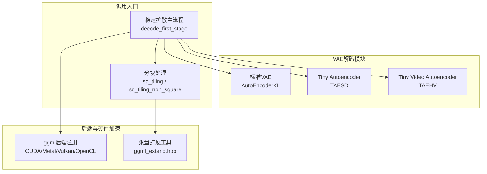
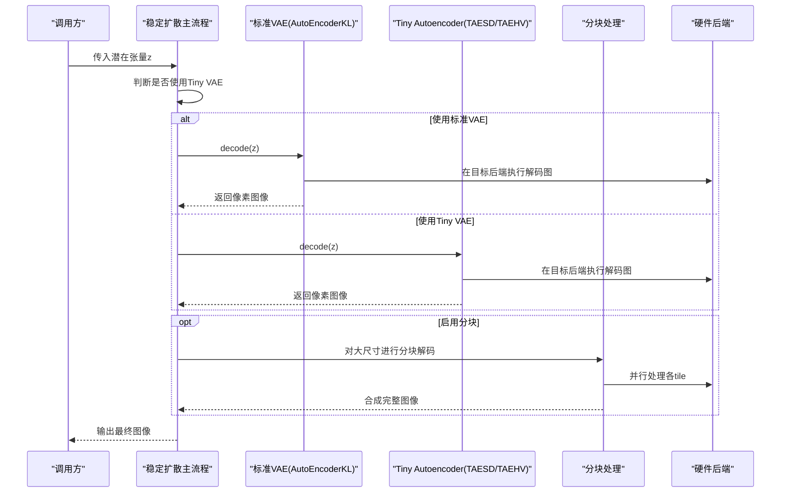
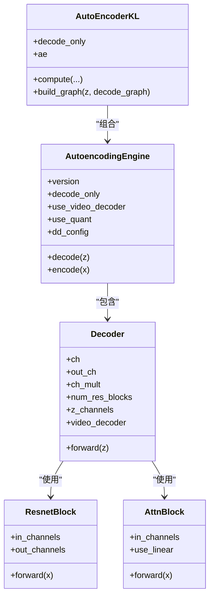
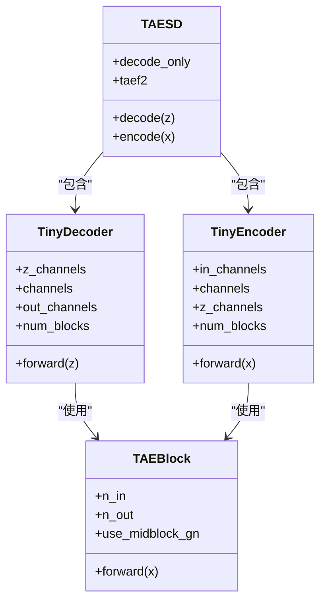
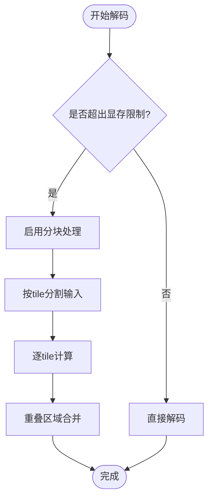
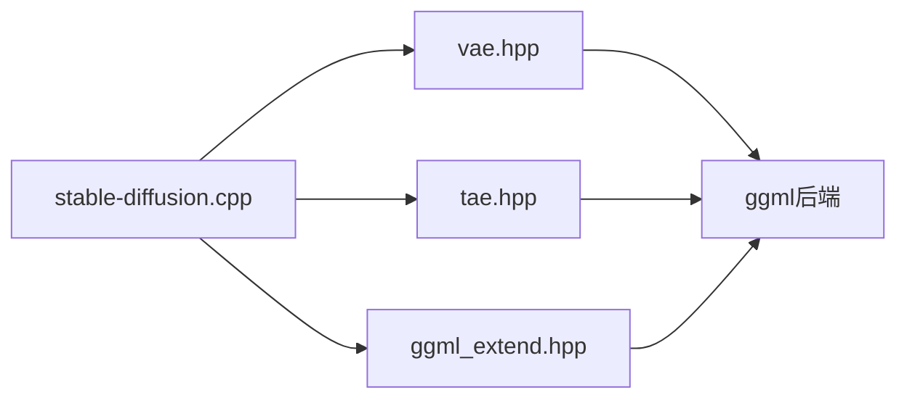

# VAE解码阶段

<cite>
**本文档引用的文件**
- [vae.hpp](file://src/vae.hpp)
- [tae.hpp](file://src/tae.hpp)
- [stable-diffusion.cpp](file://src/stable-diffusion.cpp)
- [taesd.md](file://docs/taesd.md)
- [ggml_extend.hpp](file://src/ggml_extend.hpp)
- [model.cpp](file://src/model.cpp)
</cite>

## 目录
1. [简介](#简介)
2. [项目结构](#项目结构)
3. [核心组件](#核心组件)
4. [架构总览](#架构总览)
5. [详细组件分析](#详细组件分析)
6. [依赖关系分析](#依赖关系分析)
7. [性能考虑](#性能考虑)
8. [故障排除指南](#故障排除指南)
9. [结论](#结论)

## 简介
本文件系统性阐述稳定扩散项目中的VAE解码阶段，涵盖从潜在表示到像素空间图像的完整解码流程。内容包括：
- 标准VAE解码器（AutoEncoderKL）与Tiny Autoencoder（TAESD/TAEHV）的实现细节
- 网络结构、上采样机制、特征重建与质量优化策略
- 不同模型架构下的解码器差异（如SDXL的双通道解码、Flux的特殊解码流程）
- 解码器缓存机制、分块处理与硬件加速的实现方式
- 具体的代码示例路径与内存优化技巧

## 项目结构
本项目采用模块化设计，VAE相关代码主要位于以下文件：
- 标准VAE：src/vae.hpp
- Tiny Autoencoder：src/tae.hpp
- 解码调用入口与分块处理：src/stable-diffusion.cpp
- 文档说明：docs/taesd.md
- 图像张量扩展工具：src/ggml_extend.hpp
- 模型加载与后端初始化：src/model.cpp

**图表来源**
- [stable-diffusion.cpp:2720-2788](file://src/stable-diffusion.cpp#L2720-L2788)
- [vae.hpp:485-613](file://src/vae.hpp#L485-L613)
- [tae.hpp:492-693](file://src/tae.hpp#L492-L693)
- [ggml_extend.hpp:828-967](file://src/ggml_extend.hpp#L828-L967)

**章节来源**
- [stable-diffusion.cpp:2720-2788](file://src/stable-diffusion.cpp#L2720-L2788)
- [vae.hpp:485-613](file://src/vae.hpp#L485-L613)
- [tae.hpp:492-693](file://src/tae.hpp#L492-L693)
- [ggml_extend.hpp:828-967](file://src/ggml_extend.hpp#L828-L967)

## 核心组件
- 标准VAE解码器（AutoEncoderKL）
  - 实现了完整的编码器-解码器结构，支持注意力模块、残差块与上采样
  - 支持不同版本的潜在通道数（如Flux2为32通道）
- Tiny Autoencoder（TAESD）
  - 轻量化解码器，适合快速解码与低显存场景
  - 支持Flux2的patchify/unpatchify特殊流程
- Tiny Video Autoencoder（TAEHV）
  - 面向视频的轻量化编码/解码器，支持帧序列的patch处理
- 分块处理与缓存
  - 提供非方形与方形分块解码，支持重叠拼接与环形边界处理
- 硬件加速后端
  - 自动检测并选择CUDA/Metal/Vulkan/OpenCL等后端

**章节来源**
- [vae.hpp:485-613](file://src/vae.hpp#L485-L613)
- [tae.hpp:492-693](file://src/tae.hpp#L492-L693)
- [stable-diffusion.cpp:2720-2788](file://src/stable-diffusion.cpp#L2720-L2788)
- [ggml_extend.hpp:828-967](file://src/ggml_extend.hpp#L828-L967)

## 架构总览
下图展示了从潜在张量到像素图像的解码流程，以及不同解码器的选择逻辑与分块处理机制。

**图表来源**
- [stable-diffusion.cpp:2720-2788](file://src/stable-diffusion.cpp#L2720-L2788)
- [vae.hpp:652-725](file://src/vae.hpp#L652-L725)
- [tae.hpp:549-620](file://src/tae.hpp#L549-L620)
- [ggml_extend.hpp:828-967](file://src/ggml_extend.hpp#L828-L967)

## 详细组件分析

### 标准VAE解码器（AutoEncoderKL）
- 网络结构
  - 解码器包含中间残差块、注意力块与多分辨率上采样层
  - 支持线性投影与卷积投影两种注意力实现
  - 可选量化后处理（post_quant_conv）
- 上采样机制
  - 逐级上采样，配合残差块与注意力模块
  - 支持视频解码器模式（AE3DConv/VideoResnetBlock）
- 特征重建与质量优化
  - 使用GroupNorm32与Swish激活
  - 注意力计算通过扩展算子实现高效注意力
- 版本差异
  - DIT类模型（如Flux2）使用更高潜在通道数（32通道）
  - SDXL等模型使用双通道潜在表示（double_z）

**图表来源**
- [vae.hpp:485-613](file://src/vae.hpp#L485-L613)
- [vae.hpp:362-483](file://src/vae.hpp#L362-L483)
- [vae.hpp:10-61](file://src/vae.hpp#L10-L61)

**章节来源**
- [vae.hpp:485-613](file://src/vae.hpp#L485-L613)
- [vae.hpp:362-483](file://src/vae.hpp#L362-L483)
- [vae.hpp:10-61](file://src/vae.hpp#L10-L61)

### Tiny Autoencoder（TAESD）
- 网络结构
  - 轻量化编码器/解码器，采用TAEBlock堆叠与多次上采样
  - 支持可选的中段归一化（use_midblock_gn）
- 特殊流程（Flux2）
  - 解码前进行unpatchify（将patch展平为特征图）
  - 编码时进行patchify（将特征图切分为patch）
- 适用场景
  - 快速解码、低显存占用
  - 与Qwen-Image、Wan系列兼容

**图表来源**
- [tae.hpp:492-534](file://src/tae.hpp#L492-L534)
- [tae.hpp:124-184](file://src/tae.hpp#L124-L184)
- [tae.hpp:79-122](file://src/tae.hpp#L79-L122)
- [tae.hpp:16-77](file://src/tae.hpp#L16-L77)

**章节来源**
- [tae.hpp:492-534](file://src/tae.hpp#L492-L534)
- [tae.hpp:124-184](file://src/tae.hpp#L124-L184)
- [tae.hpp:79-122](file://src/tae.hpp#L79-L122)
- [tae.hpp:16-77](file://src/tae.hpp#L16-L77)

### Tiny Video Autoencoder（TAEHV）
- 面向视频的轻量化方案
  - 编码器：通过TPool降采样与MemBlock记忆块堆叠
  - 解码器：通过TGrow上采样与MemBlock恢复特征
  - 支持patch处理（Wan2.2-TI2V-5B）
- 帧序列处理
  - 对时间维度进行填充与重排，适配视频输入格式

**章节来源**
- [tae.hpp:440-490](file://src/tae.hpp#L440-L490)
- [tae.hpp:317-438](file://src/tae.hpp#L317-L438)

### 解码流程与张量操作
- 输入输出张量形状
  - 标准VAE：潜在张量形状为[N, C, h, w]，解码后为[N, 3, h*8, w*8]
  - TAESD：潜在张量形状为[N, C, h, w]，解码后为[N, 3, h*8, w*8]
  - TAEHV：视频潜在张量形状为[W, H, C, T]，解码后为[W, H, 3, T]
- 关键张量操作
  - reshape/permute/concat/upscale等基础操作
  - Flux2特有patchify/unpatchify（2x2 patch）
  - 视频帧重排与填充（Wan系列）

**章节来源**
- [stable-diffusion.cpp:2720-2788](file://src/stable-diffusion.cpp#L2720-L2788)
- [tae.hpp:263-315](file://src/tae.hpp#L263-L315)

### 分块处理与缓存机制
- 分块策略
  - 非方形分块：支持不同tile大小与重叠率
  - 方形分块：针对Tiny VAE的64x64 tile
  - 环形边界：通过circular_x/circular_y处理边缘拼接
- 内存优化
  - 按tile分配工作缓冲区，避免一次性加载全图
  - 合理设置tile_overlap_factor以平衡速度与质量
- 进度反馈
  - 实时打印处理进度与耗时

**图表来源**
- [stable-diffusion.cpp:2752-2788](file://src/stable-diffusion.cpp#L2752-L2788)
- [ggml_extend.hpp:828-967](file://src/ggml_extend.hpp#L828-L967)

**章节来源**
- [stable-diffusion.cpp:2752-2788](file://src/stable-diffusion.cpp#L2752-L2788)
- [ggml_extend.hpp:828-967](file://src/ggml_extend.hpp#L828-L967)

### 硬件加速与后端选择
- 后端自动检测
  - 优先尝试CUDA/Metal/Vulkan/OpenCL等后端
  - 若失败则回退至CPU后端
- 性能优化
  - ggml内部的线程池与分块策略提升并行效率
  - 针对NUMA环境的分块禁用策略

**章节来源**
- [model.cpp:28-39](file://src/model.cpp#L28-L39)
- [model.cpp:113-120](file://src/model.cpp#L113-L120)

## 依赖关系分析
- 组件耦合
  - AutoEncoderKL与AutoencodingEngine强耦合，负责标准VAE的完整生命周期
  - TAESD/TAEHV独立封装，便于在不同模型间切换
  - 分块处理与张量扩展工具解耦，便于移植与维护
- 外部依赖
  - ggml后端（CUDA/Metal/Vulkan/OpenCL）提供底层加速
  - ggml_extend提供张量切分、合并与上采样等工具函数

**图表来源**
- [stable-diffusion.cpp:2720-2788](file://src/stable-diffusion.cpp#L2720-L2788)
- [vae.hpp:652-725](file://src/vae.hpp#L652-L725)
- [tae.hpp:549-620](file://src/tae.hpp#L549-L620)
- [ggml_extend.hpp:828-967](file://src/ggml_extend.hpp#L828-L967)

**章节来源**
- [stable-diffusion.cpp:2720-2788](file://src/stable-diffusion.cpp#L2720-L2788)
- [vae.hpp:652-725](file://src/vae.hpp#L652-L725)
- [tae.hpp:549-620](file://src/tae.hpp#L549-L620)
- [ggml_extend.hpp:828-967](file://src/ggml_extend.hpp#L828-L967)

## 性能考虑
- 选择合适解码器
  - 小显存或快速推理：优先TAESD/TAEHV
  - 高质量与兼容性：使用标准VAE
- 分块参数调优
  - tile_size_x/tile_size_y：根据显存与分辨率权衡
  - tile_overlap_factor：提高边缘质量但增加计算
- 后端选择
  - CUDA通常提供最佳吞吐；Metal适用于macOS；Vulkan/OpenCL跨平台
- 线程与内存
  - 合理设置n_threads，避免过度并行导致上下文切换开销
  - 预估工作缓冲区大小，避免频繁分配

## 故障排除指南
- 显存不足
  - 启用分块解码（Tiny VAE使用64x64 tile，标准VAE使用非方形分块）
  - 减小tile_size或增大overlap以改善质量
- 结果异常
  - 检查潜在张量形状与版本匹配（Flux2需patchify/unpatchify）
  - 确认后端初始化成功，必要时回退至CPU
- 加载权重问题
  - TAESD/TAEHV需指定对应权重文件路径
  - 使用文档提供的下载链接与命令行参数

**章节来源**
- [taesd.md:1-40](file://docs/taesd.md#L1-L40)
- [stable-diffusion.cpp:2773-2788](file://src/stable-diffusion.cpp#L2773-L2788)

## 结论
本项目提供了从潜在空间到像素空间的完整解码链路，既支持高质量的标准VAE，也提供轻量化的Tiny Autoencoder方案，并通过分块处理与硬件加速实现高效推理。针对不同模型（如Flux2、Wan系列）的特殊需求，项目内置了相应的解码流程与参数适配，满足多样化的部署场景。