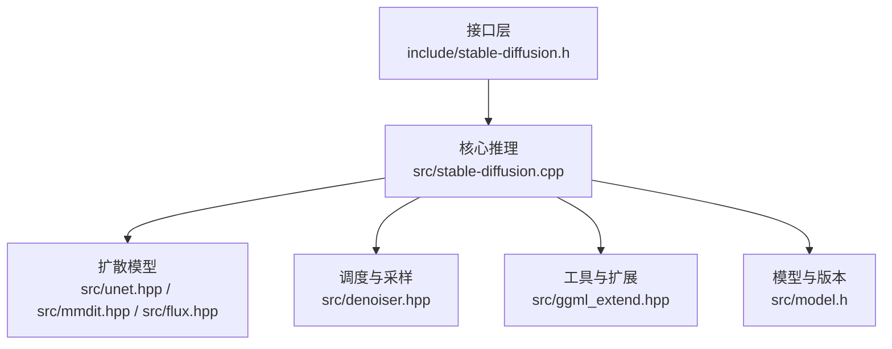
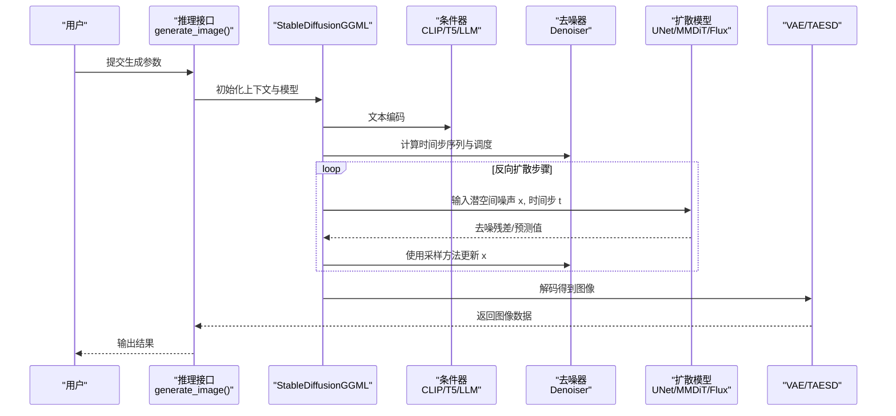
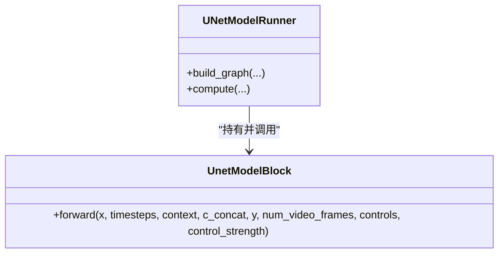
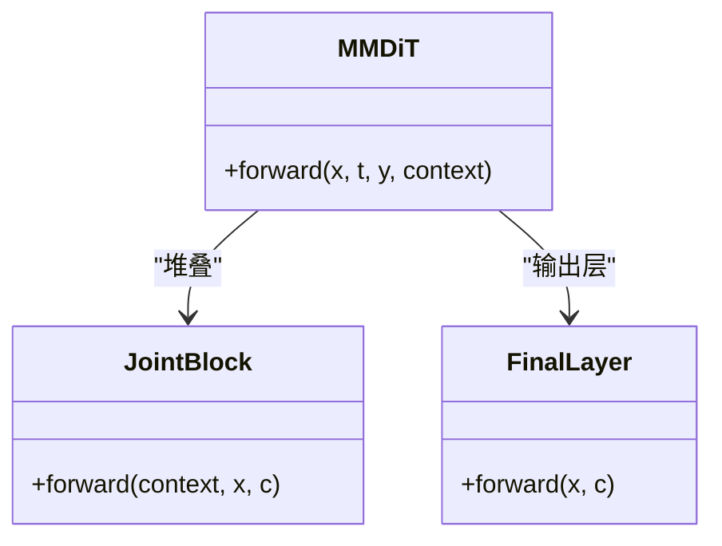
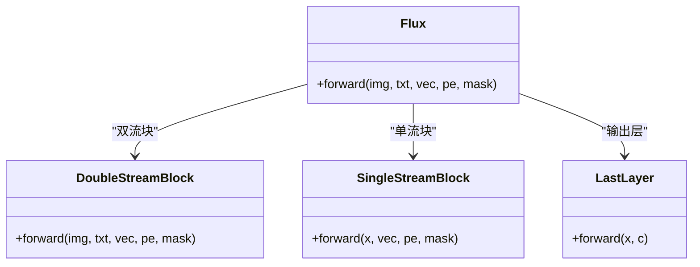
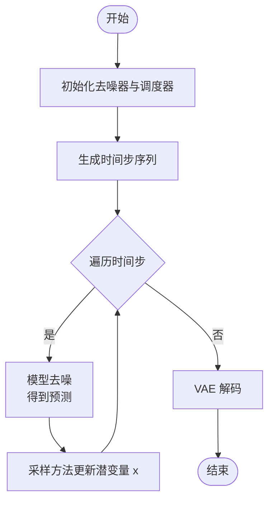
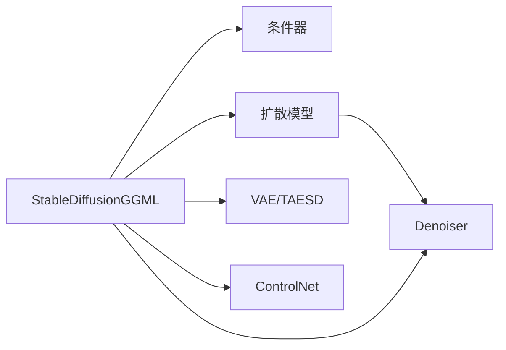

# 扩散模型推理

<cite>
**本文档引用的文件**
- [include/stable-diffusion.h](file://include/stable-diffusion.h)
- [src/stable-diffusion.cpp](file://src/stable-diffusion.cpp)
- [src/unet.hpp](file://src/unet.hpp)
- [src/mmdit.hpp](file://src/mmdit.hpp)
- [src/flux.hpp](file://src/flux.hpp)
- [src/denoiser.hpp](file://src/denoiser.hpp)
- [src/model.h](file://src/model.h)
- [src/ggml_extend.hpp](file://src/ggml_extend.hpp)
</cite>

## 目录
1. [简介](#简介)
2. [项目结构](#项目结构)
3. [核心组件](#核心组件)
4. [架构总览](#架构总览)
5. [详细组件分析](#详细组件分析)
6. [依赖关系分析](#依赖关系分析)
7. [性能考虑](#性能考虑)
8. [故障排查指南](#故障排查指南)
9. [结论](#结论)
10. [附录](#附录)

## 简介
本文件系统性阐述该 C++ 扩散模型推理系统的实现与使用，重点覆盖以下方面：
- 潜在空间中的逐步去噪流程：前向扩散、反向去噪、时间步调度与采样策略
- 不同架构的推理实现：UNet、MMDiT、Flux 等
- 采样方法：Euler、DPM++、LCM 等的数学原理与性能特征
- 推理循环、张量计算与内存管理策略
- 模型缓存、量化技术与并行计算优化

本项目以 ggml 为张量与后端计算框架，支持多后端（CUDA/Metal/Vulkan/OpenCL/SYCL/CPU），并通过统一的推理接口对外提供服务。

## 项目结构
项目采用模块化设计，按功能域划分头文件与源文件：
- 接口层：对外暴露稳定的 C 接口与参数结构体
- 核心推理：扩散模型、条件器、VAE、控制网络等
- 架构适配：UNet、MMDiT、Flux 等不同骨干网络
- 调度与采样：多种噪声调度器与采样方法
- 工具与扩展：张量操作、量化、缓存、并行等

**图表来源**
- [include/stable-diffusion.h:1-423](file://include/stable-diffusion.h#L1-L423)
- [src/stable-diffusion.cpp:1-800](file://src/stable-diffusion.cpp#L1-L800)
- [src/unet.hpp:1-719](file://src/unet.hpp#L1-L719)
- [src/mmdit.hpp:1-800](file://src/mmdit.hpp#L1-L800)
- [src/flux.hpp:1-800](file://src/flux.hpp#L1-L800)
- [src/denoiser.hpp:1-800](file://src/denoiser.hpp#L1-L800)
- [src/ggml_extend.hpp:1-800](file://src/ggml_extend.hpp#L1-L800)
- [src/model.h:1-346](file://src/model.h#L1-L346)

**章节来源**
- [include/stable-diffusion.h:1-423](file://include/stable-diffusion.h#L1-L423)
- [src/stable-diffusion.cpp:1-800](file://src/stable-diffusion.cpp#L1-L800)
- [src/model.h:1-346](file://src/model.h#L1-L346)

## 核心组件
- 接口与参数
  - 对外提供生成图像/视频的统一入口，包含采样参数、调度器类型、采样方法、LoRA/Lora 应用模式、缓存策略等
  - 支持多种预测类型（如 epsilon 预测、v 预测、flow 预测等）
- 后端与运行时
  - 自动选择后端（CUDA/Metal/Vulkan/OpenCL/SYCL/CPU），可配置线程数、是否将参数卸载到 CPU、是否启用 Flash Attention 等
- 模型加载与版本识别
  - 通过 ModelLoader 从多种格式加载权重，自动识别模型版本并构建对应组件
- 扩散模型适配
  - UNet（SD1.x/SD2.x/SDXL）、MMDiT（SD3.x）、Flux/Flux.2（DiT 类变体）等
- 条件器与 VAE
  - CLIP/T5/LLM 等文本编码器，VAE/TAESD 解码器
- 调度与采样
  - 多种噪声调度器（离散、Karras、指数、AYSS、GITS、SGM 均匀、LCM、平滑步进、KL 最优、BongTangent 等）
  - 多种采样方法（Euler、Heun、DPM2、DPM++、LCM、DDIM 等）

**章节来源**
- [include/stable-diffusion.h:148-336](file://include/stable-diffusion.h#L148-L336)
- [src/stable-diffusion.cpp:238-768](file://src/stable-diffusion.cpp#L238-L768)
- [src/model.h:23-174](file://src/model.h#L23-L174)

## 架构总览
下图展示了推理主流程：输入提示词与初始噪声，经条件器编码，扩散模型在潜在空间逐步去噪，最终由 VAE 解码得到图像。

**图表来源**
- [src/stable-diffusion.cpp:103-170](file://src/stable-diffusion.cpp#L103-L170)
- [src/denoiser.hpp:480-760](file://src/denoiser.hpp#L480-L760)

## 详细组件分析

### UNet 架构推理
- 结构要点
  - 编码器-解码器对称结构，带注意力层与下采样/上采样
  - 支持 SD1.x/SD2.x/SDXL/Inpaint/Edit 等变体
  - 视频版支持时空注意力（SVD）
- 关键路径
  - 时间嵌入、条件嵌入（CLIP/SDXL ADM）、注意力块、残差块
  - 控制网络（ControlNet）条件注入
- 运行时
  - 通过 GGMLRunner 构建计算图，支持后端加速与参数卸载

**图表来源**
- [src/unet.hpp:167-590](file://src/unet.hpp#L167-L590)
- [src/unet.hpp:592-716](file://src/unet.hpp#L592-L716)

**章节来源**
- [src/unet.hpp:1-719](file://src/unet.hpp#L1-L719)

### MMDiT（SD3.x）推理
- 结构要点
  - PatchEmbed + 多层 JointBlock（跨模态注意力 + 自注意力 + MLP）
  - FinalLayer 输出 patch 尺度的预测
- 关键路径
  - 图像 token 与文本 token 共享注意力头
  - AdaIN/Modulation 控制跨层条件注入
- 运行时
  - 支持 Flash Attention，位置嵌入随分辨率裁剪

**图表来源**
- [src/mmdit.hpp:611-806](file://src/mmdit.hpp#L611-L806)
- [src/mmdit.hpp:553-575](file://src/mmdit.hpp#L553-L575)
- [src/mmdit.hpp:577-609](file://src/mmdit.hpp#L577-L609)

**章节来源**
- [src/mmdit.hpp:1-800](file://src/mmdit.hpp#L1-L800)

### Flux/Flux.2（DiT 变体）推理
- 结构要点
  - 双流块（DoubleStreamBlock）：图像流与文本流并行处理
  - 单流块（SingleStreamBlock）：融合注意力与 MLP 的高效设计
  - 最终层（LastLayer）输出 patch 尺度预测
- 关键路径
  - RoPE 位置编码、RMSNorm、SiLU/GELU 激活
  - Modulation（shift/scale/gate）条件注入
- 运行时
  - 支持裁剪式位置嵌入、可选的 YAK-MLP/SiLU 激活

**图表来源**
- [src/flux.hpp:763-806](file://src/flux.hpp#L763-L806)
- [src/flux.hpp:315-414](file://src/flux.hpp#L315-L414)
- [src/flux.hpp:465-523](file://src/flux.hpp#L465-L523)
- [src/flux.hpp:525-578](file://src/flux.hpp#L525-L578)

**章节来源**
- [src/flux.hpp:1-800](file://src/flux.hpp#L1-L800)

### 去噪器与采样流程
- 去噪器接口
  - 定义 sigma_min/sigma_max、sigma 与 t 的映射、缩放因子、噪声缩放/逆缩放
- 常见实现
  - CompVisDenoiser（epsilon 预测）
  - CompVisVDenoiser（v 预测）
  - EDMVDenoiser（EDM v 预测）
  - DiscreteFlowDenoiser / FluxFlowDenoiser（flow 预测）
- 采样方法
  - Euler、Euler A、Heun、DPM2、DPM++（2s/2M/modified 2M）、iPNDM/iPNDM_v、LCM、DDIM、TCD、ResMultistep/Res2s 等
- 时间步调度
  - 离散、Karras、指数、AYSS、GITS、SGM 均匀、LCM、平滑步进、KL 最优、BongTangent 等

**图表来源**
- [src/denoiser.hpp:480-760](file://src/denoiser.hpp#L480-L760)
- [src/denoiser.hpp:22-443](file://src/denoiser.hpp#L22-L443)

**章节来源**
- [src/denoiser.hpp:1-800](file://src/denoiser.hpp#L1-L800)

### 推理循环与张量计算
- 推理循环
  - 从随机噪声开始，按时间步迭代：模型前向得到预测，采样器更新潜变量，最后解码
- 张量计算
  - ggml 扩展函数：张量拼接、切分、仿射变换、注意力、激活、掩码、重排等
  - 支持 GPU/CPU 并行与内存对齐
- 内存管理
  - 参数可卸载至 CPU，避免显存压力
  - 支持 mmap 加载大模型权重
  - 切片与重叠合成用于超大图像或视频的分块推理

**章节来源**
- [src/ggml_extend.hpp:1-800](file://src/ggml_extend.hpp#L1-L800)
- [src/stable-diffusion.cpp:770-800](file://src/stable-diffusion.cpp#L770-L800)

### 采样方法与调度器详解
- Euler/Euler A/Heun/DPM2/DPM++（2s/2M/modified 2M）
  - 基于 ODE 的一步或多步积分，DPM++ 通过二阶导信息提升稳定性与速度
- LCM（Latent Consistency Models）
  - 在潜在空间的一致性训练，显著减少采样步数，适合实时应用
- DDIM/TCD/ResMultistep/Res2s
  - DDIM 无噪声，适合可控生成；TCD 针对视频/时序一致性；ResMultistep/Res2s 为多步长方案
- 调度器
  - Karras、指数、AYSS、GITS、SGM 均匀、LCM、平滑步进、KL 最优、BongTangent
  - 影响噪声强度分布与收敛行为，需与采样方法匹配

**章节来源**
- [include/stable-diffusion.h:38-69](file://include/stable-diffusion.h#L38-L69)
- [src/denoiser.hpp:22-443](file://src/denoiser.hpp#L22-L443)

### 模型缓存、量化与并行优化
- 模型缓存
  - 支持多种缓存模式（Easycache、Ucache、Dbcache、TaylorSeer、Cache-DiT、Spectrum 等）
  - 可配置阈值、窗口大小、衍生阶数等参数，以平衡精度与速度
- 量化与类型规则
  - 支持多种 ggml 数据类型（F32/F16/Q 系列等），可通过规则覆盖
  - LoRA 可延迟合并，避免量化带来的精度损失
- 并行与后端
  - 自动选择 CUDA/Metal/Vulkan/OpenCL/SYCL/CPU 后端
  - 可开启 Flash Attention、卷积直连、环形卷积等优化

**章节来源**
- [include/stable-diffusion.h:247-282](file://include/stable-diffusion.h#L247-L282)
- [src/stable-diffusion.cpp:350-401](file://src/stable-diffusion.cpp#L350-L401)
- [src/stable-diffusion.cpp:737-757](file://src/stable-diffusion.cpp#L737-L757)

## 依赖关系分析
- 组件耦合
  - StableDiffusionGGML 作为协调者，持有条件器、扩散模型、VAE/TAESD、控制网络等
  - 扩散模型与去噪器通过统一接口交互，便于替换不同架构
- 外部依赖
  - ggml 及其后端（CUDA/Metal/Vulkan/OpenCL/SYCL/CPU）
  - JSON、ZIP、GGUF 等辅助库用于配置与权重加载
- 版本与架构映射
  - 通过 SDVersion 判定模型类型，自动选择对应组件（UNet/MMDiT/Flux）

**图表来源**
- [src/stable-diffusion.cpp:103-170](file://src/stable-diffusion.cpp#L103-L170)
- [src/model.h:23-174](file://src/model.h#L23-L174)

**章节来源**
- [src/stable-diffusion.cpp:103-170](file://src/stable-diffusion.cpp#L103-L170)
- [src/model.h:23-174](file://src/model.h#L23-L174)

## 性能考虑
- 采样步数与速度
  - LCM 显著降低步数，适合实时生成；DPM++ 在质量与速度间折中
- 后端选择
  - GPU 后端（CUDA/Metal/Vulkan/OpenCL/SYCL）通常更快；CPU 后端更稳定
- 内存与带宽
  - 参数卸载、mmap、分块推理可缓解显存/内存压力
  - Flash Attention、卷积直连、环形卷积等可提升吞吐
- 量化与精度
  - 量化可节省内存，但可能影响精度；LoRA 延迟合并可减少量化误差

## 故障排查指南
- 常见问题
  - 后端初始化失败：检查环境变量与设备可用性（如 SD_VK_DEVICE）
  - 权重加载失败：确认模型路径与格式（GGUF/safetensors/ckpt/diffusers）
  - 显存不足：启用参数卸载、降低分辨率、减少批大小、关闭 Flash Attention
  - 生成异常：调整采样方法与调度器、检查提示词长度与 LoRA 设置
- 日志与回调
  - 使用日志回调与进度回调定位瓶颈与错误
- 调试建议
  - 使用最小参数复现问题
  - 分阶段验证：条件器输出、扩散模型前向、去噪器更新、VAE 解码

**章节来源**
- [src/stable-diffusion.cpp:171-226](file://src/stable-diffusion.cpp#L171-L226)
- [include/stable-diffusion.h:344-346](file://include/stable-diffusion.h#L344-L346)

## 结论
本项目提供了统一、可扩展且高性能的扩散模型推理框架，覆盖多种主流架构与采样策略，并在后端加速、内存管理、量化与缓存等方面进行了系统优化。通过清晰的接口与模块化设计，用户可在不同硬件与场景下灵活选择与组合组件，实现高质量、高效率的图像/视频生成。

## 附录
- 关键实现路径参考
  - UNet 前向与控制注入：[src/unet.hpp:423-589](file://src/unet.hpp#L423-L589)
  - MMDiT 前向与联合块：[src/mmdit.hpp:777-806](file://src/mmdit.hpp#L777-L806)
  - Flux 双流/单流块与 Modulation：[src/flux.hpp:315-414](file://src/flux.hpp#L315-L414)
  - 采样循环与调度器：[src/denoiser.hpp:764-800](file://src/denoiser.hpp#L764-L800)
  - 张量扩展与内存管理：[src/ggml_extend.hpp:776-800](file://src/ggml_extend.hpp#L776-L800)