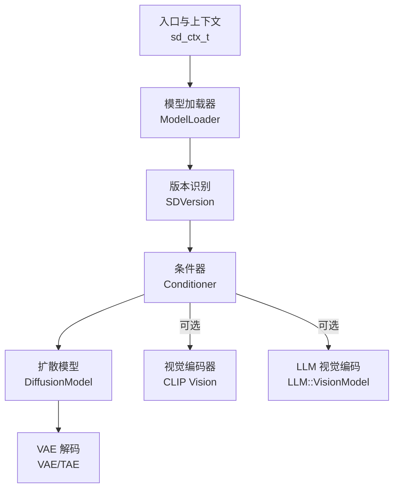
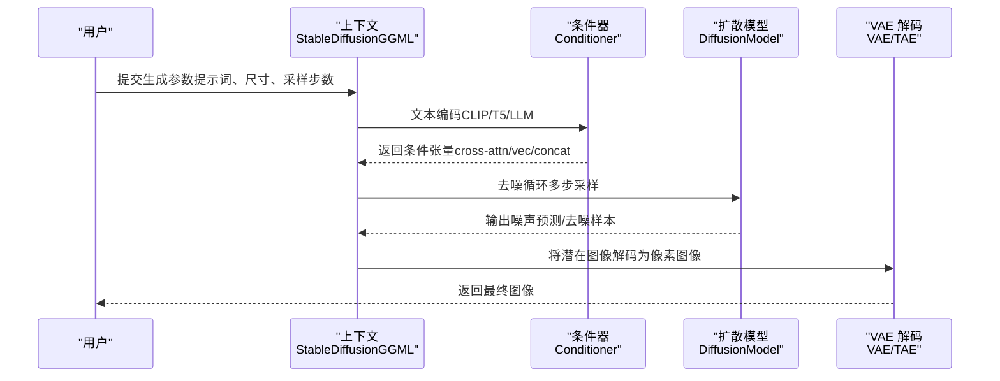
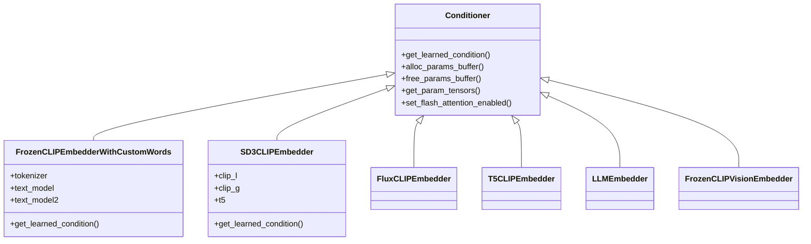
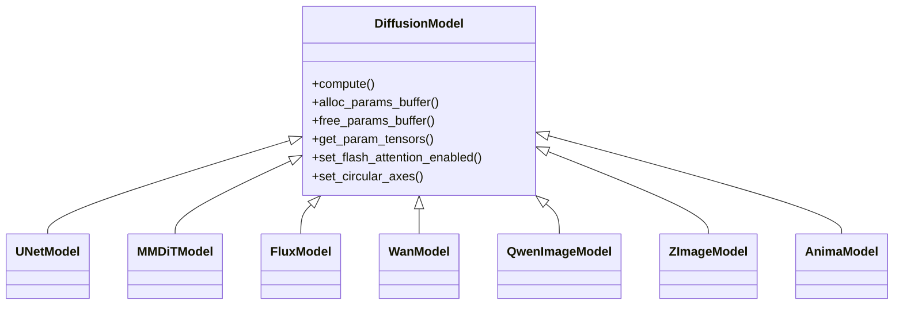
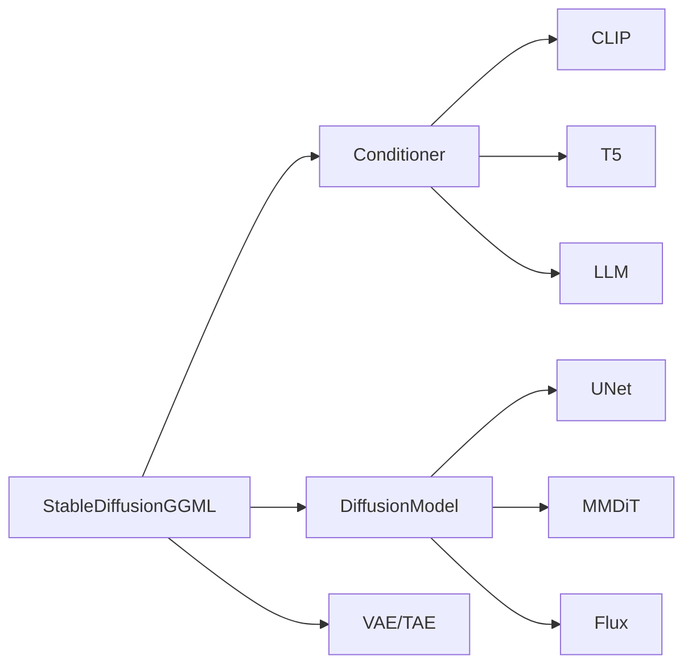

# 文本到图像生成流程

<cite>
**本文档引用的文件**
- [stable-diffusion.h](file://include/stable-diffusion.h)
- [stable-diffusion.cpp](file://src/stable-diffusion.cpp)
- [model.h](file://src/model.h)
- [model.cpp](file://src/model.cpp)
- [conditioner.hpp](file://src/conditioner.hpp)
- [clip.hpp](file://src/clip.hpp)
- [t5.hpp](file://src/t5.hpp)
- [llm.hpp](file://src/llm.hpp)
- [diffusion_model.hpp](file://src/diffusion_model.hpp)
</cite>

## 目录
1. [简介](#简介)
2. [项目结构](#项目结构)
3. [核心组件](#核心组件)
4. [架构总览](#架构总览)
5. [详细组件分析](#详细组件分析)
6. [依赖关系分析](#依赖关系分析)
7. [性能考虑](#性能考虑)
8. [故障排除指南](#故障排除指南)
9. [结论](#结论)

## 简介
本文件面向希望深入理解“文本到图像”生成全流程的开发者与研究者，基于该 C++ 仓库的源码，系统梳理从文本提示词到最终图像输出的完整管线：包括文本编码阶段（CLIP、T5、LLM 等）、条件器处理、扩散模型推理以及 VAE 解码等关键步骤。文档同时对比 SDXL、SD3、Flux 等不同架构在文本处理上的差异，并给出参数配置与内存管理策略建议。

## 项目结构
该项目采用模块化设计，核心流程由以下层次构成：
- 入口与上下文：通过 C 接口暴露的上下文对象承载模型加载、调度与回调。
- 模型加载与版本识别：统一的模型加载器负责解析多种权重格式并推断模型版本。
- 文本编码与条件器：根据版本选择 CLIP、T5 或 LLM 的文本编码路径，并生成跨注意力、向量条件等。
- 扩散模型：针对不同架构（UNet、MMDiT、Flux、WAN、Qwen、Z-Image、Anima）构建前向图并执行去噪。
- VAE 解码：将扩散后的潜在空间图像解码为像素级图像。

图表来源
- [stable-diffusion.cpp:238-768](file://src/stable-diffusion.cpp#L238-L768)
- [model.h:23-54](file://src/model.h#L23-L54)
- [conditioner.hpp:34-53](file://src/conditioner.hpp#L34-L53)
- [diffusion_model.hpp:29-44](file://src/diffusion_model.hpp#L29-L44)

章节来源
- [stable-diffusion.cpp:238-768](file://src/stable-diffusion.cpp#L238-L768)
- [model.h:23-54](file://src/model.h#L23-L54)

## 核心组件
- 上下文与参数
  - sd_ctx_t：封装后端、模型、随机数、LoRA、缓存等运行时状态。
  - sd_img_gen_params_t：包含提示词、尺寸、采样步数、调度器、引导强度、VAE 平铺参数等。
- 模型加载与版本
  - ModelLoader：支持 GGUF、safetensors、checkpoint、diffusers 等格式；自动转换张量名并统计权重类型分布。
  - SDVersion：统一识别 SD1.x、SD2.x、SDXL、SD3、Flux、Flux.2、WAN、Qwen、Anima、Z-Image、Ovis 等版本。
- 条件器与文本编码
  - Conditioner 抽象：不同版本选择不同的文本编码器组合（CLIP、T5、LLM），并生成 c_crossattn、c_vector、c_concat 等条件。
- 扩散模型
  - DiffusionModel 抽象：UNetModel、MMDiTModel、FluxModel、WanModel、QwenImageModel、ZImageModel、AnimaModel 等具体实现。
- VAE 解码
  - AutoEncoderKL、TinyAutoEncoder、TinyVideoAutoEncoder 等，支持 Conv2d 直连与平铺解码。

章节来源
- [stable-diffusion.h:148-313](file://include/stable-diffusion.h#L148-L313)
- [model.h:23-54](file://src/model.h#L23-L54)
- [conditioner.hpp:34-53](file://src/conditioner.hpp#L34-L53)
- [diffusion_model.hpp:29-44](file://src/diffusion_model.hpp#L29-L44)

## 架构总览
下图展示了从文本到图像的关键数据流与模块交互：

图表来源
- [stable-diffusion.cpp:238-768](file://src/stable-diffusion.cpp#L238-L768)
- [conditioner.hpp:34-53](file://src/conditioner.hpp#L34-L53)
- [diffusion_model.hpp:29-44](file://src/diffusion_model.hpp#L29-L44)

## 详细组件分析

### 文本编码与条件器处理
- SD1.x/SD2.x/SDXL
  - 使用 FrozenCLIPEmbedderWithCustomWords，结合 CLIPTextModelRunner（OpenAI CLIP ViT-L/14 或 OpenCLIP ViT-H/14、ViTBigg-14），支持自定义嵌入与 CLIP 跳层（clip_skip）。
  - 多段提示词按 77-token 块分片，加权缩放后拼接，生成 [N, n_token, hidden_size] 的 cross-attn 特征；SDXL 还额外生成 ADM 向量（original/target/crop 时间步嵌入）。
- SD3
  - 同时使用 CLIP-L、CLIP-G 与 T5-XXL 编码器，三路特征融合后作为条件输入。
- Flux 家族（Flux、Flux Fill/Controls、Flex-2、Ovis）
  - FluxCLIPEmbedder 或 T5CLIPEmbedder（Chroma）或 LLMEmbedder（Ovis/Z-Image），生成跨注意力与向量条件；部分版本支持掩码与 DIT 掩码。
- WAN/Qwen/Z-Image/Anima
  - LLMEmbedder（Qwen、Z-Image）或 AnimaConditioner（Anima），结合视觉编码器（如 FrozenCLIPVisionEmbedder）进行图文联合编码。

图表来源
- [conditioner.hpp:34-136](file://src/conditioner.hpp#L34-L136)
- [conditioner.hpp:710-800](file://src/conditioner.hpp#L710-L800)
- [clip.hpp:458-773](file://src/clip.hpp#L458-L773)
- [t5.hpp:756-800](file://src/t5.hpp#L756-L800)
- [llm.hpp:475-515](file://src/llm.hpp#L475-L515)

章节来源
- [conditioner.hpp:57-651](file://src/conditioner.hpp#L57-L651)
- [clip.hpp:458-773](file://src/clip.hpp#L458-L773)
- [t5.hpp:756-800](file://src/t5.hpp#L756-L800)
- [llm.hpp:475-515](file://src/llm.hpp#L475-L515)

### 扩散模型推理
- UNet（SD1.x/SD2.x/SDXL）
  - UNetModel 包装 UNetRunner，接收 x、timesteps、context、y 等输入，返回噪声预测。
- MMDiT（SD3）
  - MMDiTModel 包装 MMDiTRunner，融合 CLIP/L/G 与 T5 的条件，输出去噪样本。
- Flux 家族
  - FluxModel 包装 Flux::FluxRunner，支持掩码、参考潜移、控制帧等高级特性。
- WAN/Qwen/Z-Image/Anima
  - 对应 WanModel、QwenImageModel、ZImageModel、AnimaModel，分别适配各自架构的输入与输出。

图表来源
- [diffusion_model.hpp:29-515](file://src/diffusion_model.hpp#L29-L515)

章节来源
- [diffusion_model.hpp:46-310](file://src/diffusion_model.hpp#L46-L310)
- [diffusion_model.hpp:112-174](file://src/diffusion_model.hpp#L112-L174)
- [diffusion_model.hpp:176-244](file://src/diffusion_model.hpp#L176-L244)
- [diffusion_model.hpp:312-380](file://src/diffusion_model.hpp#L312-L380)
- [diffusion_model.hpp:382-448](file://src/diffusion_model.hpp#L382-L448)
- [diffusion_model.hpp:450-515](file://src/diffusion_model.hpp#L450-L515)

### VAE 解码与潜在空间
- AutoEncoderKL：标准 VAE 解码，支持 Conv2d 直连与平铺解码以降低显存占用。
- TinyAutoEncoder/TinyVideoAutoEncoder：轻量化解码器，适用于视频或资源受限场景。
- 参数控制：可通过 vae_tiling_params 控制 tile 尺寸与重叠率，减少显存峰值。

章节来源
- [stable-diffusion.cpp:613-675](file://src/stable-diffusion.cpp#L613-L675)

### 不同架构的文本处理差异
- SD1.x/SD2.x/SDXL
  - 单路或双路 CLIP 文本编码，SDXL 额外生成 ADM 向量。
- SD3
  - 三路编码（CLIP-L/G + T5-XXL），特征融合后进入 MMDiT。
- Flux 家族
  - 可用 T5/CLIP 或 LLM（如 Ovis/Z-Image）编码，部分版本支持掩码与 DIT 掩码。
- WAN/Qwen/Z-Image/Anima
  - LLM 编码为主，结合视觉编码器（如 FrozenCLIPVisionEmbedder）进行图文联合建模。

章节来源
- [conditioner.hpp:57-136](file://src/conditioner.hpp#L57-L136)
- [conditioner.hpp:710-800](file://src/conditioner.hpp#L710-L800)
- [llm.hpp:475-515](file://src/llm.hpp#L475-L515)

### 关键流程与调用示例（代码片段路径）
- 初始化与模型加载
  - [sd_ctx_params_init:367-368](file://include/stable-diffusion.h#L367-L368)
  - [new_sd_ctx:370-371](file://include/stable-diffusion.h#L370-L371)
  - [ModelLoader::init_from_file:361-382](file://src/model.cpp#L361-L382)
- 文本编码与条件生成
  - [FrozenCLIPEmbedderWithCustomWords::get_learned_condition:635-650](file://src/conditioner.hpp#L635-L650)
  - [SD3CLIPEmbedder:710-800](file://src/conditioner.hpp#L710-L800)
  - [LLMEmbedder:475-515](file://src/llm.hpp#L475-L515)
- 扩散模型前向
  - [UNetModel::compute:96-109](file://src/diffusion_model.hpp#L96-L109)
  - [MMDiTModel::compute:161-173](file://src/diffusion_model.hpp#L161-L173)
  - [FluxModel::compute:227-243](file://src/diffusion_model.hpp#L227-L243)
- VAE 解码
  - [TinyAutoEncoder/TinyVideoAutoEncoder:651-675](file://src/stable-diffusion.cpp#L651-L675)

章节来源
- [stable-diffusion.h:367-381](file://include/stable-diffusion.h#L367-L381)
- [model.cpp:361-382](file://src/model.cpp#L361-L382)
- [conditioner.hpp:635-650](file://src/conditioner.hpp#L635-L650)
- [diffusion_model.hpp:96-109](file://src/diffusion_model.hpp#L96-L109)

## 依赖关系分析
- 组件耦合
  - StableDiffusionGGML 作为顶层协调者，持有 Conditioner、DiffusionModel、VAE 等实例，并根据 SDVersion 选择具体实现。
  - DiffusionModel 与 VAE 通过 ggml 张量接口解耦，便于在不同后端（CPU/CUDA/Vulkan/OpenCL/Metal）间切换。
- 外部依赖
  - ggml、ggml-backend（CPU/CUDA/Vulkan/OpenCL/Metal/SYCL）、gguf、safetensors、zip 等。
- 循环依赖
  - 通过头文件前向声明与分离实现避免循环包含。

图表来源
- [stable-diffusion.cpp:103-169](file://src/stable-diffusion.cpp#L103-L169)
- [conditioner.hpp:34-53](file://src/conditioner.hpp#L34-L53)
- [diffusion_model.hpp:29-44](file://src/diffusion_model.hpp#L29-L44)

章节来源
- [stable-diffusion.cpp:103-169](file://src/stable-diffusion.cpp#L103-L169)

## 性能考虑
- 后端选择
  - 优先使用 GPU 后端（CUDA/Vulkan/OpenCL/Metal/SYCL），必要时启用 Flash Attention 以提升吞吐。
- 显存优化
  - 使用 vae_tiling_params 控制 tile 尺寸与重叠率，降低峰值显存。
  - 在某些模型上启用 Conv2d 直连（如 UNet、VAE、TAE）以减少中间张量开销。
- 权重量化与类型覆盖
  - 通过 wtype 与 tensor_type_rules 控制权重类型，平衡精度与显存占用。
- LoRA 应用时机
  - 根据是否量化权重自动决定 LoRA 应用策略，避免重复量化带来的额外成本。
- 注意事项
  - Chroma 与 Flash Attention 的组合存在已知限制，需按警告提示调整参数。

章节来源
- [stable-diffusion.h:148-204](file://include/stable-diffusion.h#L148-L204)
- [stable-diffusion.cpp:737-757](file://src/stable-diffusion.cpp#L737-L757)
- [stable-diffusion.cpp:634-646](file://src/stable-diffusion.cpp#L634-L646)

## 故障排除指南
- 模型加载失败
  - 检查模型路径与格式（GGUF/safetensors/ckpt/diffusers），确认张量名转换与权重类型统计日志。
  - 参考：[ModelLoader::init_from_file:361-382](file://src/model.cpp#L361-L382)
- 文本编码异常
  - 确认提示词长度与分块策略，检查 CLIP/T5/LLM 的 tokenizer 是否正确加载。
  - 参考：[CLIPTokenizer:109-182](file://src/clip.hpp#L109-L182)、[T5UniGramTokenizer:367-458](file://src/t5.hpp#L367-L458)、[LLM::BPETokenizer:27-264](file://src/llm.hpp#L27-L264)
- 扩散模型推理错误
  - 核对输入张量维度与条件器输出，确保 timesteps、context、y 等对齐。
  - 参考：[DiffusionParams:12-27](file://src/diffusion_model.hpp#L12-L27)
- VAE 解码问题
  - 检查 tile 尺寸与重叠设置，必要时禁用直连或减小分辨率。
  - 参考：[VAE 初始化与参数:613-675](file://src/stable-diffusion.cpp#L613-L675)

章节来源
- [model.cpp:361-382](file://src/model.cpp#L361-L382)
- [clip.hpp:109-182](file://src/clip.hpp#L109-L182)
- [t5.hpp:367-458](file://src/t5.hpp#L367-L458)
- [llm.hpp:27-264](file://src/llm.hpp#L27-L264)
- [diffusion_model.hpp:12-27](file://src/diffusion_model.hpp#L12-L27)
- [stable-diffusion.cpp:613-675](file://src/stable-diffusion.cpp#L613-L675)

## 结论
该系统通过模块化的文本编码、条件器、扩散模型与 VAE 解码链路，实现了对多架构（SDXL、SD3、Flux、WAN、Qwen、Anima、Z-Image）的一致支持。借助灵活的后端与显存优化策略，可在不同硬件平台上高效完成从文本到图像的生成任务。实际部署中，建议结合具体模型版本选择合适的文本编码器组合与采样策略，并根据设备能力调整 tile 与直连等参数以获得最佳性能与稳定性。