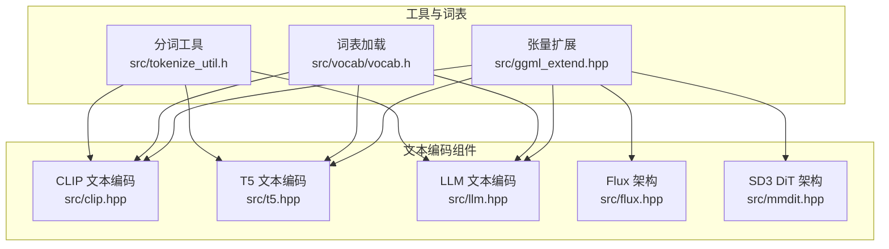
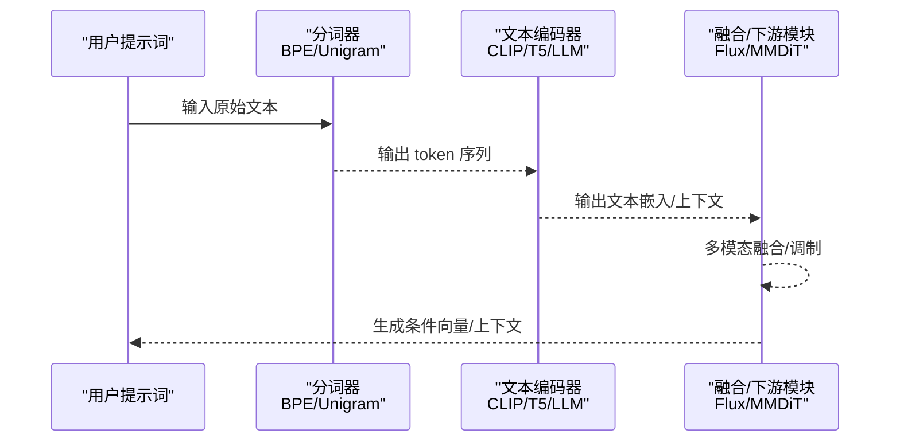
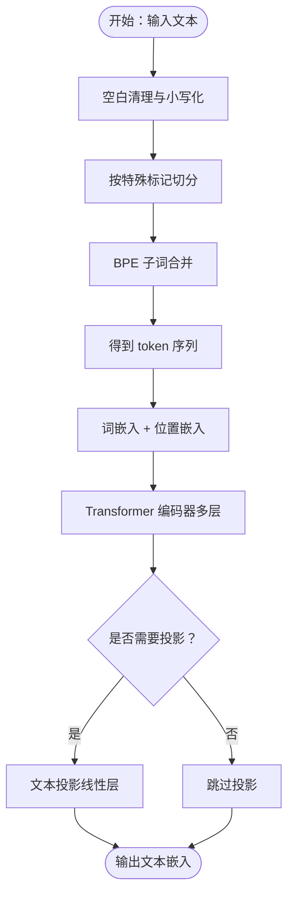
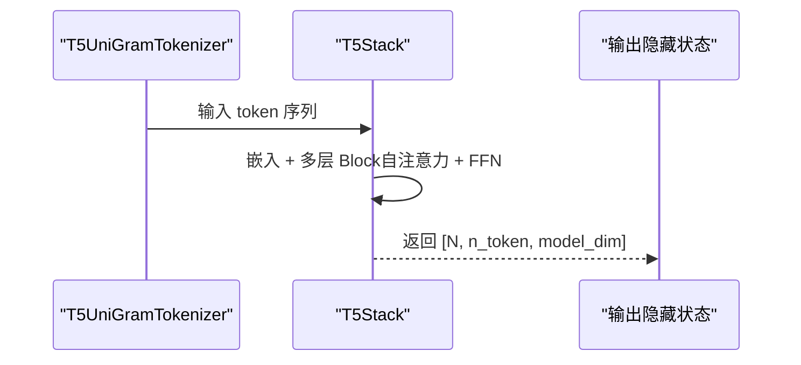
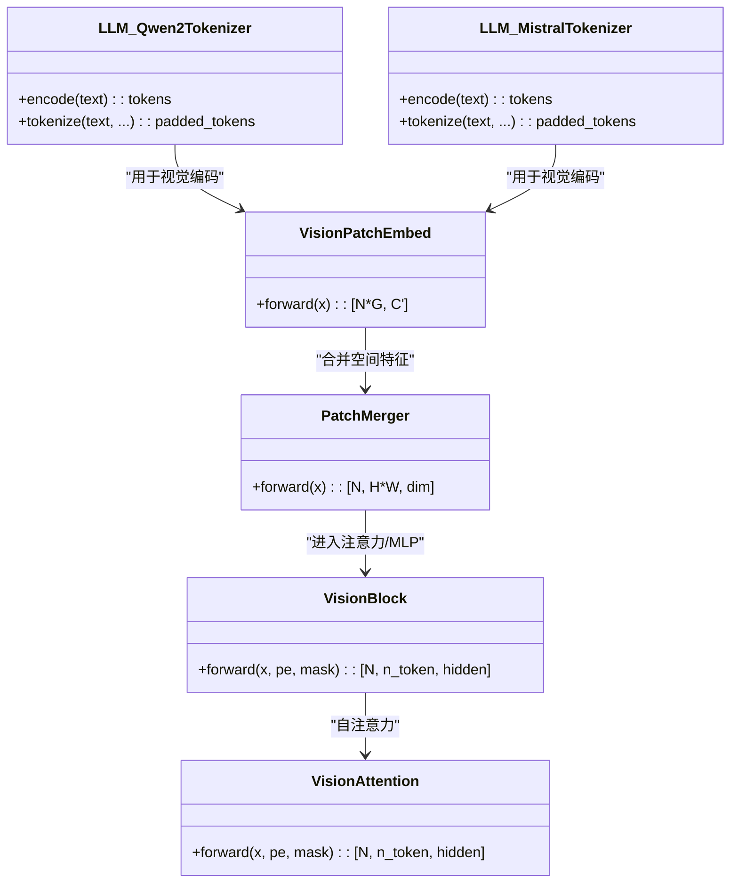
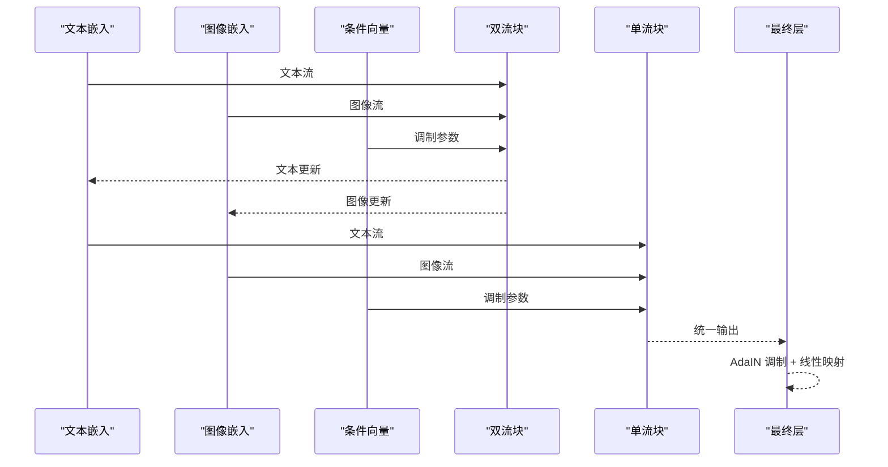
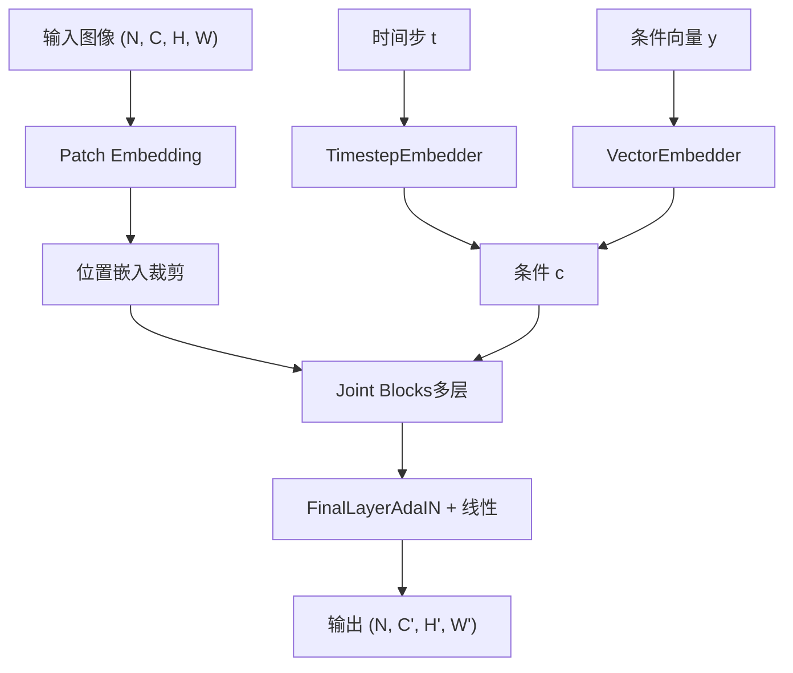
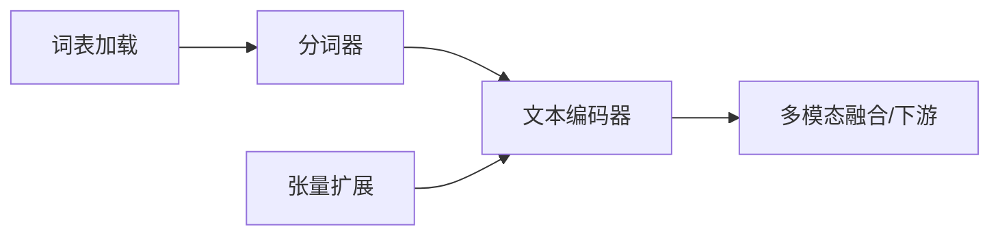

# 文本编码阶段

<cite>
**本文引用的文件**
- [clip.hpp](file://src/clip.hpp)
- [t5.hpp](file://src/t5.hpp)
- [llm.hpp](file://src/llm.hpp)
- [flux.hpp](file://src/flux.hpp)
- [mmdit.hpp](file://src/mmdit.hpp)
- [tokenize_util.h](file://src/tokenize_util.h)
- [vocab.h](file://src/vocab/vocab.h)
- [ggml_extend.hpp](file://src/ggml_extend.hpp)
</cite>

## 目录
1. [引言](#引言)
2. [项目结构](#项目结构)
3. [核心组件](#核心组件)
4. [架构总览](#架构总览)
5. [详细组件分析](#详细组件分析)
6. [依赖关系分析](#依赖关系分析)
7. [性能考量](#性能考量)
8. [故障排查指南](#故障排查指南)
9. [结论](#结论)
10. [附录](#附录)

## 引言
本文件聚焦于“文本编码阶段”的完整实现与工作机制，覆盖从原始提示词到嵌入向量的关键流程，包括：
- CLIP 文本编码器（含 BPE 分词、子词合并、位置编码、Transformer 编码器）
- T5 文本编码器（基于 Unigram 模型的分词与 Transformer 编码栈）
- LLM 文本编码器（Qwen/Mistral 风格 BPE 分词与多模态视觉前处理）
- 多模态编码器在不同模型架构（SDXL、SD3、Flux 等）中的差异化实现
- 文本预处理、分词、嵌入生成等关键步骤的张量形状与数据流说明

目标是帮助读者快速理解各编码器的输入输出格式、张量维度变化、特征提取机制，并掌握在不同模型中的适配方式。

## 项目结构
围绕文本编码的相关源文件主要分布在以下模块：
- CLIP 文本编码：src/clip.hpp
- T5 文本编码：src/t5.hpp
- LLM 文本编码与多模态视觉：src/llm.hpp
- Flux 双流/单流架构：src/flux.hpp
- SD3 DiT 架构：src/mmdit.hpp
- 分词工具与词表加载：src/tokenize_util.h、src/vocab/vocab.h
- 张量扩展与算子：src/ggml_extend.hpp

图示来源
- [clip.hpp](file://src/clip.hpp)
- [t5.hpp](file://src/t5.hpp)
- [llm.hpp](file://src/llm.hpp)
- [flux.hpp](file://src/flux.hpp)
- [mmdit.hpp](file://src/mmdit.hpp)
- [tokenize_util.h](file://src/tokenize_util.h)
- [vocab.h](file://src/vocab/vocab.h)
- [ggml_extend.hpp](file://src/ggml_extend.hpp)

章节来源
- [clip.hpp](file://src/clip.hpp)
- [t5.hpp](file://src/t5.hpp)
- [llm.hpp](file://src/llm.hpp)
- [flux.hpp](file://src/flux.hpp)
- [mmdit.hpp](file://src/mmdit.hpp)
- [tokenize_util.h](file://src/tokenize_util.h)
- [vocab.h](file://src/vocab/vocab.h)
- [ggml_extend.hpp](file://src/ggml_extend.hpp)

## 核心组件
- CLIP 文本编码器
  - BPE 分词与子词合并（BPE）
  - 词表与特殊标记（BOS/EOS/PAD）
  - 嵌入层（词嵌入 + 位置嵌入）
  - Transformer 编码器（多头注意力 + FFN）
  - 可选投影（Text Projection）
- T5 文本编码器
  - Unigram 模型分词（基于双数组字典树）
  - 词表加载与预处理（空格前缀、规范化）
  - Transformer 编码栈（自注意力 + 前馈网络）
- LLM 文本编码器
  - Qwen/Mistral 风格 BPE 分词
  - 视觉块嵌入（Conv Patch Embedding）
  - 视觉注意力与 MLP
- Flux 架构
  - 双流块（图像/文本分别处理，共享调制参数）
  - 单流块（混合流处理）
  - 最终层（AdaIN 调制 + 线性映射）
- SD3 DiT 架构
  - Patch Embedding（空间补丁）
  - 时间步/条件向量嵌入
  - 关联合并块（Joint Block）
  - 最终层（线性映射）

章节来源
- [clip.hpp](file://src/clip.hpp)
- [t5.hpp](file://src/t5.hpp)
- [llm.hpp](file://src/llm.hpp)
- [flux.hpp](file://src/flux.hpp)
- [mmdit.hpp](file://src/mmdit.hpp)

## 架构总览
下图展示了文本编码在不同模型中的典型路径：文本经由分词器得到 token 序列，再通过对应编码器生成上下文嵌入；在多模态场景中，文本嵌入与视觉特征共同进入融合模块。

图示来源
- [clip.hpp](file://src/clip.hpp)
- [t5.hpp](file://src/t5.hpp)
- [llm.hpp](file://src/llm.hpp)
- [flux.hpp](file://src/flux.hpp)
- [mmdit.hpp](file://src/mmdit.hpp)

## 详细组件分析

### CLIP 文本编码器
- 分词与子词合并
  - BPE 流程：字节级映射 → 子词候选 → 迭代合并（按合并优先级）
  - 特殊标记：BOS/EOS/PAD，默认 ID 固定
  - 支持添加自定义特殊标记
- 嵌入层
  - 词嵌入权重与位置嵌入权重初始化（可强制使用 F32）
  - 输入张量形状：[N, n_token] → 词嵌入 → 加上位置嵌入 → 形状 [N, n_token, hidden_size]
- Transformer 编码器
  - 多层堆叠：每层包含自注意力（多头）、前馈网络（GELU/Quick GELU）
  - 可配置 clip_skip 控制输出层深度
  - 可选最终层归一化
- 投影
  - 对 OpenCLIP ViT-Bigg-14 可进行文本投影（线性层）

图示来源
- [clip.hpp](file://src/clip.hpp)

章节来源
- [clip.hpp](file://src/clip.hpp)

### T5 文本编码器
- 分词
  - Unigram 模型：基于双数组字典树（Double Array Trie）的 Viterbi 解码
  - 预处理：空格前缀、规范化（多余空格合并）
  - 特殊标记：EOS 默认追加
- 编码栈
  - 多层 Block：自注意力（相对位置偏置可选）+ 前馈网络（RMSNorm + Gated GELU）
  - 共享嵌入矩阵（Shared Embedding）
- 注意力掩码与相对位置桶
  - 可传入 attention_mask 与 relative_position_bucket 以支持长序列与相对位置建模

图示来源
- [t5.hpp](file://src/t5.hpp)

章节来源
- [t5.hpp](file://src/t5.hpp)

### LLM 文本编码器（Qwen/Mistral 风格）
- 分词
  - BPE 流程与 CLIP 类似，支持特殊标记与空白清理
  - Qwen2 使用特定 merges 文件，Mistral 使用 merges 与 vocab JSON
- 多模态视觉前处理
  - 视觉 Patch Embedding：Conv2d/Conv3d（可选 llama_cpp 风格双卷积）
  - Patch Merger：将空间合并后的特征映射到目标维度
  - 视觉注意力：Q/K/V 可为独立或合并投影，支持 RoPE 旋转位置编码
  - 视觉 Block：RMSNorm + 自注意力 + MLP

图示来源
- [llm.hpp](file://src/llm.hpp)

章节来源
- [llm.hpp](file://src/llm.hpp)

### Flux 架构（双流/单流）
- 双流块（DoubleStreamBlock）
  - 图像流与文本流分别经过各自注意力与 MLP
  - 通过调制（Modulation）将条件向量（如时间步/引导）注入到流中
  - 注意力后与残差相加，MLP 后同样残差
- 单流块（SingleStreamBlock）
  - 将图像与文本拼接后统一处理，先做 QKV 分解，再注意力，最后拼接 MLP 输出
- 最终层（LastLayer）
  - AdaIN 调制（RMSNorm + 线性层），输出到 patch 映射

图示来源
- [flux.hpp](file://src/flux.hpp)

章节来源
- [flux.hpp](file://src/flux.hpp)

### SD3 DiT 架构
- Patch Embedding
  - 2D 图像补丁嵌入（Conv2d），支持动态填充
- 时间步/条件嵌入
  - TimestepEmbedder：正弦/余弦时间步嵌入 + MLP
  - VectorEmbedder：条件向量嵌入
- 关联合并块（Joint Block）
  - 文本与图像分别进入各自 Block，然后拼接进行交叉注意力
  - 支持自注意力扩展（MM-DiT-X）
- 最终层
  - AdaIN 调制 + 线性映射到 patch 映射

图示来源
- [mmdit.hpp](file://src/mmdit.hpp)

章节来源
- [mmdit.hpp](file://src/mmdit.hpp)

## 依赖关系分析
- 分词与词表
  - CLIP：依赖 BPE 与 merges 文件（通过 vocab 加载）
  - T5：依赖 Unigram JSON（tokenizer.json），构建双数组字典树
  - LLM：依赖 Qwen/Mistral 的 merges 与 vocab JSON
- 张量扩展
  - ggml_extend 提供注意力、RoPE、张量视图/切片、拼接、分块等通用算子
- 模块耦合
  - CLIP/T5/LLM 的分词器与编码器相互独立，但都依赖 ggml 张量计算框架
  - Flux/MMDiT 在更高层进行多模态融合与条件注入

图示来源
- [tokenize_util.h](file://src/tokenize_util.h)
- [vocab.h](file://src/vocab/vocab.h)
- [ggml_extend.hpp](file://src/ggml_extend.hpp)
- [clip.hpp](file://src/clip.hpp)
- [t5.hpp](file://src/t5.hpp)
- [llm.hpp](file://src/llm.hpp)
- [flux.hpp](file://src/flux.hpp)
- [mmdit.hpp](file://src/mmdit.hpp)

章节来源
- [tokenize_util.h](file://src/tokenize_util.h)
- [vocab.h](file://src/vocab/vocab.h)
- [ggml_extend.hpp](file://src/ggml_extend.hpp)
- [clip.hpp](file://src/clip.hpp)
- [t5.hpp](file://src/t5.hpp)
- [llm.hpp](file://src/llm.hpp)
- [flux.hpp](file://src/flux.hpp)
- [mmdit.hpp](file://src/mmdit.hpp)

## 性能考量
- 分词性能
  - T5 使用 Unigram Viterbi 解码，速度较 BPE 更快，适合长序列
  - CLIP BPE 依赖子词合并优先级表，需注意合并表大小与查找效率
- 计算与内存
  - ggml 扩展提供高效的注意力与张量操作，注意张量连续性（contiguous）与视图（view）的使用
  - Flux/MMDiT 中的拼接与分块操作需控制维度，避免不必要的拷贝
- 精度与类型
  - CLIP 可强制词嵌入使用 F32 以提升稳定性
  - LLM 视觉分支默认使用 F16/F32 权重，注意后端支持情况

## 故障排查指南
- 分词异常
  - 检查 merges/vocab 文件是否正确加载（路径与内容）
  - 确认特殊标记是否被正确识别与保留
- 形状不匹配
  - 注意输入张量维度：[N, n_token]、[N, H, W, C] 等
  - 确保位置嵌入与 patch 嵌入的维度一致
- 注意力掩码
  - T5/Flux/MMDiT 中的 attention_mask 与 relative_position_bucket 必须与序列长度匹配
- 内存与显存
  - 长序列时启用分块/拼接策略，避免一次性构造超大图
  - 检查后端（CUDA/Metal/Vulkan/OpenCL/SYCL）是否启用及版本兼容

章节来源
- [clip.hpp](file://src/clip.hpp)
- [t5.hpp](file://src/t5.hpp)
- [llm.hpp](file://src/llm.hpp)
- [flux.hpp](file://src/flux.hpp)
- [mmdit.hpp](file://src/mmdit.hpp)
- [ggml_extend.hpp](file://src/ggml_extend.hpp)

## 结论
文本编码阶段在稳定扩散系统中承担着将自然语言转换为多模态模型可理解的向量表示的关键职责。通过 CLIP、T5、LLM 等编码器的组合，配合 Flux/MMDiT 的多模态融合与条件注入，系统实现了从提示词到图像生成的高效映射。理解各编码器的输入输出、张量形状与特征提取机制，有助于在不同模型架构（SDXL、SD3、Flux 等）中进行定制与优化。

## 附录
- 代码示例路径（仅列出路径，不展示具体代码）
  - CLIP 分词与编码：[clip.hpp](file://src/clip.hpp)
  - T5 分词与编码：[t5.hpp](file://src/t5.hpp)
  - LLM 分词与视觉前处理：[llm.hpp](file://src/llm.hpp)
  - Flux 双/单流块与最终层：[flux.hpp](file://src/flux.hpp)
  - SD3 DiT Patch Embedding/Joint Block/最终层：[mmdit.hpp](file://src/mmdit.hpp)
  - 分词工具函数声明：[tokenize_util.h](file://src/tokenize_util.h)
  - 词表加载接口声明：[vocab.h](file://src/vocab/vocab.h)
  - 张量扩展与算子：[ggml_extend.hpp](file://src/ggml_extend.hpp)