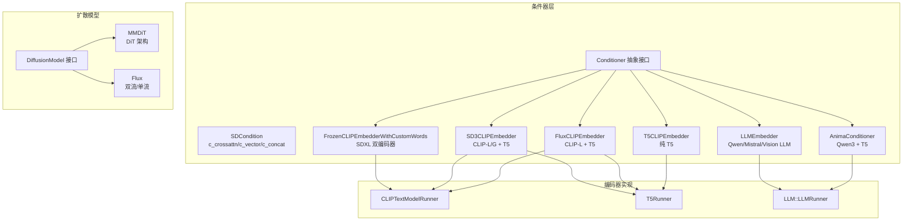
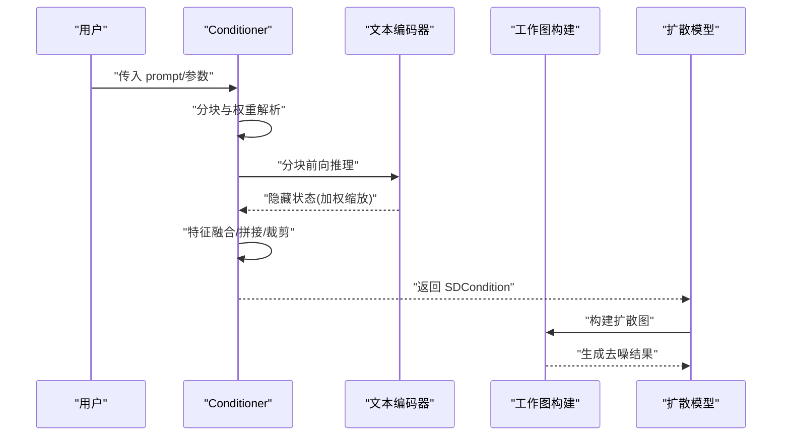
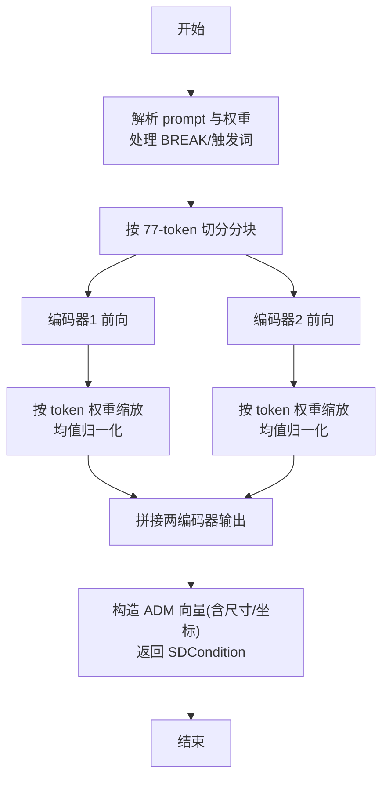
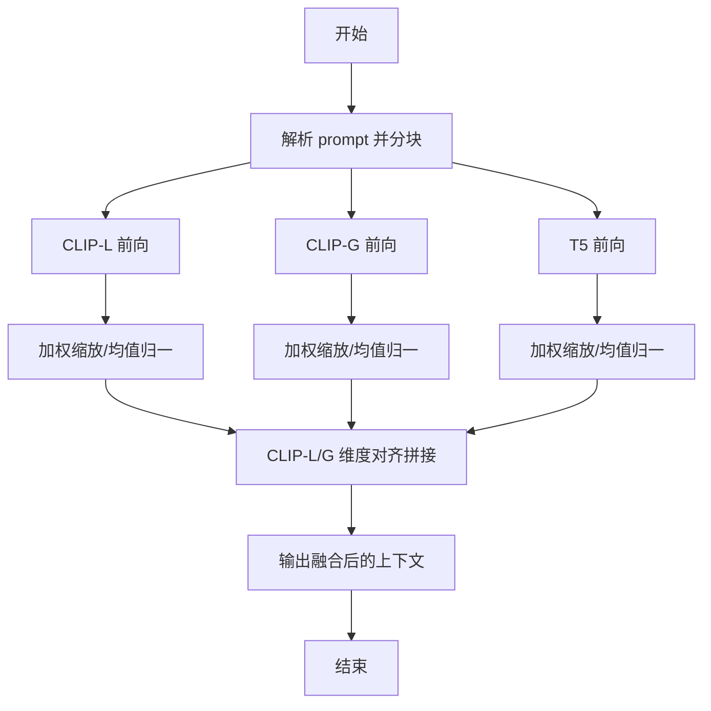
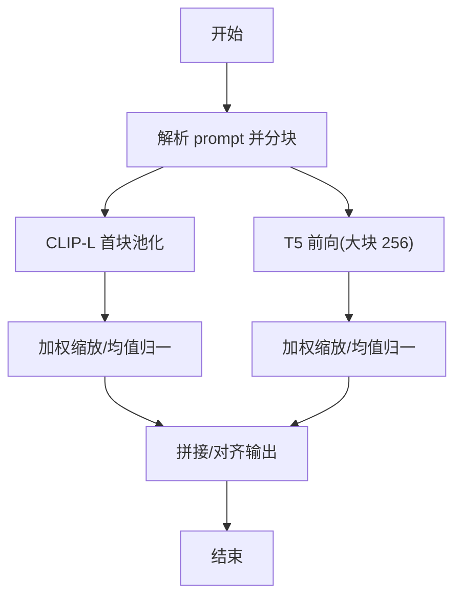
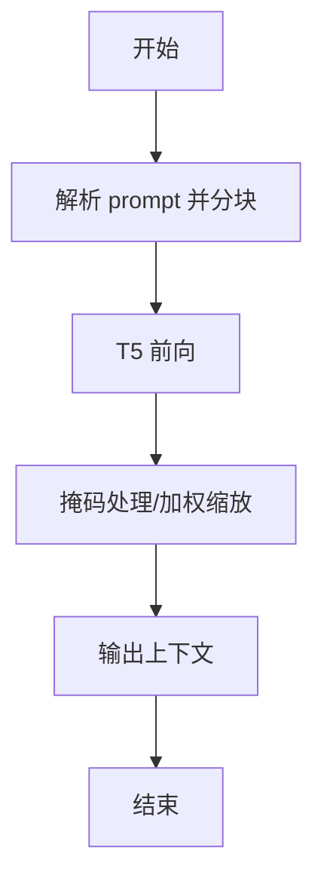
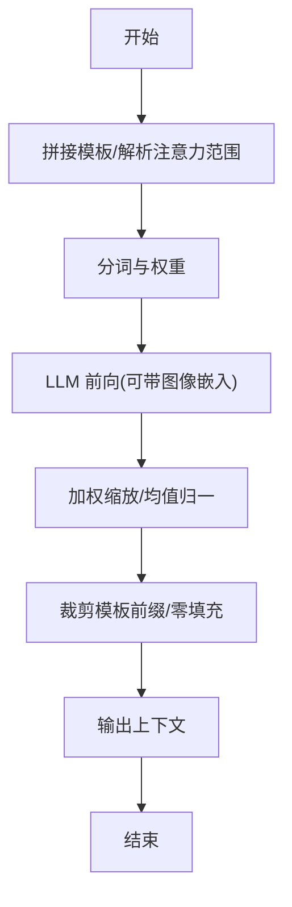
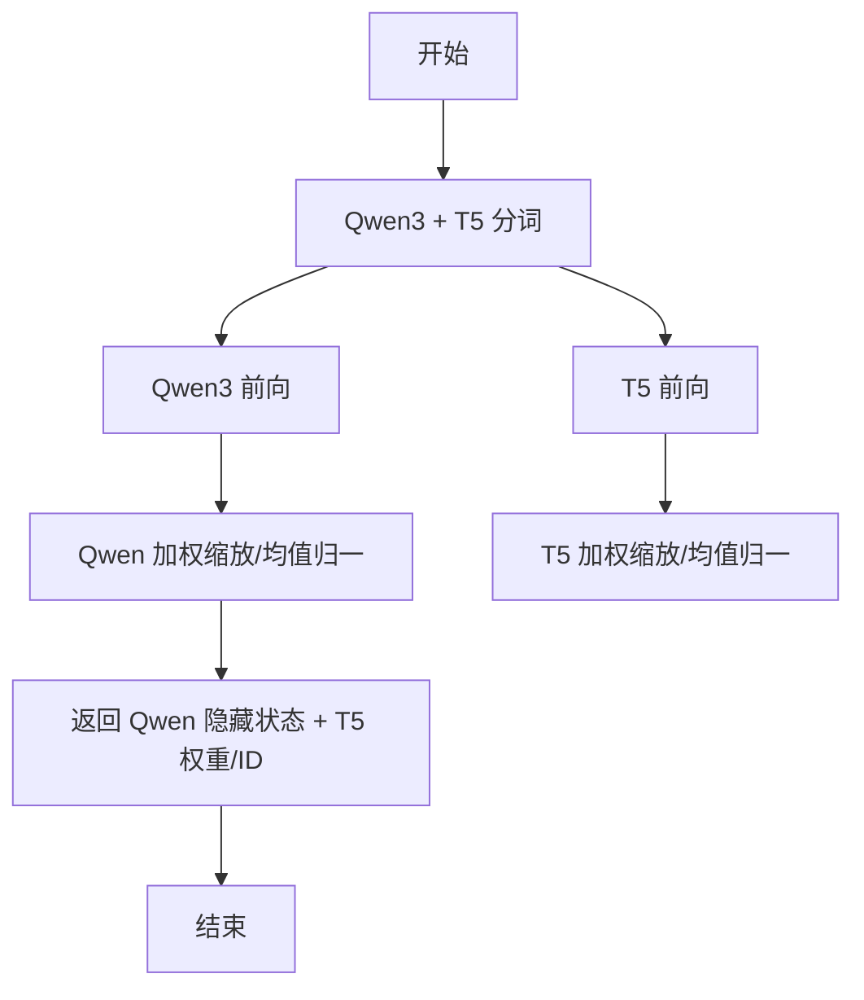
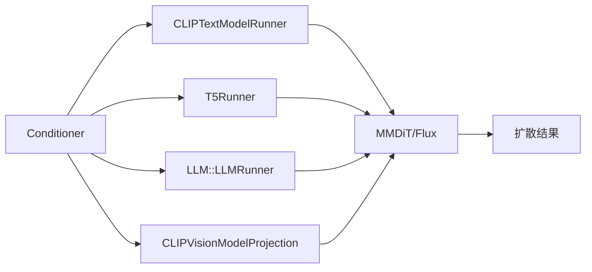

# 条件器处理

<cite>
**本文档引用的文件**
- [conditioner.hpp](file://src/conditioner.hpp)
- [clip.hpp](file://src/clip.hpp)
- [mmdit.hpp](file://src/mmdit.hpp)
- [flux.hpp](file://src/flux.hpp)
- [diffusion_model.hpp](file://src/diffusion_model.hpp)
</cite>

## 目录
1. [简介](#简介)
2. [项目结构](#项目结构)
3. [核心组件](#核心组件)
4. [架构总览](#架构总览)
5. [详细组件分析](#详细组件分析)
6. [依赖关系分析](#依赖关系分析)
7. [性能考虑](#性能考虑)
8. [故障排除指南](#故障排除指南)
9. [结论](#结论)

## 简介
本文件系统性阐述稳定扩散项目中“条件器”（Conditioner）的实现与工作机制，重点覆盖以下方面：
- 将文本编码器输出的嵌入向量转换为扩散模型可使用的条件信号（跨注意力、条件投影、特征融合）
- 不同模型架构下的条件器差异：SDXL 双文本编码器、SD3 多编码器融合、Flux 的双流/单流架构条件处理
- 内存管理、张量操作与计算优化策略
- 提供初始化、数据预处理与特征生成的流程图与参考路径

## 项目结构
条件器相关的核心代码位于 src/conditioner.hpp，配套的文本编码器（CLIP/T5/LLM）定义在 src/clip.hpp、src/t5.hpp、src/llm.hpp 中；扩散模型侧的 MMDiT 和 Flux 实现分别在 src/mmdit.hpp、src/flux.hpp；扩散模型接口在 src/diffusion_model.hpp。

图表来源
- [conditioner.hpp:34-1141](file://src/conditioner.hpp#L34-L1141)
- [clip.hpp:456-773](file://src/clip.hpp#L456-L773)
- [mmdit.hpp:611-706](file://src/mmdit.hpp#L611-L706)
- [flux.hpp:763-800](file://src/flux.hpp#L763-L800)
- [diffusion_model.hpp:157-197](file://src/diffusion_model.hpp#L157-L197)

章节来源
- [conditioner.hpp:34-1141](file://src/conditioner.hpp#L34-L1141)
- [clip.hpp:456-773](file://src/clip.hpp#L456-L773)
- [mmdit.hpp:611-706](file://src/mmdit.hpp#L611-L706)
- [flux.hpp:763-800](file://src/flux.hpp#L763-L800)
- [diffusion_model.hpp:157-197](file://src/diffusion_model.hpp#L157-L197)

## 核心组件
- SDCondition：条件信号容器，包含跨注意力上下文 c_crossattn、向量条件 c_vector、拼接条件 c_concat，以及额外的跨注意力向量列表。
- Conditioner 抽象接口：定义 get_learned_condition、参数缓冲区生命周期管理、参数张量导出、Flash Attention 开关、权重适配器注入等。
- 具体实现：
  - SDXL 双编码器：FrozenCLIPEmbedderWithCustomWords，支持自定义嵌入、触发词、分块处理与加权缩放。
  - SD3 多编码器：SD3CLIPEmbedder，融合 CLIP-L、CLIP-G、T5，进行跨模态特征对齐与拼接。
  - Flux 特殊处理：FluxCLIPEmbedder，针对 Flux 的双流/单流注意力与位置编码进行适配。
  - 纯 T5：T5CLIPEmbedder，支持注意力掩码与分块处理。
  - LLM：LLMEmbedder，支持视觉提示与多层输出抽取，用于 Qwen/Mistral 系列。
  - Anima：AnimaConditioner，Qwen3 + T5 的混合条件器。

章节来源
- [conditioner.hpp:8-53](file://src/conditioner.hpp#L8-L53)
- [conditioner.hpp:56-651](file://src/conditioner.hpp#L56-L651)
- [conditioner.hpp:710-1141](file://src/conditioner.hpp#L710-L1141)
- [conditioner.hpp:1144-1418](file://src/conditioner.hpp#L1144-L1418)
- [conditioner.hpp:1421-1642](file://src/conditioner.hpp#L1421-L1642)
- [conditioner.hpp:1780-2151](file://src/conditioner.hpp#L1780-L2151)

## 架构总览
条件器将文本/图像输入转化为扩散模型的条件张量，主要流程：
- 文本预处理与分块：按最大长度切分为若干块，每块内应用注意力权重并归一化。
- 编码器前向：调用对应编码器（CLIP/T5/LLM）执行推理，得到隐藏状态。
- 权重缩放与均值归一：对每个 token 的隐藏状态按注意力权重缩放，并通过整体均值缩放保持数值稳定。
- 特征融合：SDXL 使用双编码器拼接；SD3 对 CLIP-L/G 与 T5 进行维度对齐与拼接；Flux/LLM 保留语义序列并裁剪模板前缀。
- 条件输出：返回 c_crossattn、c_vector（可选）、c_concat（可选）及额外上下文。

图表来源
- [conditioner.hpp:429-584](file://src/conditioner.hpp#L429-L584)
- [conditioner.hpp:896-1130](file://src/conditioner.hpp#L896-L1130)
- [conditioner.hpp:1295-1406](file://src/conditioner.hpp#L1295-L1406)
- [conditioner.hpp:1541-1629](file://src/conditioner.hpp#L1541-L1629)
- [conditioner.hpp:1726-1776](file://src/conditioner.hpp#L1726-L1776)
- [conditioner.hpp:1887-1971](file://src/conditioner.hpp#L1887-L1971)

## 详细组件分析

### SDXL 双编码器（FrozenCLIPEmbedderWithCustomWords）
- 功能要点
  - 支持两套文本编码器（CLIP-L 与 CLIP-Bigg），用于 SDXL 的主副文本分支。
  - 自定义嵌入加载与替换，动态扩展词表并映射到新 token。
  - 触发词（如“img”）用于 PhotoMaker 等场景，支持将触发词扩展为多张参考图对应的 token 序列。
  - 分块处理与权重缩放：按 77-token 块切分，逐块计算注意力权重并进行均值归一化，避免数值漂移。
  - SDXL 向量条件（c_vector）：从第二编码器池化输出构造 ADM 向量，包含分辨率、裁剪坐标、目标尺寸等时间步嵌入。
- 关键流程图

图表来源
- [conditioner.hpp:429-584](file://src/conditioner.hpp#L429-L584)
- [conditioner.hpp:587-650](file://src/conditioner.hpp#L587-L650)

章节来源
- [conditioner.hpp:56-136](file://src/conditioner.hpp#L56-L136)
- [conditioner.hpp:429-584](file://src/conditioner.hpp#L429-L584)
- [conditioner.hpp:587-650](file://src/conditioner.hpp#L587-L650)

### SD3 多编码器融合（SD3CLIPEmbedder）
- 功能要点
  - 同时使用 CLIP-L（768）、CLIP-G（1280）与 T5（4096）三种编码器，按需启用。
  - 每个编码器独立分块处理，分别加权缩放后进行维度对齐与拼接。
  - CLIP-L/G 在前向时可返回池化向量，用于后续拼接形成跨模态条件。
- 流程图

图表来源
- [conditioner.hpp:896-1130](file://src/conditioner.hpp#L896-L1130)

章节来源
- [conditioner.hpp:710-821](file://src/conditioner.hpp#L710-L821)
- [conditioner.hpp:896-1130](file://src/conditioner.hpp#L896-L1130)

### Flux 特殊条件处理（FluxCLIPEmbedder）
- 功能要点
  - 针对 Flux 的双流/单流注意力，仅使用 CLIP-L 与 T5，不强制要求两者同时存在。
  - T5 采用大块长序列（默认 256），按块处理并加权缩放。
  - CLIP-L 在首块计算池化向量作为文本提示的语义表示。
- 流程图

图表来源
- [conditioner.hpp:1295-1406](file://src/conditioner.hpp#L1295-L1406)

章节来源
- [conditioner.hpp:1144-1235](file://src/conditioner.hpp#L1144-L1235)
- [conditioner.hpp:1295-1406](file://src/conditioner.hpp#L1295-L1406)

### 纯 T5 条件器（T5CLIPEmbedder）
- 功能要点
  - 仅使用 T5 编码器，支持注意力掩码与额外填充位处理。
  - 分块长度可配置，默认 512，按块加权缩放并进行掩码修正。
- 流程图

图表来源
- [conditioner.hpp:1541-1629](file://src/conditioner.hpp#L1541-L1629)

章节来源
- [conditioner.hpp:1421-1487](file://src/conditioner.hpp#L1421-L1487)
- [conditioner.hpp:1541-1629](file://src/conditioner.hpp#L1541-L1629)

### LLM 条件器（LLMEmbedder）
- 功能要点
  - 支持 Qwen/Mistral 系列 LLM，可启用视觉编码能力。
  - 支持多段 prompt 与注意力范围标注，自动拼接系统/用户/助手模板。
  - 可注入参考图像嵌入，抽取指定层输出作为额外上下文。
  - 对输出进行裁剪（去除模板前缀）与最小长度零填充。
- 流程图

图表来源
- [conditioner.hpp:1887-1971](file://src/conditioner.hpp#L1887-L1971)
- [conditioner.hpp:1974-2151](file://src/conditioner.hpp#L1974-L2151)

章节来源
- [conditioner.hpp:1780-1837](file://src/conditioner.hpp#L1780-L1837)
- [conditioner.hpp:1887-1971](file://src/conditioner.hpp#L1887-L1971)
- [conditioner.hpp:1974-2151](file://src/conditioner.hpp#L1974-L2151)

### Anima 条件器（AnimaConditioner）
- 功能要点
  - Qwen3 + T5 的混合条件器，Qwen 使用均匀权重，T5 使用注意力权重。
  - 对 Qwen 输出进行加权缩放与均值归一，随后拼接 T5 的权重张量与 ID 张量。
- 流程图

图表来源
- [conditioner.hpp:1685-1776](file://src/conditioner.hpp#L1685-L1776)

章节来源
- [conditioner.hpp:1644-1683](file://src/conditioner.hpp#L1644-L1683)
- [conditioner.hpp:1685-1776](file://src/conditioner.hpp#L1685-L1776)

## 依赖关系分析
- 条件器与编码器
  - SDXL：CLIPTextModelRunner（两路）
  - SD3：CLIPTextModelRunner（两路）+ T5Runner
  - Flux：CLIPTextModelRunner + T5Runner
  - LLM：LLM::LLMRunner（可带视觉）
  - T5：T5Runner
- 扩散模型
  - MMDiT：DiT 架构，支持跨注意力与条件向量融合
  - Flux：双流/单流注意力，位置编码与 RoPE
- 接口耦合
  - DiffusionModel 接口统一调度，MMDiT/Flux 分别实现 compute

图表来源
- [conditioner.hpp:56-1141](file://src/conditioner.hpp#L56-L1141)
- [clip.hpp:456-773](file://src/clip.hpp#L456-L773)
- [mmdit.hpp:611-706](file://src/mmdit.hpp#L611-L706)
- [flux.hpp:763-800](file://src/flux.hpp#L763-L800)
- [diffusion_model.hpp:157-197](file://src/diffusion_model.hpp#L157-L197)

章节来源
- [conditioner.hpp:56-1141](file://src/conditioner.hpp#L56-L1141)
- [clip.hpp:456-773](file://src/clip.hpp#L456-L773)
- [mmdit.hpp:611-706](file://src/mmdit.hpp#L611-L706)
- [flux.hpp:763-800](file://src/flux.hpp#L763-L800)
- [diffusion_model.hpp:157-197](file://src/diffusion_model.hpp#L157-L197)

## 性能考虑
- 分块与批处理
  - SDXL/SD3/Flux/LLM 均采用固定长度分块（如 77/256/512），减少显存峰值并提升吞吐。
- 权重缩放与均值归一
  - 对每个 token 的隐藏状态按注意力权重缩放，并通过整体均值缩放保持数值稳定性，避免梯度爆炸或消失。
- Flash Attention
  - 条件器接口提供 set_flash_attention_enabled，可在支持的后端启用加速注意力计算。
- 参数缓冲区管理
  - alloc_params_buffer/free_params_buffer 生命周期管理，降低重复分配开销；get_params_buffer_size 便于资源规划。
- 掩码与零填充
  - T5/LLM 使用注意力掩码与零填充，确保有效 token 与无效 token 的正确区分，避免信息泄露。

章节来源
- [conditioner.hpp:34-53](file://src/conditioner.hpp#L34-L53)
- [conditioner.hpp:429-584](file://src/conditioner.hpp#L429-L584)
- [conditioner.hpp:896-1130](file://src/conditioner.hpp#L896-L1130)
- [conditioner.hpp:1295-1406](file://src/conditioner.hpp#L1295-L1406)
- [conditioner.hpp:1541-1629](file://src/conditioner.hpp#L1541-L1629)
- [conditioner.hpp:1726-1776](file://src/conditioner.hpp#L1726-L1776)
- [conditioner.hpp:1887-1971](file://src/conditioner.hpp#L1887-L1971)

## 故障排除指南
- 提示词未生效
  - 检查触发词是否正确添加至词表，确认 tokenize_with_trigger_token 是否成功扩展 token 序列。
  - 参考路径：[conditioner.hpp:215-358](file://src/conditioner.hpp#L215-L358)
- 文本过长导致截断
  - 使用 BREAK 关键字进行分块补齐，或调整最大长度参数。
  - 参考路径：[conditioner.hpp:399-416](file://src/conditioner.hpp#L399-L416)
- 数值不稳定或输出异常
  - 确认权重缩放与均值归一逻辑是否执行，检查 zero_out_masked 是否误用。
  - 参考路径：[conditioner.hpp:518-531](file://src/conditioner.hpp#L518-L531)
- T5/LLM 掩码问题
  - 检查掩码构造与填充位修正逻辑，确保 inf 位置被正确置零。
  - 参考路径：[conditioner.hpp:1526-1539](file://src/conditioner.hpp#L1526-L1539)
- 资源不足或显存溢出
  - 减小分块长度或批大小，启用 Flash Attention，合理释放参数缓冲区。
  - 参考路径：[conditioner.hpp:34-53](file://src/conditioner.hpp#L34-L53)

章节来源
- [conditioner.hpp:215-358](file://src/conditioner.hpp#L215-L358)
- [conditioner.hpp:399-416](file://src/conditioner.hpp#L399-L416)
- [conditioner.hpp:518-531](file://src/conditioner.hpp#L518-L531)
- [conditioner.hpp:1526-1539](file://src/conditioner.hpp#L1526-L1539)
- [conditioner.hpp:34-53](file://src/conditioner.hpp#L34-L53)

## 结论
条件器在稳定扩散系统中承担“桥梁”的角色，将文本/图像等多模态输入转换为扩散模型可用的条件信号。不同架构（SDXL/SD3/Flux/LLM/T5/Anima）通过差异化融合策略与优化手段，在保证质量的同时兼顾效率。建议在部署时结合硬件能力选择合适的分块长度、注意力后端与参数缓冲策略，并严格遵循权重缩放与掩码处理流程，以获得稳定可靠的生成效果。