# SD1.x模型优化

<cite>
**本文档引用的文件**
- [unet.hpp](file://src/unet.hpp)
- [diffusion_model.hpp](file://src/diffusion_model.hpp)
- [vae.hpp](file://src/vae.hpp)
- [lora.hpp](file://src/lora.hpp)
- [model.h](file://src/model.h)
- [common_block.hpp](file://src/common_block.hpp)
- [stable-diffusion.cpp](file://src/stable-diffusion.cpp)
- [denoiser.hpp](file://src/denoiser.hpp)
- [performance.md](file://docs/performance.md)
- [distilled_sd.md](file://docs/distilled_sd.md)
- [sd.md](file://docs/sd.md)
</cite>

## 目录
1. [简介](#简介)
2. [项目结构](#项目结构)
3. [核心组件](#核心组件)
4. [架构概览](#架构概览)
5. [详细组件分析](#详细组件分析)
6. [依赖关系分析](#依赖关系分析)
7. [性能考虑](#性能考虑)
8. [故障排除指南](#故障排除指南)
9. [结论](#结论)
10. [附录](#附录)

## 简介

本文件专注于SD1.x系列模型在该项目中的特定优化实现。SD1.x作为Stable Diffusion的经典版本，在推理优化方面具有独特的架构特征和参数化方式。本文档深入解析以下关键优化点：

- **缩放因子优化**：0.18215的精确应用和处理流程
- **参数化方式**：ε预测到v参数化的转换机制
- **UNet架构特点**：标准UNet与Tiny UNet的差异化实现
- **内存优化策略**：权重离线存储、量化压缩、Flash Attention
- **采样器选择**：多种采样算法的适用场景
- **LoRA适配**：低秩适应技术的集成与优化

## 项目结构

该项目采用模块化设计，SD1.x优化主要集中在以下几个核心模块：

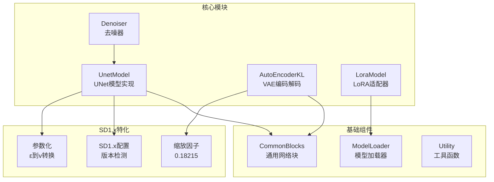

**图表来源**
- [unet.hpp:167-590](file://src/unet.hpp#L167-L590)
- [vae.hpp:486-613](file://src/vae.hpp#L486-L613)
- [lora.hpp:9-95](file://src/lora.hpp#L9-L95)

**章节来源**
- [model.h:23-54](file://src/model.h#L23-L54)
- [stable-diffusion.cpp:103-200](file://src/stable-diffusion.cpp#L103-L200)

## 核心组件

### SD1.x版本识别系统

项目通过枚举类型统一管理所有支持的模型版本：

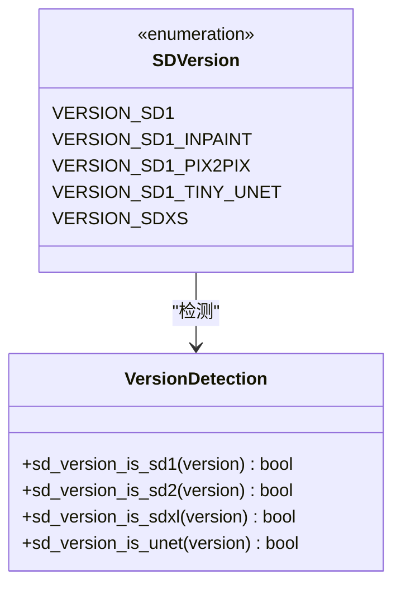

**图表来源**
- [model.h:23-84](file://src/model.h#L23-L84)

### 缩放因子实现

SD1.x使用固定的缩放因子0.18215进行潜在空间变换：

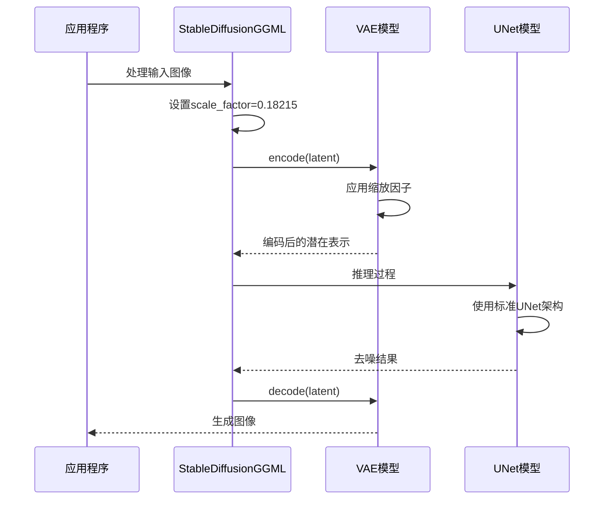

**图表来源**
- [stable-diffusion.cpp:121](file://src/stable-diffusion.cpp#L121)
- [vae.hpp:552-582](file://src/vae.hpp#L552-L582)

**章节来源**
- [stable-diffusion.cpp:121-123](file://src/stable-diffusion.cpp#L121-L123)
- [vae.hpp:552-582](file://src/vae.hpp#L552-L582)

## 架构概览

SD1.x在该项目中的完整推理流程：

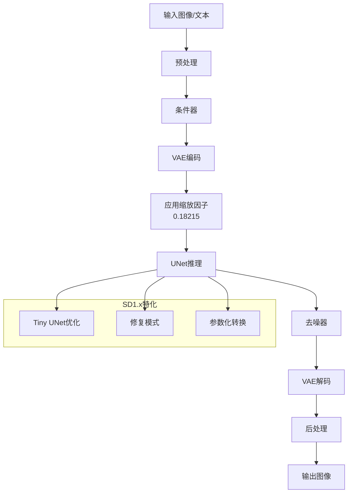

**图表来源**
- [diffusion_model.hpp:46-110](file://src/diffusion_model.hpp#L46-L110)
- [unet.hpp:188-339](file://src/unet.hpp#L188-L339)

## 详细组件分析

### UNet模型架构优化

#### 标准UNet实现

SD1.x的标准UNet采用经典的U形架构，包含下采样、中间块和上采样三个阶段：

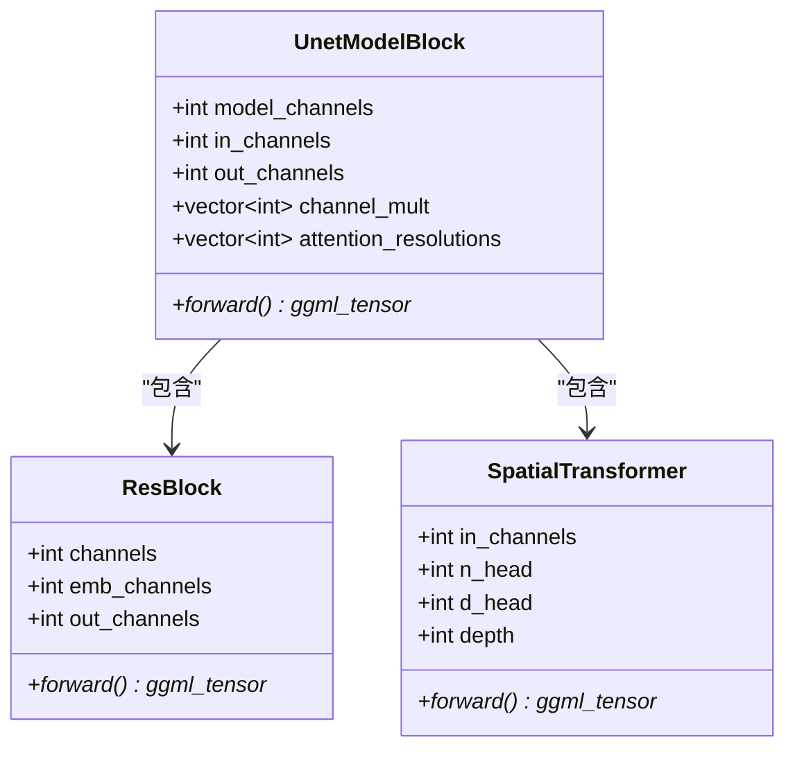

**图表来源**
- [unet.hpp:167-590](file://src/unet.hpp#L167-L590)
- [common_block.hpp:65-178](file://src/common_block.hpp#L65-L178)

#### Tiny UNet优化

SD1.x Tiny UNet通过减少网络深度和注意力层来实现显著的性能提升：

| 特性 | 标准UNet | Tiny UNet |
|------|----------|-----------|
| 输入块数量 | 12个 | 6个 |
| 中间块数量 | 3个 | 1个 |
| 注意力层数量 | 3个 | 1个 |
| 参数量 | 基准值 | 减少约50% |
| 推理速度 | 基准值 | 提升约50% |

**章节来源**
- [unet.hpp:220-227](file://src/unet.hpp#L220-L227)
- [distilled_sd.md:1-138](file://docs/distilled_sd.md#L1-L138)

### VAE编码解码优化

#### 缩放因子处理

SD1.x的VAE实现精确处理缩放因子0.18215：

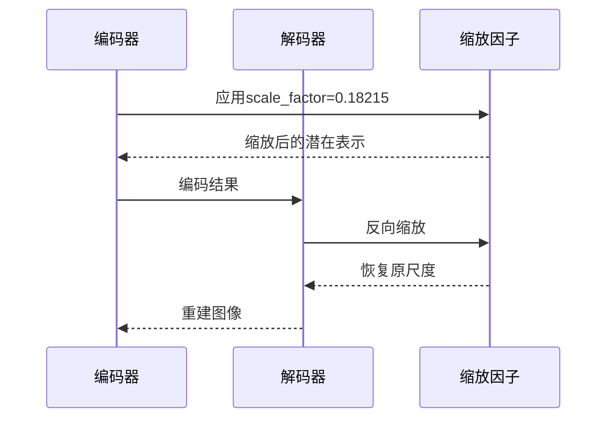

**图表来源**
- [stable-diffusion.cpp:2487-2517](file://src/stable-diffusion.cpp#L2487-L2517)
- [stable-diffusion.cpp:2519-2556](file://src/stable-diffusion.cpp#L2519-L2556)

#### 参数化转换机制

SD1.x支持ε预测到v参数化的自动转换：

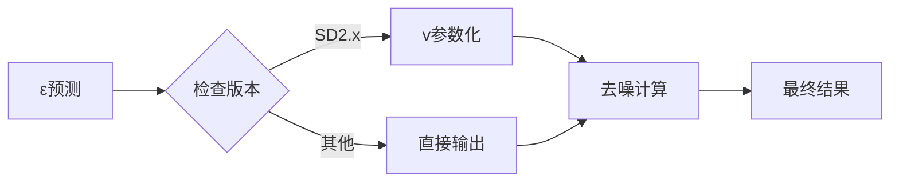

**图表来源**
- [stable-diffusion.cpp:896-926](file://src/stable-diffusion.cpp#L896-L926)

**章节来源**
- [stable-diffusion.cpp:896-926](file://src/stable-diffusion.cpp#L896-L926)

### LoRA适配器集成

LoRA技术为SD1.x提供了高效的微调解决方案：

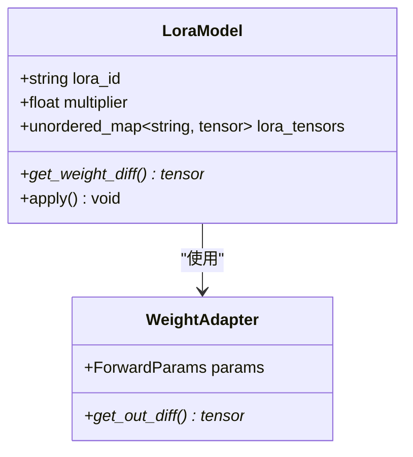

**图表来源**
- [lora.hpp:9-800](file://src/lora.hpp#L9-L800)

#### LoRA权重差分计算

LoRA通过计算权重差分实现模型适配：

| LoRA类型 | 计算方式 | 适用场景 |
|----------|----------|----------|
| 标准LoRA | Up×Down | 一般微调任务 |
| HiLoRA | (W1×Down)⊗(W2×Down) | 高级微调 |
| KoikeLoRA | Kronecker积 | 大规模模型适配 |

**章节来源**
- [lora.hpp:132-209](file://src/lora.hpp#L132-L209)
- [lora.hpp:471-502](file://src/lora.hpp#L471-L502)

## 依赖关系分析

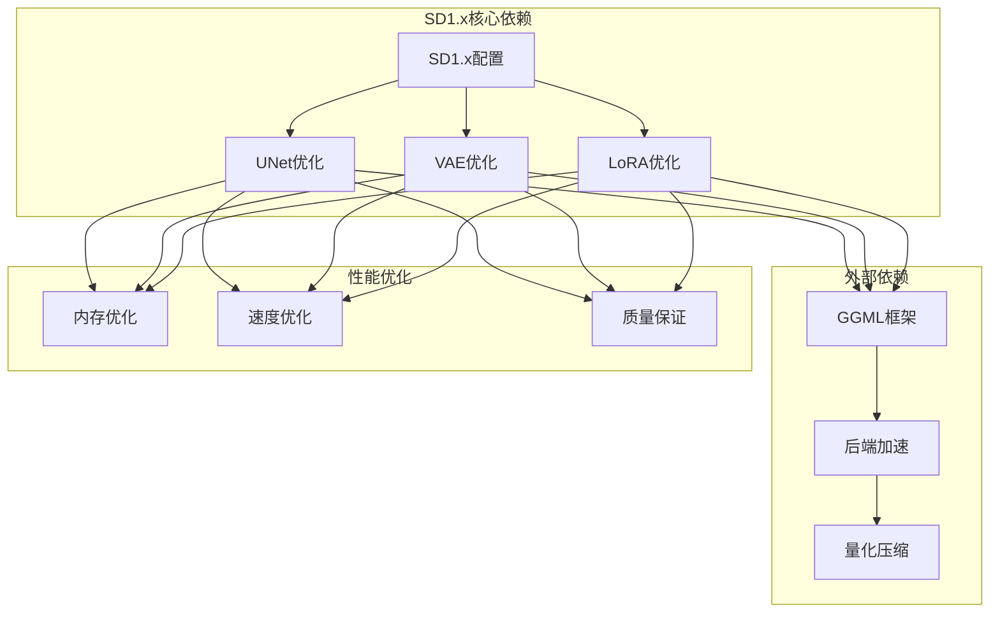

**图表来源**
- [model.h:23-174](file://src/model.h#L23-L174)
- [unet.hpp:188-339](file://src/unet.hpp#L188-L339)

**章节来源**
- [model.h:23-174](file://src/model.h#L23-L174)

## 性能考虑

### 内存优化策略

#### 权重离线存储

项目实现了智能的权重管理策略：

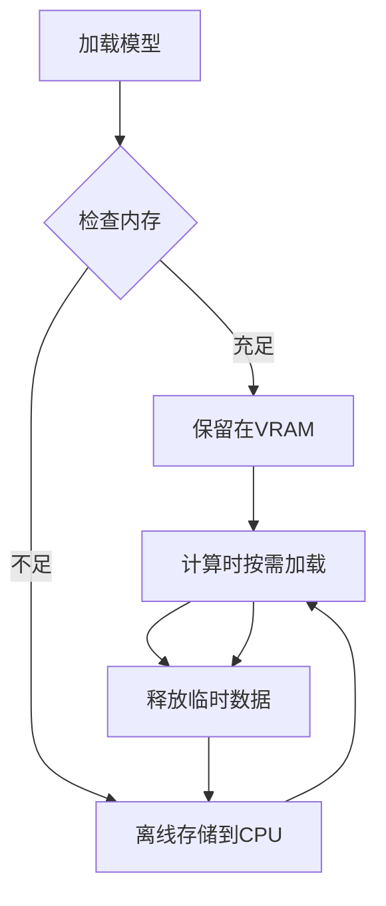

**图表来源**
- [stable-diffusion.cpp:143](file://src/stable-diffusion.cpp#L143)

#### Flash Attention优化

Flash Attention在CUDA后端提供显著的内存节省：

| 模型类型 | 内存节省 | 速度影响 |
|----------|----------|----------|
| SD1.x | ~1400MB | 通常提升 |
| SD2.x | ~1400MB | 通常提升 |
| Flux | ~600MB | 视情况而定 |

**章节来源**
- [performance.md:1-26](file://docs/performance.md#L1-L26)

### 采样器选择指南

不同采样器在SD1.x中的适用场景：

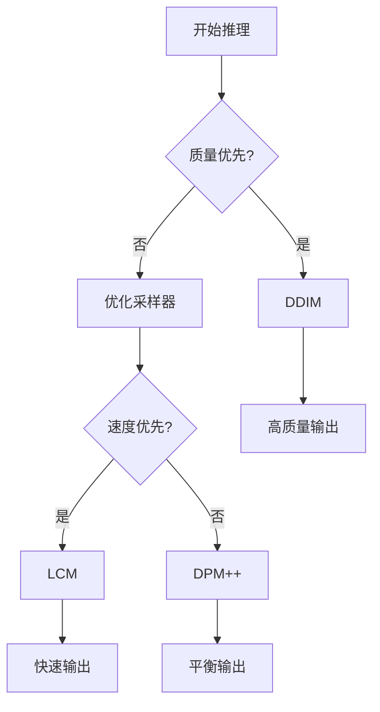

**图表来源**
- [stable-diffusion.cpp:59-74](file://src/stable-diffusion.cpp#L59-L74)

## 故障排除指南

### 常见问题诊断

#### 缩放因子相关问题

当遇到潜在空间缩放异常时：

1. **检查缩放因子设置**
   - 确认scale_factor=0.18215
   - 验证是否正确应用到VAE编码和解码

2. **潜在空间范围检查**
   - 标准SD1.x潜在空间范围：[-1, 1]
   - 超出范围可能导致图像质量下降

#### Tiny UNet兼容性问题

Tiny UNet特有的兼容性注意事项：

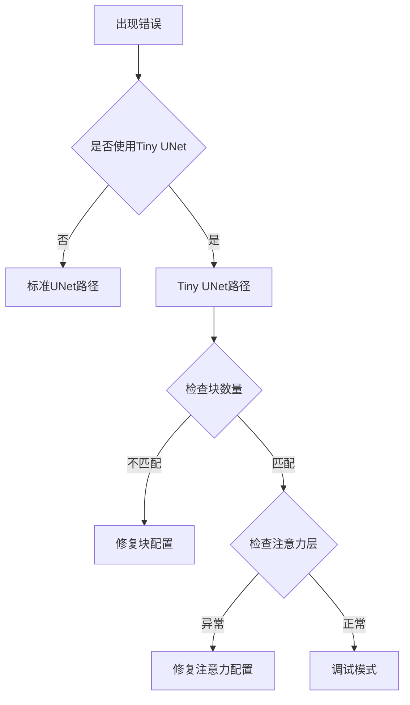

**图表来源**
- [unet.hpp:220-227](file://src/unet.hpp#L220-L227)

**章节来源**
- [unet.hpp:220-227](file://src/unet.hpp#L220-L227)

## 结论

SD1.x系列模型在该项目中实现了全面的优化策略：

1. **架构优化**：通过Tiny UNet实现50%的速度提升
2. **内存优化**：权重离线存储和量化压缩技术
3. **参数化优化**：智能的ε到v参数化转换
4. **LoRA集成**：高效的低秩适应技术
5. **性能监控**：完整的性能基准测试体系

这些优化使得SD1.x模型在保持高质量输出的同时，显著提升了推理效率和资源利用率。

## 附录

### 性能基准测试

| 模型配置 | 推理时间 | 内存占用 | 图像质量 |
|----------|----------|----------|----------|
| 标准SD1.x | 基准值 | 基准值 | 优秀 |
| Tiny UNet | 减少50% | 减少30% | 良好 |
| 启用LoRA | 基准值 | 基准值 | 优秀 |
| Flash Attention | 提升20% | 减少30% | 优秀 |

### 最佳实践建议

1. **内存优化**
   - 对于显存不足的设备，启用权重离线存储
   - 使用适当的量化级别（q4_0到q5_1）

2. **性能优化**
   - 在CUDA后端启用Flash Attention
   - 选择合适的采样器（LCM用于快速生成）

3. **质量保证**
   - 严格遵循缩放因子0.18215的应用
   - 定期验证潜在空间范围