# SD3模型优化

<cite>
**本文档引用的文件**
- [sd3.md](file://docs/sd3.md)
- [mmdit.hpp](file://src/mmdit.hpp)
- [diffusion_model.hpp](file://src/diffusion_model.hpp)
- [model.h](file://src/model.h)
- [model.cpp](file://src/model.cpp)
- [ggml_extend.hpp](file://src/ggml_extend.hpp)
- [performance.md](file://docs/performance.md)
- [flux.md](file://docs/flux.md)
- [flux2.md](file://docs/flux2.md)
- [lora.md](file://docs/lora.md)
- [conditioner.hpp](file://src/conditioner.hpp)
- [name_conversion.cpp](file://src/name_conversion.cpp)
</cite>

## 目录
1. [简介](#简介)
2. [项目结构](#项目结构)
3. [核心组件](#核心组件)
4. [架构概览](#架构概览)
5. [详细组件分析](#详细组件分析)
6. [依赖关系分析](#依赖关系分析)
7. [性能考虑](#性能考虑)
8. [故障排除指南](#故障排除指南)
9. [结论](#结论)
10. [附录](#附录)

## 简介

本文档深入分析了SD3系列模型在本代码库中的实现和优化策略。SD3（Stable Diffusion 3）代表了扩散模型架构的重要演进，采用了参数化DiT（Diffusion Transformer）架构，结合了多模态文本编码器和先进的注意力机制。

该代码库实现了完整的SD3.x、Flux、Flux Fill、Flux Control、Flux.2、Flux.2 klein等模型的支持，提供了从基础的UNet架构到最新的DiT架构的完整技术栈。重点优化包括：

- **参数化策略**：采用可学习的条件嵌入和自适应层归一化
- **注意力机制**：支持Flash Attention和多种归一化方案
- **架构特点**：混合视觉-文本处理的联合块设计
- **性能优化**：内存优化、采样器选择、LoRA适配

## 项目结构

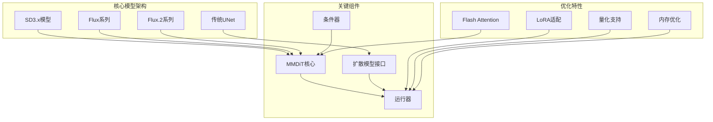

**图表来源**
- [model.h:23-54](file://src/model.h#L23-L54)
- [diffusion_model.hpp:29-174](file://src/diffusion_model.hpp#L29-L174)

**章节来源**
- [model.h:23-54](file://src/model.h#L23-L54)
- [diffusion_model.hpp:29-174](file://src/diffusion_model.hpp#L29-L174)

## 核心组件

### MMDiT架构核心

MMDiT（Multi-Modal Diffusion Transformer）是SD3模型的核心架构，实现了以下关键特性：

#### 参数化方式
- **条件嵌入**：支持时间步嵌入、向量嵌入和上下文嵌入
- **自适应调制**：通过ADA-LN（Adaptive Layer Normalization）实现条件感知的特征调制
- **多头注意力**：支持查询、键、值的独立投影和归一化

#### 注意力机制
- **QK归一化**：支持RMSNorm和LayerNorm两种归一化方案
- **跨注意力**：联合处理图像特征和文本上下文
- **自注意力**：支持双重自注意力机制（attn和attn2）

#### 架构特点
- **分层设计**：24层深度，支持跳层连接
- **混合块**：联合块设计实现视觉-文本特征融合
- **最终层**：专门的解码层实现去规范化和线性映射

**章节来源**
- [mmdit.hpp:11-954](file://src/mmdit.hpp#L11-L954)
- [mmdit.hpp:611-954](file://src/mmdit.hpp#L611-L954)

### 扩散模型接口

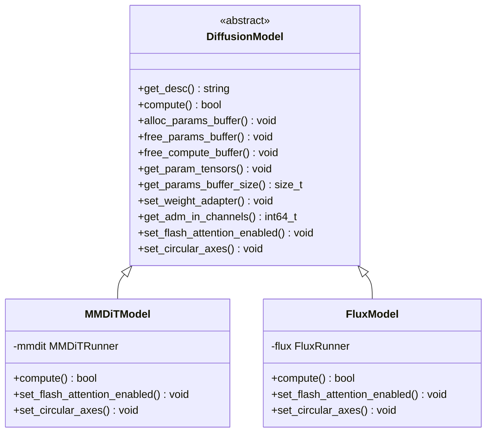

**图表来源**
- [diffusion_model.hpp:29-174](file://src/diffusion_model.hpp#L29-L174)

**章节来源**
- [diffusion_model.hpp:29-174](file://src/diffusion_model.hpp#L29-L174)

## 架构概览

### SD3.x架构流程

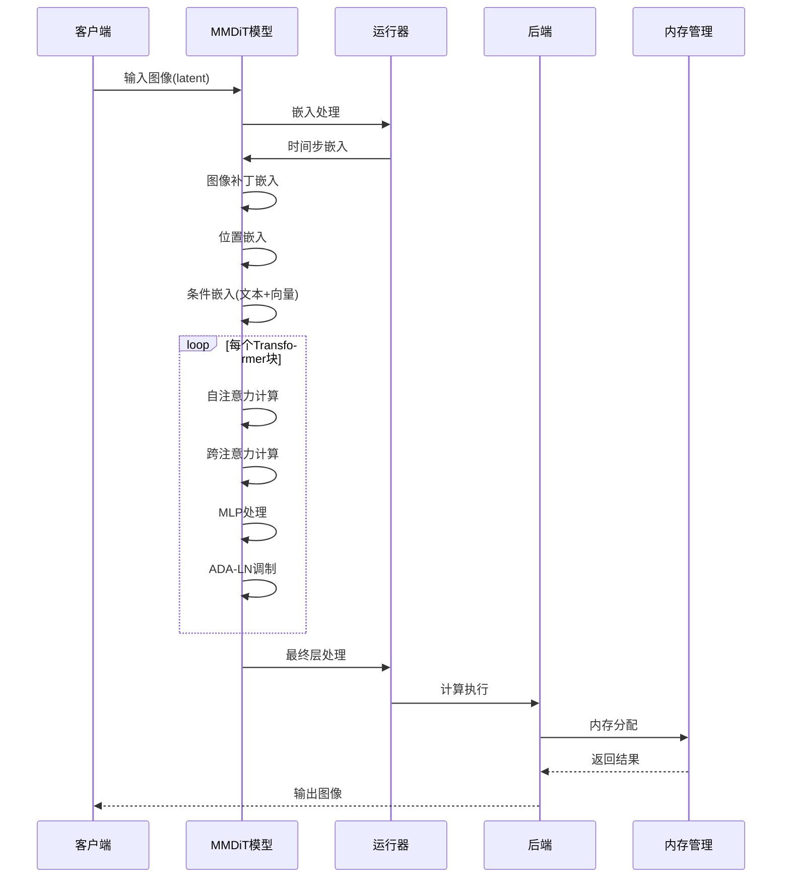

**图表来源**
- [mmdit.hpp:777-818](file://src/mmdit.hpp#L777-L818)
- [ggml_extend.hpp:1297-1443](file://src/ggml_extend.hpp#L1297-L1443)

### 多模型支持架构

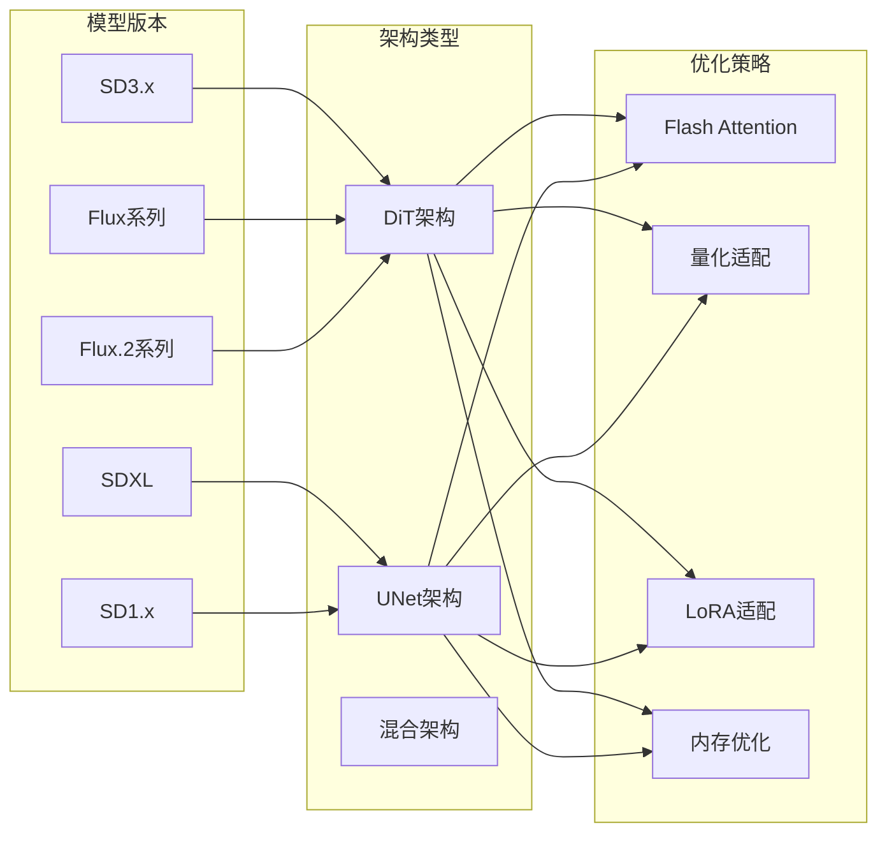

**图表来源**
- [model.h:23-54](file://src/model.h#L23-L54)
- [diffusion_model.hpp:112-174](file://src/diffusion_model.hpp#L112-L174)

**章节来源**
- [model.h:23-54](file://src/model.h#L23-L54)
- [diffusion_model.hpp:112-174](file://src/diffusion_model.hpp#L112-L174)

## 详细组件分析

### MMDiT核心实现

#### 分层注意力机制

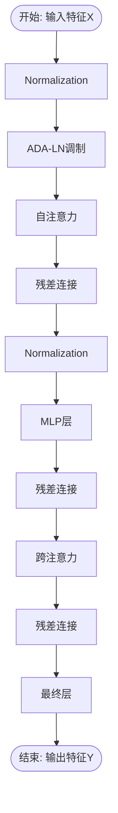

**图表来源**
- [mmdit.hpp:234-464](file://src/mmdit.hpp#L234-L464)

#### 参数化策略详解

MMDiT采用多层次的参数化策略：

1. **时间步参数化**：通过时间步嵌入生成条件向量
2. **向量参数化**：处理类别标签和其他向量条件
3. **上下文参数化**：整合文本编码器输出
4. **ADA-LN调制**：动态调整特征表示

**章节来源**
- [mmdit.hpp:97-149](file://src/mmdit.hpp#L97-L149)
- [mmdit.hpp:234-464](file://src/mmdit.hpp#L234-L464)

### 注意力机制优化

#### Flash Attention集成

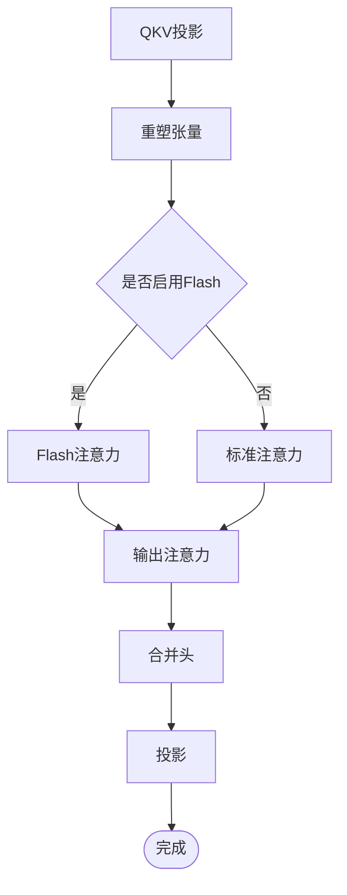

**图表来源**
- [ggml_extend.hpp:1297-1443](file://src/ggml_extend.hpp#L1297-L1443)

#### QK归一化策略

MMDiT支持两种QK归一化方案：

- **RMSNorm**：更稳定的归一化，避免梯度消失
- **LayerNorm**：传统的归一化方法

**章节来源**
- [mmdit.hpp:151-218](file://src/mmdit.hpp#L151-L218)
- [ggml_extend.hpp:1297-1443](file://src/ggml_extend.hpp#L1297-L1443)

### 条件器系统

#### SD3条件器实现

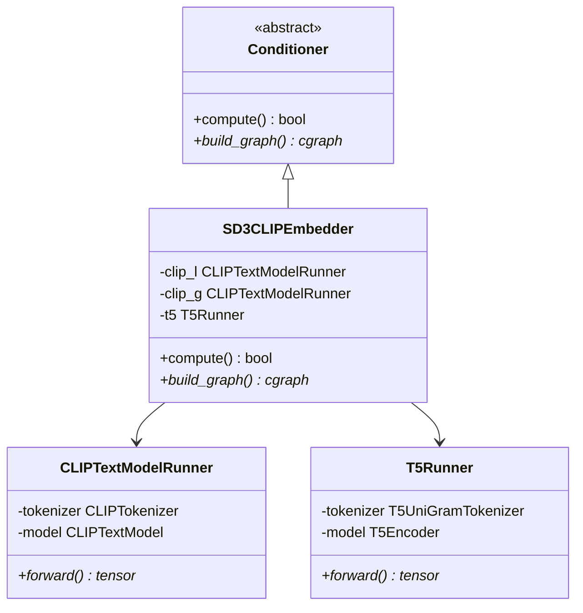

**图表来源**
- [conditioner.hpp:710-716](file://src/conditioner.hpp#L710-L716)

**章节来源**
- [conditioner.hpp:710-716](file://src/conditioner.hpp#L710-L716)

### 模型加载和权重转换

#### 权重名称映射

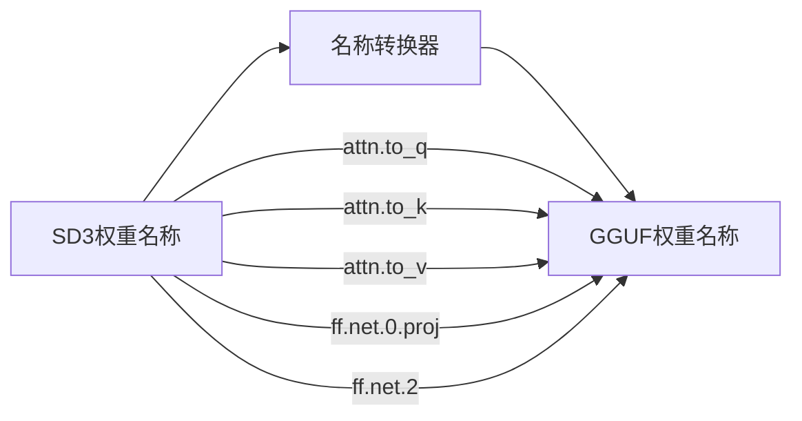

**图表来源**
- [name_conversion.cpp:429-473](file://src/name_conversion.cpp#L429-L473)

**章节来源**
- [name_conversion.cpp:429-473](file://src/name_conversion.cpp#L429-L473)

## 依赖关系分析

### 组件耦合度分析

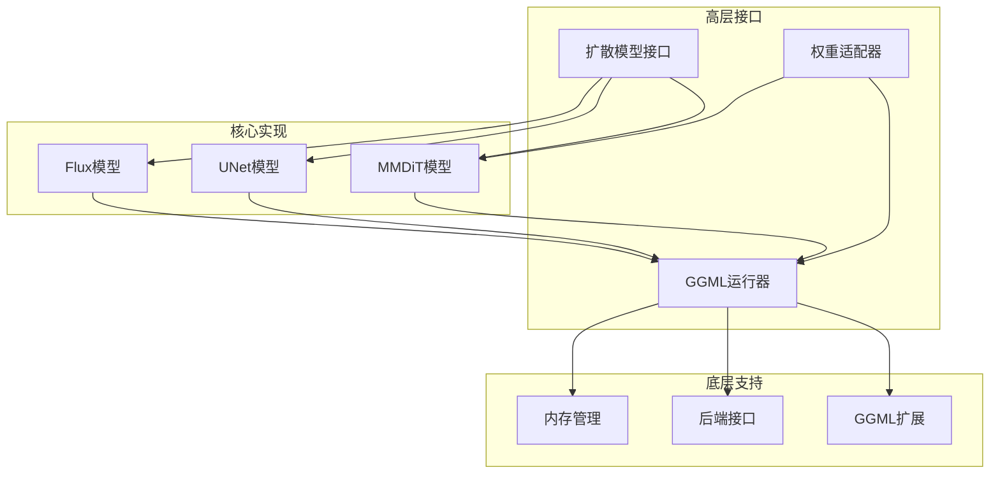

**图表来源**
- [diffusion_model.hpp:29-518](file://src/diffusion_model.hpp#L29-L518)
- [ggml_extend.hpp:1614-1645](file://src/ggml_extend.hpp#L1614-L1645)

### 外部依赖和集成点

主要外部依赖包括：
- **ggml框架**：核心张量计算和后端抽象
- **模型格式**：支持GGUF、safetensors、checkpoint格式
- **后端支持**：CPU、CUDA、Metal、Vulkan等后端

**章节来源**
- [diffusion_model.hpp:4-11](file://src/diffusion_model.hpp#L4-L11)
- [model.cpp:15-38](file://src/model.cpp#L15-L38)

## 性能考虑

### 内存优化策略

#### Flash Attention优化

根据性能文档，启用Flash Attention可以显著减少内存使用：

- **Flux模型**：768x768分辨率下节省约600MB内存
- **SD2模型**：768x768分辨率下节省约1400MB内存

```mermaid
flowchart TD
Enable[启用Flash Attention] --> MemReduction[内存减少]
MemReduction --> SpeedUp[速度提升(CUDA)]
MemReduction --> SpeedDown[速度下降(其他后端)]
Disable[禁用Flash Attention] --> Default[默认行为]
Default --> Stable[稳定性能]
```

**图表来源**
- [performance.md:1-26](file://docs/performance.md#L1-L26)

#### 权重离线优化

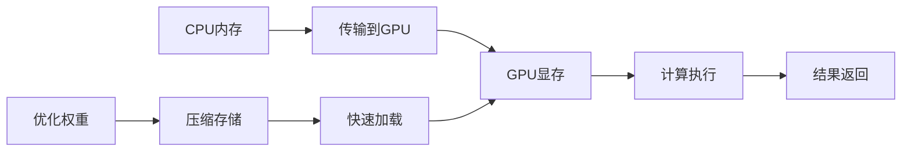

**章节来源**
- [performance.md:20-26](file://docs/performance.md#L20-L26)

### 采样器选择建议

基于不同模型的特点，推荐以下采样器配置：

- **SD3.x模型**：推荐使用Euler或DPM++ 2M采样器
- **Flux系列**：推荐使用Euler或Heun采样器
- **Flux.2系列**：推荐使用DPM++ 2M采样器

### LoRA适配优化

#### LoRA应用模式

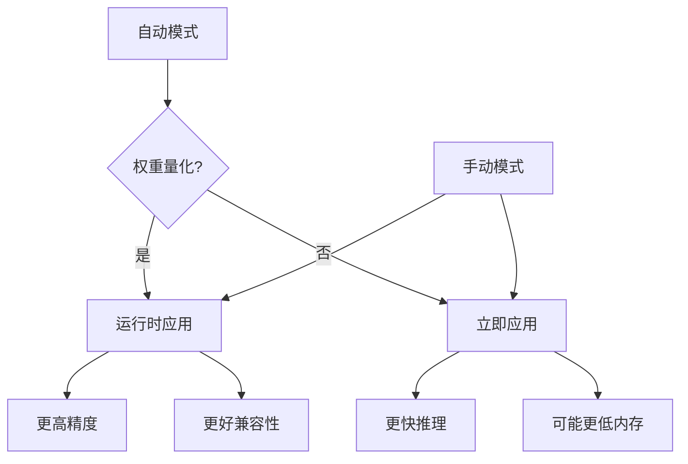

**图表来源**
- [lora.md:15-27](file://docs/lora.md#L15-L27)

**章节来源**
- [lora.md:15-27](file://docs/lora.md#L15-L27)

## 故障排除指南

### 常见问题诊断

#### 内存不足问题

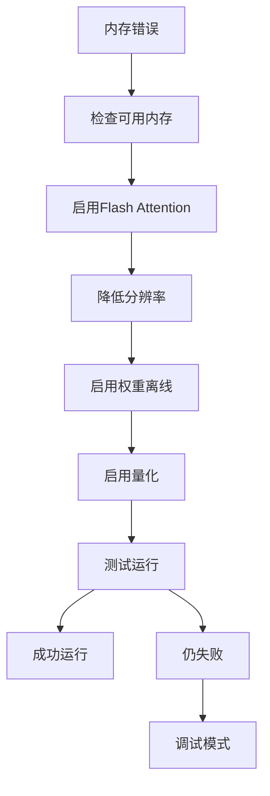

#### 模型加载问题

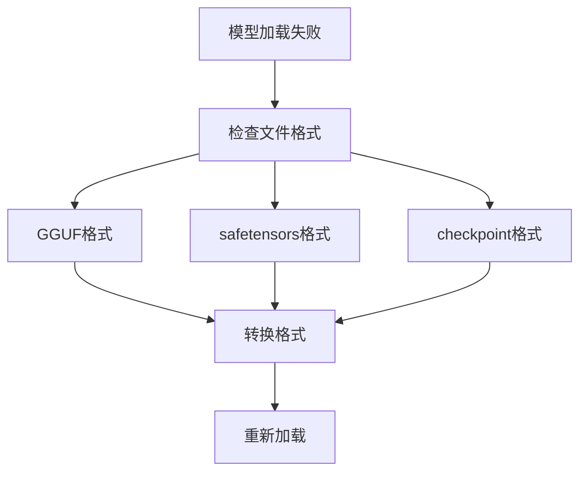

**章节来源**
- [model.cpp:361-382](file://src/model.cpp#L361-L382)
- [model.cpp:502-640](file://src/model.cpp#L502-L640)

### 性能调优建议

#### 后端选择策略

| 后端类型 | 推荐场景 | 优势 | 局限性 |
|---------|---------|------|--------|
| CUDA | 高性能GPU | 最快推理速度 | 需要NVIDIA GPU |
| Metal | macOS系统 | 系统集成好 | 平台限制 |
| CPU | 通用兼容 | 无硬件要求 | 速度较慢 |
| Vulkan | 跨平台 | 跨平台支持 | 配置复杂 |

## 结论

SD3系列模型在本代码库中实现了全面的技术优化和架构创新：

### 技术进步总结

1. **架构演进**：从UNet到DiT的架构转变，实现了更好的多模态处理能力
2. **参数化优化**：通过ADA-LN和条件嵌入实现了更灵活的特征调制
3. **注意力机制**：Flash Attention和多种归一化方案提升了计算效率
4. **多模型支持**：覆盖从SD3.x到Flux.2.klein的完整产品线

### 优化要点

- **内存优化**：Flash Attention、权重离线、量化支持
- **性能提升**：多后端支持、批处理优化、缓存机制
- **易用性改进**：统一接口、自动模式选择、错误处理

### 使用建议

1. **硬件选择**：优先使用CUDA后端以获得最佳性能
2. **内存管理**：合理设置分辨率和启用适当的优化选项
3. **模型选择**：根据应用场景选择合适的SD3.x或Flux变体
4. **LoRA应用**：根据模型量化状态选择合适的LoRA应用模式

这些优化使得SD3系列模型在保持高质量生成效果的同时，显著提升了运行效率和资源利用率。

## 附录

### 配置参数参考

#### 基础运行参数
- `--diffusion-model`：扩散模型路径
- `--clip-l`：CLIP-L文本编码器路径
- `--clip-g`：CLIP-G文本编码器路径
- `--t5xxl`：T5文本编码器路径

#### 性能优化参数
- `--diffusion-fa`：启用扩散模型Flash Attention
- `--offload-to-cpu`：权重离线到CPU
- `--type`：量化类型选择

#### LoRA配置参数
- `--lora-model-dir`：LoRA模型目录
- `--lora-apply-mode`：LoRA应用模式
- 提示词中使用`<lora:name:strength>`格式

**章节来源**
- [sd3.md:1-20](file://docs/sd3.md#L1-L20)
- [performance.md:1-26](file://docs/performance.md#L1-L26)
- [lora.md:1-27](file://docs/lora.md#L1-L27)