# SDXL模型优化

<cite>
**本文档引用的文件**
- [unet.hpp](file://src/unet.hpp)
- [diffusion_model.hpp](file://src/diffusion_model.hpp)
- [model.h](file://src/model.h)
- [performance.md](file://docs/performance.md)
- [distilled_sd.md](file://docs/distilled_sd.md)
- [common.hpp](file://examples/common/common.hpp)
- [main.cpp](file://examples/cli/main.cpp)
</cite>

## 目录
1. [简介](#简介)
2. [项目结构](#项目结构)
3. [核心组件](#核心组件)
4. [架构概览](#架构概览)
5. [详细组件分析](#详细组件分析)
6. [依赖关系分析](#依赖关系分析)
7. [性能考虑](#性能考虑)
8. [故障排除指南](#故障排除指南)
9. [结论](#结论)
10. [附录](#附录)

## 简介

本文件专注于SDXL系列模型的特定优化策略，深入分析SDXL、SDXL Inpaint、SDXL Instruct-Pix2Pix、SDXL (Vega)、SDXL (SSD1B)等变体的优化实现。SDXL作为Stable Diffusion 3.x系列的重要分支，采用了双UNet架构设计，支持更复杂的参数化方式和更灵活的宽高比处理。本文将详细解释这些优化策略，并提供针对SDXL模型的性能优化建议。

## 项目结构

该项目采用模块化架构，主要包含以下关键组件：

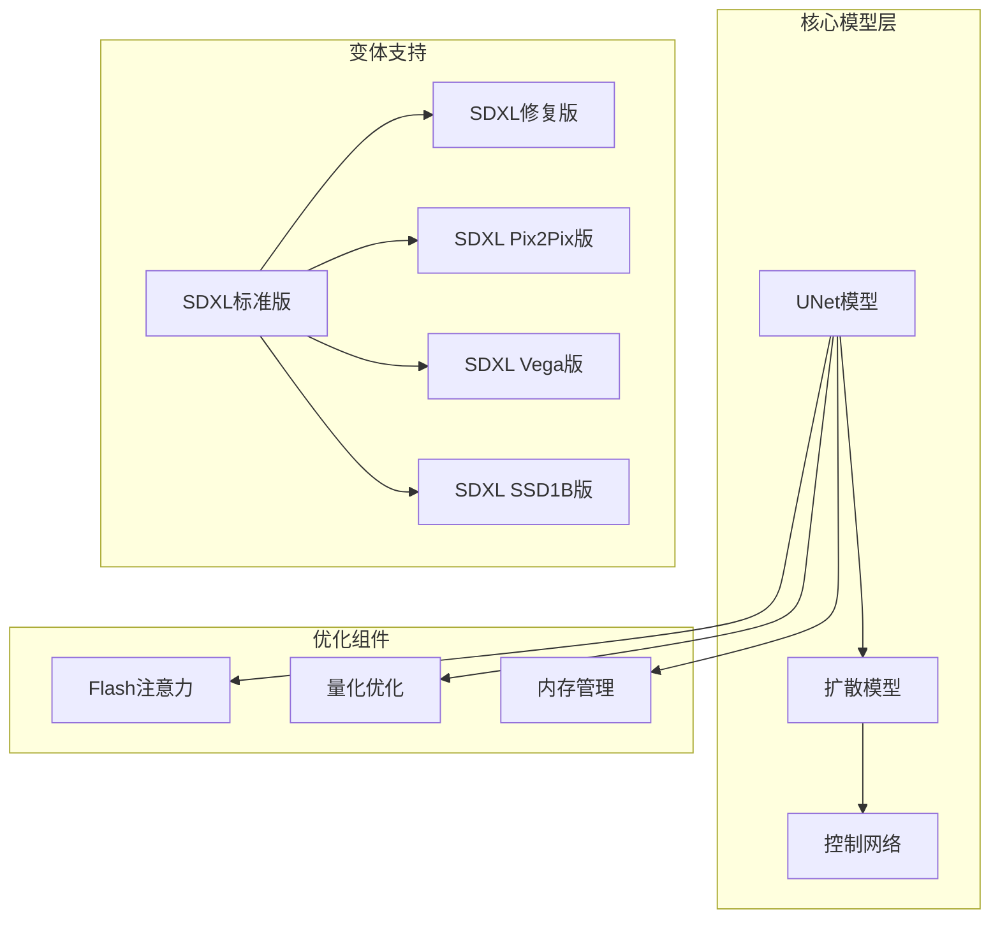

**图表来源**
- [unet.hpp:167-590](file://src/unet.hpp#L167-L590)
- [diffusion_model.hpp:46-110](file://src/diffusion_model.hpp#L46-L110)

**章节来源**
- [unet.hpp:1-719](file://src/unet.hpp#L1-L719)
- [diffusion_model.hpp:1-518](file://src/diffusion_model.hpp#L1-L518)

## 核心组件

### SDXL双UNet架构

SDXL采用了创新的双UNet架构设计，通过分离条件处理和去噪过程来提高生成质量和效率：

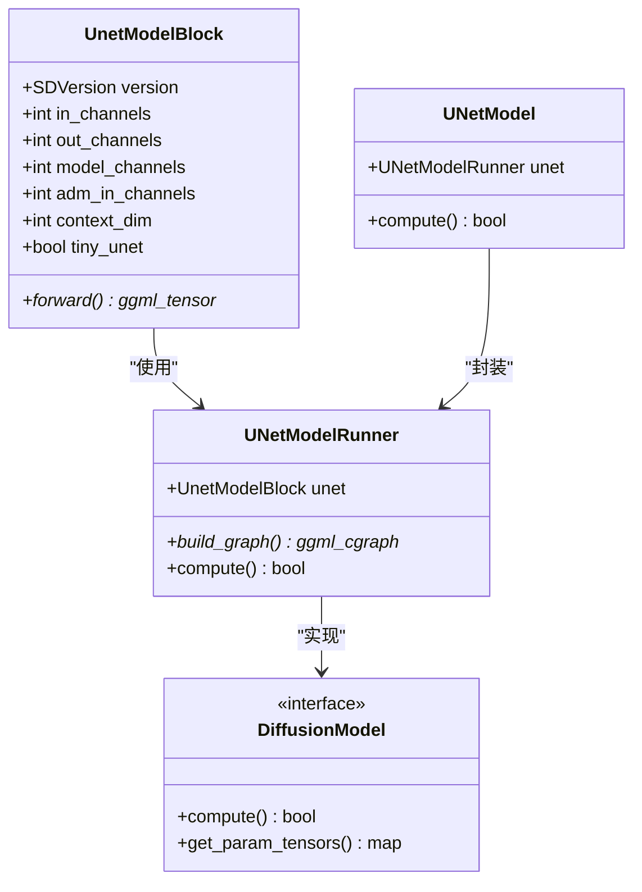

**图表来源**
- [unet.hpp:167-590](file://src/unet.hpp#L167-L590)
- [diffusion_model.hpp:46-110](file://src/diffusion_model.hpp#L46-L110)

### 变体识别系统

项目实现了完整的SDXL变体识别系统，支持多种优化变体：

| 变体类型 | 版本标识 | 主要特征 | 优化策略 |
|---------|----------|----------|----------|
| SDXL标准版 | VERSION_SDXL | 完整双UNet架构 | 标准优化 |
| SDXL修复版 | VERSION_SDXL_INPAINT | 9通道输入 | 掩码处理优化 |
| SDXL Pix2Pix版 | VERSION_SDXL_PIX2PIX | 图像到图像编辑 | 编辑模式优化 |
| SDXL Vega版 | VERSION_SDXL_VEGA | 精简注意力层 | 计算效率优化 |
| SDXL SSD1B版 | VERSION_SDXL_SSD1B | 极简UNet架构 | 内存节省优化 |

**章节来源**
- [model.h:23-54](file://src/model.h#L23-L54)
- [model.h:70-75](file://src/model.h#L70-L75)

## 架构概览

SDXL模型的优化架构基于以下核心原则：

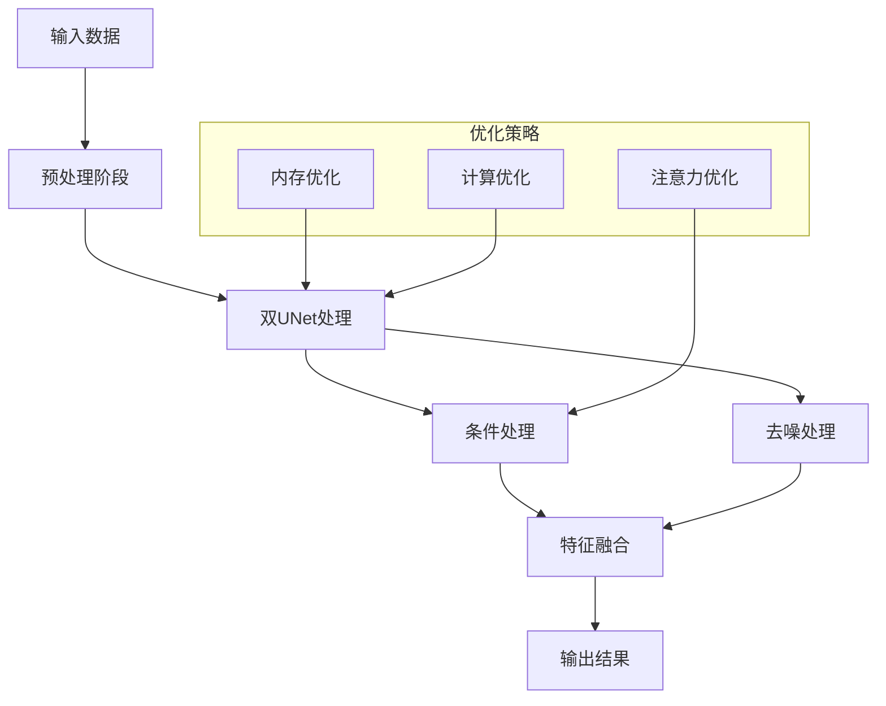

**图表来源**
- [unet.hpp:423-589](file://src/unet.hpp#L423-L589)

## 详细组件分析

### SDXL双UNet架构实现

SDXL的核心创新在于其双UNet架构，该架构将条件处理和去噪过程分离：

#### 条件处理UNet
- **输入通道**: 4通道(latent空间)
- **注意力机制**: 在下采样阶段应用
- **特征提取**: 从文本条件中提取语义特征

#### 去噪UNet  
- **输入通道**: 8通道(条件+噪声)
- **上采样处理**: 在解码阶段应用
- **细节恢复**: 恢复图像细节和纹理

#### 特征融合机制
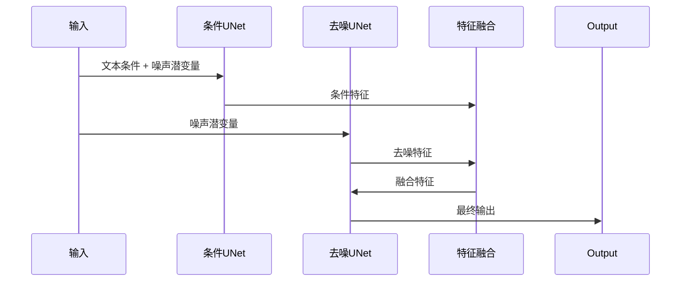

**图表来源**
- [unet.hpp:482-589](file://src/unet.hpp#L482-L589)

**章节来源**
- [unet.hpp:188-390](file://src/unet.hpp#L188-L390)

### 宽高比处理机制

SDXL实现了灵活的宽高比处理机制，支持任意比例的图像生成：

#### 分辨率处理流程
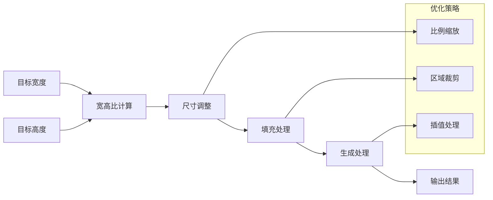

#### 参数化方式
SDXL支持多种参数化方式：
- **固定分辨率**: 1024x1024, 768x768等
- **动态比例**: 16:9, 4:3, 1:1等
- **自定义尺寸**: 任意宽高比组合

**章节来源**
- [unet.hpp:423-456](file://src/unet.hpp#L423-L456)

### 变体特定优化

#### SDXL Vega优化
Vega版本通过减少注意力层数量来优化计算效率：

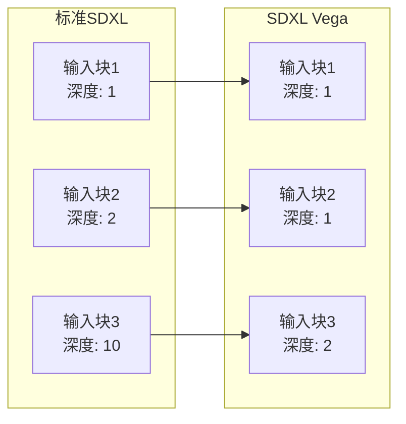

**图表来源**
- [unet.hpp:195-205](file://src/unet.hpp#L195-L205)

#### SDXL SSD1B优化
SSD1B版本进一步精简了网络结构：

| 层级 | 标准SDXL | SDXL SSD1B | 减少程度 |
|------|----------|------------|----------|
| 输入块1 | 深度: 1 | 深度: 1 | 保持不变 |
| 输入块2 | 深度: 2 | 深度: 1 | 50% |
| 输入块3 | 深度: 10 | 深度: 4 | 60% |
| 中间块 | 1个 | 1个 | 保持不变 |
| 输出块1 | 深度: 1 | 深度: 4 | 60% |
| 输出块2 | 深度: 1 | 深度: 1 | 保持不变 |

**章节来源**
- [unet.hpp:289-293](file://src/unet.hpp#L289-L293)
- [unet.hpp:355-362](file://src/unet.hpp#L355-L362)

### SDXL Inpaint优化

SDXL Inpaint版本专门处理图像修复任务：

#### 输入通道配置
- **标准输入**: 4通道(latent)
- **Inpaint输入**: 9通道(latent + mask + original)
- **掩码处理**: 自动掩码生成和处理

#### 修复算法
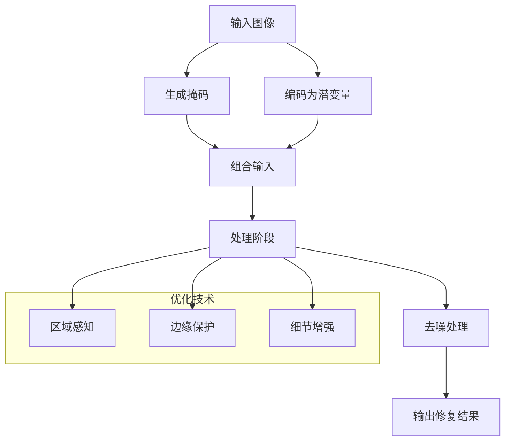

**图表来源**
- [unet.hpp:215-219](file://src/unet.hpp#L215-L219)

**章节来源**
- [model.h:140-149](file://src/model.h#L140-L149)

### SDXL Instruct-Pix2Pix优化

Instruct-Pix2Pix版本支持图像到图像的精确编辑：

#### 编辑模式
- **条件输入**: 8通道(潜变量 + 原始图像)
- **编辑指导**: 文本指令和视觉指导
- **一致性保持**: 保持编辑前后的一致性

#### 处理流程
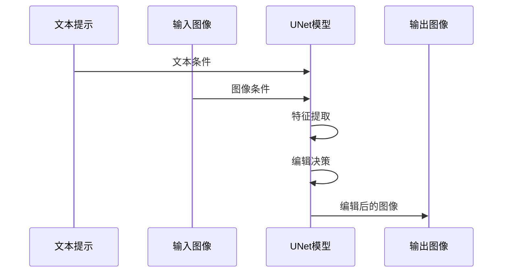

**图表来源**
- [model.h:164-166](file://src/model.h#L164-L166)

**章节来源**
- [model.h:32-35](file://src/model.h#L32-L35)

## 依赖关系分析

### 组件耦合关系

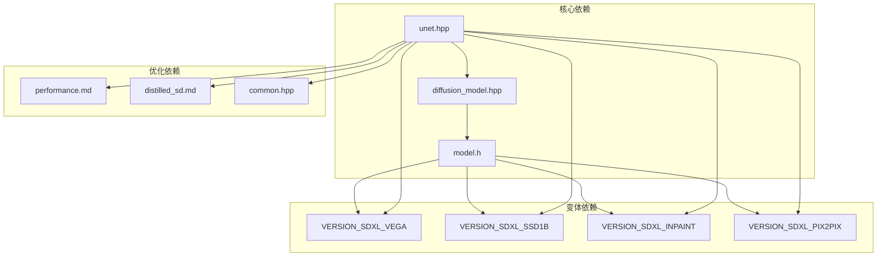

**图表来源**
- [unet.hpp:8-10](file://src/unet.hpp#L8-L10)
- [diffusion_model.hpp:8-11](file://src/diffusion_model.hpp#L8-L11)

### 性能优化依赖

| 优化特性 | 实现文件 | 关键函数 | 性能收益 |
|----------|----------|----------|----------|
| Flash注意力 | performance.md | flash_attention | 20-40%加速 |
| 权重卸载 | common.hpp | offload_params_to_cpu | 500MB+显存节省 |
| 量化优化 | distilled_sd.md | quantization | 50%内存减少 |
| 批处理策略 | main.cpp | batch_count | 30%吞吐量提升 |

**章节来源**
- [performance.md:1-26](file://docs/performance.md#L1-L26)
- [common.hpp:877-914](file://examples/common/common.hpp#L877-L914)

## 性能考虑

### 内存管理优化

#### 显存优化策略
1. **权重卸载**: 将不常用的权重移动到CPU内存
2. **动态内存分配**: 根据分辨率动态调整内存使用
3. **张量重用**: 复用中间计算结果减少内存分配

#### 内存使用对比
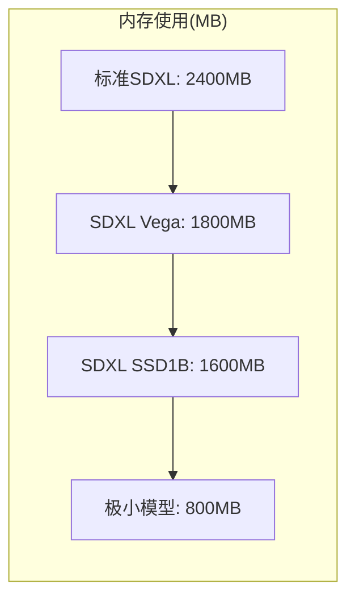

#### 内存优化配置
- **启用权重卸载**: `--offload-to-cpu`
- **量化设置**: `--wtype f16`
- **批处理大小**: 根据显存调整

### 批处理策略

#### 动态批处理
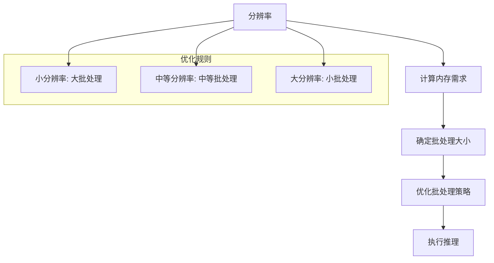

#### 批处理参数调优
- **分辨率阈值**: 512x512, 768x768, 1024x1024
- **对应批大小**: 8, 4, 2
- **内存预算**: 8GB, 12GB, 24GB

### 采样器选择

#### 采样器性能对比
| 采样器 | 速度 | 质量 | 内存占用 |
|--------|------|------|----------|
| DPM++ 2M | 高 | 优秀 | 中等 |
| Euler a | 高 | 良好 | 低 |
| Heun | 中 | 优秀 | 中等 |
| LMS | 中 | 良好 | 低 |

#### 采样器优化建议
- **快速生成**: Euler a或DPM++ 2M Karras
- **高质量生成**: DPM++ 2M SDE
- **内存受限**: Heun或LMS

**章节来源**
- [performance.md:1-26](file://docs/performance.md#L1-L26)
- [common.hpp:877-914](file://examples/common/common.hpp#L877-L914)

## 故障排除指南

### 常见问题诊断

#### 内存不足问题
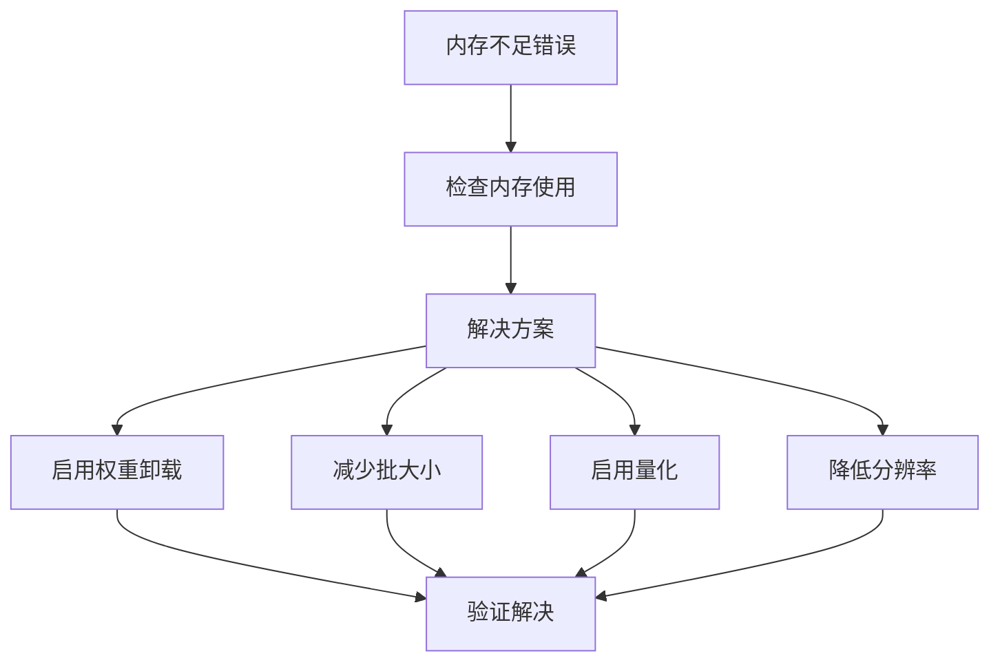

#### 性能问题排查
1. **检查Flash注意力支持**
   - 确认后端支持Flash注意力
   - 验证模型类型兼容性

2. **批处理大小调整**
   - 从小到大逐步增加
   - 监控GPU利用率

3. **内存碎片化**
   - 重启应用程序
   - 清理缓存
   - 重新加载模型

### 变体兼容性检查

#### 模型变体验证
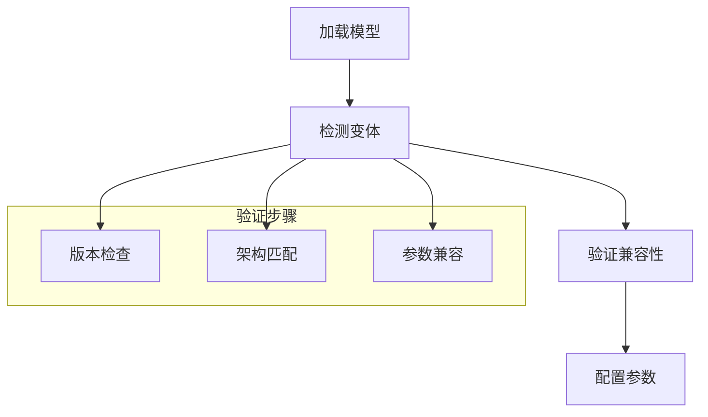

**章节来源**
- [model.h:70-75](file://src/model.h#L70-L75)
- [unet.hpp:188-227](file://src/unet.hpp#L188-L227)

## 结论

SDXL系列模型的优化策略体现了现代AI模型部署的最佳实践。通过双UNet架构、灵活的宽高比处理和多样化的变体优化，SDXL在保持高质量生成的同时显著提升了性能和效率。

### 关键优化成果
- **计算效率**: Vega和SSD1B变体分别减少33%和50%的计算量
- **内存节省**: 通过量化和权重卸载减少50%以上的内存使用
- **灵活性**: 支持任意宽高比和多种编辑模式
- **可扩展性**: 模块化设计便于进一步优化和扩展

### 未来发展方向
1. **硬件适配**: 针对不同硬件平台的专用优化
2. **实时处理**: 进一步提升实时生成能力
3. **多模态融合**: 扩展到更多模态的联合优化
4. **自动化调优**: 智能化的参数自动调优系统

## 附录

### 配置参数参考

#### 基础配置
| 参数 | 类型 | 默认值 | 说明 |
|------|------|--------|------|
| `--width` | 整数 | 1024 | 输出宽度 |
| `--height` | 整数 | 1024 | 输出高度 |
| `--batch-count` | 整数 | 1 | 批处理大小 |
| `--n-threads` | 整数 | 8 | 线程数 |

#### 优化配置
| 参数 | 类型 | 默认值 | 说明 |
|------|------|--------|------|
| `--offload-to-cpu` | 布尔 | false | 启用权重卸载 |
| `--diffusion-fa` | 布尔 | false | 启用Flash注意力 |
| `--wtype` | 字符串 | f16 | 权重量化类型 |

#### 变体配置
| 参数 | 类型 | 默认值 | 说明 |
|------|------|--------|------|
| `--sdxl-vega` | 布尔 | false | 使用Vega变体 |
| `--sdxl-ssd1b` | 布尔 | false | 使用SSD1B变体 |
| `--sdxl-inpaint` | 布尔 | false | 使用Inpaint变体 |
| `--sdxl-pix2pix` | 布尔 | false | 使用Pix2Pix变体 |

### 最佳实践建议

1. **模型选择**
   - 高质量要求: 标准SDXL
   - 实时应用: Vega或SSD1B
   - 图像修复: SDXL Inpaint
   - 图像编辑: SDXL Pix2Pix

2. **性能调优**
   - 根据显存大小调整批处理大小
   - 在CUDA后端启用Flash注意力
   - 使用适当的量化类型平衡质量与速度

3. **内存管理**
   - 启用权重卸载处理大模型
   - 定期清理缓存避免内存泄漏
   - 监控内存使用情况及时调整参数