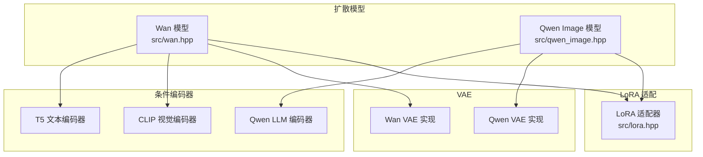
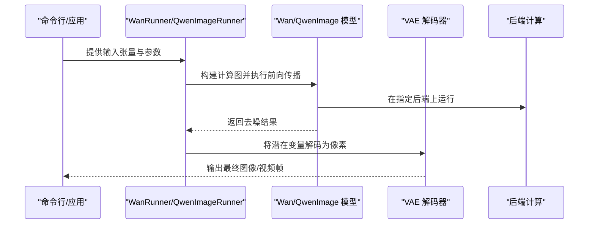
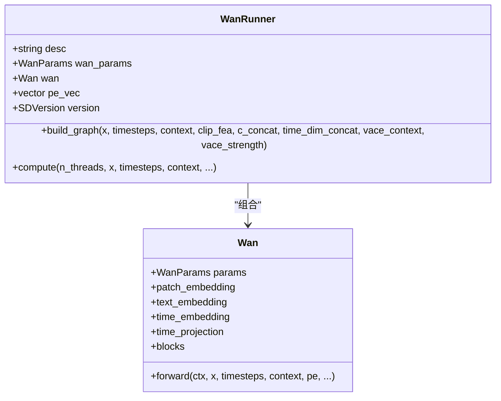
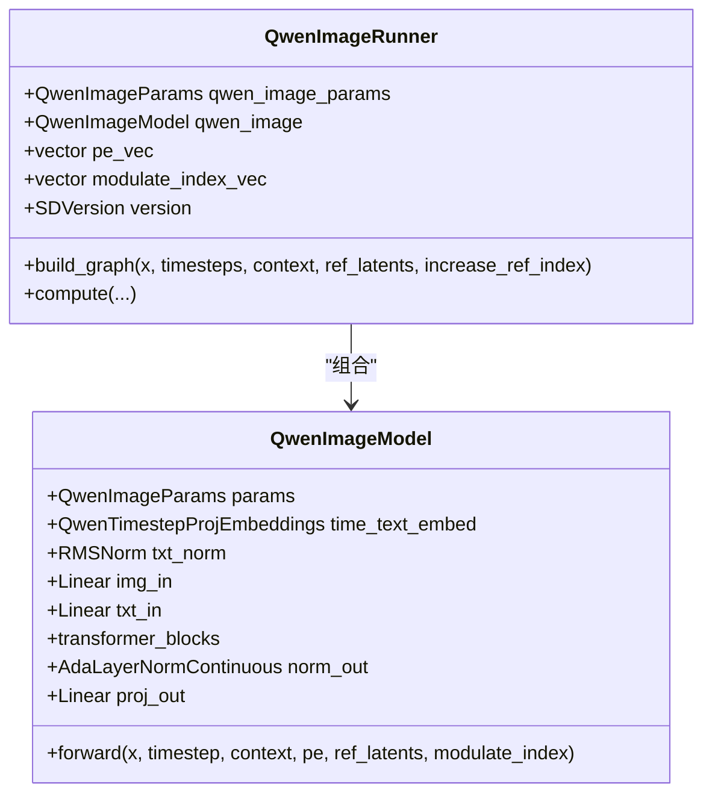
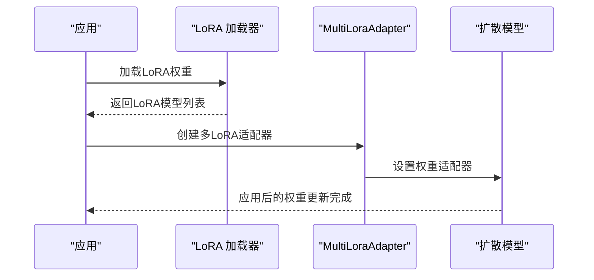
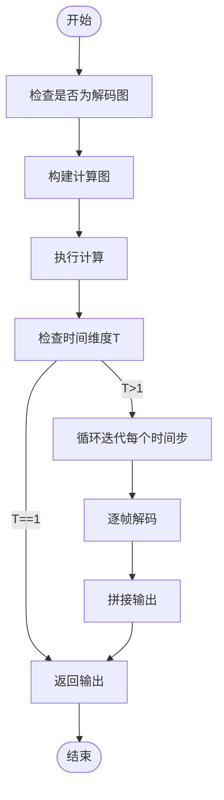
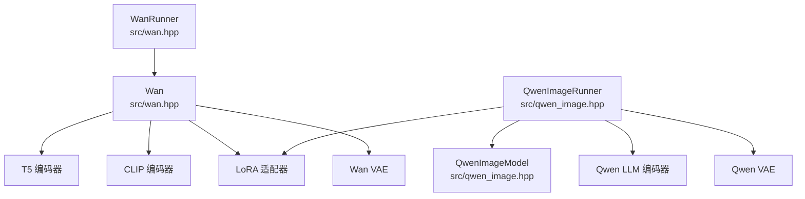

# Wan/Qwen模型优化

<cite>
**本文档引用的文件**
- [src/wan.hpp](file://src/wan.hpp)
- [src/qwen_image.hpp](file://src/qwen_image.hpp)
- [docs/wan.md](file://docs/wan.md)
- [docs/qwen_image.md](file://docs/qwen_image.md)
- [docs/performance.md](file://docs/performance.md)
- [src/diffusion_model.hpp](file://src/diffusion_model.hpp)
- [src/stable-diffusion.cpp](file://src/stable-diffusion.cpp)
- [src/lora.hpp](file://src/lora.hpp)
- [src/conditioner.hpp](file://src/conditioner.hpp)
</cite>

## 目录
1. [简介](#简介)
2. [项目结构](#项目结构)
3. [核心组件](#核心组件)
4. [架构概览](#架构概览)
5. [详细组件分析](#详细组件分析)
6. [依赖关系分析](#依赖关系分析)
7. [性能考虑](#性能考虑)
8. [故障排除指南](#故障排除指南)
9. [结论](#结论)

## 简介

本文件专注于Wan和Qwen系列模型在C++稳定扩散实现中的优化策略和最佳实践。重点涵盖：

- Wan 2.x、Wan 2.2 I2V、Wan 2.2 TI2V、Qwen Image等模型的架构特点与优化策略
- 参数化方式与配置参数
- 性能优化建议（内存管理、采样器选择、LoRA适配）
- 与传统扩散模型的区别与优势
- 具体的使用示例与最佳实践

## 项目结构

该项目采用模块化设计，围绕扩散模型、VAE、条件编码器、LoRA适配器等核心组件构建。Wan和Qwen模型分别通过独立的头文件实现其特有的网络结构与推理流程。

**图表来源**
- [src/wan.hpp:1-2295](file://src/wan.hpp#L1-L2295)
- [src/qwen_image.hpp:1-700](file://src/qwen_image.hpp#L1-L700)
- [src/lora.hpp:835-861](file://src/lora.hpp#L835-L861)

**章节来源**
- [src/wan.hpp:1-2295](file://src/wan.hpp#L1-L2295)
- [src/qwen_image.hpp:1-700](file://src/qwen_image.hpp#L1-L700)

## 核心组件

### Wan 模型优化要点

- **3D因果卷积与时间建模**：Wan采用CausalConv3d进行时空特征提取，支持视频生成中的时间维度建模，并通过时间卷积缓存机制减少重复计算。
- **残差块与上采样/下采样**：ResidualBlock结合RMSNorm与SiLU激活，配合Resample模块实现2D/3D的上采样与下采样，支持温度降采样与空间上采样。
- **注意力机制**：AttentionBlock在2D平面上进行注意力计算，结合RMSNorm与卷积投影，提升特征表达能力。
- **VAE优化**：WanVAE支持分块编码/解码，通过特征缓存与patchify/unpatchify操作优化显存占用，特别是Wan2.2版本的高分辨率输出。

**章节来源**
- [src/wan.hpp:18-83](file://src/wan.hpp#L18-L83)
- [src/wan.hpp:339-405](file://src/wan.hpp#L339-L405)
- [src/wan.hpp:528-587](file://src/wan.hpp#L528-L587)
- [src/wan.hpp:923-1109](file://src/wan.hpp#L923-L1109)

### Qwen Image 模型优化要点

- **双模态注意力**：QwenImageAttention同时处理图像tokens与文本tokens，通过RMSNorm与旋转位置编码（RoPE）增强跨模态交互。
- **可调零条件时间嵌入**：支持zero_cond_t模式，通过modulate_index在图像与参考图像之间切换，实现更灵活的控制。
- **Transformer块堆叠**：QwenImageTransformerBlock包含两层归一化、注意力与MLP，支持条件调制（modulate）以适应不同输入。
- **AdaLayerNorm**：AdaLayerNormContinuous用于对齐条件向量与特征张量，确保时序一致性。

**章节来源**
- [src/qwen_image.hpp:64-189](file://src/qwen_image.hpp#L64-L189)
- [src/qwen_image.hpp:191-315](file://src/qwen_image.hpp#L191-L315)
- [src/qwen_image.hpp:317-348](file://src/qwen_image.hpp#L317-L348)
- [src/qwen_image.hpp:364-473](file://src/qwen_image.hpp#L364-L473)

## 架构概览

**图表来源**
- [src/wan.hpp:2136-2208](file://src/wan.hpp#L2136-L2208)
- [src/qwen_image.hpp:528-620](file://src/qwen_image.hpp#L528-L620)

## 详细组件分析

### WanRunner 组件分析

WanRunner负责根据权重文件自动识别模型类型与参数规模，并构建对应的计算图。

**图表来源**
- [src/wan.hpp:2009-2295](file://src/wan.hpp#L2009-L2295)
- [src/wan.hpp:1755-1780](file://src/wan.hpp#L1755-L1780)

**章节来源**
- [src/wan.hpp:2009-2295](file://src/wan.hpp#L2009-L2295)

### QwenImageRunner 组件分析

QwenImageRunner负责构建Qwen Image模型的计算图，支持可选的zero_cond_t模式与参考潜变量。

**图表来源**
- [src/qwen_image.hpp:475-695](file://src/qwen_image.hpp#L475-L695)
- [src/qwen_image.hpp:364-473](file://src/qwen_image.hpp#L364-L473)

**章节来源**
- [src/qwen_image.hpp:475-695](file://src/qwen_image.hpp#L475-L695)

### LoRA 适配流程

**图表来源**
- [src/lora.hpp:835-861](file://src/lora.hpp#L835-L861)
- [src/stable-diffusion.cpp:1097-1183](file://src/stable-diffusion.cpp#L1097-L1183)

**章节来源**
- [src/lora.hpp:835-861](file://src/lora.hpp#L835-L861)
- [src/stable-diffusion.cpp:1097-1183](file://src/stable-diffusion.cpp#L1097-L1183)

### 复杂逻辑流程（VAE分块解码）

**图表来源**
- [src/wan.hpp:1147-1208](file://src/wan.hpp#L1147-L1208)

**章节来源**
- [src/wan.hpp:1147-1208](file://src/wan.hpp#L1147-L1208)

## 依赖关系分析

**图表来源**
- [src/wan.hpp:2009-2295](file://src/wan.hpp#L2009-L2295)
- [src/qwen_image.hpp:475-695](file://src/qwen_image.hpp#L475-L695)
- [src/diffusion_model.hpp:360-384](file://src/diffusion_model.hpp#L360-L384)

**章节来源**
- [src/diffusion_model.hpp:360-384](file://src/diffusion_model.hpp#L360-L384)

## 性能考虑

### 内存管理优化

- **分块VAE解码**：Wan VAE支持按时间步分块解码，显著降低显存峰值，适合长视频生成。
- **特征缓存**：在3D卷积与时间卷积中使用特征缓存，避免重复计算，提高吞吐量。
- **量化与权重卸载**：通过量化（如Q8_0）与权重CPU卸载（--offload-to-cpu）平衡显存与速度。

**章节来源**
- [src/wan.hpp:923-1109](file://src/wan.hpp#L923-L1109)
- [docs/performance.md:20-26](file://docs/performance.md#L20-L26)

### 采样器与注意力优化

- **Flash Attention**：启用`--diffusion-fa`可减少内存占用并提升CUDA后端速度。
- **循环轴设置**：支持设置循环X/Y轴，优化周期性纹理与视频帧间的连续性。

**章节来源**
- [docs/performance.md:1-26](file://docs/performance.md#L1-L26)
- [src/diffusion_model.hpp:360-362](file://src/diffusion_model.hpp#L360-L362)

### LoRA适配最佳实践

- **运行时动态加载**：支持在推理过程中动态应用多个LoRA模型，通过MultiLoraAdapter统一管理权重差异。
- **权重预处理**：在应用前对LoRA权重进行必要的预处理，确保与主模型兼容。

**章节来源**
- [src/lora.hpp:835-861](file://src/lora.hpp#L835-L861)
- [src/stable-diffusion.cpp:1097-1183](file://src/stable-diffusion.cpp#L1097-L1183)

## 故障排除指南

- **显存不足**：优先尝试量化（Q8_0）与VAE分块解码；必要时启用权重CPU卸载。
- **LoRA未生效**：确认LoRA文件路径正确且权重名称匹配；检查MultiLoraAdapter是否成功设置到扩散模型。
- **Qwen模型提示词问题**：确保Qwen LLM编码器正确初始化，文本分词与权重设置无误。

**章节来源**
- [src/stable-diffusion.cpp:1097-1183](file://src/stable-diffusion.cpp#L1097-L1183)
- [src/conditioner.hpp:1681-1713](file://src/conditioner.hpp#L1681-L1713)

## 结论

Wan与Qwen系列模型在本实现中通过以下关键优化实现了高效与高质量的生成：

- **Wan模型**：利用3D因果卷积与残差块实现强大的时空建模能力，结合VAE分块解码与特征缓存优化内存与吞吐。
- **Qwen Image模型**：通过双模态注意力与可调零条件时间嵌入，实现灵活的图像-文本协同生成。
- **通用优化**：量化、权重卸载、Flash Attention与LoRA适配共同构成完整的性能优化体系。

在实际部署中，建议根据硬件条件选择合适的量化方案与后端加速，并结合LoRA进行个性化定制，以获得最佳的生成效果与性能表现。