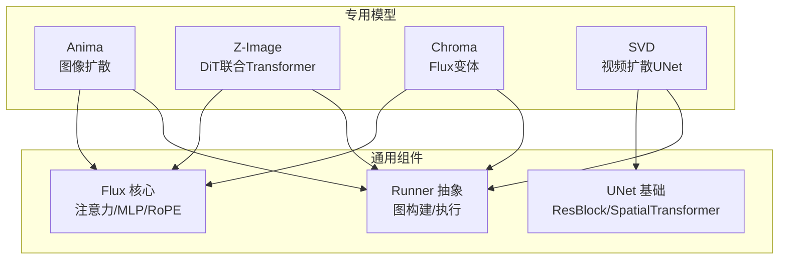
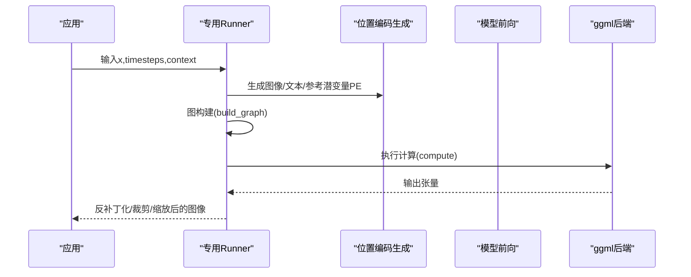
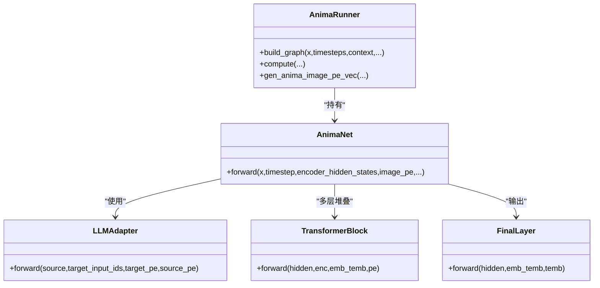
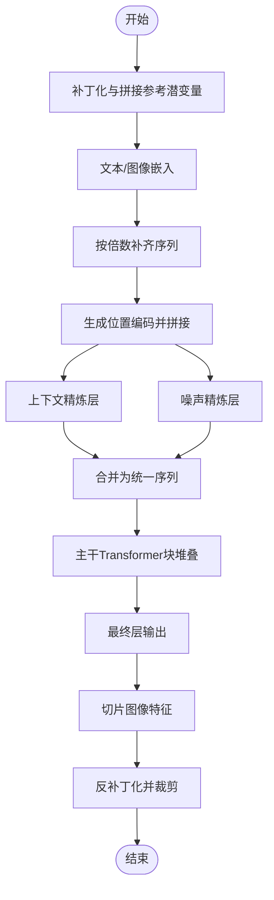
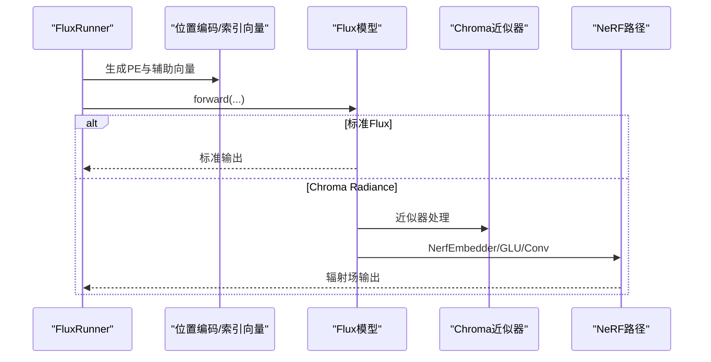
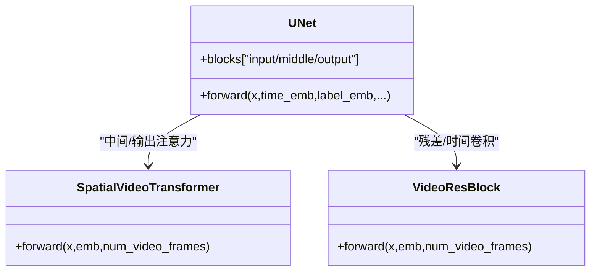
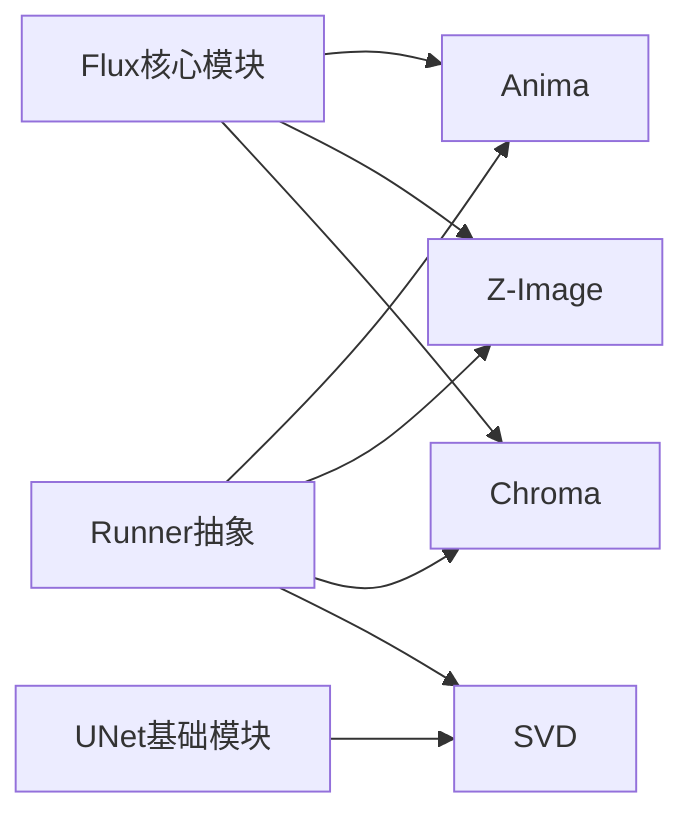

# 专用模型优化

<cite>
**本文引用的文件**   
- [src/anima.hpp](file://src/anima.hpp)
- [src/z_image.hpp](file://src/z_image.hpp)
- [src/flux.hpp](file://src/flux.hpp)
- [src/unet.hpp](file://src/unet.hpp)
- [docs/ovis_image.md](file://docs/ovis_image.md)
- [docs/chroma.md](file://docs/chroma.md)
- [docs/chroma_radiance.md](file://docs/chroma_radiance.md)
- [docs/svd.md](file://docs/svd.md)
- [docs/lora.md](file://docs/lora.md)
- [docs/performance.md](file://docs/performance.md)
</cite>

## 目录
1. [简介](#简介)
2. [项目结构](#项目结构)
3. [核心组件](#核心组件)
4. [架构总览](#架构总览)
5. [详细组件分析](#详细组件分析)
6. [依赖关系分析](#依赖关系分析)
7. [性能考量](#性能考量)
8. [故障排查指南](#故障排查指南)
9. [结论](#结论)
10. [附录](#附录)

## 简介
本文件聚焦于专用模型的“专用性”与“优化策略”，围绕以下模型展开：Anima（基于Flux的图像扩散）、Z-Image（联合DiT/Transformer架构）、Chroma（Flux变体，支持近似器与NeRF辐射场路径）以及SVD（视频扩散UNet）。我们将从用途、架构特点、参数化方式、推理图构建、内存与算力优化、LoRA适配、采样器选择、应用场景与注意事项等方面进行系统化说明，并给出可操作的最佳实践与配置要点。

## 项目结构
该仓库以模块化方式组织，核心模型以独立头文件实现，推理执行通过统一的Runner封装，参数化与权重加载由通用块与ggml后端驱动。专用模型分布如下：
- Anima：图像扩散，基于Flux风格的Transformer块与LLM适配器
- Z-Image：DiT风格联合注意力与FFN，支持上下文精炼与位置编码
- Chroma：Flux扩展，包含近似器与NeRF路径，支持不同版本与参数集
- SVD：视频扩散UNet，具备时空注意力与时间维度处理

图表来源
- [src/anima.hpp:418-513](file://src/anima.hpp#L418-L513)
- [src/z_image.hpp:283-456](file://src/z_image.hpp#L283-L456)
- [src/flux.hpp:763-1171](file://src/flux.hpp#L763-L1171)
- [src/unet.hpp:1-399](file://src/unet.hpp#L1-L399)

章节来源
- [src/anima.hpp:1-687](file://src/anima.hpp#L1-L687)
- [src/z_image.hpp:1-632](file://src/z_image.hpp#L1-L632)
- [src/flux.hpp:1-200](file://src/flux.hpp#L1-L200)
- [src/unet.hpp:1-399](file://src/unet.hpp#L1-L399)

## 核心组件
- AnimaRunner/AnimaNet：负责Anima模型的前向计算、位置编码生成、LLM适配器融合、图像补丁化与反补丁化。
- ZImageRunner/ZImageModel：负责Z-Image的DiT式前向、文本与图像序列对齐、位置编码拼接与最终层输出。
- FluxRunner/Flux：负责Flux/Chroma的统一前向，支持不同版本（含Chroma Radiance），并提供近似器与NeRF路径。
- UNet/SpatialTransformer：SVD等视频扩散的基础UNet结构，包含时空注意力与时间维度处理。

章节来源
- [src/anima.hpp:515-683](file://src/anima.hpp#L515-L683)
- [src/z_image.hpp:458-549](file://src/z_image.hpp#L458-L549)
- [src/flux.hpp:1174-1573](file://src/flux.hpp#L1174-L1573)
- [src/unet.hpp:200-399](file://src/unet.hpp#L200-L399)

## 架构总览
专用模型在本项目中采用“Runner + 模型块”的分层设计：
- Runner层：统一图构建、张量搬运、位置编码生成、输入预处理与后处理
- 模型层：按模型特性定制的前向逻辑（如Anima的LLMAdapter、Z-Image的噪声/上下文精炼、Chroma的近似器与NeRF）
- 通用层：注意力、RMSNorm、MLP、RoPE等基础模块复用

图表来源
- [src/anima.hpp:605-682](file://src/anima.hpp#L605-L682)
- [src/z_image.hpp:484-549](file://src/z_image.hpp#L484-L549)
- [src/flux.hpp:1174-1573](file://src/flux.hpp#L1174-L1573)

## 详细组件分析

### Anima（图像扩散）
- 特殊用途：面向图像扩散，结合文本编码与图像潜空间，引入LLM适配器以增强跨模态交互。
- 架构特点：
  - 使用XEmbedder、TimestepEmbedder、AdaLayerNormZero/AdaLayerNorm等模块
  - 自注意力采用RMSNorm归一化与RoPE位置编码
  - 引入LLMAdapter，将外部LLM隐藏状态映射到目标维度并参与交叉注意力
- 参数化方式：
  - 通过Runner解析权重字典，自动推断层数并初始化网络
  - 支持动态生成图像位置编码（多维theta与NTK因子）
- 推理流程：
  - 将输入图像补丁化，拼接掩码通道
  - 生成图像位置编码与LLM适配器的Q/K位置编码
  - 多层Transformer块（自注意力/交叉注意力/MLP）堆叠
  - 最终层线性映射并反补丁化

图表来源
- [src/anima.hpp:418-513](file://src/anima.hpp#L418-L513)
- [src/anima.hpp:515-683](file://src/anima.hpp#L515-L683)

章节来源
- [src/anima.hpp:23-513](file://src/anima.hpp#L23-L513)

### Z-Image（DiT联合Transformer）
- 特殊用途：将文本与图像序列统一建模，先进行上下文/噪声精炼，再进行主干Transformer块，最后输出图像重建。
- 架构特点：
  - JointAttention（多KV头）、FeedForward（SwiGLU/近似激活）
  - JointTransformerBlock支持AdaLN调制与门控残差
  - FinalLayer对特征进行AdaLN调制后线性投影
- 参数化方式：
  - 通过ZImageParams配置隐藏维度、层数、头数、FFN比例、QK归一化等
  - 支持序列对齐（按倍数补齐）与位置编码拼接
- 推理流程：
  - 图像潜变量补丁化，可拼接参考潜变量
  - 文本经嵌入与RMSNorm，拼接到PE中
  - 上下文/噪声精炼层分别作用于文本与图像
  - 主干Transformer块堆叠，最终切片出图像部分并反补丁化

图表来源
- [src/z_image.hpp:417-455](file://src/z_image.hpp#L417-L455)
- [src/z_image.hpp:484-549](file://src/z_image.hpp#L484-L549)

章节来源
- [src/z_image.hpp:263-456](file://src/z_image.hpp#L263-L456)

### Chroma（Flux变体）
- 特殊用途：在Flux基础上扩展，支持近似器（ChromaApproximator）与NeRF辐射场路径（Chroma Radiance），以更低显存占用或更丰富的几何感知能力运行。
- 架构特点：
  - 近似器：多层RMSNorm + MLP嵌入，残差堆叠
  - NeRF路径：NerfEmbedder + NerfGLUBlock（参数生成）+ NerfFinalLayer/Conv
  - Runner根据版本选择不同前向路径
- 参数化方式：
  - 通过FluxParams与ChromaRadianceParams控制Patch大小、隐层维度、NeRF深度与频率等
- 推理流程：
  - Runner生成位置编码与索引/变换向量
  - 根据版本选择标准Flux路径或Chroma Radiance路径
  - 支持参考潜变量与跳层控制（用于加速/质量权衡）

图表来源
- [src/flux.hpp:580-779](file://src/flux.hpp#L580-L779)
- [src/flux.hpp:1174-1573](file://src/flux.hpp#L1174-L1573)

章节来源
- [src/flux.hpp:726-761](file://src/flux.hpp#L726-L761)
- [src/flux.hpp:580-702](file://src/flux.hpp#L580-L702)

### SVD（视频扩散UNet）
- 特殊用途：视频扩散，具备时间维度的注意力与卷积处理，适合长时序视频去噪与生成。
- 架构特点：
  - SpatialVideoTransformer：在空间注意力基础上引入时间维度
  - VideoResBlock：在时间上进行特征传播
  - UNet整体结构：输入/中间/输出块，配合上采样/下采样
- 参数化方式：
  - 依据版本设置in_channels/out_channels/context_dim等
  - 时间注意力开关与深度配置随版本变化
- 推理流程：
  - 时间嵌入与标签嵌入
  - 输入块堆叠与下采样
  - 中间块（含时间注意力）
  - 输出块与上采样
  - 最终输出（通常为4通道）

图表来源
- [src/unet.hpp:200-399](file://src/unet.hpp#L200-L399)

章节来源
- [src/unet.hpp:1-399](file://src/unet.hpp#L1-L399)

## 依赖关系分析
- Anima/Z-Image/Chroma均依赖Flux核心模块（注意力、RoPE、RMSNorm、MLP等）
- SVD依赖UNet基础模块（ResBlock、SpatialTransformer/VideoResBlock）
- Runner层统一调度后端执行与图构建，避免各模型重复实现

图表来源
- [src/flux.hpp:1-200](file://src/flux.hpp#L1-L200)
- [src/unet.hpp:1-399](file://src/unet.hpp#L1-L399)
- [src/anima.hpp:515-683](file://src/anima.hpp#L515-L683)
- [src/z_image.hpp:458-549](file://src/z_image.hpp#L458-L549)
- [src/flux.hpp:1174-1573](file://src/flux.hpp#L1174-L1573)

章节来源
- [src/flux.hpp:1-200](file://src/flux.hpp#L1-L200)
- [src/unet.hpp:1-399](file://src/unet.hpp#L1-L399)

## 性能考量
- 内存管理
  - 使用Runner的图构建与后端执行，减少CPU/GPU间数据拷贝
  - 对大分辨率输入进行补丁化与按需补齐，降低序列长度峰值
  - 参考潜变量拼接时注意显存上限，必要时截断或降采样
- 采样器选择
  - 针对Chroma示例文档推荐使用特定采样方法；其他模型可按默认采样器测试
  - 在低显存设备上优先考虑较小步数与CFG抑制
- LoRA适配
  - 通过通用LoRA模块与模型Runner接口集成，按需加载权重并融合
  - 注意LoRA矩阵维度与主模型维度匹配，避免形状不一致
- 后端与量化
  - 不同后端（CUDA/Vulkan/Metal等）对精度与稳定性有影响，必要时启用更高精度内核
  - 量化（如Q8_0）可显著节省显存，但需关注数值稳定性与NaN问题

章节来源
- [docs/chroma.md:1-34](file://docs/chroma.md#L1-L34)
- [docs/lora.md](file://docs/lora.md)
- [docs/performance.md](file://docs/performance.md)

## 故障排查指南
- NaN或数值异常
  - 检查量化类型与后端兼容性，必要时切换为更高精度内核
  - 调整注意力缩放因子或禁用某些归一化以缓解不稳定
- 显存不足
  - 降低分辨率或批大小；对长序列进行截断/补齐
  - 关闭不必要的位置编码或精炼层
- 权重加载失败
  - 确认权重命名前缀与Runner期望一致；检查张量存储映射
  - 对外部模型（如Ovis-Image）确保文本编码器与VAE权重齐全

章节来源
- [src/z_image.hpp:116-124](file://src/z_image.hpp#L116-L124)
- [src/anima.hpp:556-558](file://src/anima.hpp#L556-L558)
- [docs/ovis_image.md:1-19](file://docs/ovis_image.md#L1-L19)

## 结论
专用模型在本项目中通过统一Runner与通用模块实现了高内聚、低耦合的架构设计。Anima强调跨模态LLM适配，Z-Image强调文本与图像的联合DiT建模，Chroma在Flux基础上引入近似器与NeRF路径以平衡性能与效果，SVD则专注于视频扩散的时间维度处理。结合合理的内存管理、采样器选择与LoRA适配，可在不同硬件条件下获得稳定且高效的推理体验。

## 附录
- 应用场景与注意事项
  - Anima：适用于需要LLM语义引导的图像生成任务，注意文本长度与位置编码范围
  - Z-Image：适用于图文混合生成与图像修复/编辑，注意序列对齐与PE拼接
  - Chroma：适用于低显存环境或需要几何感知的生成任务，可选择标准或NeRF路径
  - SVD：适用于视频去噪与生成，注意时间维度与批大小的平衡
- 配置参数与最佳实践
  - 通过Runner构造函数传入张量存储映射与版本标识，自动完成参数初始化
  - 使用文档中的示例命令作为起点，逐步调整CFG、采样步数与后端参数
  - 在部署前进行基准测试，记录不同配置下的吞吐与延迟

章节来源
- [docs/ovis_image.md:1-19](file://docs/ovis_image.md#L1-L19)
- [docs/chroma.md:1-34](file://docs/chroma.md#L1-L34)
- [docs/chroma_radiance.md](file://docs/chroma_radiance.md)
- [docs/svd.md](file://docs/svd.md)