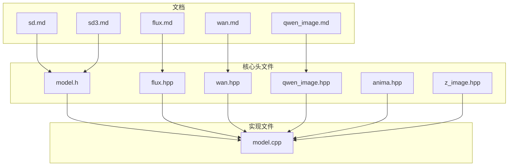
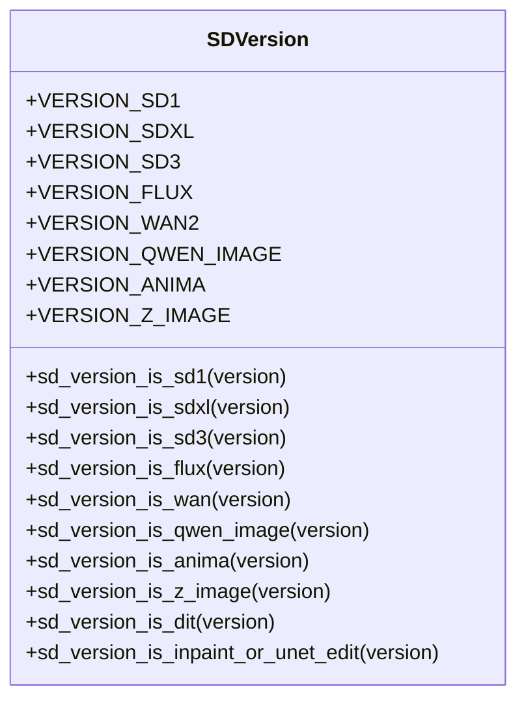
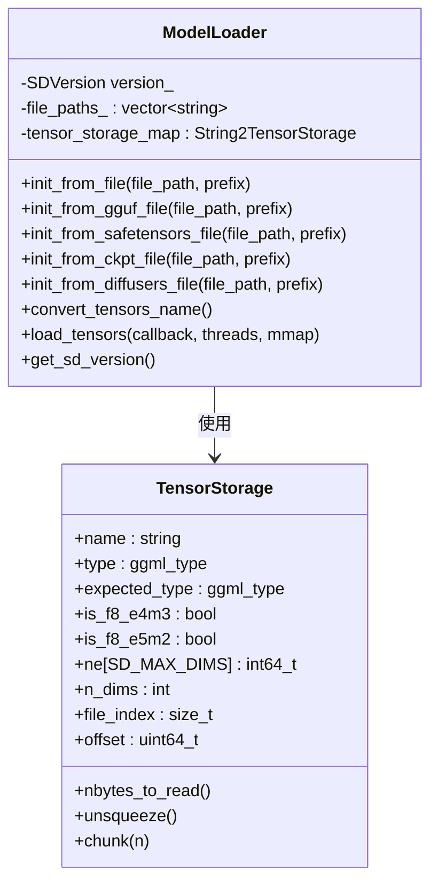
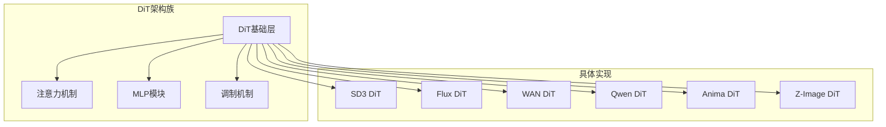
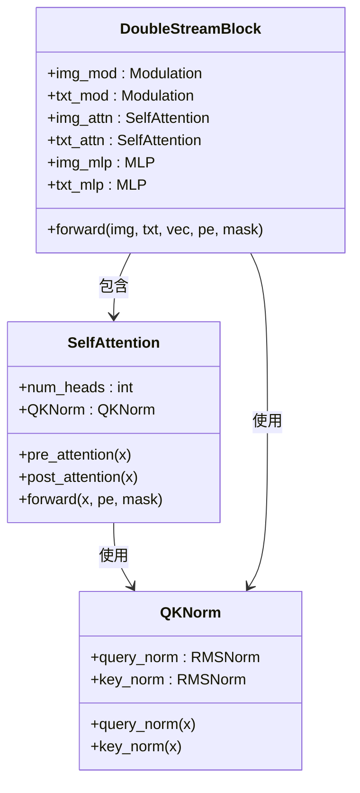
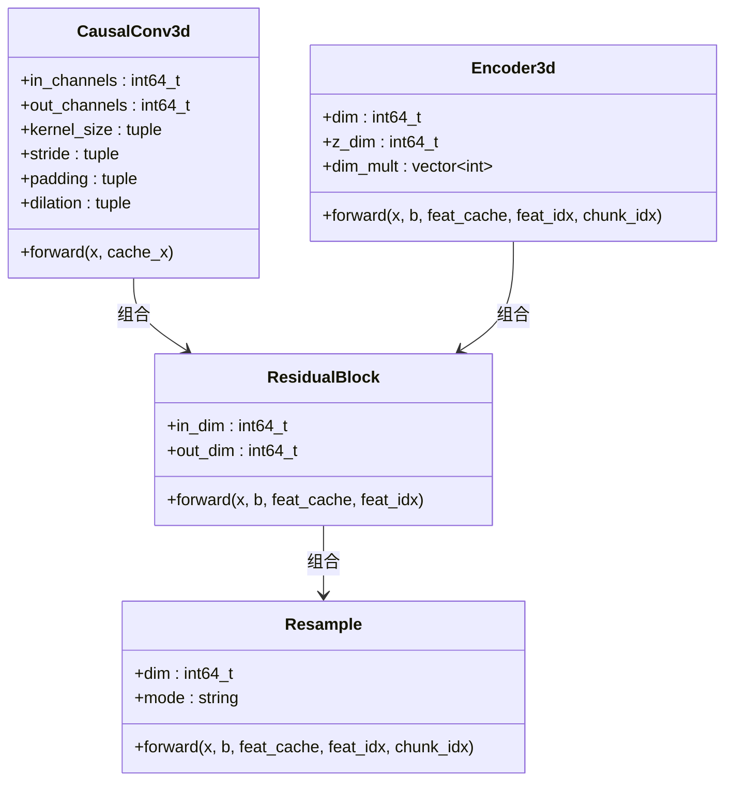
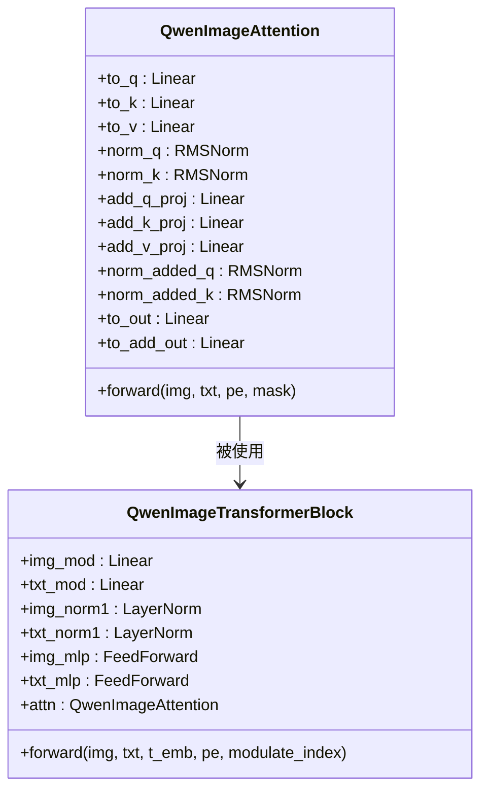
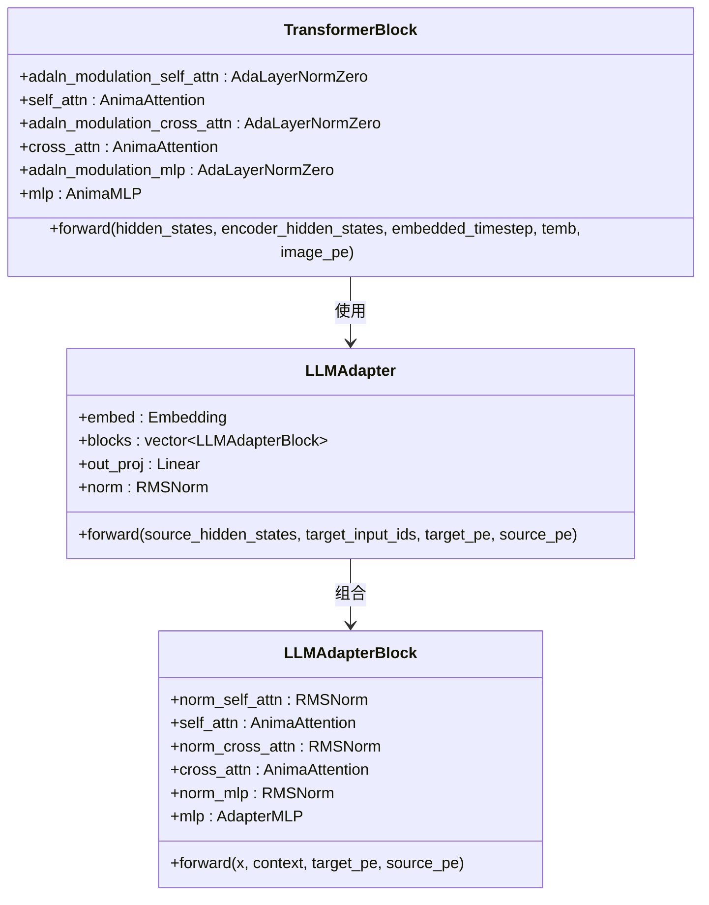
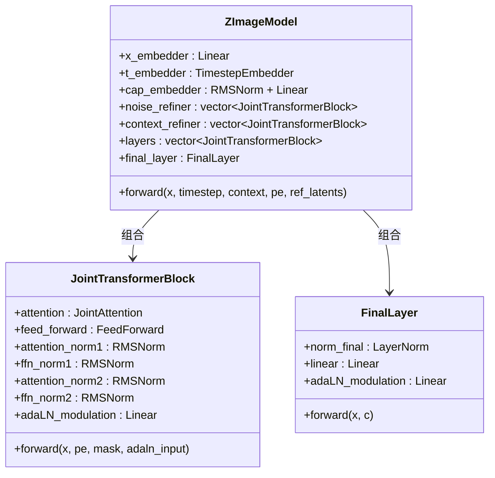
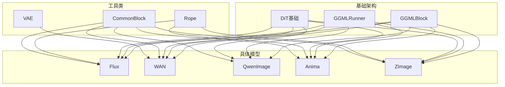

# 模型特定优化

<cite>
**本文档引用的文件**
- [model.h](file://src/model.h)
- [model.cpp](file://src/model.cpp)
- [flux.hpp](file://src/flux.hpp)
- [wan.hpp](file://src/wan.hpp)
- [qwen_image.hpp](file://src/qwen_image.hpp)
- [anima.hpp](file://src/anima.hpp)
- [z_image.hpp](file://src/z_image.hpp)
- [sd.md](file://docs/sd.md)
- [sd3.md](file://docs/sd3.md)
- [flux.md](file://docs/flux.md)
- [wan.md](file://docs/wan.md)
- [qwen_image.md](file://docs/qwen_image.md)
</cite>

## 目录
1. [简介](#简介)
2. [项目结构](#项目结构)
3. [核心组件](#核心组件)
4. [架构概览](#架构概览)
5. [详细组件分析](#详细组件分析)
6. [依赖关系分析](#依赖关系分析)
7. [性能考虑](#性能考虑)
8. [故障排除指南](#故障排除指南)
9. [结论](#结论)
10. [附录](#附录)

## 简介

本文件系统性地分析了该稳定扩散代码库中不同模型版本的特定优化策略。重点涵盖SD1.x、SDXL、SD3、Flux、Wan、Qwen等架构在图像生成中的差异化优化，包括缩放因子、参数化方式、注意力机制等关键差异，并提供针对特定模型的最佳实践和性能优化建议。

## 项目结构

该项目采用模块化设计，按功能分层组织：

**图表来源**
- [model.h:1-346](file://src/model.h#L1-L346)
- [flux.hpp:1-800](file://src/flux.hpp#L1-L800)
- [wan.hpp:1-800](file://src/wan.hpp#L1-L800)

**章节来源**
- [model.h:1-346](file://src/model.h#L1-L346)
- [model.cpp:1-800](file://src/model.cpp#L1-L800)

## 核心组件

### 模型版本枚举与分类

代码库通过统一的SDVersion枚举管理所有支持的模型版本：

**图表来源**
- [model.h:23-175](file://src/model.h#L23-L175)

### 模型加载器架构

ModelLoader提供统一的模型加载接口，支持多种格式：

**图表来源**
- [model.h:292-343](file://src/model.h#L292-L343)
- [model.h:181-286](file://src/model.h#L181-L286)

**章节来源**
- [model.h:1-346](file://src/model.h#L1-L346)
- [model.cpp:361-407](file://src/model.cpp#L361-L407)

## 架构概览

### 统一的DiT架构族

所有现代扩散模型（SD3、Flux、WAN、Qwen、Anima、Z-Image）都基于DiT（Diffusion Transformer）架构：

**图表来源**
- [flux.hpp:763-800](file://src/flux.hpp#L763-L800)
- [wan.hpp:1-800](file://src/wan.hpp#L1-L800)
- [qwen_image.hpp:364-473](file://src/qwen_image.hpp#L364-L473)
- [anima.hpp:418-513](file://src/anima.hpp#L418-L513)
- [z_image.hpp:283-456](file://src/z_image.hpp#L283-L456)

## 详细组件分析

### Flux模型优化

Flux作为最新的DiT架构，在多个方面进行了深度优化：

#### 注意力机制优化

**图表来源**
- [flux.hpp:85-137](file://src/flux.hpp#L85-L137)
- [flux.hpp:252-414](file://src/flux.hpp#L252-L414)

#### 参数化优化策略

Flux采用了多种参数化优化技术：

1. **RMSNorm替代LayerNorm**：提供更好的数值稳定性
2. **双流注意力机制**：图像和文本特征分离处理
3. **调制机制**：通过条件向量动态调整网络参数

**章节来源**
- [flux.hpp:1-800](file://src/flux.hpp#L1-L800)

### WAN模型优化

WAN专注于视频生成，引入了独特的时空卷积：

#### 3D因果卷积

**图表来源**
- [wan.hpp:18-83](file://src/wan.hpp#L18-L83)
- [wan.hpp:339-405](file://src/wan.hpp#L339-L405)
- [wan.hpp:589-750](file://src/wan.hpp#L589-L750)

#### 视频生成优化

WAN模型的核心创新在于其时空一致性保持机制：

1. **缓存机制**：通过`feat_cache`维护时间维度上的连续性
2. **因果卷积**：确保信息只能向前传播，避免时间泄漏
3. **自适应重采样**：根据输入动态调整空间和时间分辨率

**章节来源**
- [wan.hpp:1-800](file://src/wan.hpp#L1-L800)

### Qwen Image优化

Qwen Image结合了视觉生成和多模态理解能力：

#### 双模态注意力

**图表来源**
- [qwen_image.hpp:64-189](file://src/qwen_image.hpp#L64-L189)
- [qwen_image.hpp:191-315](file://src/qwen_image.hpp#L191-L315)

#### 零条件调制

Qwen Image实现了独特的零条件调制机制：

1. **条件分离**：通过`zero_cond_t`参数区分不同类型的条件输入
2. **动态调制**：根据调制索引动态选择不同的调制参数
3. **参考图像集成**：支持多帧参考图像的条件生成

**章节来源**
- [qwen_image.hpp:1-700](file://src/qwen_image.hpp#L1-L700)

### Anima优化

Anima专注于高质量图像生成，采用了先进的适配器机制：

#### LLM适配器

**图表来源**
- [anima.hpp:259-296](file://src/anima.hpp#L259-L296)
- [anima.hpp:347-390](file://src/anima.hpp#L347-L390)

#### 多尺度位置编码

Anima实现了复杂的多尺度位置编码系统：

1. **ND-RoPE**：支持三维空间的位置编码
2. **NTK缩放**：通过可扩展的比例因子处理长序列
3. **自适应外推**：支持超出训练范围的输入尺寸

**章节来源**
- [anima.hpp:1-687](file://src/anima.hpp#L1-L687)

### Z-Image优化

Z-Image专注于高分辨率图像生成，采用了创新的上下文处理机制：

#### 上下文精炼器

**图表来源**
- [z_image.hpp:151-232](file://src/z_image.hpp#L151-L232)
- [z_image.hpp:283-347](file://src/z_image.hpp#L283-L347)

#### 序列对齐优化

Z-Image通过以下机制优化长序列处理：

1. **序列对齐**：使用`SEQ_MULTI_OF`确保序列长度对齐到32的倍数
2. **上下文精炼**：通过专门的精炼层提升上下文质量
3. **动态填充**：根据需要动态添加填充令牌

**章节来源**
- [z_image.hpp:1-632](file://src/z_image.hpp#L1-L632)

## 依赖关系分析

### 模型间继承关系

**图表来源**
- [flux.hpp:1-800](file://src/flux.hpp#L1-L800)
- [wan.hpp:1-800](file://src/wan.hpp#L1-L800)
- [qwen_image.hpp:1-700](file://src/qwen_image.hpp#L1-L700)
- [anima.hpp:1-687](file://src/anima.hpp#L1-L687)
- [z_image.hpp:1-632](file://src/z_image.hpp#L1-L632)

**章节来源**
- [model.h:1-346](file://src/model.h#L1-L346)

## 性能考虑

### 内存优化策略

1. **量化支持**：支持F32、F16、Q8_0等多种精度格式
2. **CPU卸载**：可选的参数CPU卸载功能
3. **批处理优化**：针对不同模型的最优批处理大小

### 计算效率优化

1. **Flash Attention**：在支持的后端启用Flash Attention加速
2. **内核融合**：减少内存访问和计算开销
3. **缓存机制**：WAN模型的时间缓存机制

## 故障排除指南

### 常见问题诊断

1. **模型加载失败**：检查文件格式和路径正确性
2. **内存不足**：尝试降低分辨率或使用量化模型
3. **精度问题**：调整量化类型或精度设置

**章节来源**
- [model.cpp:361-407](file://src/model.cpp#L361-L407)

## 结论

该代码库展现了现代扩散模型的最新技术进展，通过统一的DiT架构和模块化设计，实现了跨模型的高效复用。每个模型都在特定领域进行了深度优化：Flux专注于推理效率，WAN专注于视频生成，Qwen Image专注于多模态理解，Anima专注于高质量图像生成，Z-Image专注于高分辨率生成。

## 附录

### 模型选择指南

| 模型 | 适用场景 | 性能特点 | 内存需求 |
|------|----------|----------|----------|
| SD1.x | 传统图像生成 | 稳定可靠 | 低 |
| SDXL | 高质量图像 | 优秀细节 | 中等 |
| SD3 | 现代化生成 | 快速推理 | 中等 |
| Flux | 实时应用 | 极致速度 | 低 |
| WAN | 视频生成 | 时空一致性 | 高 |
| Qwen | 多模态生成 | 文本理解 | 中等 |
| Anima | 高质量图像 | 最佳质量 | 中等 |
| Z-Image | 高分辨率 | 超高分辨率 | 高 |

### 配置最佳实践

1. **Flux模型**：推荐使用Q8_0量化，步数设置为4-10
2. **WAN模型**：根据视频长度调整缓存大小，使用因果卷积
3. **Qwen模型**：启用零条件调制，合理设置参考图像数量
4. **Anima模型**：使用NTK缩放，调整位置编码参数
5. **Z-Image模型**：确保序列长度对齐，使用上下文精炼器