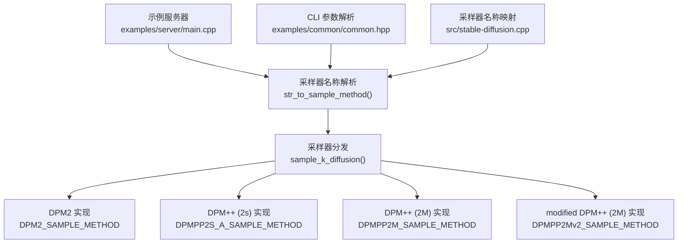
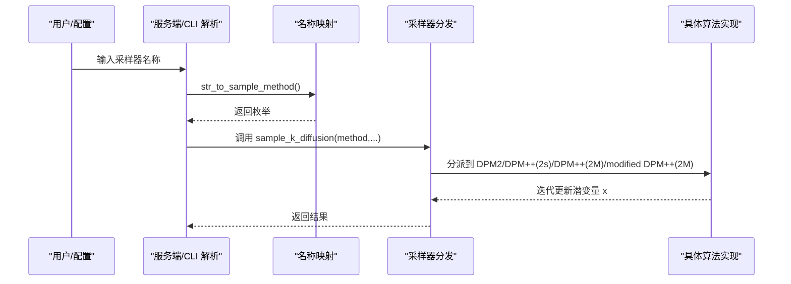
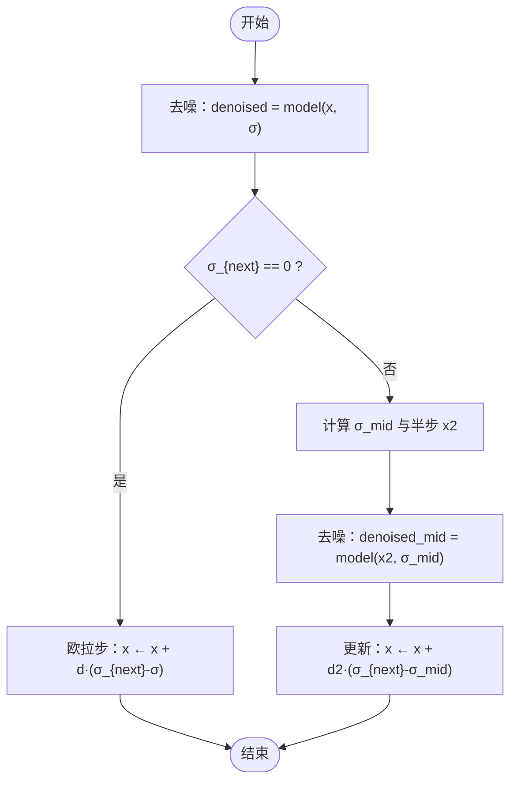
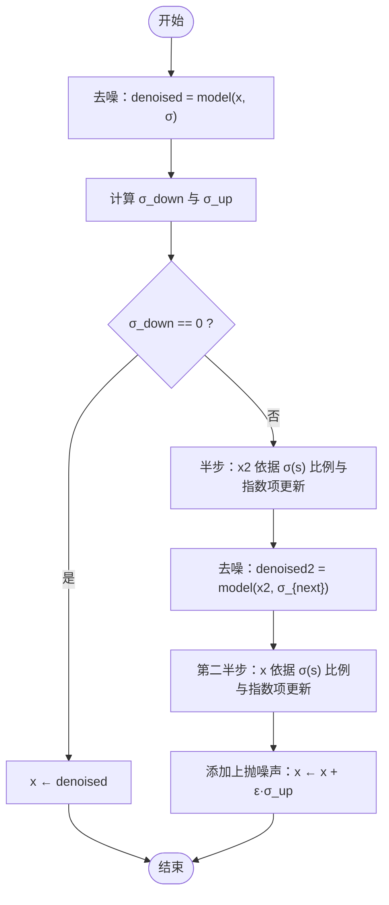
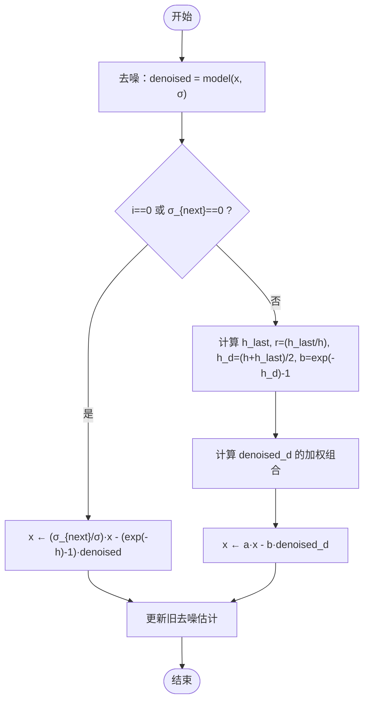
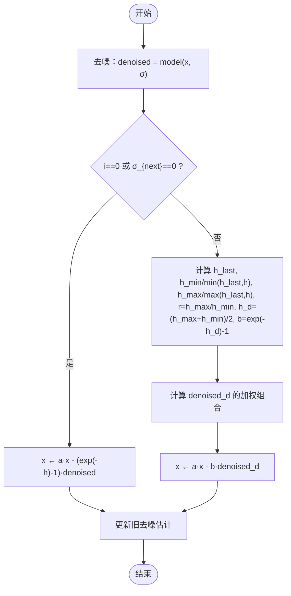
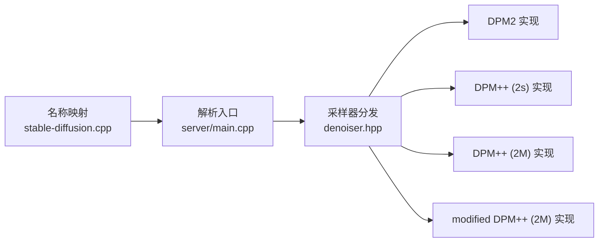

# DPM系列采样器

<cite>
**本文引用的文件**
- [src/denoiser.hpp](file://src/denoiser.hpp)
- [src/stable-diffusion.cpp](file://src/stable-diffusion.cpp)
- [examples/server/main.cpp](file://examples/server/main.cpp)
- [examples/common/common.hpp](file://examples/common/common.hpp)
</cite>

## 目录
1. [引言](#引言)
2. [项目结构](#项目结构)
3. [核心组件](#核心组件)
4. [架构总览](#架构总览)
5. [详细组件分析](#详细组件分析)
6. [依赖关系分析](#依赖关系分析)
7. [性能考量](#性能考量)
8. [故障排查指南](#故障排查指南)
9. [结论](#结论)
10. [附录](#附录)

## 引言
本文件系统性梳理并解析本仓库中DPM系列采样器的实现与使用方式，覆盖以下算法：
- DPM2（二阶单步）
- DPM++ (2s)（二阶多步/祖先步）
- DPM++ (2M)（二阶多步/多步记忆）
- modified DPM++ (2M)（二阶多步/自适应时间步长）

我们将从算法原理、实现细节、数据流、控制流、参数与调优建议、性能与适用场景等方面进行说明，并给出可操作的实践建议。

## 项目结构
与DPM采样器直接相关的代码主要集中在以下位置：
- 采样器实现：src/denoiser.hpp 中的 sample_k_diffusion 函数内按样本方法分发
- 算法名称映射：src/stable-diffusion.cpp 中 sample_method_to_str 与 str_to_sample_method
- 命令行/服务端入口：examples/server/main.cpp 提供采样器名称到枚举的映射
- CLI参数解析：examples/common/common.hpp 中对采样器参数的解析与校验

**图表来源**
- [examples/server/main.cpp:902-928](file://examples/server/main.cpp#L902-L928)
- [src/stable-diffusion.cpp:2850-2881](file://src/stable-diffusion.cpp#L2850-L2881)
- [src/denoiser.hpp:764-1143](file://src/denoiser.hpp#L764-L1143)
- [examples/common/common.hpp:1280-1304](file://examples/common/common.hpp#L1280-L1304)

**章节来源**
- [src/denoiser.hpp:764-1143](file://src/denoiser.hpp#L764-L1143)
- [src/stable-diffusion.cpp:60-74](file://src/stable-diffusion.cpp#L60-L74)
- [src/stable-diffusion.cpp:2850-2881](file://src/stable-diffusion.cpp#L2850-L2881)
- [examples/server/main.cpp:902-928](file://examples/server/main.cpp#L902-L928)
- [examples/common/common.hpp:1280-1304](file://examples/common/common.hpp#L1280-L1304)

## 核心组件
- 采样器方法枚举与名称映射
  - 名称到枚举：str_to_sample_method
  - 枚举到名称：sd_sample_method_name
  - 支持的采样器字符串列表：sample_method_to_str
- 采样器分发与执行
  - sample_k_diffusion 按枚举值进入不同分支，分别实现 DPM2、DPM++ (2s)、DPM++ (2M)、modified DPM++ (2M) 等
- 入口与配置
  - 服务端与CLI通过名称解析将用户输入映射为具体采样器
  - CLI参数解析对采样器名称进行校验

**章节来源**
- [src/stable-diffusion.cpp:2850-2881](file://src/stable-diffusion.cpp#L2850-L2881)
- [src/stable-diffusion.cpp:60-74](file://src/stable-diffusion.cpp#L60-L74)
- [examples/server/main.cpp:902-928](file://examples/server/main.cpp#L902-L928)
- [examples/common/common.hpp:1280-1304](file://examples/common/common.hpp#L1280-L1304)

## 架构总览
下图展示了从用户输入到采样器执行的关键路径，以及各DPM变体在实现上的差异点。

**图表来源**
- [examples/server/main.cpp:902-928](file://examples/server/main.cpp#L902-L928)
- [src/stable-diffusion.cpp:2850-2881](file://src/stable-diffusion.cpp#L2850-L2881)
- [src/denoiser.hpp:764-1143](file://src/denoiser.hpp#L764-L1143)

## 详细组件分析

### DPM2（二阶单步）
- 设计思想
  - 使用当前步的去噪估计与中间步估计构造二阶更新，提升收敛速度与稳定性
  - 在σ末尾或σ非零时采用不同策略：末尾用欧拉步，否则用中点估计
- 关键步骤
  - 计算 d = (x - denoised) / σ
  - 若下一σ为0：x ← x + d × (σ_next - σ)
  - 否则：计算中点 σ_mid = sqrt(σ·σ_next)，先走半步得到 x2，再用 x2 去噪得到 d2，最终 x ← x + d2 × (σ_next - σ_mid)
- 复杂度与开销
  - 每步一次模型前向 + 一次额外的中间点前向
  - 内存：复制 x 与 d 的张量副本
- 适用场景
  - 需要快速且稳定的二阶收敛；对噪声调度较为平滑的场景效果良好

**图表来源**
- [src/denoiser.hpp:923-978](file://src/denoiser.hpp#L923-L978)

**章节来源**
- [src/denoiser.hpp:923-978](file://src/denoiser.hpp#L923-L978)

### DPM++ (2s)（二阶多步/祖先步）
- 设计思想
  - 引入“祖先步”策略，在每步根据当前噪声水平选择合适的下降与上抛噪声组合，以更好地匹配扩散过程的时间尺度
  - 通过 t = -log(σ) 将噪声调度映射到时间轴，进行半步与全步的组合
- 关键步骤
  - 计算 σ_down 与 σ_up，若 σ_down==0 则直接令 x 等于去噪结果
  - 否则：先做半步（基于 σ(s) 的比例与指数项），再进行第二半步，最后添加上抛噪声
- 复杂度与开销
  - 每步两次模型前向（含中间点）+ 随机噪声注入
  - 内存：复制 x 与噪声张量
- 适用场景
  - 对时间尺度敏感的任务；在噪声调度较密或非均匀时表现更佳

**图表来源**
- [src/denoiser.hpp:981-1050](file://src/denoiser.hpp#L981-L1050)

**章节来源**
- [src/denoiser.hpp:981-1050](file://src/denoiser.hpp#L981-L1050)

### DPM++ (2M)（二阶多步/多步记忆）
- 设计思想
  - 利用历史去噪估计的加权线性组合，形成二阶多步记忆更新
  - 在边界与非边界步采用不同公式，保证数值稳定与收敛性
- 关键步骤
  - 定义 t = -log(σ)，h = t_next - t，a = σ_{next}/σ
  - 边界情况（首步或 σ_{next}=0）：x ← a·x - b·denoised（其中 b=exp(-h)-1）
  - 非边界情况：引入 r = h_last/h，计算 denoised_d 的加权组合，再更新 x ← a·x - b·denoised_d
  - 更新旧去噪估计
- 复杂度与开销
  - 每步一次模型前向 + 历史去噪估计的线性组合
  - 内存：维护旧去噪张量副本
- 适用场景
  - 需要更强的多步记忆与更稳健的收敛；适合复杂噪声调度与高保真生成

**图表来源**
- [src/denoiser.hpp:1051-1091](file://src/denoiser.hpp#L1051-L1091)

**章节来源**
- [src/denoiser.hpp:1051-1091](file://src/denoiser.hpp#L1051-L1091)

### modified DPM++ (2M)（二阶多步/自适应时间步长）
- 设计思想
  - 在 DPM++ (2M) 的基础上，采用 h_min/h_max 的自适应时间步长组合，进一步提升在非均匀时间网格下的稳定性与精度
- 关键步骤
  - 与 DPM++ (2M) 类似，但在非边界步使用 h_min、h_max、h_d 与 r = h_max/h_min，计算更精细的 denoised_d 加权组合
- 复杂度与开销
  - 与 DPM++ (2M) 相近，但涉及更多标量运算与条件判断
- 适用场景
  - 对时间步长变化敏感的任务；追求更高的数值稳定性与视觉质量

**图表来源**
- [src/denoiser.hpp:1093-1137](file://src/denoiser.hpp#L1093-L1137)

**章节来源**
- [src/denoiser.hpp:1093-1137](file://src/denoiser.hpp#L1093-L1137)

### 采样器名称与入口
- 名称映射
  - 字符串到枚举：支持 "dpm2"、"dpm++2s_a"、"dpm++2m"、"dpm++2mv2"
  - 枚举到字符串：用于日志与输出
- 入口解析
  - 服务端与CLI均通过 str_to_sample_method 将用户输入标准化为内部枚举
  - CLI参数解析对无效采样器名称进行报错提示

**章节来源**
- [src/stable-diffusion.cpp:2850-2881](file://src/stable-diffusion.cpp#L2850-L2881)
- [src/stable-diffusion.cpp:60-74](file://src/stable-diffusion.cpp#L60-L74)
- [examples/server/main.cpp:902-928](file://examples/server/main.cpp#L902-L928)
- [examples/common/common.hpp:1280-1304](file://examples/common/common.hpp#L1280-L1304)

## 依赖关系分析
- 组件耦合
  - sample_k_diffusion 是采样器的统一入口，按枚举分发到各算法实现
  - 各算法实现共享相同的模型调用接口与张量操作模式
- 外部依赖
  - 随机数生成：噪声注入依赖 RNG 接口
  - 数值函数：log、exp、sqrt 等基础数学函数
- 可能的循环依赖
  - 当前实现中采样器逻辑位于 denoiser.hpp，名称映射与入口位于 stable-diffusion.cpp，无明显循环

**图表来源**
- [src/stable-diffusion.cpp:2850-2881](file://src/stable-diffusion.cpp#L2850-L2881)
- [examples/server/main.cpp:902-928](file://examples/server/main.cpp#L902-L928)
- [src/denoiser.hpp:764-1143](file://src/denoiser.hpp#L764-L1143)

**章节来源**
- [src/stable-diffusion.cpp:2850-2881](file://src/stable-diffusion.cpp#L2850-L2881)
- [examples/server/main.cpp:902-928](file://examples/server/main.cpp#L902-L928)
- [src/denoiser.hpp:764-1143](file://src/denoiser.hpp#L764-L1143)

## 性能考量
- 计算复杂度
  - DPM2：每步约 1~2 次模型前向
  - DPM++ (2s)：每步约 2 次模型前向 + 随机噪声
  - DPM++ (2M) / modified DPM++ (2M)：每步约 1 次模型前向 + 历史去噪估计的线性组合
- 内存占用
  - 各算法均会复制张量（如 x、d、x2、噪声等），内存峰值与张量大小成正比
- 并行化与后端
  - 本项目支持多种后端（CPU/CUDA/Metal/Vulkan/OpenCL/SYCL），采样器实现通过 ggml 张量接口运行于所选后端
- 调度器影响
  - 不同噪声调度（离散/指数/Karras 等）会影响各算法的收敛速度与稳定性，需结合任务选择合适调度器

[本节为通用性能讨论，不直接分析具体文件]

## 故障排查指南
- 常见问题
  - 采样器名称无效：确认名称是否在支持列表中（"dpm2"、"dpm++2s_a"、"dpm++2m"、"dpm++2mv2"）
  - 模型前向失败：当 denoised 返回空指针时采样器会提前返回错误
  - 随机数相关异常：噪声注入依赖 RNG，若 RNG 初始化失败可能导致采样不稳定
- 定位建议
  - 检查名称映射与解析流程
  - 检查每步 denoised 是否成功
  - 检查后端初始化与资源分配
- 相关实现位置
  - 名称映射与解析：stable-diffusion.cpp、server/main.cpp、common.hpp
  - 采样器执行与错误返回：denoiser.hpp

**章节来源**
- [src/stable-diffusion.cpp:2850-2881](file://src/stable-diffusion.cpp#L2850-L2881)
- [examples/server/main.cpp:902-928](file://examples/server/main.cpp#L902-L928)
- [examples/common/common.hpp:1280-1304](file://examples/common/common.hpp#L1280-L1304)
- [src/denoiser.hpp:764-1143](file://src/denoiser.hpp#L764-L1143)

## 结论
本仓库中的 DPM 系列采样器实现了从二阶单步到二阶多步记忆的完整谱系，覆盖了主流的高效采样策略。通过统一的名称映射与入口分发，用户可以灵活切换不同算法；同时，算法实现遵循一致的数据流与张量操作模式，便于扩展与维护。在实际应用中，应结合任务特性与噪声调度选择合适的算法，并关注随机数与后端性能对整体耗时的影响。

[本节为总结性内容，不直接分析具体文件]

## 附录

### 算法对比与适用场景速览
- DPM2：二阶单步，适合快速稳定收敛；在平滑噪声调度下表现良好
- DPM++ (2s)：祖先步策略，适合非均匀时间尺度；在噪声密度变化较大时更稳健
- DPM++ (2M)：多步记忆，适合高保真生成；在复杂调度下更稳定
- modified DPM++ (2M)：自适应时间步长，进一步提升在非均匀网格下的稳定性

**章节来源**
- [src/denoiser.hpp:923-1137](file://src/denoiser.hpp#L923-L1137)