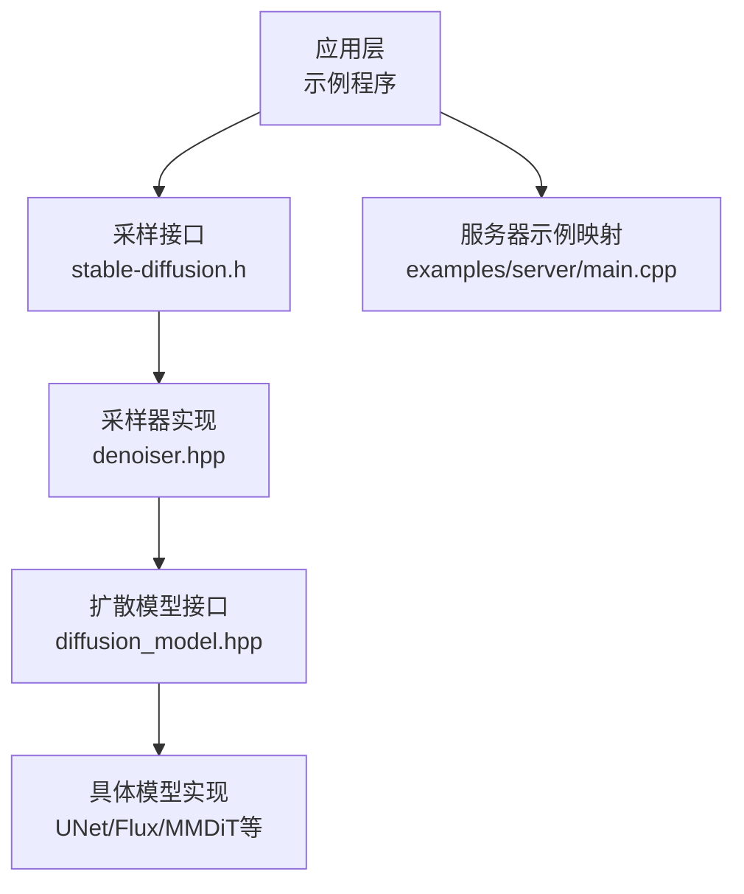
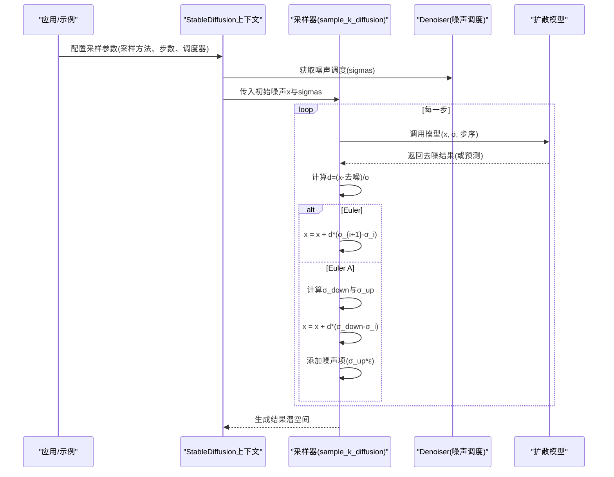
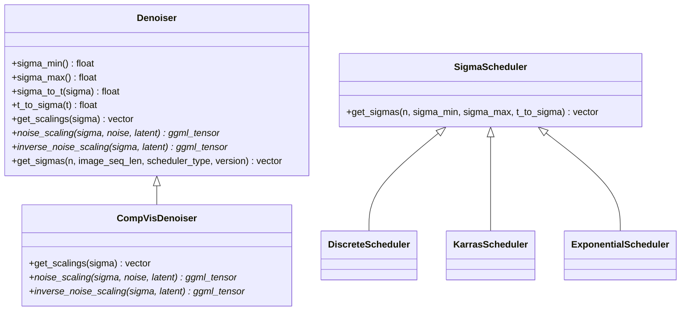
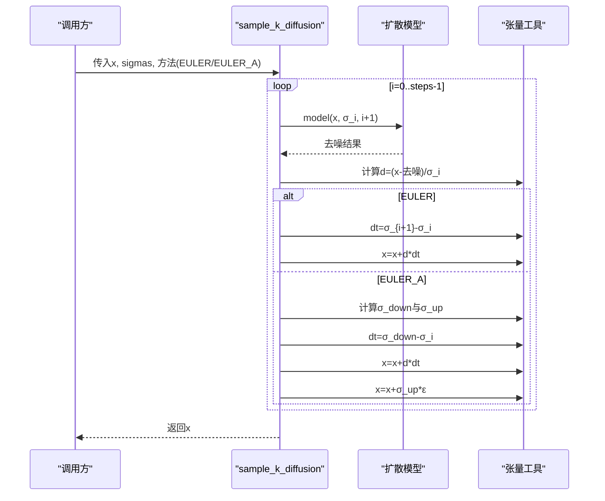
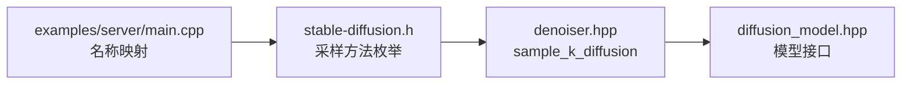

# Euler系列采样器

<cite>
**本文档引用的文件**
- [stable-diffusion.cpp](file://src/stable-diffusion.cpp)
- [denoiser.hpp](file://src/denoiser.hpp)
- [stable-diffusion.h](file://include/stable-diffusion.h)
- [main.cpp](file://examples/server/main.cpp)
- [diffusion_model.hpp](file://src/diffusion_model.hpp)
</cite>

## 目录
1. [简介](#简介)
2. [项目结构](#项目结构)
3. [核心组件](#核心组件)
4. [架构概览](#架构概览)
5. [详细组件分析](#详细组件分析)
6. [依赖关系分析](#依赖关系分析)
7. [性能考量](#性能考量)
8. [故障排除指南](#故障排除指南)
9. [结论](#结论)

## 简介
本文件系统性阐述Euler系列采样器（Euler与Euler A）在扩散模型中的数学原理、实现细节与工程实践。内容涵盖：
- 欧拉方法在扩散模型反向过程中的数值积分思想
- Euler与Euler A算法的数学推导与代码实现映射
- 步长选择策略、收敛性与稳定性分析
- 不同场景下的配置建议与使用示例
- 与其他采样器的对比与适用性权衡

## 项目结构
Euler系列采样器位于扩散管线的采样阶段，通过统一的采样接口调用具体算法实现。关键文件与职责如下：
- 采样接口与枚举定义：include/stable-diffusion.h
- 采样器实现与调度器：src/denoiser.hpp
- 服务器示例中采样器名称映射：examples/server/main.cpp
- 扩散模型抽象：src/diffusion_model.hpp
- 主程序上下文与默认采样器选择：src/stable-diffusion.cpp

**图表来源**
- [stable-diffusion.h:38-54](file://include/stable-diffusion.h#L38-L54)
- [denoiser.hpp:764-866](file://src/denoiser.hpp#L764-L866)
- [diffusion_model.hpp:29-44](file://src/diffusion_model.hpp#L29-L44)
- [main.cpp:902-928](file://examples/server/main.cpp#L902-L928)

**章节来源**
- [stable-diffusion.h:38-54](file://include/stable-diffusion.h#L38-L54)
- [denoiser.hpp:764-866](file://src/denoiser.hpp#L764-L866)
- [diffusion_model.hpp:29-44](file://src/diffusion_model.hpp#L29-L44)
- [main.cpp:902-928](file://examples/server/main.cpp#L902-L928)

## 核心组件
- 采样方法枚举：定义了EULER_SAMPLE_METHOD与EULER_A_SAMPLE_METHOD等采样器类型
- 采样函数：sample_k_diffusion根据传入的采样方法执行对应算法
- Euler与Euler A实现：分别对应无sigma波动的欧拉步与带噪声的欧拉-安斯蒂尔步
- 扩散模型接口：为采样器提供模型预测输出（去噪结果）

关键实现位置：
- 采样方法枚举与名称映射：include/stable-diffusion.h
- Euler/Euler A算法主体：src/denoiser.hpp 中 sample_k_diffusion 的 EULER_SAMPLE_METHOD 与 EULER_A_SAMPLE_METHOD 分支
- 服务器示例中名称到枚举的转换：examples/server/main.cpp

**章节来源**
- [stable-diffusion.h:38-54](file://include/stable-diffusion.h#L38-L54)
- [denoiser.hpp:764-866](file://src/denoiser.hpp#L764-L866)
- [main.cpp:902-928](file://examples/server/main.cpp#L902-L928)

## 架构概览
Euler系列采样器在扩散模型生成流程中的位置如下：

**图表来源**
- [denoiser.hpp:764-866](file://src/denoiser.hpp#L764-L866)
- [denoiser.hpp:779-829](file://src/denoiser.hpp#L779-L829)
- [denoiser.hpp:831-866](file://src/denoiser.hpp#L831-L866)

## 详细组件分析

### 数学原理与离散化
扩散模型的反向SDE可写为：
$$
\mathrm{d}x = \frac{x - D_\theta(x; \sigma)}{\sigma}\mathrm{d}t
$$
其中 $D_\theta$ 是去噪器（U-Net等）的预测输出，$x$ 为当前潜变量，$\sigma$ 为噪声强度。

- Euler方法采用前向欧拉离散化：
  $$
  x_{i+1} = x_i + d_i (\sigma_{i+1} - \sigma_i),\quad d_i = \frac{x_i - D_\theta(x_i; \sigma_i)}{\sigma_i}
  $$

- Euler A（安斯蒂尔步）在欧拉步基础上引入噪声：
  $$
  \sigma_{\text{down}} = \sqrt{\sigma_{i+1}^2 - \sigma_{\text{up}}^2},\quad x = x + d(\sigma_{\text{down}} - \sigma_i),\quad x = x + \sigma_{\text{up}}\cdot\mathcal{N}
  $$

上述公式直接映射到实现中的张量逐元素计算与步长更新逻辑。

**章节来源**
- [denoiser.hpp:764-866](file://src/denoiser.hpp#L764-L866)
- [denoiser.hpp:779-829](file://src/denoiser.hpp#L779-L829)
- [denoiser.hpp:831-866](file://src/denoiser.hpp#L831-L866)

### Euler算法实现要点
- 输入输出：每次迭代接收当前潜变量 $x$ 与当前噪声强度 $\sigma_i$，返回去噪结果并计算 $d_i$
- 步长：使用相邻两步的噪声强度差作为时间步长增量 $\Delta t = \sigma_{i+1} - \sigma_i$
- 更新：逐元素执行 $x = x + d \cdot \Delta t$

优势：
- 实现简单，计算开销低
- 在较粗步数下仍能保持一定质量

局限：
- 一阶精度，数值误差随步数累积
- 对强非线性或快速变化区域可能不稳定

**章节来源**
- [denoiser.hpp:831-866](file://src/denoiser.hpp#L831-L866)

### Euler A算法实现要点
- 噪声调度：基于当前与下一步噪声强度计算 $\sigma_{\text{up}}$ 与 $\sigma_{\text{down}}$
- 步长：使用 $\sigma_{\text{down}} - \sigma_i$ 作为步长
- 噪声注入：在每步末尾添加高斯噪声项以维持概率流一致性

优势：
- 更接近连续概率流，通常在相同步数下获得更佳视觉质量
- 对噪声调度敏感度更高，适合精细控制

局限：
- 计算略复杂，需额外噪声采样
- 参数（如η）影响最终结果，需要调优

**章节来源**
- [denoiser.hpp:779-829](file://src/denoiser.hpp#L779-L829)

### 采样器选择与配置
- 名称映射：服务器示例支持多种输入别名（如 "euler a"、"k_euler_a"），均映射到 EULER_A_SAMPLE_METHOD；"euler"、"k_euler" 映射到 EULER_SAMPLE_METHOD
- 默认采样器：主程序中存在默认采样方法的选择逻辑
- 参数要点：采样步数、噪声调度器类型、是否启用噪声注入（Euler A的η相关参数）

使用建议：
- 低步数（如10-20）：优先Euler A，提升质量
- 高步数（>30）：Euler亦可接受，追求速度时可选Euler
- 复杂场景（如高分辨率、强约束）：Euler A通常更稳健

**章节来源**
- [main.cpp:902-928](file://examples/server/main.cpp#L902-L928)
- [stable-diffusion.cpp:59-74](file://src/stable-diffusion.cpp#L59-L74)

### 与其它采样器的对比
- Euler vs Euler A：前者更快但质量略逊；后者更贴近连续流，质量更好
- 与Heun/DPM类：二阶或多阶方法通常更稳定且质量更高，但计算成本更高
- 与DDIM/DDPM：属于不同的反演框架，Euler系列更偏向连续SDE视角

注意：本仓库中Euler/Euler A实现为一阶显式欧拉法族，不包含二阶或更高阶的多步方法。

**章节来源**
- [denoiser.hpp:867-922](file://src/denoiser.hpp#L867-L922)
- [denoiser.hpp:923-978](file://src/denoiser.hpp#L923-L978)

### 稳定性与收敛性分析
- 稳定性：Euler A通过引入σ_up与σ_down的分解，使步长与噪声协调整体更稳定；Euler在步长较大时可能出现发散或振荡
- 收敛性：一阶欧拉法局部截断误差与步长成正比；在噪声调度合理的情况下，全局误差受步数与调度器分布影响
- 实践建议：当出现伪影或过度噪声时，尝试减少步数、降低η（Euler A）或切换到更高阶方法

**章节来源**
- [denoiser.hpp:779-829](file://src/denoiser.hpp#L779-L829)
- [denoiser.hpp:831-866](file://src/denoiser.hpp#L831-L866)

### 代码级类图（采样器与调度）

**图表来源**
- [denoiser.hpp:480-544](file://src/denoiser.hpp#L480-L544)
- [denoiser.hpp:22-65](file://src/denoiser.hpp#L22-L65)
- [denoiser.hpp:275-296](file://src/denoiser.hpp#L275-L296)

### Euler/Euler A调用序列

**图表来源**
- [denoiser.hpp:764-866](file://src/denoiser.hpp#L764-L866)
- [denoiser.hpp:779-829](file://src/denoiser.hpp#L779-L829)
- [denoiser.hpp:831-866](file://src/denoiser.hpp#L831-L866)

## 依赖关系分析
- 采样器依赖于Denoiser提供的噪声调度（sigmas）与缩放因子
- 采样器通过统一的模型接口获取去噪输出
- 示例程序负责将用户输入映射到采样方法枚举

**图表来源**
- [stable-diffusion.h:38-54](file://include/stable-diffusion.h#L38-L54)
- [denoiser.hpp:764-866](file://src/denoiser.hpp#L764-L866)
- [diffusion_model.hpp:29-44](file://src/diffusion_model.hpp#L29-L44)
- [main.cpp:902-928](file://examples/server/main.cpp#L902-L928)

**章节来源**
- [stable-diffusion.h:38-54](file://include/stable-diffusion.h#L38-L54)
- [denoiser.hpp:764-866](file://src/denoiser.hpp#L764-L866)
- [diffusion_model.hpp:29-44](file://src/diffusion_model.hpp#L29-L44)
- [main.cpp:902-928](file://examples/server/main.cpp#L902-L928)

## 性能考量
- 计算复杂度：Euler/Euler A均为一阶方法，单步计算量小，整体与步数线性相关
- 内存访问：主要为张量逐元素操作，缓存友好
- 并行化：各元素独立，易于并行
- 速度权衡：在相同质量下，Euler通常更快；若追求质量，Euler A的额外噪声注入成本可接受

[本节为通用性能讨论，无需特定文件引用]

## 故障排除指南
常见问题与排查思路：
- 生成图像出现伪影或过曝
  - 检查采样步数是否过少；尝试增加步数或切换到Euler A
  - 若使用Euler A，适当降低η或减少σ_up
- 生成缓慢
  - 减少采样步数；优先Euler
  - 检查后端与线程设置（CPU/GPU）
- 结果不稳定
  - 切换到更高阶方法（如Heun/DPM类）或更精细的噪声调度器
  - 调整噪声调度器类型（如Karras/Exponential）

**章节来源**
- [denoiser.hpp:779-829](file://src/denoiser.hpp#L779-L829)
- [denoiser.hpp:831-866](file://src/denoiser.hpp#L831-L866)

## 结论
Euler系列采样器以简洁高效的欧拉法为核心，在扩散模型生成中提供了良好的平衡点：
- Euler适合对速度敏感的场景，实现简单、开销低
- Euler A在相同步数下通常提供更佳质量，适合对视觉效果要求较高的任务
- 实际使用中应结合步数、噪声调度器与具体模型版本进行综合调优，并在必要时考虑更高阶方法以进一步提升质量与稳定性