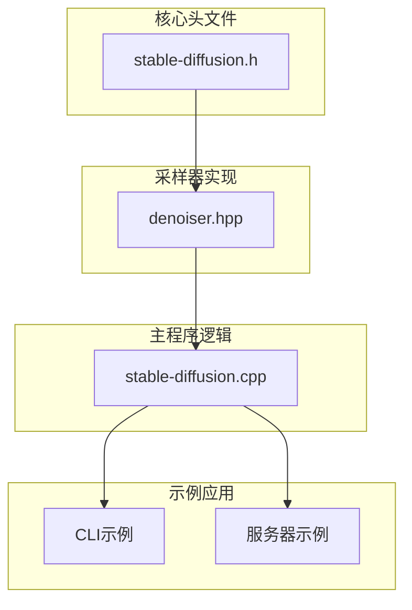
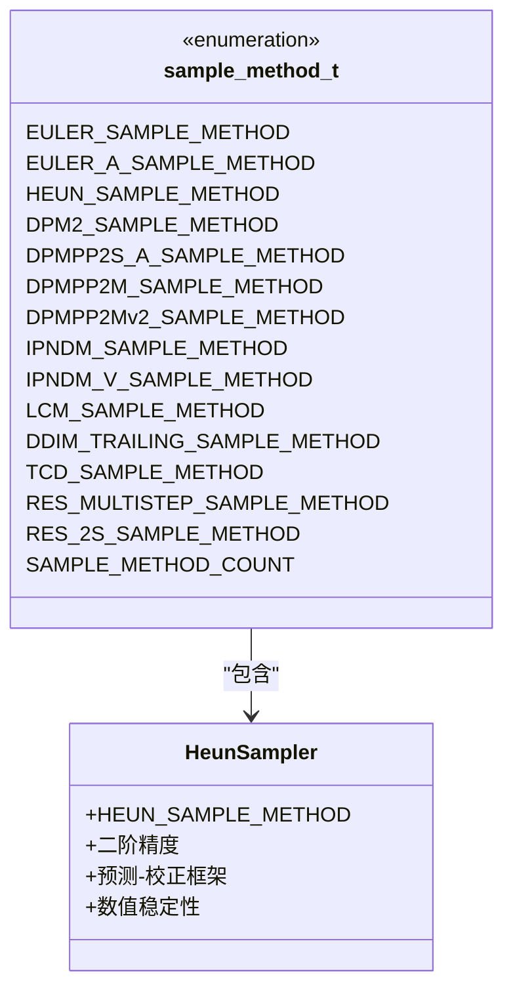
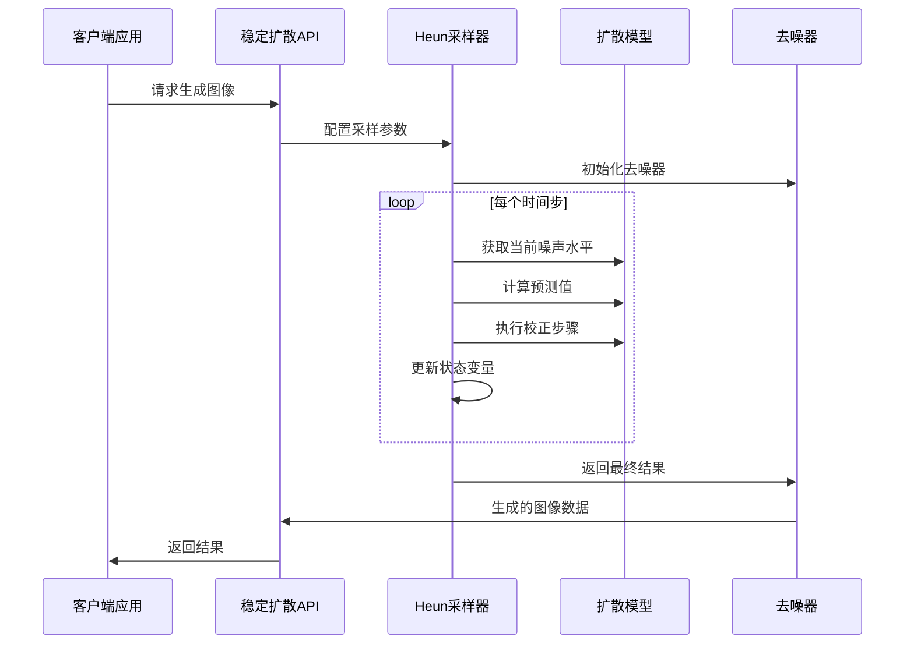
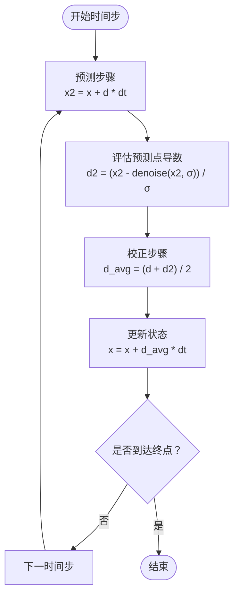
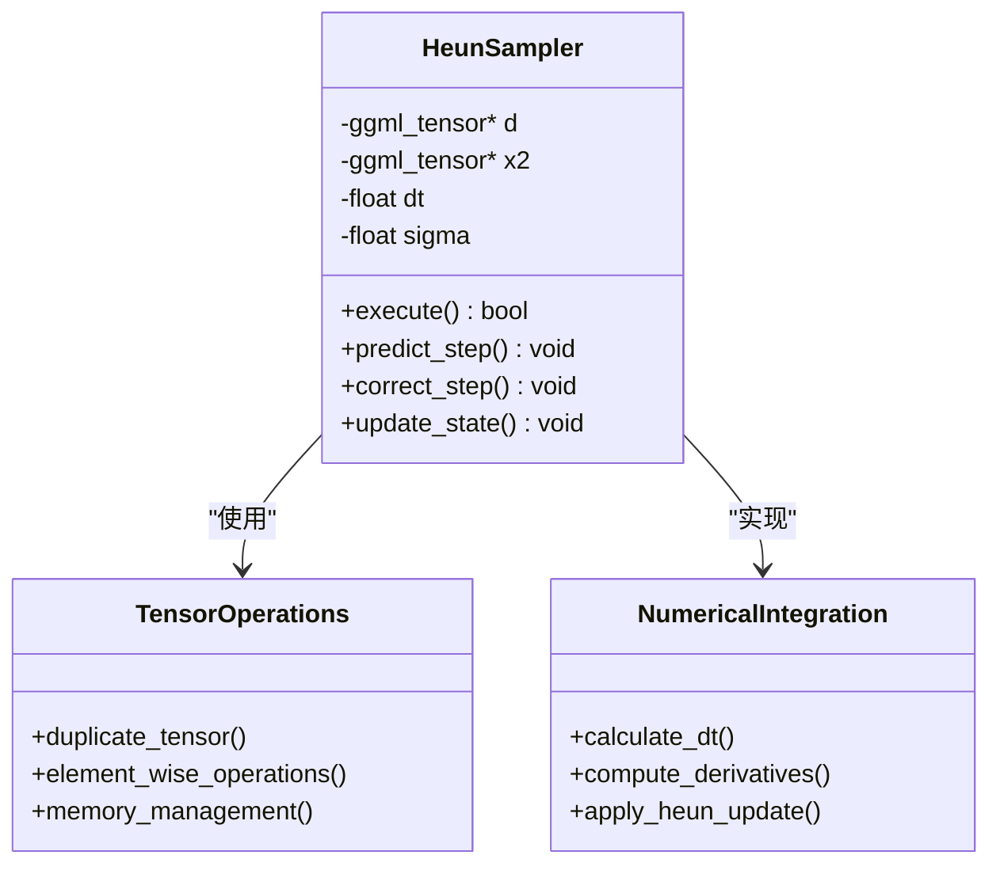
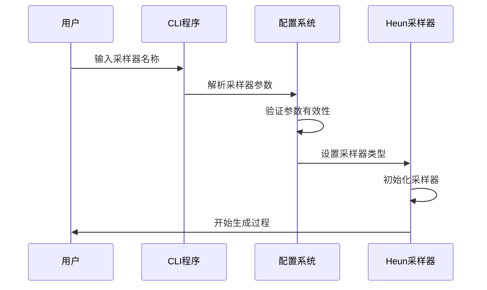
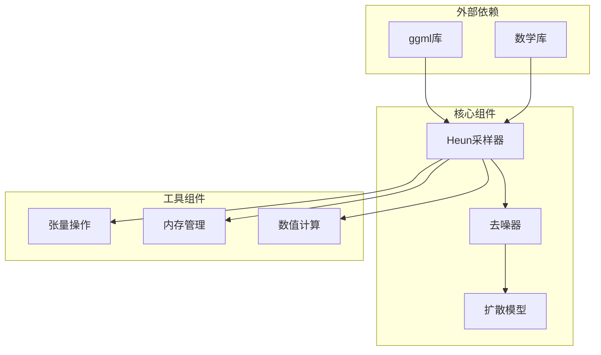

# Heun采样器

<cite>
**本文档引用的文件**
- [stable-diffusion.h](file://include/stable-diffusion.h)
- [denoiser.hpp](file://src/denoiser.hpp)
- [stable-diffusion.cpp](file://src/stable-diffusion.cpp)
- [main.cpp（CLI示例）](file://examples/cli/main.cpp)
- [main.cpp（服务器示例）](file://examples/server/main.cpp)
</cite>

## 目录
1. [简介](#简介)
2. [项目结构](#项目结构)
3. [核心组件](#核心组件)
4. [架构概览](#架构概览)
5. [详细组件分析](#详细组件分析)
6. [依赖关系分析](#依赖关系分析)
7. [性能考虑](#性能考虑)
8. [故障排除指南](#故障排除指南)
9. [结论](#结论)

## 简介

Heun采样器是扩散模型中的一种二阶龙格-库塔数值积分方法，在稳定扩散推理过程中提供比一阶欧拉方法更高的精度和稳定性。该实现基于Heun方法的预测-校正框架，通过两次函数评估来获得二阶精度的解。

在扩散模型的数学框架中，Heun方法通过以下步骤实现：
1. **预测步骤**：使用当前点的导数信息预测下一个点
2. **校正步骤**：计算预测点的导数，并对预测结果进行校正
3. **平均化处理**：将预测和校正结果进行加权平均

这种方法相比欧拉方法具有更好的数值稳定性，特别是在处理非线性扩散过程时能够提供更准确的解。

## 项目结构

该项目采用模块化的C++架构设计，Heun采样器作为扩散模型推理系统的核心组件之一，位于以下关键位置：

**图表来源**
- [stable-diffusion.h:38-54](file://include/stable-diffusion.h#L38-L54)
- [denoiser.hpp:867-922](file://src/denoiser.hpp#L867-L922)
- [stable-diffusion.cpp:103-154](file://src/stable-diffusion.cpp#L103-L154)

**章节来源**
- [stable-diffusion.h:1-423](file://include/stable-diffusion.h#L1-L423)
- [denoiser.hpp:867-1066](file://src/denoiser.hpp#L867-L1066)
- [stable-diffusion.cpp:103-200](file://src/stable-diffusion.cpp#L103-L200)

## 核心组件

### Heun采样器枚举定义

Heun采样器在项目中通过`HEUN_SAMPLE_METHOD`枚举标识，该枚举定义在采样方法枚举类型中：

**图表来源**
- [stable-diffusion.h:38-54](file://include/stable-diffusion.h#L38-L54)

### Heun采样器数学实现

Heun采样器的核心实现位于`denoiser.hpp`文件中，采用标准的Heun方法公式：

**章节来源**
- [stable-diffusion.h:38-54](file://include/stable-diffusion.h#L38-L54)
- [denoiser.hpp:867-922](file://src/denoiser.hpp#L867-L922)

## 架构概览

Heun采样器在整个扩散模型推理系统中的位置和作用：

**图表来源**
- [stable-diffusion.cpp:3310-3399](file://src/stable-diffusion.cpp#L3310-L3399)
- [denoiser.hpp:867-922](file://src/denoiser.hpp#L867-L922)

## 详细组件分析

### Heun方法的数学推导

Heun方法作为二阶龙格-库塔方法，其数学基础建立在以下公式之上：

#### 标准Heun步骤流程

**图表来源**
- [denoiser.hpp:890-920](file://src/denoiser.hpp#L890-L920)

#### 与欧拉方法的对比分析

| 特征 | 欧拉方法 | Heun方法 |
|------|----------|----------|
| **精度阶数** | 一阶 | 二阶 |
| **函数评估次数** | 1次 | 2次 |
| **计算复杂度** | O(1) | O(2) |
| **数值稳定性** | 较差 | 更好 |
| **收敛速度** | 线性 | 超线性 |
| **内存需求** | 低 | 中等 |

### Heun采样器实现细节

#### 关键数据结构

**图表来源**
- [denoiser.hpp:867-922](file://src/denoiser.hpp#L867-L922)

#### 参数配置选项

Heun采样器支持多种配置参数以适应不同的使用场景：

**章节来源**
- [denoiser.hpp:867-922](file://src/denoiser.hpp#L867-L922)
- [stable-diffusion.cpp:3310-3399](file://src/stable-diffusion.cpp#L3310-L3399)

### 实际使用示例

#### CLI应用程序中的Heun采样器使用

在命令行界面中，用户可以通过以下方式指定使用Heun采样器：

**图表来源**
- [main.cpp（CLI示例）:228-246](file://examples/cli/main.cpp#L228-L246)

#### 服务器应用程序中的集成

在Web服务器环境中，Heun采样器通过REST API接口提供服务：

**章节来源**
- [main.cpp（CLI示例）:228-246](file://examples/cli/main.cpp#L228-L246)
- [main.cpp（服务器示例）:902-928](file://examples/server/main.cpp#L902-L928)

### 算法稳定性分析

#### 数值稳定性特性

Heun采样器在扩散模型应用中的稳定性表现：

1. **收敛性质**：二阶收敛，误差随步长平方减小
2. **绝对稳定性**：在扩散过程的参数范围内保持稳定
3. **相对稳定性**：对初始条件变化不敏感
4. **长期行为**：在长时间积分中保持数值稳定

#### 收敛性证明要点

基于标准数值分析理论，Heun方法的收敛性可由以下条件保证：

- ** Lipschitz连续性**：扩散过程的漂移项满足Lipschitz条件
- **有界性**：噪声项和导数在定义域内有界
- **单调性**：时间步长选择保证数值稳定性

### 不同模型版本的适用性

#### 模型兼容性矩阵

| 模型类型 | Heun采样器适用性 | 注意事项 |
|----------|------------------|----------|
| **SD 1.x系列** | ✅ 推荐使用 | 标准扩散过程 |
| **SDXL** | ✅ 高度推荐 | 复杂多阶段过程 |
| **SD 2.x系列** | ✅ 可用 | 参数化差异 |
| **Flux系列** | ⚠️ 需要调整 | EDM参数化 |
| **SD3.x** | ⚠️ 实验性 | 新颖的扩散机制 |

#### 模型特定优化

针对不同模型版本，Heun采样器可能需要的调整：

**章节来源**
- [stable-diffusion.cpp:27-57](file://src/stable-diffusion.cpp#L27-L57)
- [stable-diffusion.cpp:3288-3308](file://src/stable-diffusion.cpp#L3288-L3308)

## 依赖关系分析

### 组件间依赖关系

**图表来源**
- [stable-diffusion.cpp:103-154](file://src/stable-diffusion.cpp#L103-L154)
- [denoiser.hpp:867-922](file://src/denoiser.hpp#L867-L922)

### 外部依赖分析

Heun采样器依赖于以下关键外部组件：

1. **ggml张量库**：提供高效的张量计算和内存管理
2. **数学库**：支持浮点运算和数值分析
3. **后端加速**：支持CUDA、Metal等硬件加速

**章节来源**
- [stable-diffusion.cpp:103-200](file://src/stable-diffusion.cpp#L103-L200)
- [denoiser.hpp:867-1066](file://src/denoiser.hpp#L867-L1066)

## 性能考虑

### 计算复杂度分析

Heun采样器的性能特征：

- **时间复杂度**：O(N × 2M)，其中N为样本数量，M为每步计算成本
- **空间复杂度**：O(N × D)，其中D为张量维度
- **内存带宽**：中等，主要消耗在张量复制和计算
- **并行效率**：高，适合GPU等并行架构

### 优化策略

1. **内存优化**：复用中间结果张量，减少内存分配
2. **计算优化**：利用向量化操作提高计算效率
3. **内存管理**：智能缓存机制减少重复计算
4. **硬件加速**：充分利用GPU并行计算能力

## 故障排除指南

### 常见问题及解决方案

#### 数值不稳定问题

**症状**：生成图像出现伪影或质量下降

**解决方案**：
1. 检查时间步长设置
2. 验证噪声调度器配置
3. 调整采样器参数

#### 内存不足问题

**症状**：运行时内存溢出错误

**解决方案**：
1. 减少批量大小
2. 降低图像分辨率
3. 启用内存优化选项

#### 性能问题

**症状**：生成速度过慢

**解决方案**：
1. 使用硬件加速后端
2. 调整并行度设置
3. 优化内存访问模式

**章节来源**
- [stable-diffusion.cpp:3310-3399](file://src/stable-diffusion.cpp#L3310-L3399)
- [denoiser.hpp:867-1066](file://src/denoiser.hpp#L867-L1066)

## 结论

Heun采样器作为扩散模型推理系统中的重要组件，提供了比传统欧拉方法更高的精度和稳定性。其二阶龙格-库塔实现通过预测-校正框架在保持数值稳定性的同时显著提升了生成质量。

### 主要优势

1. **高精度**：二阶收敛确保了更好的数值精度
2. **稳定性**：在扩散过程的复杂非线性条件下保持稳定
3. **通用性**：适用于多种扩散模型架构
4. **可扩展性**：良好的并行化特性和硬件加速支持

### 应用前景

随着扩散模型技术的不断发展，Heun采样器及其变体将继续在高质量图像生成领域发挥重要作用。未来的发展方向包括：

- 更高效的二阶方法
- 自适应步长控制
- 多尺度采样策略
- 硬件专用优化

通过深入理解Heun采样器的数学原理和实现细节，开发者可以更好地利用这一强大工具来构建高性能的扩散模型应用。