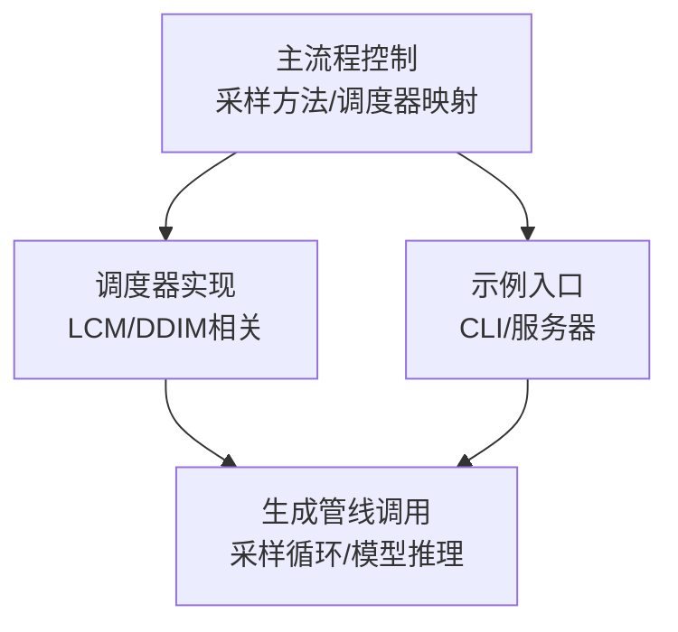
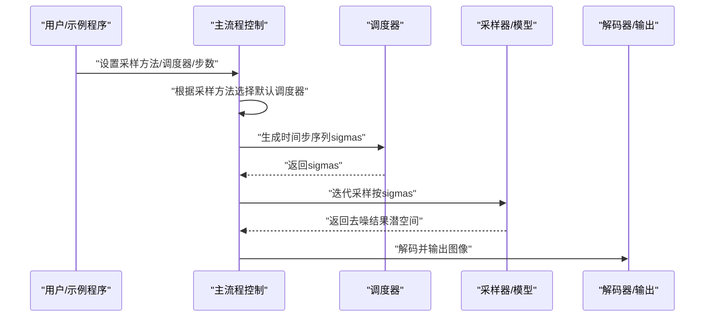
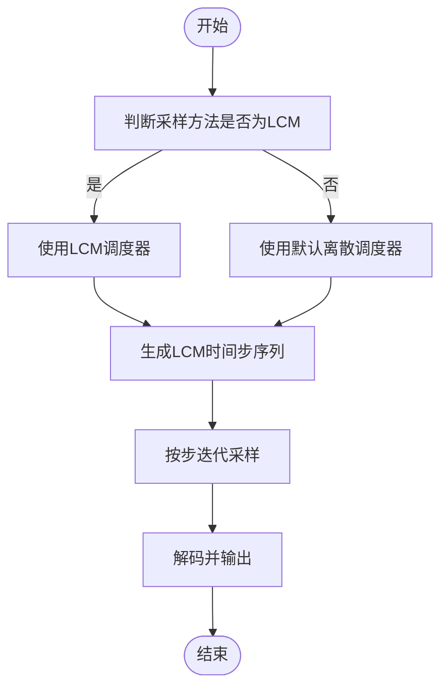
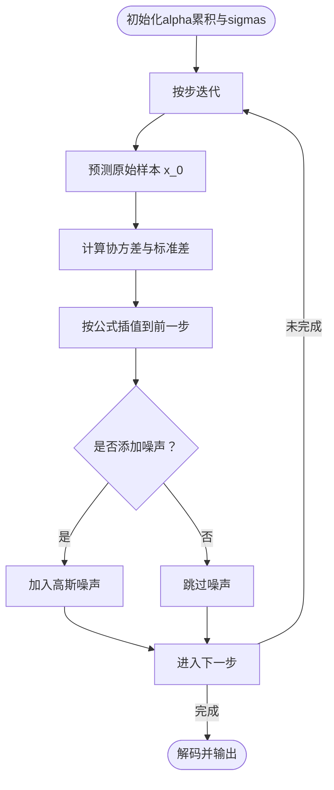
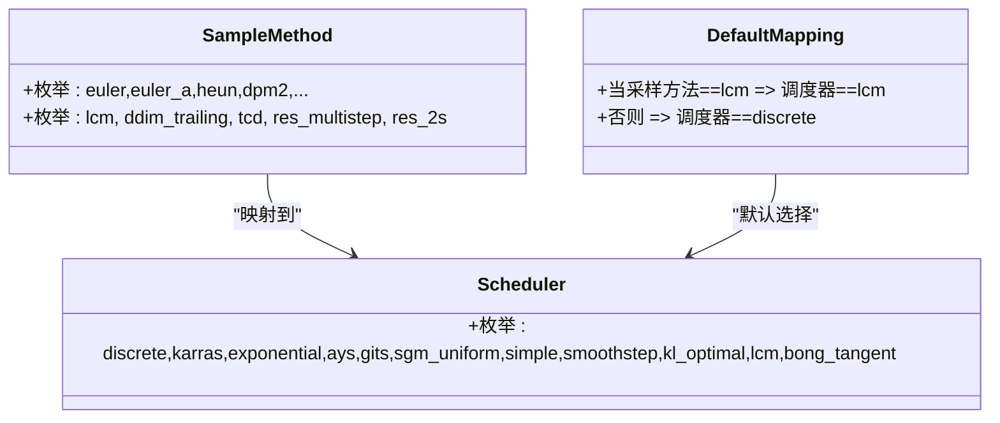
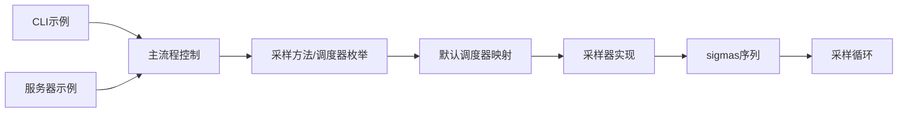

# LCM和DDIM采样器

<cite>
**本文引用的文件**
- [stable-diffusion.cpp](file://src/stable-diffusion.cpp)
- [denoiser.hpp](file://src/denoiser.hpp)
- [lcm.md](file://docs/lcm.md)
- [main.cpp（CLI示例）](file://examples/cli/main.cpp)
- [main.cpp（服务器示例）](file://examples/server/main.cpp)
</cite>

## 目录
1. [引言](#引言)
2. [项目结构](#项目结构)
3. [核心组件](#核心组件)
4. [架构总览](#架构总览)
5. [详细组件分析](#详细组件分析)
6. [依赖关系分析](#依赖关系分析)
7. [性能考量](#性能考量)
8. [故障排查指南](#故障排查指南)
9. [结论](#结论)
10. [附录](#附录)

## 引言
本文件系统化梳理并对比LCM（快速一致性模型）与DDIM（确定性扩散隐式模型）两类采样器在本仓库中的实现与使用方式。重点包括：
- LCM的加速原理与调度策略：通过匹配训练时的时间步序列，显著降低采样步数，同时保持生成质量。
- DDIM的确定性采样机制与插值策略：基于预定义时间步与协方差规划，实现可重复、可控的去噪过程。
- 数学原理对比与性能分析：从调度函数、时间步分布到计算复杂度与内存占用进行横向比较。
- 参数配置与应用场景建议：结合文档与示例，给出实时与批量生成的实践指导。

## 项目结构
围绕LCM与DDIM的关键代码分布在以下模块：
- 采样方法与调度器枚举及默认映射：位于主流程控制文件中，负责将采样方法映射到对应调度器与默认步数。
- 调度器实现：LCM调度器与DDIM相关调度逻辑集中在调度器头文件中。
- 示例入口：CLI与服务器示例展示了如何选择采样方法与调度器，并运行生成任务。

**图表来源**
- [stable-diffusion.cpp:2850-2911](file://src/stable-diffusion.cpp#L2850-L2911)
- [denoiser.hpp:258-273](file://src/denoiser.hpp#L258-L273)
- [main.cpp（CLI示例）:1-200](file://examples/cli/main.cpp#L1-L200)
- [main.cpp（服务器示例）:910-920](file://examples/server/main.cpp#L910-L920)

**章节来源**
- [stable-diffusion.cpp:2850-2911](file://src/stable-diffusion.cpp#L2850-L2911)
- [denoiser.hpp:258-273](file://src/denoiser.hpp#L258-L273)
- [main.cpp（CLI示例）:1-200](file://examples/cli/main.cpp#L1-L200)
- [main.cpp（服务器示例）:910-920](file://examples/server/main.cpp#L910-L920)

## 核心组件
- 采样方法与调度器枚举
  - 采样方法字符串与枚举映射，包含“lcm”“ddim_trailing”等。
  - 默认调度器选择：当采样方法为LCM时，默认调度器为LCM；其他情况默认离散调度器。
- 调度器接口与实现
  - LCMScheduler：按固定步数比例映射到训练时的时间步索引，确保与LCM模型训练阶段一致。
  - DDIM相关实现：在采样方法分支中实现了“trailing”时间步间距的DDIM流程，包含alpha累积、噪声预测与可选随机项。
- 示例入口
  - CLI与服务器示例均支持通过命令行参数选择采样方法与调度器，便于快速验证不同采样策略。

**章节来源**
- [stable-diffusion.cpp:2850-2911](file://src/stable-diffusion.cpp#L2850-L2911)
- [stable-diffusion.cpp:3297-3308](file://src/stable-diffusion.cpp#L3297-L3308)
- [denoiser.hpp:258-273](file://src/denoiser.hpp#L258-L273)
- [denoiser.hpp:1329-1519](file://src/denoiser.hpp#L1329-L1519)
- [main.cpp（CLI示例）:1-200](file://examples/cli/main.cpp#L1-L200)
- [main.cpp（服务器示例）:910-920](file://examples/server/main.cpp#L910-L920)

## 架构总览
下图展示了从用户输入到采样执行的整体流程，以及LCM与DDIM在其中的位置与交互。

**图表来源**
- [stable-diffusion.cpp:3297-3308](file://src/stable-diffusion.cpp#L3297-L3308)
- [stable-diffusion.cpp:3310-3489](file://src/stable-diffusion.cpp#L3310-L3489)
- [denoiser.hpp:258-273](file://src/denoiser.hpp#L258-L273)
- [denoiser.hpp:1329-1519](file://src/denoiser.hpp#L1329-L1519)

## 详细组件分析

### LCM调度器与采样流程
- 调度策略
  - LCMScheduler按固定步数（如50步）映射到训练时的时间步索引，保证推理步序与训练一致，从而提升收敛与速度。
  - 时间步索引通过整除与取整操作对齐训练计划，最后补零至sigma=0。
- 采样方法与调度器映射
  - 当采样方法为LCM时，自动切换到LCM调度器；否则使用离散调度器。
- 使用建议
  - 文档建议配合LCM-LoRA使用，并将CFG缩放调整为1.0，步数控制在2–8之间，采样方法推荐“lcm”或“euler_a”。

**图表来源**
- [stable-diffusion.cpp:3297-3308](file://src/stable-diffusion.cpp#L3297-L3308)
- [denoiser.hpp:258-273](file://src/denoiser.hpp#L258-L273)

**章节来源**
- [stable-diffusion.cpp:3297-3308](file://src/stable-diffusion.cpp#L3297-L3308)
- [denoiser.hpp:258-273](file://src/denoiser.hpp#L258-L273)
- [lcm.md:1-15](file://docs/lcm.md#L1-L15)

### DDIM（“trailing”时间步间距）采样流程
- 时间步与alpha累积
  - 基于DDPM的beta起止参数，计算alpha累积序列与对应sigmas。
  - 采用“trailing”时间步间距，步长按当前步数动态计算，首步与后续步的预缩放因子不同。
- 去噪与插值
  - 预测原始样本（x_0），计算协方差项与标准差，按公式组合得到前一步样本。
  - 可选加入高斯噪声项以恢复随机性（eta>0），否则为确定性路径。
- 确定性优势
  - 在相同步数下，可通过固定种子与相同sigmas实现可复现结果，适合批处理与一致性要求高的场景。

**图表来源**
- [denoiser.hpp:1329-1519](file://src/denoiser.hpp#L1329-L1519)

**章节来源**
- [denoiser.hpp:1329-1519](file://src/denoiser.hpp#L1329-L1519)

### 采样方法与调度器的枚举与映射
- 采样方法字符串与枚举
  - 包含“euler”“euler_a”“heun”“dpm2”“dpm++2s_a”“dpm++2m”“dpm++2mv2”“ipndm”“ipndm_v”“lcm”“ddim_trailing”“tcd”“res_multistep”“res_2s”等。
- 调度器名称与枚举
  - 包含“discrete”“karras”“exponential”“ays”“gits”“sgm_uniform”“simple”“smoothstep”“kl_optimal”“lcm”“bong_tangent”等。
- 默认调度器选择
  - 若为特定参数化类型，优先选择指数调度器；若采样方法为LCM，则强制使用LCM调度器；否则使用离散调度器。

**图表来源**
- [stable-diffusion.cpp:2850-2911](file://src/stable-diffusion.cpp#L2850-L2911)
- [stable-diffusion.cpp:3297-3308](file://src/stable-diffusion.cpp#L3297-L3308)

**章节来源**
- [stable-diffusion.cpp:2850-2911](file://src/stable-diffusion.cpp#L2850-L2911)
- [stable-diffusion.cpp:3297-3308](file://src/stable-diffusion.cpp#L3297-L3308)

## 依赖关系分析
- 组件耦合
  - 主流程控制依赖采样方法与调度器枚举，决定采样步序与默认调度器。
  - 采样器实现依赖调度器提供的sigmas序列，按步执行去噪与插值。
- 外部依赖
  - 示例入口通过命令行参数传递采样方法与调度器，驱动主流程。
- 潜在风险
  - 不同采样方法与调度器组合可能影响生成质量与时序一致性，需结合任务需求选择。

**图表来源**
- [stable-diffusion.cpp:2850-2911](file://src/stable-diffusion.cpp#L2850-L2911)
- [stable-diffusion.cpp:3297-3308](file://src/stable-diffusion.cpp#L3297-L3308)
- [main.cpp（CLI示例）:1-200](file://examples/cli/main.cpp#L1-L200)
- [main.cpp（服务器示例）:910-920](file://examples/server/main.cpp#L910-L920)

**章节来源**
- [stable-diffusion.cpp:2850-2911](file://src/stable-diffusion.cpp#L2850-L2911)
- [stable-diffusion.cpp:3297-3308](file://src/stable-diffusion.cpp#L3297-L3308)
- [main.cpp（CLI示例）:1-200](file://examples/cli/main.cpp#L1-L200)
- [main.cpp（服务器示例）:910-920](file://examples/server/main.cpp#L910-L920)

## 性能考量
- LCM的优势
  - 通过匹配训练时的时间步分布，可在极低步数（2–8）下获得高质量图像，显著缩短生成时间。
  - 与LCM-LoRA结合使用时，建议将CFG缩放设为1.0，以避免过度约束导致细节退化。
- DDIM的特点
  - 确定性路径在相同步数与种子下可复现，适合批处理与一致性要求高的场景。
  - 可通过调节eta引入随机性，平衡确定性与多样性。
- 实践建议
  - 实时应用优先考虑LCM（低步数、快速）；需要可复现与可控性的批处理优先考虑DDIM（确定性）。
  - 合理设置步数与调度器，避免步数过少导致细节丢失或步数过多导致性能不足。

**章节来源**
- [lcm.md:1-15](file://docs/lcm.md#L1-L15)
- [denoiser.hpp:1329-1519](file://src/denoiser.hpp#L1329-L1519)

## 故障排查指南
- 常见问题
  - 采样方法或调度器名称不正确：检查字符串与枚举映射是否一致。
  - 步数过少导致质量下降：尝试增加步数或调整CFG缩放。
  - 确定性结果不稳定：确认是否使用相同种子与相同sigmas序列。
- 定位手段
  - 查看默认调度器映射逻辑，确认采样方法是否被正确识别。
  - 检查sigmas生成是否符合预期（LCM按固定步数映射，DDIM按alpha累积与时间步间距）。
  - 对比不同采样方法的输出，逐步缩小问题范围。

**章节来源**
- [stable-diffusion.cpp:2850-2911](file://src/stable-diffusion.cpp#L2850-L2911)
- [stable-diffusion.cpp:3297-3308](file://src/stable-diffusion.cpp#L3297-L3308)
- [denoiser.hpp:258-273](file://src/denoiser.hpp#L258-L273)
- [denoiser.hpp:1329-1519](file://src/denoiser.hpp#L1329-L1519)

## 结论
- LCM通过匹配训练时的时间步分布，在极低步数下实现高效生成，适合实时应用与资源受限场景。
- DDIM提供确定性与可控性，适合需要可复现与稳定输出的批处理任务。
- 实际部署中应结合任务目标选择采样方法与调度器，并合理配置步数、CFG与随机性参数，以在速度与质量间取得最佳平衡。

## 附录
- 应用场景建议
  - 实时对话/互动：优先LCM（低步数、快速）。
  - 批量生成/一致性要求高：优先DDIM（确定性）。
- 参数配置要点
  - LCM：步数2–8，CFG缩放1.0，采样方法“lcm”或“euler_a”，配合LCM-LoRA。
  - DDIM：“trailing”时间步间距，可设置eta引入随机性，步数根据质量与速度权衡选择。

**章节来源**
- [lcm.md:1-15](file://docs/lcm.md#L1-L15)
- [main.cpp（CLI示例）:1-200](file://examples/cli/main.cpp#L1-L200)
- [main.cpp（服务器示例）:910-920](file://examples/server/main.cpp#L910-L920)